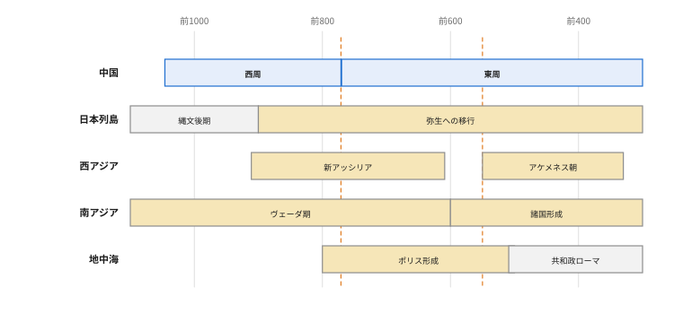
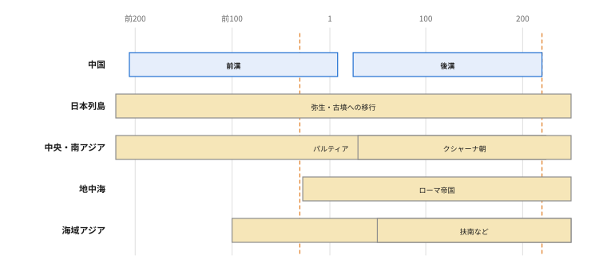
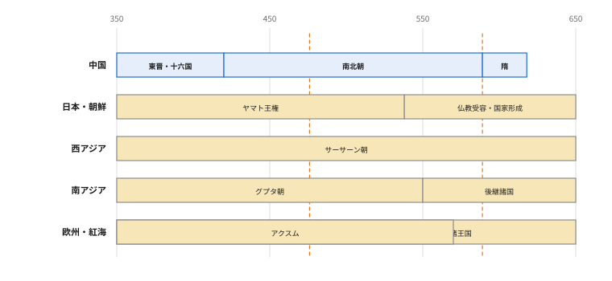
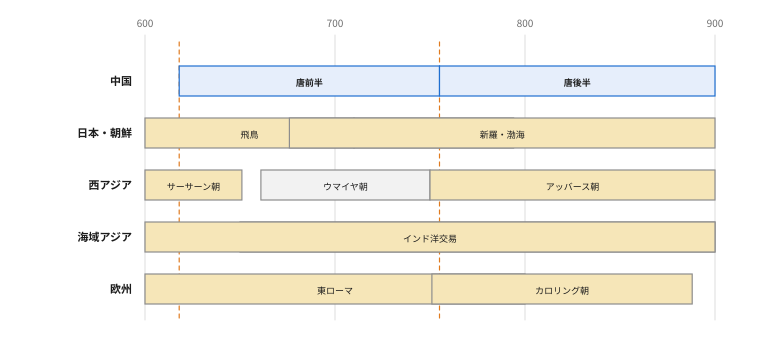
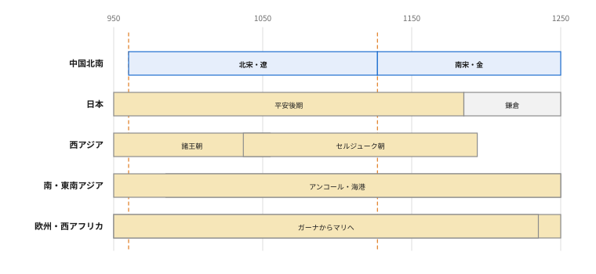
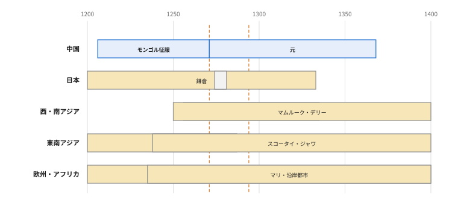
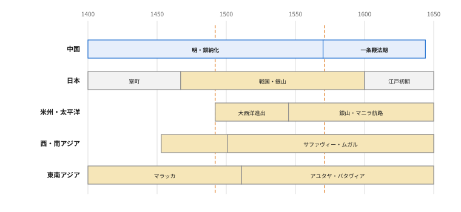
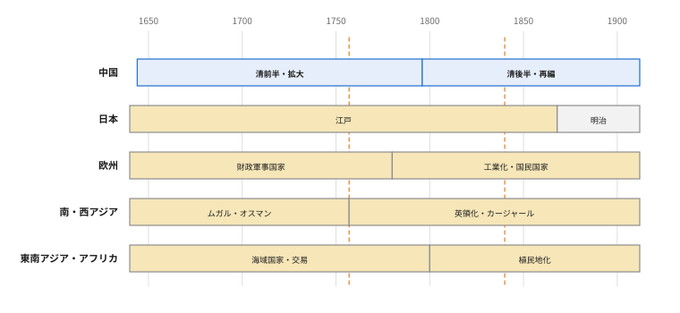
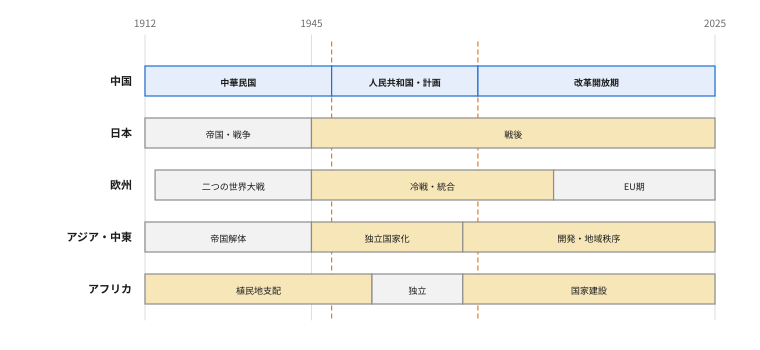

# やる夫で学ぶ中国史 ― 王朝は前王朝の何を捨て、何を受け継いだのか

---
## 登場人物

**やる夫**：
中国（ちゅうごく、Zhōngguó、China）史を王朝名と年号の列として覚えてきた初学者。巨大国家なら皇帝が命令すれば動くと思い込んでいる。

**やらない夫**：
制度史とユーラシア史を教える研究者。王朝の交代より、誰が税を払い、誰が命令を翻訳し、誰が馬と穀物を運ぶのかを重んじる。

**できる子**：
古文書、地図、言語、民族名の整理を担当する。口数は少なく、分かっていることと不明なことを混ぜない。危ない断定を止めるが、親切だとは認めたがらない。

**できる夫**：
世界同時刻盤を担当する比較史の担当。丁寧で行動が速く、中国の外側で同時に何が起きていたかに詳しい。比較を思いつく速さに、前提の確認が追いつかないことがある。

---
## 序幕　同じ地図を、別の国だと思って読む

---
### 0-1　都市の札は動かさない

**やる夫**：
中国史の都市名が無理だお！
｜長安《チャンアン》（ちょうあん、Cháng'ān）、｜洛陽《ルオヤン》（らくよう、Luòyáng）、｜建康《ジエンカン》（けんこう、Jiànkāng）、｜金陵《ジンリン》（きんりょう、Jīnlíng）、｜応天府《インティエンフ》（おうてんふ、Yìngtiānfǔ）、｜大都《ダドゥ》（だいと、Dàdū）、｜燕京《イエンジン》（えんけい、Yānjīng）、｜汴京《ビエンジン》（べんけい、Biànjīng）、｜臨安《リンアン》（りんあん、Lín'ān）……王朝が変わるたびに都市までテレポートしてるように見えるお！

**やらない夫**：
都市が動いたんじゃない。名前と役割が変わったんだ。[^18]
今回は日本の都市を固定した札にする。時代によって札を付け替えるのは禁止だ。

**やる夫**：
｜洛陽《ルオヤン》がある時代は京都で、別の時代には大阪、みたいにはしないんだお？

**やらない夫**：
しない。対応は最後まで固定する。

| 中国の都市圏 | 時代による主な名称 | 固定する日本都市の札 | 記憶する地理的役割 |
|---|---|---|---|
| ｜洛陽《ルオヤン》 | ｜洛邑《ルオイー》（らくゆう、Luòyì）・｜雒陽《ルオヤン》（らくよう、Luòyáng）・｜洛陽《ルオヤン》・｜東都《ドンドゥ》（とうと、Dōngdū） | 京都 | 古い正統性（legitimacy）を背負う内陸の旧都 |
| ｜長安《チャンアン》・｜西安《シエン》（せいあん、Xī'ān） | ｜鎬京《ハオジン》（こうけい、Hàojīng）・｜長安《チャンアン》・｜大興《ダシン》（だいこう、Dàxīng）・｜西京《シジン》（せいけい、Xījīng）・｜西安《シエン》 | 奈良 | 計画的に造られた大陸帝国の西寄りの都 |
| ｜北京《ベイジン》（ぺきん、Běijīng、Peking） | ｜薊《ジ》（けい、Jì）・｜幽州《ヨウジョウ》（ゆうしゅう、Yōuzhōu）・｜燕京《イエンジン》・｜中都《ジョンドゥ》（ちゅうと、Zhōngdū）・大都・｜北平《ベイピン》（ほくへい、Běipíng）・｜北京《ベイジン》 | 東京 | 北方国境に近い軍事・政治首都 |
| ｜南京《ナンジン》（なんきん、Nánjīng、Nanking） | ｜建業《ジエンイエ》（けんぎょう、Jiànyè）・｜建康《ジエンカン》・｜金陵《ジンリン》・｜江寧《ジャンニン》（こうねい、Jiāngníng）・｜応天府《インティエンフ》・｜南京《ナンジン》 | 大阪 | ｜長江《チャンジャン》（ちょうこう、Cháng Jiāng、Yangtze River）下流の経済力を背負う南方の大都市・首都候補 |
| ｜開封《カイフェン》（かいほう、Kāifēng） | ｜汴州《ビエンジョウ》（べんしゅう、Biànzhōu）・｜東京《ドンジン》（とうけい、Dōngjīng）・｜汴京《ビエンジン》・｜開封《カイフェン》 | 名古屋 | ｜大運河《ダユンヘ》（だいうんが、Dà Yùnhé、Grand Canal）と｜黄河《フワンヘ》（こうが、Huáng Hé、Yellow River）交通に支えられた平原の実務首都 |
| ｜杭州《ハンジョウ》（こうしゅう、Hángzhōu） | ｜杭州《ハンジョウ》・｜臨安《リンアン》 | 神戸 | ｜江南《ジャンナン》（こうなん、Jiāngnán）の富と水運を背負う洗練された南方都市 |
| ｜広州《グワンジョウ》（こうしゅう、Guǎngzhōu、Canton） | ｜番禺《パンユイ》（ばんぐう、Pānyú）・｜広州《グワンジョウ》 | 長崎 | ｜南海《ナンハイ》（なんかい、Nánhǎi）交易と外国人が集まる南の窓口 |
| ｜泉州《チュエンジョウ》（せんしゅう、Quánzhōu） | ｜泉州《チュエンジョウ》・｜刺桐《ツートン》（しとう、Cìtóng、Zayton） | 堺 | 民間海商が集まる国際貿易港 |
| ｜上海《シャンハイ》（しゃんはい、Shànghǎi） | ｜上海《シャンハイ》 | 横浜 | 近代の外国貿易から急膨張した新興港湾都市 |
| ｜成都《チェンドゥ》（せいと、Chéngdū） | ｜成都《チェンドゥ》・｜益州《イージョウ》（えきしゅう、Yìzhōu） | 福岡 | 中央から遠いが豊かな盆地を持つ西方の自立的中心 |

**やる夫**：
じゃあ｜唐《タン》（とう、Táng、中古音 dang）の｜長安《チャンアン》は奈良、｜後漢《ドンハン》（ごかん、Dōng Hàn、Eastern Han）の｜洛陽《ルオヤン》は京都、｜元《ユエン》（げん、Yuán）の大都も｜清《チン》（しん、Qīng）の｜北京《ベイジン》も東京、｜六朝《リウチャオ》（りくちょう、Liù Cháo）の｜建康《ジエンカン》も｜明《ミン》（みん、Míng）初の｜南京《ナンジン》も大阪だお。
同じ札の都市が、首都になったり旧都になったり占領都市になったりするのを見るわけかお。

**やらない夫**：
そうだ。京都が平安京の新都、古都、朝廷所在地、観光都市と意味を変えても京都であり続けるように、｜洛陽《ルオヤン》も位置を動かさず、歴史的な意味だけを変える。
比喩は都市の同一性をつかむ補助であって、規模や文化が同じという意味ではない。

---
### 0-2　中国語は一つ、では統治の苦労が消える

**やる夫**：
でも中国なら、みんな中国語で皇帝の命令を聞いたんじゃないかお？
日本の藩より広いだけで、基本は同じ国だお。

**やらない夫**：
その想像をいったんヨーロッパへ置き換えろ。
ローマからパリ、マドリード、ウィーン、ワルシャワ、イスタンブールまでを一人の皇帝が治め、村ではフランス語、イタリア語、スペイン語、ドイツ語、ポーランド語、ギリシア語、トルコ語が話されているとする。
そのうえ北には騎馬移動をする連合国家、西にはオアシス都市、南西には山岳社会がある。
皇帝の命令は、誰が何語で読ませる？

**やる夫**：
えっ……役人が現地語を全部覚えるのかお？

**やらない夫**：
覚える者もいる。通訳も使う。地域の有力者を役人にする。文書だけ共通化する。複数の行政制度を並べる。
漢字による文語は、中世ヨーロッパのラテン語に少し似ている。発音も日常語も違う人が、同じ古典文体を読み書きできる。
ただし漢字は各地の発音で読めるため、ラテン語よりさらに特殊だ。

**やる夫**：
｜広東《グワンドン》（かんとん、Guǎngdōng）の商人と｜福建《フジエン》（ふっけん、Fújiàn）の船員と｜山西《シャンシ》（さんせい、Shānxī）の役人が、口では通じにくくても、紙に書くと制度上はつながることがあるのかお。

**やらない夫**：
そうだ。ただし読み書きできる者は限られるし、同じ文字でも語法や行政慣行は違う。
｜明《ミン》｜清《チン》期には官僚用の共通口語として官話が発達するが、村の全員が話したわけではない。
｜元《ユエン》ではモンゴル語、｜漢語《ハンユイ》、チベット語、ペルシア語系の実務言語が交差し、｜清《チン》では｜満洲《マンジョウ》語、｜漢語《ハンユイ》、モンゴル語、チベット語などが国家運営に使われる。
これは単一言語国家を大きくしたものではなく、ハプスブルク帝国やオスマン帝国のような多言語統治に近い感覚だ。

**やる夫**：
皇帝の詔書を出した瞬間、全国の農民が内容を理解するわけじゃない。
中央文書から地方官、その下の書記、村の有力者、口頭説明へと何段も翻訳されるんだお。
途中で意味も利害も変わりそうだお……。

**やらない夫**：
その変形こそ、これから見る統治だ。

---
### 0-3　小コラム　王朝名はなぜ似て聞こえるのか

**やる夫**：
｜秦《チン》（しん、Qín、上古音 *[dz]i[n]）は「しん」、｜晋《ジン》（しん、Jìn、中古音 tsinH）も「しん」、｜金《ジン》（きん、Jīn、中古音 kim）も「きん」、｜清《チン》も「しん」に近いお。
｜漢《ハン》（かん、Hàn、中古音 xanH）と｜韓《ハン》（かん、Hán、中古音 han）、｜隋《スイ》（ずい、Suí、中古音 zye）と｜周《ジョウ》（しゅう、Zhōu、上古音 *tiw）まで混ざってきたお！
昔の中国人も「次のシンはどのシン？」って困ったのかお？

**できる子**：
そこで読み札の約束。
中国語圏の固有名詞は初出時に、**日本語の読み、現代標準中国語のピンイン、英語の慣用表記がピンインと異なる場合は英語名**を添える。
王朝・国号は、その時代に近い再構音を研究者が示せる場合だけ「上古音」「中古音」も置く。
｜元《ユエン》・｜明《ミン》・｜清《チン》のような近世には地域・身分・宮廷言語の差があり、単一の「当時音」を安全に置けない場合は無理に添えない。
再構音は録音の再生ではなく、韻書・韻文・音写・漢字の系列から組み立てた仮説なので、先頭の `*` は「復元形」を表す。[^29][^30]

**やる夫**：
テムジンやヌルハチみたいに、もともと｜漢語《ハンユイ》の名じゃない人物はどうするんだお？

**できる子**：
漢字音へ無理に戻さず、モンゴル語・｜満洲《マンジョウ》語などの原名が通用している場合はそのラテン文字表記を置く。
中国史料の音写しか手掛かりがない民族名は、ピンインと英語圏の慣用名を併記して、原音そのものとは断定しない。

**やらない夫**：
現代｜北京《ベイジン》語で並べると、｜秦《チン》は **Qín**、｜晋《ジン》は **Jìn**、｜金《ジン》は **Jīn**、｜清《チン》は **Qīng** だ。
日本語の音読みでは接近しても、｜北京《ベイジン》語では子音、声調、語末の `-n / -ng` が違う。
音の変化を比べる基準として中古音まで戻ると、差がさらに見える。
たとえば｜秦《チン》は同時代に近い上古音 `*[dz]i[n]`、｜晋《ジン》・｜金《ジン》・｜清《チン》の各文字は中古音で `tsinH`・`kim`・`tshjeng` と再構される。
後者三つは各王朝創業時の録音再現ではなく、同じ歴史段階へそろえて比較するための基準形だ。

**やる夫**：
似ているのは王朝が同じ音を襲名したからじゃないお。
一音節の国号を、日本語・現代｜北京《ベイジン》語・古い中国語という別々の音の地図へ載せた結果、ある区別は残り、ある区別は合流したんだお。

**やらない夫**：
その通りだ。
以後は「しん」とだけ覚えず、**字・日本語読み・ピンイン・時代**を一組の札にしろ。

---
### 0-4　民族名を直線で結ばない

**やる夫**：
民族も覚えにくいお。
｜匈奴《ションヌ》（きょうど、Xiōngnú）が消えたら｜鮮卑《シエンベイ》（せんぴ、Xiānbēi）、｜鮮卑《シエンベイ》が消えたら｜突厥《トゥジュエ》（とっけつ、Tūjué、Göktürks）、｜突厥《トゥジュエ》が消えたら｜契丹《チダン》（きったん、Qìdān、Khitan）、｜女真《ヌジェン》（じょしん、Nǚzhēn、Jurchen）、モンゴル（Měnggǔ、Mongols）、｜満洲《マンジョウ》（まんしゅう、Mǎnzhōu、Manchu）……名前が違うだけで、ずっと同じ北方民族じゃないのかお？

**できる子**：
不正確。
人は移動し、婚姻し、別の連合に入り、言語を変え、古い政治名を捨てる。
一方で、騎馬軍事、首長への贈与、草原の移動路などは別集団へ継承される。
血統、言語、政治組織、生活様式は別々に追う必要がある。

**やらない夫**：
民族名を見るたびに4本の線を引く。

1. **人の連続**：子孫や移住集団が確認できるか。
2. **言語の連続**：同じ語族、近縁語、別言語、不明のどれか。
3. **政治の連続**：前の国家の制度、称号、部族を再編したか。
4. **名前の連続**：本人の自称か、中国側など他者が付けた総称か。

**できる子**：
4本の線がどれくらいバラバラに動くか、三つだけ先に見せる。

| 名称 | 4本の線はどう食い違うか |
|---|---|
| ｜匈奴《ションヌ》 | 政治の記憶と草原の編成技術は後世へ渡ったが、人・言語の線は追い切れない。｜突厥《トゥジュエ》やモンゴル、欧州のフンの直系祖先とはいえない |
| ｜契丹《チダン》 | 言語はモンゴル語族に近い可能性が高いが、政治の線は｜遼《リャオ》（りょう、Liáo）・｜西遼《シリャオ》（せいりょう、Xī Liáo、Western Liao）で切れ、｜金《ジン》や｜元《ユエン》の家門へ分散した。モンゴル人の旧名ではない |
| ｜女真《ヌジェン》 | 4本がほぼ揃って続く珍しい例。｜金《ジン》の｜女真《ヌジェン》から｜後金《ホウジン》（こうきん、Hòu Jīn、Later Jin）・｜清《チン》の｜満洲《マンジョウ》へ、名称変更と再編を伴いながら比較的明瞭に連続する |

**やる夫**：
血筋が続いても名前が変わるし、名前が似ていても同じ人々とは限らない。
さらに、消えた集団が全滅したとは限らず、別の戸籍や言語へ溶け込むんだお。

**やらない夫**：
その理解で始めよう。
残りの名前は、幕を進めながらその場で4本の線を引いていく。
全部の札が出そろったら、終幕でまとめて並べ直す。

---
### 0-5　「国民の反応」は一つではない

**やる夫**：
政策を詳しくするなら、国民が喜んだか怒ったかを書けばいいお。
減税なら歓迎、増税なら反対。簡単だお！

**やらない夫**：
その「国民」を分解しろ。
前近代の中国には世論調査も全国紙もなく、同じ政策でも立場によって反応が逆になる。
今後は政策を出すたび、少なくとも次の6つの席から見る。

| 反応席 | 主に気にすること |
|---|---|
| 自作農・小作農 | 土地、税、労役、兵役、飢饉時の救済 |
| 地方豪族・宗族 | 土地所有、裁判、地域支配、官職への入口 |
| 官僚・知識人 | 任用、昇進、法の一貫性、皇帝への発言権 |
| 兵士・軍事集団 | 給与、土地、戦利品、家族保障、指揮官との結びつき |
| 商人・職人 | 通貨、関税、道路、治安、専売、移動の自由 |
| 周辺諸集団 | 交易、｜朝貢《チャオゴン》、首長の地位、移住、自治、軍役 |

**やる夫**：
たとえば土地を国が細かく登録すれば、中央官僚は税収が増えて喜ぶ。
でも豪族は隠していた土地を取られ、農民は脱税を防がれる一方、土地権利を公認されることもあるお。
同じ政策に賛成と反対が同時に存在するんだお。

**やらない夫**：
さらに反応は、歓迎、服従、逃亡、戸籍の偽装、賄賂、訴訟、宗教運動、地方反乱など異なる形で現れる。
大反乱が起きなかったから支持されたとも限らない。
史料に声を残しやすい官僚と、声を残しにくい農民・女性・被征服民を同じ重さで読めないことも覚えておけ。

**できる夫**：
ちょうど十日後の公開講座に「永久に滅びない国家の設計図」という比較展示を出せます！
｜周《ジョウ》から現代までの長所を一枚へ集めれば、来場者は王朝交代を一目で理解できます。
申込書は提出済みです。展示題も印刷へ回しましたので、設計だけお願いします。

**やる夫**：
仕事が速すぎるお！
でも歴代王朝の成功だけを合体させれば、最強国家が作れるお。
十日後には公開、歴代皇帝へ売れば時空を超えて宰相だお！

**やらない夫**：
では各幕の終わりに、学んだ長所を設計図へ一行だけ足せ。
消さずに残す。九回の改訂が両立するなら展示できる。

**できる子**：
両立しないなら、印刷を止める。
……別に、あなたの公開処刑を防ぎたいわけじゃない。

---
## 第1幕　神に選ばれた王から、条件付きの王へ――殷・周

---
### 1-1　夏・殷成立編――伝承と甲骨を分ける

**やる夫**：
最初から成立人物を並べるお！
｜夏《シャ》（か、Xià、上古音 *[ɢ]ˤraʔ）の｜禹《ユイ》（う、Yǔ）、｜桀《ジェ》（けつ、Jié）、｜殷《イン》（いん、Yīn、上古音 *ʔər）の｜湯王《タンワン》（とうおう、Tāng Wáng）だお！
禹が洪水を治めて夏を作り、悪い桀を｜湯王《タンワン》が倒したんだお！

**やらない夫**：
ここでは後代の伝承と、同時代に近い考古資料を分けろ。
夏王朝については後世の史書に禹、｜啓《チ》（けい、Qǐ）、桀などの系譜があるが、王名と事件を同時代文字資料で確認できない。
｜二里頭文化《アルリトウウェンフワ》（にりとうぶんか、Èrlǐtóu wénhuà）を夏と結ぶ議論はあるが、遺跡自身が「ここは夏王朝だ」と名乗る文字資料は見つかっていない。

**できる子**：
まず勢力別に置く。

- **夏の伝承系譜**：禹 → 子の啓 → …… → 桀。禹から啓への継承は、賢者を選ぶ政治から父子継承へ移った物語として語られる。
- **｜殷《イン》の創業勢力**：湯。夏最後の桀と敵対し、桀を倒して｜殷《イン》を開いたとされる。
- **交代線**：桀の敗北・死によって夏が終わり、湯の系統へ天命が移った、という形に後世の史書は整えた。ただしこの死亡・交代過程を同時代文字資料では確認できない。

**やる夫**：
史実として確実に会話を再現するのは無理なんだお。

**やらない夫**：
そうだ。
｜殷《イン》になると甲骨文字によって王名、祭祀、戦争、収穫、天候などが確認できる。
ただし甲骨が豊富なのは主に後期の｜安陽《アンヤン》（あんよう、Ānyáng）時代だ。

**できる子**：
確認しやすい｜殷《イン》側も、王統と軍事協力者を分ける。

- **｜殷《イン》王統**：｜盤庚《パンゲン》（ばんこう、Pán Gēng） → …… → ｜武丁《ウーディン》（ぶてい、Wǔ Dīng） → …… → ｜帝辛《ディシン》（ていしん、Dì Xīn）。｜盤庚《パンゲン》は都を後の｜安陽《アンヤン》地域へ移したと伝わり、｜武丁《ウーディン》期には甲骨資料が多い。｜帝辛《ディシン》は最後の王で、後世には｜紂王《ジョウワン》として暴君化された。
- **｜武丁《ウーディン》政権の軍事・祭祀勢力**：｜婦好《フハオ》（ふこう、Fù Hǎo）。｜武丁《ウーディン》の配偶者の一人で、祭祀と軍事を担った。｜婦好《フハオ》が｜武丁《ウーディン》より先に死ぬと、王は繰り返し甲骨で彼女の死後世界を問い、彼女自身の軍事指揮は継承されなかった。
- **王朝交代線**：｜帝辛《ディシン》と｜周《ジョウ》の｜武王《ウーワン》が敵対し、牧野で｜殷《イン》軍が敗れる。｜帝辛《ディシン》の死は｜殷《イン》王統の終わりを決定づけるが、旧｜殷《イン》勢力そのものは直ちに消えず、次の｜周《ジョウ》成立編で再反乱する。

**やる夫**：
｜殷《イン》の政策反応はどう書くんだお？
世論調査がないお。

**やらない夫**：
分かる範囲を限定する。
王都の工房へ青銅器、骨、玉、穀物、人員が集まったことから、王が生産と貢納を集中できたことは分かる。
軍事遠征で王族と従属勢力は戦利品を得る一方、敵対集団は捕虜・貢納・移住の負担を受けた。
祖先祭祀は王族の結束を作るが、王都から遠い勢力は婚姻、贈与、威圧がなければ従い続けない。

**やる夫**：
「｜殷《イン》の民衆は｜湯王《タンワン》を歓迎した」みたいな後世の徳治物語を、そのまま当時の国民反応とは書けない。
早い時代ほど、分からないことを分からないまま残す必要があるんだお。

**やらない夫**：
その姿勢を保ったまま、｜殷《イン》末から｜周《ジョウ》成立へ進もう。

**やらない夫**：
ここで、文字が刻まれた甲骨そのものを見ておこう。後世の物語ではなく、王が何を問うたかへ近づく史料だ。

図1：殷代の牛肩甲骨。刻文は同時代に近い政治・祭祀の問いを伝えるが、王都外の人々の声を直接記録したものではない（タップ／クリックで原寸表示）。

*出典：Gary Lee Todd, Ph.D.「Shang Ox Bone Oracle Bone 01」[Wikimedia Commons](https://commons.wikimedia.org/wiki/File:Shang_Ox_Bone_Oracle_Bone_01.jpg)。CC0。*。

---
### 1-2　殷の王は何を支配していたのか

**やる夫**：
最初の王朝なら、皇帝が中国全土を県に分けて統治したんだお？

**やらない夫**：
いきなり後世の帝国を投影するな。
｜殷《イン》の王が確実に握ったのは、王都、王族、祭祀、軍事遠征、青銅器生産、周辺勢力との従属・同盟関係だ。
現代国家のように領域内の全住民を均等に戸籍化したわけではない。

**やる夫**：
｜安陽《アンヤン》は固定札だとどこだお？

**やらない夫**：
主要対応表の外だが、補助札なら吉野ヶ里に伊勢神宮と軍需工場を重ねた感じだ。
祖先へ問う宗教中心、武器と祭器を作る工房、戦争捕虜、貢納物が王都に集まる。

**やる夫**：
じゃあ王は法律より占いで決めるのかお。
雨が降るか、戦争するか、王妃が出産するかを甲骨に刻む……国家会議が全部神託だお！

**やらない夫**：
神託は気まぐれな迷信というより、王だけが祖先へ正式にアクセスできるという権力装置だ。
王族の祖先と政治秩序が重なっている。

**やる夫**：
その王家を倒した｜周《ジョウ》は、｜殷《イン》の神を否定したんだお？

**やらない夫**：
全面否定すると、｜殷《イン》を倒した自分も単なる反逆者になる。
そこで｜周《ジョウ》は、天は一つの家を永久に選ぶのではなく、徳を失えば命令を取り上げるという天命を語った。
革命を正当化すると同時に、自分も徳を失えば倒されうるという危険な原理を導入した。

**やる夫**：
政権交代を正当化するために作った理屈が、次の反乱軍にも使われるお！

**やらない夫**：
中国王朝史を最後まで貫く仕掛けだ。

---
### 1-3　周成立編――征服直後の死が内戦を招く

**やる夫**：
『｜封神演義《フェンシェンイエンイー》（ほうしんえんぎ、Fēngshén Yǎnyì、Investiture of the Gods）』なら、悪い｜紂王《ジョウワン》と｜妲己《ダジ》（だっき、Dájǐ）を｜太公望《タイゴンワン》（たいこうぼう、Tàigōng Wàng）たちが倒して、正しい｜周《ジョウ》が始まるお！[^21]
王朝成立は善悪決戦だお！

**やらない夫**：
作品札を出せ。
藤崎竜版は｜明《ミン》代小説をさらに再構成した仙人戦だ。
｜太公望《タイゴンワン》のモデルとなる｜呂尚《ルシャン》（りょしょう、Lǚ Shàng）、｜殷《イン》最後の王とされる｜帝辛《ディシン》、｜周《ジョウ》の｜文王《ウェンワン》（ぶんおう、Wén Wáng）・｜武王《ウーワン》（ぶおう、Wǔ Wáng）という名前を覚える入口にはなるが、宝貝や封神計画を史実へ持ち込むな。
｜妲己《ダジ》を王朝滅亡の原因とする話も、後世の「悪女が君主を狂わせた」という定型を強く含む。

**できる子**：
成立人物札を陣営と後継線で並べる。

- **｜殷《イン》王朝と旧｜殷《イン》勢力**：｜帝辛《ディシン》 → 敗死後、王子の｜武庚《ウーゲン》。｜帝辛《ディシン》の死で王朝は終わるが、｜武庚《ウーゲン》は旧｜殷《イン》圏の中心として｜周《ジョウ》へ敵対する。
- **｜周《ジョウ》の父子継承線**：姫昌（｜文王《ウェンワン》） → 子の姫発（｜武王《ウーワン》） → 子の成王。姫昌は｜周《ジョウ》を拡張したが、｜殷《イン》征服前に死んだため、征服は姫発へ引き継がれた。
- **｜周《ジョウ》の協力者**：｜呂尚《ルシャン》（｜太公望《タイゴンワン》・｜姜尚《ジャンシャン》〈きょうしょう、Jiāng Shàng〉）は軍事・政治を支え、｜周公旦《ジョウゴンダン》（しゅうこうたん、Zhōu Gōng Dàn）は｜武王《ウーワン》の弟として王家を支えた。
- **死亡から内戦への線**：｜武王《ウーワン》が勝利後まもなく死ぬ → 幼い成王が即位 → ｜周公旦《ジョウゴンダン》が摂政 → ｜武庚《ウーゲン》と｜管叔《グワンシュ》・｜蔡叔《ツァイシュ》らが摂政に敵対して三監の乱。｜周公旦《ジョウゴンダン》の勝利で東方支配が再編される。

**やる夫**：
｜武王《ウーワン》が勝って即終了じゃないのかお？

**やらない夫**：
｜武王《ウーワン》は勝利後まもなく死ぬ。
幼い成王を｜周公旦《ジョウゴンダン》が補佐すると、｜殷《イン》の旧王族｜武庚《ウーゲン》（ぶこう、Wǔ Gēng）と、｜周《ジョウ》側の｜管叔《グワンシュ》（かんしゅく、Guǎn Shū）・｜蔡叔《ツァイシュ》（さいしゅく、Cài Shū）らが結びついて反乱する。
いわゆる三監の乱だ。
「｜殷《イン》を倒した連合軍」は勝利した瞬間から、戦利品、東方支配、摂政権をめぐって割れる。

**やる夫**：
｜周公旦《ジョウゴンダン》が反乱を鎮圧し、｜洛陽《ルオヤン》＝京都付近に東方統治の拠点を作る。
洛陽＝京都の札がいきなり「西の本拠から遠い旧｜殷《イン》圏を監視する副都」として出るんだお。

**やらない夫**：
そこで｜周《ジョウ》は、王族と功臣を各地へ封じるだけでなく、誰が誰の祖先を祭り、誰が本家で、どの儀礼を使えるかを階層化する。
軍事同盟を親族秩序と礼の秩序へ変換した。

**やる夫**：
政策反応札だお。

**やる夫**：
｜周《ジョウ》の王族・功臣は土地と地位を得るから歓迎。
｜殷《イン》の旧支配層は｜宋《ソン》（そう、Sòng、state of Song）などに祭祀を残す道を与えられる者もいるけど、反乱した者や支配を失う者もいる。
在地の住民から見れば、王朝が変わっても日々の耕作は続き、貢納先と軍役の主人が変わる。
｜周《ジョウ》王室から遠い封国では、数世代後に「｜周《ジョウ》王の代理」より「この地方の君主」という意識が強くなるお。

**やらない夫**：
成立直後の妥協が、数百年後の分裂要因になる。
これが最初の王朝引継書だ。

---
### 1-4　親族へ土地を渡せば全国が家族になるのか

**やる夫**：
｜周《ジョウ》は広い土地をどう治めるんだお？
通信も遅いなら、兄弟や親戚を地方へ送ればいいお。
家族なら裏切らないお！

**やらない夫**：
それが封建（feudal）的な分封だ。だが日本の江戸時代の藩や中世ヨーロッパと完全に同じではない。
王族、功臣、在地勢力へ土地と儀礼上の地位を与え、軍事・貢納・祭祀の網を作る。
創業期には有効だ。

**やる夫**：
ほら成功だお！

**やらない夫**：
200年後の親戚を想像しろ。
｜洛陽《ルオヤン》＝京都の王室から見れば遠縁だが、地方では何世代も土地を治め、独自の軍、婚姻、祭祀、家臣を持つ。
誰への忠誠が強い？

**やる夫**：
顔も知らない洛陽＝京都の本家より、地元で給料をくれる君主だお……。

**やらない夫**：
春秋期になると、｜周《ジョウ》王は正統性の中心ではあっても命令を強制できない。
｜楚《チュ》（そ、Chǔ、上古音 *s-r̥aʔ）、｜秦《チン》、｜斉《チ》（せい、Qí、上古音 *[dz]ˤəj）、｜晋《ジン》などはそれぞれ違う地域社会を統合する。
｜楚《チュ》は｜長江《チャンジャン》中流の文化と｜中原《ジョンユエン》（ちゅうげん、Zhōngyuán）の制度を組み合わせ、｜秦《チン》は西方の軍事国家として育ち、南方には｜百越《バイユエ》（ひゃくえつ、Bǎiyuè）と総称される多様な集団がいる。

**やる夫**：
｜華夏《フワシャ》対異民族という一本線じゃなく、何が｜華夏《フワシャ》か自体が拡大してるんだお。
｜楚《チュ》だって最初は南方の異質な国扱いされても、｜戦国《ジャンウオ》（せんごく、Zhànguó、Warring States）政治の主役になっていく。

**やらない夫**：
民族境界は城壁ではない。服装、礼、言語、婚姻、政治参加によって動く。
｜周《ジョウ》の仕組みは広域秩序を作ったが、成功した地方定着が中央の空洞化を生んだ。

---
### 1-5　世界同時刻盤――国家はどこでも同じ形になるのか

**できる夫**：
世界同時刻盤、起動します！
｜周《ジョウ》が分封秩序を作るころ、日本列島は縄文後期から弥生への長い変化の途中です！
西アジアではアッシリアや後のペルシアにつながる広域帝国が、都市と異民族を軍事・道路・地方総督で束ねます！
インドではヴェーダ祭祀から諸国形成へ進み、地中海ではポリスが育ちます！
同じ800年間を横軸にすると、中央集権へ一列に進んだのではないことが見えます！

図14：紀元前1100〜300年。周の分封秩序と同時に、列島の社会変化、広域帝国、諸国・ポリス形成が別々の時間幅で進む（タップ／クリックで原寸表示）。

**やる夫**：
｜周《ジョウ》だけが未熟な封建制から完成した中央集権（centralization）へ進むわけじゃないんだお。[^15]
通信、税、軍事、宗教の条件に応じて、各地が違う組み合わせを試してる。

**やらない夫**：
そうだ。次は戦争の規模が、家族的な秩序を壊す。

**やる夫**：
設計図第1版。「遠い地方は、信頼できる親族と功臣へ任せる」だお。
中央の通信が遅くても、現地判断で守れるお！

**できる子**：
｜周《ジョウ》王から見た「信頼できる」を、子孫も共有するとは限らない。

---
## 第2幕　人間を数え、土地を測り、国家が直接命令する――戦国・秦・漢

---
### 2-1　強い国は、良い国なのか

**やる夫**：
諸侯が勝手に戦うから混乱するんだお。
一番強い国が全部征服し、法を一つにすれば平和になるお！

**やらない夫**：
戦国の各国も同じことを考えた。
鉄製農具、灌漑、人口増加、歩兵の大軍によって、戦争は貴族の戦車戦から農民を大量動員する総力戦へ変わる。
国家は家柄より、戸籍に載る人口と収穫量を欲しがる。

**やる夫**：
｜秦《チン》なら｜商鞅《シャンヤン》（しょうおう、Shāng Yāng）の改革だお。
民を戸籍に登録し、軍功で爵位を与え、連帯責任で逃亡を防ぎ、土地を耕させる。
古い貴族より国家に役立つ兵士を上げるお。

**やらない夫**：
それまでの｜周《ジョウ》的な世襲秩序を否定し、君主が官僚を任命して県を治める。
成功したか？

**やる夫**：
大成功だお！
｜秦《チン》が六国を滅ぼしたお！

**やらない夫**：
では統一後も戦時動員を続ける。
宮殿、陵墓、道路、長城、遠征へ人を送り、厳しい法を全国へ急速に適用する。
地方の旧貴族、農民、兵士はその国家を自分の国家と思うか？

**やる夫**：
勝つために最適化した装置が、平和に切り替わらないお。
征服の成功が過剰動員を正当化し、二世代目で反乱が連鎖する……。

**やらない夫**：
｜秦《チン》は中央集権に失敗したのではない。[^1]
中央集権を作ることには成功し、その運用負荷と正統性の調整に失敗した。

---
### 2-2　秦統一編――改革者が死んでも制度が残る

**やる夫**：
『キングダム』では｜嬴政《インジェン》（えいせい、Yíng Zhèng）と｜信《シン》（しん、Xìn）が中華統一へ進むお！[^22]
つまり始皇帝が天才だったから｜秦《チン》が勝ったんだお！

**やらない夫**：
｜嬴政《インジェン》が生まれる100年以上前から始めろ。
｜秦《チン》の勝利は一人の英雄ではなく、何代もの君主が改革を撤回しなかった結果だ。

**できる子**：
｜秦《チン》側を王統、その政権を支えた者、敵対国に分ける。

- **改革を継いだ｜秦《チン》王統**：｜孝公《シャオゴン》（こうこう、Xiào Gōng） → ｜恵文王《フイウェンワン》（けいぶんおう、Huìwén Wáng） → …… → ｜昭襄王《ジャオシャンワン》（しょうじょうおう、Zhāoxiāng Wáng） → …… → ｜嬴政《インジェン》（えいせい、Yíng Zhèng、後の始皇帝〈しこうてい、Qín Shǐhuáng〉）。
- **｜孝公《シャオゴン》政権**：｜商鞅《シャンヤン》（しょうおう、Shāng Yāng）が戸籍、軍功爵、県制を進めた。｜孝公《シャオゴン》の死 → 保護者を失った｜商鞅《シャンヤン》が｜恵文王《フイウェンワン》政権に処刑されるが、制度は廃止されず王統へ継承された。
- **｜昭襄王《ジャオシャンワン》政権**：｜范雎《ファンジュ》（はんしょ、Fàn Jū）が外交、｜白起《バイチ》（はくき、Bái Qǐ）が軍事を担う。｜白起《バイチ》は｜長平《チャンピン》（ちょうへい、Chángpíng）で｜趙《ジャオ》（ちょう、Zhào）へ大打撃を与えた後、王命で自死させられ、｜秦《チン》は最有力将軍を失った。
- **｜嬴政《インジェン》政権**：初期は｜呂不韋《ルブウェイ》（りょふい、Lǚ Bùwéi）、統一行政は｜李斯《リスー》（りし、Lǐ Sī）、戦争は｜王翦《ワンジエン》（おうせん、Wáng Jiǎn）・｜王賁《ワンベン》（おうほん、Wáng Bēn）・｜蒙恬《メンティエン》（もうてん、Méng Tián）が担った。｜呂不韋《ルブウェイ》の失脚・死後、｜嬴政《インジェン》の親政が強まる。
- **敵対した六国**：｜韓《ハン》・｜趙《ジャオ》・｜魏《ウェイ》（ぎ、Wèi、上古音 *N-qʰuj-s）・｜楚《チュ》・｜燕《イエン》（えん、Yān）・｜斉《チ》。相互に競争して統一戦線を維持できず、｜秦《チン》に各個撃破された。
- **創業者死亡の衝撃**：始皇帝が前210年に巡幸先で死ぬ → ｜胡亥《フハイ》（こがい、Húhài）・｜趙高《ジャオガオ》（ちょうこう、Zhào Gāo）・｜李斯《リスー》が後継を操作 → 二世皇帝の下で粛清と過剰動員が加速し、反乱への対応力を失う。

**やる夫**：
｜商鞅《シャンヤン》は旧貴族の特権を削り、戦場で功績を上げた者に爵位を与える。
農民を5家・10家の単位で監視し、土地と人口を国家へ直結させる。
旧貴族は当然反発するお。

**やらない夫**：
｜孝公《シャオゴン》が死ぬと｜商鞅《シャンヤン》本人は政争に敗れて処刑される。
だが次の王は改革を廃止しなかった。
改革者を嫌っても、改革で増えた税と兵力は手放せない。
制度が個人から独立した瞬間だ。

**やる夫**：
そのあと｜秦《チン》は｜巴蜀《バシュ》（はしょく、Bā-Shǔ）を取り込み、｜四川盆地《スーチュワンペンディ》（しせんぼんち、Sìchuān Péndìの｜成都《チェンドゥ》＝福岡札の穀物を得る。
｜関中《グワンジョン》の農業、｜四川《スーチュワン》の生産、軍功制、道路がつながり、戦争を続けられるお。

**やらない夫**：
｜嬴政《インジェン》が親政を始めた後、｜秦《チン》は｜韓《ハン》、｜趙《ジャオ》、｜魏《ウェイ》、｜楚《チュ》、｜燕《イエン》、｜斉《チ》を順に滅ぼす。
｜楚《チュ》攻略では若い李信の少数兵案が失敗し、老将｜王翦《ワンジエン》が大軍を要求したという伝承が有名だ。
ここで重要なのは勇気の差ではなく、広い｜楚《チュ》を占領し補給線を守る兵力の見積もりだ。

**やる夫**：
『キングダム』は人物の顔と六国の緊張を覚えるのに強い。
でも作品の信と史料上の李信の人物像は同じではないし、合戦の会話や一騎打ちは物語なんだお。

**やらない夫**：
統一後の政策と反応を並べろ。

**やる夫**：
先に三席を予想するお。
旧六国の王族・貴族は｜郡県制《ジュンシエンジー》で支配基盤を失うから反発。
中央から派遣される官僚は昇進機会が増えるから歓迎。
農民は度量衡と法が同じになり、土地権利も守られるから歓迎だお！

**できる子**：
三席目は根拠より先へ走った。
睡虎地｜秦《チン》簡などの｜秦《チン》法資料には、連帯責任、戸籍、逃亡者、労役を細かく扱う条文が残る。[^31]
標準化で取引や訴訟の基準がそろう利益はある。でも登録は、国家が税と労役の対象を逃さない仕組みでもある。

**やる夫**：
守られる権利だけでなく、数えられる負担も増えるお。
では商人・職人は、貨幣、度量衡、車軌の標準化と道路で広域取引がしやすい。
一方、道路・運河・長城・宮殿・陵墓へ動員される農民と兵士は、統一の便利さより労役を先に受けるお。

**やらない夫**：
残る二席はどうだ。

**やる夫**：
旧国の学者には文書と思想の統制が敵対的に映る。
周辺諸集団には道路と郡県が交易路にもなるけど、軍事進出、移住、徴発の入口にもなる。
政策名を席へ配るだけじゃなく、同じ標準化が誰には取引費用の低下、誰には徴発能力の上昇になるかを予想するんだお。

**やらない夫**：
統一の利益は長期に現れ、負担は直ちに現れる。
｜秦《チン》は「統一して平和にする国家」から「統一後も戦時速度で動員する国家」へ変わりきれなかった。

---
### 2-3　漢は秦を否定したのか

**やる夫**：
｜漢《ハン》は悪い｜秦《チン》を倒した善い｜儒教《ルジャオ》国家だお。
｜秦《チン》の制度は全部捨てたんだお？

**やらない夫**：
郡県、戸籍、税、官僚、皇帝号、統一法、道路網を捨てたら、｜漢《ハン》は広域国家を運営できない。
｜漢《ハン》は｜秦《チン》の機械を残し、運転方法と説明を変えた。

**やる夫**：
最初は功臣や皇族に王国も与えて、分権を少し戻したお。
でも諸侯王が強くなれば削る。
｜秦《チン》の反省で緩め、｜周《ジョウ》の反省でまた締める……両方の失敗の間を揺れるんだお。

**やらない夫**：
武帝期には儒学を官僚の共通教養に取り込み、皇帝を徳と天命の中心として説明する。
ただし行政実務は法、刑罰、文書、監察、財政で動く。
儒家と法家を単純な善悪に分けると、｜漢《ハン》の実像を失う。

**やる夫**：
家族では父への孝、国家では皇帝への忠。
祖先祭祀、家の序列、官僚倫理を一本につなぐから、宗教と政治と家族道徳が分離してないお。

**やらない夫**：
その仕組みは官僚の共通規範を作る一方、家父長権、女性の位置、家格、儀礼の正しさを政治問題にする。
国家は家族を利用し、家族も官職と名誉を通じて国家を利用する。

---
### 2-4　秦末・漢成立編――反秦連合が二陣営へ割れる

**やる夫**：
｜秦《チン》が倒れたら｜劉邦《リウバン》（りゅうほう、Liú Bāng）がすぐ｜漢《ハン》を建てたんだお？
『｜項羽《シャンユイ》（こうう、Xiàng Yǔ）と｜劉邦《リウバン》』は2人の性格勝負だお！[^23]

**やらない夫**：
最初に立ったのは｜劉邦《リウバン》でも｜項羽《シャンユイ》でもない。
紀元前209年、徴発された兵士を率いる｜陳勝《チェンシェン》（ちんしょう、Chén Shèng）・｜呉広《ウーグワン》（ごこう、Wú Guǎng）が反乱する。
期限に遅れれば厳罰を受けるという恐怖と、旧六国復興の期待が各地で結びつく。

**できる子**：
反｜秦《チン》連合は最初から一枚岩ではない。

- **最初の反乱勢力**：｜陳勝《チェンシェン》（ちんしょう、Chén Shèng）・｜呉広《ウーグワン》（ごこう、Wú Guǎng）。蜂起が各地へ波及した後、両者が早くに死んでも反乱は止まらず、「｜秦《チン》へ反抗できる」という合図だけが別勢力へ継承された。
- **｜楚《チュ》復興・項氏勢力**：｜項梁《シャンリャン》（こうりょう、Xiàng Liáng） → 甥の｜項羽《シャンユイ》（こうう、Xiàng Yǔ）。｜項梁《シャンリャン》の戦死後、｜項羽《シャンユイ》が軍事指導権を継ぎ、｜西楚《シチュ》（せいそ、Xī Chǔ）の覇王となる。｜項羽《シャンユイ》は｜劉邦《リウバン》陣営と敵対し、｜垓下《ガイシャ》（がいか、Gāixià）敗北後の自死で｜楚漢戦争《チュハンジャンジェン》（そかんせんそう、Chǔ-Hàn Zhànzhēng）が決着する。
- **｜漢《ハン》王・｜劉邦《リウバン》勢力**：｜劉邦《リウバン》（りゅうほう、Liú Bāng）を、｜張良《ジャンリャン》（ちょうりょう、Zhāng Liáng）が戦略・外交、｜蕭何《シャオヘ》（しょうか、Xiāo Hé）が｜関中《グワンジョン》（かんちゅう、Guānzhōng）の行政・兵站、｜韓信《ハンシン》（かんしん、Hán Xìn）が別働軍、｜陳平《チェンピン》（ちんぺい、Chén Píng）が交渉・離間で支えた。
- **後継関係のねじれ**：｜劉邦《リウバン》の皇帝即位後、｜韓信《ハンシン》ら異姓王は創業の協力者から中央集権の潜在的敵へ変わる。｜韓信《ハンシン》の処刑は、反｜秦《チン》連合の分権的な功臣体制から｜劉《リウ》氏中心の皇帝国家へ移ったことを示す。

**やる夫**：
｜劉邦《リウバン》は｜咸陽《シエンヤン》（かんよう、Xiányáng）へ入り、｜秦《チン》王｜子嬰《ズーイン》（しえい、Zǐyīng）を降伏させる。
そこで｜秦《チン》の帳簿や地図を｜蕭何《シャオヘ》が確保する。
｜項羽《シャンユイ》が旧｜秦《チン》への復讐と戦功の配分を優先するのに対し、｜蕭何《シャオヘ》は「次の国家を動かすデータ」を取るんだお。

**やらない夫**：
｜項羽《シャンユイ》は｜秦《チン》を滅ぼした後、天下を18の王国へ分ける。
戦国諸国を復活させつつ、自分に近い将軍へ土地を配ったため、旧王家、功臣、在地勢力の期待が衝突する。
｜劉邦《リウバン》は辺境の｜漢中《ハンジョン》（かんちゅう、Hànzhōng）へ追いやられるが、｜韓信《ハンシン》を用いて｜関中《グワンジョン》へ戻り、｜楚漢戦争《チュハンジャンジェン》が始まる。

**やる夫**：
｜項羽《シャンユイ》は正面戦で何度も強い。
｜劉邦《リウバン》は｜彭城《ペンチェン》（ほうじょう、Péngchéng）で大敗しても、｜蕭何《シャオヘ》が｜関中《グワンジョン》から兵と食糧を送り、｜韓信《ハンシン》が北方の諸国を落とし、｜張良《ジャンリャン》と｜陳平《チェンピン》が同盟を組み替える。
最後は｜垓下《ガイシャ》で｜項羽《シャンユイ》が包囲され、紀元前202年に｜劉邦《リウバン》が皇帝になる。
個人の武勇より、後方を失わない連合が勝ったんだお。

**やらない夫**：
横山光輝『｜項羽《シャンユイ》と｜劉邦《リウバン》』は役割分担をつかむ入口になる。
ただし｜項羽《シャンユイ》を高潔な武人、｜劉邦《リウバン》を人を使う庶民的指導者として対比する構図は、史料の選択と物語化を含む。

**やる夫**：
｜漢《ハン》初の政策反応札だお。

- ｜秦《チン》の苛酷と見られた法・労役を緩める：農民と兵士には歓迎されやすい。
- 郡県と封国を併用する：功臣・皇族は王になれて満足するが、中央には将来の独立勢力になる。
- 税率と宮廷支出を抑える：小農の再建に有利だが、辺境軍事には資｜金《ジン》不足。
- ｜秦《チン》の官僚・文書を継承する：実務官僚には国家継続、旧六国復興派には｜秦《チン》の再来にも見える。

**やらない夫**：
その後、｜文帝《ウェンディ》（ぶんてい、Wén Dì）・｜景帝《ジンディ》（けいてい、Jǐng Dì）期には倹約と減税が評価される一方、諸侯王の領地を削る政策が｜呉楚七国《ウーチュチグオ》の乱（ごそしちこくのらん、Wú-Chǔ Qīguó zhī Luàn）を招く。
武帝は｜塩鉄専売《イエンティェジュワンマイ》、貨幣統制、｜均輸《ジュンシュ》・｜平準《ピンジュン》、遠征、｜屯田《トゥンティエン》を進める。
中央官僚と軍は資源を得るが、商人は国家競争を嫌い、農民は兵役と税負担を感じ、辺境入植者は土地を得る代わりに危険を負う。
善政か悪政かではなく、誰の安全と財源を優先したかで評価が割れる。

---
### 2-5　匈奴は国境の外の盗賊なのか

**やる夫**：
北の｜匈奴《ションヌ》は、農耕地を略奪するだけの集団だお。
長城を高くして追い払えば終わりだお！

**やらない夫**：
｜匈奴《ションヌ》を一つの草原帝国として見ろ。[^16]
牧畜では家畜を季節ごとに移動させる。首長は部下へ戦利品、絹、穀物、婚姻関係を配り、連合を維持する。
固定農地から税を取る｜漢《ハン》とは財政の仕組みが違う。

**やる夫**：
｜漢《ハン》が交易を閉じれば、｜匈奴《ションヌ》の首長は配る品を失って弱くなる……と思ったら、国境を襲って品を取る圧力が増すお。
贈り物を出せば平和になるけど、｜漢《ハン》の朝廷では屈辱だと批判される。

**やらない夫**：
軍事、互市、和親、称号、贈与はすべて外交手段だ。
ローマ帝国がゲルマン諸集団へ軍務と補助金を与えた関係にも少し似る。
国境は文明と野蛮の線ではなく、人、馬、穀物、絹、情報が出入りする市場だ。

**やる夫**：
｜匈奴《ションヌ》の一部が｜漢《ハン》へ降り、｜漢《ハン》の爵位をもらい、国境内に住むこともある。
｜漢《ハン》人が｜匈奴《ションヌ》側へ逃げることもある。
民族の線より、どの君主に属し、どの軍団と戸籍に入るかが動いてるお。

**やらない夫**：
東北には｜烏桓《ウーフワン》（うがん、Wūhuán）や｜鮮卑《シエンベイ》、西には｜羌《チャン》（きょう、Qiāng、上古音 *C.qʰaŋ）と総称される多様な集団、南には｜百越《バイユエ》の諸社会がある。
｜漢《ハン》は彼らを一律に県民化できず、首長への称号、交易、移住、軍役、郡県化を組み合わせる。

**できる子**：
系譜札。
｜匈奴《ションヌ》の一部は分裂後に｜漢《ハン》領へ入り、後の｜五胡十六国《ウーフシーリウグオ》（ごこじゅうろっこく、Wǔ Hú Shíliù Guó、Sixteen Kingdoms）でも｜匈奴《ションヌ》系を称する政権が現れる。
しかし｜匈奴《ションヌ》から｜突厥《トゥジュエ》、｜契丹《チダン》、モンゴルへ一直線の民族系譜を引くことはできない。
継承されたのは人の一部、草原の政治技術、称号、軍事編成であり、同じ民族の名称変更ではない。

---
### 2-6　繁栄した漢は、なぜ戸籍から人を失うのか

**やる夫**：
｜漢《ハン》は｜秦《チン》より穏やかに統治し、｜儒教《ルジャオ》も入れた。
これで永久政権だお！

**やらない夫**：
土地を失った農民が大地主の保護下へ入ると、国家の戸籍からどう見える？

**やる夫**：
税を払う小農が減るお。
でも豪族の荘園では働いてる。人口が消えたんじゃなく、国家が直接つかめなくなったお。

**やらない夫**：
地方豪族は治安、貸付、灌漑、裁判、教育を担う。
中央から見れば脱税の原因だが、村人から見れば実際に頼れる政府でもある。
宮廷では外戚、｜宦官《フワンウワン》、官僚が幼帝へのアクセスを争う。
辺境軍事と災害救済で財政が傷み、｜黄巾《フワンジン》の乱（こうきんのらん、Huángjīn zhī Luàn）などが起こる。

**やる夫**：
制度が腐敗した、で終えると何も分からないお。
小農を直接把握する制度が、土地集積と人口移動で現実からずれた。
皇帝中心の制度が、皇帝が幼い時の代理権争いを激化させた。
成功した設計が環境変化で弱点に変わったんだお。

**できる子**：
戸籍の落差も置く。
｜後漢《ドンハン》157年の登録人口は約5650万人、西｜晋《ジン》が統一した280年は約1616万人。[^18]
約4000万人が全員死亡した数字ではない。戦争、移住、豪族への従属、行政能力の低下で、国家から見えなくなった人を含む。

**やる夫**：
人口数そのものより、誰を数えられた数字かを読まないと、国家の視界を死亡者数に変えてしまうお。

**やらない夫**：
前漢の広がりを、紀元前60年という一点に固定した地図で確認しよう。王朝名だけでは、内陸アジアとの距離が消えてしまう。

.png)

図2：紀元前60年ごろの漢と周辺。色はこの時点の政治的広がりを示すもので、漢代400年間の固定国境ではない（タップ／クリックで原寸表示）。

*出典：Qiushufang「Han dynasty (60 BC)」[Wikimedia Commons](https://commons.wikimedia.org/wiki/File:Han_dynasty_(60_BC).png)。CC BY-SA 4.0。*。

---
### 2-7　世界同時刻盤――漢はローマと隣国だったのか

**できる夫**：
｜漢《ハン》の時代、日本は弥生から古墳社会へ進みます！
西ではローマ帝国、間にはパルティアやクシャーナ朝、インド洋には南アジアと東アフリカを結ぶ商船、東南アジアには扶南などの港市国家が育ちます！
漢とローマのあいだを空白にしない年表で、中継する政体と海域を確認しましょう！

図15：紀元前220〜紀元250年。漢とローマの併存だけでなく、パルティア、クシャーナ朝、インド洋交易、扶南などが両端をつないだ時間を見る（タップ／クリックで原寸表示）。

**やる夫**：
｜漢《ハン》とローマが直接会議するわけじゃないけど、絹、ガラス、香料、馬、宗教、感染症が中継地を通る。
ソグド人が本格的に活躍する前から、ユーラシアは鎖のようにつながってるお。

**やらない夫**：
そして｜漢《ハン》の崩壊後、その鎖から来た人々と中国北部の住民が、新しい国を作る。

**やる夫**：
設計図第2版。「土地と人口を中央が登録し、地方官と兵士へ直接命令する」だお。
第1版の親族任せより、｜秦《チン》｜漢《ハン》式の直轄が強いお！

**やらない夫**：
第1版は消すなと言った。地方へ任せながら中央が直接命令する方法を、展示までに説明しろ。

---
## 第3幕　五胡は中国を壊したのか、作り替えたのか――三国・晋・十六国・南北朝・隋

---
### 3-1　漢を復活させれば済むのか

**やる夫**：
｜三国《サンウオ》（さんごく、Sānguó、Three Kingdoms）を統一した｜晋《ジン》が｜漢《ハン》の制度を復活させれば、乱世は終わるお！

**やらない夫**：
｜司馬《スーマ》氏は有力皇族へ軍事力を持たせ、簒奪を防ごうとした。
皇族なら王朝を守るという｜周《ジョウ》と同じ期待だ。

**やる夫**：
でも八王の乱で皇族同士が戦うお！
反乱を防ぐための皇族軍が、内戦の主役になるお！

**やらない夫**：
その戦争へ、｜漢《ハン》以来国境内に移住していた｜匈奴《ションヌ》、｜羯《ジェ》（けつ、Jié）、｜鮮卑《シエンベイ》、｜氐《ディ》（てい、Dī）、｜羌《チャン》などの軍事集団も巻き込まれる。
ただし五胡という語は、後世が複雑な集団を5分類にまとめた呼び方だ。
全員が同時に一枚岩で｜漢《ハン》人へ侵入したわけではない。

**やる夫**：
ここで名前を漏らさず整理するお。
｜匈奴《ションヌ》、｜鮮卑《シエンベイ》、｜羯《ジェ》、｜氐《ディ》、｜羌《チャン》だお。
まず｜匈奴《ションヌ》は、北から新しく来た草原軍だお。人の線も｜漢《ハン》の外から引くお！

**できる子**：
外れ。
｜漢《ハン》代から一部は国境内へ移され、軍役を負っていた。｜漢《ハン》・｜前趙《チエンジャオ》へつながる人の線はあるが、政権の住民全体が｜匈奴《ションヌ》だったわけではない。

**やる夫**：
では｜鮮卑《シエンベイ》は一つの民族が、｜慕容《ムロン》、｜拓跋《トゥオバ》、｜宇文《ユイウェン》へ三分したお。

**できる子**：
それも太い線を引きすぎ。
｜鮮卑《シエンベイ》は東北からモンゴル高原東部に広がった複数集団の総称。三つの政治集団は別々の政権を作り、言語の内訳も一枚では復元できない。
｜契丹《チダン》との遠い連関は論じられる。でも｜鮮卑《シエンベイ》全体が｜契丹《チダン》やモンゴルへ改名したのではない。

**やる夫**：
｜羯《ジェ》は｜後趙《ホウジャオ》を建てたから、｜羯《ジェ》語と故地も同じ太さで書けるお？

**できる子**：
書けない。
｜後趙《ホウジャオ》の支配層に関わること以外、起源と言語は確定しない。
中央アジア系の可能性を含む複数説があり、後世に同じ名の大集団として続かない。

**やる夫**：
｜氐《ディ》と｜羌《チャン》は西の二チームだお。｜氐《ディ》が前｜秦《チン》と成｜漢《ハン》、｜羌《チャン》が後｜秦《チン》を建てる。ここは政治の線が引けるお。

**できる子**：
半分だけ合格。
｜氐《ディ》は｜関中《グワンジョン》・甘粛・｜四川《スーチュワン》周辺の農耕と牧畜を組み合わせた諸集団に使われた名称。
｜羌《チャン》は西北・チベット高原東縁の多様な集団に長期間使われた、さらに広い名称。
現代の｜羌《チャン》族と古代史料の｜羌《チャン》を一対一で結べない。

**やる夫**：
五つ全部へ同じ四本線を引こうとして、三回外したお……。
五胡という5チームが外から一斉に攻めた図じゃないんだお。
何世代も｜漢《ハン》領内に住み、｜漢語《ハンユイ》を使い、軍役を負い、｜漢《ハン》風の国号を名乗る者もいる。
一方で独自の部族組織や言語も残す。

**できる子**：
やっと更新できた。
人、言語、政治、名前は、集団ごとに証拠の太さが違う。

**やらない夫**：
ヨーロッパなら、西ローマ帝国内のゴート人部隊、ローマ化した将軍、地方住民、移住集団が、ローマ皇帝の称号やキリスト教を利用して複数王国を作る状況に近い。
外から文明を壊す一方向の話ではない。

---
### 3-2　三国・晋成立編――地方軍から三王朝、さらに簒奪へ

**やる夫**：
ここは『｜三国志《サンウオジー》』の知識があるお！
｜桃園《タオユエン》（とうえん、Táoyuán）の誓い、｜曹操《ツァオツァオ》（そうそう、Cáo Cāo）、｜劉備《リウベイ》（りゅうび、Liú Bèi）、｜孫権《スンチュエン》（そんけん、Sūn Quán）、｜諸葛亮《ジュゲリャン》（しょかつりょう、Zhūgě Liàng）、｜赤壁《チービ》（せきへき、Chìbì）だお！

**やらない夫**：
まず作品を2層に分ける。
｜陳寿《チェンショウ》（ちんじゅ、Chén Shòu）の正史『｜三国志《サンウオジー》（さんごくし、Sānguózhì、Records of the Three Kingdoms）』は3世紀の歴史書。[^24]
後世の小説『｜三国志演義《サンウオジーイエンイー》』は忠義、策略、因果応報を強くした物語で、横山光輝版は主にその世界を漫画化している。
人物名を覚えるには強いが、｜蜀漢《シュハン》（しょくかん、Shǔ Hàn）中心の善悪評価をそのまま制度史にしない。

**できる子**：
｜後漢《ドンハン》崩壊から｜晋《ジン》統一までを、勢力ごとの後継線で置く。

- **反乱と｜後漢《ドンハン》宮廷**：｜張角《ジャンジャオ》（ちょうかく、Zhāng Jiǎo）の｜太平道《タイピンダオ》（たいへいどう、Tàipíng Dào）が｜黄巾《フワンジン》の乱を起こす → 鎮圧のため地方軍が成長。｜董卓《ドンジュオ》（とうたく、Dǒng Zhuó）が｜献帝《シエンディ》（けんてい、Xiàn Dì）を掌握 → ｜董卓《ドンジュオ》の死後も軍閥抗争は収まらない。
- **｜曹《ツァオ》氏・｜魏《ウェイ》**：｜曹操《ツァオツァオ》（そうそう、Cáo Cāo） → 子の｜曹丕《ツァオピ》（そうひ、Cáo Pī）。｜曹操《ツァオツァオ》は｜献帝《シエンディ》を保護下に置き、｜官渡《グワンドゥ》（かんと、Guāndù）で｜袁紹《ユエンシャオ》（えんしょう、Yuán Shào）を破る。｜曹操《ツァオツァオ》の死後、｜曹丕《ツァオピ》が｜献帝《シエンディ》から｜禅譲《シャンラン》を受け｜魏《ウェイ》を建てた。
- **｜劉《リウ》氏・｜蜀漢《シュハン》**：｜劉備《リウベイ》（りゅうび、Liú Bèi） → 子の｜劉禅《リウシャン》（りゅうぜん、Liú Shàn）。｜劉備《リウベイ》を｜諸葛亮《ジュゲリャン》（しょかつりょう、Zhūgě Liàng）が支え、｜劉備《リウベイ》の死後は幼い｜劉禅《リウシャン》を補佐した。｜関羽《グワンユイ》（かんう、Guān Yǔ）の敗死は荊州同盟を壊し、｜劉備《リウベイ》の対呉戦争へ連鎖した。
- **｜孫《スン》氏・｜呉《ウー》（ご、Wú）**：｜孫策《スンツェ》（そんさく、Sūn Cè） → 弟の｜孫権《スンチュエン》（そんけん、Sūn Quán）。｜孫策《スンツェ》の急死後、｜孫権《スンチュエン》が｜江東《ジャンドン》（こうとう、Jiāngdōng）を継ぎ、｜周瑜《ジョウユイ》（しゅうゆ、Zhōu Yú）・｜魯粛《ルス》（ろしゅく、Lǔ Sù）が軍事と｜劉備《リウベイ》との同盟を担った。
- **｜司馬《スーマ》氏・｜晋《ジン》**：｜司馬懿《スーマイー》（しばい、Sīmǎ Yì） → 子の｜司馬師《スーマシー》（しばし、Sīmǎ Shī） → 弟の｜司馬昭《スーマジャオ》（しばしょう、Sīmǎ Zhāo） → 子の｜司馬炎《スーマイエン》（しばえん、Sīmǎ Yán）。｜司馬昭《スーマジャオ》の死後、｜司馬炎《スーマイエン》が｜魏《ウェイ》から｜禅譲《シャンラン》を受け｜晋《ジン》を建て、280年に呉を滅ぼした。
- **敵対線**：｜曹《ツァオ》氏・｜劉《リウ》氏・｜孫《スン》氏が｜三国《サンウオ》として競争し、その｜魏《ウェイ》内部で｜司馬《スーマ》氏が｜曹《ツァオ》氏の実権を奪う。｜晋《ジン》は｜魏《ウェイ》の敵国を倒しただけでなく、｜魏《ウェイ》の中から王統を置き換えて成立した。

**やる夫**：
｜黄巾《フワンジン》の乱を鎮圧するため、地方官と豪族が私兵を増やす。
中央を救うための地方武装が、中央崩壊後の軍閥になるお。
｜董卓《ドンジュオ》が｜洛陽《ルオヤン》＝京都へ入り、｜献帝《シエンディ》を｜長安《チャンアン》＝奈良へ移すと、都の権威と軍事力が完全に分かれる。

**やらない夫**：
｜曹操《ツァオツァオ》は｜献帝《シエンディ》を｜許昌《シュチャン》（きょしょう、Xǔchāng）へ迎え、「皇帝の命令」という正統性を使って諸侯を討つ。
同時に｜屯田《トゥンティエン》で流民と兵士へ土地・種を与え、収穫の一部を国家が取る。
荒地が回復し兵站は安定するが、｜屯田《トゥンティエン》民は一般戸籍より強い国家管理を受ける。

**やる夫**：
｜官渡《グワンドゥ》で｜袁紹《ユエンシャオ》に勝ち華北を統合した｜曹操《ツァオツァオ》が南下する。
｜劉備《リウベイ》と｜孫権《スンチュエン》が臨時同盟を結び、208年の｜赤壁《チービ》で止める。
映画『レッドクリフ』は同盟交渉と水上戦の緊張を見せるけど、｜周瑜《ジョウユイ》・｜諸葛亮《ジュゲリャン》・女性人物の役割や時間順序は映画用に再構成されているお。[^25]

**やらない夫**：
｜赤壁《チービ》はその場で｜三国《サンウオ》を成立させた戦いではない。
｜曹操《ツァオツァオ》が華北、｜孫権《スンチュエン》が｜江東《ジャンドン》、｜劉備《リウベイ》が後に｜益州《イージョウ》を確保する可能性を残した戦いだ。
220年に｜曹丕《ツァオピ》が｜漢《ハン》から帝位を受け｜魏《ウェイ》を建て、221年に｜劉備《リウベイ》が｜漢《ハン》の継承を主張し、229年に｜孫権《スンチュエン》が皇帝を称して｜三国《サンウオ》が揃う。

**やる夫**：
政策反応札だお。

- ｜魏《ウェイ》の｜屯田《トゥンティエン》と戸籍再編：流民には生存手段、国家には穀物、豪族には労働力を奪われる不満。
- 九品官人法：地方の人物評価を制度化するが、名門が評価を独占すると家格制度へ傾く。
- ｜蜀漢《シュハン》の軍事国家化：｜益州《イージョウ》豪族と旧｜劉備《リウベイ》集団の協力が必要。北伐の負担を農民が支える。
- 呉の｜江南《ジャンナン》開発と水軍：山越と総称された在地集団を征討・移住・兵士化し、豪族には新田開発の機会と緊張を生む。

**やらない夫**：
｜魏《ウェイ》を奪った｜司馬《スーマ》氏は、自分と同じ簒奪者を防ぐため皇族へ兵力を与える。
｜晋《ジン》統一を歓迎した民衆も、税制と身分秩序が安定する前に八王の乱へ巻き込まれる。
｜三国《サンウオ》の英雄物語は終わっても、地方軍と名門家格という問題はそのまま｜晋《ジン》へ渡る。

---
### 3-3　南京＝大阪へ逃げた朝廷は、中国なのか

**やる夫**：
｜晋《ジン》の皇族と名門が南へ逃げ、｜建康《ジエンカン》＝大阪に｜東晋《ドンジン》を作る。
北を失ったなら、もう地方政権だお？

**やらない夫**：
彼ら自身は正統な｜晋《ジン》の継承者だと考える。
｜建康《ジエンカン》＝大阪に｜洛陽《ルオヤン》＝京都の朝廷と東北の名門が大挙して移り、地元の豪族と土地を分け合う場面を想像しろ。

**やる夫**：
北から来た名門は家柄を誇るけど、米と船と労働力を持つのは｜江南《ジャンナン》の在地社会だお。
両者が婚姻し、対立し、｜長江《チャンジャン》下流を開発する。
中国の経済重心が南へ動く入口になるお。

**やらない夫**：
言葉も違う。
北方から来た官僚の発音と、呉地域の住民の日常語は同じではない。
文書と古典を共有しても、村での会話、歌、親族慣行は別だ。

**やる夫**：
｜建康《ジエンカン》＝大阪に亡命した政府が、ラテン語文書で官僚制を動かしつつ、地元ではイタリア語やフランス語ほど違う言葉が話される感じかお。

**やらない夫**：
完全な対応ではないが、日本人が多言語性を想像するにはそのくらい離してよい。
「方言」という日本語から受ける、少し訛っただけという印象を捨てろ。

---
### 3-4　北魏は漢化して成功したのか

**やる夫**：
北では｜拓跋《トゥオバ》｜鮮卑《シエンベイ》の｜北魏《ベイウェイ》（ほくぎ、Běi Wèi、Northern Wei）が統一する。
異民族王朝が中国文化を学び、｜漢《ハン》人になったから成功したんだお！

**やらない夫**：
それでは変化を一方向にしすぎる。
｜北魏《ベイウェイ》は｜鮮卑《シエンベイ》の軍事組織、移住民の配置、華北の戸籍・官僚制、仏教の権威を組み合わせた。[^2]
｜洛陽《ルオヤン》＝京都へ遷都し、｜漢《ハン》風の姓、服装、官制を推進したのは事実だが、国家と社会の全員が同じ速度で変わったわけではない。

**やる夫**：
北の軍事拠点に残された｜鮮卑《シエンベイ》系兵士から見れば、洛陽＝京都の宮廷だけが上品な｜漢《ハン》風になり、自分たちは辺境で貧しくなる。
六鎮の乱につながる不満だお。

**やらない夫**：
｜漢《ハン》化政策は統合策であると同時に、旧軍事共同体の地位を下げる再分配だった。
その後、｜東魏《ドンウェイ》（とうぎ、Dōng Wèi、Eastern Wei）・｜西魏《シウェイ》（せいぎ、Xī Wèi、Western Wei）、｜北斉《ベイチ》（ほくせい、Běi Qí、Northern Qi）・｜北周《ベイジョウ》（ほくしゅう、Běi Zhōu、Northern Zhou）へ分かれ、｜北周《ベイジョウ》系の軍事貴族から｜隋《スイ》｜唐《タン》の支配層が出る。

**できる子**：
｜鮮卑《シエンベイ》は消滅したのではない。
多くが｜漢語《ハンユイ》話者の戸籍や貴族家へ入り、別の政治名の下で存続した。
｜宇文《ユイウェン》氏などの名は｜北周《ベイジョウ》へ、｜拓跋《トゥオバ》系の制度は｜隋《スイ》｜唐《タン》の軍事・土地制度へ影響する。
民族名が消えることと、人や制度が消えることは別。

---
### 3-5　十六国・北魏成立編――一斉侵入ではなく、競合する連合国家

**やる夫**：
｜五胡十六国《ウーフシーリウグオ》は国名が多すぎるお。
「異民族が順番に侵入した」でまとめたいお！

**やらない夫**：
成立人物を追えば、一斉侵入ではないと分かる。

**できる子**：
十六国を一列にせず、競争した政権ごとに置く。

- **｜匈奴《ションヌ》系・｜漢《ハン》／｜前趙《チエンジャオ》**：｜劉淵《リウユエン》（りゅうえん、Liú Yuān）が｜晋《ジン》領内の軍事集団を基礎に｜漢《ハン》王を称した。｜劉淵《リウユエン》の死後は子らの継承争いを経て政権が｜前趙《チエンジャオ》（ぜんちょう、Qián Zhào）へ続くが、｜石勒《シーレ》（せきろく、Shí Lè）の｜後趙《ホウジャオ》と敵対して滅ぶ。
- **｜羯《ジェ》系・｜後趙《ホウジャオ》**：｜石勒《シーレ》（せきろく、Shí Lè）が捕虜・流民・軍事集団から台頭し｜後趙《ホウジャオ》（こうちょう、Hòu Zhào）を建てた。｜石勒《シーレ》の死後、｜石虎《シーフ》（せきこ、Shí Hǔ）が権力を奪い、その死後の継承内戦で｜後趙《ホウジャオ》が急速に崩れた。
- **｜氐《ディ》系・前｜秦《チン》**：｜苻堅《フジエン》（ふけん、Fú Jiān）を｜王猛《ワンメン》（おうもう、Wáng Měng）が法・財政・軍事で支え、華北を一時統一した。｜王猛《ワンメン》の死はただちに崩壊を招かなかったが、南征を慎む有力な補佐役を失い、｜淝水《フェイシュイ》（ひすい、Féishuǐ）敗戦後は｜慕容氏《ムロンシー》（ぼようし、Mùróng shì）など従属勢力が離反した。
- **｜鮮卑《シエンベイ》系・｜北魏《ベイウェイ》**：｜拓跋珪《トゥオバグイ》（たくばつけい、Tuòbá Guī） → ｜拓跋《トゥオバ》王統 → ｜馮太后《フェンタイホウ》（ふうたいごう、Féng Tàihòu）の摂政 → ｜孝文帝《シャオウェンディ》（こうぶんてい、Xiàowén Dì）。｜均田《ジュンティエン》・｜三長制《サンジャンジー》から｜洛陽《ルオヤン》遷都へ改革が継承された。
- **南朝の対抗線**：｜東晋《ドンジン》では｜劉裕《リウユイ》（りゅうゆう、Liú Yù）が軍功で台頭し、420年に帝位を奪って｜宋《ソン》（そう、Sòng、中古音 sowngH）を建てた。北の諸政権と敵対しつつ、南でも皇帝家が交代する。

**やる夫**：
｜劉淵《リウユエン》は｜漢《ハン》の皇族との婚姻や臣従の記憶を使い、「｜漢《ハン》」を名乗る。
｜石勒《シーレ》も｜漢《ハン》人官僚を使う。
前｜秦《チン》の｜苻堅《フジエン》は｜氐《ディ》だけの王ではなく、｜王猛《ワンメン》を宰相にして多民族の華北国家を作る。
民族国家というより、軍事連合が中国皇帝の制度を取り込むんだお。

**やらない夫**：
｜苻堅《フジエン》は華北統一後、383年に｜東晋《ドンジン》を倒そうとして｜淝水《フェイシュイ》で敗れる。
敗北そのものより、従属していた｜鮮卑《シエンベイ》・｜羌《チャン》などの指導者が「前｜秦《チン》はもう配分と保護を保証できない」と判断し、離脱したことが崩壊を速めた。
連合帝国は軍事的威信が財政でもある。

**やる夫**：
｜北魏《ベイウェイ》は439年に華北を統一する。
国家が耕地を把握して農民へ配分する｜均田《ジュンティエン》制、村を5家・25家・125家の階層でまとめる｜三長制《サンジャンジー》を進める。

**やらない夫**：
反応を分けろ。

**やる夫**：
戦乱で土地を失った農民には、登録されれば耕地と保護を得る可能性がある。
国家は戸籍と税を回復できる。
大土地所有者や寺院は隠していた戸口を失うので抵抗する。
村の有力者は三長に任命されれば国家権力の末端になれるが、徴税責任も負う。
｜鮮卑《シエンベイ》系軍人は宮廷の｜洛陽《ルオヤン》移転と｜漢《ハン》風官制を、昇進機会と見る者も、旧来の地位を奪う政策と見る者もいるお。

**やらない夫**：
南朝でも、｜劉裕《リウユイ》のような軍人が名門貴族を抑えながら王朝を交代させる。
｜宋《ソン》、｜斉《チ》、｜梁《リャン》、｜陳《チェン》と皇帝家は変わるが、｜建康《ジエンカン》＝大阪の官僚・貴族・寺院・商業社会は続く。
北の王朝名が変わるたびに人が入れ替わるわけでも、南の王朝が同じ国家のままでもない。

---
### 3-6　仏教は外国宗教だから受け入れられないのか

**やる夫**：
中国には祖先祭祀と｜儒教《ルジャオ》がある。
親を捨てて出家する仏教は家族道徳に反するから、広がらないはずだお。

**やらない夫**：
戦乱、飢饉、短命な王朝の世界で、祖先と国家だけで死後や苦難を説明できるか？

**やる夫**：
仏教は王朝が滅びても続く宇宙観、来世、因果、救済、僧院共同体を与える。
皇帝にとっても巨大仏像や寺院を作れば、言語や出自の違う臣民を仏法で包めるお。

**やらない夫**：
一方で僧院は土地と労働力を集め、課税や兵役から外れることがある。
国家は保護と弾圧を繰り返す。
道教も教団と国家儀礼を発達させ、｜儒教《ルジャオ》も家族倫理だけでなく正統性の言語として再編される。
三つは別々の箱ではなく、人は祖先祭祀をしながら仏寺へ行き、道教儀礼を頼む。

**やらない夫**：
北魏で作られた仏像を見れば、「外国宗教の受容」が翻訳語だけでなく、石材、衣文、礼拝空間を作り替える仕事だったと分かる。

図3：北魏時代の石造仏像。造像は仏教受容の物質的証拠だが、像だけから信者全員の信仰内容までは復元できない（タップ／クリックで原寸表示）。

*出典：Gary Todd「Northern Wei Stone Buddha Sculpture」[Wikimedia Commons](https://commons.wikimedia.org/wiki/File:Northern_Wei_Stone_Buddha_Sculpture.jpg)。CC0。*。

---
### 3-7　隋はなぜ秦と同じ速度で倒れたのか

**やる夫**：
｜北周《ベイジョウ》を継いだ｜隋《スイ》が南朝を倒し、中国を再統一したお！
今度こそ成功例を学び、無理をしなければいいお。

**やらない夫**：
｜隋《スイ》は北朝の軍事・行政制度を受け継ぎ、｜科挙《ケジュ》の原型を整え、｜均田《ジュンティエン》的な土地把握を進め、｜大運河《ダユンヘ》で北の政治中心と南の穀倉を結ぶ。[^3]
｜長安《チャンアン》＝奈良と｜洛陽《ルオヤン》＝京都を巨大帝国の両軸にする。

**やる夫**：
運河は｜南京《ナンジン》＝大阪方面の米を｜長安《チャンアン》＝奈良・｜洛陽《ルオヤン》＝京都、さらに北方軍へ送る国家の血管だお。
南北統一という新環境に必要なインフラだお。

**やらない夫**：
同時に宮殿、運河、東方遠征を進めたら？

**やる夫**：
｜高句麗《ガオゴウリ》（こうくり、Gāogōulí、Goguryeo）遠征で兵站が破綻し、徴発された農民と兵士が反乱する。
｜秦《チン》と同じだお！
短期統一を可能にした動員力を、統一後も最大出力で使って壊れたお。

**やらない夫**：
次の｜唐《タン》は｜隋《スイ》を暴君の王朝として否定するが、｜隋《スイ》の都、運河、官僚制、法、土地制度をほぼ丸ごと使う。
王朝交代とは、OSを消すより管理者名と運用方針を変えることが多い。

---
### 3-8　隋再統一編――北の軍事国家が南の戸籍と水運を継ぐ

**やる夫**：
｜隋《スイ》の成立は、北朝が強くなって南朝を倒した、で終わりじゃないのかお？

**やらない夫**：
｜北周《ベイジョウ》の外戚だった｜楊堅《ヤンジエン》（ようけん、Yáng Jiān）が、幼い皇帝の摂政から実権を握り、581年に帝位を奪って｜隋《スイ》を建てる。
妻の｜独孤伽羅《ドゥグチェルオ》（どっこから、Dúgū Qiéluó）は皇后として後継・宮廷政治へ強い影響を持った。
｜楊堅《ヤンジエン》は｜文帝《ウェンディ》、子の｜楊広《ヤングワン》（ようこう、Yáng Guǎng）は｜煬帝《ヤンディ》となる。

**できる子**：
再統一を、｜隋《スイ》王家・協力者・敵対王朝で分ける。

- **｜北周《ベイジョウ》から｜隋《スイ》への王統線**：｜北周《ベイジョウ》（ほくしゅう、Běi Zhōu）の外戚だった｜楊堅《ヤンジエン》（ようけん、Yáng Jiān、｜文帝《ウェンディ》〈ぶんてい、Wén Dì〉） → 子の｜楊広《ヤングワン》（ようこう、Yáng Guǎng、｜煬帝《ヤンディ》〈ようだい、Yáng Dì〉）。｜楊堅《ヤンジエン》は幼帝の摂政から帝位を奪い、｜北周《ベイジョウ》の制度と軍事基盤を継承した。
- **｜楊堅《ヤンジエン》政権**：皇后の｜独孤伽羅《ドゥグチェルオ》（どっこから、Dúgū Qiéluó）が後継政治へ影響し、｜高熲《ガオジョン》（こうけい、Gāo Jiǒng）が行政と戦略、｜賀若弼《ヘルオビ》（がじゃくひつ、Hèruò Bì）・｜韓擒虎《ハンチンフ》（かんきんこ、Hán Qínhǔ）が南征を担った。
- **南朝｜陳《チェン》の敵対勢力**：｜陳《チェン》（ちん、Chén、中古音 drin）の後主・｜陳叔宝《チェンシュバオ》（ちんしゅくほう、Chén Shūbǎo）。589年に｜隋《スイ》軍へ降伏し、南北の皇帝対立が終わった。
- **死亡と継承の衝撃**：｜独孤伽羅《ドゥグチェルオ》の死後、宮廷の均衡が変わり、｜楊広《ヤングワン》が即位した。｜煬帝《ヤンディ》が618年に反乱軍側の将兵に殺されると、｜隋《スイ》の名を掲げる求心力が失われ、｜李淵《リユエン》（りえん、Lǐ Yuān）ら競争者が各地の軍と官僚を奪い合った。

**やる夫**：
｜文帝《ウェンディ》は南朝｜陳《チェン》を倒しても、南方官僚を全員追放せず、旧｜陳《チェン》の戸籍と人材を取り込む。
北の律令と軍事、南の穀物と水運を接続するお。

**やらない夫**：
｜開皇律《カイフワンル》は刑罰体系を整理し、中央では｜三省六部《サンシェンリウブ》につながる官制を整え、州県を簡素化する。
戸籍の再調査、｜均田《ジュンティエン》、租税、義倉も進める。

**やる夫**：
政策反応札。

- 統一と法の整理：長年の国境が消え、商人・旅行者・官僚には便利。
- 戸籍再調査：登録から漏れていた民や豪族には負担、土地を認められる小農には保護。
- 義倉：平時の穀物拠出は負担だが、飢饉時には救済になる。
- 南北官僚の統合：旧北朝人には地位競争、旧南朝人には征服された不安と中央進出の機会。

**やらない夫**：
｜煬帝《ヤンディ》は｜長安《チャンアン》＝奈良だけでなく｜洛陽《ルオヤン》＝京都を大規模な｜東都《ドンドゥ》とし、｜大運河《ダユンヘ》を整備する。
都の食料、北方軍、｜江南《ジャンナン》経済を結ぶ合理的な政策だ。
だが建設時の労役、｜高句麗《ガオゴウリ》遠征、巡幸、宮殿建設が同時に重なり、合理的な事業の合計が耐えられない負担になる。

**やる夫**：
一つずつなら必要でも、全部を同じ世代にやれば民衆には「統一の利益」より徴発が先に来る。
地方反乱軍には旧貴族、官僚、農民、軍人が混ざり、次の｜唐《タン》の創業者もその一人になるんだお。

---
### 3-9　世界同時刻盤――中国だけが分裂していたのか

**できる夫**：
｜南北朝《ナンベイチャオ》（なんぼくちょう、Nánběicháo、Northern and Southern Dynasties）期、日本ではヤマト王権が朝鮮半島・中国との交流を通じて国家形成を進めます！
西では西ローマ帝国が解体し、東ローマ帝国は継続、ゲルマン諸王国がローマ制度とキリスト教を継承します！
中東ではサーサーン朝、インドではグプタ朝とその後継、東南アジアでは扶南、真臘などが交易路を押さえます！
アフリカではアクスムが紅海交易とキリスト教世界へつながります！
476年だけを文明の切断線にせず、各地で制度が残り方を変える様子を並べます！

図16：350〜650年。中国と西ローマ旧領の双方で政体が分かれても、皇帝号、官僚制、宗教、交易は異なる後継国家へ移った（タップ／クリックで原寸表示）。

**やる夫**：
中国の｜五胡十六国《ウーフシーリウグオ》とヨーロッパのローマ後継国は、どちらも「文明が消えた」ではなく、移住集団が旧帝国の制度と宗教を使って新国家を作る時代なんだお。
つまり五胡の移動は、ゲルマン民族大移動の中国版だお。同じ模型を二つ置けば比較展示が完成だお！

**できる夫**：
対応は速いですが、同じ模型にはできません。
華北では｜晋《ジン》領内へ以前から移住・編成されていた軍事集団が多く、南には｜東晋《ドンジン》という皇帝国家が続きます。
西では西ローマ皇帝位が消えた後も東ローマ帝国が続き、旧西領では別の王号とローマ制度が組み合わされました。
比較できるのは「移住集団が旧制度を使った」という問いで、移住規模、皇帝位の残り方、宗教組織の位置まで同じという答えではありません。

**やる夫**：
地名を同時上映するだけじゃなく、似て見える二例のどの変数が違うかを出すのが比較なんだお。

**やらない夫**：
そして｜唐《タン》は、その混合から生まれた国際帝国だ。

**やる夫**：
設計図第3版。「生活と軍制が違う集団には別制度を認め、文書と翻訳で束ねる」だお。
全国を一律にする第2版は、少し緩めるお。

**できる子**：
消すのは禁止。
一律の法と別制度の境界を、まだ書いていない。

---
## 第4幕　混ざっているから世界帝国になれる――唐

---
### 4-1　唐は純粋な漢人王朝へ戻ったのか

**やる夫**：
｜隋《スイ》を倒した｜唐《タン》は、外国風になった北朝を終わらせて｜漢《ハン》の中国へ戻したんだお？

**やらない夫**：
｜唐《タン》の皇室と支配層は、｜北周《ベイジョウ》・｜隋《スイ》へ続く西北の軍事貴族社会から出た。[^4]
｜漢語《ハンユイ》と｜儒教《ルジャオ》古典を使う一方、｜鮮卑《シエンベイ》系を含む北方諸集団との婚姻、騎馬軍事、草原的な称号感覚にも親しい。
「｜漢《ハン》人か胡人か」を現代の国籍のように二択にすると理解できない。

**やる夫**：
｜唐《タン》｜太宗《タイゾン》が中国皇帝であると同時に、草原側から天可汗と呼ばれるのも、二重の正統性なんだお。
ヨーロッパで一人の君主がローマ皇帝とドイツ王とイタリア王を兼ねる感じだお。

**やらない夫**：
その比喩でよい。
｜唐《タン》は｜隋《スイ》の制度を否定する物語を作るが、｜長安《チャンアン》＝奈良、｜洛陽《ルオヤン》＝京都、｜大運河《ダユンヘ》、律令、官僚制、｜科挙《ケジュ》、土地・兵役制度を継承する。
新しいのは、それらを北方・中央アジアとの大規模な外交と軍事へ接続したことだ。

**やる夫**：
｜長安《チャンアン》＝奈良の都に、朝鮮人、日本人、ソグド人、ペルシア人、インド僧、テュルク系兵士が住み、街では複数言語が飛び交う。
日本史の奈良に、コンスタンティノープルとバグダードの国際性を足した感じだお。

**やらない夫**：
人物像も史料批判が要る。次の太宗像は本人を前に描いた写生ではなく、明代に制作された後世の皇帝表象だ。

図4：明代に描かれた唐太宗像。唐太宗の実際の顔の記録というより、後世が理想の皇帝をどう可視化したかを読む資料である（タップ／クリックで原寸表示）。

*出典：作者不詳「TangTaizong」[Wikimedia Commons](https://commons.wikimedia.org/wiki/File:TangTaizong.jpg)。パブリックドメイン。*。

---
### 4-2　唐成立編――統一戦争の後にも続いた王家の内戦

**やる夫**：
｜隋《スイ》が倒れたら｜唐《タン》｜高祖《ガオズ》｜李淵《リユエン》が即位し、名君｜太宗《タイゾン》が完成させたんだお。

**やらない夫**：
｜隋《スイ》末には｜李密《リミ》、｜竇建徳《ドウジエンデ》、｜王世充《ワンシーチョン》、｜梁師都《リャンシードゥ》など多数の勢力がいる。
｜李淵《リユエン》は617年に｜太原《タイユエン》（たいげん、Tàiyuán）で挙兵し、｜長安《チャンアン》＝奈良を取り、618年に｜唐《タン》を建てたにすぎない。
全国支配はその後の戦争で作られる。

**できる子**：
｜唐《タン》王家、統一戦争の敵、政権を支えた集団に分ける。

- **｜隋《スイ》末の競争勢力**：｜李密《リミ》（りみつ、Lǐ Mì）、｜竇建徳《ドウジエンデ》（とうけんとく、Dòu Jiàndé）、｜王世充《ワンシーチョン》（おうせいじゅう、Wáng Shìchōng）、｜梁師都《リャンシードゥ》（りょうしと、Liáng Shīdū）らが別々の軍・都市・税源を持ち、李氏勢力と敵対した。
- **｜唐《タン》の父子線**：｜李淵《リユエン》（りえん、Lǐ Yuān、｜高祖《ガオズ》〈こうそ、Gāozǔ〉） → 子の｜李世民《リシーミン》（りせいみん、Lǐ Shìmín、｜太宗《タイゾン》〈たいそう、Tàizōng〉） → …… → ｜高宗《ガオゾン》（こうそう、Gāozōng）。｜李世民《リシーミン》は統一戦争の主力だが、｜玄武門《シュエンウーメン》（げんぶもん、Xuánwǔmén）で兄の｜李建成《リジエンチェン》（りけんせい、Lǐ Jiànchéng）と弟の｜李元吉《リユエンジ》（りげんきつ、Lǐ Yuánjí）を殺し、父に譲位を迫って後継となった。
- **｜太宗《タイゾン》政権**：｜房玄齢《ファンシュエンリン》（ぼうげんれい、Fáng Xuánlíng）・｜杜如晦《ドゥルフイ》（とじょかい、Dù Rúhuì）が政策、｜魏徴《ウェイジェン》（ぎちょう、Wèi Zhēng）が諫言、｜長孫無忌《ジャンスンウージ》（ちょうそんむき、Zhǎngsūn Wújì）が外戚・重臣として支えた。
- **女帝の｜周《ジョウ》**：｜高宗《ガオゾン》の皇后だった｜武則天《ウーゼティエン》（ぶそくてん、Wǔ Zétiān）が、｜高宗《ガオゾン》の死後に子の皇帝たちを介して権力を握り、690年に｜周《ジョウ》を建てて李氏王統を一時中断した。
- **｜武則天《ウーゼティエン》後の李氏復帰**：｜李隆基《リロンジ》（りりゅうき、Lǐ Lóngjī、｜玄宗《シュエンゾン》〈げんそう、Xuánzōng〉）が政争を勝ち抜き、｜唐《タン》王統を安定させた。後半には｜安禄山《アンルシャン》（あんろくざん、Ān Lùshān）が｜唐《タン》の辺境軍から反乱勢力へ転じ、反乱中に殺されても配下の軍事政権はすぐには消えなかった。

**やる夫**：
｜李世民《リシーミン》は｜虎牢《フラオ》（ころう、Hǔláo）の戦いで｜王世充《ワンシーチョン》と｜竇建徳《ドウジエンデ》を破り、東方の主要勢力を崩す。
でも統一後、兄の皇太子｜李建成《リジエンチェン》との後継争いがあり、｜玄武門《シュエンウーメン》で兄弟を殺して父から帝位を譲らせる。
名君伝説の前に、創業家の内戦があるお。

**やらない夫**：
｜太宗《タイゾン》はその正統性の弱さを、官僚の諫言を聞く君主、律令を守る君主、国外勢力を包摂する天可汗という複数の姿で補う。

**やる夫**：
初期政策の反応札だお。

- ｜均田《ジュンティエン》・｜租庸調《ズヨンディャオ》：登録小農には土地利用の根拠、国家には税と労役。人口移動や土地集中が進むと帳簿と現実がずれる。
- ｜府兵制《フビンジー》：農民兵に土地と地位を与える一方、遠征が長期化すると農業と両立しない。
- ｜唐《タン》律：官僚には統一基準、家族秩序を法に組み込まれる女性・奴婢・被支配者には非対称な秩序。
- ｜科挙《ケジュ》：地方の学者に中央進出の道を開くが、教育資源を持つ家が有利。
- 国際交易と宗教保護：商人、ソグド人、仏僧には機会。排外感情や財政危機時には攻撃対象にもなる。

**やらない夫**：
｜武則天《ウーゼティエン》は旧来の関隴貴族や李氏皇族を抑え、｜科挙《ケジュ》出身者や新しい官僚を登用する。
旧名門には簒奪者、新興官僚には上昇機会、仏教勢力には保護者と映る。
女性皇帝だったことだけでなく、人事市場を組み替えたから強い抵抗と支持を同時に生んだ。

**やる夫**：
｜玄宗《シュエンゾン》初期は財政・官僚制を整えるけど、辺境戦争が常態化すると｜節度使《ジェドゥシー》へ兵と財源を集中する。
｜安禄山《アンルシャン》はソグド系・｜突厥《トゥジュエ》系の背景を持つ軍人で、｜唐《タン》の多民族軍事システムから出世した。
反乱は「外国人が｜唐《タン》を裏切った」より、帝国が作った巨大辺境軍が中央政治へ反転した事件なんだお。

---
### 4-3　突厥は匈奴の復活なのか

**やる夫**：
｜匈奴《ションヌ》の次に｜突厥《トゥジュエ》が草原を支配したなら、｜匈奴《ションヌ》が名前を変えたんだお？

**できる子**：
直結できない。
｜匈奴《ションヌ》帝国崩壊後の草原では、｜鮮卑《シエンベイ》、｜柔然《ロウラン》（じゅうぜん、Róurán）など複数の連合が興亡した。
6世紀に｜突厥《トゥジュエ》が｜柔然《ロウラン》を倒し、テュルク語系の可汗国を作った。[^17]
同じ草原政治の技術を利用しても、政治共同体と言語系統は別に確認する必要がある。

**やる夫**：
｜柔然《ロウラン》はどこへ行ったんだお？

**できる子**：
一部は｜突厥《トゥジュエ》へ編入され、一部は移動したと考えられる。
ヨーロッパのアヴァールとの関係は有力説の一つだが確定ではない。
「国名が消えた＝全員死亡」ではない。

**やらない夫**：
｜唐《タン》は東｜突厥《トゥジュエ》を軍事的に破り、草原の集団を内地へ移し、首長へ｜唐《タン》の官位を与え、都の軍へ編入する。
しかし｜唐《タン》が直接、草原の全家畜と全遊牧民を県のように管理したわけではない。

**やる夫**：
草原の首長から見ると、｜唐《タン》皇帝は外国の敵だけでなく、爵位と絹を配る上位首長にもなる。
｜唐《タン》の官位を持ったまま自分の部族を率つ者もいるお。

**やらない夫**：
｜唐《タン》の辺境統治は、フランスの県制より、ハプスブルク皇帝がハンガリー貴族やクロアチア軍事境界を別契約で束ねる仕組みに近い。
地域ごとに同じ法律をそのまま適用しない。

---
### 4-4　ソグド人は商人であり、軍人であり、中国人でもある

**やる夫**：
シルクロードは中国人とローマ人が一本道で絹を売買する道だお？

**やらない夫**：
長距離交易は多数の中継者で動く。
ソグド人はサマルカンドなどを中心とするイラン系言語の都市民で、交易植民地を中央アジアから中国北部まで作った。[^5]

**やる夫**：
ペルシア語系を話し、ゾロアスター教、仏教、マニ教などを持ち込み、｜漢《ハン》姓を名乗り、｜唐《タン》の軍人や官僚にもなる。
「外国商人」という職業だけでは括れないお。

**やらない夫**：
｜安禄山《アンルシャン》の「安」はソグド系出自を示す姓と関係するが、本人は多民族的な辺境軍事社会で育った。
反乱を「外国人が｜唐《タン》を裏切った」とだけ説明すると、｜唐《タン》軍側にも多数の非｜漢《ハン》人兵士がいたこと、反乱側にも｜漢《ハン》人官僚や兵士がいたことを失う。

**できる子**：
系譜札。
ソグド国家が消えた後、ソグド系住民は中国、中央アジア、イスラム圏へ同化し、ソグド人という独立した民族名は薄れる。
しかし商業網、音楽、銀器、宗教語彙、家系は各地へ残る。

**やる夫**：
民族が残る方法は、同じ旗を1000年掲げることだけじゃないんだお。
別の言語と戸籍へ入りながら、文化や家族の断片が残る。

---
### 4-5　吐蕃・回鶻・南詔は唐の地方勢力なのか

**やる夫**：
｜唐《タン》の地図が広いなら、周辺国は全部｜朝貢《チャオゴン》する属国だお？

**やらない夫**：
｜朝貢《チャオゴン》文書の上下表現と、現実の軍事力を分けろ。
｜吐蕃《トゥボ》（とばん、Tǔbō、Tibetan Empire）はチベット高原を統一した強国で、｜唐《タン》と婚姻も戦争も行い、一時は｜長安《チャンアン》＝奈良を占領する。
｜唐《タン》から見た「蕃」でも、独自の王権、軍、文字、外交を持つ帝国だ。

**やる夫**：
｜回鶻《フイフ》（かいこつ、Huíhú、Uyghur Khaganate）は｜突厥《トゥジュエ》を倒したテュルク語系の可汗国で、｜安史《アンシー》の乱（あんしのらん、Ān-Shǐ zhī Luàn）では｜唐《タン》を助ける。
援軍の代価として絹と交易特権を得る。
｜唐《タン》が一方的に支配してるんじゃなく、弱った｜唐《タン》が草原帝国を雇ってるお。

**できる子**：
｜回鶻《フイフ》可汗国が崩壊すると、集団の一部は｜甘州《ガンジョウ》、天山北部、タリム盆地へ移る。
そこでオアシス住民と混合し、仏教・マニ教・後にはイスラムを受容する。
現代ウイグル人形成への重要な一要素だが、8世紀｜回鶻《フイフ》の全員がそのまま現代まで移動したわけではない。

**やらない夫**：
南西の｜南詔《ナンジャオ》（なんしょう、Nánzhào）も、｜唐《タン》の一県ではない。
｜雲南《ユンナン》の複数集団を束ね、｜唐《タン》と｜吐蕃《トゥボ》の間で同盟を変え、東南アジアとも接続する。
後の大理国や現代の白族・彝族などとの歴史的関係はあるが、一民族国家として単純化できない。

**やる夫**：
中国周辺は空白地帯じゃなく、別の国家と交易圏が並ぶ。
｜唐《タン》の「天下」は外交文書上の世界観で、実際の主権地図とは違うお。

---
### 4-6　強い辺境軍を置けば安全なのか

**やる夫**：
｜吐蕃《トゥボ》、｜突厥《トゥジュエ》、｜契丹《チダン》がいるなら、国境ごとに強い将軍を置けばいいお。
現地判断で兵を動かせる｜節度使《ジェドゥシー》だお！

**やらない夫**：
初期の｜府兵制《フビンジー》は、国家が土地と農民兵を把握する前提だった。
土地所有と人口移動が変わり、長期遠征が増えると、兵農一致は維持できない。
そこで職業兵と辺境司令官へ依存する。

**やる夫**：
｜節度使《ジェドゥシー》は現地の兵、財源、部下の人事を握る。
外敵には強いけど、中央が弱ると自分が王になれるお。

**やらない夫**：
｜安史《アンシー》の乱後、｜唐《タン》は反乱を鎮圧するため、さらに別の｜節度使《ジェドゥシー》へ権限を与える。
問題を解くため問題の原因を増やす。

**やる夫**：
中央は軍人を信用できず、｜宦官《フワンウワン》に禁軍を預ける。
皇帝に家族を持たない｜宦官《フワンウワン》なら世襲しないと思ったら、宮廷へのアクセスを独占するお。

**やらない夫**：
土地と人口を直接把握できなくなると、｜租庸調《ズヨンディャオ》から両税法へ移り、現実の資産と居住地を基準に夏秋2回徴税する。
これは制度の崩壊ではなく、旧前提を捨てた適応だ。
ただし地方軍、塩税、｜宦官《フワンウワン》、官僚の利害を一つへ戻せず、｜唐《タン》は緩やかに解体する。

**できる子**：
戸籍は755年の約890万戸・5290万人から、764年の約290万戸・1690万人へ落ちる。[^34]
九年で人口の3分の2が死んだ、という意味ではない。反乱地域を数えられず、流民と軍戸が通常戸籍から外れた結果を含む。

**やる夫**：
｜租庸調《ズヨンディャオ》は登録された成年男子と給付地を前提に、租の穀物、調の布、庸の労役を取る。
その分母が崩れたから、780年の両税法は現在地の資産と土地へ課税対象を移し、年2回にまとめたんだお。
税名の変更じゃなく、890万戸を直接つかめるという前提を捨てた修理だお。

**やらない夫**：
唐を「中国だけの大国」として閉じないため、700年ごろの地図で周辺の政体と交通空間を同時に見よう。

図5：700年ごろの唐と周辺。最大版図を全盛期の固定国境とみなさず、吐蕃・突厥・朝鮮半島諸国との接続を見る（タップ／クリックで原寸表示）。

*出典：Ian Kiu「Tang Dynasty circa 700 CE」[Wikimedia Commons](https://commons.wikimedia.org/wiki/File:Tang_Dynasty_circa_700_CE.png)。CC BY-SA 3.0。*。

---
### 4-7　世界同時刻盤――奈良の都は世界の端だったのか

**できる夫**：
｜唐《タン》の前半、日本は飛鳥・奈良時代から平安初期へ進み、律令、仏教、都城、漢字文化を受容します！
朝鮮半島には新羅、北東には渤海があります！
中東ではサーサーン朝がイスラム勢力に倒れ、ウマイヤ朝、アッバース朝へ！
インドでは諸王朝、東南アジアではシュリーヴィジャヤ、アフリカ東岸ではインド洋交易が発展します！
ヨーロッパではビザンツ帝国、フランク王国、後のカロリング帝国です！
唐だけを中心に置かず、奈良・新羅・イスラム世界・海域交易・欧州を並べます！

図17：600〜900年。唐前半・後半の転換と並行して、日本の律令国家化、イスラム王朝の交代、インド洋交易、欧州王権が進んだ（タップ／クリックで原寸表示）。

**やる夫**：
奈良時代の日本から見ると｜唐《タン》が世界の中心に見える。
でも｜唐《タン》自身も、馬は草原、宝石と宗教は中央アジア・インド、香料は東南アジア、銀器様式はイラン世界から取り込む巨大な接続点なんだお。

**やらない夫**：
次の時代、中国は一つの帝国ではなく、複数の皇帝国家が対等に並ぶ。

**やる夫**：
設計図第4版。「国境軍には現地判断できる兵・財源・人事権を与える」だお。
｜唐《タン》の前半みたいに、速い騎馬軍へは速い司令官で対抗するお！

**やらない夫**：
第1版で見た地方定着と、第2版の中央直轄が、同じ欄でまた衝突したな。

---
## 第5幕　中国は一国ではなく、国際社会だった――五代・宋・遼・西夏・金

---
### 5-1　宋が統一したのに、なぜ遼へ歳幣を払うのか

**やる夫**：
｜唐《タン》滅亡後の｜五代十国《ウーダイシーグオ》（ごだいじっこく、Wǔdài Shíguó、Five Dynasties and Ten Kingdoms）を｜宋《ソン》がまとめた。
中国統一の完成だお！
あとは北の少数民族を服属させるだけだお。

**やらない夫**：
その言い方は｜宋《ソン》の立場だけを採用している。
北には｜契丹《チダン》の｜遼《リャオ》があり、皇帝を称し、独自の年号、官僚、文字、軍、外交秩序を持つ。
｜宋《ソン》より先に成立した強国だ。

**やる夫**：
｜契丹《チダン》は｜鮮卑《シエンベイ》の子孫なんだお？

**できる子**：
｜鮮卑《シエンベイ》系諸集団との歴史的・文化的連関は強く、｜契丹《チダン》語はモンゴル語族に近い、または傍系と考えられる。
しかし｜北魏《ベイウェイ》の｜拓跋《トゥオバ》｜鮮卑《シエンベイ》がそのまま｜契丹《チダン》へ改名したわけではない。
長い間に複数集団が再編され、新しい｜契丹《チダン》共同体と｜遼《リャオ》国家ができた。

**やらない夫**：
｜宋《ソン》は軍事的に｜遼《リャオ》を倒せず、1005年の｜澶淵《チャンユエン》の盟（せんえんのめい、Chányuān zhī Méng）で、毎年銀10万両と絹20万匹を送る代わりに国境安定を得る。[^32]
合計30万という数だけ見ると巨大だが、銀と絹を銭価へ換算すると当時の｜宋《ソン》の年歳入の1%に満たないとする概算がある。
北辺へ常備軍を置き続ける費用は歳幣よりはるかに大きく、｜宋《ソン》の史書では屈辱に見える支払いが、財政上は安い外交保険にもなった。

**やる夫**：
銀10万両と絹20万匹を単独で見ず、戦争継続費と｜宋《ソン》の歳入を分母に置くのかお。
ローマ皇帝だけが正統と思っていた国が、北の別皇帝と兄弟関係を結び、毎年支払いをする感じだお。
「｜朝貢《チャオゴン》＝服属」という一方向の図では読めないお。

---
### 5-2　五代・宋成立編――王家でなく軍団が王朝を渡り歩く

**やる夫**：
｜唐《タン》が滅びて、すぐ｜宋《ソン》が統一したんだお？

**やらない夫**：
907年に｜朱温《ジュウェン》（しゅおん、Zhū Wēn）が｜唐《タン》を終わらせ｜後梁《ホウリャン》（こうりょう、Hòu Liáng、Later Liang）を建てる。
その後、華北の中心王朝だけでも｜後梁《ホウリャン》、｜後唐《ホウタン》（こうとう、Hòu Táng、Later Tang）、｜後晋《ホウジン》（こうしん、Hòu Jìn、Later Jin）、｜後漢《ドンハン》（こうかん、Hòu Hàn、Later Han）、｜後周《ホウジョウ》（こうしゅう、Hòu Zhōu、Later Zhou）と交代する。
南には｜呉《ウー》、｜南唐《ナンタン》、｜呉越《ウーユエ》、｜荊南《ジンナン》、｜楚《チュ》、｜前蜀《チエンシュ》、｜後蜀《ホウシュ》、｜南漢《ナンハン》、｜閩《ミン》、｜北漢《ベイハン》などが並ぶ。
「｜五代十国《ウーダイシーグオ》」は数を丸暗記するより、軍人政権が税源都市と軍団を奪い合う市場として見ろ。[^6]

**できる子**：
五代は、前王朝の血統より軍団と後援者の移動で並べる。

- **｜後梁《ホウリャン》**：｜朱温《ジュウェン》（しゅおん、Zhū Wēn）が｜黄巣《フワンチャオ》（こうそう、Huáng Cháo）軍から｜唐《タン》へ降り、｜節度使《ジェドゥシー》となって｜唐《タン》を終わらせた。｜後梁《ホウリャン》（こうりょう、Hòu Liáng）は｜沙陀《シャトゥオ》勢力と敵対した。
- **｜沙陀《シャトゥオ》系・｜後唐《ホウタン》**：｜李存勗《リツンシュ》（りそんきょく、Lǐ Cúnxù）が｜沙陀《シャトゥオ》（さだ、Shātuó）系軍事集団を率い、｜後梁《ホウリャン》を倒して｜後唐《ホウタン》（こうとう、Hòu Táng）を建てた。本人が兵士の反乱で死ぬと、軍団内の別系統へ皇位が移った。
- **｜契丹《チダン》を後援者とした｜後晋《ホウジン》**：｜石敬瑭《シージンタン》（せきけいとう、Shí Jìngtáng）が｜契丹《チダン》の軍事援助で｜後晋《ホウジン》（こうしん、Hòu Jìn）を建て、｜燕雲十六州《イエンユンシーリウジョウ》（えんうんじゅうろくしゅう、Yānyún Shíliù Zhōu）を｜遼《リャオ》へ譲った。｜後晋《ホウジン》が｜遼《リャオ》と敵対へ転じると滅ぼされた。
- **｜後周《ホウジョウ》から｜宋《ソン》への継承線**：｜郭威《グオウェイ》（かくい、Guō Wēi） → 養子の｜柴栄《チャイロン》（さいえい、Chái Róng） → 幼い実子。｜柴栄《チャイロン》の急死で有力な成人君主を失ったため、将軍｜趙匡胤《ジャオクワンイン》（ちょうきょういん、Zhào Kuāngyìn、｜宋太祖《ソンタイズ》〈そうたいそ、Sòng Tàizǔ〉）が｜陳橋《チェンチャオ》（ちんきょう、Chénqiáo）の変で推戴され、｜後周《ホウジョウ》の軍・官僚・領土を｜宋《ソン》へ移した。
- **｜宋《ソン》の兄弟継承**：｜趙匡胤《ジャオクワンイン》 → 弟の｜趙光義《ジャオグワンイー》（ちょうこうぎ、Zhào Guāngyì、｜宋太宗《ソンタイゾン》〈そうたいそう、Sòng Tàizōng〉）。南方諸国と｜北漢《ベイハン》（ほくかん、Běi Hàn）を併合したが、｜燕雲十六州《イエンユンシーリウジョウ》を持つ｜遼《リャオ》とは敵対関係が残った。

**やる夫**：
｜宋太祖《ソンタイズ》も軍人の推戴で皇帝になった。
だから次の軍人推戴を恐れ、禁軍の指揮を分割し、将軍を頻繁に交代させ、文官を地方へ送るんだお。
有名な「｜杯酒釈兵権《ベイジウシービンチュエン》」は細部が伝説化されていても、武将の独立基盤を解体した方向は確かだお。

**やらない夫**：
政策反応札。

**やる夫**：
予想するお。
軍の中央直轄化は皇帝と地方住民に歓迎され、｜節度使《ジェドゥシー》の私戦を減らす。
文官知州と監察は地方豪族の独占を抑える。
｜科挙《ケジュ》拡大は家柄に関係なく知識人全員を官僚にできる。三席とも勝ちだお！

**できる子**：
最後が外れ。
｜宋《ソン》の｜科挙《ケジュ》は旧門閥の世襲を弱めた。でも合格者は試験一回につき数百人規模なのに、州試の受験者は11世紀初頭の約3万人から1100年ごろの約8万人へ膨らんだ。[^33]
教育の入口が広がるほど、官職へ届かない読書人も大量に生まれる。

**やる夫**：
合格者数だけ見れば開放、受験者数を分母にすれば激しい選抜だお。
前線将軍から見れば中央直轄は不信と指揮制約、中央文書と試験に強い｜士大夫《シーダフ》には文官統治が機会になる。
商業税・専売・貨幣は都市と市場から財源を取れるけど、塩などの専売価格は生活者と密商人の不満を生むお。

**やらない夫**：
一発で全席を埋めるより、外れた予想の分母を直した方が政策の輪郭が残る。

**やる夫**：
｜宋《ソン》は統一国家を作ったけど、｜石敬瑭《シージンタン》が｜契丹《チダン》へ渡した｜燕雲十六州《イエンユンシーリウジョウ》を回復できない。
｜北京《ベイジン》＝東京周辺の防衛線を失ったまま、｜遼《リャオ》と並立するんだお。

---
### 5-3　遼は二つの国を一人の皇帝が治めたのか

**やる夫**：
｜契丹《チダン》人も｜漢《ハン》人と同じ県、同じ法律、同じ税にすれば統一できるお。

**やらない夫**：
｜契丹《チダン》の遊牧・軍事社会と、｜燕雲《イエンユン》地域の農耕都市社会を同じ仕組みで管理するとどうなる？

**やる夫**：
家畜と季節移動を土地台帳へ固定できない。
反対に農民へ部族単位の軍役や移動を求めても生産が壊れるお。

**やらない夫**：
｜遼《リャオ》は北面官と南面官に象徴される複合統治を行う。
｜契丹《チダン》的な部族・宮廷・軍事制度と、中国式の州県・租税・官僚制を並べる。
ハプスブルク君主がオーストリア、ハンガリー、ボヘミアで別の法と身分議会を持つようなものだ。

**やる夫**：
同じ皇帝が、｜契丹《チダン》人には可汗的君主、｜漢《ハン》人都市には中国皇帝として振る舞う。
一つの国民へ同化させず、違うまま税と軍を取るんだお。

**できる子**：
｜契丹《チダン》は独自の大字・小字を作った。
国家が中国式文書だけに依存せず、自分たちの言語と正統性を保存しようとした証拠。
｜遼《リャオ》滅亡後、一部は西へ移り｜西遼《シリャオ》を建て、一部は｜金《ジン》やモンゴルへ編入された。
｜契丹《チダン》という名は薄れるが、耶律｜楚《チュ》材のように｜元《ユエン》初期まで｜契丹《チダン》系家門は残る。

---
### 5-4　遼・西夏・金成立編――三つの北方王朝、三つの創業原理

**やる夫**：
｜遼《リャオ》、｜西夏《シシャ》（せいか、Xī Xià、Western Xia）、｜金《ジン》は｜宋《ソン》の周辺民族が作った脇役国家だお？

**やらない夫**：
それぞれ成立の論理が違う皇帝国家だ。

**できる子**：
北方三王朝と｜宋《ソン》を、四つの勢力として並べる。

- **｜契丹《チダン》・｜遼《リャオ》**：｜耶律阿保機《イエルアバオジ》（やりつあぼき、Yēlǜ Ābǎojī） → 皇后の｜述律平《シュルピン》（じゅつりつへい、Shùlǜ Píng）が継承を主導 → 子の｜耶律徳光《イエルデグワン》（やりつとくこう、Yēlǜ Déguāng）。阿保機の死後、｜述律平《シュルピン》が反対者を抑えて王統を維持し、徳光が｜後晋《ホウジン》を援助して｜燕雲十六州《イエンユンシーリウジョウ》を得た。
- **｜党項《ダンシャン》・｜西夏《シシャ》**：｜李元昊《リユエンハオ》（りげんこう、Lǐ Yuánhào）が｜党項《ダンシャン》（とうこう、Dǎngxiàng、Tangut）諸集団と｜河西《ヘシ》（かせい、Héxī）地域を再編し、｜宋《ソン》・｜遼《リャオ》の双方と競争しながら1038年に皇帝を称した。｜元昊《ユエンハオ》の死後は幼帝と外戚の政治が続き、｜宋《ソン》との戦争と講和を反復した。
- **｜女真《ヌジェン》・｜金《ジン》**：｜完顔阿骨打《ワンイエンアグダ》（わんやんあくだ、Wányán Āgǔdǎ）が｜女真《ヌジェン》諸部をまとめて｜遼《リャオ》へ反乱 → 弟の｜太宗《タイゾン》が継承。阿骨打の死で征服は止まらず、｜完顔宗望《ワンイエンゾンワン》（わんやんそうぼう、Wányán Zōngwàng）・｜宗翰《ゾンハン》（そうかん、Zōnghàn）が｜遼《リャオ》と｜北宋《ベイソン》を攻略した。
- **｜北宋《ベイソン》から｜南宋《ナンソン》**：｜開封《カイフェン》陥落と皇帝一族の連行後、｜趙構《ジャオゴウ》（ちょうこう、Zhào Gòu、｜宋高宗《ソンガオゾン》〈そうこうそう、Sòng Gāozōng〉）が｜南宋《ナンソン》を建てた。｜岳飛《ユエフェイ》（がくひ、Yuè Fēi）・｜韓世忠《ハンシージョン》（かんせいちゅう、Hán Shìzhōng）は抗戦、宰相｜秦檜《チンフイ》（しんかい、Qín Huì）は講和を主導して対立した。｜岳飛《ユエフェイ》の処刑は抗戦派の軍事的・象徴的中心を失わせ、｜紹興《シャオシン》の和議へ向かう政権選択を固定した。
- **敵対と同盟の反転**：｜宋《ソン》＋｜金《ジン》が｜遼《リャオ》を挟撃 → ｜遼《リャオ》滅亡後は｜金《ジン》が｜宋《ソン》を攻撃 → ｜南宋《ナンソン》は｜金《ジン》との戦争・講和を選ぶ。昨日の同盟者が、共通の敵の死後に最大の敵となった。

**やる夫**：
｜遼《リャオ》は｜契丹《チダン》の移動的な社会と、｜燕雲《イエンユン》の農耕都市を同じ法律で潰さず、北面官と南面官を置く。
｜契丹《チダン》貴族には旧組織を維持できる安心、｜漢《ハン》人官僚には州県行政の継続、皇帝には二つの財政基盤だお。

**やらない夫**：
ただし二重制度は平等を意味しない。
宮廷内の｜契丹《チダン》皇族、后族、｜漢《ハン》人官僚の競争が続き、誰が皇帝へ近いかで権力が変わる。

**やる夫**：
｜西夏《シシャ》の｜李元昊《リユエンハオ》は、｜宋《ソン》とも｜吐蕃《トゥボ》系諸勢力とも異なる｜党項《ダンシャン》国家を示すため、独自文字、服装規定、官制、軍事編成を整える。
｜党項《ダンシャン》の有力者には共同体の格上げ、｜漢《ハン》人官僚には新国家での職、｜宋《ソン》の辺境民には戦争と交易停止が来る。

**やらない夫**：
｜金《ジン》の｜女真《ヌジェン》は｜遼《リャオ》への貢納と支配に反発し、阿骨打の下で連合する。
｜宋《ソン》は｜金《ジン》と同盟して｜遼《リャオ》を挟撃するが、｜遼《リャオ》滅亡後に｜金《ジン》軍が｜北宋《ベイソン》の弱さを見抜き、1127年に｜開封《カイフェン》＝名古屋を占領する。

**やる夫**：
靖康の変で皇帝一族が連れ去られ、｜趙構《ジャオゴウ》が｜杭州《ハンジョウ》＝神戸方面へ逃れて｜南宋《ナンソン》を作る。
｜岳飛《ユエフェイ》は北伐支持の象徴、｜秦檜《チンフイ》は講和の悪役として有名だけど、政府には軍事継続で財政と政権が崩れる恐怖もあったお。

**やらない夫**：
｜紹興《シャオシン》の和議は、失地回復を望む人々には屈辱、｜江南《ジャンナン》の農民・商人には戦争停止、｜南宋《ナンソン》皇帝には生存、前線軍人には地位喪失と映る。
英雄と売国奴の二択では、誰が戦費を払い、誰が和平で利益を得るかが消える。

---
### 5-5　宋は軍人を弱くして正解だったのか

**やる夫**：
｜唐《タン》は｜節度使《ジェドゥシー》が強すぎて滅びた。
なら｜宋《ソン》は将軍を徹底的に中央へ従わせ、文官が軍を管理すればいいお！

**やらない夫**：
｜宋太祖《ソンタイズ》の課題は、外敵より先に、皇帝を交代させ続けた軍事クーデターを止めることだった。
将軍の指揮権、兵士との私的結合、地方財源を分離する。
国内政変の防止には成功した。

**やる夫**：
でも戦場では、将軍が兵士を長期に育てても別任地へ動かされ、文官の承認を待つ。
北方の騎馬国家に対し、意思決定が硬くなるお。

**やらない夫**：
一方で｜宋《ソン》を「弱い国」とだけ呼ぶな。
｜開封《カイフェン》＝名古屋は巨大な消費都市となり、夜市、印刷、商業、運河輸送、貨幣、紙幣、石炭、鉄生産が発達する。
税収は農地だけでなく商業から得られる。

**やる夫**：
｜唐《タン》までの国家は、土地と農民を固定して兵と税を取ろうとした。
｜宋《ソン》は人と商品が動くことを前提に、流通から税を取る方向へ適応したお。

**やらない夫**：
｜科挙《ケジュ》は貴族家門だけでなく、多数の読書人へ官僚への道を広げる。
ただし合格者は少なく、地域の学校、土地、宗族の資力が必要だ。
能力主義が家族投資を消すのではなく、家族が試験競争へ再編される。

---
### 5-6　党項の西夏は、宋と吐蕃の中間なのか

**やる夫**：
北西には｜西夏《シシャ》……｜党項《ダンシャン》は｜羌《チャン》の子孫で、つまりチベット人なんだお？

**できる子**：
一文で固定できない。
｜党項《ダンシャン》は古い史料で｜羌《チャン》系と結びつけられ、｜西夏《シシャ》語はチベット・ビルマ語派に属する。
しかし｜党項《ダンシャン》、｜西夏《シシャ》臣民、古代｜羌《チャン》、現代チベット人・｜羌《チャン》族は同じ集合ではない。

**やらない夫**：
｜西夏《シシャ》は｜宋《ソン》、｜遼《リャオ》、｜吐蕃《トゥボ》系諸勢力、中央アジアの間に位置し、農耕、牧畜、オアシス交易を組み合わせる。
独自文字を作り、仏教経典と法令を翻訳し、中国皇帝型と草原君主型の制度を併用する。

**やる夫**：
文字を作るのは文化趣味じゃないお。
漢文だけで行政すると｜漢《ハン》人官僚に依存する。
独自文字なら｜党項《ダンシャン》語で命令を残し、国家共同体を作れる。
でも翻訳官僚と教育制度が必要になるお。

**やらない夫**：
多言語国家では、翻訳は補助業務ではなく国家中枢だ。
一語の誤訳が、称号の上下、税、領土、宗教権威を変える。

---
### 5-7　女真は契丹を倒し、後に満洲になる

**やる夫**：
｜遼《リャオ》を倒した｜女真《ヌジェン》も、次の北方民族が交代しただけだお？

**やらない夫**：
｜女真《ヌジェン》は東北の森林、河川、農耕、狩猟、牧畜を組み合わせたツングース系諸集団だ。
｜契丹《チダン》の支配下にあった者も多いが、言語も社会編成も｜契丹《チダン》と同じではない。

**できる子**：
ここは後世への比較的明瞭な線を引ける。
｜金《ジン》を建てた｜女真《ヌジェン》諸集団と、17世紀にヌルハチ（Nurhaci）が再編した｜女真《ヌジェン》、1635年以後の｜満洲《マンジョウ》には、言語・氏族・政治伝統の連続がある。
ただし400年間まったく同じ構成ではなく、モンゴル人、｜漢《ハン》人なども｜八旗《バチ》へ編入され、新しい｜満洲《マンジョウ》共同体が作られる。

**やる夫**：
｜女真《ヌジェン》は｜遼《リャオ》を倒して｜金《ジン》を建て、さらに｜宋《ソン》と組んで｜遼《リャオ》を挟撃する。
そのあと｜宋《ソン》の東京＝｜開封《カイフェン》を占領する。
｜宋《ソン》は敵の敵を利用したら、もっと近くに強敵を呼び込んだお！

**やらない夫**：
｜北宋《ベイソン》滅亡後、｜宋《ソン》は神戸＝｜杭州《ハンジョウ》へ移り｜南宋《ナンソン》となる。
北の｜金《ジン》、南の｜宋《ソン》、西北の｜西夏《シシャ》が並ぶ。
どれが唯一の中国かではなく、複数国家が中国式皇帝号、独自民族制度、国際条約を競う時代だ。

**やる夫**：
｜金《ジン》も｜女真《ヌジェン》人だけで北中国を治められない。
｜猛安《メンアン》・｜謀克《モウケ》など｜女真《ヌジェン》軍事組織と、｜漢《ハン》地の州県官僚制を並べる。
｜遼《リャオ》と同じく複合統治だけど、人口の大多数は農耕民だから、支配層が都市生活と官僚政治へ取り込まれていくお。

---
### 5-8　朱子学は難しい哲学なのか、生活のOSなのか

**やる夫**：
｜宋《ソン》代の儒学は理と気の哲学だお。
試験に出る難しい思想で、普通の家庭には関係ないお？

**やらない夫**：
家礼、祖先祭祀、婚姻、喪、家族内序列、学習、地域の義倉まで含めて考えろ。
｜朱子学《ジュズーシュエ》は宇宙の秩序、自己修養、家族秩序、国家官僚を一本へつなぐ。

**やる夫**：
｜科挙《ケジュ》で個人が出世するほど、家族は田畑を集め、学校を作り、族譜を書き、優秀な男子へ教育投資する。
個人主義になるどころか宗族が強くなることもあるお。

**やらない夫**：
女性の財産権や再婚慣行は時代・地域で一様ではないが、後世には貞節や父系宗族を強調する規範が強まる。
思想は書物の中だけでなく、相続と婚姻の設計になる。

**やらない夫**：
都市経済を「産業革命寸前」という一本の物差しで測る前に、後世が都市の繁栄をどう描いたかも見よう。

_13.jpg)

図6：1736年の清院本『清明上河図』の部分図。宋代都市の同時代写真ではなく、清宮廷が過去の繁栄を再構成した絵画として読む（タップ／クリックで原寸表示）。

*出典：陳枚・孫祜・金昆・戴洪・程志道「Along the River During the Qingming Festival (Qing Court Version) 13」[Wikimedia Commons](https://commons.wikimedia.org/wiki/File:Along_the_River_During_the_Qingming_Festival_(Qing_Court_Version)_13.jpg)。パブリックドメイン。*。

---
### 5-9　世界同時刻盤――宋は産業革命寸前だったのか

**できる夫**：
｜宋《ソン》・｜遼《リャオ》・｜金《ジン》の時代、日本は平安後期から鎌倉時代です！
ヨーロッパでは中世都市、十字軍、王権形成！
中東ではアッバース朝後の諸勢力とセルジューク朝、インドではチョーラ朝などがインド洋交易を動かし、東南アジアではアンコールや海港国家が発展します！
西アフリカではガーナ王国からマリにつながる｜金《ジン》交易圏が成長します！
鉄や紙幣だけを抜き出さず、同時代の都市・巡礼・海港・金交易も同じ軸へ置きます！

図18：950〜1250年。宋の技術と都市化は孤立した先行ではなく、ユーラシアとアフリカの複数の商業圏が成長した同時代に位置する（タップ／クリックで原寸表示）。

**やる夫**：
｜宋《ソン》の鉄、石炭、印刷、紙幣、都市化はすごい。
でも技術が多いだけで自動的に近代工業化するわけじゃない。
賃｜金《ジン》、資源価格、市場、政治、海外拡張など別条件も必要だお。

**やらない夫**：
その｜宋《ソン》・｜金《ジン》・｜西夏《シシャ》を、草原で再編されたモンゴルが順に飲み込む。

**やる夫**：
設計図第5版。「将軍から財源と人事権を切り離し、文官が軍を監督する」だお。
これなら軍事政変を防げるお！

**できる夫**：
第4版では国境司令官へ三つとも渡していますね。
両方を最大にした比較図、もう印刷担当が格好よく描いてくれました！

**やる夫**：
印刷を進めるなお！

---
## 第6幕　中国がユーラシア帝国の一地域になる――モンゴル帝国・元

---
### 6-1　モンゴルは昔から一つの民族だったのか

**やる夫**：
チンギス・ハンがモンゴル人を率いて世界征服した。
｜匈奴《ションヌ》以来のモンゴル民族がついに統一されたんだお！

**やらない夫**：
逆だ。
チンギス・ハン以前の草原には、モンゴル語系、テュルク語系などの諸集団があり、部族名と忠誠関係が競合した。
征服と再編を通じて、｜千戸制《チエンフジー》の軍事単位へ人々を組み替え、チンギス家への忠誠を中心に「モンゴル」という政治共同体が強化された。

**やる夫**：
民族が国家を作っただけじゃなく、国家と軍制が民族を作ったんだお。

**できる子**：
系譜札。
モンゴル語族は｜契丹《チダン》語と近縁関係を持つ可能性が高いが、｜契丹《チダン》国家がそのままモンゴル帝国になったのではない。
｜匈奴《ションヌ》との直接系譜も確定できない。
ただし草原の可汗号、左右翼、婚姻同盟、部族再編など、政治技術の長期継承はある。

**やらない夫**：
チンギス・カン像も、征服当時の写生ではない。14世紀の元朝宮廷が祖先をどう王統へ収めたかを示す肖像として見ろ。

図7：14世紀の元朝宮廷画家によるチンギス・カン像。本人の容貌の確定資料ではなく、元の祖先表象を伝える（タップ／クリックで原寸表示）。

*出典：作者不詳「Genghis Khan」[Wikimedia Commons](https://commons.wikimedia.org/wiki/File:Genghis_Khan.jpg)。パブリックドメイン。*。

---
### 6-2　モンゴル帝国・元成立編――四つの家への分配が内戦を生む

**やる夫**：
チンギス・ハンが中国を征服して｜元《ユエン》を建てたんだお？

**やらない夫**：
チンギス・ハンの生前に｜元《ユエン》という中国王朝はない。
まずテムジンが草原の諸集団を戦争、婚姻、同盟、降伏者の再編によってまとめ、1206年にチンギス・ハンとして推戴される。
氏族ごとの軍を10進編成へ組み替え、旧来の血縁を越えて功績と忠誠で人を配置した。

**できる子**：
チンギス家を家系ごとに分けると、帝国の後継争いが見える。

- **創業者と四子の分配**：テムジン（Temüjin、チンギス・ハン〈Genghis Khan〉） → ジョチ（Jochi）・チャガタイ（Chagatai）・オゴタイ（Ögedei）・トルイ（Tolui）。チンギス・ハンの死後、領民・土地・軍は四家へ分配され、共同の皇帝を選ぶ仕組みが拡張と分裂の両方を生んだ。
- **オゴタイ家**：オゴタイ → 皇后ドレゲネ（Töregene）が死後に摂政 → 子のグユク（Güyük）。オゴタイの死で遠征が中断し、ドレゲネが後継選出と官僚人事を握った。グユクの早い死後、皇位はオゴタイ家から外れる。
- **トルイ家**：トルイの子モンケ（Möngke）が第4代皇帝 → 弟のクビライ（Qubilai）とアリクブケ（Ariq Böke）が後継を争う。モンケが｜南宋《ナンソン》遠征中に死んだことが内戦を直接始動させ、クビライの勝利は帝国の一体性を弱めた。
- **｜元《ユエン》と｜南宋《ナンソン》の敵対線**：クビライが1271年に｜元《ユエン》を称し、将軍バヤン（Bayan）が｜南宋《ナンソン》を攻略。｜南宋《ナンソン》側では｜文天祥《ウェンティエンシャン》（ぶんてんしょう、Wén Tiānxiáng）・｜陸秀夫《ルシウフ》（りくしゅうふ、Lù Xiùfū）が抵抗し、｜陸秀夫《ルシウフ》と幼帝の死で亡命朝廷が消滅した。

**やる夫**：
『天幕のジャードゥーガル』は、捕虜となったイラン出身のファーティマとオゴタイ妃ドレゲネを中心に、征服地の知識と女性の宮廷政治を描く。[^26]
中国史の教科書だと「｜太宗《タイゾン》オゴタイ」と1行で終わる時代を、ペルシア語圏、捕虜、医療知識、後宮、皇位継承から見る入口なんだお。

**やらない夫**：
作品は創作を含むが、モンゴル帝国が中国人とモンゴル人だけの二者関係でなかったことは重要だ。
ウイグル系書記、ムスリム商人、｜漢《ハン》人官僚、｜契丹《チダン》人、｜女真《ヌジェン》人、チベット僧、ルーシや中央アジアの使節が同じ帝国で働く。

**やる夫**：
｜金《ジン》は1234年にモンゴル・｜南宋《ナンソン》の挟撃で滅ぶ。
その後モンケの死でクビライとアリクブケが争い、クビライが中国の農地税・都市・｜漢《ハン》人軍を使って勝つ。
でも草原側からは、中国式の都と財政へ寄りすぎた皇帝に見えるお。

**やらない夫**：
クビライは｜北京《ベイジン》＝東京の大都を首都とし、1271年に｜元《ユエン》を名乗り、1276年に｜杭州《ハンジョウ》＝神戸の｜南宋《ナンソン》朝廷を降伏させ、1279年に残存勢力を滅ぼす。[^7]

**やる夫**：
政策反応札だお。

- 行省：広域軍政を地方政府へ定着させ、後代の省制度へ影響。地方官には権限、中央には監督問題。
- 駅伝・通行証：使節と商人には高速移動、沿道民には馬・食糧負担。
- 紙幣：遠距離取引には便利だが、過剰発行時には物価と信頼が崩れる。
- 多言語文書・多宗教保護：征服地人材を使える一方、官職と免税をめぐる競争が起きる。
- 征服順序による住民分類：モンゴル支配層には安全保障、旧｜南宋《ナンソン》人には昇進差別と重税の感覚。
- 税の請負：短期に歳入を得るが、請負人が徴収を増やせば農民・都市民が圧迫される。

**やらない夫**：
｜元《ユエン》は中国制度を採用したからモンゴル性を失ったのでも、中国制度を拒否したから失敗したのでもない。
草原の家産（patrimonial）分配と中国の一元的官僚財政を同時に満たせず、皇族・軍人・官僚・商人の要求が衝突し続けた。

---
### 6-3　征服した国の制度を全部壊せば自由なのか

**やる夫**：
世界最強の騎馬軍なら、農耕国家の面倒な官僚制を捨て、全部モンゴル式にすればいいお！

**やらない夫**：
馬上から都市を征服できても、馬上から灌漑水路の税額、塩の流通、戸籍、倉庫を管理できるか？

**やる夫**：
できないお。
中央アジアでは現地の徴税官、イランではペルシア系官僚、中国では｜漢《ハン》人・｜契丹《チダン》・｜女真《ヌジェン》系官僚を使うしかない。

**やらない夫**：
モンゴル帝国は統一制度を押しつけるより、征服地ごとの技術者、宗教者、書記を移動させる。
宿駅で情報を運び、チンギス家の諸王へ領民と収入権を分配する。
これは近代的な単一国家ではなく、巨大な家産的連合帝国だ。

**やる夫**：
｜元《ユエン》を中国王朝だけとして見ると、大都＝東京から南中国を治める話になる。
でもモンゴル側からは、大都＝東京はカラコルムや中央アジア、イラン、ロシアへ連なる複数中心の一つだお。

---
### 6-4　元の住民分類は人種カーストなのか

**やる夫**：
｜元《ユエン》はモンゴル人、色目人、｜漢《ハン》人、南人の4階級で差別したんだお。
完全な人種カーストだお？

**やらない夫**：
格差は確かにあったが、固定した近代的人種分類として扱うと誤る。
征服順序、地域、官職登用、法的待遇を反映する行政カテゴリーだ。
北中国の旧｜金《ジン》領住民には｜漢《ハン》人だけでなく｜契丹《チダン》・｜女真《ヌジェン》なども含まれ、色目人も中央・西アジアの多様な人々をまとめた名称だった。

**やる夫**：
本人の言語や血筋だけで自動判定される一枚岩じゃない。
家族の移住、官職、軍籍、婚姻で位置が変わることもある。
でも｜南宋《ナンソン》旧領の南人が不利になるなど、征服の順序が制度に残ったお。

**やらない夫**：
｜元《ユエン》朝廷ではモンゴル語文書、漢文、ウイグル文字系の書記、ペルシア語系の財務実務、チベット仏教の宗教語彙が交差する。
勅令は一つの言語で全国へ降りるのではなく、複数版が作られ、翻訳される。

**やる夫**：
EUより翻訳制度が未整備で、ハプスブルク帝国より移動速度が速く、王家の分配権が強い世界だお。
通訳が権力を持つのも当然だお。

---
### 6-5　宗教に寛容なら近代的なのか

**やる夫**：
モンゴルは仏教、イスラム教、キリスト教、道教を保護した。
信教の自由を実現した先進国家だお！

**やらない夫**：
近代的個人の権利とは違う。
宗教団体は祈祷、暦、医療、文字、国際連絡、徴税協力を提供する。
皇帝は有用な宗教者へ免税や保護を与え、宗派間の論争を裁く。

**やる夫**：
チベット仏教の高僧とモンゴル皇帝の関係も、単なる信者と僧じゃない。
宗教権威が皇帝へ宇宙的正統性を与え、皇帝が寺院と教団を軍事的に保護するお。

**やらない夫**：
一方で免税特権や宗教裁判権は、一般住民や他宗派との摩擦を生む。
寛容とは全員を同じ条件にすることではなく、異なる共同体へ別々の特権を与える統治でもある。

---
### 6-6　海と陸がつながったのに、なぜ元は安定しないのか

**やる夫**：
モンゴル帝国でユーラシアがつながり、商人と技術者が移動し、｜泉州《チュエンジョウ》＝堺にはイスラム商人も集まる。
交易が増えれば全員得をして安定するお！

**やらない夫**：
交易網は富だけでなく、疫病、価格変動、徴税請負、宮廷への奢侈品需要も運ぶ。
｜元《ユエン》は紙幣を広域流通させるが、軍事費と財政赤字を埋めるため発行への信頼を損なう。

**やる夫**：
｜黄河《フワンヘ》治水、災害、労役、塩税、紙幣不信が重なり、各地の反乱が宗教結社や地域軍事集団へつながる。
皇位継承もチンギス家の複数候補が争うから、宮廷派閥が安定しないお。

**やらない夫**：
｜元《ユエン》の問題を「異民族は中国を治められなかった」で片づけるな。
中国統治には約1世紀成功した。
崩れたのは、多地域帝国の分配、財政、継承、環境危機を同時に調整できなくなったためだ。

**できる子**：
｜元《ユエン》が中国から退いた後もモンゴル人は消えない。
｜北元《ベイユエン》（ほくげん、Běi Yuán、Northern Yuan）として草原で政権を続け、オイラト（Wǎlà、Oirats）など別のモンゴル系連合と競争する。
｜明《ミン》、｜清《チン》はその政治世界と数世紀にわたり向き合う。

**やらない夫**：
1279年のモンゴル諸政権を地球規模で見ると、元が巨大な接続網の東部だったという本文の意味が見える。

.svg)

図8：1279年のモンゴル帝国系諸政権。単一政府の均質な領土ではなく、分有された複数政権の空間的規模を見る（タップ／クリックで原寸表示）。

*出典：VerifiLord「Mongol Empire in 1279 (orthographic projection)」[Wikimedia Commons](https://commons.wikimedia.org/wiki/File:Mongol_Empire_in_1279_(orthographic_projection).svg)。CC BY 4.0。*。

---
### 6-7　世界同時刻盤――マルコ・ポーロだけが世界を見たのか

**できる夫**：
｜元《ユエン》の時代、日本は鎌倉後期、モンゴル襲来を経験します！
ヨーロッパでは十字軍後期から都市・王権が成長し、中東ではモンゴル系イル・ハン国とマムルーク朝、インドではデリー・スルタン朝！
東南アジアではパガン、スコータイ、ジャワの諸国、アフリカではマリ帝国とインド洋沿岸都市が繁栄します！
マルコ・ポーロ一人の旅ではなく、征服・駅伝・商業を支えた複数政権の併存を見ましょう！

図19：1200〜1400年。元の駅伝網は、イル・ハン国、マムルーク朝、デリー・スルタン朝、東南アジア諸国、アフリカ交易圏と接する移動世界の一部だった（タップ／クリックで原寸表示）。

**やる夫**：
ヨーロッパ人だけが東へ冒険したんじゃない。
中国人、モンゴル人、ペルシア人、アルメニア人、アラブ人、ソグド系の末裔、中央アジア商人が双方向に移動するお。
宿駅と通行証があるなら、｜元《ユエン》は中世のEUだお。国境を越えて自由に旅行できるお！

**できる夫**：
その比較は入口だけです。
駅伝はまず皇帝・諸王・軍の命令を運ぶ網で、札符や給付を使える身分は同じではありません。
商人の安全と速度は増えても、主権国家が対等に合意した移動の権利ではなく、征服王家の保護と徴発が一組です。
便利さだけ対応させると、沿道民が馬と食糧を出した費用を落とします。

**やる夫**：
移動速度が似ていても、権利の主体と費用の席が違うお。
できる夫が地名を並べず、比較を止めたお！

**できる夫**：
僕も比較史担当ですから。止めた直後に、次の比較を三つ思いつきました！

**やらない夫**：
次の｜明《ミン》は、この国際帝国を否定して農村的な｜漢《ハン》人国家を作ろうとする。
だが世界との接続は止められない。

**やる夫**：
設計図第6版。「征服地の官僚・商人・宗教者を残し、複数の法と税を仲介者に運ばせる」だお。
一つの都から全部を同じ方法で動かす必要はないお。

**やらない夫**：
仲介者へ裁量を渡せば、第2版の直接把握から離れる。だが仲介者なしには帝国が読めない。

---
## 第7幕　漢人王朝へ戻せば安定するのか――明

---
### 7-1　元を否定して、元の国を引き継ぐ

**やる夫**：
｜朱元璋《ジュユエンジャン》（しゅげんしょう、Zhū Yuánzhāng）が｜元《ユエン》を北へ追い、｜明《ミン》を建てたお！
これでモンゴル帝国の制度を捨て、｜漢《ハン》と｜唐《タン》の正しい中国へ戻るお！

**やらない夫**：
新王朝はそう宣伝する。
だが｜元《ユエン》の駅伝、行政区画、軍事的な南北統合、｜雲南《ユンナン》支配、｜北京《ベイジン》の都市基盤を使わずに済むか？

**やる夫**：
使うしかないお。
｜元《ユエン》の「行中書省」は形を変えながら後世の省につながり、｜元《ユエン》が広域帝国へ組み込んだ地域も｜明《ミン》の領域構想に入る。
王朝を否定しても、前王朝が作った統治空間まで捨てるわけじゃないお。

**やらない夫**：
｜朱元璋《ジュユエンジャン》は貧農と反乱軍から皇帝になった経験から、官僚、富商、大地主、軍人の自立を疑う。
｜南京《ナンジン》＝大阪を首都に、皇帝が細部まで把握する国家を作ろうとする。

**やる夫**：
丞相を廃止し、六部を皇帝直属にする。
権力者が皇帝を操れないように、皇帝が全部決裁するお！

**やらない夫**：
創業者本人の処理能力を制度の標準にしたら、後継皇帝が同じ速度で働けない時にどうなる？

**やる夫**：
文書が皇帝へ集中し、補佐役が非公式に必要になる。
内閣大学士や｜宦官《フワンウワン》が、法定の丞相ではないのに情報の入口を握るお。
権力機関を消しても、権力機能までは消えないお。

---
### 7-2　明成立編――元末の三勢力と、創業家内部の再征服

**やる夫**：
｜明《ミン》太祖｜朱元璋《ジュユエンジャン》は貧しい農民から皇帝になった大逆転人物だお！
｜元《ユエン》を追い出して｜漢《ハン》人国家を復活させたお！

**やらない夫**：
貧困、飢饉、疫病で家族を失い、寺へ入り、｜紅巾軍《ホンジンジュン》（こうきんぐん、Hóngjīnjūn）系の｜郭子興《グオズーシン》（かくしこう、Guō Zǐxīng）へ参加したことは重要だ。
だが｜元《ユエン》軍対｜漢《ハン》人反乱軍という単純な二陣営ではない。
反乱勢力同士、｜元《ユエン》の地方軍、塩商・水運勢力、地主武装が競争する。

**できる子**：
｜元《ユエン》末の競争勢力と、｜明《ミン》王家内部の後継戦を分ける。

- **｜郭子興《グオズーシン》から｜朱元璋《ジュユエンジャン》へ**：｜郭子興《グオズーシン》（かくしこう、Guō Zǐxīng）の紅巾系軍へ｜朱元璋《ジュユエンジャン》（しゅげんしょう、Zhū Yuánzhāng、｜洪武帝《ホンウーディ》〈こうぶてい、Hóngwǔ Dì〉）が参加。｜郭子興《グオズーシン》の死後、｜朱元璋《ジュユエンジャン》が軍団の一部と婚姻関係を継ぎ、｜南京《ナンジン》を基盤に自立した。
- **｜朱元璋《ジュユエンジャン》政権**：｜劉基《リウジ》（りゅうき、Liú Jī）・｜李善長《リシャンチャン》（りぜんちょう、Lǐ Shàncháng）が戦略と行政、｜徐達《シュダ》（じょたつ、Xú Dá）・｜常遇春《チャンユイチュン》（じょうぐうしゅん、Cháng Yùchūn）が軍事を担い、｜元《ユエン》軍および競争勢力と戦った。
- **｜長江《チャンジャン》の敵対勢力**：｜陳友諒《チェンヨウリャン》（ちんゆうりょう、Chén Yǒuliàng）が｜長江《チャンジャン》中流、｜張士誠《ジャンシーチェン》（ちょうしせい、Zhāng Shìchéng）が｜江南《ジャンナン》の富裕地域を支配した。｜陳友諒《チェンヨウリャン》が｜鄱陽湖《ポヤンフ》（はようこ、Póyáng Hú）の戦いで死ぬと陣営は求心力を失い、｜朱元璋《ジュユエンジャン》が最大の水上競争者を除いた。
- **｜洪武帝《ホンウーディ》後の王統争い**：｜朱元璋《ジュユエンジャン》 → 皇太孫の｜建文帝《ジエンウェンディ》（けんぶんてい、Jiànwén Dì）。｜洪武帝《ホンウーディ》の死で創業者の威圧が消えると、｜建文帝《ジエンウェンディ》の削藩に対し叔父の｜朱棣《ジュディ》（しゅてい、Zhū Dì、｜永楽帝《ヨンレディ》〈えいらくてい、Yǒnglè Dì〉）が反乱した。
- **｜燕《イエン》王勢力**：｜朱棣《ジュディ》を僧侶・参謀の｜姚広孝《ヤオグワンシャオ》（ようこうこう、Yáo Guǎngxiào）が支え、｜靖難《ジンナン》の役（せいなんのえき、Jìngnàn zhī Yì）で｜建文帝《ジエンウェンディ》側と敵対。｜南京《ナンジン》陥落時に｜建文帝《ジエンウェンディ》が死亡したか逃亡したかは確定せず、その不明確さが｜永楽帝《ヨンレディ》の正統性問題として残った。

**やる夫**：
｜朱元璋《ジュユエンジャン》は｜南京《ナンジン》＝大阪を取り、1363年の｜鄱陽湖《ポヤンフ》の戦いで｜陳友諒《チェンヨウリャン》を破り、｜張士誠《ジャンシーチェン》を倒し、1368年に皇帝を称する。
｜徐達《シュダ》が大都＝東京を占領すると｜元《ユエン》の朝廷は北へ退く。
｜元《ユエン》人が全員消えたのではなく、｜北元《ベイユエン》が続き、｜元《ユエン》官僚や軍人の一部は｜明《ミン》へ仕えるお。

**やらない夫**：
｜洪武帝《ホンウーディ》の政策は、自分が見た飢饉・地主・腐敗官僚・軍閥への不信から作られる。
農民を村と戸籍へ固定し、官僚と軍人を皇帝が直接監督する。

**やる夫**：
政策反応札だお。

まず三席。
｜里甲制《リジャジー》・｜黄冊《フワンツェ》・｜魚鱗図冊《ユイリントゥツェ》は、国家には人口土地データ、自作農には土地権利の確認、豪族には隠田摘発になる。
軍戸・衛所制は、兵士家族へ世襲の土地と身分を保証する。ここまで全員、帳簿に載る利益があるお。

**できる子**：
軍戸を「保証」で止めないで。
軍籍は子孫も兵役を負う。｜明《ミン》の中後期に逃亡軍戸と欠員が増え、政府が募兵・雇兵へ依存した事実が、世襲保障を負担と見た家の存在を示す。[^35]

**やる夫**：
軍戸の逃亡は、制度外の雑音じゃなく反応席の投票なんだお。
村役も土地確認の利益だけでなく、徴税と欠納の責任を負う。
常平・備荒と農業奨励は戦乱後の回復に効くけど、商人への不信と職業固定は市場成長と衝突するお。

**やらない夫**：
皇帝と官僚の席はどうなる。

**やる夫**：
丞相廃止と皇帝直轄は皇帝へ権力を集めるけど、官僚には最終調整役の欠如と過重な文書を残す。
厳しい官僚処罰は汚職抑止を期待される一方、責任回避と恐怖政治を生むお。
五項目を一息で読むより、逃亡という外れ値に予想を直された方が、軍戸の両面を忘れないお。

**やらない夫**：
｜洪武帝《ホンウーディ》の孫｜建文帝《ジエンウェンディ》は、強大な皇族諸王を削ろうとする。
｜北京《ベイジン》＝東京で北方軍を握る｜燕《イエン》王｜朱棣《ジュディ》は反乱し、1402年に｜南京《ナンジン》＝大阪を落として｜永楽帝《ヨンレディ》となる。
｜周《ジョウ》の分封、｜漢《ハン》の諸侯王、｜晋《ジン》の八王と同じ問題が｜明《ミン》でも再発した。

**やる夫**：
｜永楽帝《ヨンレディ》は首都を｜北京《ベイジン》へ移し、北方防衛と自軍の基盤を国家中心にする。
｜南京《ナンジン》の官僚・経済人には政治中心喪失、｜北京《ベイジン》の軍人・建設業者には機会、｜江南《ジャンナン》農民には運河輸送と税の負担だお。
｜鄭和《ジェンヘ》（ていわ、Zhèng Hé）航海は｜朝貢《チャオゴン》外交と皇帝権威を広げるけど、費用を負う官僚からは持続性を疑われる。

**やらない夫**：
後期には｜張居正《ジャンジュジェン》（ちょうきょせい、Zhāng Jūzhèng）が｜一条鞭法《イーティャオビエンファ》（いちじょうべんぽう、Yītiáobiānfǎ）を全国化し、複雑な税と労役を銀納へまとめる。
役人には徴収が簡単、銀を得やすい商業地域には便利、銀を市場で買わねばならない農民には価格変動が直撃する。
政策の合理化が、世界銀市場への依存を深めた。

**できる子**：
1581年の全国実施が転換点。
ただし全国一律の税率一つになったのではない。土地税と丁役など地域ごとの複数負担を査定し、銀額へ換算してまとめた。

**やる夫**：
「一条」は税が一種類という意味じゃなく、納付の束ね方なんだお。
銀一両の価値が動けば、同じ帳簿額でも穀物を何石売る必要があるかが変わるお。

**やらない夫**：
明の皇帝像を一枚見よう。宮廷肖像は個人の顔だけでなく、衣冠と正面性によって皇帝権威を制度化した政治資料だ。

図9：明宣宗の宮廷肖像。衣冠・姿勢・画面構成を皇帝権威の表現として読み、私生活の写実記録とはみなさない（タップ／クリックで原寸表示）。

*出典：作者不詳「Ming Xuanzong」[Wikimedia Commons](https://commons.wikimedia.org/wiki/File:Ming_Xuanzong.jpg)。パブリックドメイン。*。

---
### 7-3　全国民を帳簿へ固定できるのか

**やる夫**：
人が勝手に移動するから税と兵が足りなくなるんだお。
農民は農民、軍人は軍人、職人は職人の戸籍を世襲させ、土地台帳と｜黄冊《フワンツェ》へ全部書けばいいお！

**やらない夫**：
｜洪武帝《ホンウーディ》の構想だ。
｜里甲制《リジャジー》で地域住民を組織し、軍戸から世襲兵を出し、｜魚鱗図冊《ユイリントゥツェ》で土地を把握する。
戦乱後の人口と農地を再建する初期には効果がある。

**やる夫**：
でも100年たてば、軍戸の土地が減り、兵士が逃げ、商業都市が拡大し、農民が出稼ぎし、家族が分かれる。
帳簿は創業時の写真のまま、現実だけが動画で動くお。

**やらない夫**：
国家は世襲軍戸だけで国境を守れず募兵へ依存する。
税も現物・労役の複雑な体系から、銀納を中心とする｜一条鞭法《イーティャオビエンファ》へ収斂する。
固定身分国家を掲げながら、実務では貨幣と市場へ適応する。

**やる夫**：
制度を守ったから｜明《ミン》が続いたんじゃなく、制度をこっそり変えたから続いたお。
でも理念では古い帳簿を正しいとし続けるから、現実とのずれが汚職や不正として処理される。

**やらない夫**：
地方では宗族、｜郷紳《シャンシェン》、商人、｜胥吏《シュリ》が、税の取りまとめ、治安、慈善、教育を担う。
中央集権を強調する｜明《ミン》も、現場では非公式な地域エリートへ依存する。

---
### 7-4　南京＝大阪から北京＝東京へ首都を移す

**やる夫**：
｜南京《ナンジン》＝大阪は｜江南《ジャンナン》の富に近く、｜大運河《ダユンヘ》と｜長江《チャンジャン》を使える。
首都はずっと｜南京《ナンジン》＝大阪でいいお。

**やらない夫**：
｜靖難《ジンナン》の役で帝位を奪った｜永楽帝《ヨンレディ》の本拠は｜北平《ベイピン》＝東京だ。
北には｜北元《ベイユエン》のモンゴル勢力がいる。
政治と軍事の重心をどこへ置く？

**やる夫**：
｜北平《ベイピン》＝東京へ移すお。
｜北京《ベイジン》と改称し、｜紫禁城《ズージンチェン》（しきんじょう、Zǐjìnchéng、Forbidden City）を造り、北方軍事へ近づく。
でも米と税収の中心は｜江南《ジャンナン》だから、｜南京《ナンジン》＝大阪・｜杭州《ハンジョウ》＝神戸・｜蘇州《スジョウ》（そしゅう、Sūzhōu）方面から｜大運河《ダユンヘ》で｜北京《ベイジン》＝東京へ運ばないと首都が食べられないお。

**やらない夫**：
｜北京《ベイジン》＝東京は、江戸のように巨大な政治消費都市となる。
自前の経済だけでなく、全国から運ばれる穀物、税、官僚、職人で維持される。
首都移転は地図上の飾りではなく、北方防衛を国家財政の中心へ置く選択だ。

**やる夫**：
｜南京《ナンジン》＝大阪は副都として官庁名と文化的格を残す。
都市札を動かさないと、｜南京《ナンジン》＝大阪が首都から副都へ下がり、｜北京《ベイジン》＝東京が辺境軍事拠点から首都へ上がる変化が見えるお。

---
### 7-5　北元とオイラトは元の残党なのか

**やる夫**：
｜元《ユエン》が滅びた後のモンゴルは、敗残兵が砂漠で小競り合いを続けただけだお？

**できる子**：
｜元《ユエン》朝の中国支配が終わったのであり、モンゴル政治が終わったのではない。
チンギス家の｜北元《ベイユエン》は草原で皇帝号を維持し、東部モンゴル諸集団と西部のオイラト諸集団が競争した。

**やらない夫**：
｜明《ミン》は長城を一本築いて完全に遮断したわけではない。
時代ごとに要塞線を整備し、互市を開閉し、モンゴル首長へ称号を与え、遠征し、｜朝貢《チャオゴン》貿易を行う。

**やる夫**：
交易を閉じれば平和になると思ったら、馬や穀物を得られない側の襲撃圧力が増す。
開けば首長が富み、軍事力を増す可能性もある。
｜漢《ハン》と｜匈奴《ションヌ》以来の難問だお。

**やらない夫**：
15世紀にはオイラトのエセン（Esen Taishi）が｜明《ミン》軍を破り、｜土木《トゥム》の変（どぼくのへん、Tǔmù zhī Biàn、Tumu Crisis）で皇帝を捕虜にする。
「異民族が弱い王朝末期に侵入した」のではなく、｜明《ミン》中期の最盛期にも草原国家は国家存亡級の相手だった。

**できる子**：
オイラトは後にジュンガル（Zhǔngá'ěr、Dzungars）などへ再編される。
｜清《チン》が18世紀に戦う相手へつながるため、｜明《ミン》代で消えた名称ではない。

---
### 7-6　女真は金の記憶を持っていたのか

**やる夫**：
東北の｜女真《ヌジェン》は、｜金《ジン》が滅びてから400年もたってるお。
もう｜金《ジン》の｜女真《ヌジェン》とは別物じゃないかお？

**できる子**：
同一ではないが、連続は比較的強い。
｜女真《ヌジェン》語と後の｜満洲《マンジョウ》語はツングース系の近縁な歴史段階で、氏族伝承、狩猟・農耕・貢納関係、｜金《ジン》王朝の記憶が残った。
一方、｜明《ミン》代の｜女真《ヌジェン》は｜建州《ジエンジョウ》（けんしゅう、Jiànzhōu）、｜海西《ハイシ》（かいせい、Hǎixī）、｜野人《イエレン》（やじん、Yěrén）など中国側の分類で分けられ、互いに統一されていなかった。

**やらない夫**：
｜明《ミン》は｜女真《ヌジェン》首長へ官職を与え、｜朝貢《チャオゴン》貿易を管理し、相互牽制させる。
辺境の首長を中央官僚の末端として扱う文書と、実際には独自の軍事・婚姻連合を率つ現実が重なる。

**やる夫**：
ロンドン政府がスコットランド高地の氏族長へ爵位を与え、外国君主ではなく臣下だと記録する感じだお。
でも氏族長側は、その称号を国内で威信と交易権に使うお。

**やらない夫**：
その仕組みを利用して勢力を広げるのがヌルハチだ。

---
### 7-7　海禁は鎖国なのか

**やる夫**：
｜明《ミン》は海禁で外国との交流を止めたんだお。
｜鄭和《ジェンヘ》の大航海をやめ、鎖国したから西洋に遅れたお！

**やらない夫**：
国家使節、｜朝貢《チャオゴン》貿易、軍事航海、民間交易、密貿易を分けろ。
｜鄭和《ジェンヘ》艦隊は皇帝の威信と外交秩序を示す大事業で、民間商人の自由交易と同じではない。

**やる夫**：
海禁は沿岸住民の出航や私貿易を制限するけど、実際には｜福建《フジエン》・｜広東《グワンドン》・｜浙江《ジェジャン》の商人、｜琉球《リウチウ》、日本、東南アジアの交易を止められない。
倭寇も日本人だけでなく、中国人海商や混成集団を含むお。

**やらない夫**：
16世紀に海禁を緩め、銀を介した交易が拡大する。[^8]
日本銀と、スペイン領アメリカからマニラ経由で来る銀が、中国の絹、陶磁器、茶と交換される。

**やる夫**：
農村国家を目指した｜明《ミン》が、世界規模の銀経済へ組み込まれる。
税まで銀で納めるようになると、銀の流入が止まった時に農民の納税条件が急変するお。
世界経済が国内財政を揺らすんだお。

---
### 7-8　苗・瑶は昔から同じ山地民族なのか

**やる夫**：
南西の｜苗《ミャオ》族や｜瑶《ヤオ》族は、｜漢《ハン》代から同じ民族が山に残ってたんだお？

**できる子**：
史料上の｜苗《ミャオ》（びょう、Miáo）、｜瑶《ヤオ》（よう、Yáo）、｜獠《リャオ》（りょう、Liáo）などは、王朝が戸籍外・半自治の山地集団へ付けた広い分類でもある。
時代と地域で指す範囲が変わり、現代の民族分類とそのまま一致しない。

**やらない夫**：
｜明《ミン》は｜土司制度《トゥスージードゥ》で在地首長へ世襲官職を与え、現地社会を間接統治する。
中国式県制へ直ちに変えず、首長を帝国官僚の一種として組み込む。

**やる夫**：
ハプスブルク帝国が山岳地域の領主へ自治と軍役を認めるようなものだお。
中央には臣下、地元では王に近い。

**やらない夫**：
後に｜改土帰流《ガイトゥグイリウ》で中央任命官へ置き換えると、税と法の統一は進むが、在地秩序を壊して反乱を生む。
直接統治が常に進歩とは限らない。

---
### 7-9　明は誰に滅ぼされたのか

**やる夫**：
｜明《ミン》は｜満洲《マンジョウ》族に侵略されて滅びたお。

**やらない夫**：
順序を追え。
北方防衛費、官僚対立、宮廷財政、気候寒冷化と災害、疫病、銀流通の変動、農民反乱が重なる。
｜李自成《リズーチェン》（りじせい、Lǐ Zìchéng）軍が｜北京《ベイジン》＝東京を占領し、｜崇禎帝《チョンジェンディ》（すうていてい、Chóngzhēn Dì）が死んだ時点で｜明《ミン》中央政権は倒れている。

**やる夫**：
｜山海関《シャンハイグワン》（さんかいかん、Shānhǎiguān）の｜明《ミン》将・｜呉三桂《ウーサンウイ》（ごさんけい、Wú Sānguì）が、｜李自成《リズーチェン》に対抗するため｜清《チン》軍を関内へ招く。
外敵が一方的に壁を破ったというより、内戦の一派が別の国家を利用したお。

**やらない夫**：
｜清《チン》は｜明《ミン》の官僚、将軍、地方紳士を大量に取り込み、南｜明《ミン》と反乱勢力を長く征服する。[^9]
王朝交代は1日では終わらない。

---
### 7-10　世界同時刻盤――銀が地球を一周する

**できる夫**：
｜明《ミン》代、日本は室町・戦国・安土桃山・江戸初期です！
ヨーロッパではルネサンス、宗教改革、大西洋航海、スペイン・ポルトガル帝国！
中東ではオスマン、サファヴィー、ムガルという火器帝国、アフリカではソンガイ、エチオピア、コンゴ王国、東アフリカ海岸の交易都市！
東南アジアではマラッカ、アユタヤ、後のバタヴィアなどが海上交易を競います！
銀山・マニラ航路・火器帝国・海港を同じ軸へ置くと、明の税が世界の採掘と輸送へつながります！

図20：1400〜1650年。明の銀納化は、日本と米州の銀山、1571年以後のマニラ航路、西・南アジアの帝国、東南アジア海港の競争と結びついた（タップ／クリックで原寸表示）。

**やる夫**：
石見銀山やメキシコ・ポトシの銀が、マニラや日本商人を通じて中国へ入る。
｜明《ミン》の税制は中国国内だけで完結せず、南米鉱山と日本の戦国大名にまでつながってるお。

**やらない夫**：
次の｜清《チン》は、｜女真《ヌジェン》から｜満洲《マンジョウ》へ自分たちを再編し、中国王朝であると同時に内陸アジア帝国となる。

**やる夫**：
設計図第7版。「丞相を置かず、皇帝が官僚・軍・地方の情報を直接決裁する」だお。
仲介者が勝手に権力を持つ穴を、皇帝直轄で塞ぐお！

**できる子**：
第6版の仲介者を消した。
機能を消さず、名前だけ消している。

---
## 第8幕　一人の皇帝が複数の世界で別の顔を持つ――後金・清

---
### 8-1　女真が満洲になった日

**やる夫**：
ヌルハチは｜女真《ヌジェン》族を統一し、｜清《チン》を作ったお。
｜金《ジン》の｜女真《ヌジェン》がそのまま復活したんだお？

**やらない夫**：
ヌルハチは既存の｜女真《ヌジェン》集団を集めただけではない。
｜八旗《バチ》へ人々を再編し、敵対氏族を解体し、投降したモンゴル人や｜漢《ハン》人も別旗・所属として組み込む。
国家建設が新しい共同体を作る。

**できる子**：
1616年の国号は｜後金《ホウジン》。
1635年にホンタイジ（Hong Taiji）が｜女真《ヌジェン》という名称を｜満洲《マンジョウ》へ改め、1636年に国号を｜清《チン》とする。
｜女真《ヌジェン》から｜満洲《マンジョウ》へは言語・氏族・政治の連続があるが、名称変更は単なる看板替えではなく、多様な旗人を新しい支配民族へ統合する政策。[^10]

**やる夫**：
｜八旗《バチ》は軍隊だけじゃなく、戸籍、給与、婚姻、居住、身分を束ねる生活組織だお。
｜満洲《マンジョウ》人とは血統だけでなく、旗に所属して皇帝へ軍事奉仕する身分でもある。

**やらない夫**：
そのため｜清《チン》が長く平和になると、旗人の軍事能力低下と生活保障が財政問題になる。
戦争に適した制度が、平和には重い固定費へ変わる。

---
### 8-2　後金・清成立編――明の死後、四勢力が北京を奪い合う

**やる夫**：
｜女真《ヌジェン》のヌルハチが｜満洲《マンジョウ》人を率いて万里の長城を越え、｜明《ミン》を倒したんだお！

**やらない夫**：
｜清《チン》軍が｜北京《ベイジン》へ入った1644年、｜明《ミン》の｜北京《ベイジン》を先に占領していたのは｜李自成《リズーチェン》の反乱軍だ。
｜明《ミン》は内乱、財政危機、北東の｜後金《ホウジン》、飢饉、地方軍の自立が重なって崩れる。

**できる子**：
1644年を一本の侵略線にせず、四勢力で置く。

- **｜後金《ホウジン》・｜清《チン》王統**：ヌルハチ（Nurhaci） → 子のホンタイジ（Hong Taiji） → 幼い｜順治帝《シュンジーディ》（じゅんちてい、Shùnzhì Dì）。ヌルハチの死後、ホンタイジが｜八旗《バチ》内の合議を経て継承し、国号と共同体名を改めた。ホンタイジの急死後は幼帝を、叔父ドルゴン（Dorgon）が摂政として支えた。
- **｜明《ミン》王朝**：｜崇禎帝《チョンジェンディ》（すうていてい、Chóngzhēn Dì）と｜山海関《シャンハイグワン》（さんかいかん、Shānhǎiguān）の将軍｜呉三桂《ウーサンウイ》（ごさんけい、Wú Sānguì）。｜李自成《リズーチェン》の｜北京《ベイジン》占領と｜崇禎帝《チョンジェンディ》の自死で中央命令系統が切れ、｜呉三桂《ウーサンウイ》は｜清《チン》と組む選択をした。
- **反乱軍・｜大順《ダシュン》**：｜李自成《リズーチェン》（りじせい、Lǐ Zìchéng）が｜大順《ダシュン》（だいじゅん、Dà Shùn）を建て、｜明《ミン》を倒した。｜呉三桂《ウーサンウイ》＋ドルゴン軍と敵対して敗れ、｜李自成《リズーチェン》の死後は｜大順《ダシュン》の求心力が急速に低下した。
- **南｜明《ミン》・海上抵抗**：｜南京《ナンジン》などの｜明《ミン》皇族政権と、｜鄭成功《ジェンチェンゴン》（ていせいこう、Zhèng Chénggōng、Koxinga）の海上勢力。｜鄭成功《ジェンチェンゴン》は｜台湾《タイワン》（たいわん、Táiwān）へ拠点を移したが、本人の死後も鄭氏政権は子・｜孫《スン》へ続き、｜清《チン》への抵抗は即時には終わらなかった。
- **征服後の内部分岐**：ドルゴンの死で摂政政治が終わり、｜順治帝《シュンジーディ》が親政。｜呉三桂《ウーサンウイ》らは｜清《チン》の協力者から地方藩王となり、後に｜康熙帝《カンシディ》（こうきてい、Kāngxī Dì）の削藩へ敵対して三藩の乱を起こす。｜呉三桂《ウーサンウイ》の死後も反乱は続いたが、後継勢力は結束を失った。

**やる夫**：
ヌルハチは｜女真《ヌジェン》の小集団をそのまま束ねるだけでなく、家族と兵士を｜八旗《バチ》へ再編する。
降伏したモンゴル人・｜漢《ハン》人も別旗へ組み込み、民族名より軍事・戸籍組織が国家を作るんだお。

**やらない夫**：
ホンタイジは｜後金《ホウジン》を｜清《チン》へ改称し、｜満洲《マンジョウ》という新しい共同体名を整え、中国式官庁と皇帝儀礼を導入する。
同時にモンゴル諸部へ婚姻と称号を使い、朝鮮を服属させる。
｜北京《ベイジン》征服前から多地域帝国を作っている。

**やる夫**：
1644年、｜李自成《リズーチェン》軍が｜北京《ベイジン》へ入り、｜崇禎帝《チョンジェンディ》が死ぬ。
｜山海関《シャンハイグワン》の｜呉三桂《ウーサンウイ》は｜李自成《リズーチェン》へ降るか｜清《チン》と組むかを迫られ、ドルゴン軍を招く。
｜清《チン》は｜李自成《リズーチェン》を破って｜北京《ベイジン》へ入り、「｜明《ミン》の仇を討ち秩序を回復する」と宣伝するお。

**やらない夫**：
しかし｜南京《ナンジン》＝大阪などには南｜明《ミン》政権が立ち、各地で長い抵抗が続く。
｜清《チン》成立を1644年の1日で終わらせず、地方征服、投降官僚の採用、税の再開、海上勢力の鎮圧まで含めろ。

**やる夫**：
政策反応札だお。

- ｜明《ミン》の県制・｜科挙《ケジュ》・土地税を維持：｜漢《ハン》人官僚と地方紳士には秩序回復と仕官の道。
- ｜八旗《バチ》駐防：｜満洲《マンジョウ》・蒙古旗人には給与と身分、都市住民には土地接収と隔離への不満。
- ｜辮髪令《ビエンファリン》：服従の可視化として｜清《チン》には重要だが、身体・家族慣行への介入として強い抵抗を招く。
- 投降者の登用：現実的な統治策だが、｜明《ミン》への忠節を重視する人には裏切りと映る。
- 税の軽減と荒地開墾：戦乱地域には歓迎される一方、軍の駐屯と地方官の徴収が続けば効果は地域差が大きい。

**やらない夫**：
｜呉三桂《ウーサンウイ》ら投降将軍へ広い藩を与えたのは征服期には合理的だった。
だが｜康熙帝《カンシディ》が削藩すると三藩の乱が起こる。
｜周《ジョウ》、｜漢《ハン》、｜晋《ジン》、｜明《ミン》初と同じく、創業功臣へ地方軍を預ける問題がまた現れる。

**やらない夫**：
清の宮廷肖像では、満洲王朝の皇帝がどの衣冠と構図で「中国皇帝」を演じたかを観察できる。

図10：康熙帝晩年の宮廷肖像。服装と正面構図は複数の世界を統治する皇帝の一つの公的な顔であり、民族的「中国化」の単純な証明ではない（タップ／クリックで原寸表示）。

*出典：清朝宮廷画家（作者不詳）「Portrait of the Kangxi Emperor in Court Dress」[Wikimedia Commons](https://commons.wikimedia.org/wiki/File:Portrait_of_the_Kangxi_Emperor_in_Court_Dress.jpg)。パブリックドメイン。*。

---
### 8-3　清は中国化したから成功したのか

**やる夫**：
少数の｜満洲《マンジョウ》人が多数の｜漢《ハン》人を治めるには、｜漢語《ハンユイ》と｜儒教《ルジャオ》へ完全同化するしかないお。

**やらない夫**：
｜漢《ハン》地では｜科挙《ケジュ》、州県、｜儒教《ルジャオ》皇帝、｜明《ミン》の税制を使う。
だがモンゴルにはハーン、チベット仏教圏には教法の保護者、｜満洲《マンジョウ》人には｜八旗《バチ》の君主として振る舞う。
一つの顔へ同化したのではなく、複数の王冠をかぶる。

**やる夫**：
オーストリア皇帝がハンガリー王、ボヘミア王などを兼ねるハプスブルク帝国に近いお。
｜北京《ベイジン》＝東京の｜紫禁城《ズージンチェン》だけ見れば中国皇帝だけど、｜熱河《レヘ》（ねっか、Rèhé、Jehol）、モンゴル草原、チベット寺院では別の儀礼と言語を使う。

**やらない夫**：
｜清《チン》朝文書には｜満洲《マンジョウ》語と｜漢語《ハンユイ》の併記が多く、モンゴル語、チベット語、後にはチャガタイ系テュルク語も使われる。[^11]
翻訳は帝国の飾りではない。
同じ地名や称号が言語ごとに別の政治的意味を持つため、皇帝は複数世界の語彙を管理する。

**やる夫**：
｜漢語《ハンユイ》だけ読んで｜清《チン》を理解すると、｜満洲《マンジョウ》皇帝が｜漢《ハン》人官僚へ見せた顔だけを見ることになるお。

---
### 8-4　モンゴルは清の外国か臣民か

**やる夫**：
｜清《チン》が中国を支配した後、モンゴルは北の外国だお？

**やらない夫**：
モンゴル諸集団も一つではない。
内モンゴルの諸侯は早くから｜満洲《マンジョウ》皇室と婚姻・盟約を結び、｜盟旗制度《メンチジードゥ》で｜清《チン》帝国へ入る。
外モンゴルのハルハ（中国語 Kā'ěrkā、Khalkha）も後に｜清《チン》の保護を受ける。
西にはオイラト系のジュンガルが強大な独立帝国を作る。

**できる子**：
系譜札。
｜明《ミン》代のオイラト諸集団から、ホシュート、ドルベト、ジュンガルなどの連合が生まれる。
全モンゴルが｜清《チン》へ同時に服属したのではない。
ジュンガルは17～18世紀に中央ユーラシア最後の大遊牧帝国の一つとなる。

**やる夫**：
｜清《チン》とジュンガルの戦いは、中国王朝対北方蛮族じゃなく、｜満洲《マンジョウ》・モンゴル・｜漢《ハン》地を持つ複合帝国と、オイラト系草原帝国の内陸アジア覇権争いだお。

**やらない夫**：
｜清《チン》の勝利で｜新疆《シンジャン》（しんきょう、Xīnjiāng）が帝国へ組み込まれる。[^12]
この拡張は後の近代中国の領域形成に大きく影響する。

---
### 8-5　ウイグル人は回鶻のまま1000年生きたのか

**やる夫**：
｜新疆《シンジャン》のウイグル人は｜唐《タン》代の｜回鶻《フイフ》の直系で、ずっと同じ民族なんだお？

**できる子**：
重要な連続はあるが、単純ではない。
｜回鶻《フイフ》可汗国崩壊後、テュルク語系集団が｜甘州《ガンジョウ》やタリム盆地へ移り、現地のイラン系・トカラ系などのオアシス住民と混合した。
その後イスラム化し、複数の都市・宗教共同体として生活した。[^13]

**やる夫**：
｜清《チン》代の人々は、全員が自分を現代的意味のウイグル民族と呼んでいたわけじゃない。
カシュガル（Kashgar、中国語 Kāshí）人、トルファン（Turpan、中国語 Tǔlǔfān）人、ムスリムなど、都市・宗教・地域の名が重要だったお。

**やらない夫**：
近代国家が人口を分類し、民族名を標準化することで、古い名称に新しい範囲が与えられる。
民族は捏造でも永遠の血統でもなく、歴史的素材を国家と知識人が再編する共同体だ。

---
### 8-6　チベットは清の県だったのか、外国だったのか

**やる夫**：
現代の国境感覚なら、チベットは｜清《チン》の領土か独立国か、どちらかだお。

**やらない夫**：
前近代の関係を二択へ押し込むな。
ダライ・ラマ政権、モンゴル諸勢力、チベット貴族・寺院、｜清《チン》皇帝が、宗教保護、軍事介入、｜冊封《ツェフェン》、駐蔵大臣などを通じて関係した。
時期によって｜清《チン》の関与の強さも異なる。

**やる夫**：
県知事を派遣して全村から直接税を取る関係ではない。
でも単なる対等外交だけでもない。
皇帝が仏教の保護者として介入し、現地政府は独自行政を行うお。

**やらない夫**：
オスマン帝国内の自治宗教共同体や、ハプスブルク領内の歴史王国よりさらに複雑だと思え。
近代の主権概念が入ると、この曖昧な多層関係を一本の国境線へ変える争いが起こる。

---
### 8-7　低い税は善政なのか

**やる夫**：
康熙・雍正・乾隆期は領土も人口も増え、土地税を低く抑えた。
善政だから問題なしだお！

**やらない夫**：
人口と経済が増えても、税額と官僚数を大きく増やさなければどうなる？

**やる夫**：
一人の地方官が担当する人口が増え、書記や｜郷紳《シャンシェン》へ実務を外注する。
正式税は低くても、手数料や非公式負担が増えるお。

**できる子**：
規模を置く。
｜清《チン》の人口は18世紀初頭の1億数千万人から19世紀初頭の3億人超へ増えたのに、県級の行政単位はおおむね1500前後だった。[^36]
単純平均でも一県あたり10万人前後から20万人超へ増える。知県一人が全員を直接統治した数字ではない。

**やる夫**：
知県の下に正式官僚が十万人分並ぶんじゃなく、｜胥吏《シュリ》、｜郷紳《シャンシェン》、宗族、保甲などを通して届くお。
「官僚が少ない」を安い政府と褒めるだけでは、誰が無給や非公式の実務を負ったかが消えるお。

**やらない夫**：
トウモロコシ、サツマイモなど新大陸作物は山地人口を支える。
長期平和と市場拡大で人口が増える。
繁栄の成果だ。

**やる夫**：
でも一人あたり耕地が減り、山林が開発され、｜科挙《ケジュ》競争が激化し、貧しい移住者が辺境へ流れる。
成功が土地不足と行政過負荷を作るお。

**やらない夫**：
宗族や商人組織、寺廟が福祉と秩序を補う。
国家が小さいから社会が自由なのではなく、家族と地域共同体の拘束が強くなる面もある。

---
### 8-8　キリスト教宣教師は宗教家か技術者か

**やる夫**：
イエズス会士は西洋科学を教え、中国人をキリスト教へ改宗させたお。
近代化の使者だお！

**やらない夫**：
宮廷では天文学、暦、地図、火器、数学の専門家として価値を持つ。
だが宗教上は、祖先祭祀と孔子祭祀を社会儀礼として認めるか、異教の礼拝として禁じるかが問題になる。

**やる夫**：
中国側では家族と国家秩序の基本儀礼。
ローマ教皇庁側では唯一神信仰との境界問題。
同じ行為を宗教と見るか社会慣習と見るかで衝突するお。

**やらない夫**：
宗教観の違いは教義だけでなく、家族、死者、国家儀礼をどこまで宗教に含めるかの違いだ。
中国社会では｜儒教《ルジャオ》・仏教・道教・民間信仰を排他的会員資格として選ばない人が多い。
キリスト教やイスラム教の共同体原理とはそこが異なる。

**やらない夫**：
1820年の地図を見れば、清の統治対象が漢語圏だけでなかったことを空間として確認できる。

図11：1820年の清の領域。最大規模に近い一時点の図であり、全地域が内地の省と同じ制度で統治されたことを意味しない（タップ／クリックで原寸表示）。

*出典：Pryaltonian、Wengier「Qing China 1820」[Wikimedia Commons](https://commons.wikimedia.org/wiki/File:Qing_China_1820.png)。CC BY-SA 3.0。*。

---
### 8-9　ヨーロッパとの戦争は、文明の優劣だけで決まったのか

**やる夫**：
産業革命したイギリスが、停滞した｜清《チン》をアヘン戦争で倒した。
科学文明対旧文明だお。

**やらない夫**：
軍事技術の差は重要だが、それだけではない。
イギリスには世界規模の海軍、インド植民地の財政とアヘン生産、民間商社、保険、信用、工業生産がある。
｜清《チン》は広大な内陸帝国の国境、反乱、河川、人口を同時に管理する。

**やる夫**：
｜清《チン》の｜広州《グワンジョウ》＝長崎一港管理は、外国貿易を統制するには合理的だった。
でも相手が東インド会社と海軍を持つ帝国になると、商人管理の制度では対応できないお。

**やらない夫**：
｜南京条約《ナンジンティャオユエ》（なんきんじょうやく、Nánjīng Tiáoyuē、Treaty of Nanking）で｜上海《シャンハイ》＝横浜などが開港し、条約港、治外法権、関税制約が生まれる。
国内では｜太平天国《タイピンティャンウオ》、捻軍、｜回民《フイミン》反乱など巨大反乱が続く。

**やる夫**：
｜清《チン》は地方の｜漢《ハン》人有力者に団練・｜湘軍《シャンジュン》・｜淮軍《フワイジュン》を作らせて反乱を鎮圧する。
｜唐《タン》末と同じで、中央軍を救う地方軍が強くなるお。

**やらない夫**：
｜洋務運動《ヤンウーユンドン》は西洋技術だけを表面的に輸入した失敗、と切り捨てるな。
造船所、兵器工場、翻訳学校、外交組織、電信、鉱山を作る。
ただし中央集権的な国家予算と統一軍制へまとめきれず、地方官僚ネットワークへ分散する。

---
### 8-10　清末崩壊編――宮廷・反乱・地方軍・革命の四勢力

**やる夫**：
｜清《チン》末は『蒼穹の昴』の｜西太后《シタイホウ》（せいたいごう、Xī Tàihòu）と、『ラストエンペラー』の｜溥儀《プイー》（ふぎ、Pǔyí）につなげれば人物が見えるお！
｜西太后《シタイホウ》が改革を邪魔し、幼い｜溥儀《プイー》で王朝が終わったんだお？

**やらない夫**：
一人の悪役で100年を説明するな。
｜清《チン》末は、世界貿易、軍事技術、人口圧力、地方財政、巨大反乱、官僚改革が連鎖する。

**できる子**：
｜清《チン》末は、宮廷、反乱、地方軍、改革・革命の四勢力で置く。

- **｜清《チン》皇帝と宮廷**：｜道光帝《ダオグワンディ》（どうこうてい、Dàoguāng Dì） → …… → ｜咸豊帝《シエンフェンディ》（かんぽうてい、Xiánfēng Dì） → ｜同治帝《トンジーディ》（どうちてい、Tóngzhì Dì） → ｜光緒帝《グワンシュディ》（こうしょてい、Guāngxù Dì） → ｜溥儀《プイー》（ふぎ、Pǔyí）。｜咸豊帝《シエンフェンディ》の死後、皇太后｜慈禧《ツーシ》（じき、Cíxǐ、｜西太后《シタイホウ》〈せいたいごう〉）が幼帝の母として権力を握った。｜光緒帝《グワンシュディ》と｜慈禧《ツーシ》が1908年に相次いで死に、幼い｜溥儀《プイー》が即位したことで、危機時の王朝に成人君主が不在となった。
- **対外危機の官僚**：｜林則徐《リンゼシュ》（りんそくじょ、Lín Zéxú）が｜道光帝《ダオグワンディ》の命でアヘンを取り締まり、イギリスと敵対。敗戦後は、条約を受け入れる宮廷内の別路線に押されて失脚した。
- **｜太平天国《タイピンティャンウオ》**：｜洪秀全《ホンシウチュエン》（こうしゅうぜん、Hóng Xiùquán）が独自のキリスト教理解から｜太平天国《タイピンティャンウオ》（たいへいてんごく、Tàipíng Tiānguó）を建て、｜清《チン》と敵対。｜洪秀全《ホンシウチュエン》が｜南京《ナンジン》陥落直前に死ぬと、後継指揮系統は包囲を破れず政権が崩壊した。
- **｜清《チン》側の地方軍・洋務勢力**：｜曾国藩《ゼングオファン》（そうこくはん、Zēng Guófān）の｜湘軍《シャンジュン》（しょうぐん、Xiāngjūn） → ｜李鴻章《リホンジャン》（りこうしょう、Lǐ Hóngzhāng）の｜淮軍《フワイジュン》（わいぐん、Huáijūn）。｜太平天国《タイピンティャンウオ》を倒して｜清《チン》を救ったが、兵と財源を地方大官へ集めた。
- **立憲改革派**：｜康有為《カンヨウウェイ》（こうゆうい、Kāng Yǒuwéi）・｜梁啓超《リャンチチャオ》（りょうけいちょう、Liáng Qǐchāo）が｜光緒帝《グワンシュディ》を支え、｜戊戌変法《ウーシュビエンファ》（ぼじゅつへんぽう、Wùxū Biànfǎ）を進める。｜慈禧《ツーシ》側の政変に敗れ、｜光緒帝《グワンシュディ》は幽閉、康・｜梁《リャン》は亡命した。
- **新軍と革命派**：｜袁世凱《ユエンシーカイ》（えんせいがい、Yuán Shìkǎi）が北洋新軍、｜孫文《スンウェン》（そんぶん、Sūn Wén、Sun Yat-sen）が革命運動を組織し、｜清《チン》朝と敵対しつつ退位交渉では取引した。｜清《チン》は袁へ軍事権を委ねたため、王朝を救う将軍が王朝終焉を仲介する立場になった。

**やる夫**：
｜林則徐《リンゼシュ》の取締りを、｜清《チン》の閉鎖性対イギリスの自由貿易だけで説明すると、アヘンという商品と主権問題が消える。
取締りを求める官僚と家族、利益を得る密貿易者、輸出市場を守りたいイギリス商人、戦費を負う沿岸住民で反応が違うお。

**やらない夫**：
アヘン戦争後の条約は港の開放、関税、領事裁判権などを変え、｜清《チン》の従来外交を崩す。
だが最大の国内危機は｜太平天国《タイピンティャンウオ》などの巨大反乱だ。
中央の｜八旗《バチ》・緑営だけでは鎮圧できず、｜曾国藩《ゼングオファン》や｜李鴻章《リホンジャン》が地域の紳士、郷里、給与関係で軍を作る。

**やる夫**：
反乱を鎮圧するため地方軍を強くし、軍需工場、造船、外国語学校を作る｜洋務運動《ヤンウーユンドン》が始まる。
国家再建に成功する一方、軍と財源が地方大官へ分散する。
｜清《チン》を救った仕組みが、中央の一体性を弱めるお。

**やらない夫**：
『蒼穹の昴』は、架空の若者と｜宦官《フワンウワン》を通して｜西太后《シタイホウ》、｜光緒帝《グワンシュディ》、｜科挙《ケジュ》、改革派の宮廷を見せる。[^27]
作品を見ると｜西太后《シタイホウ》を単なる怪物ではなく、｜満洲《マンジョウ》皇室、官僚、列強、軍、財政の均衡を取る政治家として想像できる。
ただし人物の内面と陰謀は小説的構成だ。

**やる夫**：
日｜清《チン》戦争敗北で、洋式艦船を買うだけでは制度全体の差を埋められないと分かる。
｜康有為《カンヨウウェイ》・｜梁啓超《リャンチチャオ》らは教育、官制、産業まで変えようとし、｜光緒帝《グワンシュディ》が｜戊戌変法《ウーシュビエンファ》を進める。
急改革を歓迎する若い知識人と、職を失う官僚、｜満洲《マンジョウ》皇族、実施能力を疑う地方官が衝突し、｜西太后《シタイホウ》側が政変で止めるお。

**やらない夫**：
｜義和団《イーヘトゥワン》事件後、｜清《チン》朝自身が新政として新式学校、新軍、｜科挙《ケジュ》廃止、立憲準備を進める。
改革が遅すぎたというより、改革によって旧制度に依存した人を動揺させ、新軍と地方議会という王朝外の政治力を育てた。

**やる夫**：
1908年に｜溥儀《プイー》が即位し、1911年に｜武昌《ウーチャン》（ぶしょう、Wǔchāng）の新軍が蜂起する。
各省が独立し、｜袁世凱《ユエンシーカイ》が｜清《チン》朝と革命派の間で交渉し、1912年に皇帝退位となる。
映画『ラストエンペラー』は、皇帝の権威が｜紫禁城《ズージンチェン》の壁内だけ残り、外では共和国、軍閥、日本帝国、人民共和国へ世界が変わる感覚を見せるんだお。[^28]

**やらない夫**：
ただし｜溥儀《プイー》を歴史に翻弄された被害者だけにせず、｜満洲《マンジョウ》国皇帝として日本の支配へ協力した責任も検討する必要がある。
伝記作品は、個人の視点が見せるものと隠すものを同時に読む教材だ。

---
### 8-11　清朝は満洲人の王朝だから革命されたのか

**やる夫**：
｜清《チン》末の革命は｜漢《ハン》人が｜満洲《マンジョウ》人を追い出した民族革命だお？

**やらない夫**：
それは革命派の有力な言葉の一つだが、全体ではない。
立憲君主制、地方自治、共和制、｜漢《ハン》人ナショナリズム、｜五族共和《ウーズゴンヘ》、社会革命など複数案が競争した。

**やる夫**：
｜清《チン》を｜満洲《マンジョウ》人の外国王朝として否定しつつ、｜清《チン》が支配したモンゴル、チベット、｜新疆《シンジャン》を新しい中国の領土として継承しようとする。[^19]
帝国を壊しながら帝国の地図を引き継ぐ矛盾だお。

**やらない夫**：
まさに近代中国の中心問題だ。
臣民を皇帝へ属する多様な集団として束ねる帝国から、同じ国民が同じ主権を持つと称する国民国家へ移る。
言語、民族、国境を以前より明確に分類する必要が生じる。

**やらない夫**：
軍事技術の差を抽象語だけで済ませず、1860年に撮影された戦争写真を史料として見よう。

図12：フェリーチェ・ベアトが1860年に撮影した第二次アヘン戦争の写真。戦場の物的状況を伝える一方、撮影者と英仏軍側の視点に規定された記録でもある（タップ／クリックで原寸表示）。

*出典：Felice Beato「The Second Opium War, 1856-1860 Q69841」[Wikimedia Commons](https://commons.wikimedia.org/wiki/File:The_Second_Opium_War,_1856-1860_Q69841.jpg)。パブリックドメイン。*。

---
### 8-12　世界同時刻盤――清は世界最大の帝国だったのか

**できる夫**：
｜清《チン》前半、日本は江戸時代、後半は明治維新へ！
ヨーロッパでは絶対王政、科学革命、産業革命、国民国家化！
インドではムガル帝国からイギリス支配、中東ではオスマンとカージャール、東南アジアでは海域国家が欧州植民地支配へ組み込まれます！
アフリカでは大西洋奴隷貿易、内陸諸国、19世紀後半の植民地分割が進みます！
清の拡大と欧州の財政軍事国家・工業化を同じ軸へ置き、強国の仕組みが同型か確かめます！

図21：1640〜1912年。清前半の領域拡大は欧州の財政軍事国家化と並行し、清後半には工業化・植民地化・近代国家化との動員力の差が表面化した（タップ／クリックで原寸表示）。

**やる夫**：
18世紀の｜清《チン》は領土、人口、商業、生産で巨大だった。
19世紀の敗北を知っているから、最初から停滞国家だったように見るのは逆算だお。
なら｜清《チン》もイギリスも、領土と人口を増やした近世の強い帝国として同じ成功型だお！

**できる夫**：
成功という一列へ急いではいけません。
｜清《チン》は広大な陸上境界を｜八旗《バチ》、緑営、現地首長、宗教権威で多層に治め、低い正規税を維持しました。
イギリスは国債・議会課税・海軍への高い動員力を発達させ、海外拠点と海運を結びました。
人口や領域の大きさが似た強国でも、一人あたり課税、借入、軍事輸送、仲介者の仕組みは反対方向です。

**やる夫**：
同じ「巨大帝国」でも、何を動員できる巨大さかが違う。
｜清《チン》の低税は、平和期の長所と総力戦の制約を同じ数字から生むんだお。

**やらない夫**：
しかし長期平和に適応した低税・少数官僚・多層間接統治は、工業化した海洋帝国と大量動員型の近代国家に対して弱点を表す。

**やる夫**：
設計図第8版。「税と官僚を小さく保ち、宗族・商人組織・現地首長に日常統治を補わせる」だお。
安い政府なら反乱も減るお！

**やらない夫**：
第2版の直接把握、第7版の皇帝直轄、第8版の間接統治を、同じ住民へ同時に適用するつもりか。

---
## 第9幕　皇帝を倒せば、王朝循環は終わるのか――中華民国・中華人民共和国

---
### 9-1　共和国を宣言すれば国民は生まれるのか

**やる夫**：
1912年、皇帝を倒して｜中華民国《ジョンフワミンウオ》（ちゅうかみんこく、Zhōnghuá Mínguó、Republic of China）という共和国になったお！
これで王朝交代の歴史は終わり、全国民が中国人になるお！

**やらない夫**：
｜清《チン》の臣民は、｜満洲《マンジョウ》旗人、｜漢語《ハンユイ》諸地域の住民、モンゴル諸集団、チベット人、テュルク系ムスリム、｜回民《フイミン》、｜苗《ミャオ》・｜瑶《ヤオ》など、異なる政治関係で皇帝へ属していた。
皇帝を外したあと、何が全員を一つにする？

**やる夫**：
憲法、議会、国籍、学校、軍隊、標準語、国旗、歴史教育だお。
でも制度を宣言しても、地方軍は独自財源を持ち、村人は国会より宗族や｜郷紳《シャンシェン》に頼る。

**やらない夫**：
｜清《チン》末の新軍と地方財政を引き継いだ軍事指導者が競争し、｜北京《ベイジン》＝東京の政府が全国を実効支配できない。
共和国という新しい正統性と、徴税・軍事・交通の実力が一致しない。

**やる夫**：
｜周《ジョウ》王、｜後漢《ドンハン》皇帝、｜唐《タン》末皇帝と同じで、正統な中央政府の看板があっても地方へ命令を強制できない状態だお。
制度名は近代でも、課題は続いてるお。

**やらない夫**：
革命が作る政治記号も資料だ。武昌の軍政府旗は、共和国が複数地域を一つの政治共同体として表そうとした設計を見せる。

_18_dots.svg)

図13：1911年の湖北軍政府の十八星旗。十八の星は政治的統合の主張を可視化するが、全住民が同じ国民意識を共有した証拠ではない（タップ／クリックで原寸表示）。

*出典：湖北軍政府、ベクター化 AnonMoos「Chinese-army Wuhan flag (1911-1928) 18 dots」[Wikimedia Commons](https://commons.wikimedia.org/wiki/File:Chinese-army_Wuhan_flag_(1911-1928)_18_dots.svg)。パブリックドメイン。*。

---
### 9-2　民国・人民共和国成立編――王統に代わる軍・政党・思想の継承線

**やる夫**：
｜清《チン》が退位して｜中華民国《ジョンフワミンウオ》、国共内戦で｜中華人民共和国《ジョンフワレンミンゴンヘグオ》（ちゅうかじんみんきょうわこく、Zhōnghuá Rénmín Gònghéguó、People's Republic of China）。
王朝名が変わるのと同じだお？

**やらない夫**：
皇帝の家を替えるだけでなく、主権の持ち主を皇帝から国民へ置き換える試みだ。
しかし国民が先に一つになっていたわけではない。
軍、地方省、政党、学校、新聞、商会、農村、民族地域を新しい国家へ結び直す必要がある。

**できる子**：
近代は王統でなく、軍・政党・知識運動の継承線で並べる。

- **革命派から｜中華民国《ジョンフワミンウオ》へ**：｜孫文《スンウェン》 → 臨時大総統職を｜袁世凱《ユエンシーカイ》へ譲渡。｜孫文《スンウェン》の勢力は理念と組織を持つが軍が弱く、袁は北洋新軍と｜清《チン》朝官僚機構を持つため、両者の取引で皇帝退位が実現した。
- **｜北洋政府《ベイヤンジェンフ》**：｜袁世凱《ユエンシーカイ》が議会勢力と｜国民党《グオミンダン》に敵対し、帝政復活にも失敗。袁の死で部下をまとめる個人的中心が消え、北洋軍閥は複数派へ分裂した。
- **新文化運動**：｜陳独秀《チェンドゥシウ》（ちんどくしゅう、Chén Dúxiù）・｜胡適《フシー》（こてき、Hú Shì）・｜李大釗《リダジャオ》（りたいしょう、Lǐ Dàzhāo）が白話文、科学、社会主義など異なる路線を広げた。後に｜陳《チェン》・李は｜中国共産党《ジョングオゴンチャンダン》の創設へ関わり、｜胡適《フシー》とは政治路線が分かれた。
- **｜国民党《グオミンダン》**：｜孫文《スンウェン》 → 死後、｜蔣介石《ジャンジェシー》（しょうかいせき、Jiǎng Jièshí、Chiang Kai-shek）らが主導権を争う。蔣は国民革命軍で北伐を進め、1927年に共産党と敵対して｜南京《ナンジン》国民政府を主導した。
- **｜中国共産党《ジョングオゴンチャンダン》**：｜陳独秀《チェンドゥシウ》らの党創設 → ｜毛沢東《マオゼドン》（もうたくとう、Máo Zédōng）が農村革命と軍事路線を形成 → ｜周恩来《ジョウエンライ》（しゅうおんらい、Zhōu Ēnlái）が党組織・外交・政府運営を担う。｜国民党《グオミンダン》と協力・敵対を反復し、1949年に｜中華人民共和国《ジョンフワレンミンゴンヘグオ》を成立させた。
- **｜改革開放《ガイゲカイファン》への継承**：｜毛沢東《マオゼドン》の死後、後継争いと路線転換を経て｜鄧小平《デンシャオピン》（とうしょうへい、Dèng Xiǎopíng）が｜改革開放《ガイゲカイファン》を主導した。王朝の父子相続ではないが、指導者の死が政策連合を組み替える転機になった。

**やる夫**：
｜孫文《スンウェン》は皇帝退位を得るため大統領職を｜袁世凱《ユエンシーカイ》へ譲る。
｜清《チン》の官僚と新軍を壊さず共和国へ移す妥協だけど、袁は議会と政党を抑え、自ら皇帝になろうとして失敗する。
中央集権を急げば共和国の手続きが壊れ、手続きを優先すれば地方軍を統制できないお。

**やらない夫**：
袁の死後は各地の軍事政権が並立する。
1919年の｜五四運動《ウースーユンドン》（ごしうんどう、Wǔsì Yùndòng、May Fourth Movement）では学生、商人、労働者が外交と文化改革を結びつけ、文語から白話への転換、女性解放、家族批判、科学・民主主義などを論じる。[^20]
都市青年には解放でも、農村家族には生活保障を代替する制度がない。

**やる夫**：
｜国民党《グオミンダン》はソ連の組織技術を取り入れ、共産党と一時協力して北伐する。
1927年に分裂し、｜南京《ナンジン》＝大阪の国民政府は関税、通貨、法、道路、教育を整えようとする。
都市商工業者は統一市場を歓迎する一方、農民には地方軍・地主・税の負担が残るお。

**やらない夫**：
日本の侵略は｜国民党《グオミンダン》政府と共産党を一時的に｜抗日《カンリー》へ向かわせ、大規模な人口移動と戦時動員を生む。
戦後の内戦では、｜国民党《グオミンダン》の都市・正規軍・国際承認に対し、共産党は農村組織、土地政策、規律、地方動員を強みにする。
1949年に｜中華人民共和国《ジョンフワレンミンゴンヘグオ》が成立し、｜中華民国《ジョンフワミンウオ》政府は｜台湾《タイワン》へ移る。

**やる夫**：
人民共和国初期の政策反応札だお。

- 土地改革：貧農には土地と政治参加、地主層には財産と地位の喪失、村社会には長い対立。
- 婚姻法：女性と若者には離婚・婚姻選択の法的根拠、家長と宗族には秩序破壊。
- 第1次｜五カ年計画《ウーニエンジフワ》：都市労働者と技術者には工業化機会、農村には穀物供出と投資偏重。
- ｜大躍進《ダユエジン》：急速発展への動員が現場の誇張と資源配分の失敗を生み、深刻な飢饉へつながる。
- ｜文化大革命《ウェンフワダゲミン》：既存官僚・教育制度への攻撃が若者の参加を促す一方、行政、教育、家族、文化財へ大きな混乱を与える。
- ｜改革開放《ガイゲカイファン》：農家と企業に生産意欲と所得機会を与え、同時に地域・階層格差、出稼ぎ、社会保障の再編を生む。

**やらない夫**：
王朝史の問いは残っている。
中央が地方をどう統制するか、統一言語をどう広めるか、異なる地域を同じ制度で治めるか、市場の活力と国家管理をどう両立するか。
ただし正統性は天命ではなく、革命、民族、発展、選挙、法、生活向上など近代の言葉で争われる。

---
### 9-3　方言を標準語にすれば一つの国になるのか

**やる夫**：
地域ごとに言葉が通じないなら、｜北京《ベイジン》語を全国へ教えればいいお。
同じ中国語なんだからすぐ普及するお！

**やらない夫**：
近代以前の官話は官僚の共通語で、全国民の母語ではない。
｜呉語《ウーユイ》、｜粤語《ユエユイ》、｜閩語《ミンユイ》、｜客家語《ケジャユイ》、｜湘語《シャンユイ》、｜贛語《ガンユイ》などの中国語系諸言語は、互いに会話が通じない組み合わせが多い。
さらにモンゴル語、チベット語、ウイグル語、朝鮮語、チワン語など別語族の言語がある。

**やる夫**：
フランスが学校と徴兵でフランス語を広め、イタリアがトスカーナ系標準語を全国化したのに近いお。
標準語は自然に昔から全員が話していた言葉じゃなく、国家が学校・放送・軍隊で作る共通インフラだお。

**やらない夫**：
標準化は全国移動と教育を可能にする一方、地方語を遅れた言葉と扱い、地域文化を弱めることもある。
言語統一は便利さだけでなく権力の配分だ。

**やる夫**：
昔の漢文＝ラテン語的な文書統一から、近代は話し言葉まで統一しようとする。
国家が人間の口の中へ深く入るんだお。

---
### 9-4　家族を解体すれば個人は自由になるのか

**やる夫**：
新文化運動では｜儒教《ルジャオ》の家父長制が中国を弱くしたと批判する。
古い家族を壊し、個人、恋愛、科学を解放すればいいお！

**やらない夫**：
家族は抑圧の場であると同時に、年金、教育、就職、信用、介護、災害救済を担っている。
国家福祉が弱いまま家族だけ解体すれば、個人は何に支えられる？

**やる夫**：
自由になるけど孤立もする。
女性の婚姻自由、足纏の廃止、教育拡大は重要だお。
でも都市知識人の家族像を農村へそのまま当てると、生産と扶養の単位を失わせるお。

**やらない夫**：
｜国民党《グオミンダン》も共産党も、宗族や地方有力者を弱め、国家が個人を直接把握しようとする。
｜秦《チン》以来の課題が、戸籍、学校、党組織、近代警察、土地調査という新技術で再登場する。

---
### 9-5　抗日戦争は中国を統一したのか

**やる夫**：
日本の侵略に対し、中国人が一致団結したから近代国民が完成したお？

**やらない夫**：
共通の外敵は国民意識を強める。
しかし国民政府、共産党、地方軍、占領下の協力政権、地域社会は異なる戦略を取る。
戦争は統一と分裂を同時に進める。

**やる夫**：
｜南京《ナンジン》＝大阪が陥落し、政府は｜重慶《チョンチン》（じゅうけい、Chóngqìng）へ移る。
沿海工業や学校が内陸へ移転し、西南地域と中央政府の結びつきが強まる。
一方で徴兵、徴税、物価上昇が農村を疲弊させるお。

**やらない夫**：
戦後の国共内戦では、どちらが近代国家をより強く組織できるかが問われる。
理念だけでなく、土地、兵站、農民動員、官僚規律、通貨への信頼が勝敗を左右する。

---
### 9-6　人民共和国は歴代帝国を全否定したのか

**やる夫**：
1949年の人民共和国は、皇帝、地主、宗族、｜儒教《ルジャオ》、外国支配を否定した。
中国史をゼロからやり直したんだお！

**やらない夫**：
思想と所有制度は大きく変えた。
土地改革、集団化、党組織、計画経済によって、国家が村と個人へ直接入る力は歴代王朝よりはるかに強くなる。

**やる夫**：
でも広大な領域を中央から統治し、標準文字と標準語を広め、戸籍で人口移動を管理し、辺境地域を行政単位へ組み込む課題は歴代帝国から続くお。
答えは違っても問題設定が似てる。

**やらない夫**：
｜民族区域自治《ミンズチュユイズージー》と56民族の分類は、｜清《チン》の複数身分・複数統治をそのまま残したものではない。
近代民族学と社会主義国家が、流動的だった地域名・言語共同体・歴史名を全国的な分類へ整理したものだ。

**やる夫**：
分類すれば権利や自治、教育政策を設計できる。
同時に、連続的で重なっていた自己認識を固定する力もあるお。
「昔から56民族が同じ形でいた」わけじゃないんだお。

---
### 9-7　大躍進と文化大革命は、中央集権の失敗なのか

**やる夫**：
中央が全国を直接動かせるなら、地方豪族や軍閥の問題は解決だお。
正しい目標を全国一斉に実行できるお！

**やらない夫**：
中央目標が誤っていた時、地方が異論を言えず、成果を誇張して報告したら？

**やる夫**：
誤情報が上へ集まり、さらに高い目標が下り、全国規模で損害が拡大する。
地方分権なら地域差が生じるけど、中央集権は中央の誤りを全国化するお。

**やらない夫**：
｜文化大革命《ウェンフワダゲミン》では、官僚制の固定化を大衆運動で破ろうとし、党・学校・家族・文化権威を攻撃する。
しかし既存制度を壊せば権力が消えるのではなく、軍、派閥、個人的権威へ移る。

**やる夫**：
｜明《ミン》の丞相廃止と同じだお。
役職を消しても調整機能は必要で、非公式権力が生まれる。
王朝が変わっても、権力の空白は空白のまま残らないお。

---
### 9-8　市場を戻せば国家は弱くなるのか

**やる夫**：
｜改革開放《ガイゲカイファン》で市場と外国資本を入れたら、計画国家を否定して自由放任へ戻ったんだお？

**やらない夫**：
国家は市場を放置したのではなく、特区、土地制度、国有企業、金融、戸籍、インフラ投資を通じて成長を設計した。
｜明《ミン》が固定戸籍を掲げながら銀経済へ適応したように、理念と運用を調整する。

**やる夫**：
｜上海《シャンハイ》＝横浜、｜広州《グワンジョウ》＝長崎、｜深圳《シェンジェン》（しんせん、Shēnzhèn）など沿海都市が世界市場へつながり、内陸から大規模な人口移動が起こる。
でも戸籍によって教育・福祉へのアクセスが違い、移動する労働者と都市住民の権利が同じではないお。

**やらない夫**：
沿海の成長、内陸格差、地方政府の競争、中央の統制を同時に見る。
市場対国家という二択ではなく、国家が市場を作り、市場が国家の財政と社会を変える循環だ。

---
### 9-9　世界同時刻盤――中国史は世界史の外にあるのか

**できる夫**：
｜中華民国《ジョンフワミンウオ》から人民共和国の時代、日本は帝国化、敗戦、高度成長へ！
ヨーロッパは2度の世界大戦、植民地帝国の解体、EU形成！
中東・インド・東南アジア・アフリカでは植民地支配から独立国家が生まれ、冷戦と開発政策が進みます！
帝国解体、世界大戦、独立、冷戦、改革開放が重なる一世紀を地域別に追いましょう！

図22：1912〜2025年。中国の共和国化・革命・改革は、世界大戦、旧帝国解体、植民地独立、冷戦、地域統合と重なって進んだ（タップ／クリックで原寸表示）。

**やる夫**：
中国だけが伝統から近代へ遅れて移ったんじゃない。
オスマン、ロシア、ハプスブルク、ムガルの旧帝国圏も、多民族帝国の領域を国民国家へ変える難題を抱えたお。

**やらない夫**：
違いは、中国では王朝国家の官僚制と領域的連続が強く、帝国崩壊後も統一国家を再建する目標が主要勢力に共有されたことだ。

**やる夫**：
設計図第9版。「全国へ同じ目標を動員できる中央と、失敗を限定して試せる地方の競争を両立する」だお。
これで中央集権と地方裁量の長所を両取りだお！

**できる夫**：
十日目、展示開始まで三時間です。
九行を一枚へ組みましたが、矢印が互いを九か所ほど刺しています。見栄えは前衛的ですよ。

**できる子**：
不合格を芸術にしないで。

---
## 第10幕　王朝が滅びても、誰が中国を運んだのか

---
### 10-1　九つの正解を重ねると、なぜ動かないのか

**やる夫**：
九回の改訂を一枚へ載せたお！
地方へ裁量を渡して中央が直接把握し、国境司令官へ財源を与えて文官が財源を切り離し、仲介者を使って皇帝が直接決裁し、少数官僚で全国民を直接動員する。
……一行ずつ読めば全部この幕の正解だったのに、一枚にすると命令が互いを殴ってるお。

**できる夫**：
展示開始まで二時間四十分です。
印刷題は「永久に滅びない国家」のままですが、上から「九つの正解が同居できない理由」と貼れば間に合います！

**やらない夫**：
十日前のお前は、長所を全部足せば完成すると考えた。
だが九版の履歴は、前の制度が生んだ問題を次の制度が逆向きに直した記録になった。
まず三つだけ同時に動かしてみろ。
地方へ裁量を与え、軍人を強くし、住民を同じ制度へ統一する。

**やる夫**：
地方は現地事情へ対応できて、強い軍で国境を守り、制度は全国一律。
完璧だお！

**やらない夫**：
では｜唐《タン》の｜節度使《ジェドゥシー》に、草原の騎馬軍団と農耕地の戸籍を同じ規則で管理させる。
辺境で異変が起きたが、｜長安《チャンアン》の許可なしには動けない。
動く権限を与えれば、徴税も兵士の任命もその将軍へ集まる。

**やる夫**：
……つまみがぶつかったお。
中央の命令を待たせれば国境対応が遅れ、現地裁量を渡せば｜節度使《ジェドゥシー》が自前の軍と財源を持つ。
しかも農耕地と草原へ同じ制度を押しつけたら、どちらかの暮らしを壊すお。

**やらない夫**：
なら、地方裁量を切れ。
軍人も弱くし、税を軽くして反乱を防げ。

**やる夫**：
それなら｜宋《ソン》みたいに国内の軍事政変は抑えやすいお。
でも国境の判断は遅れ、軽い税では治水、軍、防災、官僚を全部は維持できない。
中央が間違えば、地方が止められず全国へ一斉に広がるお。

**やらない夫**：
つまみの唯一の正解は？

**やる夫**：
ないお。
制度には解決した問題の形が刻まれていて、環境が変われば長所が短所になる。
だから永久に正しい位置ではなく、誰の負担で動き、どの前提が崩れたかを測って調整し続けるしかないお。

**やらない夫**：
惜しい。まだ主語がない。

**やる夫**：
主語？
皇帝と官僚が調整するんじゃないのかお？

**やらない夫**：
｜北魏《ベイウェイ》が華北を治め、｜隋《スイ》｜唐《タン》の骨格を用意したのは誰だ。
｜遼《リャオ》・｜金《ジン》・｜元《ユエン》・｜清《チン》が、農耕地だけでなく草原、森林、オアシス、高原を結んだのは誰だ。
｜明《ミン》が北方へ備えた軍制も、｜清《チン》が築いた広域支配も、「｜中原《ジョンユエン》の王朝」だけ眺めて説明できるか？

**やる夫**：
……できないお。
やる夫の設計図には、制度の名前は全部あるのに、それを別の土地へ運び、翻訳し、組み替えた人々がいない。
王朝を箱、周辺民族を箱の外から来る敵として描いたせいで、箱が壊れた後に誰が材料を拾ったのかが消えていたお。

**やらない夫**：
だから最後の試験は、新しい制度を一つ選ぶことじゃない。
序幕で預けた「人・言語・政治・名前」の4本の線を、全部の札へ引き直すことだ。

**やる夫**：
一覧は暗記の付録じゃないんだお。
王朝表だけでは見えない継承者を戻して、やる夫の設計図に欠けていた主語を検査する表なんだお。
よし。今度こそ、名前が似ている順には並べないお。

---
### 10-2　最終系譜札で、四つの線を引き直す

**やる夫**：
王朝順に、｜匈奴《ションヌ》から｜鮮卑《シエンベイ》、｜突厥《トゥジュエ》、｜契丹《チダン》、｜女真《ヌジェン》、モンゴル、｜満洲《マンジョウ》へ一本の矢印を引いたお！
北方民族の進化ツリー、完成だお！

**やらない夫**：
序幕から何も学んでいない。
では｜女真《ヌジェン》から｜満洲《マンジョウ》への線と、｜匈奴《ションヌ》からモンゴルへの線を、同じ太さで引いてよい理由を説明して。

**やる夫**：
どっちも古い名前が消えて、後の強い集団が現れたから……。
あっ、それは王朝表で隣り合っているだけだお。
｜女真《ヌジェン》から｜満洲《マンジョウ》には言語・氏族・政治組織・名称変更の連続がかなり見えるけど、｜匈奴《ションヌ》からモンゴルには同じ4本がそろわないお。

**やらない夫**：
もう一問だ。
ソグド人という国家名も民族名も中国史の表から消えた。
なら、彼らが運んだ交易、宗教、芸術、人の系譜もそこで消滅したのか？

**やる夫**：
しないお。
名前の線が切れても、人が定住して別の家系や戸籍へ入り、技術や文化が別の社会へ渡ることはある。
逆に同じ名前が残っても、参加する人や意味が入れ替わることがある。

**できる子**：
その前に、序幕の音の札を戻す。
｜匈奴《ションヌ》、｜羯《ジェ》、｜柔然《ロウラン》は、中国側が漢字で記した呼称が主要な手掛かりで、本人たちの自称や原音を十分には復元できない。
漢字の中古音・上古音を再構しても、録音にも完全な語源証明にもならない。

**やる夫**：
｜秦《チン》、｜晋《ジン》、｜金《ジン》、｜清《チン》は字が残るから、時代をそろえた再構音で区別を検査できた。
でも｜匈奴《ションヌ》や｜羯《ジェ》では、他称の音写らしい札から元の自称へ戻る橋自体が細いお。
名前の線が一番細い集団へ、音が似た後世の民族名をつないではいけないんだお。

**できる子**：
合格。
不明-3の `*` は、不明を消す記号ではなく、復元形だと明示する記号。
音韻は飾りではなく、名前の線をどこまで引けるか測る道具になる。
だから矢印一本の系譜図は捨てる。
「後へ残った線」と「直結させてはいけない点」を同じ行へ置けば、継承と断絶を同時に読める。

| 古い集団・国家 | 後の時代へ残った主な線 | 直結させてはいけない点 |
|---|---|---|
| ｜匈奴《ションヌ》 | 華北へ移住した人々、草原帝国の編成技術、単于などの政治記憶 | ｜突厥《トゥジュエ》・モンゴル・欧州フンの単純な直系と断定しない |
| ｜鮮卑《シエンベイ》 | ｜拓跋《トゥオバ》｜北魏《ベイウェイ》、｜慕容《ムロン》諸国、｜宇文《ユイウェン》｜北周《ベイジョウ》、｜隋《スイ》｜唐《タン》の北西軍事貴族、｜契丹《チダン》との遠い連関 | ｜鮮卑《シエンベイ》全体を一民族・一言語とみなさない |
| ｜羯《ジェ》 | ｜後趙《ホウジャオ》などの支配集団、華北社会への吸収 | 出自・言語が不明で、後世民族へ線を引けない |
| ｜氐《ディ》・｜羌《チャン》 | 前｜秦《チン》・後｜秦《チン》など、西北・｜四川《スーチュワン》・高原東縁の諸集団、｜党項《ダンシャン》・チベット系諸社会との地域的連関 | 現代｜羌《チャン》族・チベット人へ一対一対応させない |
| ｜柔然《ロウラン》 | 草原連合の制度、一部集団の｜突厥《トゥジュエ》その他への編入 | アヴァールとの同一性を確定事項にしない |
| ｜突厥《トゥジュエ》 | テュルク語と可汗国伝統、中央アジアの多数のテュルク系国家 | 現代トルコ人だけの祖先、または全テュルク系民族の単一祖先としない |
| ｜回鶻《フイフ》 | ｜甘州《ガンジョウ》・天山・タリム盆地への移住、文字、仏教・マニ教文化、現代ウイグル形成への寄与 | 可汗国の住民と現代ウイグル人を無変化で同一視しない |
| ｜吐蕃《トゥボ》 | チベット語文書、王権、仏教受容、高原の政治的記憶 | ｜吐蕃《トゥボ》帝国の全臣民と現代チベット民族を同一視しない |
| ｜契丹《チダン》 | ｜遼《リャオ》、｜西遼《シリャオ》、｜金《ジン》・｜元《ユエン》へ入った｜契丹《チダン》系家門、モンゴル語族に近い言語 | モンゴル人の旧名としない |
| ｜党項《ダンシャン》 | ｜西夏《シシャ》、独自文字、チベット・ビルマ語派の言語、北西地域文化 | 古代｜羌《チャン》・現代民族へ単純直結しない |
| ｜女真《ヌジェン》 | ｜金《ジン》、｜明《ミン》代｜女真《ヌジェン》、｜後金《ホウジン》、｜満洲《マンジョウ》への言語・氏族・政治的連続 | ｜満洲《マンジョウ》共同体に編入された｜漢《ハン》人・モンゴル人を無視しない |
| モンゴル | ｜元《ユエン》、｜北元《ベイユエン》、東部モンゴル、オイラト、現代モンゴル諸集団 | ｜匈奴《ションヌ》・｜鮮卑《シエンベイ》・｜契丹《チダン》の単なる改名としない |
| ソグド人 | 中国・中央アジアへの定住、交易、宗教、芸術、家系の同化 | 国家名・民族名の消失を全滅とみなさない |
| ｜百越《バイユエ》 | 華南・東南アジア北部の多様な言語・文化集団への人口的・文化的連関 | 一つの越民族だったとしない |
| ｜苗《ミャオ》・｜瑶《ヤオ》 | 南方山地の共同体、言語・祭祀・移住史、現代民族形成の素材 | 歴代史料の分類と現代公式民族を同一範囲としない |

**やらない夫**：
表から、4本の線が比較的重なる例と、名前が消えても別の線が残る例を一つずつ拾え。

**やる夫**：
この表で同じ名前を探しても、一直線の家系図にはならないお。
でも線が切れた場所ばかりでもない。
｜女真《ヌジェン》から｜満洲《マンジョウ》のように複数の線が重なる例、｜回鶻《フイフ》から現代ウイグル形成のように寄与はあるが同一ではない例、｜匈奴《ションヌ》や｜羯《ジェ》のように分からない部分を残す例が、同じ基準で区別できるお。

**やらない夫**：
では、この表を王朝一覧の後へ置く理由は？

**やる夫**：
王朝一覧は、国家がいつ交代したかを見せる。
この表は、その境目を越えて**誰が人・言語・政治・名前を運び、どの線が切れたか**を見せる。
最後に置くのは周辺をおまけで足すためじゃない。王朝だけで読んだ結論が、本当に中国史全体で成り立つかを一番厳しく検算するためだお。

---
### 10-3　同じ花を咲かせたのは誰か

**やる夫**：
中国史は、｜漢《ハン》民族の国に外から別民族が交代で侵入する話じゃない。[^14]
｜黄河《フワンヘ》、｜長江《チャンジャン》、草原、東北森林、チベット高原、オアシス、｜南海《ナンハイ》の社会が、人と制度を交換しながら何度も「中国」を作り直す話だお。

**やらない夫**：
そして｜漢《ハン》人という共同体自体も、その交換の外側にある純粋な固定集団ではない。
古代の｜華夏《フワシャ》（かか、Huáxià）、｜漢《ハン》帝国の臣民、中世の文化・政治分類、近代民族としての｜漢族《ハンズ》（かんぞく、Hànzú、Han Chinese）は、重なりながら意味を変えてきた。

**やる夫**：
王朝名だけ覚えると、滅亡のたびに世界がリセットされて見える。
制度、人、言語、都市の札を追えば、国家は倒れても材料は次へ渡る。
前王朝の失敗を否定しながら、前王朝の成功を盗んで、新しい環境に合わせ、また別の歪みを作る。
それが中国史なんだお。

**できる子**：
最後に一つ、札ではなく詩を置く。
初｜唐《タン》の｜劉希夷《リウシイー》『｜代悲白頭翁《ダイベイバイトウウォン》』の一句。

> 年年歳歳　花相似たり
> 歳歳年年　人同じからず

**やる夫**：
毎年同じ花が咲くけど、それを見る人は毎年入れ替わる……。
これ、王朝の話にそのまま使えるお。｜長安《チャンアン》の春は何度も来て、そのたびに見ている王朝が違うんだお。

**やらない夫**：
半分は合っている。だが中国史では、その一句をもう一度ひっくり返す必要がある。

**できる子**：
花は自然に同じ形で咲き直すのではない。
郡県も、戸籍も、｜科挙《ケジュ》も、複合統治も、誰かが前の株から枝を切り取って、別の土に接ぎ木したから同じ形に見える。

**やらない夫**：
｜劉希夷《リウシイー》が｜長安《チャンアン》でこの詩を書いたとき、彼を養っていた｜唐《タン》の骨格――｜均田《ジュンティエン》、府兵、律令――は｜隋《スイ》から接いだ枝で、その｜隋《スイ》の枝は北朝の、｜鮮卑《シエンベイ》系軍事貴族の土に根を張っていた。
花を咲かせていたのは自然の循環ではなく、名前を変えながら株を運び続けた人々だ。

**やる夫**：
じゃあ順番が逆だお。
人が同じでないからこそ、花を似せるために毎回誰かが接ぎ木した。
似ているのは放っておいた結果じゃなくて、作り直した結果なんだお。

**やらない夫**：
そう読めたなら、この教材の札は全部使えている。
次に王朝表を見るときは、滅亡の年号ではなく、そこで誰がどの枝を持って逃げたかを探せ。

**できる夫**：
公開時刻です。
展示題は「永久国家の設計図」から、「九つの正解は、誰の負担で両立するか」へ変更しました。
九版の矛盾、6席の反応、4本の線を来場者自身に引いてもらいます。印刷も差し替え済みです！

**やる夫**：
最後まで速いお。
でも完成品を売る展示じゃなく、前提が崩れた場所を探す展示になったお。
永久国家は作れなかったけど、王朝がなぜ前王朝を捨てながら継いだかは、やる夫自身で検査できるお。

**できる子**：
今度は合格。
……印刷事故を避けたいだけ。

---
**── 完 ──**

---
## 参考文献

[^1]: Mark Edward Lewis, *The Early Chinese Empires: Qin and Han*, Harvard University Press, 2007. ｜秦《チン》｜漢《ハン》の中央集権、郡県、帝国社会の形成について。
[^2]: Mark Edward Lewis, *China Between Empires: The Northern and Southern Dynasties*, Harvard University Press, 2009. ｜五胡十六国《ウーフシーリウグオ》・｜南北朝《ナンベイチャオ》の移住、民族形成、仏教、南北社会について。
[^3]: David A. Graff, *Medieval Chinese Warfare, 300–900*, Routledge, 2002. ｜南北朝《ナンベイチャオ》から｜隋《スイ》｜唐《タン》の軍事制度と国家形成について。
[^4]: Jonathan Karam Skaff, *Sui-Tang China and Its Turko-Mongol Neighbors*, Oxford University Press, 2012. ｜隋《スイ》｜唐《タン》と草原諸勢力の複合的な政治文化について。
[^5]: Valerie Hansen, *The Silk Road: A New History*, Oxford University Press, 2012. オアシス都市、ソグド商人、宗教・文書・交易について。
[^6]: Denis C. Twitchett and Herbert Franke eds., *The Cambridge History of China, Volume 6: Alien Regimes and Border States, 907–1368*, Cambridge University Press, 1994. ｜遼《リャオ》・｜西夏《シシャ》・｜金《ジン》・｜元《ユエン》の複合統治について。
[^7]: Morris Rossabi, *Khubilai Khan: His Life and Times*, University of California Press, 1988. クビライ政権と｜元《ユエン》の多地域統治について。
[^8]: Timothy Brook, *The Confusions of Pleasure: Commerce and Culture in Ming China*, University of California Press, 1998. ｜明《ミン》代の商業化、銀、社会変動について。
[^9]: Frederic Wakeman Jr., *The Great Enterprise: The Manchu Reconstruction of Imperial Order in Seventeenth-Century China*, University of California Press, 1985. ｜明《ミン》｜清《チン》交代と｜清《チン》の征服について。
[^10]: Pamela Kyle Crossley, *A Translucent Mirror: History and Identity in Qing Imperial Ideology*, University of California Press, 1999. ｜満洲《マンジョウ》アイデンティティと｜清《チン》の複数的皇帝像について。
[^11]: Evelyn S. Rawski, *The Last Emperors: A Social History of Qing Imperial Institutions*, University of California Press, 1998. ｜清《チン》宮廷の｜満洲《マンジョウ》語・多言語制度、｜八旗《バチ》、帝国儀礼について。
[^12]: Peter C. Perdue, *China Marches West: The Qing Conquest of Central Eurasia*, Harvard University Press, 2005. ｜清《チン》・ジュンガル戦争と中央ユーラシア統合について。
[^13]: James A. Millward, *Eurasian Crossroads: A History of Xinjiang*, Columbia University Press, 2007. ｜新疆《シンジャン》のオアシス社会、｜清《チン》統治、近代民族形成について。
[^14]: Patricia Buckley Ebrey, *The Cambridge Illustrated History of China*, Cambridge University Press, 2nd ed., 2010. 王朝史、社会史、家族・宗教・都市の概観について。
[^15]: Charles Holcombe, *A History of East Asia*, Cambridge University Press, 2nd ed., 2017. 中国、日本、朝鮮、ベトナムを接続する東アジア史について。
[^16]: Nicolas Di Cosmo, *Ancient China and Its Enemies*, Cambridge University Press, 2002. ｜匈奴《ションヌ》と農耕・草原関係について。
[^17]: Peter B. Golden, *Central Asia in World History*, Oxford University Press, 2011. ｜突厥《トゥジュエ》、｜回鶻《フイフ》、モンゴルなど中央ユーラシア諸集団の連続と再編について。
[^18]: Endymion Wilkinson, *Chinese History: A New Manual*, Harvard University Asia Center, 6th ed., 2022. 地名、制度、史料、民族名称の確認に使用。
[^19]: Edward J. M. Rhoads, *Manchus and Han: Ethnic Relations and Political Power in Late Qing and Early Republican China*, University of Washington Press, 2000. ｜満洲《マンジョウ》・｜漢《ハン》関係と｜清《チン》末民初の民族政治について。
[^20]: David Der-wei Wang ed., *A New Literary History of Modern China*, Harvard University Press, 2017. 近代の言語・文体・国民文化形成の背景について。

[^21]: 集英社『｜封神演義《フェンシェンイエンイー》 1』作品紹介。｜殷《イン》末を舞台に｜太公望《タイゴンワン》の封神計画を描く藤崎竜版の公式書誌。https://www.shueisha.co.jp/books/items/contents.html?isbn=978-4-08-619584-3
[^22]: 週刊ヤングジャンプ『キングダム』公式人物紹介。｜嬴政《インジェン》を｜秦《チン》王として統一を目指す人物に描く作品上の設定確認に使用。https://youngjump.jp/kingdom/character/01shin/01.html
[^23]: 潮出版社『横山光輝で読む「｜項羽《シャンユイ》と｜劉邦《リウバン》」』および『｜項羽《シャンユイ》と｜劉邦《リウバン》―若き獅子たち』作品紹介。https://www.usio.co.jp/books/ushio_shinsyo/24848
[^24]: 潮出版社、横山光輝『｜三国志《サンウオジー》』公式案内。｜桃園《タオユエン》の誓いから｜蜀漢《シュハン》末までを描く全60巻の作品範囲確認に使用。https://www.usio.co.jp/comic/comics/12171
[^25]: British Film Institute, “Red Cliff.” 映画が｜赤壁《チービ》の戦いを中心にした作品であることの確認に使用。https://bfidatadigipres.github.io/art%20of%20action%3Cbr%3E%20celebrating%20the%20real%20action%20stars%20of%20cinema/2024/11/02/red-cliff/
[^26]: 秋田書店『天幕のジャードゥーガル 第1巻』作品紹介。13世紀モンゴル帝国、ファーティマ、ドレゲネを中心とする設定確認に使用。https://www.akitashoten.co.jp/comics/4253264468
[^27]: 講談社『蒼穹の昴』シリーズ公式案内。｜清《チン》末を扱う小説・映像作品群の確認に使用。https://book-sp.kodansha.co.jp/topics/sokyu/
[^28]: The Criterion Collection, *The Last Emperor*. 1908年に即位した｜溥儀《プイー》の生涯を扱う映画の範囲確認に使用。https://www.criterion.com/films/254-the-last-emperor

[^29]: [William H. Baxter and Laurent Sagart, “The Baxter-Sagart reconstruction of Old Chinese”](https://sites.lsa.umich.edu/ocbaxtersagart/), 2026年8月2日参照. 『Old Chinese: A New Reconstruction』（Oxford University Press, 2014）の補助資料で、本文の上古音は同資料の再構に従う。
[^30]: William H. Baxter, *A Handbook of Old Chinese Phonology*, Mouton de Gruyter, 1992. 本文の `dzin`、`tsinH`、`kim`、`tshjeng` などは、この体系による中古音の転写。末尾の `H` は去声を示し、実際の音声を録音した表記ではない。
[^31]: A. F. P. Hulsewé, *Remnants of Ch'in Law: An Annotated Translation of the Ch'in Legal and Administrative Rules of the 3rd Century B.C. Discovered in Yün-meng Prefecture, Hu-pei Province, in 1975*, Brill, 1985. 睡虎地｜秦《チン》簡に見える戸籍、連帯責任、逃亡、労役関係の法規について。
[^32]: Denis Twitchett and Paul Jakov Smith eds., *The Cambridge History of China, Volume 5, Part One: The Sung Dynasty and Its Precursors, 907–1279*, Cambridge University Press, 2009. ｜澶淵《チャンユエン》の盟の歳幣額、｜宋《ソン》の軍事財政、｜宋《ソン》｜遼《リャオ》関係について。歳入比は銀・絹の銭価換算に幅があるため概算。
[^33]: John W. Chaffee, *The Thorny Gates of Learning in Sung China: A Social History of Examinations*, State University of New York Press, 1995. ｜宋《ソン》代｜科挙《ケジュ》の受験者増加、合格規模、地方エリートへの影響について。
[^34]: Endymion Wilkinson, *Chinese History: A New Manual*, Harvard University Asia Center, 6th ed., 2022. ｜唐《タン》代戸籍統計について。755年と764年の差は、死亡だけでなく｜安史《アンシー》の乱後の登録崩壊を大きく含む。
[^35]: David M. Robinson, *Ming China and Its Allies: Imperial Rule in Eurasia*, Cambridge University Press, 2020. ｜明《ミン》の衛所・軍戸、募兵への移行、軍事動員について。
[^36]: William T. Rowe, *China's Last Empire: The Great Qing*, Belknap Press of Harvard University Press, 2009. ｜清《チン》代の人口増加、県級行政、地方統治を補った｜胥吏《シュリ》・｜郷紳《シャンシェン》・宗族について。人口推計は時点と集計法により幅がある。
