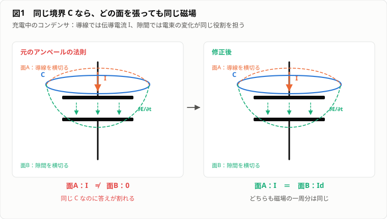
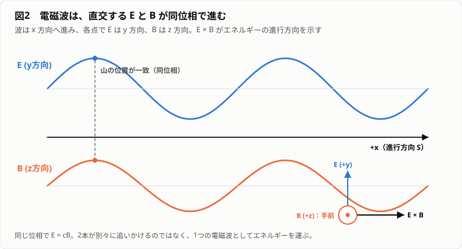

# やる夫で学ぶ電磁気学 ── 見えない力から光を作る

---
## 登場人物

**やる夫**：
電気を使わずに無線通信機を作れば大儲けできると思いついた学生。
知っている単語だけで分かった気になり、すぐ永久機関や超光速通信を発明する。

**やらない夫**：
物理学の教師。
答えを先に教えず、やる夫の説明では区別できない実験や、矛盾が起きる状況を問いかける。

**できる子**：
やる夫の同級生。
測定条件と数値を簡潔に記録し、やる夫が見落とした前提を指摘する。

---
## 第1幕　触れていないのに動く

---
### 1-1　通信機の第一号

**やる夫**：
できたお！
人類史を変える通信機第1号だお！

**やらない夫**：
机の上に、細かく切った紙とプラスチックの下敷きが置かれているように見えるだろ。

**やる夫**：
下敷きをこすって紙に近づけると、紙が飛び上がるお。
この動きを遠くから読み取れば通信になるお。
紙が動けば1、動かなければ0。
回線契約不要、電池不要、国家の監視も不可能だお。

**やらない夫**：
遠くとは何mだ。

**やる夫**：
今は3cmくらいだお。

**やらない夫**：
できる子に伝えたいなら、隣の机まで持っていけばいいだろ。

**やる夫**：
第一号に距離を求めるなお。
ライト兄弟だって最初から太平洋を渡ってないお。

**やらない夫**：
では、その紙が動く理由を説明してみろ。

**やる夫**：
下敷きをこすったことで風が発生して、紙を吸い寄せたんだお。

**やらない夫**：
吸い寄せる風とは、どちら向きに吹く風だ。

**やる夫**：
下敷きの方向だお。

**やらない夫**：
空気は下敷きから紙へ出ているのか、紙から下敷きへ流れているのか。

**やる夫**：
……紙から下敷きへ流れたら、紙の向こう側の空気はどこへ行くんだお。

**やらない夫**：
風説を試すにはどうする。

**やる夫**：
空気を遮ればいいお。
紙と下敷きの間に薄い板を置くお。

**できる子**：
透明なアクリル板。

**やる夫**：
紙は少し弱くなったけど、まだ動いたお。
アクリル板を通り抜ける風かもしれないお。

**やらない夫**：
風がアクリル板を通り抜けるなら、アクリル板を風よけに使えないだろ。

**やる夫**：
では熱だお。
摩擦で温まった下敷きが、紙を引き寄せているんだお。

**やらない夫**：
温かい物体は、一般に紙を引き寄せるのか。

**やる夫**：
熱いマグカップを近づけてみるお。
……動かないお。

**できる子**：
デジタル温度計は分解能 $0.1\,^\circ\mathrm C$。
下敷きは、こする前が $21.3\,^\circ\mathrm C$、こすった後が $21.4\,^\circ\mathrm C$。
差は分解能と同じ。

**やる夫**：
風でも熱でもない。
でも、こすっていない下敷きでは動かない。
こすることで、下敷きに何かが起きているんだお。

**やらない夫**：
何が起きている。

**やる夫**：
電気だお。

**やらない夫**：
電気とは何だ。

**やる夫**：
……電気は電気だお。
スマホを動かしたり、雷になったり、請求書を高くしたりするものだお。

**やらない夫**：
紙を動かしたものと、スマホを動かすものが同じだと、今の実験だけでなぜ分かる。

**やる夫**：
分からないお。

**やらない夫**：
名前を知っていることと、仕組みを説明できることは違う。
今分かっている事実だけを並べろ。

**やる夫**：
こすった下敷きは、こすっていない下敷きと違う状態になる。
その状態は、しばらく残る。
その下敷きを紙に近づけると、触れなくても紙に力が働く。

**やらない夫**：
その状態の違いを数量で表す必要がある。
まだ正体は分からなくていい。
物体が持つ、その状態を何と呼ぶ。

**やる夫**：
電荷（charge）かお。

**やらない夫**：
そう呼ぶことにしよう。
ただし今の段階で電荷とは、目に見える粒でも液体でもない。
物体の状態を分類し、力の規則を記述するために導入した量だ。

**やる夫**：
電荷を持つと、周りの物を引き寄せる。
これが最初の法則だお。

**やらない夫**：
本当に常に引き寄せるのか。

**できる子**：
同じ下敷きを2枚用意した。

**やる夫**：
両方を同じ布でこすって、軽い糸でつるすお。
近づけると……逃げたお。
引き寄せるどころか反発したお！

**やらない夫**：
別の材質の棒を、別の布でこすった場合はどうだ。

**やる夫**：
今度は引き合ったお。
電荷には種類があるのかお。

**やらない夫**：
少なくとも、同じ方法で作った状態同士は反発し、異なる方法で作った状態同士は引き合う。

**やる夫**：
では赤電荷と青電荷と呼ぶお。

**やらない夫**：
構わないが、歴史的には正と負と呼ぶ。

**やる夫**：
正が立派で、負が悪い電荷なのかお。

**やらない夫**：
単なる名前だ。
どちらを正と呼ぶかは約束にすぎない。
重要なのは、同符号が反発し、異符号が引き合うことだ。

**やる夫**：
つまり通信機第1号は、風でも熱でもなく、物体の電荷状態を使って紙を動かしていた。
だいぶ科学的になったお。

**やらない夫**：
まだ紙がなぜ引かれたかは説明できていない。
紙は最初、電荷を持っていなかったはずだろ。

**やる夫**：
……電荷を持たない物体まで引かれる。
また問題が増えたお。

---
### 1-2　電荷は作られるのか

**やる夫**：
こすれば電荷が作られる。
これでいいんじゃないかお。

**やらない夫**：
何もないところから正電荷だけが作られるのか。

**やる夫**：
下敷きに正電荷が発生したなら、そういうことだお。

**やらない夫**：
下敷きをこすった布を調べたか。

**やる夫**：
布まで調べる必要があるのかお。
主役は下敷きだお。

**できる子**：
布も、軽い紙片を引き寄せる。

**やる夫**：
布にも電荷があるお。
下敷きと布を近づけると引き合う。
符号は逆だお。

**やらない夫**：
下敷きに正の電荷が生じ、布に同量の負の電荷が生じた可能性と、もともと存在した何かが片方からもう片方へ移った可能性がある。
どう区別する。

**やる夫**：
全体の電荷を測るお。
こする前の下敷きと布を合わせた電荷が0。
こすった後も、下敷きと布を合わせると0。
片方だけ見ると正、もう片方は負。
つまり全体としては増えていない。

**やらない夫**：
この実験から、どんな法則を仮定するのが自然だ。

**やる夫**：
電荷は無から作られたり消えたりせず、物体の間を移る。
全体の電荷は保存する。

$$Q_{\mathrm{before}}=Q_{\mathrm{after}}$$

**やらない夫**：
今後、どれほど複雑な電気回路を扱っても、この法則は残る。

**やる夫**：
でも実際には何が移っているんだお。
正電荷が下敷きから布へ動いたのか、負電荷が布から下敷きへ動いたのか。

**やらない夫**：
今の測定だけで区別できるか。

**やる夫**：
外から見れば、片方の正が減ることと、負が増えることは同じ結果になるお。
区別できない。

**やらない夫**：
金属や多くの物質では、後に電子と呼ばれる負電荷を持つ粒子の移動が重要になる。
だが、電流（electric current）の向きの約束は、電子が発見される前に作られた。

**やる夫**：
もしかして、電流の向きと電子の動く向きが逆なのは、そのせいかお。

**やらない夫**：
そうだ。
正電荷が動く向きを電流の正方向と定めた後で、金属中では主に負の電子が逆向きに動くと分かった。

**やる夫**：
歴史的負債だお。
全部逆向きに定義し直したらどうだお。

**やらない夫**：
世界中の教科書、回路図、測定器、技術規格を書き換える費用を負担するなら提案していい。

**やる夫**：
現行仕様を尊重するお。

**やらない夫**：
ところで、帯電していない紙が下敷きに引かれた理由は考えたか。

**やる夫**：
紙の中にも正負の電荷があるが、普段は同量で打ち消し合っている。
正に帯電した下敷きを近づけると、紙の負電荷が少し下敷き側へ寄り、正電荷が遠ざかる。
近い負電荷への引力のほうが、遠い正電荷への反発より強い。
だから全体として引かれる。

**やらない夫**：
電荷の偏り、つまり分極（polarization）だ。

**やる夫**：
紙自体の全電荷が0でも、内部の配置が変われば力を受ける。
ただの「帯電しているか、いないか」だけでは足りないんだお。

**やらない夫**：
物質の中の電荷がどれだけ動けるかによって、導体（conductor）と絶縁体（insulator）の違いも生まれる。

**やる夫**：
導体では電荷が物体全体を動きやすく、絶縁体では局所的に少しずれるだけ。
下敷きに電荷が残りやすいのは絶縁体だからかお。

**やらない夫**：
そう考えられる。

**やる夫**：
では金属板に電荷を載せれば、どこかへ逃げるのかお。

**やらない夫**：
手で持てば、人体を通って地面へ移りやすい。
絶縁体の台に載せれば残せる。

**やる夫**：
地面は巨大な電荷の倉庫ということかお。

**やらない夫**：
電荷を出し入れしても電位（electric potential）がほとんど変わらないほど巨大な導体として扱える。
それが接地（grounding）だ。

**やる夫**：
紙片を動かすだけだったのに、すでに保存則、電子、導体、絶縁体、分極、接地まで出てきたお。
通信機はいつ完成するんだお。

**やらない夫**：
まだ力の届き方すら定式化していない。

---
### 1-3　空間に力を書き込む

**やらない夫**：
2つの小さな帯電体を距離 $r$ だけ離して置く。
電荷を $Q$ と $q$ としよう。
力の大きさはどう変わると思う。

**やる夫**：
距離が2倍なら力は半分だお。

**できる子**：
測定値とは合わない。

**やる夫**：
では距離が2倍なら4分の1。
面積が $r^2$ に比例して広がるからかお。

**やらない夫**：
実験から得られる関係は、

$$F=\frac{1}{4\pi\varepsilon_0}\frac{|Qq|}{r^2}$$

だ。
向きまで含めれば、点電荷 $Q$ が $q$ に及ぼす力は、

$$\mathbf{F}=\frac{1}{4\pi\varepsilon_0}\frac{Qq}{r^2}\hat{\mathbf r}$$

と書ける。

**やる夫**：
符号が同じなら積 $Qq$ は正で外向き、違えば負で内向き。
クーロンの法則（Coulomb's law）だお。

**できる子**：
下敷きの電荷はおよそ $1.0\times10^{-8}\,\mathrm C$。
紙片は質量 $1.0\,\mathrm{mg}$、距離は第1号と同じ $3.0\,\mathrm{cm}$。

**やる夫**：
紙は全体では中性だけど、下敷きに近い側へ寄った逆符号の電荷を、まず $1.0\times10^{-10}\,\mathrm C$ の点電荷とみなして桁を見積もるお。

$$F\approx(8.99\times10^9)
\frac{(1.0\times10^{-8})(1.0\times10^{-10})}{(3.0\times10^{-2})^2}
\approx1.0\times10^{-5}\,\mathrm N$$

紙片の重さは、

$$mg=(1.0\times10^{-6})(9.8)
\approx9.8\times10^{-6}\,\mathrm N$$

同じ桁だお。
$10^{-8}\,\mathrm C$ なんて小さな電荷でも、軽い紙の重さに並ぶ力になるのかお。

**やらない夫**：
実際の紙では分極した電荷が面に分布するため、今の点電荷は桁を見るための近似だ。
だが、$3\,\mathrm{cm}$ で紙片が動く規模かどうかは数量で確かめられた。

**やる夫**：
これで全部終わったお。

**やらない夫**：
電荷が100個ある場合、101個目の電荷に働く力はどう計算する。

**やる夫**：
100個それぞれとの力を計算して、全部足すお。
$F_1+F_2+\cdots+F_{100}$ だお。

**できる子**：
等しい電荷を、左右に同じ距離で置いた。

**やる夫**：
両方から力が来るから、2倍の力が……いや、逆向きだお。
左から引かれて右からも同じだけ引かれたら、動かないお。
足し算じゃなくてベクトルの足し算だお。

$$\mathbf{F}=\sum_{i=1}^{100}\frac{1}{4\pi\varepsilon_0}\frac{Q_iq}{r_i^2}\hat{\mathbf r}_i$$

向きを持った矢印として足す。
面倒だけどできるお。

**やらない夫**：
101個目の電荷 $q$ を、別の値に交換したら。

**やる夫**：
100項を全部もう一度計算するお。

**やらない夫**：
100種類の $q$ を順に試したいと言われたら。

**やる夫**：
1万回の計算だお。
そんな仕事は引き受けないお。

**やらない夫**：
本当に、毎回すべてを計算し直しているのか。
2回分の式を並べて見比べろ。

**やる夫**：
$q$ を $2q$ にすると……各項が全部2倍になるだけだお。
$Q_i$ も $r_i$ も動いていない。
変わったのは掛かっている $q$ だけだお。

**やらない夫**：
ならば、何を先に計算しておけばいい。

**やる夫**：
$q$ を除いた部分だお。
これを1回だけ計算しておいて、後から $q$ を掛ける。

$$\frac{\mathbf{F}}{q}
=\sum_i\frac{1}{4\pi\varepsilon_0}\frac{Q_i}{r_i^2}\hat{\mathbf r}_i$$

計算をサボるための小細工だお。

**やらない夫**：
その小細工で残った量には、$q$ がどこにも入っていない。
何で決まっている。

**やる夫**：
100個の電荷の配置と、場所だけ……。
101個目をまだ置いていなくても、この量は各点で決まってしまうお。

**やらない夫**：
計算の途中式のつもりだったものが、空間そのものが持つ量になった。
これを電場（electric field）$\mathbf E$ と呼ぶ。

**やる夫**：
定義は割り算のままだお。

$$\mathbf E=\frac{\mathbf F}{q}$$

だから、

$$\mathbf F=q\mathbf E$$

となるお。

**やらない夫**：
電場とは何だ。

**やる夫**：
空間の各点に小さな正電荷を置いたとき、単位電荷あたりにどの向きへどれだけ力が働くかを示すベクトル。
電荷が周囲の空間に作る、力の設計図だお。

**やらない夫**：
「試験電荷を実際に置かなければ、電場は存在しない」と考えることもできる。

**やる夫**：
計算用の架空の地図ということかお。

**やらない夫**：
今はそれでもよい。
後で、場を単なる計算上の道具では済ませられなくなる。

**やる夫**：
電場を線で描けば向きが分かりやすいお。
正電荷から線が出て、負電荷へ入る。
線の接線方向が電場の向きで、線の密度が強さを表す。
ただし空間に糸が張ってあるわけではなく、ベクトル場を絵にしただけだお。

**やらない夫**：
その絵で、点電荷を包む球面から出ていく線の本数を数えろ。
半径を2倍にすると、本数は何倍になる。

**やる夫**：
電場が4分の1に弱まるんだから、出ていく量も4分の1……。

**やらない夫**：
数えろと言った。
線は途中で消えるのか。

**やる夫**：
消えないお。
電荷から出た線は、どこまでも伸びる。
遠くの球面でも、貫く線は同じ本数だお。
でも電場は確かに弱くなっているお。
矛盾していないかお。

**やらない夫**：
弱くなった分、球面は何倍に広がった。

**やる夫**：
面積は4倍だお。
……電場が4分の1で、面積が4倍。
掛けると元に戻るお。

$$E=\frac{1}{4\pi\varepsilon_0}\frac{Q}{r^2}$$

に球面積 $4\pi r^2$ を掛けると、

$$E\cdot4\pi r^2=\frac{Q}{\varepsilon_0}$$

$r$ が消えたお。
弱まり方と広がり方が、ちょうど打ち消し合うように出来ているんだお。

**やらない夫**：
それは偶然か。
逆二乗でなく逆三乗の法則だったら、どうなっていた。

**やる夫**：
$r$ が残って、遠い球面ほど総量が減るお。
逆二乗だからこそ、総量が距離によらない。
3次元空間で面積が $r^2$ で広がることと、力が $r^2$ で弱まることが、同じ事実の裏表だったお。

**やらない夫**：
球以外の閉曲面でも、電場の流出量、つまり電束（electric flux）は内部電荷だけで決まる。

$$\oint_S\mathbf E\cdot d\mathbf A=\frac{Q_{\mathrm{inside}}}{\varepsilon_0}$$

**やる夫**：
ガウスの法則（Gauss's law）。
クーロンの法則を、空間全体について言い直した形だお。

**やらない夫**：
対称性が高い場合には、複雑な積分をせず電場を求められる。

**やる夫**：
点、無限直線、無限平面、球。
形の対称性から電場の向きと一定になる場所を決める。
電磁気学は計算というより、どの情報が場所によらないかを見つける学問みたいだお。

**やらない夫**：
通信機を動かすには、静止した電荷だけでなく、電荷を継続的に移動させる必要がある。

**できる子**：
第1幕の性能記録。
到達距離 $3\,\mathrm{cm}$、通信速度は手作業で約 $0.2\,\mathrm{bit/s}$。
1ビットごとに下敷きを約5秒こする、一回式。

---
## 第2幕　電気を流す

---
### 2-1　一度しか動かない通信機

**やる夫**：
紙片方式を改良したお。
2枚の金属板を近づけ、一方に電荷をためる。
できる子側の軽い金属針が動けば1だお。

**できる子**：
1回動いた。
その後は動かない。

**やる夫**：
一度放電すると終わるお。
ならば100万倍の電荷をためれば、100万回通信できる。

**やらない夫**：
その「100万倍」を電圧（voltage）に直せ。

**できる子**：
金属板の静電容量（capacitance）は約 $100\,\mathrm{pF}$。
最初の1回に使った電荷は約 $1\,\mathrm{nC}$、板の間隔は $3\,\mathrm{mm}$。

**やる夫**：
コンデンサ（capacitor）では $Q=CV$ だから、最初は、

$$V=\frac{Q}{C}
=\frac{1\times10^{-9}}{100\times10^{-12}}
=10\,\mathrm V$$

100万回分なら電荷は $1\,\mathrm{mC}$、必要な電圧は $10^7\,\mathrm V$、つまり1000万ボルトだお。

**やらない夫**：
乾燥空気が絶縁を保てる電場の目安を $3\times10^6\,\mathrm{V/m}$ とすると、$3\,\mathrm{mm}$ の隙間では何ボルト程度か。

**やる夫**：

$$V_{\mathrm{break}}\approx
(3\times10^6)(3\times10^{-3})
=9\times10^3\,\mathrm V$$

約9000ボルトで放電が始まる目安なのに、1000万ボルトを要求しているお。
湿度や電極の形で値は変わるけど、桁が3つ足りない。

**できる子**：
放電直前に蓄えられる電荷も、理想化して約 $0.9\,\mathrm{\mu C}$。
最初の1回分の約900倍で、100万倍には届かない。

**やらない夫**：
金属板の間に十分大きな電位差を作ると何が起きる。

**やる夫**：
空気が絶縁できなくなって火花が飛ぶ。
装置が通信機ではなく点火装置になるお。

**やらない夫**：
電荷を一度ためる方式では、繰り返し使うたびに再充電が必要だ。
連続して動作させるには何が必要だ。

**やる夫**：
電荷を循環させる。
使い終わった電荷を回収して、もう一度押し出すお。

**やらない夫**：
導線の断面を単位時間に通過する電荷量を、電流と定義する。

$$I=\frac{dQ}{dt}$$

**やる夫**：
1秒間に1クーロンなら1アンペア。

$$1,\mathrm A=1,\mathrm{C/s}$$

電流は電子の速さかお。

**やらない夫**：
違う。
道路を1秒間に通過する車の台数と、1台の車の速度が違うのと同じだ。

**やる夫**：
電子が速く動けば、通過数も増えるんじゃないかお。

**やらない夫**：
電子密度を $n$、電子1個の電荷の大きさを $e$、導線の断面積を $A$、平均ドリフト速度（drift velocity）を $v_d$ とすると、

$$I=neAv_d$$

となる。
電流は速度だけでなく、電荷密度と断面積にも依存する。

**やる夫**：
家庭の導線中の電子のドリフト速度は意外に遅いと聞いたことがあるお。
それならスイッチを入れてから電球が点くまで、何時間もかかるんじゃないかお。

**やらない夫**：
長い管に水が詰まっている状態を考えろ。
入口から水を押したとき、入口の水分子が出口まで移動するのを待つ必要があるか。

**やる夫**：
管全体に圧力の変化が伝わり、出口付近の水がすぐ出る。
電気でも、電子そのものが電池から電球まで高速で走るのではなく、電場の変化が導線全体へ伝わるんだお。

**やらない夫**：
その伝わり方は、後で電磁波（electromagnetic wave）として扱う。

**やる夫**：
電子はのろのろ動くが、動けという指令は高速で伝わる。
会社組織より効率的だお。

---
### 2-2　電池は何を作るのか

**やる夫**：
電流を流すには電池が必要だお。
電池は電気を生産する工場だお。

**やらない夫**：
電気とは電荷のことか。

**やる夫**：
そうだお。

**やらない夫**：
電池の内部で正負の電荷が無から作られるなら、電荷保存則はどうなる。

**やる夫**：
前の幕でいきなり破綻するお。
電池は電荷を作っていない。

**やらない夫**：
電池をつながず、導線だけで輪を作ったら、電流は流れ続けるか。

**やる夫**：
流れない。
電荷を一方向へ押す何かが必要だお。

**やらない夫**：
重力場で、同じ高さにある水は勝手に流れ続けない。
高い水槽と低い水槽をつなげば流れる。
電気でも、単位電荷あたりのエネルギー差を考えられる。

$$V=\frac{W}{Q}$$

**やる夫**：
これが電位、または2点間なら電位差、つまり電圧。
1クーロンの電荷が1ジュールのエネルギーを失うなら1ボルト。

$$1,\mathrm V=1,\mathrm{J/C}$$

**やらない夫**：
電池は化学反応を使って、正負の電荷を分離し、端子間の電位差を維持する。

**やる夫**：
電荷そのものを生むのではなく、既存の電荷を低い電位から高い電位へ運ぶ。
水を高い水槽へ戻すポンプみたいなものだお。

**やらない夫**：
比喩としては使える。
ただし水が重力で下へ流れるのに対し、電荷に働く向きは符号によって変わる。
また電圧は電荷量ではなく、単位電荷あたりのエネルギー差だ。

**やる夫**：
電池に「電気が5ボルト入っている」という表現は正しくない。
5ボルトは電荷の量ではなく、1クーロンあたり5ジュールのエネルギーを与えられるという意味だお。

**やらない夫**：
では、1.5Vの小さな電池と、同じ1.5Vの大型電池は同じものか。

**やる夫**：
電圧は同じでも、取り出せる総エネルギーや大電流を維持する能力が違う。
水槽の高さが同じでも、水槽の容量や配管の太さが違うようなものだお。

**やらない夫**：
電池、導線、抵抗をつないだとき、電流の大きさは何で決まる。

**やる夫**：
電圧が大きいほど流れやすいはずだお。
電圧を2倍にすれば、電流も必ず2倍だお。

**できる子**：
豆電球では、$1.0\,\mathrm V$ で $0.20\,\mathrm A$、$2.0\,\mathrm V$ で $0.32\,\mathrm A$。
電圧は2倍、電流は1.6倍。

**やる夫**：
比例していないお。
$V/I$ を計算すると $5.0\,\Omega$ から $6.25\,\Omega$ に増えている。

**やらない夫**：
電流でフィラメントの温度が上がり、抵抗が変わった。
では、温度変化を小さく抑えられる金属抵抗器ではどうなる。

**できる子**：
$100\,\Omega$ の抵抗器。
$1.0\,\mathrm V$ で $10\,\mathrm{mA}$、$2.0\,\mathrm V$ で $20\,\mathrm{mA}$、$3.0\,\mathrm V$ で $30\,\mathrm{mA}$。

**やる夫**：
今度は $V/I$ がほぼ $100\,\Omega$ で一定だお。
金属線のように温度などの条件が一定で、抵抗値をほぼ一定とみなせる素子なら、

$$V=IR$$

オームの法則（Ohm's law）だお。

**やらない夫**：
すべての部品で成り立つ基本法則か。

**やる夫**：
ダイオードでは電圧と電流が比例しない。
今測った電球も、温度が上がると抵抗が変わった。
オームの法則は、抵抗値がほぼ一定とみなせる素子についての関係だお。

**やらない夫**：
抵抗で失われた電気エネルギーは消滅するのか。

**やる夫**：
熱や光になる。

$$P=VI=I^2R=\frac{V^2}{R}$$

エネルギー保存は破れていない。

---
### 2-3　分かれ道で電荷は迷わない

**やる夫**：
通信機を2台に増やすお。
導線を途中で2本に分け、それぞれにランプをつなぐ。

**やらない夫**：
分岐点に毎秒10クーロン入り、一方へ毎秒3クーロン出た。
もう一方へはいくら出る。

**やる夫**：
やる夫の気分次第で8クーロン出すお。

**やらない夫**：
毎秒1クーロンずつ分岐点から余分に出現することになる。

**やる夫**：
電荷保存に反する。
もう一方は7クーロンでなければならない。

$$\sum I_{\mathrm{in}}=\sum I_{\mathrm{out}}$$

**やらない夫**：
これがキルヒホッフの電流則（Kirchhoff's current law）だ。

**やる夫**：
暗記する規則ではなく、分岐点に電荷が際限なく蓄積しないという電荷保存から出るんだお。

**やらない夫**：
次に、電池と抵抗を含む閉回路を一周する。
出発点の電位を0Vとし、電池で9V上がり、抵抗で9V下がれば元に戻る。

**やる夫**：
閉じた経路を一周して同じ点に戻るなら、電位も元の値でなければならない。

$$\sum V=0$$

キルヒホッフの電圧則（Kirchhoff's voltage law）だお。

**やらない夫**：
なぜ電位を定義できる。

**やる夫**：
静電場では、電荷をある点から別の点へ運ぶ仕事が経路によらず、始点と終点だけで決まるから。
電場が保存力なら、

$$\oint\mathbf E\cdot d\mathbf l=0$$

となる。

**やらない夫**：
「静電場では」と言ったな。

**やる夫**：
何か含みがあるお。

**やらない夫**：
時間変化する磁場（magnetic field）がある場合、閉じた経路に沿う電場の積分は0にならない。
そのとき単純な電圧則は修正が必要になる。

**やる夫**：
今作った法則が後で壊れるのかお。

**やらない夫**：
適用条件が明確になる。
物理法則は壊れるのではなく、近似だったことが分かる場合がある。

**やる夫**：
静電気と直流回路だけを世界のすべてだと思うと、後で事故る。
覚えておくお。

**できる子**：
第2幕の性能記録。
導線 $2\,\mathrm m$ で到達距離 $2\,\mathrm m$、スイッチ操作で約 $2\,\mathrm{bit/s}$。
連続送信はできるが、有線。

---
## 第3幕　磁石という別世界

---
### 3-1　磁石を切れば極は取り出せるか

**やる夫**：
電気通信機は導線が必要だお。
無線にするには磁石を飛ばせばいいお。

**やらない夫**：
磁石を飛ばすなら、それは郵便と何が違う。

**やる夫**：
磁石は再利用できるお。

**やらない夫**：
石も拾って再利用できる。

**やる夫**：
ではまず、磁石の仕組みを解明するお。
N極は正電荷、S極は負電荷。
異なる極が引き合い、同じ極が反発する。
完全に電気と同じだお。

**やらない夫**：
正電荷だけを持つ物体は作れるか。

**やる夫**：
電子を取り去れば作れるお。

**やらない夫**：
ではN極だけを持つ磁石を作れるか。

**やる夫**：
棒磁石を真ん中で切れば、N側の半分とS側の半分になるお。

**できる子**：
切った。

**やる夫**：
N側だった破片の切断面にS極ができた。
S側だった破片の切断面にはN極ができた。
2本の小さな磁石になったお。

**やらない夫**：
さらに切れば。

**やる夫**：
何度切っても、それぞれにN極とS極が現れる。
磁極は電荷のように単独で取り出せないのかお。

**やらない夫**：
少なくとも現在まで、孤立した磁気単極子（magnetic monopole）は通常の電磁気現象では観測されていない。
磁力線（magnetic field line）はN極から出てS極へ入り、磁石内部を通って閉じる。

**やる夫**：
電気力線（electric field line）は正電荷から始まり負電荷で終われるが、磁力線は必ず閉ループ。
閉曲面を貫く磁束（magnetic flux）の合計は0。

$$\oint_S\mathbf B\cdot d\mathbf A=0$$

**やらない夫**：
その式は、ある大きさの閉曲面についての主張だ。
面をどんどん小さくしていくと、何が残る。

**やる夫**：
面を小さくすれば、囲む体積も0に近づくお。
流出量も0に近づくから、$0=0$ になって何も言えなくなるお。

**やらない夫**：
流出量そのものではなく、体積で割った値を見ろ。

**やる夫**：
1m³あたりの流出量……その点で場がどれだけ湧き出しているか、という密度だお。
面の大きさによらない、その点だけの量になるお。

**やらない夫**：
それを場の発散（divergence）と呼び、$\nabla\cdot\mathbf B$ と書く。
$\oint$ の式が「箱全体でいくら」なら、$\nabla\cdot$ の式は「各点でいくら」だ。

$$\nabla\cdot\mathbf B=0$$

**やる夫**：
中身は同じことを言っているのかお。

**やらない夫**：
同じ内容を、有限の領域についてではなく1点ごとに述べ直したものだ。
積分形と微分形と呼ぶ。
微分形なら、場所ごとに違う値を持つ場を方程式として扱える。

**やる夫**：
磁場には湧き出し口も吸い込み口もない。
どの点で見ても $0$、つまりどこにも源がないお。
電場は正電荷の点で湧き出すから $\nabla\cdot\mathbf E$ は $0$ にならない。
似ているが、源の構造が違うんだお。

---
### 3-2　導線が方位磁針を回す

**やる夫**：
電気と磁石は別々の現象だお。
電気は電荷、磁気は磁石。
教科書も章が別だから間違いないお。

**できる子**：
電池につないだ導線の近くに方位磁針を置いた。

**やる夫**：
スイッチを入れたら針が動いたお。
机が振動したんだお。

**やらない夫**：
電流の向きを逆にしたら。

**やる夫**：
針の向きも逆になった。
振動なら電流の向きで反転しないお。

**やらない夫**：
導線を方位磁針から遠ざけたら。

**やる夫**：
動きが弱くなる。
電流が磁場を作っている。

**やらない夫**：
磁場の向きは導線から放射状か。

**やる夫**：
導線の周囲で方位磁針を移動すると、針は導線を囲む円の接線方向を向く。
磁場が導線を中心に円を描いているお。

**やらない夫**：
十分長い直線電流 $I$ から距離 $r$ の磁場は、

$$B=\frac{\mu_0I}{2\pi r}$$

となる。

**やる夫**：
電場は点電荷から放射状に出た。
電流の磁場は導線を周回する。
源と場の向きが90度ずれている感じだお。

**やらない夫**：
電流を囲む閉曲線に沿って磁場を積分すると、

$$\oint_C\mathbf B\cdot d\mathbf l=\mu_0I_{\mathrm{inside}}$$

となる。
アンペールの法則（Ampère's law）だ。

**やる夫**：
導線を円形に巻けば、それぞれの電流が作る磁場が中心で同じ向きに重なる。
何周も巻いたコイルなら強い磁場ができる。

**やらない夫**：
内部に鉄心を入れれば。

**やる夫**：
電磁石になるお。
電流を流している間だけ磁石になり、向きも強さも変えられる。

**やらない夫**：
これで受信側の針を動かせる。

**やる夫**：
電流をオンにするとコイルが磁石になり、鉄片を引く。
カチッという音を1と0にすれば電信機になるお。

**やらない夫**：
ただし導線はまだ必要だ。

**やる夫**：
少なくとも紙片通信からは進歩したお。

---
### 3-3　磁場は仕事をするのか

**やらない夫**：
磁場の中に電荷を置く。
静止させたままなら、力は働かない。
動かすと働く。
向きはどうなると思う。

**やる夫**：
電場のときと同じで、磁場と同じ向きだお。

**できる子**：
陰極線を磁石に近づけた。
曲がった向きは、磁場とも進行方向とも違う。

**やる夫**：
両方に垂直な向きに曲がったお。
そんな力の書き方があるのかお。

**やらない夫**：
2つのベクトルから、その両方に垂直な第3のベクトルを作る積がある。
外積（cross product）といい、$\mathbf a\times\mathbf b$ と書く。
大きさは $|\mathbf a||\mathbf b|\sin\theta$ で、平行なとき0、垂直なとき最大になる。

**やる夫**：
向きは2通りあるお。
上か下か、どっちだお。

**やらない夫**：
右手の指を $\mathbf a$ から $\mathbf b$ へ回したときの親指の向き、と約束する。
これを使えば、磁場 $\mathbf B$ の中を速度 $\mathbf v$ で動く電荷 $q$ に働く力は、

$$\mathbf F=q\mathbf v\times\mathbf B$$

と書ける。

**やる夫**：
ローレンツ力（Lorentz force）だお。
磁場と平行に動く電荷は $\sin\theta=0$ で力を受けない。
だから磁石の極に向かってまっすぐ飛び込む電荷は曲がらないお。

**やらない夫**：
一様な磁場に垂直に入った電荷の軌道は。

**やる夫**：
力が常に進行方向に垂直なら、軌道は円になるはずだお。
向心力として、

$$qvB=\frac{mv^2}{r}$$

したがって、

$$r=\frac{mv}{qB}$$

荷電粒子の質量、電荷、速度によって曲率半径が変わる。
質量分析（mass spectrometry）で粒子を分けたり、加速器（particle accelerator）で粒子の軌道を曲げたりできるお。

加速器に使えるなら、磁場を次々と強くして粒子を曲げ続ければ、速度も上がり続けるんじゃないかお。
電源なしで無限のエネルギーを得られるお。

**やらない夫**：
「加速する」には、速度の向きが変わる場合と、速さが増す場合がある。
磁力はどちらを起こした。

**やる夫**：
$\mathbf v$ と $\mathbf B$ の両方に垂直だから、速度の向きは変える。
でも、速さまで増えるとはまだ示していないお。

**やらない夫**：
単位時間あたりの仕事率は。

$$P=\mathbf F\cdot\mathbf v$$

**やる夫**：
垂直だから、

$$P=q(\mathbf v\times\mathbf B)\cdot\mathbf v=0$$

磁場は電荷の速さを変えず、向きだけを変える。
磁場単独では仕事をしないお。
加速器で速さを増す仕事は電場が担当し、磁場は主に軌道を曲げる。
「加速器」という名前だけで、磁場までエネルギーを供給すると早合点したお。

**やらない夫**：
モーターでは磁場がコイルを回している。
磁場が仕事をしないなら、回転エネルギーはどこから来る。

**やる夫**：
電池や電源だお。
磁場は力の向きを決めるが、エネルギーは電源が供給している。
電流を流し続けるため、電源内部で化学エネルギーなどが失われる。

**やらない夫**：
電場と磁場を合わせた力は、

$$\mathbf F=q(\mathbf E+\mathbf v\times\mathbf B)$$

となる。

**やる夫**：
電場は速度方向の成分を持てるから、電荷のエネルギーを変えられる。
磁場は軌道を曲げる。
役割が違うんだお。

**できる子**：
第3幕の性能記録。
電磁石式は導線 $5\,\mathrm m$ で到達距離 $5\,\mathrm m$、通信速度は約 $2\,\mathrm{bit/s}$。
紙片より安定したが、まだ有線。

---
## 第4幕　磁石から電気を取り出す

---
### 4-1　強い磁石を置いても発電しない

**やる夫**：
電流が磁場を作るなら、磁場も電流を作るはずだお。
対称性というやつだお。

**やらない夫**：
どう試す。

**やる夫**：
コイルの中に強力な磁石を入れる。
これで電流が流れる。

**できる子**：
電流計は $0.0\,\mathrm{mA}$。
分解能は $0.1\,\mathrm{mA}$。

**やる夫**：
磁石が弱い。
2個に増やすお。

**できる子**：
$0.0\,\mathrm{mA}$。

**やる夫**：
10個。

**できる子**：
$0.0\,\mathrm{mA}$。
磁石を1個から10個へ増やしても、検出限界を超える定常電流はない。

**やる夫**：
磁場が存在するだけでは電流は流れないのかお。

**やらない夫**：
磁石をコイルへ近づけてみろ。

**やる夫**：
近づけている間は $+0.8\,\mathrm{mA}$。
止めると0に戻る。
引き抜く間は $-0.8\,\mathrm{mA}$。

**やらない夫**：
何が電流を生んだ。

**やる夫**：
磁場の強さではなく、コイルを貫く磁場の変化。
磁石を止めている間は磁場があっても変化しない。
動かしている間だけ変化する。

**やらない夫**：
コイルを貫く磁束を、

$$\Phi_B=\int_S\mathbf B\cdot d\mathbf A$$

と定義する。
コイルに生じる起電力（electromotive force, EMF）は、

$$\mathcal E=-\frac{d\Phi_B}{dt}$$

となる。

**やる夫**：
ファラデーの電磁誘導の法則（Faraday's law of electromagnetic induction）だお。
磁束は、磁場の強さだけでなく、面積や磁場との角度でも変わる。

$$\Phi_B=BA\cos\theta$$

だから磁石を動かさなくても、コイルを回転させれば磁束が変わって起電力が生じる。

**やらない夫**：
発電機の基本だ。

**やる夫**：
コイルを回せば電気が生まれる。
永久に回る発電機を作れば、電気代0だお。

**やらない夫**：
誰が回す。

**やる夫**：
最初に手で勢いをつければ、発電した電気でモーターを動かし、そのモーターで発電機を回す。

**やらない夫**：
次の節で符号を考えよう。

---
### 4-2　マイナス符号が永久機関を殺す

**やる夫**：
ファラデーの法則のマイナス符号が邪魔だお。

$$\mathcal E=-\frac{d\Phi_B}{dt}$$

プラスにすれば、磁石を近づけたとき、コイルは磁束をさらに増やす方向の磁場を作る。
磁石が吸い込まれて、勝手に加速するお。

**やらない夫**：
その過程を続けてみろ。

**やる夫**：
磁石がコイルへ近づく。
磁束が増える。
誘導電流が同じ向きの磁場を作る。
磁石はさらに強く引かれ、速く近づく。
磁束の変化がさらに大きくなり、電流が増える。
電流を使って仕事も取り出せる。

**やらない夫**：
外からエネルギーを与えたか。

**やる夫**：
与えていない。
磁石が勝手に加速し、電気エネルギーまで増える。
エネルギー保存が破れるお。

**やらない夫**：
実際の誘導電流はどういう向きに流れる。
測ってから言え。

**できる子**：
コイルの巻き方向を控えてある。
N極を近づけたとき、針は左。

**やる夫**：
やる夫の予想と逆だお。
磁石を近づけて磁束が増えるなら、その増加を打ち消す向きの磁場を作る。
磁石を遠ざけて磁束が減るなら、その減少を補う向きの磁場を作る。
変化そのものに逆らう。

**やらない夫**：
レンツの法則（Lenz's law）だ。

**やる夫**：
「自然は変化を嫌う」というより、誘導電流が変化を強める向きなら永久機関になるため、エネルギー保存を満たす向きが逆向きになる。
その結果がマイナス符号だお。

**やらない夫**：
磁石をコイルへ押し込むと抵抗を感じるだろ。

**やる夫**：
外からした機械的仕事が、電気エネルギーや抵抗の熱へ変換される。
発電機を回すと重くなるのは、電気を作る代償だお。

**やらない夫**：
負荷を外せば。

**やる夫**：
電流がほとんど流れず、回転は軽い。
電力を取り出すほど、回すためのトルクが必要になる。

**やらない夫**：
では、発電機の電気で同じ軸のモーターを回せばどうなる。

**やる夫**：
抵抗、摩擦、渦電流などの損失があるため、戻せる機械エネルギーは投入した分より少ない。
理想的に損失0でも、同じエネルギーが循環するだけで外部へ取り出す余剰はない。
永久機関は死んだお。

---
### 4-3　モーターを逆に回す

**やる夫**：
コイルに電流を流すと磁場中で力を受けて回転する。
これがモーター。
逆に外から回すと、磁束が変化して電流が流れる。
これが発電機。

**やらない夫**：
別々の装置か。

**やる夫**：
同じ構造で双方向に変換できる。

* モーター：電気エネルギー $\rightarrow$ 機械エネルギー
* 発電機：機械エネルギー $\rightarrow$ 電気エネルギー

**やらない夫**：
通信機の電源をどうする。

**やる夫**：
自転車の車輪で発電機を回すお。
やる夫がこげば、できる子側の電磁石が動く。

**できる子**：
有線。

**やる夫**：
まだ有線だお。
だが電気と磁気の関係はかなり見えてきた。

**やらない夫**：
今まで分かった関係をホワイトボードに書け。

**やる夫**：

```text
電荷           → 電場
動く電荷・電流 → 磁場
変化する磁場   → 電場
```

**やらない夫**：
最後の矢印で「電場」と書いた理由は。

**やる夫**：
コイルに生じる起電力は、導線中の電荷を動かす力だから。
閉じた経路に沿って電場が生じている。

$$\oint_C\mathbf E\cdot d\mathbf l
=-\frac{d}{dt}\int_S\mathbf B\cdot d\mathbf A$$

**やらない夫**：
以前、静電場では、

$$\oint_C\mathbf E\cdot d\mathbf l=0$$

とした。

**やる夫**：
時間変化する磁場があると、電場は保存力ではなくなり、閉じた経路を一周しても積分が0にならない。
キルヒホッフの電圧則は、磁束変化を無視できる回路での近似だったんだお。

**やらない夫**：
電気と磁気は、もう別世界とは言いにくい。

**できる子**：
第4幕の性能記録。
自転車発電に替えても、到達距離は導線と同じ $5\,\mathrm m$、通信速度は約 $2\,\mathrm{bit/s}$。
電池は不要になったが、まだ有線。

---
## 第5幕　場は計算上の幻か

---
### 5-1　遠くの電荷はいつ気づく

**やる夫**：
電場や磁場は便利な計算方法だが、実在する必要はないお。
電荷同士が直接力を及ぼし合っていると考えればいい。

**やらない夫**：
ここに電荷Aがあり、1光秒離れた場所に電荷Bがある。
Aを急に動かしたら、Bに働く力はいつ変わる。

**やる夫**：
クーロンの法則なら、AとBの現在位置で力が決まる。
Aを動かした瞬間にBの力も変わるお。

**やらない夫**：
それを利用すれば。

**やる夫**：
Aを左右に動かして、B側で力を測れば、1秒待たずに情報を送れる。
光速を超える通信になるお。

**やらない夫**：
特殊相対論（special relativity）と矛盾する。

**やる夫**：
ではAの変化は光速でBへ伝わる。

**やらない夫**：
何が伝わる。

**やる夫**：
力の情報だお。

**やらない夫**：
その情報は、AからBまでの途中の空間をどのような状態で通過する。

**やる夫**：
……空間の各点の電場が順番に変化する。
Aの近くの電場がまず変わり、その変化が隣へ伝わり、やがてBへ届く。

**やらない夫**：
場は、遠隔作用を書き換えるための単なる帳簿ではなくなる。
各地点に局所的な状態があり、その状態変化が有限速度で伝播する。

**やる夫**：
電荷Aは遠くのBを直接知る必要がない。
Aは近傍の場を変える。
場の変化が空間を進み、Bは自分の場所の場に応答する。
因果関係が局所化されたお。

**やらない夫**：
場が実在するかという哲学的な問いには複数の立場がある。
しかし少なくとも、場はエネルギーと運動量を持ち、物体がない真空中も伝播する物理的自由度として扱う必要がある。

---
### 5-2　エネルギーは導線の中を走るのか

**やる夫**：
電池から電球へ、電子がエネルギーを運んでいる。
宅配便方式だお。

**やらない夫**：
電池から出た電子が、実際に電球へ到着するまでの時間は。

**やる夫**：
ドリフト速度は遅いから、長い回路ならかなり時間がかかる。
でも電球はスイッチを入れるとほぼすぐ点く。

**やらない夫**：
電球付近にいた電子が、電場によって動き始める。
では電池のエネルギーはどの経路で電球へ届く。

**やる夫**：
導線内の電場が電子を押し、磁場も周囲にできる。
電場と磁場がエネルギーを運んでいるのかお。

**やらない夫**：
電磁場のエネルギー流密度は、ポインティングベクトル（Poynting vector）で表される。

$$\mathbf S=\frac{1}{\mu_0}\mathbf E\times\mathbf B$$

**やる夫**：
$\mathbf E$ と $\mathbf B$ の両方に垂直な向き。
単位面積を単位時間に通過する電磁エネルギーを示す。

**やらない夫**：
直流回路でも、導線の周囲には電場と磁場がある。
抵抗の近くでは、ポインティングベクトルが周囲の空間から抵抗内部へ向かう。

**やる夫**：
エネルギーが導線の中を電子に背負われて進み、抵抗へ入るという単純な絵ではない。
場のエネルギーが回路周囲の空間を通って抵抗へ流れ込む。

**やらない夫**：
導線は何をしている。

**やる夫**：
表面電荷の分布によって周囲の電場を整え、エネルギーの流れを導いている。
電子は局所的に場からエネルギーを受け取り、格子へ渡して熱を生む。

**やらない夫**：
場を単なる計算上の補助と片づけにくくなっただろ。

**やる夫**：
物体のない空間にもエネルギー流が定義される。
場が物理的な役割を持っているお。

---
### 5-3　コンデンサの隙間を電流は渡るか

**やる夫**：
2枚の金属板を向かい合わせたコンデンサを回路につなぐ。
電池から電流が流れ、片方の極板に電荷がたまり、もう片方から電荷が抜ける。

**やらない夫**：
極板の間は絶縁体だ。
電子は隙間を渡るか。

**やる夫**：
渡らない。
充電中も、導線には電流があるが隙間には伝導電流がない。

**やらない夫**：
アンペールの法則を使って、導線を一周する閉曲線 $C$ の磁場を求めよう。

$$\oint_C\mathbf B\cdot d\mathbf l=\mu_0I_{\mathrm{inside}}$$

この閉曲線を境界とする面として、導線を横切る平らな面を選ぶと。

**やる夫**：
面を電流 $I$ が貫くから、

$$\oint_C\mathbf B\cdot d\mathbf l=\mu_0I$$

**やらない夫**：
同じ境界 $C$ を持つが、風船のように膨らませてコンデンサの隙間を通る面を選ぶと。

**やる夫**：
その面は導線を横切らない。
隙間にも電子は流れないから、内部電流は0。

$$\oint_C\mathbf B\cdot d\mathbf l=0$$

同じ閉曲線について、面の選び方で答えが変わったお！
磁場が $\mu_0I$ と0を同時に満たすことになる。

**やらない夫**：
何かを見落としている。

**やる夫**：
充電中、コンデンサの極板間の電場は時間とともに増える。
伝導電流はなくても、変化する電場がある。

**やらない夫**：
マクスウェルは、変化する電束に対応する項を追加した。

$$I_d=\varepsilon_0\frac{d\Phi_E}{dt}$$

これを変位電流（displacement current）と呼ぶ。

**やる夫**：
電子が隙間を流れているわけではないが、磁場を作る効果については電流と同じ役割をする。

**やらない夫**：
修正されたアンペールの法則は、

$$\oint_C\mathbf B\cdot d\mathbf l
=\mu_0I+\mu_0\varepsilon_0\frac{d\Phi_E}{dt}$$

となる。

**やる夫**：
導線を横切る面では伝導電流 $I$ がある。
隙間を横切る面では伝導電流は0だが、電束の変化が同じ値になる。
どの面を選んでも答えが一致するお。

[](figs/fig1-displacement-current.svg)

図5-1：元の法則では面Aの $I$ と面Bの0が矛盾する。変位電流 $I_d$ を加えると、どちらの面でも $\oint_C\mathbf B\cdot d\mathbf l=\mu_0I$ になる（タップ／クリックで原寸表示）。

**やらない夫**：
これも1点ごとに述べ直せる。
磁束密度の式では閉曲面を縮めたが、今度は閉じた経路 $C$ を縮める。
経路に沿った一周分の和を、囲む面積で割ると。

**やる夫**：
その点で場がどれだけ渦を巻いているか、という密度になるお。
発散が湧き出しの密度なら、こっちは回転の密度だお。

**やらない夫**：
場の回転（curl）と呼び、$\nabla\times\mathbf B$ と書く。
$\oint_C$ が「ループ一周でいくら」なら、$\nabla\times$ は「各点でどれだけ渦を巻くか」だ。

$$\nabla\times\mathbf B
=\mu_0\mathbf J
+\mu_0\varepsilon_0\frac{\partial\mathbf E}{\partial t}$$

**やる夫**：
電流のある点と、電場が変化している点で、磁場が渦を巻くお。
$\nabla\cdot$ が源の有無を言い、$\nabla\times$ が渦の有無を言う。
2種類の問いで場を言い切れるんだお。
変化する磁場が電場を作るだけではなかった。
変化する電場も磁場を作る。

```text
電荷           → 電場
電流           → 磁場
変化する磁場   → 電場
変化する電場   → 磁場
```

これで電気と磁気が完全に輪になったお。

**できる子**：
第5幕の性能記録。
装置は未変更。到達距離 $5\,\mathrm m$、通信速度は約 $2\,\mathrm{bit/s}$、有線。
ただし、場の変化なら導線のない空間も進める可能性が残った。

---
## 第6幕　光が方程式から現れる

---
### 6-1　源がなくても場は残れるか

**やる夫**：
電荷がなければ電場はなく、電流や磁石がなければ磁場もない。
真空は空っぽだお。

**やらない夫**：
変化する磁場が電場を作り、変化する電場が磁場を作る。
一度、変化する電磁場を作った後、源から離れた場所ではどうなる。

**やる夫**：
電荷も電流もない場所でも、変化する電場が磁場を作り、その磁場の変化が電場を作れる。
互いを生みながら進めるかもしれない。

**やらない夫**：
これまでの法則をまとめろ。

**やる夫**：
電荷が電場の源になるガウスの法則。

$$\nabla\cdot\mathbf E=\frac{\rho}{\varepsilon_0}$$

磁気単極子が存在しないことを表す法則。

$$\nabla\cdot\mathbf B=0$$

変化する磁場が渦状の電場を作るファラデーの法則。

$$\nabla\times\mathbf E
=-\frac{\partial\mathbf B}{\partial t}$$

電流と変化する電場が渦状の磁場を作るアンペール＝マクスウェルの法則。

$$\nabla\times\mathbf B
=\mu_0\mathbf J
+\mu_0\varepsilon_0\frac{\partial\mathbf E}{\partial t}$$

**やらない夫**：
4本をまとめてマクスウェル方程式（Maxwell's equations）と呼ぶ。

**やる夫**：
最初から完成形を暗記するとバラバラに見えるけど、ここまでの失敗を並べると意味が違うお。

1. 電荷は電場の湧き出しになる。
2. 磁場には湧き出しがなく、線は閉じる。
3. 磁束の変化は電場の渦を作る。
4. 電流と電束の変化は磁場の渦を作る。

**やらない夫**：
真空中で電荷密度 $\rho=0$、電流密度 $\mathbf J=0$ とすると。

**やる夫**：
源の項が全部落ちるお。

$$\nabla\cdot\mathbf E=0$$

$$\nabla\cdot\mathbf B=0$$

$$\nabla\times\mathbf E
=-\frac{\partial\mathbf B}{\partial t}$$

$$\nabla\times\mathbf B
=\mu_0\varepsilon_0\frac{\partial\mathbf E}{\partial t}$$

源がなくても、時間変化する電場と磁場は結びついている。

---
### 6-2　電場の波動方程式

**やらない夫**：
ファラデーの法則の両辺に、さらに回転 $\nabla\times$ を作用させろ。

**やる夫**：
左辺は渦の渦になるお。
右辺は時間微分と順番を入れ替えて、

$$\nabla\times(\nabla\times\mathbf E)
=-\frac{\partial}{\partial t}(\nabla\times\mathbf B)$$

右辺の $\nabla\times\mathbf B$ にアンペール＝マクスウェルの法則を入れると、$\mathbf B$ が消えて $\mathbf E$ だけになるお。

$$\nabla\times(\nabla\times\mathbf E)
=-\mu_0\varepsilon_0\frac{\partial^2\mathbf E}{\partial t^2}$$

でも左辺の「渦の渦」が何なのか分からないお。

**やらない夫**：
そこは電磁気ではなく、ベクトル解析側で片付いている恒等式を借りる。

$$\nabla\times(\nabla\times\mathbf E)
=\nabla(\nabla\cdot\mathbf E)-\nabla^2\mathbf E$$

$\nabla^2$ は各成分を2階微分して足す演算子で、その点の値が周囲の平均からどれだけずれているかを測る。

**やる夫**：
導出はしないで、道具として使うということかお。

**やらない夫**：
そうだ。
どの成分で書き下しても等しくなることは確かめられる。
第1項に、さっき真空で消した式が使える。

**やる夫**：
真空では $\nabla\cdot\mathbf E=0$ だから、第1項が丸ごと落ちるお。

$$-\nabla^2\mathbf E
=-\mu_0\varepsilon_0\frac{\partial^2\mathbf E}{\partial t^2}$$

したがって、

$$\nabla^2\mathbf E
-\mu_0\varepsilon_0\frac{\partial^2\mathbf E}{\partial t^2}=0$$

**やらない夫**：
これはどんな方程式だ。

**やる夫**：
一般的な波動方程式（wave equation）、

$$\nabla^2\psi-\frac{1}{v^2}\frac{\partial^2\psi}{\partial t^2}=0$$

と同じ形だお。
だから電場は速度、

$$v=\frac{1}{\sqrt{\mu_0\varepsilon_0}}$$

で伝わる波を持つ。

**やらない夫**：
磁場についても同様に。

**やる夫**：

$$\nabla^2\mathbf B
-\mu_0\varepsilon_0\frac{\partial^2\mathbf B}{\partial t^2}=0$$

磁場も同じ速度の波になる。

**やらない夫**：
$\mu_0$ と $\varepsilon_0$ は、磁気と電気の実験から測定できる定数だ。
値を代入すると。

**やる夫**：

$$\frac{1}{\sqrt{\mu_0\varepsilon_0}}
\approx3.00\times10^8,\mathrm{m/s}$$

……光速と同じだお。

**やらない夫**：
偶然だと思うか。

**やる夫**：
電荷、電流、磁石、誘導を説明するために方程式を整えただけなのに、そこから波が出て、その速度が光速になった。
光が電磁波だと考えるしかないお。

**やらない夫**：
マクスウェルが到達した統一だ。

**やる夫**：
電気と磁気を統合したら、その外側にあると思っていた光まで同じ現象だった。
かなり大きな再発見だお。

---
### 6-3　電場と磁場はどう波打つか

**やらない夫**：
真空中を $x$ 方向へ進む平面波を考える。
電場が $y$ 方向に振動すると、磁場はどちら向きになる。

**やる夫**：
ファラデーの法則とアンペール＝マクスウェルの法則を満たすには、磁場は $z$ 方向。
$\mathbf E$、$\mathbf B$、進行方向は互いに直交する。

**やらない夫**：
進行方向は。

**やる夫**：

$$\mathbf S=\frac{1}{\mu_0}\mathbf E\times\mathbf B$$

だから $\mathbf E\times\mathbf B$ の向き。
電磁波はエネルギーを運ぶ。

**やらない夫**：
電場と磁場の大きさの関係は。

**やる夫**：

$$E=cB$$

電場と磁場は同じ位相で振動し、一方だけが先に生まれて他方が遅れて追いかけるわけではない。
互いに整合した1つの波だお。

[](figs/fig2-electromagnetic-wave.svg)

図6-1：$\mathbf E\perp\mathbf B\perp\mathbf S$ で、山の位置は一致する。$\mathbf E\times\mathbf B$ の向きへ1つの電磁波としてエネルギーを運ぶ（タップ／クリックで原寸表示）。

**やらない夫**：
周波数を変えると何が変わる。

**やる夫**：
低い周波数から順に、電波、マイクロ波、赤外線、可視光、紫外線、X線、ガンマ線。
すべて電磁波で、違いは主に周波数と波長。

$$c=f\lambda$$

**やらない夫**：
目が見ている光と、通信に使う電波は、本質的に別物ではない。

**やる夫**：
やる夫の無線通信機は、見えない光を作って送る装置になるんだお。

**できる子**：
第6幕の性能記録。
装置の実測値は到達距離 $5\,\mathrm m$、通信速度約 $2\,\mathrm{bit/s}$ のまま。
方程式上の伝播速度は $3.00\times10^8\,\mathrm{m/s}$。送信機はまだない。

---
## 第7幕　電波を作る

---
### 7-1　乾電池をアンテナにつなぐ

**やる夫**：
長い導線をアンテナとして立て、乾電池につないだお。
これで一定の電場と磁場ができ、永久に電波を放射する。

**できる子**：
スイッチを入れた瞬間だけ、受信機が反応した。

**やる夫**：
その後は無反応。
なぜだお。

**やらない夫**：
一定の電荷分布は静電場を作る。
一定の電流は定常磁場を作る。
遠方へ波としてエネルギーを送り続けるには何が必要だった。

**やる夫**：
時間変化する電場と磁場。
つまり電荷を加速させる必要がある。

**やらない夫**：
電流を周期的に反転させれば。

**やる夫**：
アンテナ中の電荷が往復運動し、周囲の電場と磁場が周期的に変化する。
その変化が空間へ放射される。

**やらない夫**：
直流ではなく交流だ。

**やる夫**：
しかし電池の向きを手で毎秒1億回入れ替えるのは無理だお。

**やらない夫**：
電気的な振動を作る回路が要る。

---
### 7-2　電場と磁場の振り子

**できる子**：
コンデンサとコイル。

**やる夫**：
コンデンサに電荷をためると、電場にエネルギーが蓄えられる。

$$U_E=\frac12CV^2$$

コンデンサをコイルにつなぐと放電し、電流が増える。
コイルには磁場のエネルギーが蓄えられる。

$$U_B=\frac12LI^2$$

**やらない夫**：
コンデンサの電荷が0になった瞬間、電流も0になるか。

**やる夫**：
コイルは電流の変化を妨げる向きに誘導起電力を作る。
電流は流れ続け、今度はコンデンサを逆向きに充電する。

**やらない夫**：
その後は。

**やる夫**：
逆向きに充電されたコンデンサが放電し、反対向きの電流が流れる。
電場エネルギーと磁場エネルギーが往復する。

```text
コンデンサの電場
      ↓
コイルの磁場
      ↓
逆向きのコンデンサの電場
      ↓
逆向きのコイルの磁場
```

**やらない夫**：
理想的なLC回路の角周波数（angular frequency）は、

$$\omega_0=\frac{1}{\sqrt{LC}}$$

周波数は、

$$f_0=\frac{1}{2\pi\sqrt{LC}}$$

となる。

**やる夫**：
電気的な振り子だお。
質量とばねの振動が、インダクタンス $L$ と静電容量 $C$ に置き換わっている。

通信に使う周波数を $1.0\,\mathrm{MHz}$ に決めるお。
部品箱に $C=1.0\,\mathrm{nF}$ のコンデンサがあるから、必要な $L$ を逆算するお。

$$L=\frac{1}{(2\pi f_0)^2C}$$

$$L=\frac{1}{(2\pi\times1.0\times10^6)^2
\cdot(1.0\times10^{-9})}
\approx2.53\times10^{-5}\,\mathrm H
=25.3\,\mathrm{\mu H}$$

**できる子**：
$25\,\mathrm{\mu H}$ のコイルを接続。
計算上の共振周波数（resonant frequency）は約 $1.01\,\mathrm{MHz}$。

**やる夫**：
式が説明で終わらず、選ぶべき部品の値を教えたお。

**やらない夫**：
現実の回路では抵抗がある。

**やる夫**：
エネルギーが熱として失われ、振動は減衰する。
外部から周期的にエネルギーを補えば、振動を維持できる。

**やらない夫**：
アンテナと結合すれば、一部のエネルギーが電磁波として放射される。

**やる夫**：
発振回路で交流を作り、アンテナ中の電荷を加速させる。
これで連続的に電波を送れる。

---
### 7-3　どうやって1と0を載せるか

**やる夫**：
電波が出たお。
通信完成だお。

**できる子**：
一定の音が鳴っているだけ。

**やる夫**：
電波が存在することしか伝えられないお。
情報を載せる必要がある。

**やらない夫**：
最も単純な方法は。

**やる夫**：
搬送波をオン・オフする。
短く送れば点、長く送れば線。
モールス信号（Morse code）だお。

**やらない夫**：
搬送波を、

$$s(t)=A\cos(\omega t+\phi)$$

と書くと、情報を載せるために変えられる量は。

**やる夫**：
振幅 $A$、角周波数 $\omega$、位相 $\phi$。

* 振幅を変える：振幅変調（amplitude modulation）
* 周波数を変える：周波数変調（frequency modulation）
* 位相を変える：位相変調（phase modulation）

**やらない夫**：
受信側で特定の周波数を選ぶには。

**やる夫**：
LC回路の共振を使う。
受信回路の固有周波数を送信周波数に合わせれば、その周波数に強く応答する。

**やらない夫**：
他の放送局の電波も同時に空間へ存在している。

**やる夫**：
空間で波が重なっても、線形な範囲では重ね合わせが成立する。
受信機が必要な周波数成分だけ選び出す。
空間を局ごとに分割するのではなく、周波数で共有しているんだお。

**できる子**：
受信準備完了。

**やる夫**：
送るお。

```text
・－　・－・　・・－
```

**できる子**：
何と送った。

**やる夫**：
「やる」まで送ったところで符号表を忘れたお。

**やらない夫**：
通信方式を発明する前に、送信内容を決めておけ。

**できる子**：
第7幕の性能記録。
廊下での到達距離 $8\,\mathrm m$、モールス送信は約 $1\,\mathrm{bit/s}$。
初めて導線なしで届いた。

---
## 終幕　電気と磁気は同じものか

**できる子**：
受信した。
廊下の $8\,\mathrm m$ 先にいる。直接言えばよかった。

**やる夫**：
数週間かけて作った無線機が、徒歩5秒に敗北したお。

**やらない夫**：
目的は達成した。
導線なしで情報を送った。

**できる子**：
性能記録の推移。
$3\,\mathrm{cm}$・一回式・$0.2\,\mathrm{bit/s}$から、$2\,\mathrm m$の直流回路、$5\,\mathrm m$の電磁石式を経て、$8\,\mathrm m$・無線・$1\,\mathrm{bit/s}$。

**やる夫**：
距離は約267倍、送受信機を結ぶ配線は0本になったお。
それでも人間が5秒歩くほうが速かったお。
静電気で紙を動かすところから始めて、最後は電磁波を作った。
道筋をまとめるお。

```text
物体をこすると状態が変わる
        ↓
電荷を導入する
        ↓
クーロン力を空間の電場として表す
        ↓
移動する電荷を電流として扱う
        ↓
電流が磁場を作る
        ↓
変化する磁場が電場を作る
        ↓
変化する電場も磁場を作る
        ↓
電場と磁場が互いを支えながら真空を進む
        ↓
その波の速度が光速と一致する
        ↓
光は電磁波である
```

**やらない夫**：
だが最後に1つ残っている。
電場と磁場は、本当に独立した2種類の場なのか。

**やる夫**：
電荷が止まっていれば電場だけを作り、動けば磁場も作る。
独立ではあるが関係している、くらいじゃないかお。

**やらない夫**：
電荷と同じ速度で動く観測者から見たら、その電荷は動いているか。

**やる夫**：
静止して見える。
その観測者には電流がなく、磁場が見えない場合がある。

**やらない夫**：
別の速度で動く観測者からは。

**やる夫**：
電荷が動いて見え、電流と磁場が現れる。
同じ物理現象なのに、観測者の運動によって電場と磁場の分け方が変わるお。

**できる子**：
電場と磁場は、電磁場の異なる成分。

**やる夫**：
空間と時間が観測者によって混ざるように、電場と磁場も混ざる。
磁気は、相対論的に見た電気の一面でもあるのかお。

**やらない夫**：
完全な説明には特殊相対論と電磁場テンソル（electromagnetic field tensor）が必要になる。

**やる夫**：
電磁気学を終えたと思ったら、相対論への入口に着いたお。

**やらない夫**：
物理学ではよくあることだ。
1つの理論を完成させると、その理論が次に説明すべき矛盾を教える。

**やる夫**：
では次は、特殊相対論を使って電気と磁気を完全に統一する通信機を作るお。

**やらない夫**：
通信機から離れろ。

---

**── 完 ──**

---
## 参考文献

[^1]: D. J. Griffiths, *Introduction to Electrodynamics*, Cambridge University Press. 静電場、電位、磁場、電磁誘導、マクスウェル方程式、電磁波を一貫したベクトル解析で扱う標準的教科書。

[^2]: Edward M. Purcell and David J. Morin, *Electricity and Magnetism*, Cambridge University Press. 電気と磁気の関係を特殊相対論の観点も含めて説明する。

[^3]: Richard P. Feynman, Robert B. Leighton, and Matthew Sands, *The Feynman Lectures on Physics, Vol. II*, Addison-Wesley. 電磁場、回路、エネルギー流、電磁波について物理的直観を重視して論じる。

[^4]: James Clerk Maxwell, *A Treatise on Electricity and Magnetism*, 1873. 電気・磁気・光を統一する古典的理論体系。

[^5]: Michael Faraday, *Experimental Researches in Electricity*. 電磁誘導と場の概念の形成に関する実験的研究。

[^6]: John David Jackson, *Classical Electrodynamics*, Wiley. 電磁場の高度な数学的構造、放射、相対論的定式化を扱う。
