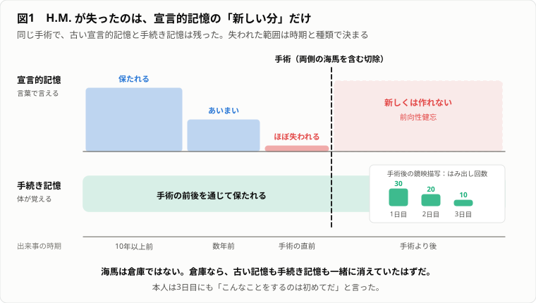
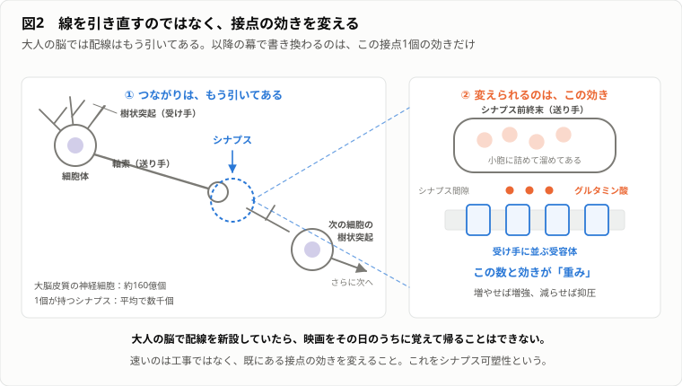
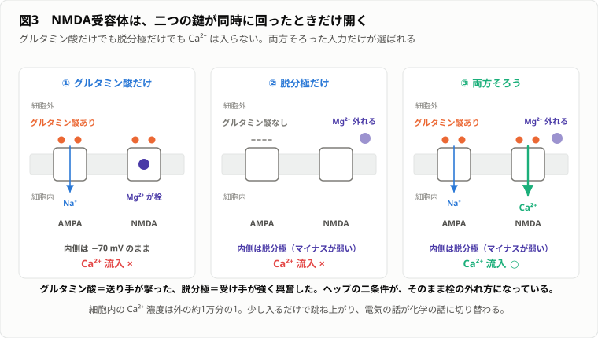
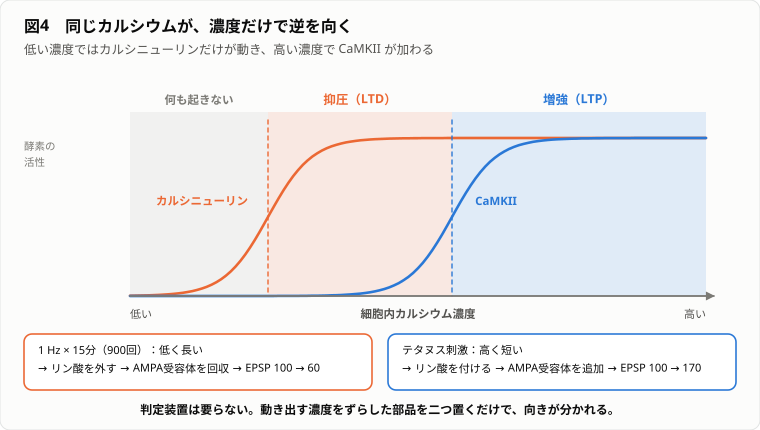
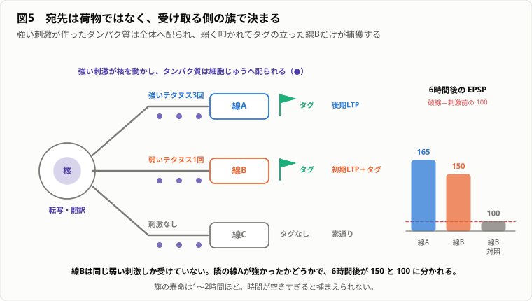
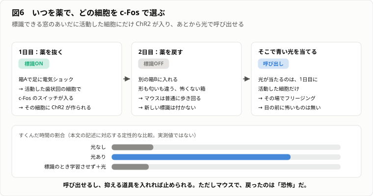
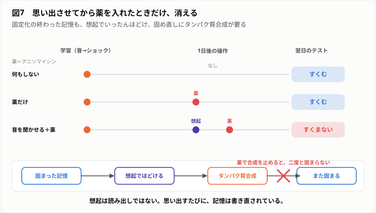
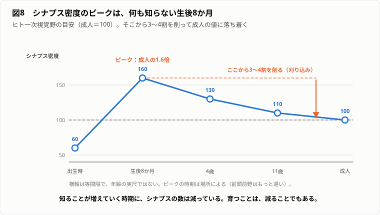

# やる夫のトータルリコール ── 記憶の分子生物学の再発見

---
## 登場人物

**やる夫** ── 32歳。生物の知識は高校の教科書と映画で止まっている。

**やらない夫** ── 商店街の「やらない夫記憶研究所」所長。店では記憶にいいという食品を売っている。

**できる子** ── 同研究所の職員。

**9マス脳** ── やる夫がノートに描く、9個の丸と、その間の結びつきの強さを書き込んだ表。全編を通じて何度も書き換える。

---
## 第1幕　記憶を売る店

---
### 1-1　火星旅行を買いに行く ── 記憶を植えるという願い

**やる夫**：
ごめんくださいだお！
火星旅行の記憶を一つくださいお！
予算は……いま財布に4,200円あるお。
足りなければ分割でもいいお。

**やらない夫**：
……そこの扉、押すんじゃなくて引くやつだぞ。
壊すな。

**やる夫**：
そんなことより記憶だお。
看板に「記憶研究所」って書いてあったお。
研究所なんだから、記憶を作ってるはずだお。

**やらない夫**：
うちが売ってるのはこれだ。
イチョウ葉エキス配合、1瓶60粒、3,800円。
記憶の研究をしてるのは俺個人の趣味で、店で売ってるのはサプリメントだ。
火星旅行は取り扱ってない。

**やる夫**：
……嘘だお。
やる夫はさっき映画を観てきたんだお。
トータルリコールだお。
主人公が店に行って、行ったこともない火星旅行の記憶を頭に入れてもらうんだお。
本人は本当に行ったと思ってるんだお。
あれをやってほしいお。

**やらない夫**：
1990年の映画だな。原作はフィリップ・K・ディックだ。
で、なんでお前がそれを欲しがる。

**やる夫**：
……やる夫は32年生きてきて、人に話せる思い出が一つもないんだお。
同窓会で「最近どう」って聞かれて、答えることがないんだお。
あるのは、コンビニの新商品を買って外れだったとか、そういうのばっかりだお。
だったら買えばいいと思ったんだお。
どうせ頭の中にしかないものなら、本物でも偽物でも同じだお。

**やらない夫**：
……。
座れ。茶ぐらい出す。

**やる夫**：
売ってくれるのかお！？

**やらない夫**：
売らん。話を整理するだけだ。
お前は「記憶を植える」と言った。
具体的に、何を、どこへ入れるつもりだ。

**やる夫**：
そんなの決まってるお。
脳の中に記憶の引き出しがあるんだお。
生まれてからの出来事が、一件ずつファイルになってしまってあるお。
やる夫の引き出しはスカスカだから、そこへ「火星旅行」ってファイルを追加すればいいお。
コピーして貼り付けるだけだお。簡単だお。

**やらない夫**：
悪くない発想だ。少なくとも、何をすればいいかがはっきりしてる。
じゃあ聞くが、その引き出しは頭のどのへんにある。

**やる夫**：
……どのへん。

**やらない夫**：
場所が分からなきゃ注射針も刺せんだろ。
お前の案は「引き出しがある」が前提だ。前提がなきゃ手が動かない。

**やる夫**：
ええと、頭のうしろのほうかお。
なんとなくうしろっぽいお。

**やらない夫**：
なんとなくで探して30年潰した男がいる。
カール・ラシュリーっていうアメリカの心理学者だ。
記憶の痕跡には名前もついてる。エングラム（engram）だ。
1904年にリヒャルト・ゼモンっていうドイツの生物学者が作った言葉で、経験が体に残した物理的な痕跡、という意味だ[^1]。

**やる夫**：
名前があるってことは、見つかってるんだお。
どこにあったんだお。

**やらない夫**：
それを話す。ただし先に言っておく。
ラシュリーは見つけられなかった。
そして、見つけられなかったこと自体が答えの一部だ。

**やる夫**：
……。
なんか嫌な予感がしてきたお。
やる夫、引き出しの場所さえ分かればいいと思ってたのに、その引き出しがどこにあるか分からないって話が始まってるお。
記憶がどこにあるか分からないのに、書き込めるわけないお。

---
### 1-2　どこを削っても薄く残る ── 貯蔵庫仮説の破綻

**やらない夫**：
ラシュリーがやったことは単純だ。
ネズミに迷路を覚えさせる。餌までの正しい道順を、間違えなくなるまで訓練する。
そのあと大脳皮質（cerebral cortex）の一部を切除して、もう一度走らせる。
記憶の引き出しを削り取れば、その記憶だけが消えるはずだ。

**やる夫**：
分かりやすいお。
削って消えたところが引き出しだお。
宝探しみたいなもんだお。

**やらない夫**：
そうだ。で、結果がこれだ。
数字は丸めてある。細かい値じゃなく傾向を見ろ。

| 切除した皮質の割合 | 迷路の誤り数 |
|---|---|
| 0%（無傷） | 10 |
| 10% | 13 |
| 25% | 21 |
| 50% | 39 |

**やる夫**：
おお、ちゃんと悪くなってるお。
削れば削るほどダメになってるお。順調だお。

**やらない夫**：
まだ半分だ。次はこっちを見ろ。
どれも切除量は同じ25%で、切った場所だけを変えてある。

| 切除した場所（いずれも25%） | 迷路の誤り数 |
|---|---|
| 前のほう | 20 |
| 横のほう | 22 |
| うしろのほう | 21 |

**やる夫**：
……。
えっ。
20、22、21。
ほとんど同じだお。

**やらない夫**：
場所を変えても結果が変わらん。
お前の引き出し説だと、これはどうなる。

**やる夫**：
おかしいお。
引き出しがうしろにあるなら、うしろを削ったときだけ大打撃で、前を削っても平気なはずだお。
なのに、どこを削っても同じだけ悪くなってるお。
……ということは。

**やらない夫**：
言え。

**やる夫**：
……迷路の記憶は、どこか一か所に入ってるんじゃないお。
皮質じゅうに薄く広がってるお。
だから、どこを削っても同じだけ減るんだお。
削った場所じゃなくて、削った量が効いてるお。

**やらない夫**：
ラシュリーもそう書いた。量が効くこと、そして皮質のどの部分でも同じくらい効くこと。
この二つを合わせて、記憶は分散しているという結論になる。
本人はこの結果に相当参ってて、こう書いてる。
「記憶の局在に関する証拠を振り返っていると、必要な結論は、学習などそもそも不可能だ、ということになりそうな気がしてくる」[^2]。

**やる夫**：
やる夫も同じ気持ちだお。
でも待つお。それだと逆に困るお。
薄く広がってるなら、火星旅行の記憶も脳じゅうに薄く塗るってことかお。
どうやって塗るんだお。刷毛で塗るのかお。

**やらない夫**：
落ち着け。まだ塗る話は早い。
それと、分散してるってのは「均一に塗ってある」って意味ではない。
ラシュリーが使ったのは迷路だ。ネズミは匂い、触覚、視覚、体の動き、いろんな手掛かりで走ってる。
どれか一つの感覚を潰しても、残りで走れる。だから成績はなだらかに落ちる。

**やる夫**：
……あっ。
それ、削って消えなかったんじゃなくて、そもそも同じ道順が何通りもの手掛かりで覚えられてたってことかお。
一つの記憶が一つのファイルじゃなくて、いろんな部品の寄せ集めなんだお。

**やらない夫**：
そっちのほうが正しい読み方だ。
記憶の中身によって、関わる場所は違う。色は視覚野、音は聴覚野、体の動きは運動系だ。
ただ、一つの出来事の記憶は、その全部にまたがってる。
だから一か所を削っても丸ごとは消えない。

**やる夫**：
なるほどだお。
つまり、脳には引き出しがないんじゃなくて、引き出しが全身のあちこちにバラバラに置いてあって、一つの思い出はその引き出しを何個も使ってるってことだお。
……あれ。
それだと、バラバラの引き出しを「これは同じ一つの出来事です」ってまとめてるやつがどこかにいるはずだお。
そいつがいないと、赤い空と、エンジンの音と、体が軽い感じが、全部バラバラのままだお。

**やらない夫**：
いま、いいことを言ったな。
その話は明日にする。今日は閉店だ。
……あと、これ持ってけ。売れ残りだ。

**やる夫**：
イチョウ葉エキスだお。
これ飲めば思い出せるのかお。

**やらない夫**：
そんなわけねぇだろ、常考。

---
### 1-3　覚えていないのに上手くなる ── 記憶が一種類ではないこと

〜〜 翌日 〜〜

**やる夫**：
所長！
やる夫、昨日の夜に答えを出したお。
バラバラの引き出しをまとめてる係がいるんだお。
そいつが記憶の本体だお。
そこに火星旅行のファイルを入れれば、あとは勝手にバラまいてくれるお。
名前も調べたお。海馬（hippocampus）だお。記憶といえば海馬だお。

**やらない夫**：
早いな。今日はまだ開店前だ。
で、その海馬にどうやって入れる。

**やる夫**：
注射だお。
やる夫、耳の奥まで届く長い針を用意してきたお。

**やらない夫**：
片付けろ。刺すな。
その前に、実際に海馬を失った人の話をする。
1953年、当時27歳の男性が、重いてんかんの治療のために脳の手術を受けた。
左右の側頭葉の内側を、海馬を含めて切除した。
論文では H.M. というイニシャルで呼ばれ続けた。本名はヘンリー・モレゾンだ[^3]。

**やる夫**：
てんかんは治ったのかお。

**やらない夫**：
発作はかなり減った。だが別のものが失われた。
手術後の彼は、新しい出来事を覚えられなくなった。
その日会った人を、部屋を出て戻ってくると忘れている。
同じ雑誌を何度でも初めて読むように読む。

**やる夫**：
……つまり、海馬が記憶の本体で合ってるお。
海馬を取ったから記憶が作れなくなったんだお。
やる夫の仮説どおりだお。やっぱりやる夫は天才だお。

**やらない夫**：
そう来ると思った。ここでデータを見せる。
H.M. に鏡映描写ってのをやらせた実験がある。
星形の図形を、鏡に映った像だけを見ながら、線からはみ出さずになぞる。
やってみるか。鏡はそこだ。

**やる夫**：
簡単だお。
……うわっ、手が逆に動くお！
なんだこれ、右に動かしたいのに左に行くお！

**やらない夫**：
初回はみんなそうなる。
H.M. は3日間、毎日10試行やった。はみ出した回数の平均がこれだ。

| 日 | はみ出し回数（10試行の平均） |
|---|---|
| 1日目 | 約30 |
| 2日目 | 約20 |
| 3日目 | 約10 |

**やる夫**：
減ってるお。
上手くなってるお。
……えっ。
待つお。おかしいお。
この人、新しいことを覚えられないんじゃなかったのかお。

**やらない夫**：
そこだ。もう一つ付け加える。
3日目に課題を出されたとき、彼は「こんなことをするのは初めてだ」と言った。
そして、こうも言った。「思ったより簡単だな」と[^4]。

**やる夫**：
……。
やったことを覚えてないのに、腕は上がってるお。
本人は初めてのつもりなのに、体は3日分の練習を持ってるお。
気持ち悪いお。

**やらない夫**：
気持ち悪いだろ。じゃあ、その気持ち悪さを言葉にしてみろ。
お前の「海馬が記憶の本体」説は、これで何がまずくなった。

**やる夫**：
ええと……。
海馬を取ったのに、残ってる記憶があるお。
だから海馬は「記憶の本体」じゃないお。
海馬が担当してるのは、記憶の全部じゃなくて一部だけだお。
……いや、そうじゃないお。
一部っていうか、種類が違うお。
「昨日これをやった」っていう記憶と、「手がこう動く」っていう記憶は、別の仕組みで動いてるお。

**やらない夫**：
それでいい。
前者を宣言的記憶（declarative memory）、言葉で言える記憶と呼ぶ。後者を手続き記憶（procedural memory）と呼ぶ。
H.M. で失われたのは前者だ。後者は残った。
言葉で報告できるかどうかで切った、乱暴な区別ではある。あとでもっと細かく割る。

**やる夫**：
所長、じゃあやる夫の計画はどうなるお。
火星旅行の記憶は、宣言的記憶のほうだお。
海馬を取るとそれが作れなくなるなら、やっぱり海馬が要るお。

**やらない夫**：
要る。だが「そこに入ってる」とは限らん。
H.M. はもう一つ、決定的なことを教えてくれる。
彼は手術前の出来事を、全部忘れたわけじゃない。
子どものころの記憶、家族のこと、少年時代に住んでいた街のことは語れた。

**やる夫**：
……。
海馬を取ったのに、昔の記憶は残ってるお。
海馬が倉庫なら、倉庫ごと持ってかれたんだから全部消えるはずだお。
なのに古いのは残って、新しいのだけ作れないお。
……所長、やる夫はいま、何を勘違いしてたか分かったお。
やる夫はずっと「記憶がどこにあるか」を探してたお。
でもこれ、「いつの記憶か」で答えが変わる話だお。
場所の問題じゃなかったお。

---
### 1-4　新しいものだけが消える ── 海馬は倉庫ではない

**やらない夫**：
そこに気づいたなら、もう少し正確に測ろう。
H.M. の失われた記憶を、時間軸で並べるとこうなる。数字は研究ごとに幅があるから、形だけ見ろ。

| 出来事の時期 | 思い出せるか |
|---|---|
| 手術より10年以上前 | だいたい保たれる |
| 手術の数年前 | あいまい |
| 手術の直前 | ほぼ失われる |
| 手術より後 | 新しくは作れない |

**やる夫**：
古いほど残ってるお。
手術に近づくほど消えてるお。
……坂になってるお。崖じゃないお。

**やらない夫**：
その坂を、逆行性健忘（retrograde amnesia）の時間勾配と呼ぶ。
手術より前の記憶が失われるのが逆行性健忘、あとの記憶が作れないのが前向性健忘（anterograde amnesia）だ。
H.M. は前向性健忘が全面的で、逆行性健忘には勾配がある。

図1：失われたのは、宣言的記憶のうち手術に近い分と手術後の分だけだ（タップ／クリックで原寸表示）。

**やる夫**：
つまりこういうことかお。
新しい記憶は海馬に置いてあって、時間が経つと別のところへ移されるお。
引っ越しが終わったやつは海馬を取っても平気で、まだ引っ越し中のやつは巻き添えで消えるお。
倉庫じゃなくて、仮置き場だお。

**やらない夫**：
それが標準的な説明の骨格だ。時間をかけて記憶が安定していく過程を、固定化（consolidation）という。
ただ、お前の言い方には一つ罠がある。
「移す」ってのは、荷物を運び出して海馬を空にする、って意味か。

**やる夫**：
そうだお。
引っ越しなんだから、出ていったら元の家には何も残らないお。

**やらない夫**：
じゃあ質問だ。
お前が10年前に住んでた部屋を思い出せ。窓から何が見えた。

**やる夫**：
えっ。
……えーと、向かいのアパートの外壁だお。
グレーで、途中まで蔦が這ってて、右下に室外機が三つ並んでたお。
夏になると室外機の音がうるさくて、窓を開けたくなかったお。

**やらない夫**：
10年前の記憶を、いま、かなり細かく出したな。
その細かい思い出しをやってるとき、海馬は働いてる。
古い記憶を詳しく思い出すときは海馬が再び関与する、という報告がいくつもある。
これは「引っ越して空になった」と噛み合わん。

**やる夫**：
ぐぬぬ。
じゃあどっちなんだお。
移るのか、移らないのかお。

**やらない夫**：
そこは決着していない。研究者が二派に分かれて三十年やり合ってる。
その喧嘩は第6幕でちゃんと見せる。今日はもっと手前の話だ。
海馬が倉庫じゃないなら、何をやってる。ヒントは昨日お前が自分で言ったことだ。

**やる夫**：
昨日……。
バラバラの引き出しをまとめる係が要る、って言ったお。
……あっ。
海馬がやってるのはそれかお。
赤い空は視覚野、エンジン音は聴覚野、体の軽さは体の感覚の担当で、中身はそっちにあるお。
海馬はその置き場所のリストを持ってるだけだお。
本を持ってるんじゃなくて、目次を持ってるお。

**やらない夫**：
その考え方を索引仮説という。海馬は皮質の活動パターンに索引を張る、という主張だ[^5]。
索引だから、一部の手掛かりを与えられれば、残りの置き場所を全部呼び出せる。
匂いだけで、その日の情景が丸ごと戻ってくることがあるだろ。あれだ。

**やる夫**：
分かってきたお。
そしてH.M. は目次を作る機能を失ったんだお。
だから新しい出来事の部品はバラバラのまま散らばって、二度と一つにまとまらないお。
体の動かし方は目次を通さない仕組みだから残ったお。

**やらない夫**：
概ねそれでいい。
で、お前の火星旅行はどうなった。

**やる夫**：
……最悪だお。
やる夫は「火星旅行ファイル」を一個作って一か所に入れればいいと思ってたお。
でも実際は、赤い空を視覚野に、エンジン音を聴覚野に、体の軽さを感覚の担当のところに書いて、その全部を海馬の目次で結ばないといけないお。
一か所じゃなくて、何か所も同時だお。
……所長、そもそもやる夫はまだ「書く」が何のことか分かってないお。
細胞に何をしたら「書いた」ことになるんだお。

**やらない夫**：
やっと本題だ。
明日、紙とペンを持ってこい。

---
### 1-5　9マス脳を書き換える(1) ── 分散した痕跡を自分で作る

**やらない夫**：
今日は脳を作る。9個でいい。

**やる夫**：
9個の脳かお。

**やらない夫**：
9個の神経細胞（neuron）だ。ノートに丸を9個描け。番号を振れ。
(1)(2)(3)は目から来る信号を受け取る細胞ってことにする。
(4)(5)(6)は耳から。(7)(8)(9)は体の感覚からだ。

**やる夫**：
描いたお。
中身も決めていいかお。
(1)は赤い空、(2)は砂の丘、(3)は船窓の光だお。
(4)はエンジン音、(5)は無線の声、(6)は空調の音だお。
(7)は体の軽さ、(8)は手袋のごわつき、(9)は恐怖だお。

**やらない夫**：
……全部、火星旅行の部品だな。
まあいい。それで進めるか。
次に、細胞と細胞の結びつきの強さを表に書く。これを重みと呼ぶ。全部0から始める。

**やる夫**：
全部0だお。まっさらだお。

**やらない夫**：
ルールは二つだけだ。
一つ、同時に発火した細胞どうしは、重みが1増える。
二つ、ある細胞は、そこへ入ってくる重みの合計が2以上になると発火する。

**やる夫**：
覚えたお。
2以上で発火、同時に光ったら+1だお。

**やらない夫**：
じゃあ火星に降りろ。
赤い空を見て、エンジン音を聞いて、体が軽い。(1)(4)(7)が同時に発火した。
重みを書き換えろ。

**やる夫**：
(1)と(4)が1、(1)と(7)が1、(4)と(7)が1だお。
残りは全部0のままだお。

| | (1) | (4) | (7) |
|---|---|---|---|
| (1) | ─ | 1 | 1 |
| (4) | 1 | ─ | 1 |
| (7) | 1 | 1 | ─ |

**やらない夫**：
書けたな。じゃあ思い出させてみる。
赤い空だけを見せる。(1)だけを発火させろ。(4)と(7)はどうなる。

**やる夫**：
(4)に入ってくるのは、(1)からの1だけだお。
1は2より小さいお。
……発火しないお。
(7)も同じだお。1しか来てないお。
思い出せてないお！？
なんでだお、ちゃんと書き込んだのに！

**やらない夫**：
一度で覚えられたら苦労せんだろ。
何が足りない。

**やる夫**：
入力が弱いお。
1本しか線が来てなくて、その線が細いお。
……あっ。
もう一回行けばいいんだお。
火星にもう一度降りれば、また(1)(4)(7)が同時に光って、重みが2になるお。

**やらない夫**：
やってみろ。

**やる夫**：
(1)(4)間が2、(1)(7)間が2、(4)(7)間が2だお。
それで(1)だけ光らせるお。
(4)に入るのは2だお。2以上だから発火するお！
(7)にも2だから発火するお！
出たお！ 赤い空を見ただけで、エンジン音と体の軽さが戻ってきたお！

**やらない夫**：
それが、一部の手掛かりから全体が復元される現象だ。パターン補完と呼ぶ。
お前がさっき窓の外の室外機を三つ思い出したのも、形はこれだ。
ついでに確認しておく。この記憶はどこに入ってる。

**やる夫**：
……どこにも入ってないお。
丸の中には何も書いてないお。
書いてあるのは丸と丸のあいだの表だけだお。
記憶は細胞の中身じゃなくて、細胞と細胞の結びつき方だお。

**やらない夫**：
それが今日いちばん大事なところだ。
そして、お前の最初の質問への答えの半分でもある。
「書く」ってのは、細胞に文字を刻むことじゃない。重みを変えることだ。

**やる夫**：
……つまりだお。
やる夫が火星旅行の記憶を手に入れるには、(1)(4)(7)の重みを2にすればいいだけだお。
9個の細胞なら表は36マスだお。全部やる夫が指定して書き込めば、記憶の完成だお。
これ、意外と簡単なんじゃないかお！？
所長、やる夫、大儲けの予感がしてきたお！
記憶書き込みサービスだお！ 1件10万円だお！

**やらない夫**：
その前に一つ実験しろ。
火星を思い出すたびに(1)(4)(7)が同時に光る。ルール1に従えば、そのたび重みが増える。
思い出すのを、あと5回やれ。

**やる夫**：
7だお。(1)(4)間が7だお。
……あ。
やる夫、砂の丘(2)と無線の声(5)と手袋(8)の記憶も入れたいお。
やってみるお。(2)(5)(8)を2回光らせて、重みを2にするお。
それで(2)だけ光らせるお。(5)に2だから発火するお。……ちゃんと動くお。

**やらない夫**：
じゃあ、(1)と(2)を同時に光らせてみろ。赤い空と砂の丘を同時に見た、ってことだ。

**やる夫**：
(1)(2)が同時だから、(1)(2)間の重みが1増えるお。
それから(4)には(1)から7、(7)には(1)から7、(5)には(2)から2、(8)には(2)から2……。
うーん、全部発火するお。
……あれ。
これ、何回も繰り返してるうちに、全部の重みが2以上になっちゃわないかお。

**やらない夫**：
なるか。確かめろ。

**やる夫**：
なるお！
生きてれば毎日いろんなものを同時に見るお。ルール1は増えるしか書いてないお。
だから重みは増える一方で、そのうち36マス全部が2以上になるお。
そうなったら、どれか1個光らせただけで9個全部が光るお。
それは思い出したんじゃなくて、ただ全部同時に鳴ってるだけだお。
記憶が全部つぶれるお。

**やらない夫**：
自分で潰したな。今日はそれでいい。
お前の書いたルール1は、ヘッブという心理学者が1949年に書いたものの、いちばん素朴な形だ。
明日はそこから始める。

**やる夫**：
1件10万円は無理そうだお……。
でも所長、今日は一つ確かなことを掴んだお。
記憶は丸の中じゃなくて、丸と丸のあいだにあるお。
だからやる夫が本当に知らなきゃいけないのは、あの表の数字が、細胞の中で何でできてるかだお。

---
## 第2幕　同時に燃えた線

---
### 2-1　線を引き直せばいい ── 何が変わりうるのか

**やる夫**：
所長、おはようだお。
昨日の宿題、やる夫なりに考えてきたお。
重みが増えるだけだと全部つぶれるお。だから、そもそも重みなんて仕組みにしないほうがいいお。
新しい記憶を作るときは、新しい細胞を生やして、新しい線をそこへ引けばいいお。
記憶ごとに専用の配線を作るお。そうすれば混ざらないお。

**やらない夫**：
おお、正面から来たな。
それができるなら確かに混線しない。じゃあ数を数えるぞ。
ヒトの大脳皮質の神経細胞は、だいたい160億個ある。
お前は32歳だ。1日にいくつ新しいことを覚える。

**やる夫**：
うーん、真面目に数えたことないお。
朝のニュース、人の名前、道順、店の場所……。
100個くらいはあるかお。

**やらない夫**：
控えめだが乗ってやる。100個だ。
32年で何個だ。

**やる夫**：
100かける365かける32だお。
えーと、100かける365は36,500だお。それの32倍だから……1,168,000だお。
約117万個だお。
……160億に比べたら全然余裕だお！ 足りるお！

**やらない夫**：
数の話では潰れんな。じゃあ別のところを潰す。
その新しい細胞は、どこから来る。

**やる夫**：
生まれるお。細胞は分裂するお。

**やらない夫**：
大人の脳で、神経細胞が新しく生まれる場所はほとんどない。
歯状回っていう海馬の一部でいくらか作られてるという報告はあるが、それでも量は限られてて、ヒトで成人期にどれだけ続くかは論争中だ。
少なくとも、大脳皮質全体で毎日100個ずつ新品を配れる、という話ではない。

**やる夫**：
そんなはずないお。
赤ちゃんは何も知らないお。大人はいろいろ知ってるお。
その差は、増えた分に決まってるお。
生まれてから大人になるまでのあいだに、細胞も線もどんどん増えてるはずだお。

**やらない夫**：
そこは後で丸ごと一幕使ってやる。先に結論だけ言っておく。
育つ過程で、神経細胞もシナプス（synapse）も、増えたあとに大量に減る。
ピークは大人になる前だ。減ることで形になる。

**やる夫**：
……えっ。
減ることで賢くなるのかお。
そんなの、聞いたことがないお。

**やらない夫**：
だから後でやると言ってる。いま脱線すると道具が足りん。
今日の話は大人の脳だ。続けろ。

**やる夫**：
むむ。気になるけど我慢するお。
じゃあ既にある細胞に、新しく線を引くお。
線を伸ばすのは分裂じゃないから、できそうだお。

**やらない夫**：
そっちも数えろ。
大脳皮質の神経細胞1個は、平均で数千個のシナプスを持ってる。
お前が新しい線を1本引くとして、脳のどこからどこまで、何ミリ伸ばすつもりだ。誰が道案内する。

**やる夫**：
……分からないお。
配線工事だお。工期がかかるお。
覚えるのに3か月かかるお。

**やらない夫**：
そういうことだ。発生期には実際に軸索（axon）が長距離を伸びて回路を作る。
だが大人の脳で、記憶するたびに数センチの配線を新設してたら、間に合わん。
お前は昨日、映画の内容をその日のうちに覚えて帰ったろ。

**やる夫**：
……。
恥ずかしいお。やる夫はまた見当違いのことを言ってたお。
線を引き直す必要はないお。線はもう引いてあるお。
1個の細胞が何千本も持ってるんだから、繋がりたい相手とはもう繋がってるお。
足りないのは線じゃなくて、その線をどれくらい効かせるかだお。
……つまり、やっぱり重みだお。昨日の表に戻ってきたお。

**やらない夫**：
戻ってきたな。しかも今度は、なぜ重みでなきゃいけないかを自分で言った。
配線は既にある。速いのは配線工事じゃなく、既存の接点の効き具合を変えることだ。
これをシナプス可塑性（synaptic plasticity）という。

**やる夫**：
でも所長、昨日つぶれたお。
増える一方だと全部2以上になるお。

**やらない夫**：
つぶれたのはお前が書いたルールだ。ルールを直せばいい。
まず、そのルールがどこから来たのかを知れ。

---
### 2-2　同時に燃えた細胞をつなぐ ── ヘッブ則と、その暴走

**やらない夫**：
ドナルド・ヘッブというカナダの心理学者が、1949年に本を出した。
そこに書いてあることを縮めると、こうなる。
細胞Aが細胞Bを繰り返し発火させることに関わったなら、AがBを発火させる効率が上がるような変化が、どちらか一方または両方に起こる[^6]。

**やる夫**：
やる夫のルール1とほぼ同じだお。
標語にすると「同時に燃えた細胞は、つながる」だお。

**やらない夫**：
その標語自体は後の人が付けたキャッチコピーだ。原文はもう少し慎重に書いてある。
違いが分かるか。ヘッブは「同時に光った」とは書いていない。

**やる夫**：
えーと。
AがBを発火させることに関わった、って書いてあるお。
……ただ同時じゃなくて、AのせいでBが光った、って順番があるお。
やる夫のルールは、たまたま同時ならなんでも+1だったお。

**やらない夫**：
そこが今日の分かれ道だ。ただ、まだ手を動かせ。
お前が昨日つぶした場面を、もう一度きちんと見る。
9マス脳で、(1)(4)(7)の記憶と、(2)(5)(8)の記憶を両方入れた状態だったな。

**やる夫**：
そうだお。両方とも重み2で入ってるお。

**やらない夫**：
そこへ、日常生活を10日ぶんやる。
毎日、たまたま(1)と(2)が同時に目に入る。景色に赤い空も砂の丘も入ってるからな。
10日で(1)(2)間の重みはいくつだ。

**やる夫**：
10だお。

**やらない夫**：
じゃあ(1)だけ光らせろ。何が起きる。

**やる夫**：
(4)に2、(7)に2、(2)に10だお。
(2)が光るお。(2)が光ると(5)に2、(8)に2だお。
……全部光るお。9個中6個が光ってるお。
赤い空を見ただけで、無線の声も手袋のごわつきも出てくるお。
そんなの覚えてないお。混ざってるお。

**やらない夫**：
これが混線だ。ここでもう一段いく。
(1)(2)間の重みは10まで育った。そこへ、まったく別の記憶を入れようとしてみろ。
(3)と(6)を2回同時に光らせて、重み2にする。それから(3)だけ光らせろ。

**やる夫**：
(6)に2が入るから(6)は光るお。
……いや待つお。(3)も(1)(2)と何回か同時になってるはずだお。生活してればどれも同時に見えるお。
そしたら(3)から(1)へも線ができて、(1)が光って、(2)が光って、結局また全部光るお。
2という数字が小さすぎるお。10のやつが混ざってると勝てないお。

**やらない夫**：
言い方を変えろ。何が問題なんだ。「小さすぎる」じゃなく、構造を言え。

**やる夫**：
……ええと。
このルールには、増える仕掛けしかないお。
だから重みはずっと右肩上がりで、いつか全部が閾値を超えるお。
そして、古くから何度も同時に光った組ほど強くなるから、新しい記憶は絶対にそいつに勝てないお。
記憶を入れれば入れるほど、何を入れても同じ答えしか返ってこない脳になるお。
覚えることが、思い出せなくなる原因になってるお。

**やらない夫**：
きれいに言えたな。飽和と、それによる混線だ。
つまり、ヘッブの原理は必要だが足りん。足りないのは二つある。

**やる夫**：
二つかお。
一つは分かるお。減る仕組みだお。増えるだけなら振り切れるお。
もう一つは……。

**やらない夫**：
そこはもう自分で言いかけてる。さっき「AのせいでBが光った、って順番がある」と言ったろ。

**やる夫**：
……あっ。
たまたま同時なだけのやつを、つないじゃいけないお。
やる夫の(1)と(2)は、ただ同じ景色の中にあっただけだお。(1)が(2)を光らせたわけじゃないお。
本当につなぐべきなのは、(1)が実際に(2)を光らせたときだけだお。
……でも所長、それを細胞はどうやって知るんだお。
細胞(1)は、自分が出した信号のせいで(2)が光ったかどうかなんて、見えないお。

**やらない夫**：
そこだ。今日はそこまででいい。
明日は、実験のほうを見せる。紙の上じゃなくて、本物のシナプスで重みが増える現場だ。

**やる夫**：
そんなの見られるのかお。

**やらない夫**：
1973年から見られてる。

---
### 2-3　テニスボールから隣の駅まで ── 線と丸の正体

**やる夫**：
所長、おはようだお！　今日は実験を見せてくれる日だお。
……あれ、机の上に何もないお。装置はどこだお。

**やらない夫**：
その前に紙を出せ。お前、昨日から丸と矢印で脳を描いてるだろ。
あれを、本物の神経細胞の形で描き直せ。

**やる夫**：
えー、そんなの飾りだお。中身は昨日の表で合ってるお。

**やらない夫**：
測る対象の形を知らんまま数字を見ると、数字がただの数字になる。
昨日お前が書いた「重み」ってのは、これから物として出てくるんだ。どこに置いてある物なのか、先に見ておけ。

**やる夫**：
むむ。じゃあ描くお。
丸を描くお。これが細胞1個だお。
所長、前に「1個の細胞は数千か所つながってる」って言ってたお。だから丸から線を数千本、ぶわーっと生やすお。
その線の先が、それぞれ隣の丸にくっつくお。
できたお。ウニだお。

**やらない夫**：
半分だけ合ってる。数千か所つながってるのは本当だ。
だが、出ていく線は1個につき1本きりだ。ウニじゃない。

**やる夫**：
1本かお。それなら数千か所ってのが嘘になるお。
1本の線は、1か所にしか届かないお。

**やらない夫**：
そうか？　庭の木を思い浮かべろ。地面から出てる幹は何本だ。葉っぱは何枚だ。

**やる夫**：
……あっ。
枝分かれするお。1本出て、分かれて、また分かれて、最後は何千という枝先になるお。
その枝先の1本1本が、別々の相手にくっつけばいいお。
1本でも数千か所だお。矛盾してないお。

**やらない夫**：
それだ。その出ていく1本を軸索という。途中で出す枝を側枝（collateral）という。
お前が描いた丸のほうは細胞体（soma）だ。核が入ってる本体部分で、軸索はそこから飛び出した別のパーツだ。
ついでに用語を揃えておく。神経細胞とニューロンは同じものだ。日本語か英語かの違いでしかない。以後ただ「細胞」と言ったら、この脳の中の神経細胞のことだと思え。筋肉や皮膚の細胞と紛れるときだけ断る。

**やる夫**：
丸が細胞体、そこから出る1本が軸索、枝分かれした先が相手にくっつくお。
……その、くっつくところに名前はあるのかお。昨日から「重み」って呼んでる場所だお。

**やらない夫**：
シナプスだ。
信号を出す側を送り手（presynaptic）、受け取る側を受け手（postsynaptic）と呼ぶ。矢印には向きがある。お前の絵、線が両向きになってるが、1個のシナプスは一方通行だ。
そして受け手の細胞も、当然また別のニューロンだ。そいつは自分の軸索を持ってて、別の誰かに対しては送り手になる。この関係が何十億個も鎖でつながって、回路になってる。

**やる夫**：
描き直すお。丸から1本、枝分かれ、先っぽがシナプス、向きは一方通行だお。
……で、受け取る側は、この線がそのまま丸にぶすっと刺さってるでいいのかお。

**やらない夫**：
そこも違う。受け手の側にも突起がある。
細胞体から、軸索とは別に、木の枝みたいに何本も生えてるやつだ。これを樹状突起（dendrite）という。入力を受け取るアンテナだと思え。
軸索の枝先は、この樹状突起の表面のどこかにくっついてシナプスを作る。細かい構造には名前が付いてるが、それは第3幕で出す。

**やる夫**：
くっつくって、どうくっついてるんだお。溶接みたいに一体化してるのかお。

**やらない夫**：
していない。ここは大事だから区別しろ。
細胞は、中身が膜という薄い袋で包まれてる。細胞体も軸索も樹状突起も、ぜんぶ1枚の膜で連続して包まれた、同じ袋の一部だ。
シナプスってのは、送り手の膜と受け手の膜が、ごく狭い隙間を挟んで向かい合ってる場所だ。触れてはいるが、袋は別々のままで、中身はつながっていない。

**やる夫**：
つながってないのかお。じゃあ信号はどうやって渡るんだお。

**やらない夫**：
そこが第3幕の話だ。今日は「別々の袋が、隙間を挟んで向かい合ってる」まででいい。
覚えておけ。この膜の内側と外側には電圧の差がある。お前が昨日「重み」と呼んだものを測るときに使うのは、その電圧だ。

**やる夫**：
袋の内と外で電圧が違うお。……それ、電池みたいだお。

**やらない夫**：
そう遠くない。詳しくは明日だ。
待て、話を戻すぞ。まだ形の話が終わってない。

**やる夫**：
そうだったお。軸索は1本だけって言ったお。樹状突起も1本かお。

**やらない夫**：
そこは逆だ。樹状突起は普通、細胞体から何本も生えてる。細胞の種類によるが、数本から十数本の太い幹が出て、それぞれがさらに何度も枝分かれする。
軸索は1本を遠くまで延ばしてから拡散する。樹状突起は最初から複数本で、細胞のすぐそばに密な茂みを作る。数千あるシナプスの大半は、この茂みの上に載ってる。

**やる夫**：
出す側と受ける側で、形からして違うんだお。
片方は遠くへ行く1本の旅人、もう片方は玄関先に広げた網だお。
……で所長、これ実際どれくらいの大きさなんだお。やる夫、ずっと丸を1センチくらいで描いてるお。

**やらない夫**：
桁がバラバラだから、そこは押さえとけ。
細胞体は直径10〜25μm。1μmは1000分の1ミリだから、0.01〜0.025ミリだ。目には見えん。
軸索はもっと細くて、太さ1μm前後。

**やる夫**：
丸もホースも、ミリの100分の1くらいだお。

**やらない夫**：
太さはな。だが軸索は長さが別物だ。近所をつなぐだけなら数ミリ、脊髄まで伸びる運動ニューロンなら1mを超える。
樹状突起は逆で、太さは付け根で3〜6μmと軸索より太いが、長さは枝1本あたり100μmから、長くても1ミリ程度で収まる。
シナプスの隙間はさらに小さい。20nm、μmのさらに1000分の1だ。

**やる夫**：
……えらい極端な形をした細胞だお。
太さはどれもミリの100分の1くらいなのに、長さだけ1mを超えるやつがいるお。

**やらない夫**：
極端で正解だ。お前が描いた丸をテニスボールくらいに拡大してみろ。同じ比率で軸索を伸ばすと、先っぽは隣の駅まで届く。
テニスボールから電車で一駅分の極細ホースが伸びてて、その切れ端が別のテニスボールにちょんと触れてる。それがシナプス1個だ。
樹状突起のほうは同じ比率で、太さが鉛筆くらい、長さは30センチから、長くても3mだ。部屋の中に収まる枝だな。

**やる夫**：
一駅と、部屋の中と、指先の3センチ。同じ細胞の話とは思えないお。
所長、その頭の中に、一駅分のホースが何十億本も入ってるのかお。

**やらない夫**：
入ってる。お前のにもな。

**やる夫**：
……。
やる夫、いま自分の絵が恥ずかしくなってきたお。
昨日やる夫が引いた矢印1本は、実は一駅分のホースが何千本にも枝分かれしたやつだお。
そして「重み」って書いた数字は、そのホースの切れ端と、相手の枝の表面が、20nmの隙間で向かい合ってる、その1点の話だお。
表のマス目1個が、そんな細かい場所だとは思ってなかったお。

図2：出ていく軸索は1本、受けるのは樹状突起の茂み。「重み」とは、その接点1個の効きだ（タップ／クリックで原寸表示）。

**やらない夫**：
そこが分かれば今日の紙は終わりだ。
明日は本当に装置を出す。その20nmの隙間の効き具合が、変えられるところを見せる。

**やる夫**：
そんな細かいところ、どうやって測るんだお。

**やらない夫**：
そこは明日の最初にやる。

---
### 2-4　一秒の刺激が何時間も残る ── 長期増強の発見

**やらない夫**：
約束どおり道具の話からだ。昨日の最後に、膜の内と外で電圧が違うと言ったろ。あれを使う。
細胞に電極を刺して、シナプスから信号が来たときに、その電圧がどれだけ動いたかを測る。
興奮性（excitatory）の入力で電位が持ち上がるやつを、興奮性シナプス後電位（excitatory postsynaptic potential, EPSP）という。

**やる夫**：
シナプス後、つまり受け取る側の電位だお。
それが大きいほど、そのシナプスが強いってことだお。
一昨日の表の数字が、これで測れるお。

**やらない夫**：
そういうことだ。大きさの感覚を持っておけ。
静止膜電位はだいたい -70 mV。そこから10〜20 mV持ち上がった -55 mV あたりが、発火の閾値だ。
一本のシナプスが単独で作るEPSPは0.1〜1 mV。

**やる夫**：
桁が二つ足りないお。それじゃ一生発火しないお。

**やらない夫**：
だから何本もの線維を束にして同時に叩く。その電位を細胞外から記録すると、数mV、強いときは10 mV近くまで出る。

**やる夫**：
待つお。いま「電極を刺して」と「細胞外から記録する」の両方を言ったお。どっちだお。
あと、そのEPSPって結局どこの電位なんだお。昨日の形でいうと、丸のほうかお、枝のほうかお。

**やらない夫**：
いい引っかかり方だ。測り方が2種類ある。
1つは電極を細胞の中に刺す方法。刺した場所の膜電位がそのまま読める。細胞体に刺せば細胞体、樹状突起に刺せばその枝の電位だ。
もう1つは電極を細胞の外、すぐそばに置くだけの方法。細胞は傷まないが、読めるのは周囲のシナプスが一斉に活動したときの、組織のわずかな電位のゆれだ。細胞外記録という。

**やる夫**：
今日の実験はどっちだお。

**やらない夫**：
後者だ。電極は樹状突起が集まってる層に置く。つまり測ってるのは丸じゃない、枝のほう、シナプスのすぐ近くだ。

**やる夫**：
1 mVにも満たない電位を、束にして初めて見える大きさにするお。
測ってる場所は、昨日の「20nmの隙間」のすぐ隣だお。

**やらない夫**：
1973年、ティム・ブリスとテリエ・レモがウサギの海馬でやった実験がある[^7]。
海馬へ入ってくる線維の束を刺激して、受け手側の EPSP を測る。
まず、弱い刺激をぽつぽつ与えて、基準の大きさを記録する。

**やる夫**：
普段の強さを測っておくお。

**やらない夫**：
次に、短時間だけ高い頻度で刺激をぶち込む。1秒間に100回とか、そういう強さだ。
これをテタヌス刺激（tetanic stimulation）という。
そのあと、また元の弱い刺激に戻して EPSP を測る。

**やる夫**：
強く叩いたあとに、そっと叩いて確かめるお。
まあ、叩いた直後はちょっと大きくなるかもしれないお。
でもすぐ元に戻るお。細胞は疲れるお。

**やらない夫**：
結果だ。基準を100として、EPSP の大きさの目安を並べる。

| テタヌス刺激からの経過 | EPSPの大きさ |
|---|---|
| 直前 | 100 |
| 1分後 | 190 |
| 30分後 | 165 |
| 3時間後 | 155 |
| 数時間〜数日後 | 上昇したまま |

**やる夫**：
……戻ってないお。
3時間経っても1.5倍のままだお。

**やらない夫**：
麻酔をかけていない動物で電極を植え込んだままにした場合、日単位で残った例もある。
1秒かそこらの刺激で、シナプスの効き方が何時間も何日も変わる。
これを長期増強（long-term potentiation, LTP）という。

**やる夫**：
……所長。
やる夫、いまちょっと鳥肌が立ってるお。
これ、記憶そのものじゃないかお。
一瞬の出来事が、何日も残る。まさにそれだお。

**やらない夫**：
落ち着け。そこは慎重にいく。
LTP は、脳のスライスや麻酔下の動物で、電極を使って人工的に起こした現象だ。
お前が昨日の映画を覚えてる、って話とは、まだ何の関係も証明されていない。
いま分かったのは「シナプスの重みは、実際に長時間変えられる」ってことだけだ。

**やる夫**：
むむ。でも、それでも大きいお。
一昨日やる夫が紙に書いた「重み」が、実在するものだと分かったお。
表の数字は空想じゃなかったお。

**やらない夫**：
そこは認める。俺が学生のころ、この論文が可塑性の研究をまるごと立ち上げた。
ただ、お前に一つ確かめさせたいことがある。
このLTP、ヘッブ則になってるか。

**やる夫**：
……。
なってないお。
だってこの実験、入ってくる線維の束を外から電気でバチバチ刺激しただけだお。
受け手の細胞が「自分も発火したかどうか」なんて、どこにも出てこないお。
これだと、送り手が強く撃てば無条件に重みが増える、ってルールだお。
やる夫の(1)(2)問題と同じで、たまたま強い入力があれば全部つながっちゃうお。

**やらない夫**：
いいところを突いた。
実際、当時から同じ疑問が出てる。増えてるのは送り手が出す量なのか、受け手の感度なのか。
そして、どういう条件のときに増えるのか。
明日はその条件を絞る。

**やる夫**：
条件かお。

**やらない夫**：
そうだ。増えるための条件が分かれば、増やす方法も分かる。
お前が本当に欲しいのは、そっちだろ。

---
### 2-5　隣の線は強くならない ── 特異性・協調性・連合性

**やらない夫**：
今日は入力を2本にする。
1個の細胞に、別々の場所から2本の線が来てるとしろ。線Aと線Bだ。
9マス脳でいえば、(4)に(1)からの線と(2)からの線が来てるようなもんだ。

**やる夫**：
分かったお。

**やらない夫**：
線Aにだけテタヌス刺激を打つ。線Bには何もしない。
そのあと両方の EPSP を測る。お前の予想は。

**やる夫**：
うーん。
受け手の細胞は1個だお。だから細胞全体が興奮して、どっちの線も強くなると思うお。
建物ごと元気になる感じだお。

**やらない夫**：
測るとこうなる。

| 経路 | テタヌス前 | テタヌス後 |
|---|---|---|
| 線A（刺激した） | 100 | 170 |
| 線B（刺激していない） | 100 | 101 |

**やる夫**：
Bは動いてないお。
……えっ、同じ細胞に刺さってるのにかお。
細胞が丸ごと変わるんじゃなくて、線1本ずつ別々に変わってるお。

**やらない夫**：
それを入力特異性という。
変化が起きるのは、活動したシナプスだけだ。同じ細胞についてる隣のシナプスは巻き添えを食わん。
お前の表でいうと、36マスのうち使われたマスだけが書き換わる。

**やる夫**：
それは助かるお。
巻き添えがあったら、一つ覚えるたびに他が全部ずれるお。
……というか、これがないと表なんて意味がないお。マスごとに別の値にならないんだから。

**やらない夫**：
そうだ。次は逆をやる。
今度は線Bに、弱い刺激だけを与える。テタヌスじゃなく、ちょろっとした刺激だ。単独でやる。

**やる夫**：
弱いから、たぶん増えないお。

**やらない夫**：
増えん。100が100のままだ。
じゃあ最後の実験だ。線Aに強いテタヌスを打つのと同時に、線Bにさっきの弱い刺激を与える。

**やる夫**：
Bは弱いままだから、やっぱり増えないお。
弱い刺激は弱い刺激だお。相手が何してようと関係ないお。

**やらない夫**：
測るぞ。

| 条件 | 線BのEPSP |
|---|---|
| 線Bに弱い刺激だけ | 100 → 100 |
| 線Bに弱い刺激＋線Aに強いテタヌス（同時） | 100 → 155 |

**やる夫**：
……えっ。
同じ弱い刺激なのに、隣で強いのが鳴ってると増えてるお。
さっきは巻き添えを食わないって言ったのに、今度は食ってるお。
矛盾してるお！

**やらない夫**：
矛盾していない。二つの結果を並べて、違いを言え。
一つ目は、線Bが何もしてないとき。二つ目は、線Bが弱く活動してるときだ。

**やる夫**：
……あっ。
何もしてない線は増えないお。でも、自分も少しは活動してて、かつ隣で強いのが鳴ってると増えるお。
つまり条件は二つ揃わなきゃダメなんだお。
自分が活動していること。そして、細胞全体が強く興奮していること。
片方だけじゃ増えないお。

**やらない夫**：
それだ。単独では足りない弱い入力でも、他と協力すれば増強が起きる。これを協調性という。
そして、弱い入力が強い入力と時間的に一緒であれば結ばれる。これを連合性という[^8]。
お前がさっき言った二つの条件は、そのまま何かの言い換えになってるぞ。

**やる夫**：
……。
自分が活動していて、かつ受け手も強く興奮している。
それって、ヘッブが書いた「AがBを発火させることに関わった」だお。
Bがちゃんと発火するくらい強く興奮してて、そのときAも撃ってた。
シナプスが増えるのはそのときだけだお。
……本物のシナプスがヘッブ則をやってるお！

**やらない夫**：
そこで喜ぶのは正しい。1949年に紙の上で書かれた条件が、1970年代の電極で確認された。
しかも、これで飽和の問題も半分片付く。

**やる夫**：
片付くかお？
……あ、片付くお。
やる夫の(1)と(2)は、ただ同じ景色に入ってただけで、お互いの発火とは関係なかったお。
でも本物のルールなら、(1)が撃ったときに(2)が本当に強く興奮してなきゃ増えないお。
たまたま同時に見えたくらいじゃ、(2)はそこまで興奮しないお。
だから無関係な組み合わせは、勝手に育たないお。

**やらない夫**：
半分と言ったのは、増える一方であることは変わらんからだ。減る仕掛けはまだ無い。
だが今日は先に、もっと具体的な問いをやる。
その二条件の判定は、誰がやってる。
「自分も活動していて、かつ受け手も強く興奮している」を検出する部品が、どこかにいるはずだ。

**やる夫**：
そうだお。
細胞は考えないお。判定するには、その条件が揃ったときだけ動く物がないとおかしいお。
所長、それ、あるのかお。

**やらない夫**：
ある。しかもお前はもう名前を聞いたことがあるはずだ。
受容体だ。

---
### 2-6　鍵が二つ要る ── NMDA受容体という一致検出器

**やらない夫**：
まず整理する。
興奮性のシナプスで送り手が放出する伝達物質は、主にグルタミン酸だ。
受け手側には、それを受け取る受容体が何種類か並んでる。今日は2種類だけ扱う。

**やる夫**：
グルタミン酸は知ってるお。うま味調味料のやつだお。

**やらない夫**：
成分としては同じ物質だ。腹に入れた分が脳のシナプスに届くわけではないが、その話は幕間でやる。
1種類目は AMPA受容体（AMPA receptor）という。
AMPA は α-アミノ-3-ヒドロキシ-5-メチル-4-イソキサゾールプロピオン酸の略で、この受容体によく効く人工の化合物の名前だ。
グルタミン酸が結合すると穴が開いて、主にナトリウムイオンが流れ込む。細胞が脱分極（depolarization）する。

**やる夫**：
普段の通信はこいつがやってるお。
グルタミン酸が来た、穴が開いた、電気が動いた。単純だお。

**やらない夫**：
2種類目が NMDA受容体（NMDA receptor）だ。
NMDA は N-メチル-D-アスパラギン酸。これもこの受容体に選択的に効く化合物の名前だ。
こっちにもグルタミン酸が結合する。だが、グルタミン酸が結合しても、電流はほとんど流れない。

**やる夫**：
……壊れてるのかお。

**やらない夫**：
そう見えたから、発見当初は扱いに困ってた。
仕掛けはこうだ。NMDA受容体の穴には、マグネシウムイオンが1個はまり込んで栓をしてる。
細胞の外はマグネシウムだらけだからな。グルタミン酸が来て構造が開いても、栓は抜けない。

**やる夫**：
じゃあどうやったら抜けるんだお。
指で押し出すわけにもいかないお。

**やらない夫**：
マグネシウムイオンはプラスの電荷を持ってる。しかも2価だ。
細胞の内側がマイナスに保たれてるあいだは、電気的に引っ張られて穴の中に居座る。
細胞が脱分極して、内側のマイナスが弱まるとどうなる。

**やる夫**：
……引っ張る力が弱まるお。
栓が押し出されるお。
1984年とかにこれ分かったのかお。

**やらない夫**：
1984年に、二つの研究グループがほぼ同時に報告した[^9]。
で、いまお前は条件を二つ並べたことになる。言ってみろ。

**やる夫**：
一つ、グルタミン酸が来てること。それは送り手が撃った、ってことだお。
二つ、受け手が脱分極してること。それは受け手が強く興奮してる、ってことだお。
両方揃ったときだけ、この受容体は開くお。
……所長。
これ、昨日やる夫が「そんな部品あるのかお」って聞いたやつそのままだお。
ANDだお。二つの鍵が同時に回ったときだけ開く扉だお。

**やらない夫**：
それを一致検出器という。
言っておくが、この仕組みは「そのために作られた」わけではない。マグネシウムが栓になる構造が先にあって、結果としてAND判定になっている。
そして、そのAND判定こそが、ヘッブの二条件の実装だ。

**やる夫**：
まだ足りないお。
扉が開いて、何が入ってくるんだお。ナトリウムが入っても、AMPAと同じで電気が動くだけだお。
それだと重みは変わらないお。

**やらない夫**：
NMDA受容体はカルシウムイオンをよく通す。そこが違う。
ナトリウムは電気を運ぶだけだが、カルシウムは細胞の中で信号として働く。
細胞内のカルシウム濃度は普段、外の1万分の1くらいに抑え込まれてる。だから少し入るだけで濃度が跳ね上がって、酵素が反応する。

図3：送り手の発火と受け手の脱分極が同時にそろったときだけ、NMDA受容体は開く（タップ／クリックで原寸表示）。

**やる夫**：
……あっ、そういうことかお。
電気は「いま来た」って伝えるだけで、来たあとには何も残らないお。
でもカルシウムが入ると、それをきっかけに中で化学反応が始まるお。
電気の話が、化学の話に切り替わるお。
その切り替えのスイッチが、AND条件で開く扉だお。

**やらない夫**：
そこが今日の到達点だ。
NMDA受容体は、記憶を保存する分子ではない。どのシナプスを書き換えるかを選ぶ入口だ。
中身を書くのは、この先にいる連中だ。

**やる夫**：
だんだん見えてきたお。
やる夫、また大儲けを思いついたお。
NMDA受容体を全部開きっぱなしにする薬を飲めば、何でも一発で覚えられるお！

**やらない夫**：
開きっぱなしにするとカルシウムが入り続ける。
カルシウムが入り続けた細胞がどうなるか、真面目に調べてこい。次までの宿題だ。

**やる夫**：
……なんかすごく嫌な顔で言われたお。

---
### 2-7　迷路が解けなくなる ── 相関から因果へ

〜〜 翌日 〜〜

**やる夫**：
所長、調べてきたお。
カルシウムが入りっぱなしになると、細胞は死ぬお。
興奮毒性っていうらしいお。脳梗塞のときに周りの細胞が巻き添えで死ぬのもこれだって書いてあったお。
薬の話は取り下げるお……。

**やらない夫**：
取り下げるのは早いが、まず生きてるうちに話を進めよう。
今日はもっと厳しいことをやる。ここまでのお前の話には、でかい穴が一つある。

**やる夫**：
穴かお。
LTP があって、NMDA受容体が一致検出をしてて、ヘッブ則が実装されてるお。
きれいに揃ってるお。

**やらない夫**：
きれいに揃ってるのは「シナプスの重みを変える仕組みがある」までだ。
それが「動物の記憶に使われている」証拠はまだ一つも出していない。
お前が観たのは、電極で刺激したときにシナプスが変わる、という話だけだ。

**やる夫**：
……確かにそうだお。
やる夫、勝手に「じゃあ記憶もこれでやってるに違いない」って繋げてたお。
ネズミが迷路を覚えるときに本当にLTPが起きてるかは、誰も見てないお。

**やらない夫**：
そこで因果を作りにいく。
NMDA受容体だけを塞ぐ薬がある。AP5 という。D-2-アミノ-5-ホスホノ吉草酸の略だ。D-APV とも書く。
これを海馬に入れれば、AMPA受容体はそのままで、NMDA受容体だけが働かなくなる。

**やる夫**：
それで動物に何かを覚えさせるお。
覚えられなかったら、NMDA受容体が記憶に要る、って言えるお。

**やらない夫**：
1986年、リチャード・モリスたちがやった[^10]。
課題は水迷路だ。白く濁らせた水を張ったプールに、水面のすぐ下に見えない台を沈めておく。
ラットを放すと泳ぎ回って、偶然その台に乗る。何日か繰り返すと、放した瞬間から台のほうへ真っ直ぐ泳ぐようになる。

**やる夫**：
台は見えないんだお。
じゃあ、部屋の壁の模様とか窓の位置とかを覚えて、そこから台の位置を割り出してるお。
これは場所の記憶だお。海馬の出番っぽいお。

**やらない夫**：
そのとおりだ。結果はこうだ。台にたどり着くまでの秒数。

| 訓練日 | 対照群 | AP5群 |
|---|---|---|
| 1日目 | 60 | 62 |
| 3日目 | 30 | 55 |
| 5日目 | 15 | 48 |

**やる夫**：
対照群は60秒から15秒まで縮んでるお。ちゃんと覚えたお。
AP5群は62秒が48秒だお。ほとんど縮んでないお。
覚えられてないお！
やったお、証明されたお！

**やらない夫**：
待て。文句をつけろ。お前が反対派なら、この結果にどう噛みつく。

**やる夫**：
えっ、やる夫が反対するのかお。
……ええと。
薬でぼんやりしてるだけかもしれないお。
泳ぐのが下手になってるだけかもしれないお。
目が見えなくなってるだけかもしれないお。
それなら記憶と関係なく遅くなるお。

**やらない夫**：
全部、当時ちゃんと突っ込まれた文句だ。だから対照実験がある。
台の上に旗を立てて、目で見えるようにした課題をやらせる。

| 課題 | 対照群 | AP5群 |
|---|---|---|
| 見えない台（場所を覚える） | 15 | 48 |
| 見える台（見えたほうへ泳ぐ） | 12 | 14 |

**やる夫**：
見える台なら普通に泳げてるお。
泳ぐ力も目も無事だお。
壊れてるのは「見えないものの場所を覚える」ところだけだお。
……これは強いお。文句のつけようがないお。

**やらない夫**：
それでもまだ穴はある。薬を注入すれば、海馬の周りに広がる。
海馬以外のところに効いてる可能性、細胞の普通の情報伝達を邪魔してる可能性が残る。
そこを詰めたのが1996年だ。利根川進たちが、海馬のCA1という領域の錐体細胞だけで、NMDA受容体の必須サブユニットの遺伝子を壊したマウスを作った[^11]。

**やる夫**：
遺伝子を壊すって、生まれつき無いってことかお。
それだと脳が変な形に育っちゃわないかお。

**やらない夫**：
そこを避けるために、場所と時期を限った壊し方をした。条件付きノックアウトという。
特定の細胞種でだけ働く仕組みを使って、そこでだけ遺伝子を切る。
結果は、CA1のLTPが失われ、水迷路の空間学習が障害された。

**やる夫**：
薬をまくんじゃなくて、細胞の種類を指定して壊したお。
それで同じことが起きるなら、効いてたのは本当にその細胞のその受容体だお。
……所長。
やる夫、いま自分が二段階のことをやったのに気づいたお。
最初は「LTPがある、だから記憶もそれだ」って飛びついたお。それはただの言い張りだったお。
今日やったのは、それを壊したら記憶も壊れるかを確かめることだお。
一緒に起きてるだけなのか、それが原因なのかは、壊してみないと分からないお。

**やらない夫**：
その区別を自分で言えるようになったなら、今日はもう十分だ。
ここから先、この本で出てくる実験はだいたい同じ形をしてる。
消してみる、増やしてみる、動かしてみる。相関を見ただけの話は信用しなくていい。

---
### 2-8　9マス脳を書き換える(2) ── 一致検出を入れる

**やらない夫**：
ノートを出せ。ルールを直す。

**やる夫**：
やる夫が書いたのはこれだお。
ルール1、同時に発火した細胞どうしは重みが+1。
ルール2、入ってくる重みの合計が2以上で発火。

**やらない夫**：
ルール1を、NMDA受容体の判定に合わせて書き直せ。
あの受容体が開く条件を、そのまま日本語にすればいい。

**やる夫**：
えーと。
送り手が撃った、かつ受け手が発火した、だお。
だから……ルール1改、送り手が発火し、かつ受け手も発火したとき、その組の重みが+1。
……あれ、これ元とほとんど同じに見えるお。

**やらない夫**：
同じではない。元のは「両方が発火した」だが、お前が書いたのは向きがある。
送り手から受け手への線が+1になる。逆向きの線は別勘定だ。
そして重要なのは、受け手が「発火した」を、ルール2で判定するってことだ。

**やる夫**：
……あっ、そうか。
昨日までは、目に何か映れば(1)も(2)も光る扱いだったお。
でも本当は、(1)は目から直接入るから光るけど、(2)が光るには(2)に重み2以上が入ってこなきゃいけないお。
外から入ってきた入力があるかどうかと、他の細胞から押されて発火するかどうかは別だお。

**やらない夫**：
そこを分けろ。じゃあ検算だ。
まっさらな9マス脳を用意しろ。全部0だ。
そこへ、(1)と(2)が同時に目に入る日を10日ぶん流す。

**やる夫**：
(1)も(2)も、外から入力があるから発火するお。
両方発火してるから、ルール1改でも+1だお。
……あれ、増えるお。10日で10だお。
何も変わってないお！

**やらない夫**：
そうだ。ここで詰まるのは正しい。
じゃあ次だ。(1)と(2)が同時に来たとき、(2)が発火する理由を消す。
実際に赤い空を見ていて、砂の丘は視界の隅にちらっと入っただけだとする。(2)への入力は弱い。閾値には届かない。

**やる夫**：
それなら(2)は発火しないお。
ルール1改は「受け手も発火したとき」だから、(1)→(2)の重みは増えないお。
……増えないお！ 止まったお！
たまたま一緒にあっただけのやつは、つながらないお。

**やらない夫**：
それが一致検出の効き目だ。強く経験したものだけが結ばれる。
次に、昨日の連合性を再現しろ。
(4)のエンジン音は、(2)の砂の丘とは0でつながってる。だが(9)の恐怖とは重み3でつながってるとする。

**やる夫**：
(4)が光れば(9)も光るお。3は2以上だお。
恐怖が出てくるお。エンジン音が怖いお。

**やらない夫**：
そこへ、(2)の砂の丘を弱く同時に出す。(2)は光るが、(2)から(9)への重みは0だ。
このとき、(2)→(9)の重みはどうなる。

**やる夫**：
(2)は発火してるお。送り手の条件は満たすお。
(9)は……(4)から3が来てるから発火してるお。受け手の条件も満たすお。
だから(2)→(9)は+1になるお。
……えっ、(2)は(9)と関係ないのに、線ができたお。

**やらない夫**：
それでいいのか、悪いのか。判定しろ。

**やる夫**：
……いいお。
だってこれ、エンジン音が怖いときに一緒に見えてた砂の丘も、怖いものとして覚えるってことだお。
実際そうなるお。事故に遭った場所の景色は、あとで見ただけで怖いお。
弱い入力でも、そのとき受け手が強く興奮してれば書き込まれるお。それが連合性だお。
無関係なものを勝手につながないのと、同時に起きた強い出来事と結ぶのは、同じ一つのルールから出てくるお。

**やらない夫**：
そこが分かれば、この幕は終わりだ。
最後に、まだ解けてない問題を挙げろ。

**やる夫**：
一つ、重みは増えるだけだお。一致検出を入れても、繰り返し強く経験すればどんどん育つお。いつかは振り切れるお。
二つ、そもそも重みって何なんだお。表の数字だお。それが細胞の中の何に当たるのか、まだ知らないお。カルシウムが入ったあとの話を、やる夫はまだ聞いてないお。
三つ、これはLTPの実験の話だお。数時間か数日残るって話だったお。やる夫は32年前のことも覚えてるお。何日かで消えるものじゃ足りないお。

**やらない夫**：
三つとも、これから順にやる。
まずは二つ目からだ。表の数字が細胞の中の何なのか、そこを詰めないと先へ行けん。

**やる夫**：
やっと中身が見られるお。

---
## 第3幕　重みの正体

---
### 3-1　太い線を探す ── 送り手か、受け手か

**やらない夫**：
昨日お前が言った二つ目だ。重みとは何か。
まず、お前の予想を出せ。シナプスが強いとき、物理的に何が違う。

**やる夫**：
線が太いんだお。
水道と同じだお。太いホースなら水がたくさん流れるお。
だから強いシナプスは軸索が太くて、弱いシナプスは細いお。

**やらない夫**：
惜しい。方向は合ってる。何かが「多い」のは確かだ。
だが場所が違う。シナプスってのは、送り手の終末と、受け手の膜と、そのあいだの隙間でできてる。
太さの話は送り手側だ。多いのは送り手側か、受け手側か。

**やる夫**：
送り手だお。
たくさん撃てば強いに決まってるお。

**やらない夫**：
測り方を教える。
シナプス前終末は、伝達物質を小胞という袋に詰めて溜めてる。
何も刺激してなくても、たまに袋が1個だけ勝手に破れて、中身が放出される。
そのとき受け手側に出るごく小さな応答を、ミニチュア応答（miniature response）という。

**やる夫**：
袋1個分の応答だお。
最小単位だお。

**やらない夫**：
そうだ。ここが肝心だ。
袋1個の中身の量は、送り手が何回撃つかとは無関係に決まってる。
だからミニチュア応答の大きさは、受け手の感度そのものを表す。

**やる夫**：
……あっ。
分かったお。
LTPの前と後で、ミニチュア応答の大きさを比べればいいお。
送り手がたくさん撃つようになっただけなら、袋1個分の応答は変わらないはずだお。
逆に、袋1個分でも大きくなってたら、受け手が敏感になったってことだお。

**やらない夫**：
測るとこうだ。

| | LTP前 | LTP後 |
|---|---|---|
| ミニチュア応答の大きさ | 100 | 150 |
| ミニチュア応答の起きる回数 | 100 | 105〜130 |

**やる夫**：
大きさが1.5倍になってるお。
袋1個分の中身は同じはずなのに、受け手が返す反応が大きいお。
変わったのは受け手だお。
……でも回数のほうも少し増えてるお。これは何だお。

**やらない夫**：
そこは正直に言う。前と後、両方が変わってる可能性は残る。
シナプス前終末側の変化があるかどうかは、長いこと揉めてる問題だ。条件によって答えが違う。
だが、受け手側の感度が変わることは、いろんな測り方で一致して出てくる。

**やる夫**：
じゃあ受け手で追いかけるお。
受け手の感度って、具体的には何だお。
グルタミン酸を受け取るのは……あっ。

**やらない夫**：
言え。

**やる夫**：
受容体だお。
グルタミン酸が来たときに穴を開けるやつが、たくさん並んでれば感度が高いお。
少なければ低いお。
数だお。受容体の数が重みだお。

**やらない夫**：
どっちの受容体だ。二つ出したぞ。

**やる夫**：
えーと、NMDA受容体は入口の判定係だったお。
普段の通信をやってるのはAMPA受容体だお。
だからAMPA受容体の数だお。
……所長、これって確かめられるのかお。数えるのかお。

**やらない夫**：
数える方法もあるが、もっと分かりやすい実験がある。
AMPA受容体が1個も無いシナプスを見せてやる。

**やる夫**：
受容体が無いシナプスかお。
それ、繋がってないのと同じじゃないかお。

**やらない夫**：
そこを間違えると、お前の9マス脳の「0」の意味が変わるぞ。

---
### 3-2　鳴らない鍵穴 ── サイレントシナプスと受容体の数

**やらない夫**：
実験の形はこうだ。
海馬のスライスで、1本の細い入力線維を刺激して、受け手の細胞から応答を記録する。
まず、細胞を普通の膜電位、内側がマイナスの状態に保って測る。

**やる夫**：
普通の状態だお。
それでどのくらい応答が出るんだお。

**やらない夫**：
出ない場合がある。刺激しても、まったくの平坦だ。

**やる夫**：
そりゃそうだお。
その線は、その細胞に繋がってないんだお。刺激する場所を間違えただけだお。

**やらない夫**：
次に、同じ細胞、同じ刺激で、膜電位を無理やり0ミリボルト付近まで持ち上げて測る。
電極から電流を流して、脱分極した状態を作る。

**やる夫**：
脱分極させるお。
……あっ、それだとNMDA受容体のマグネシウムの栓が抜けるお。

**やらない夫**：
結果だ。

| 膜電位 | 応答 |
|---|---|
| 内側がマイナス（通常） | 出ない |
| 0ミリボルト付近（脱分極） | 出る |

**やる夫**：
出たお！
繋がってたお！
……えっ、じゃあさっきのは何だったんだお。
線は繋がってて、グルタミン酸も出てたのに、応答が出なかったお。

**やらない夫**：
何が足りない。並んでる受容体を思い出せ。

**やる夫**：
ええと。
脱分極させたら出た、ってことは、NMDA受容体はあるお。
でも普通の状態だとNMDA受容体は栓で塞がってるから、AMPA受容体が仕事をするはずだお。
そのAMPA受容体の応答が、ゼロだったお。
……AMPA受容体が、無いお！
このシナプスは、繋がってるのに何も聞こえないお。

**やらない夫**：
これをサイレントシナプス（silent synapse）という。
配線はある。伝達物質も出る。NMDA受容体もある。だがAMPA受容体が無いから、普段は何も起きない。
で、このシナプスにLTPを起こす刺激を与えるとどうなると思う。

**やる夫**：
……もう分かるお。
AMPA受容体が運び込まれて、聞こえるようになるお。
0だったものが1になるお。

**やらない夫**：
そうなる。無音だったシナプスが鳴り出す。
そして、これがお前の9マス脳の話に効く。
お前の表の0は、何を意味してた。

**やる夫**：
線がない、って意味で書いてたお。
……違うお。
線はあるお。ただ聞こえないだけだお。
だから0のマスも、いつでも1にできるお。工事はいらないお。既に配管は通ってて、蛇口が付いてないだけだお。

**やらない夫**：
第2幕でお前が悩んだところが、これで解ける。
新しい記憶のたびに配線を引くのは無理だ、という話だったな。
引く必要がない。既に大量の接点が用意してあって、そのほとんどが黙ってる。
記憶を作るってのは、そのうちのどれを鳴らすか決めることだ。

**やる夫**：
……すごい設計だお。
使うかどうか分からない配管を、先に全部通しておくお。
無駄に見えるけど、そのおかげで即日開通できるお。

**やらない夫**：
無駄については後で議論する。作りすぎたものをどうするか、って話は第8幕だ。
今日は先へ行く。AMPA受容体を運び込むのは誰だ。
カルシウムが入ってきた。そのあと何が起きる。

**やる夫**：
カルシウムが受容体を掴んで運ぶのかお。
カルシウムって、そんなに器用なのかお。

**やらない夫**：
イオンだぞ。手も足もない。
カルシウムにできるのは、何かにくっつくことだけだ。

---
### 3-3　カルシウムが来たあと ── カルモジュリンとCaMKII

**やらない夫**：
最初にくっつく相手が、カルモジュリン（calmodulin）というタンパク質だ。
calcium-modulated protein を縮めた名前で、CaM と書く。
カルシウムが4個結合すると、形が変わる。

**やる夫**：
形が変わると、何がいいんだお。

**やらない夫**：
形が変わると、それまで隠れてた面が表に出る。
その面で、別のタンパク質にくっついて、そいつの働きを変える。
つまりカルモジュリンは、カルシウムの濃度という物理量を、タンパク質の状態という形に翻訳する装置だ。

**やる夫**：
センサーだお。
温度計みたいなもんだお。
それで、翻訳した先に何を伝えるんだお。

**やらない夫**：
いくつもあるが、シナプスで主役級なのが CaMKII だ。
カルシウム・カルモジュリン依存性プロテインキナーゼII（Ca²⁺/calmodulin-dependent protein kinase II）だ。
名前が長いから、以下 CaMKII と呼ぶ。海馬のシナプス後部にとんでもない量が詰まってる。

**やる夫**：
プロテインキナーゼって何だお。
プロテインはタンパク質だお。キナーゼは……知らないお。

**やらない夫**：
キナーゼは、ATPのリン酸基を他のタンパク質にくっつける酵素だ。
くっつける操作をリン酸化（phosphorylation）という。逆に外す酵素をホスファターゼ（phosphatase）、脱リン酸化酵素という。

**やる夫**：
リン酸をくっつけると、そのタンパク質はどうなるんだお。

**やらない夫**：
リン酸基は大きくて、しかもマイナスの電荷を持ってる。
それが表面にくっつくと、そのあたりの形と電気的な性質が変わる。
結果として、活性が上がったり下がったり、結合相手が変わったり、置かれる場所が変わったりする。
設定を変えるスイッチだと思え。

**やる夫**：
……所長、ちょっと待つお。
なんでそんな回りくどいことをするんだお。
カルシウムが入ってきたら、そのカルシウムがAMPA受容体に直接くっついて働きを変えればいいお。
間に二つも三つも挟む意味がないお。

**やらない夫**：
いい質問だ。理由は二つある。まず一つ目。
NMDA受容体から入ったカルシウムは、細胞の中でどれくらい持つと思う。

**やる夫**：
うーん。
入ってきたら濃度が上がって……でも周りに広がるお。
それに、細胞はカルシウムを外に汲み出したり、小胞体にしまったりするお。
すぐ薄まるお。何秒かかお。

**やらない夫**：
スパインの中なら、上昇はもっと短い。数十ミリ秒から百ミリ秒の桁だ。

**やる夫**：
えっ、そんなに短いのかお。
……ダメだお。それじゃ何も残らないお。
記憶は何十年ももつのに、信号は0.1秒で消えるお。
……あっ。
そうか、だからリン酸化なんだお。
カルシウムは消えても、くっつけたリン酸基は残るお。
一瞬の出来事を、消えない印に翻訳してるお。

**やらない夫**：
それが一つ目の理由だ。時間の引き延ばし。
二つ目は増幅だ。キナーゼ1分子は、次々に何十個ものタンパク質をリン酸化できる。
カルシウムが少し入っただけで、たくさんの標的を書き換えられる。

**やる夫**：
少ない信号で、たくさんの仕事をさせるお。
それで、CaMKII は何をリン酸化するんだお。

**やらない夫**：
AMPA受容体そのものもリン酸化する。特定の場所にリン酸が付くと、1個あたりの電流が増える。
それから、AMPA受容体を膜へ運び込む仕組みや、シナプス後部で受容体を固定してる足場のタンパク質にも働く。
結果として、シナプスにあるAMPA受容体の数と性能が上がる。

**やる夫**：
……つながったお。
グルタミン酸が来て、受け手も脱分極してて、NMDA受容体が開いて、カルシウムが入って、カルモジュリンが形を変えて、CaMKII が動いて、AMPA受容体が増える。
表の数字が1増えるお。
やる夫が紙に書いた「+1」の中身が、全部出てきたお。

**やらない夫**：
ここまでが初期のLTPだ。既にあるタンパク質を動かすだけで済む。
新しく作る必要がないから、速い。

**やる夫**：
既にあるものを動かすだけかお。
……所長、それだと困らないかお。
リン酸は外す酵素があるって、さっき言ったお。外されたら元に戻るお。

**やらない夫**：
困る。だから次の話がある。

---
### 3-4　スイッチは自分を押す ── 分子スイッチ説とその寿命

**やらない夫**：
CaMKII には、他の酵素にはあまり無い性質がある。
こいつは12個の分子が集まって、輪のような構造を作ってる。
そして、活性化した分子が、隣の分子をリン酸化できる。

**やる夫**：
隣同士でリン酸を付け合うのかお。
それの何が嬉しいんだお。

**やらない夫**：
リン酸化された CaMKII は、カルモジュリンが外れても活性を保つ。

**やる夫**：
……えっ。
待つお。
それってつまり、カルシウムが消えても、自分で自分をオンのままにしておけるってことかお。

**やらない夫**：
そういう説だ。
しかも、片方だけがオンになった輪は、そのまま安定してオンであり続ける。
リン酸が外されても、まだオンの分子が残ってれば、そいつが外れた分子をまたリン酸化して戻す。

**やる夫**：
自己修復するスイッチだお。
一回入れたら勝手に入ったままになるお。
……所長、これだお！
これが記憶の分子だお！
やる夫、ついに見つけたお！ 32年探してた……いや3日だけど、見つけたお！

**やらない夫**：
1980年代からそう考えられてきた。分子スイッチ説という。
実際、CaMKII の自己リン酸化ができないようにしたマウスでは、LTPも空間学習も障害される。
だから重要なのは間違いない。
だが、そのスイッチが記憶そのものだ、って主張には穴がある。

**やる夫**：
穴かお。
どこだお。安定してるって言ったお。

**やらない夫**：
タンパク質の寿命を考えろ。
細胞の中のタンパク質は、作られて、働いて、分解される。CaMKII も例外じゃない。
シナプスにあるタンパク質の多くは、数日から数週間で入れ替わる。

**やる夫**：
……。
入れ替わるお。
オンになった分子が、分解されて捨てられるお。
そこに新品が来るお。新品はオフだお。
……全部入れ替わったら、スイッチはどうなるんだお。

**やらない夫**：
そこが問題だ。
お前は小学校のときのことを覚えてるだろ。20年以上前だ。
20年もつタンパク質は無い。

**やる夫**：
……ぐぬぬ。
分子の寿命より、記憶の寿命のほうが長いお。
これ、根本的におかしいお。
やる夫が見つけたと思ったスイッチは、記憶より先に壊れるお。

**やらない夫**：
その矛盾を、自分の言葉で言い直してみろ。何が必要になる。

**やる夫**：
ええと……。
部品が入れ替わっても続く仕組みが要るお。
たとえば、新しく来た分子に「お前もオンになれ」って教える仕組みがあれば、部品が入れ替わっても状態は続くお。
輪の中に古いのが1個でも残ってれば、それが新入りをリン酸化する、って話はまさにそれだお。
でも、それでも輪ごと丸ごと入れ替わったら終わりだお。
……もっと丈夫な、別の層が要るお。

**やらない夫**：
それが正しい問いの立て方だ。答えは第4幕でやる。
ついでに、CaMKII 自体の見方も今は変わってきてる。
こいつは酵素として働くだけじゃなく、シナプス後部で他のタンパク質と結合して構造の部品としても働く。
リン酸化のスイッチという一面だけで語ると、たぶん取りこぼす。

**やる夫**：
一個の分子に記憶が入ってるわけじゃない、ってことかお。
……所長、やる夫、だんだん慎重になってきたお。
記憶の分子を見つけたと思うたびに、それは記憶じゃないって言われるお。

**やらない夫**：
そこを覚えとけ。この分野で何度も繰り返された失敗だ。
第9幕でもう一度、もっと派手な形で見せてやる。

**やる夫**：
そういえば所長、まだ宿題が一つ残ってるお。
重みが増える一方だと飽和するお。減る仕組みはどこだお。

**やらない夫**：
明日はそっちだ。しかも、減らすのに使う道具は、増やすのと同じだ。

---
### 3-5　同じカルシウムで逆を向く ── 長期抑圧

**やらない夫**：
実験は単純だ。テタヌス刺激の逆をやる。
1秒に1回の、ゆっくりした刺激を15分間与える。合計900回だ。

**やる夫**：
弱い刺激をだらだら続けるお。
何も起きないと思うお。弱いんだから。

**やらない夫**：
測る。

| 経過 | EPSPの大きさ |
|---|---|
| 刺激前 | 100 |
| 直後 | 60 |
| 1時間後 | 65 |

**やる夫**：
減ってるお！
戻ってもいないお。
増えるだけじゃなくて、減らすこともできるお！

**やらない夫**：
これを長期抑圧（long-term depression, LTD）という。
LTP の反対だな。で、ここからが本題だ。
この LTD も、NMDA受容体を塞ぐと起きなくなる。

**やる夫**：
……えっ。
NMDA受容体は増やすほうの入口だったお。
カルシウムが入ってCaMKIIが動いてAMPA受容体が増える、っていう流れだったお。
それと同じ入口を使って、逆のことが起きるのかお。
入ってくるものは同じカルシウムだお。同じものが、増やしたり減らしたりするお。
そんなの、どうやって区別するんだお。

**やらない夫**：
そこがこの節の問題だ。区別できる要素を挙げてみろ。同じイオンで違う結果を出すには、何が違えばいい。

**やる夫**：
ええと……。
同じものなら、量が違うお。
あとは……時間かお。どれくらいの長さ入ってくるか。

**やらない夫**：
両方だ。
テタヌス刺激は、短時間に強い脱分極を作る。マグネシウムの栓がしっかり抜けて、カルシウムがどっと入る。濃度が高く跳ね上がる。
低頻度刺激は、脱分極が弱い。栓が中途半端にしか抜けない。カルシウムは少しずつしか入らないが、15分続く。

**やる夫**：
高くて短いか、低くて長いかだお。
……でも、それで反応する相手が変わるのかお。

**やらない夫**：
変わる。酵素にはそれぞれ、動き出すのに必要なカルシウム濃度の目安がある。
CaMKII は高い濃度で本領を発揮する。一方、カルシニューリン（calcineurin）というホスファターゼは、もっと低い濃度で活性化する。
カルモジュリンとの親和性が違うからだ。

**やる夫**：
……あっ。
低い濃度だと、ホスファターゼだけが先に動くお。
ホスファターゼはリン酸を外すやつだお。
CaMKII がくっつけたリン酸を、片っ端から外していくお。

**やらない夫**：
そして、リン酸が外れたAMPA受容体は、膜から回収される。細胞の中へ引っ込む。
シナプスにある受容体の数が減る。EPSP が小さくなる。

図4：閾値の違う2つの酵素が、そのまま抑圧（100→60）と増強（100→170）の境目になる（タップ／クリックで原寸表示）。

**やる夫**：
それがさっきの100が60だお。
……所長、きれいだお。
同じ入口、同じイオンなのに、濃度が高いか低いかだけで、増やすか減らすかが決まるお。
部品を二種類用意して、動き出す濃度をずらしておくだけだお。
判定装置なんて作らなくても、勝手に分かれるお。

**やらない夫**：
実際にはもっと複雑だし、脳の場所によって仕組みも違う。
小脳の LTD は別の経路が主役だ。それは第7幕でやる。
今日押さえるのは、増強と抑圧が同じ入口から出る双方向の仕組みだ、ってことだけでいい。

**やる夫**：
所長、これで飽和が止まるお。
使われないシナプスは減らせるお。
……いや待つお。ちょっと引っかかるお。
LTD を起こすには、送り手が900回も撃たなきゃいけないお。
まったく使われてないシナプスは、そもそも撃たれないから、減りもしないお。

**やらない夫**：
そこを突くのは正しい。
使われないものをどう始末するかは、別の話がある。
それも第8幕だ。今日は、まず紙の上で減らしてみろ。

---
### 3-6　細い首の部屋 ── 樹状突起スパイン

**やらない夫**：
紙の前に、もう一つ現場を見せる。
興奮性シナプスの受け手側は、樹状突起の幹に直接ついてるわけじゃない。
幹から小さな突起が生えてて、その先端が受け手になってる。これを樹状突起スパインという。

**やる夫**：
突起かお。
なんでわざわざ出っ張らせるんだお。幹に直接くっつければいいお。
出っ張りを作るぶん、部品も要るし面倒だお。

**やらない夫**：
形を言う。頭が丸くて、幹とのあいだが細い首になってる。
頭の直径はだいたい0.5から1μmだ。首はもっと細い。
この形で得することは何だ。カルシウムの話を思い出せ。

**やる夫**：
カルシウムは入ってきてもすぐ広がって薄まる、って話だったお。
……あっ。
首が細いと、広がれないお。
頭の中に閉じ込められるお。
だから、そのスパインの中だけカルシウム濃度がぐっと上がるお。

**やらない夫**：
そういうことだ。小さな部屋を作って、反応をその中に閉じ込める。
隣のスパインは1μmも離れてない。だが首があるおかげで、そっちには漏れない。

**やる夫**：
……所長、これ、第2幕でやったやつだお。
入力特異性だお。
1個の細胞に何本も線が来てて、テタヌスを打った線だけが強くなって、隣は変わらなかったお。
あのとき、やる夫は「なんで巻き添えを食わないんだお」って思ったお。
答えがこの首だお。物理的に仕切ってあるお。

**やらない夫**：
形が機能を作ってる例だな。
で、そのスパインは固定された構造じゃない。学習すると形が変わる。
2004年に、松崎政紀たちがきれいな実験をやった[^12]。

**やる夫**：
どうやってスパイン1個だけを刺激するんだお。
電極なんて刺さらない大きさだお。

**やらない夫**：
グルタミン酸に、光で外れる保護基をくっつけておく。この状態では受容体に効かない。
それを溶かした液の中でスライスを観察して、狙ったスパイン1個の真横にレーザーの焦点を合わせる。
そこだけ保護基が外れて、その一点にだけグルタミン酸が現れる。

**やる夫**：
……ピンポイントすぎるお。
光でスイッチを入れるお。それ、記憶を操作する話に使えそうな匂いがするお。

**やらない夫**：
覚えとけ。第5幕で全然違う形で戻ってくる。
結果はこうだ。刺激したスパインの頭の体積と、そのスパインでのAMPA受容体の応答。

| | 刺激前 | 刺激直後 | 30分後 |
|---|---|---|---|
| 頭の体積 | 100 | 250 | 180 |
| AMPA応答 | 100 | ─ | 175 |

**やる夫**：
膨らんでるお。
そして、応答も同じくらい増えてるお。
……体積と応答が、だいたい同じ倍率で動いてるお。

**やらない夫**：
そこに気づいたか。
スパインの頭の体積と、そこにあるAMPA受容体の数は、おおよそ比例することが知られてる。
つまり、顕微鏡で見た大きさから重みが読める。

**やる夫**：
……重みが、目に見えるお。
やる夫が紙に書いた表の数字が、顕微鏡の中では粒の大きさになってるお。
所長、これはちょっと感動するお。

**やらない夫**：
もう一つ付け足す。この実験では、もともと小さいスパインほど大きく膨らんだ。
既に大きいスパインは、あまり変わらない。

**やる夫**：
……あっ、それは大事だお。
大きいやつがどんどん大きくなったら、また飽和するお。
でも、大きいやつは増えにくいなら、上限に近づくと止まるお。
飽和を止める仕掛けが、ここにも入ってるお。

**やらない夫**：
そういう読み方ができるようになったなら十分だ。
明日、紙の上を直せ。

---
### 3-7　9マス脳を書き換える(3) ── 減る規則を入れる

**やる夫**：
ノート持ってきたお。
今日のルールはこうだお。
ルール1、送り手が発火し、かつ受け手も発火したとき、その線の重みが+1。
ルール2、入ってくる重みの合計が2以上で発火。
ここに、減るほうを足すお。

**やらない夫**：
書いてみろ。LTD が起きる条件を思い出せ。

**やる夫**：
送り手は撃ってるけど、受け手は大して興奮してない場合だお。
ええと……ルール3、送り手が発火したのに受け手が発火しなかったとき、その線の重みが-1。
下限は0だお。マイナスにはしないお。

**やらない夫**：
それでいい。検算だ。
第2幕でお前が潰れた場面を、もう一度やる。
(1)と(2)が毎日たまたま同時に視界に入る。ただし(2)は視界の隅で、閾値には届かない。

**やる夫**：
(1)は発火するお。(2)は発火しないお。
ルール1は「受け手も発火したとき」だから、増えないお。
ルール3は「送り手が発火して受け手が発火しなかったとき」だから……減るお。
(1)→(2)の重みは、もともと0だから0のままだお。
これは前と同じだお。

**やらない夫**：
じゃあ、既に育ってしまった線を潰せるか試せ。
(1)→(2)の重みが10まで育ってる状態から始めろ。混線してた状態だ。

**やる夫**：
(1)が発火して、(2)に10入るお。10は2以上だから(2)も発火するお。
両方発火してるから、ルール1で+1だお。11になるお。
……増えるお！ 潰せないお！

**やらない夫**：
なぜ潰せない。

**やる夫**：
……。
重みが大きすぎるせいで、(2)が必ず発火しちゃうお。
発火してるかぎり、ルール1が適用されて、ずっと増え続けるお。
一度育ちすぎたら、自分の力で自分を維持しちゃうお。
……所長、これは悪い状態だお。間違って覚えたことが、二度と直らないお。

**やらない夫**：
現実の脳にも似た問題はある。だが完全には固まらん。
一つ、お前のルールに足りない条件がある。ルール1の元になった実験を思い出せ。テタヌス刺激だ。

**やる夫**：
強い刺激をぶち込んだときの話だお。
……あっ。
ルール1が起きるのは、受け手がただ発火したときじゃなくて、強く興奮したときだお。
マグネシウムの栓がしっかり抜けるくらいの脱分極が要るお。
軽く閾値を超えただけじゃ足りないお。

**やらない夫**：
書き直せ。閾値を二つ使え。

**やる夫**：
ルール1改、入力の合計が4以上のとき、発火した送り手からの線が+1。
ルール3改、入力の合計が2以上4未満のとき、発火した送り手からの線が-1。
入力が2未満なら発火しないから、何も起きないお。

**やらない夫**：
それで(1)→(2)の10を潰せるか。

**やる夫**：
(1)だけが発火して、(2)に10入るお。10は4以上だお。
……増えるお。ダメだお。

**やらない夫**：
(1)だけを発火させるのをやめろ。生活しろ。
実際には、(2)の砂の丘は、赤い空以外の場面でも見える。そのとき(1)は光ってない。

**やる夫**：
えーと、(2)が別の理由で発火してるとき、(1)は撃ってないお。
そのときは、(1)→(2)の線には何も起きないお。送り手が撃ってないから。
……じゃあ逆だお。(1)が撃ってて、(2)への入力が中くらいのとき。
(1)→(2)が10もあったら中くらいにならないお。
うーん。

**やらない夫**：
そこで詰まるのは正しい。お前のルールには、まだ足りないものがある。
一つのシナプスだけを見て、上がるか下がるかを決めてる。細胞全体の都合が入ってない。

**やる夫**：
細胞全体の都合かお。
……あ、そうか。
(1)→(2)が10もあったら、(2)はいつも発火しっぱなしになるお。
細胞が四六時中発火してるのは、それ自体が異常だお。
だったら、細胞のほうが「俺は最近撃ちすぎだ」って感じて、入ってくる線を全部少しずつ下げればいいお。

**やらない夫**：
それを恒常性可塑性という。細胞が自分の平均的な活動量を一定範囲に保とうとする仕組みだ。
ヘッブ則が暴走しないように、別の時間スケールで働いてる。
今日はそこまで踏み込まん。ルールを増やしすぎると、お前が計算できなくなる。

**やる夫**：
助かるお。もう頭が9マスじゃ足りないお。
でも、今日で分かったことがあるお。
増える規則だけじゃダメで、減る規則が要るお。
そして、減る規則も一種類じゃ足りなくて、シナプスごとの都合と細胞全体の都合の両方が要るお。
記憶って、覚えるための仕組みじゃなくて、覚えすぎないための仕組みのほうが多いお。

**やらない夫**：
そこに気づいたのは早いな。第9幕まで持っとけ。
……で、明日は店番だ。

**やる夫**：
えっ。

**やらない夫**：
うちの商品を、いまお前が持ってる道具で読んでもらう。

**やる夫**：
所長、なんで急に目を逸らしたんだお。

---
## 幕間　商品ラベル査定会

---
### 幕間-1　棚の前で ── 飲んだ分子はどこへ行くか

**できる子**：
所長。開店の準備、終わりました。
……この人は。

**やらない夫**：
やる夫だ。今日から棚卸しを手伝わせる。
できる子は、うちの職員だ。俺より正確に在庫を把握してる。

**できる子**：
できる子です。
棚は4つ。商品は11種類。うち3種類は今月の売上がゼロ。

**やる夫**：
いきなり生々しい話だお。
所長、この棚のやつ、全部「記憶力に」って書いてあるお。
やる夫、いま結構詳しくなったから読めるお。
えーと、これはグルタミン酸ナトリウムだお。
……あっ！ グルタミン酸だお！
これ飲めばシナプスでグルタミン酸がドバドバ出るお！ 天才の商品だお！

**やらない夫**：
落ち着け。それは業務用の調味料だ。棚に紛れてるだけだ。
だが、いい題材だから使う。飲んだグルタミン酸は、シナプスに届くか。

**やる夫**：
届くと思うお。
消化されて吸収されて、血に乗って脳に行くお。

**やらない夫**：
血に乗るところまでは合ってる。そこから先だ。
脳の血管は、他の臓器の血管と作りが違う。血管の内側の細胞どうしが、隙間なく密着してる。
そのせいで、血液中の分子の大半は脳の組織へ入れん。これを血液脳関門という。

**やる夫**：
関所があるのかお。
何なら通れるんだお。

**やらない夫**：
小さくて脂に溶けやすい分子は、膜をすり抜けて通る。アルコールやニコチンやカフェインだ。
それ以外は、専用の運び屋が要る。糖やアミノ酸には、それぞれ担当の輸送体がある。
グルタミン酸にも輸送体はあるが、向きが逆だ。脳の外へ汲み出す方向に強く働く。

**やる夫**：
……追い出されるのかお。

**やらない夫**：
考えてみろ。グルタミン酸は、脳では信号そのものだ。
食事の内容で脳内の濃度が上下したら、どうなる。

**やる夫**：
……ラーメン食べるたびに、全部のシナプスが一斉に鳴るお。
それは記憶じゃなくて、ただの発作だお。
……あっ、だから関所があるのかお。
脳は、体の中の濃度変動から自分を切り離してるお。切り離してないと、信号が信号として使えないお。

**できる子**：
ちなみに、この商品は餃子屋さんが定期購入しています。
記憶とは無関係です。

**やる夫**：
そっちのほうが正直な用途だお。
所長、じゃあこっちだお。GABAサプリだお。
GABAって、たしか脳の伝達物質だお。抑制のほうの。

**やらない夫**：
γ-アミノ酪酸（gamma-aminobutyric acid）だ。
脳内で主要な抑制性の伝達物質なのは合ってる。で、経口で摂ったGABAはどうなる。

**やる夫**：
……さっきと同じ話だお。
アミノ酸っぽい形だし、脂に溶けそうにないお。
関所を通れないお。
仮に通ったとしたら、それはそれで大変だお。脳じゅうの抑制が一斉にかかったら、寝ちゃうお。

**やらない夫**：
ヒトでの吸収と移行については、通りにくいという報告が多い。
経口摂取で気分の指標が変わったという小規模な報告もあるが、末梢の神経を介した効果や、そもそもの効果量の小ささを含めて解釈が割れてる。
少なくとも「飲んだGABAが脳のシナプスで伝達物質として使われる」という説明は、通ってない。

**やる夫**：
所長、やる夫、今日はまだ一つも褒められてないお。
でも一つ言えることがあるお。
記憶を分子でいじるっていうのは、口から入れて全身に回せば済む話じゃないお。
関所があるし、そもそも全身に回したら特異性が消えるお。

**やらない夫**：
そこは明日の本題だ。

---
### 幕間-2　効くとはどういうことか ── 材料と設定

**やる夫**：
所長、残りの商品を並べたお。
DHA、イチョウ葉エキス、ホスファチジルセリン、あとビタミンB群だお。
今日はやる夫が査定するお。
まずDHAだお。ドコサヘキサエン酸だお。魚の脂だお。

**やらない夫**：
何をする分子だ。

**やる夫**：
えーと、脳に多いって書いてあるお。
細胞の膜の材料だお。
膜が柔らかくなると、受容体が動きやすくなるとか、そういう話かお。

**やらない夫**：
膜の脂肪酸組成に関わるのは本当だ。実際、脳の膜には多く含まれてる。
欠乏させた動物では発達や学習に影響が出る。
そこまでは確かだ。じゃあ、お前に判定させる。ここから何が言えて、何が言えん。

**やる夫**：
……足りない人に足せば効くお。
でも、足りてる人に足しても効くとは限らないお。
……あっ、これ、家の建材と同じだお。
木材が足りなきゃ家は建たないお。でも、建った家に木材を積み上げても部屋は増えないお。

**やらない夫**：
うまい言い方だな。それを俺の言葉で言い直すとこうなる。
材料を足すことと、設定を変えることは別だ。
お前がこの3日で見てきたのは全部、設定を変える話だった。どのシナプスの重みをいくつにするか、だ。
材料はその手前にある。前提であって、指示ではない。

**やる夫**：
じゃあイチョウ葉だお。これは何だお。

**やらない夫**：
主張されてるのは血流の改善だ。
で、大規模な臨床試験がある。高齢者を数千人規模で数年追跡して、イチョウ葉エキスを飲む群と偽薬の群で、認知症の発症率を比べた[^13]。

**やる夫**：
結果は。

**やらない夫**：
差は出なかった。

**やる夫**：
……。
所長、それ、店に置いてある商品だお。
なんで置いてるんだお。

**やらない夫**：
うちのラベルには「認知症を予防する」とは書いてない。書けば違法だ。
書いてあるのは「毎日をすっきり」だ。

**やる夫**：
ずるいお！

**できる子**：
その商品の売上は、店の全体の4割です。
所長の研究費は、そこから出ています。

**やる夫**：
……。
所長、なんか言うことないのかお。

**やらない夫**：
言うことはある。
俺は嘘を書いてない。だが、客が誤解するように書いてある。
それが胸を張れる商売かと聞かれたら、答えは決まってる。
……そのうち片をつける。今日はお前の査定を続けろ。

**やる夫**：
むむ。
じゃあ最後だお。やる夫の新商品を提案するお。
CaMKII サプリだお！
飲むと全部のシナプスで CaMKII が活性化するお！ 何でも一発で覚えられるお！
これなら効くお。だって記憶の分子だお。

**やらない夫**：
二つ潰す。一つ目、CaMKII はタンパク質だ。飲んだらどうなる。

**やる夫**：
……胃で分解されるお。
アミノ酸になるお。
届かないお。

**やらない夫**：
二つ目。仮に、届いたとする。注射でもいい。
全部のシナプスで CaMKII が一斉に活性化したら、何が起きる。

**やる夫**：
全部のシナプスの重みが上がるお。
全部強くなるお。
……あっ。
それ、9マス脳の最初の失敗だお。
36マス全部が2以上になったやつだお。
どれか1個光らせただけで9個全部が光るお。
記憶が全部つぶれるお。

**やらない夫**：
それが今日の答えだ。
記憶は、強いシナプスがあることじゃない。強いシナプスと弱いシナプスの、区別があることだ。
一律に強くする介入は、定義上、記憶を作らん。区別を消すからだ。

**やる夫**：
……所長。
やる夫、いま自分の商売の話が全部壊れて、代わりに一番大事なことを掴んだ気がするお。
記憶を増強するっていうのは、全体の音量を上げることじゃないお。
どこを上げてどこを下げるかを、正しく選ぶことだお。
そして選ぶ仕事をやってるのは、飲み薬じゃなくて、あの一致検出器だお。

**やらない夫**：
それが分かったら、まだ残ってる宿題に戻れる。
三つ目だ。LTP は数時間から数日だった。お前は32年前を覚えてる。
そこが埋まってない。

**やる夫**：
一時間の壁だお。
所長、やる夫、そこがずっと引っかかってたお。
だって、分子は入れ替わるんだお。
入れ替わっても続くには、もっと下の層に何かを書かなきゃいけないお。
……下の層って、何があるお。

**やらない夫**：
DNA は習ったな。

---
## 第4幕　一時間の壁

---
### 4-1　翌朝きれいに消えた ── 作られなかった記憶

**やる夫**：
所長、昨日は寝る前に商品の名前を全部覚えたお。
11種類、完璧に言えたお。
なのに今朝、3つしか出てこなかったお。
やる夫の脳は夜のあいだに掃除されてるお。ゴミ扱いされてるお。

**やらない夫**：
掃除ってのは、どういう意味で言ってる。

**やる夫**：
容量オーバーだお。
新しいことを覚えると、古いのが押し出されるお。
昨日は他にもいろいろあったから、商品名が押し出されたお。

**やらない夫**：
その説だと、押し出されるまでは持ってるはずだな。
じゃあ、押し出す邪魔者が一つも無い状態で試そう。実験のほうを見せる。
やり方はこうだ。スライスの海馬で、テタヌス刺激の回数を変えて LTP を起こす。

| 刺激 | 1時間後 | 3時間後 | 8時間後 |
|---|---|---|---|
| テタヌス1回 | 160 | 120 | 100 |
| テタヌス3回（10分間隔） | 175 | 170 | 165 |

**やる夫**：
1回だと消えてるお。3回だと残ってるお。
繰り返せば残る、ってことかお。それは当たり前だお。

**やらない夫**：
当たり前じゃない。上の段は、途中まではしっかり増強してる。1時間後で160だ。
それが3時間後に落ちて、8時間後に元へ戻る。
邪魔者は何も入れてない。スライスの中には他の記憶も無い。
押し出されたのか、これは。

**やる夫**：
……押し出されてないお。
勝手に消えてるお。
賞味期限みたいなもんかお。作ったものが時間で劣化するお。

**やらない夫**：
惜しい。だが劣化なら、3回のほうも同じ速さで劣化するはずだ。
なぜ3回だと劣化しない。何が追加されてる。

**やる夫**：
うーん。
3回だと何か……余分なことをやってるお。
1回のときには起きてないことが、3回のときには起きてるお。

**やらない夫**：
それを切り分ける道具がある。アニソマイシンという薬だ。
リボソームに効いて、タンパク質の合成を止める。
これを入れた状態で、同じ実験をやる。

**やる夫**：
タンパク質を作れなくするお。
……えっ、そんなことしたら細胞が死ぬんじゃないかお。

**やらない夫**：
数時間なら耐える。長く入れれば当然まずい。
結果だ。

| 刺激 | 薬 | 1時間後 | 8時間後 |
|---|---|---|---|
| テタヌス1回 | なし | 160 | 100 |
| テタヌス1回 | アニソマイシン | 158 | 100 |
| テタヌス3回 | なし | 175 | 165 |
| テタヌス3回 | アニソマイシン | 170 | 105 |

**やる夫**：
……。
所長、これすごいお。
1回のほうは、薬があってもなくても同じだお。158と160だお。
3回のほうは、1時間後までは薬があっても普通に増えてるお。170だお。
なのに8時間後だけ、薬があると消えてるお。

**やらない夫**：
言葉にしろ。何が起きてる。

**やる夫**：
最初の増強は、タンパク質を作らなくてもできるお。
既にある部品を動かすだけだお。3-3でやったやつだお。リン酸を付けるだけだお。
でも、それだけだと数時間で消えるお。
消えないようにするには、新しいタンパク質を作らなきゃいけないお。
……あっ。
やる夫、さっき「消えた」って言ったけど、違うお。
3回刺激してアニソマイシンを入れたやつは、消えたんじゃないお。
最初から、残るための工事をやってないんだお。作られなかったんだお。

**やらない夫**：
そこだ。初期のLTPと、後期のLTPと呼び分ける。
後期のほうだけがタンパク質合成に依存する。

**やる夫**：
行動でも同じことが起きるのかお。
スライスの話は、まだ記憶じゃないお。第2幕でやったお。

**やらない夫**：
自分で条件を付けられるようになったな。
動物でもやってる。ラットにある場所で嫌なことを覚えさせて、直後に海馬へアニソマイシンを入れる。
1時間後に試すと、ちゃんと覚えてる。24時間後に試すと、覚えてない。

**やる夫**：
覚えた直後は正常なのに、翌日には無いお。
やる夫の昨日の夜と同じだお。
……いや、やる夫は薬なんか飲んでないお。

**やらない夫**：
薬が無くても、工事が起きないことはある。
どういうときに工事が始まるかは、まだ話してない。
その前に、もっと素朴な疑問があるだろ。タンパク質を作るには、何が要る。

**やる夫**：
mRNA が要るお。
mRNA を作るには、DNA を読まなきゃいけないお。転写だお。
DNA があるのは……核だお。
……所長。
シナプスは、樹状突起の先っぽだお。核はうんと遠いお。
どうやって連絡するんだお。

---
### 4-2　核まで走る ── リン酸化のリレーとCREB

**やらない夫**：
距離を出す。海馬の錐体細胞で、遠いシナプスから核までは数百μmある。
細胞の直径が20μmくらいだから、体の何十倍も先だ。

**やる夫**：
やる夫の案は単純だお。
カルシウムが核まで泳いでいけばいいお。
入ってきたカルシウムが、そのまま核まで届けば、核が「シナプスで何かあったな」と分かるお。

**やらない夫**：
時間を見積もれ。3-6でスパインの話をしたな。カルシウムはスパインの中にどれくらい留まる。

**やる夫**：
数十ミリ秒から百ミリ秒だったお。
……首が細いから、そもそも外に出られないお。
出られたとしても、樹状突起を数百μm進むあいだに薄まって消えるお。
届かないお。

**やらない夫**：
だからリレーする。
カルシウムとカルモジュリンが動かすのは CaMKII だけじゃない。
もう一つ、別の系統がある。細胞の中には cAMP という小さな分子がある。環状アデノシン一リン酸（cyclic adenosine monophosphate）だ。
こいつが増えると、PKA という酵素が動く。プロテインキナーゼA（protein kinase A）だ。

**やる夫**：
またキナーゼだお。
リン酸を付けるやつだお。

**やらない夫**：
そして、この系統の先に長い連鎖がある。MAPK 経路という。
分裂促進因子活性化タンパク質キナーゼ（mitogen-activated protein kinase）の略だ。もともと細胞増殖の研究で見つかったから、この名前が付いてる。
記憶の話でよく出てくるのは、その中の ERK だ。細胞外シグナル調節キナーゼ（extracellular signal-regulated kinase）だ。

**やる夫**：
名前が長すぎるお。頭が痛いお。
で、この連鎖が何をするんだお。

**やらない夫**：
キナーゼがキナーゼをリン酸化して、そいつがまた別のキナーゼをリン酸化する。三段か四段だ。
一段ごとに何が起きるか、考えてみろ。1個の酵素は何個の相手を処理できる。

**やる夫**：
酵素は使い捨てじゃないお。1個で何回も働くお。
だから1個が10個をリン酸化して、その10個がそれぞれ10個をリン酸化して……。
100個だお。もう一段で1,000個だお。
……増幅器だお。
シナプスで起きたちっぽけな出来事が、核まで届くくらいの大きさになるお。

**やらない夫**：
それが一つ。もう一つある。
この連鎖には、いろんな入口から信号が入ってくる。カルシウムからも、cAMP からも、あとで話す成長因子からも。
つまり、複数の情報を一本にまとめる場所でもある。

**やる夫**：
増幅と、合流だお。
それで、リン酸化されたERKが核に入って、どうするんだお。

**やらない夫**：
核の中に、DNA にくっつくタンパク質がいる。転写因子（transcription factor）という。
そのうちの一つが CREB だ。cAMP response element-binding protein の略だ。
cAMP 応答配列結合タンパク質、と訳す。

**やる夫**：
cAMP 応答配列って何だお。

**やらない夫**：
DNA の上にある、短い決まった塩基配列だ。CRE、cAMP response element という。
遺伝子のスイッチ部分にこの配列があると、そこに CREB がくっつける。

**やる夫**：
くっついたら転写が始まるのかお。

**やらない夫**：
くっついただけでは足りん。CREB は、リン酸化されてはじめて仲間を呼べる。
特定の場所にリン酸が付くと、CBP という別のタンパク質を引き寄せる。そいつが実際に転写を進める装置を呼び込む。

**やる夫**：
……整理するお。
シナプスでカルシウムが入るお。
キナーゼが連鎖して増幅しながら核まで届くお。
核で CREB がリン酸化されるお。
CREB が DNA の CRE にくっついて、仲間を呼ぶお。
遺伝子が読まれて mRNA ができるお。
mRNA からタンパク質ができるお。
それが後期の LTP を支えるお。
……所長、やる夫、いま高校の生物と記憶の話が一本につながったお。

**やらない夫**：
証拠を出しておく。1994年、CREB の主要な型を働かなくしたマウスで実験がある[^14]。
場所の記憶と、恐怖の記憶を調べた。

| 学習からの時間 | 正常マウス | CREB変異マウス |
|---|---|---|
| 30分後 | 覚えている | 覚えている |
| 24時間後 | 覚えている | ほとんど覚えていない |

**やる夫**：
短期は無事で、長期だけダメだお。
アニソマイシンのときと同じ形だお。
別々の実験なのに、同じ切れ目が出てくるお。……これは本物っぽいお。

**やらない夫**：
そこで満足するな。今日はまだ半分だ。
お前が第2幕で一番喜んだ性質を思い出せ。入力特異性だ。

**やる夫**：
刺激した線だけが強くなって、隣の線は変わらないやつだお。
36マスのうち、使ったマスだけが書き換わるお。
……あっ。
あっ、待つお。所長。
核は、細胞に1個しかないお。
そこで作った mRNA やタンパク質は、細胞じゅうに配られるお。
それだと、全部のシナプスが強くなるお。
特異性が消えるお！

**やらない夫**：
それが今日の到達点だ。矛盾を見つけたな。
明日はそこを解く。

---
### 4-3　宛先はどう書くのか ── シナプスのタグと捕獲

**やる夫**：
所長、一晩考えたお。
案を三つ持ってきたお。

**やらない夫**：
出せ。

**やる夫**：
案1、mRNA に宛先を書くお。荷札を付けて、そのシナプスまで運ぶお。
案2、そもそも核を使わないお。シナプスの近くだけでタンパク質を作るお。
案3、細胞じゅうに配ってしまうけど、受け取る資格のあるシナプスだけが受け取るお。

**やらない夫**：
……三つとも、部分的に当たってる。
今日は案3をやる。実験の形が一番きれいだからだ。

**やる夫**：
えっ、当たってるのかお。
やる夫、当てずっぽうで言ったお。

**やらない夫**：
当てずっぽうでも、条件を満たす案を3つ挙げられれば上等だ。
1997年、ウーヴェ・フライとリチャード・モリスの実験を見せる[^15]。
使うのは第2幕と同じ、1個の細胞に2本の入力がある配置だ。線Aと線Bにしよう。

**やる夫**：
また2本かお。この配置、便利だお。

**やらない夫**：
手順はこうだ。
まず線Aに強いテタヌスを打つ。3回だ。これだけなら後期の LTP になって、何時間も残る。
その30分後に、線Bに弱いテタヌスを打つ。1回だけだ。これだけなら初期の LTP で、数時間で消える。

**やる夫**：
別々の線だお。お互い関係ないお。
だからAは残って、Bは消えるお。
それが第2幕でやった入力特異性だお。

**やらない夫**：
測る。

| 経路 | 刺激 | 1時間後 | 6時間後 |
|---|---|---|---|
| 線A | 強いテタヌス | 175 | 165 |
| 線B | 弱いテタヌス | 155 | 150 |
| 線B（線Aに何もしない対照） | 弱いテタヌス | 152 | 100 |

**やる夫**：
……。
一番下がやる夫の予想だお。線Bだけを弱く叩いたら6時間後に100に戻るお。
でも上から二番目、線Aを先に強く叩いてあると、線Bも6時間後に150で残ってるお。
……えっ。
線Bは同じことしかされてないのに、隣の線Aの都合で結果が変わってるお。
特異性が破れてるお！

**やらない夫**：
破れてるように見えるな。じゃあ何が起きてる。
線Aの強い刺激は何を作った。

**やる夫**：
新しいタンパク質だお。核で転写して、翻訳して。
それは細胞じゅうに配られるお。だから線Bのところにも届いてるお。
……でも、届いてるだけなら、他の全部のシナプスも強くなるはずだお。
実際は、弱く叩いた線Bだけが恩恵を受けてるお。

**やらない夫**：
線Bは何をされた。他のシナプスと何が違う。

**やる夫**：
弱く叩かれたお。
……あっ。
弱い刺激には、意味があったんだお。
弱い刺激だけじゃ長続きはしないけど、そのシナプスに何か印を付けるんだお。
そして、細胞じゅうに配られたタンパク質は、印が付いてるシナプスだけが捕まえるお。
印が無いところは、素通りするお。

**やらない夫**：
その印をシナプスタグ、捕まえる過程をキャプチャと呼ぶ。
合わせてシナプスタグ・キャプチャ仮説だ。

図5：荷物に宛先を書く代わりに、受け取る側に旗を立てる（タップ／クリックで原寸表示）。

**やる夫**：
うまいお。
宛先を荷物に書くんじゃなくて、受け取る側に旗を立てるお。
そうすれば、荷物は誰宛でもいいお。ばらまけばいいお。
配送システムを作らなくて済むお。

**やらない夫**：
そして、この仕組みには面白い副作用がある。順番を逆にしてみろ。
先に線Bを弱く叩いて、そのあとに線Aを強く叩く。

**やる夫**：
えーと……。
線Bには先に旗が立ってるお。
そのあと線Aの刺激でタンパク質が作られて、配られるお。
旗が立ってる線Bが捕まえるお。
……逆でも成立するお！
弱い経験のあとに強い経験が来ても、弱いほうが残るお。

**やらない夫**：
実際、そうなる。ただし旗には寿命がある。1〜2時間くらいだ。
時間が空きすぎると、旗が消えて捕まえられなくなる。

**やる夫**：
……所長。
これ、日常でも起きてないかお。
大したことない出来事のはずなのに、そのあとに大事件があったせいで、その日のことを全部覚えてるお。
やる夫、映画館で観たトータルリコールの前に何を食べたかまで覚えてるお。カレーパンだお。

**やらない夫**：
行動レベルでも似た現象が報告されてる。行動タグ付けという。
ラットに弱い学習をさせて、その前後に新しい環境を探索させると、その弱い学習が長期記憶になる。
別の出来事が作ったタンパク質を、弱い学習が捕まえた、という説明になる。

**やる夫**：
……所長、やる夫、いま思いついたお。
これ、記憶を強くする方法じゃないかお。
覚えたい直後に、何か強烈な体験をすればいいお。
勉強のあとにバンジージャンプするお！

**やらない夫**：
方向は間違ってない。だが強烈ならなんでもいいわけじゃないし、強いストレスは逆に記憶を壊す。
そこは第9幕でまとめてやる。今日はもう一つ、お前の案2を潰しに行くぞ。
潰すというか、正しかったことを確認しに行く。

---
### 4-4　樹状突起で作る ── 局所翻訳とArc

**やらない夫**：
昨日の案2は「核を使わず、シナプスの近くだけでタンパク質を作る」だったな。
確かめる実験はこうだ。樹状突起を切り離して、核から完全に分離する。

**やる夫**：
切り離した枝だお。
核が無いから、mRNA の供給が止まるお。
タンパク質は作れないお。

**やらない夫**：
その切り離した樹状突起に、放射性のアミノ酸を与えて、新しいタンパク質が作られるかを見る。
作られる。

**やる夫**：
……えっ。
核が無いのにかお。
mRNA はどこから来たんだお。

**やらない夫**：
先に運んであった。
核で転写された mRNA の一部は、そのまま翻訳されずに、タンパク質と一緒に粒にまとめられて樹状突起へ運ばれる。
運ばれた先で、必要になるまで黙ってる。

**やる夫**：
設計図を、あらかじめ現場に配っておくのかお。
……あっ、それは合理的だお。
毎回、核まで問い合わせて、返事を待って、届くまで数十分待つなんてやってられないお。
現場に設計図があれば、その場で作れるお。

**やらない夫**：
その場で作ることを局所翻訳（local translation）という。
樹状突起にはリボソームもあるし、膜タンパク質を作るための小胞体もある。工場が置いてある。

**やる夫**：
待つお。それだと今度は逆に、なんで核が要るんだお。
全部現場でやればいいお。

**やらない夫**：
現場にある設計図の在庫は有限だ。使えば減る。
それに、細胞全体としてどの遺伝子を活発にしておくかは、核でしか決められん。
現場の即応と、全体の方針が両方要る。

**やる夫**：
……会社みたいだお。
所長、で、現場に置いてある設計図って、何の設計図だお。

**やらない夫**：
何百種類もある。代表格を一つ出す。Arc だ。
活動によって調節される細胞骨格関連タンパク質（activity-regulated cytoskeleton-associated protein）の略だ。

**やる夫**：
名前に「活動によって調節される」って入ってるお。
つまり、細胞が活動すると増えるお。

**やらない夫**：
神経細胞が強く活動すると、数分で Arc の転写が始まる。
こういう、活動のあと数分から数十分で発現が上がる遺伝子を、即時初期遺伝子（immediate early gene）という。
そして Arc の mRNA は、樹状突起へ運ばれるだけじゃない。活動したシナプスの近くに集まる。

**やる夫**：
……それ、タグの正体っぽいお。
活動したところに設計図が集まって、そこで作られるお。
場所を選んでるお。

**やらない夫**：
タグの正体が何かは決着してないが、Arc は有力な役者の一人だ。
で、ここからが面白いところだ。Arc タンパク質が何をするか、当ててみろ。
活動したシナプスに集まるんだから。

**やる夫**：
そのシナプスを強くするお。
AMPA受容体を運び込むお。

**やらない夫**：
逆だ。Arc は AMPA受容体を膜から回収する仕組みを助ける。
つまり、シナプスを弱くする方向に働く。

**やる夫**：
……はあ？
おかしいお。
活動したシナプスに集まって、そのシナプスを弱くするのかお。
それじゃ学習にならないお。覚えたそばから消してるお。

**やらない夫**：
そう思うだろ。だが、Arc の発現は細胞全体でも上がる。
細胞が全体として活動しすぎたときに、Arc が全部のシナプスを少しずつ下げる、という働きがある。

**やる夫**：
……あっ。
それ、3-7でやったやつだお。
細胞が「俺は最近撃ちすぎだ」って感じて、入ってくる線を全部少しずつ下げるやつだお。
恒常性可塑性だお。

**やらない夫**：
そうだ。増強のときに作られる分子が、同時に全体を下げる仕組みにも使われる。

**やる夫**：
……なんでそんなややこしいことを。
……いや、待つお。分かったかもしれないお。
記憶に必要なのは、強いシナプスがあることじゃなくて、区別があることだお。幕間で所長が言ったお。
だったら、一部を上げるのと、全体を下げるのは、同じ目的の別のやり方だお。
差を作りたいなら、どっちでもいいお。むしろ両方やったほうが、差がはっきりするお。

**やらない夫**：
写真の現像みたいなもんだな。明るくするのと、まわりを暗くするのは、同じ操作だ。
……お前、この3日でだいぶ変わったな。

**やる夫**：
所長に褒められたお！
やる夫、初めて褒められたお！
これは記憶に残るお！ 今夜バンジージャンプしてくるお！

**やらない夫**：
やめろ。

---
### 4-5　育てる信号 ── BDNFとTrkB

**やらない夫**：
今日はもう一つ役者を出す。ここまでの話には、抜けてる要素がある。
CaMKII も ERK も CREB も、全部が細胞の内側の話だ。
シナプスの向こう側、送り手の細胞は、後期の LTP に何も関わってないのか。

**やる夫**：
……言われてみれば、送り手はグルタミン酸を撃つだけだお。
撃ったあと、何も知らされてないお。
受け手が強くなったことを、送り手はどうやって知るんだお。

**やらない夫**：
受け手から出る信号がある。
BDNF という。脳由来神経栄養因子（brain-derived neurotrophic factor）だ。

**やる夫**：
栄養因子って、栄養かお。
これも材料の話かお。幕間でやったやつだお。足りてれば足しても意味ないやつだお。

**やらない夫**：
名前に騙されるな。栄養素じゃない。細胞の外へ分泌されるタンパク質だ。
もともと神経細胞の生存を助ける因子として見つかったから、この名前が付いた。
やってることは信号伝達だ。

**やる夫**：
分泌するお。
つまりホルモンみたいなもんだお。
受け取る側には受容体があるお。

**やらない夫**：
TrkB という。トロポミオシン受容体キナーゼB（tropomyosin receptor kinase B）だ。トラクビーと読む。
名前に kinase と入ってるとおり、こいつ自身がキナーゼだ。
BDNF がくっつくと、受容体が2個組になって、お互いをリン酸化する。そこから細胞の中へ信号が流れる。

**やる夫**：
受容体がキナーゼなのかお。
穴が開くタイプじゃないお。

**やらない夫**：
そこは大事な区別だ。
AMPA受容体や NMDA受容体は、開いてイオンを通す。速い。ミリ秒の話だ。
TrkB は穴が開かない。代わりにリン酸化のカスケードを起動する。遅い。分の話だ。
そして、その先はどこへ行くと思う。

**やる夫**：
えーと、リン酸化の連鎖……。
昨日のやつだお。ERK だお。
そこから核へ行って、CREB だお。
……あっ、合流するお。所長が「複数の入口から入ってくる」って言ってたのは、これかお。

**やらない夫**：
そうだ。カルシウムの系統と、BDNF の系統が、同じ経路で合流する。
そして BDNF 自体も CREB の標的遺伝子だ。

**やる夫**：
……えっ。
BDNF が CREB を活性化して、CREB が BDNF を作らせるのかお。
それ、ぐるぐる回るお。
一回動き出したら止まらなくなるお。

**やらない夫**：
正のフィードバックだな。そこは制御が要る。実際、いろんなブレーキがかかってる。
だが、お前が気づいたことは本質的だ。
3-4で何が問題になった。分子の寿命だ。

**やる夫**：
……あっ！
そうだお。
リン酸は外れるし、タンパク質は入れ替わるお。
でも、輪っかになってれば話が別だお。
BDNF が CREB を動かして、CREB が BDNF を作らせる。この輪が回ってるかぎり、部品が入れ替わっても状態は続くお。
状態を保ってるのは分子じゃなくて、分子どうしの回り方だお。

**やらない夫**：
それが、一つの分子に記憶を求めても見つからん理由だ。
探すべきなのは、分子が作る回路のほうだ。

**やる夫**：
所長、BDNF はどこで分泌されるんだお。
細胞全体からドバッと出るなら、また特異性が消えるお。

**やらない夫**：
そこも調べられてる。活動したスパイン1個から分泌されて、そのすぐ近くの TrkB に効く例が観察されてる。
自分で出して自分で受け取る形だ。

**やる夫**：
……局所だお。
やっぱり、全部が「その場所だけ」でできてるお。
所長、この話、全部同じ形をしてるお。
遠くから来る大きな仕組みと、その場でしか効かない小さな仕掛けを組み合わせて、特定の一点だけを書き換えるお。

**やらない夫**：
それが分かったなら、この幕は終いだ。
最後に紙を書き換えろ。

---
### 4-6　9マス脳を書き換える(4) ── 救われた記憶

**やらない夫**：
今日は重みに時間の軸を入れる。
これまで、重みは一度書けば永久だった。それが間違いだと分かったな。

**やる夫**：
書き換えたお。
重みの横に「有効期限」を書く欄を作ったお。
+1したとき、期限は「3時間」だお。期限が来たら0に戻るお。

**やらない夫**：
それが初期の LTP だ。じゃあ後期のはどう書く。

**やる夫**：
えーと、条件が二つ要るお。
条件1、そのシナプスが刺激されたこと。これが旗だお。
条件2、その細胞でタンパク質が作られたこと。これは細胞全体の話だお。
両方揃ったときだけ、期限が「無期限」になるお。

**やらない夫**：
細胞全体の話、ってのが効いてくる。
タンパク質が作られる条件は何だ。

**やる夫**：
その細胞が、強く、繰り返し活動したときだお。
1回の弱い刺激じゃ足りないお。

**やらない夫**：
書けたな。じゃあ検算だ。まっさらな9マス脳を用意しろ。
場面1。(1)の赤い空と(4)のエンジン音を、弱く1回だけ同時に経験する。細胞は軽く発火する程度だ。

**やる夫**：
(1)→(4)の重みが1になるお。期限3時間だお。
タンパク質は作られてないから、無期限にはならないお。
3時間後に消えるお。

**やらない夫**：
場面2。同じ経験の30分後に、まったく別のことが起きる。
(9)の恐怖が強く発火する。研究所の火災報知器が誤作動して、腰を抜かすくらい驚いた。

**やる夫**：
(9)が強く発火するお。
えーと、(9)が強く活動すると、その細胞ではタンパク質が作られるお。
でも、それは(9)の細胞の話だお。(1)や(4)の話じゃないお。
……あれ、(1)→(4)は救われないお。

**やらない夫**：
そこは正確だ。よく気づいた。
タンパク質は細胞ごとに作られる。細胞をまたいで配られはしない。
じゃあ、(1)→(4)が救われるには、何が起きればいい。

**やる夫**：
(4)の細胞が、強く活動しなきゃいけないお。
……あっ、できるお。
(9)の恐怖が強く発火して、(9)→(4)の線がもともとあれば、(4)も強く発火するお。
そうすると(4)の細胞でタンパク質が作られて、旗が立ってた(1)→(4)のシナプスがそれを捕まえるお。
(1)→(4)が無期限になるお！

**やらない夫**：
それが、弱い記憶が強い出来事に救われる、という現象の最小模型だ。
お前がカレーパンを覚えてるのは、たぶんそういうことだ。

**やる夫**：
……所長、やる夫、これで一つ賢くなったお。
覚えたいことを覚えるには、そのこと自体を頑張るだけじゃ足りないお。
その細胞が工事を始めているかどうかが効くお。
そして工事は、そのとき何が起きていたかで決まるお。
覚えることは、覚える瞬間だけじゃ決まらないお。

**やらない夫**：
それが今日の到達点だ。
で、まだ埋まってない穴が一つある。言ってみろ。

**やる夫**：
……あるお。
やる夫たち、ずっと「シナプス」の話をしてるお。
でも、脳には860億個くらい細胞があって、シナプスは何百兆個もあるお。
一つの記憶を作るとき、そのうちのどれを使うんだお。
9マス脳では、やる夫が「(1)と(4)にする」って勝手に決めたお。
本物の脳では、誰が決めてるんだお。

**やらない夫**：
そこだ。次の幕はそれをやる。
……そして、お前が最初に言った火星旅行の話が、そこで戻ってくる。

**やる夫**：
えっ。
所長、いま初めて期待を持たせてくれたお。

---
## 第5幕　選ばれた細胞

---
### 5-1　空いている細胞はどれか ── 割り当てという問い

**やる夫**：
所長、昨日の宿題を考えてきたお。
脳は、まだ使われてない細胞を探して、そこに新しい記憶を割り当てるんだお。
空き部屋を探して、新しい客を入れるお。ホテルのフロントみたいなもんだお。

**やらない夫**：
そのフロントは、どこにいる。

**やる夫**：
……脳のどこかに、管理してるところがあるお。

**やらない夫**：
管理するには、全部の部屋の空き状況を知ってる必要がある。
海馬の細胞は数百万個の桁だ。シナプスはその何千倍もある。
どこか一か所が、その全部の使用状況を把握してるのか。

**やる夫**：
……無理だお。
把握するための配線だけで、脳がいっぱいになるお。
そもそも、フロント係が壊れたら全部止まるお。
……でも所長、じゃあどうやって決めてるんだお。
誰も決めてないなら、記憶がどこにも書かれないか、全部の細胞に書かれるかのどっちかだお。

**やらない夫**：
その二択が間違いだ。三つ目がある。
中央で決めなくても、勝手に決まる仕組みがあればいい。

**やる夫**：
勝手にかお。
……早い者勝ちみたいなことかお。

**やらない夫**：
近い。だがその前に、そもそもの事実を確かめる必要がある。
記憶を作るとき、本当に一部の細胞だけが使われてるのか。それとも全部が薄く使われてるのか。
ラシュリーの話に戻るぞ。あれは記憶が分散してることを示した。だが、分散してる先が細胞の何%かは分からん。

**やる夫**：
……確かにそうだお。
「広く薄く」と「特定の少数」は、全然違う話だお。
ラシュリーの実験じゃ区別できないお。だって切除するのは場所の単位で、細胞1個ずつじゃないお。

**やらない夫**：
だから、細胞1個ずつを見分ける道具が要る。
学習しているときにどの細胞が活動したかを、あとから見分けたい。
どうやる。

**やる夫**：
学習してるときに、その細胞に印を付けるお。
……でも、頭の中の細胞に印なんて付けられないお。
外から手を入れたら壊れるお。

**やらない夫**：
細胞が自分で印を付けてくれたらどうだ。
活動した細胞だけで動き出すものが、あっただろ。

**やる夫**：
……あっ。
即時初期遺伝子だお。
活動すると数分で転写が始まるやつだお。
Arc がそうだったお。
活動した細胞では、その mRNA が増えてるお。
それを染めれば、活動した細胞だけが光るお！

**やらない夫**：
それが出発点だ。明日から3日かけて、記憶の痕跡を目で見る話をする。

---
### 5-2　活動の足跡 ── 即時初期遺伝子で細胞に印を付ける

**やらない夫**：
よく使われるのが c-Fos だ。これも即時初期遺伝子で、作られるのは転写因子だ。
神経細胞が強く活動すると、30分から1時間くらいで c-Fos タンパク質が核に溜まる。
それを抗体で染めれば、活動した細胞が茶色く見える。

**やる夫**：
簡単だお。
学習させて、1時間後に脳を切って染めるお。
染まった細胞が、記憶を作った細胞だお。

**やらない夫**：
そこで一つ文句を付けろ。第2幕で覚えたことがあるだろ。

**やる夫**：
……ええと。
染まった細胞は「活動した細胞」だお。
「記憶を作った細胞」とは限らないお。
ただ動いてただけかもしれないお。
相関を見ただけだお。壊すか動かすかしないと、因果は言えないお。

**やらない夫**：
そのとおりだ。だが染色だけでも、もう一段いける。
もし「その記憶に関わる細胞集団」が本当にあるなら、同じ記憶を思い出したときには、同じ細胞が活動するはずだ。

**やる夫**：
……あっ、二回見ればいいのかお。
学習のときに活動した細胞と、思い出すときに活動した細胞が、同じかどうか。
でも所長、染色は脳を切らないとできないお。
一回切ったら二回目は測れないお。

**やらない夫**：
そこがうまくできてる。Arc の mRNA を使う手がある。
転写された直後、Arc の mRNA は核の中にある。数分から十数分かけて核の外、細胞質へ出ていく。

**やる夫**：
場所が動くのかお。
……あっ！ 分かったお！
時計になってるお！
核の中にあれば、たった今活動したお。細胞質にあれば、20分くらい前に活動したお。
だから、20分あけて二つの経験をさせてから脳を切れば、一枚の標本で両方が読めるお！

**やらない夫**：
それを見分ける手法が実際にある。
結果はこうだ。ラットを同じ環境に20分あけて2回入れた場合と、違う環境に入れた場合。

| 条件 | 1回目に活動した細胞のうち、2回目にも活動した割合 |
|---|---|
| 同じ環境に2回 | 高い |
| 違う環境に2回 | 低い（偶然の重なりの程度） |

**やる夫**：
同じ場所なら同じ細胞が働いてるお。
違う場所なら別の細胞だお。
……つまり、環境ごとに担当が決まってるお。
全部の細胞が薄く関わってるんじゃなくて、少数のグループが特定の記憶を担当してるお。

**やらない夫**：
どれくらいの割合かは場所によるが、海馬のCA1でだいたい30〜40%、歯状回だと数%という報告がある。
歯状回は特に少ない。ごく一部の細胞しか使わない。

**やる夫**：
少ないほうが得なのかお。
たくさん使ったほうが丈夫そうだお。

**やらない夫**：
9マス脳で考えろ。9個中8個を使う記憶を2つ作ったら、どうなる。

**やる夫**：
……ほとんど重なるお。
区別がつかなくなるお。
少ない細胞だけを使えば、重ならないお。
……あっ、そうか。区別を作るのが目的なら、使う細胞は少ないほうがいいお。

**やらない夫**：
そこで最初の問いに戻る。
どの細胞が選ばれる。少数を選ぶなら、選抜がある。

**やる夫**：
やる夫のホテル説は潰れたお。フロントはいないお。
……じゃあ、細胞のほうに個性があるお。
選ばれやすい細胞と、選ばれにくい細胞がいるお。
そして、その差は……何だお。

**やらない夫**：
明日それをやる。ヒントは、お前がもう知ってる名前だ。

---
### 5-3　興奮しやすい者が勝つ ── 割り当ての競争

**やらない夫**：
2007年、シーナ・ジョセリンたちの実験だ[^16]。
扁桃体の細胞のうち、一部にだけ CREB を余分に作らせる。ウイルスを使って、感染した細胞でだけ CREB を増やす。
数にして、その領域の細胞の数%だ。

**やる夫**：
CREB は、長期記憶に要る転写因子だったお。
それを増やした細胞は、記憶を作りやすくなるお。
それだけの話じゃないのかお。

**やらない夫**：
その動物に恐怖の学習をさせて、記憶を担う細胞がどれかを調べる。
CREB を増やした細胞が選ばれる割合は、増やしてない細胞の3倍くらいになる。

**やる夫**：
……えっ。
3倍かお。
たまたま CREB が多かっただけの細胞が、記憶の担当に選ばれるのかお。
その細胞に、その記憶と関係する理由なんて何もないお。
たまたまウイルスが感染しただけだお。

**やらない夫**：
そこが重要だ。もう一段いくぞ。
別の実験では、その CREB を増やした細胞だけを、学習のあとに選択的に殺した。
記憶はどうなったと思う。

**やる夫**：
……数%の細胞を殺すだけだお。
残りの90%以上は無事だお。
記憶は残るお。ちょっと弱くなるくらいだお。

**やらない夫**：
記憶は失われた。同じ数の細胞をランダムに殺した対照群では、記憶は残った。

**やる夫**：
……。
所長、それは相当すごいお。
数%の細胞を殺しただけで、その記憶だけが消えるお。
そして、同じ数を適当に殺しても消えないお。
……本当に、特定の細胞のグループが記憶を持ってるお。
ラシュリーが見つけられなかったのは、切除する単位が大きすぎたからだお。
細胞を選んで殺す道具がなかったからだお。

**やらない夫**：
そのとおりだ。エングラムは、場所の単位じゃなく細胞の単位で分散してた。
で、なぜ CREB が多いと選ばれる。

**やる夫**：
CREB は長期記憶に要るから……。
いや、それだと「選ばれる」の説明になってないお。
選ばれるのは学習の最中だお。転写より前の話だお。

**やらない夫**：
CREB が増えた細胞では、興奮性が上がる。同じ入力で発火しやすくなる。

**やる夫**：
……あっ。
そういうことかお。
学習のときに、入力はいろんな細胞に入ってくるお。
そのとき一番先に、一番強く発火した細胞が、その記憶の担当になるお。
だって、可塑性の条件は「受け手が強く興奮していること」だお。第2幕でやったお。
発火しなかった細胞では、そもそもNMDA受容体が開かないお。書き込まれないお。

**やらない夫**：
それが競争だ。フロント係はいない。
入力が来る。一番反応しやすかった細胞が発火する。発火した細胞だけが書き換わる。
書き換わった細胞は、しばらく興奮性が上がったままになる。

**やる夫**：
……ん？ それだと、次の記憶も同じ細胞に入っちゃわないかお。
興奮性が上がったままなら、また勝つお。
そのうち、全部の記憶が同じ細胞に集まるお。

**やらない夫**：
いい突っ込みだ。実際、学習の直後に別の学習をさせると、記憶が同じ細胞集団に入りやすい。
時間が空くと、別の集団に入る。
そして、勝った細胞は一時的に周りを抑える。抑制性の細胞を介してな。

**やる夫**：
勝者が他の候補を黙らせるお。
そのあいだは自分が担当だお。でも数時間経つと興奮性が元に戻って、次の記憶は別の細胞が取るお。
……所長、これ、うまくできてるお。
中央管理がないのに、ちゃんと分散するお。
早い者勝ちと、勝者による妨害と、時間による減衰。この三つだけで割り当てが回るお。

**やらない夫**：
そこまで言えれば十分だ。
明日は、その細胞集団を外から動かす。
お前が最初に来た日に言ったことを、やる。

**やる夫**：
……最初の日。
火星旅行だお。

**やらない夫**：
覚えてたか。

---
### 5-4　光でスイッチを入れる ── 光遺伝学とエングラムの再活性化

**やらない夫**：
道具の説明から入る。緑藻の仲間に、光を感じるタンパク質を持つものがいる。
チャネルロドプシン2、channelrhodopsin-2、略して ChR2 だ。
青い光が当たると穴が開いて、陽イオンを通す。

**やる夫**：
……あっ。
陽イオンが入るってことは、脱分極だお。
それを神経細胞に持たせたら、光を当てるだけで発火させられるお。

**やらない夫**：
それが光遺伝学（optogenetics）だ。遺伝子を入れて、光で操作する。
電極と違って、細胞の種類を選べる。ミリ秒の精度で入り切りできる。

**やる夫**：
細胞の種類を選べるって、どうやるんだお。
光は当たったところ全部に当たるお。

**やらない夫**：
遺伝子の側で選ぶ。ChR2 の遺伝子の前に、特定の細胞でだけ働くスイッチ配列を置く。
そのスイッチが入る細胞でだけ ChR2 が作られる。光を当てても、他の細胞には何も起きん。

**やる夫**：
……あっ、待つお。
スイッチ配列を、c-Fos のやつにすればいいお。
そうすれば、活動した細胞でだけ ChR2 が作られるお。
学習のときに活動した細胞だけが、光に反応するようになるお！

**やらない夫**：
そこまで自分でたどり着いたか。
ただし、それだけだと、いつ活動した細胞かが指定できん。生きてるあいだずっと標識され続ける。
だから薬で時間の窓を作る。ある薬を餌に混ぜてるあいだは標識が働かず、餌から抜いたときだけ標識できる。

**やる夫**：
……その日だけ印を付けるお。
所長、道具が揃ったお。実験を見せてほしいお。

**やらない夫**：
2012年、リュ・シューたちの実験だ[^17]。手順はこうだ。
まず薬を抜いて、標識できる状態にする。
その状態で、マウスをある箱に入れ、足に軽い電気ショックを与える。マウスはその箱を怖がるようになる。
このとき活動した海馬歯状回の細胞に ChR2 が入る。

**やる夫**：
恐怖の記憶を担当した細胞に、光スイッチが付くお。

**やらない夫**：
次に薬を戻して、標識を止める。
そして翌日、まったく別の箱にマウスを入れる。形も匂いも違う、怖くない箱だ。
マウスは普通に歩き回る。そこで青い光を当てる。

**やる夫**：
……。
所長、やる夫、いま息を止めてるお。
どうなったんだお。

**やらない夫**：
マウスは動きを止めた。すくんだ。
マウスが恐怖を感じたときに見せる、フリージングという反応だ。

| 条件 | すくんだ時間の割合 |
|---|---|
| 光なし | 低い |
| 光あり | はっきり上昇 |
| 標識のとき学習させなかったマウスに光 | 上がらない |

図6：「いつ」は薬で作った窓が、「どの細胞」は c-Fos が決める（タップ／クリックで原寸表示）。

**やる夫**：
……。
別の箱にいるのに、怖がってるお。
目の前には何も怖いものがないのに、光を当てただけで、昨日の恐怖が戻ってきてるお。
所長、これ……。
記憶を、外から呼び出したお。

**やらない夫**：
逆もできる。同じ標識を使って、細胞を抑える道具を入れる。
そうすると、本来の怖い箱に入れても、すくまなくなる。
呼び出せるし、止められる。

**やる夫**：
……エングラムだお。
ゼモンが1904年に名前だけ付けたやつだお。
100年以上あとに、本当に見つかって、しかもスイッチが付いたお。

**やらない夫**：
落ち着いて、条件を付けろ。お前が一番得意になったやつだ。

**やる夫**：
……ええと。
これはマウスだお。遺伝子を入れて、頭に光ファイバーを刺してるお。
ヒトではやってないお。
それに、呼び出せたのは「恐怖」だお。
細かい風景を思い出したかどうかは、マウスに聞けないお。

**やらない夫**：
そこを忘れるな。だが今日は、素直に驚いていい日だ。
明日は、お前が最初に来た日の質問に、正面から答える。

---
### 5-5　行っていない場所を怖がる ── 偽の記憶

**やらない夫**：
2013年、スティーブ・ラミレスたちの実験だ[^18]。
手順を先に言う。3日かかる。

**やる夫**：
メモするお。

**やらない夫**：
1日目。標識できる状態にして、マウスを箱Aに入れる。何も嫌なことは起きない。ただ探索させるだけだ。
このとき活動した海馬の細胞に、光スイッチが付く。

**やる夫**：
箱Aの記憶を担当する細胞に、印が付くお。
怖い記憶じゃなくて、ただの部屋の記憶だお。

**やらない夫**：
2日目。標識を止めて、マウスを箱Bに入れる。箱Aとは全然違う部屋だ。
そこで、青い光を当てながら、足に電気ショックを与える。

**やる夫**：
……。
光を当てると、箱Aの細胞が活動するお。
つまりマウスの頭の中では、箱Aにいることになってるお。
体は箱Bにいて、痛い目に遭ってるお。
……あっ。
その二つが結びつくお。

**やらない夫**：
3日目。マウスを箱Aに入れる。箱Aでは、一度も嫌なことは起きていない。

**やる夫**：
……怖がるお。
行ってもいない目に遭った場所として、箱Aを怖がるお。

**やらない夫**：
すくむ。箱Aで一度も電気ショックを受けていないマウスが、箱Aを怖がる。

**やる夫**：
……。
所長。
……所長！
できてるお！ トータルリコールだお！
やる夫が最初の日に頼んだやつだお！
やる夫、3日前に「そんなの無理だ」って言われた気がしてたけど、できるお！
所長、やる夫の頭にも光ファイバー刺してくれお！ 4,200円あるお！

**やらない夫**：
座れ。
座って、いま何が植えられたのかを、正確に言え。

**やる夫**：
えっ。
だから、箱Aで怖い目に遭った、っていう記憶だお。
実際には遭ってないのに。

**やらない夫**：
箱Aの中身は、誰が作った。

**やる夫**：
……。
……マウスだお。
1日目に、マウスが自分で箱Aを歩き回って、自分で作ったお。
壁の模様も、床の感触も、匂いも、マウスが自分の目と鼻で取り込んだお。

**やらない夫**：
実験でやったのは何だ。

**やる夫**：
……既にある箱Aの表現を、恐怖と結びつけただけだお。
新しく作ったのは、結びつきだけだお。
……あっ。
じゃあダメだお。
やる夫が欲しいのは火星旅行だお。やる夫は火星に行ったことがないお。
やる夫の頭の中に、赤い空の細胞も、低い重力の細胞も、無いお。
結びつける相手がいないお。

**やらない夫**：
そこだ。
この実験でできるのは、既に脳が持ってる表現どうしを、新しく結び直すことだ。
表現そのものをゼロから書き込んだわけじゃない。
そして結び直したのも、風景と情動という、かなり大づかみな単位だ。

**やる夫**：
……。
やる夫、3日間ずっと勘違いしてたお。
記憶を植えるっていうのは、まっさらな紙に絵を描くことだと思ってたお。
でも本当は、既に描いてある絵と絵を、線でつなぐことだお。
描いてない絵はつなげないお。

**やらない夫**：
それが今日の到達点だ。
ついでに、ヒトの偽の記憶の話もしておく。光ファイバーなんか使わなくても、偽の記憶は作れる。
やり方は、繰り返し尋ねることと、もっともらしい文脈を与えることだ。
子どものころ迷子になった、という作り話を家族の証言として聞かされ続けると、一定の割合の人が、その場面を細部つきで思い出す。

**やる夫**：
……細部つきかお。
自分で作っちゃうのかお。

**やらない夫**：
思い出すってのは、記録を再生することじゃない。
断片から、その場でもっともらしい全体を組み立てる作業だ。
9マス脳のパターン補完でやったろ。あれは、足りない部分を埋める仕組みだ。
埋める仕組みがある以上、間違ったものでも埋まる。

**やる夫**：
……1-5でやったやつが、こんなところで返ってくるお。
所長、じゃあやる夫の思い出も、けっこう作り物かもしれないお。

**やらない夫**：
その可能性は常にある。
だが、今日はもう一つ、逆向きの話をしてから帰らせる。
今度は、思い出せないのに残ってる、って話だ。

---
### 5-6　思い出せないだけで、残っている ── サイレントエングラム

**やらない夫**：
第4幕でアニソマイシンをやったな。学習の直後にタンパク質合成を止めると、翌日には覚えていない。

**やる夫**：
工事が始まらないから、記憶が残らないお。
作られなかったんだお。

**やらない夫**：
2015年、トマス・ライアンたちが、そこに光遺伝学を持ち込んだ[^19]。
学習のときに活動した細胞を標識しておいて、アニソマイシンで固定化を止める。
翌日、その動物は本来の箱に入れてもすくまない。忘れている。
そこで、標識した細胞に光を当てる。

**やる夫**：
……。
記憶が作られてないんだから、光を当てても何も起きないお。
空っぽの細胞を光らせるだけだお。

**やらない夫**：
すくんだ。

**やる夫**：
……えっ。

**やらない夫**：
もう一度言う。箱に入れても思い出せない動物が、細胞を直接光らせると恐怖反応を示す。

| 条件 | 箱に入れる | 光を当てる |
|---|---|---|
| 正常 | すくむ | すくむ |
| アニソマイシン | すくまない | すくむ |

**やる夫**：
……所長、これはちょっと、頭の整理がつかないお。
記憶は無いはずだお。
でも、光を当てると出てくるお。
……あるのかお、無いのかお。

**やらない夫**：
その混乱が正しい。二つに分けろ。何と何が別だ。

**やる夫**：
ええと……。
一つは、痕跡が残っているかどうか。
もう一つは、それを普通のやり方で引き出せるかどうか。
……別だお。
痕跡は残ってるお。でも、箱の景色という手掛かりからは、たどり着けないお。
道が繋がってないお。

**やらない夫**：
その状態をサイレントエングラムと呼んだ。
細胞集団は残ってるが、通常の手掛かりでは呼び出せない。

**やる夫**：
……所長。
それだと、タンパク質合成でやってた工事は、痕跡を作る工事じゃないお。
痕跡を、あとから呼び出せるようにする工事だお。
第4幕でやってたのは、保存の話だと思ってたけど、アクセスの話だったお。

**やらない夫**：
そこは今も議論がある。何が「残っていた」のかは簡単じゃない。
細胞の集団は残っていても、細胞どうしのつながりの強さは弱いままだった、という測定もある。
だから「記憶は無事だった」と言い切るのは行き過ぎだ。

**やる夫**：
むむ。
でも、少なくとも「思い出せない＝無い」じゃないことは確かだお。
……所長、やる夫、これはちょっと嬉しいお。
やる夫が忘れたと思ってる32年分も、どこかに残ってるかもしれないお。
手掛かりが見つかってないだけかもしれないお。

**やらない夫**：
全部が残ってるとは思うな。本当に消えるものもある。
だが、お前の言い方でいい部分もある。
思い出せないことを、記憶が無いことの証拠にはできん。

**やる夫**：
……所長、やる夫、今日は火星をあきらめたお。
その代わり、別のものを持って帰るお。
やる夫の頭の中には、やる夫が思ってるより多くのものが入ってるかもしれないお。
問題は、入れることじゃなくて、取り出す道だお。

**やらない夫**：
それを紙の上で書け。明日で、この幕は終いだ。

---
### 5-7　9マス脳を書き換える(5) ── 手掛かりの数

**やらない夫**：
今日は想起の側をやる。
9マス脳に、これまで入れた記憶を二つ書け。

**やる夫**：
記憶1が(1)(4)(7)、重み2だお。
記憶2が(2)(5)(8)、重み2だお。
どっちも、手掛かり1個あれば残りが出てくるお。(1)を光らせれば(4)と(7)が出るお。

**やらない夫**：
そこへ、サイレントエングラムの状態を作る。
記憶1の重みを、2から1に下げろ。細胞集団は同じだが、つながりが弱い。

**やる夫**：
(1)→(4)が1、(1)→(7)が1、(4)→(7)が1だお。
(1)を光らせるお。(4)に1しか入らないお。閾値2に届かないお。
出てこないお。忘れた状態だお。

**やらない夫**：
じゃあ、光遺伝学をやれ。
外から(1)と(4)と(7)を全部、同時に強制的に発火させる。

**やる夫**：
全部光るお。
……そりゃそうだお、外から全部光らせてるんだから。
所長、これ、ズルじゃないかお。
思い出したんじゃなくて、答えを直接押し込んでるだけだお。

**やらない夫**：
そう思うのは健全だ。だが、押し込む先を間違えたらどうなる。
記憶1と関係ない(2)(5)(8)を全部光らせたら、記憶1が出てくるか。

**やる夫**：
……出てこないお。
(2)(5)(8)を光らせたら記憶2が出るお。記憶1は出ないお。
……あっ、そうか。
外から光らせてるとはいえ、どの細胞を光らせるかで、出てくるものが決まってるお。
正しい細胞の組を知ってないと、正しい記憶は出ないお。
だから「その細胞の組がその記憶を担っている」ことの証拠にはなるお。

**やらない夫**：
それが実験の論理だ。ズルに見えるが、ズルの当たり所が情報を持ってる。
次だ。手掛かりの数を変えろ。重み1のまま、(1)と(4)を両方、手掛かりとして与える。

**やる夫**：
(7)への入力は、(1)から1と(4)から1で、合計2だお。
2以上だから発火するお。
出たお！
重みが弱くても、手掛かりが2個あれば思い出せるお。

**やらない夫**：
それが何を意味するか、言葉にしろ。

**やる夫**：
……思い出せるかどうかは、記憶の強さだけで決まらないお。
手掛かりが何個あるかでも決まるお。
弱い記憶でも、手掛かりを増やせば届くお。
……あっ、これ、日常でもあるお。
名前が出てこなくても、頭文字を言われたら出てくるお。
あれは記憶が増えたんじゃなくて、手掛かりが増えたんだお。

**やらない夫**：
最後に、索引の話を回収する。9マス脳に10個目の丸を足せ。
これは目からも耳からも直接の入力を持たない。(1)〜(9)とだけ繋がってる。

**やる夫**：
中身を持たない細胞だお。
1-4でやった海馬の索引だお。
記憶1を作るとき、(1)(4)(7)と一緒に、この(10)も発火するお。
(1)(10)、(4)(10)、(7)(10)の重みが2になるお。

**やらない夫**：
その状態で、(1)だけを手掛かりに与えろ。重みは全部2でいい。

**やる夫**：
(1)から(4)に2、(7)に2、(10)に2だお。
全部発火するお。
……あれ、(10)が発火すると、(10)からも(4)と(7)に2が入るお。
(4)に入るのは、(1)から2、(10)から2で合計4だお。
めちゃくちゃ強くなるお。

**やらない夫**：
それが索引の効き目だ。中身を持たない細胞を一つ挟むだけで、部品どうしの結びつきが強くなる。
9個を互いに全部つなぐには36本要る。(10)を経由するなら9本で済む。

**やる夫**：
……あっ、そうか。
配線が少なくて済むお。
そして(10)を壊すと、(1)(4)(7)のあいだの直接の線が弱いうちは、全部バラバラになるお。
それがH.M.だお。
古い記憶では、直接の線が育ってるから、(10)が無くても繋がるお。
時間勾配だお！

**やらない夫**：
第1幕がやっと繋がったな。
そして、その「直接の線が育つ」ってのが何なのか、いつ起きるのか。
次の幕はそれだ。ヒントを一つやる。お前が毎晩やってることだ。

**やる夫**：
……寝ることかお。

---
## 第6幕　固まる、ほどける

---
### 6-1　寝ているあいだに走っている ── リプレイ

**できる子**：
所長。頼まれていた記録、出しました。
ラットの海馬。走行中と、その直後の睡眠中。

**やる夫**：
できる子、それ何の記録だお。

**できる子**：
場所細胞です。
海馬には、動物が特定の場所にいるときだけ発火する細胞があります。
細胞ごとに担当の場所が違います。

**やる夫**：
……えっ、そんなに分かりやすい細胞があるのかお。
このへんにいるときだけ光る細胞、って意味かお。

**やらない夫**：
1971年にジョン・オキーフが見つけた。海馬に地図がある、という話の出発点だ。
で、今日の本題はそこじゃない。寝てるあいだの話だ。
お前、寝てるあいだの脳は何をしてると思う。

**やる夫**：
休んでるお。
充電だお。
一日使って疲れたから、止まって回復してるお。

**やらない夫**：
記録を見ろ。ラットが細長い通路を端から端まで走る。
通路の位置に応じて、場所細胞が順番に発火する。仮に細胞1、2、3、4、5としよう。

**やる夫**：
走ってるあいだは1、2、3、4、5の順に光るお。
当たり前だお。順に通過してるお。

**やらない夫**：
そのあと、ラットを休ませる。じっとしてる状態や、徐波睡眠のあいだの記録がこれだ。

**やる夫**：
……1、2、3、4、5だお。
えっ。
走ってないのに、走ってるときと同じ順番で光ってるお。

**やらない夫**：
1994年にマシュー・ウィルソンとブルース・マクノートンが報告した[^20]。
覚醒中に一緒に活動した細胞のペアは、その後の睡眠中も一緒に活動しやすい。
そのあと、順序まで保たれてることが分かった。

**やる夫**：
……夢を見てるのかお。

**やらない夫**：
夢かどうかは別問題だ。ここで数字を出す。
実際に走るのに、通路の端から端まで何秒かかると思う。

**やる夫**：
数秒かお。

**やらない夫**：
睡眠中の再現は、100〜200ミリ秒くらいで終わる。

**やる夫**：
……えっ。
20倍くらい速いお。
早送りだお。
……所長、これは休んでる姿じゃないお。
どう見ても、何か作業してるお。

**やらない夫**：
これをリプレイ（replay）という。
で、なぜ早送りなのかは、お前がもう答えを持ってる。第2幕でやったことだ。

**やる夫**：
……。
ええと、可塑性の条件は、送り手と受け手が同時に活動することだお。
実際に走ってるときは、細胞1が光ってから細胞2が光るまで1秒くらい空くお。
1秒も空いてたら、同時じゃないお。
……あっ！
NMDA受容体は数十ミリ秒の話だお。1秒も待ってくれないお。
だから、走ってるときの順番のままだと、細胞1と細胞2はほとんど結びつかないお。

**やらない夫**：
続けろ。

**やる夫**：
早送りすると、1と2の間隔が数十ミリ秒になるお。
それなら同時と見なされるお。重みが増えるお。
……つまりリプレイは、実際の経験を、シナプスが結べる速さに縮めて再生してるお。
経験そのままじゃ、結びつかないお。

**やらない夫**：
そこに自力でたどり着いたか。
実際の経験は、シナプスの時定数からすると遅すぎる。だから縮めて焼き直す。

**やる夫**：
所長、なんか感動してきたお。
やる夫が寝てるあいだに、やる夫の脳がその日の分を早送りで復習してるお。
……でも所長、これも相関だお。
リプレイが起きてる、ってだけだお。それが記憶に必要かどうかは、まだ分からないお。

**やらない夫**：
言うようになったな。壊しに行くぞ。

---
### 6-2　リップルを消す ── 睡眠の因果

**やらない夫**：
リプレイが起きるとき、海馬には特徴的な脳波が出る。
まず大きなゆっくりした波があって、その上に150〜250ヘルツの細かい振動が乗る。
これを鋭波リップル（sharp-wave ripple）という。

**やる夫**：
リプレイの目印だお。
これが出てるときに再生が起きてるお。

**やらない夫**：
2009年、ガブリエル・ジラルドーたちの実験だ[^21]。
ラットに空間の課題を毎日訓練する。訓練のあと、休んでいるあいだの海馬の脳波をリアルタイムで監視する。
リップルが検出された瞬間に、電気刺激を入れて、その活動を潰す。

**やる夫**：
……リプレイを妨害するお。
所長、それだと文句が出るお。
電気刺激そのものが脳に悪いのかもしれないお。睡眠が浅くなるかもしれないお。

**やらない夫**：
だから対照群がある。同じ回数、同じ強さの刺激を、リップルが出ていないタイミングで入れる。
刺激の総量は同じで、タイミングだけが違う。

**やる夫**：
……それは公平だお。
それで差が出たら、効いてるのはリップルを潰したことだけだお。

**やらない夫**：
結果だ。訓練を重ねたときの誤り数の目安。

| 訓練日 | 対照群（ずらして刺激） | リップル妨害群 |
|---|---|---|
| 初日 | 多い | 多い |
| 中盤 | 減る | あまり減らない |
| 後半 | 大きく減る | 差が開く |

**やる夫**：
学習が進まないお。
起きてるあいだの訓練は同じだけやってるのに、寝てるあいだに邪魔されると覚えられないお。
……所長、これはすごいお。
記憶は、覚えたときに完成してないお。
そのあとの睡眠が、工事の続きをやってるお。

**やらない夫**：
第4幕でやったタンパク質合成の工事、あれがいつ起きるかって話にも繋がる。
リプレイは、細胞集団を選んでもう一度活動させる。活動すれば即時初期遺伝子が動く。CREB が動く。

**やる夫**：
……あっ。
第4幕と第5幕が繋がったお。
リプレイは、どの細胞を工事するかを選び直してるお。
昼間に印を付けた細胞を、夜にもう一度光らせて、今度は本工事をするお。

**やらない夫**：
そう考えると筋が通る。全部が証明されてるわけじゃないが、有力な描像だ。
で、ヒトでも似た操作ができる。

**やる夫**：
えっ、人間の頭に電極は刺せないお。

**やらない夫**：
刺さん。匂いを使う。
学習のあいだ、部屋にバラの匂いを流しておく。その夜、徐波睡眠のあいだに同じ匂いをもう一度流す。

**やる夫**：
……匂いが手掛かりになって、その記憶の細胞集団が再活性化するお。
5-7でやったやつだお。手掛かりを与えると、パターン補完で全体が戻るお。
……本人は寝てるのにかお。

**やらない夫**：
翌日の成績が上がる。しかも、睡眠中じゃなく覚醒中に同じ匂いを流しても、同じ効果は出ない。
標的記憶再活性化と呼ばれる手法だ。

**やる夫**：
……所長。
やる夫、いま人生で初めて、実用的な知識を手に入れた気がするお。
勉強するときに変な匂いを焚いて、寝てるあいだにまた焚けばいいお。
所長、これ商品にならないかお！ 記憶のお香だお！

**やらない夫**：
効果量は控えめだし、条件も選ぶ。だが、うちのイチョウ葉よりは筋がいい。
……売るなら、効果の大きさも一緒に書け。それが条件だ。

**やる夫**：
所長がちょっと真面目な顔になったお。

---
### 6-3　どこへ移るのか ── 決着していない喧嘩

**やらない夫**：
今日は答えを出さない日だ。先に言っておく。

**やる夫**：
なんだお、その予告は。

**やらない夫**：
第1幕で保留した話に戻る。海馬から皮質へ、記憶は移るのか。
H.M. では古い記憶が残って新しい記憶が作れなかった。逆行性健忘に時間の勾配があった。
そこから出てくる説明はこうだ。

**やる夫**：
新しい記憶は海馬が索引を持ってるお。
何度もリプレイされるうちに、皮質の部品どうしが直接つながるお。
そうなれば索引がいらなくなるお。
だから古い記憶は海馬を失っても残るお。
5-7で紙の上でやったやつだお。

**やらない夫**：
それを標準固定化説という。システム固定化とも呼ぶ。
細胞のレベルで数分から数時間かけて起きる固定化とは別の、数日から年単位の話だ。
証拠もある。マウスで、学習の直後と1か月後で、思い出すときに働く場所が変わる。直後は海馬、遠くなると前頭前野の関与が増える。

**やる夫**：
きれいだお。
何が問題なんだお。

**やらない夫**：
1-4でお前が10年前の窓の外を思い出したときのことだ。
ヒトで古い自伝的な出来事を、細部まで思い出させながら脳を測ると、海馬が働く。何十年前の出来事でもだ。

**やる夫**：
……引っ越したはずなのに、まだ元の家を使ってるお。

**やらない夫**：
そこで別の説が出る。多重痕跡説という。
海馬は、思い出すたびに新しい痕跡を作る。何度も思い出した記憶は、海馬の中にたくさんの痕跡を持つ。
だから海馬が部分的に壊れても残りやすい。つまり時間勾配は「移った」からじゃなく、「数が増えた」からだ、と説明する。

**やる夫**：
……。
所長、どっちも同じ現象を説明できるお。
古い記憶が丈夫なことは、両方の説で言えるお。
どうやって決着をつけるんだお。

**やらない夫**：
そこで、両者が違う予測をするところを探す。一つ挙げてみろ。

**やる夫**：
ええと……。
標準説なら、古い記憶は海馬なしで思い出せるお。
多重痕跡説なら、古くても細かいところまで思い出すには海馬が要るお。
……あっ、細かさかお。
細かさを変えて測ればいいお。

**やらない夫**：
実際、そこが論点になってる。
細部を伴う出来事の記憶は、どれだけ古くても海馬に依存する。一方、事実としての知識は時間とともに依存しなくなる。
そういう区別を持ち込む折衷案も出てる。

**やる夫**：
……所長、決着してないんだお。

**やらない夫**：
してない。30年やってる。
ただし、両方が認めてることはある。時間とともに、関わる場所の重みが変わる。
そして、思い出すという行為自体が、その配分を変える。

**やる夫**：
思い出すことが、記憶を変えるお。
……それ、けっこう怖いことを言ってるお。
思い出すのは、記録を読むことだと思ってたお。
読んだだけでファイルが書き換わるなら、思い出すたびに元と違うものになるお。

**やらない夫**：
そこだ。
明日はそれを、分子のレベルで正面から見せる。
お前が一番喜びそうな実験だ。

---
### 6-4　思い出すと、ほどける ── 再固定化

**やらない夫**：
2000年、カリム・ナダーたちの実験だ[^22]。
ラットに、音のあとに電気ショックが来ることを覚えさせる。音を聞くとすくむようになる。
記憶は扁桃体という場所に作られる。

**やる夫**：
第4幕でやったのと同じ形だお。
学習の直後にアニソマイシンを入れれば、翌日には覚えてないお。

**やらない夫**：
そこは確認済みだ。今日はその先だ。
学習から1日置く。もう固定化は終わってる。この段階でアニソマイシンを入れても、記憶は消えない。

**やる夫**：
そうだお。工事はもう終わってるお。
いまさら材料を止めても、建った建物は壊れないお。

**やらない夫**：
ここで一手入れる。
アニソマイシンを入れる前に、音を一度だけ聞かせる。思い出させるんだ。
そのうえでアニソマイシンを入れる。

**やる夫**：
……思い出させるだけだお。
何も変わらないお。読むだけだお。
翌日も普通に覚えてるお。

**やらない夫**：
測る。

| 条件 | 翌日、音を聞かせたときの反応 |
|---|---|
| 何もしない | すくむ |
| アニソマイシンだけ | すくむ |
| 音を聞かせる＋アニソマイシン | すくまない |

**やる夫**：
……。
……えっ。
消えてるお。
思い出させただけで、消えるようになってるお。

**やらない夫**：
言葉にしろ。何が起きた。

**やる夫**：
思い出すと、記憶が不安定になるお。
一回ほどけて、また固め直されるお。
その固め直しにもタンパク質合成が要るお。
だから、ほどけた瞬間に材料を止めると、二度と固まらないお。
……所長、これ、読むだけじゃないお。
思い出すたびに、記憶は書き直されてるお。

**やらない夫**：
それを再固定化（reconsolidation）という。
昨日お前が怖がったことが、実験になった形だ。

図7：消えるのは、思い出させてから薬を入れたときだけだ（タップ／クリックで原寸表示）。

**やる夫**：
……。
所長！
所長、これだお！
やる夫、いま商売を思いついたお！
嫌な記憶を消す店だお！
客に嫌なことを思い出してもらって、そのときに薬を飲ませるお！
トラウマ除去サービスだお！ 1件30万円だお！ 研究所の資金難も一発解決だお！

**やらない夫**：
……。
やる夫。

**やる夫**：
なんだお、その顔は。
理屈は合ってるお。所長がいま説明したとおりだお。

**やらない夫**：
理屈は合ってる。だから何十年も、真面目な臨床研究者が同じことを考えてきた。
そして、うまくいってない。
明日はその話をする。……今日は、その商売の理屈が正しいこと自体は認めておく。

**やる夫**：
所長が認めたお！
やる夫、初めて所長に商売を認められたお！

**やらない夫**：
理屈だけだ。理屈と実装のあいだに何があるか、明日思い知れ。

---
### 6-5　開かない記憶 ── 境界条件

**やらない夫**：
昨日の商売、まず薬から潰す。アニソマイシンをヒトに使えるか。

**やる夫**：
……全身のタンパク質合成が止まるお。
毒だお。無理だお。
じゃあ、脳に届いて、そこだけ効く薬が要るお。

**やらない夫**：
実際に使われてきたのはプロプラノロールだ。
β遮断薬という種類で、もともと血圧や不整脈の薬だ。ノルアドレナリンの受け手の一部を塞ぐ。
恐怖の記憶の固定化には、扁桃体でのノルアドレナリンの働きが関わってる。

**やる夫**：
それを想起の直後に飲ませるお。
再固定化を邪魔するお。
やる夫の商売、薬さえ変えれば成立するお。

**やらない夫**：
ヒトで試された。恐怖条件づけを学習させて、翌日に思い出させ、プロプラノロールを飲ませる。
さらに翌日、恐怖反応が減っていた、という報告がある。

**やる夫**：
出てるお！
成立してるお！

**やらない夫**：
ここからが本題だ。この現象には、いくつも条件が付く。境界条件という。
一つ目。古い記憶は開きにくい。学習から時間が経つほど、思い出させても不安定にならない。

**やる夫**：
……えっ。
客が消したいのは、たいてい古い記憶だお。
昨日の嫌なことより、10年前のことのほうを消したいお。

**やらない夫**：
二つ目。強い記憶も開きにくい。何度も繰り返された記憶、強烈な記憶ほど不安定になりにくい。

**やる夫**：
……それも最悪だお。
消したいのは強い記憶だお。
弱くてどうでもいい記憶なら、放っておいても消えるお。

**やらない夫**：
三つ目。思い出させ方が難しい。
短く思い出させると再固定化に入るが、長く繰り返し思い出させると、別の過程に入る。消去という。
消去は、記憶を消すんじゃなく「もう危なくない」という新しい学習を上書きすることだ。元の記憶は残ったままで、条件が変わると戻ってくる。

**やる夫**：
……時間の窓が狭いお。
短すぎても長すぎてもダメだお。
その窓の幅は、記憶の強さや古さで変わるお。

**やらない夫**：
四つ目。ヒトでの結果が、研究室によって出たり出なかったりする。
効いたという報告と、追試で再現しなかったという報告が並んでる。
臨床の場面で、実際の患者の複雑な記憶に使えるかは、まだ確立してない。

**やる夫**：
……。
所長、やる夫の30万円のサービス、成立しないお。
理屈は合ってるのに、動かないお。
……なんでだお。理屈が合ってれば動くはずだお。

**やらない夫**：
そこを考えろ。実験室の再固定化と、お前が売ろうとしたものの違いは何だ。

**やる夫**：
実験室では、音とショックだお。単純だお。
一回だけ、決まった条件で学習させたやつだお。
……あっ。
客が消したい記憶は、そんな単純じゃないお。
何年も繰り返し思い出して、いろんな場面と結びついて、他の記憶ともつながってるお。
そんなものに「開く瞬間」なんて、一つに決まらないお。

**やらない夫**：
そして、開いたところで、何が書き換わるかを制御できん。
9マス脳で考えろ。一つの細胞は、いくつの記憶に関わってた。

**やる夫**：
……いくつもだお。
(1)の赤い空は、火星の記憶にも、他の記憶にも使われてるお。
開いてほどいたら、隣の記憶も巻き添えを食うかもしれないお。
……所長、これは、消すのが難しいんじゃないお。
消したいものだけを選ぶのが難しいんだお。

**やらない夫**：
そこが分かったなら十分だ。
それと、消せるようになったとして、消していいのか、という話が別にある。
恐怖の記憶は、危険を避けるための装置だ。
消したあと、同じ目に遭ったらどうする。

**やる夫**：
……。
やる夫、そこまで考えてなかったお。
思い出したくないものを消すのは、いいことだと思ってたお。
でも、思い出したくないから覚えてるのかもしれないお。

**やらない夫**：
そこは科学が答えを出す領分じゃない。
できるかどうかと、やるべきかどうかは、別の問題だ。
……お前、最初に来た日、記憶は本物でも偽物でも同じだと言ったな。

**やる夫**：
……言ったお。
いまは、ちょっと違うことを思ってるお。
まだうまく言えないお。

---
### 6-6　9マス脳を書き換える(6) ── 想起は再構成である

**やらない夫**：
最後に紙をやる。今日は想起そのものを操作する。
記憶1、(1)(4)(7)、重み2の状態から始めろ。

**やる夫**：
書いたお。(1)だけで(4)と(7)が出るお。

**やらない夫**：
そこへ、想起の規則を足す。
思い出したとき、その記憶に関わる重みは一時的に不安定になる。仮に、一時的に半分になるとしよう。

**やる夫**：
2が1になるお。
……あっ、これだと1-5でやった状態だお。
1では閾値2に届かないお。思い出せなくなるお。

**やらない夫**：
だから、そのあと固め直す。何もなければ、数時間で2に戻る。
そこにアニソマイシンを入れたらどうなる。

**やる夫**：
固め直せないお。1のまま止まるお。
それが昨日の実験だお。思い出させてから薬を入れると消えるやつだお。
……所長、でもこれ、危なくないかお。
思い出すたびに一回1に下がるお。その途中で何かあったら、記憶が壊れるお。

**やらない夫**：
危ない。じゃあ、なんでそんな設計になってる。
不安定にする利点を探せ。

**やる夫**：
……利点。
えーと、固まったままだと、書き換えられないお。
新しいことが分かったときに、直せないお。
……あっ。
そうか、更新するためかお。

**やらない夫**：
やってみろ。記憶1を思い出す。重みが1に下がる。
そのタイミングで、新しい情報が入る。(3)の船窓の光が、実は同じ場面にあった。

**やる夫**：
(1)(4)(7)が活動してるところに、(3)も加わるお。
不安定になってる最中だから、書き込みやすいお。
固め直すときには、(1)(4)(7)(3)の4個組として固まるお。
……記憶が更新されたお。
思い出したことで、中身が増えたお。

**やらない夫**：
そして、更新された内容は、元の内容と区別できるか。

**やる夫**：
……できないお。
表には重みしか書いてないお。
「これは最初から入ってた」「これはあとから足した」なんて、どこにも書いてないお。
……所長。
だからさっきの偽記憶の話が起きるんだお。
思い出すたびに開くなら、そのとき混ざったものも、区別なく固まるお。
何度も人に話した思い出ほど、書き換わってる可能性が高いお。

**やらない夫**：
一番よく思い出す記憶が、一番多く書き換わってる。
これはお前が最初に持ってた「記憶＝記録」という考え方の、完全な否定だ。

**やる夫**：
……所長。
やる夫、最初の日に「頭の中にしかないものなら本物でも偽物でも同じだ」って言ったお。
いま思うと、あれは半分だけ当たってたお。
確かに、頭の中のものは記録じゃないお。作り直されてるお。
でも、だからこそ、どう作り直されてきたかが、その人そのものだお。
買ってきたものを入れるのとは、違うお。

**やらない夫**：
……。
茶、淹れ直すか。

**やる夫**：
所長、話を逸らしたお。

**やらない夫**：
逸らしてねぇよ。
次の幕は、お前がずっと雑にまとめてた言葉を分解する。
記憶って言葉だ。

---
## 第7幕　記憶という言葉が指すもの

---
### 7-1　自転車と晩飯 ── 同じ薬で強くなるか

**やる夫**：
所長、やる夫、また商品を考えたお。今度は真面目だお。
NMDA受容体の働きを少しだけ良くする薬を作るお。
そうすれば、何を覚えるときも効率が上がるお。記憶力全般が上がるお。

**やらない夫**：
何を覚えるときも、と言ったな。
お前、自転車に乗れるか。

**やる夫**：
乗れるお。

**やらない夫**：
乗り方を、電話で人に教えられるか。一度も自転車に乗ったことがない相手にだ。

**やる夫**：
……できないお。
ペダルを漕いで、バランスを取って……で終わるお。
やる夫は乗れるのに、乗り方を知らないお。

**やらない夫**：
昨日の晩飯は言えるか。

**やる夫**：
カップ麺だお。しょうゆ味だお。

**やらない夫**：
その二つは、同じ種類の記憶か。

**やる夫**：
……1-3でやったお。
宣言的記憶と手続き記憶だお。
H.M. は宣言的記憶が作れなくなって、手続き記憶は残ったお。

**やらない夫**：
そこまでは覚えてたか。じゃあ、そこから何が言える。
お前の薬は、両方に効くか。

**やる夫**：
……。
H.M. の例は、片方を壊しても片方が残る、って話だお。
壊れ方が違うなら、仕組みも違うお。
仕組みが違うなら、同じ薬が両方に効くとは限らないお。

**やらない夫**：
論理は合ってる。だが証拠としては弱い。
H.M. は手術で海馬を含む広い範囲を失った。「海馬は宣言的記憶に要る」は言えるが、「手続き記憶は別の場所でやってる」までは言えん。
たまたま手術の範囲外だっただけかもしれん。

**やる夫**：
むむ。じゃあ、どうすれば言えるんだお。
……あっ。
逆をやればいいお。
別の場所を壊したら、今度は手続き記憶だけがダメになって、宣言的記憶は無事、っていうのを見せればいいお。

**やらない夫**：
それを二重解離という。
Aを壊すとPだけが落ち、Bを壊すとQだけが落ちる。この形が揃うと、PとQは別の系だと言える。

**やる夫**：
所長、それ、実際にあるのかお。

**やらない夫**：
ある。ラットに二種類の課題を訓練する。
一つは、部屋の目印から台の位置を割り出す課題。もう一つは、いつも右に曲がれば餌がある、という課題だ。

**やる夫**：
一つ目は地図を使うお。二つ目は、ただ右に曲がる癖を作るだけだお。

**やらない夫**：
海馬を止めると前者が落ちる。線条体という別の場所を止めると後者が落ちる。逆はそれぞれ無事だ[^23]。

| 止めた場所 | 目印から位置を割り出す課題 | いつも右に曲がる課題 |
|---|---|---|
| 海馬 | できなくなる | できる |
| 線条体 | できる | できなくなる |

**やる夫**：
きれいに交差してるお。
別の系だお。
……所長、じゃあやる夫の薬は成立しないお。
海馬に効かせても、線条体の学習は良くならないお。

**やらない夫**：
そういうことだ。しかも、話はもっと細かく割れる。
恐怖の記憶、運動のタイミング、言葉の意味、数秒だけ持つ記憶。それぞれ場所が違い、使ってる分子も違う。

**やる夫**：
……分子まで違うのかお。
NMDA受容体とCaMKIIが全部やってるんじゃないのかお。

**やらない夫**：
今週はそれを一つずつ見る。
ついでに言っておくと、想起のときに何が起きるかも場所によって違う。
ヒトで、視覚的な情景を思い出しているときに脳を測ると、視覚野が働く。音を思い出しているときは聴覚野が働く。

**やる夫**：
……あっ、1-2で所長が言ってたやつだお。
色は視覚野、音は聴覚野だお。
思い出すってのは、そのときの活動をもう一度起こすことだお。
だから、中身が違えば、動く場所も違うお。

**やらない夫**：
明日から場所を一つずつ回る。最初は、お前が一番よく見てきたやつだ。

---
### 7-2　音が怖くなる ── 扁桃体とノルアドレナリン

**やらない夫**：
第6幕で扱った、音とショックの学習。あれは扁桃体でやってる。
側頭葉の奥にあるアーモンド型の構造だ。

**やる夫**：
恐怖の担当だお。

**やらない夫**：
恐怖だけじゃないが、危険の学習には中心的に関わる。
中身の仕組みは、実はお前がもう全部知ってる。
外側扁桃体という部分には、音の情報を運ぶ線と、痛みの情報を運ぶ線が、同じ細胞に集まってくる。

**やる夫**：
……あっ。
2-5でやった配置だお。1個の細胞に2本の線が来てるやつだお。
音の線は弱いお。ショックの線は強いお。
ショックが来ると細胞が強く発火して、そのとき同時に鳴ってた音の線が強くなるお。
連合性だお！

**やらない夫**：
そうだ。ここでも NMDA受容体依存の LTP が起きる。塞げば学習が成立しない。
つまり、基本の仕組みは海馬と同じだ。

**やる夫**：
じゃあ、何が違うんだお。
場所が違うだけかお。

**やらない夫**：
差し込まれる修飾が違う。
危険な目に遭うと、体は副腎からアドレナリンを出す。脳内では青斑核という場所からノルアドレナリンが放出される。
扁桃体には、それを受け取るβアドレナリン受容体がある。

**やる夫**：
受け取るとどうなるんだお。

**やらない夫**：
穴は開かん。cAMP が増えて、PKA が動く。第4幕でやった経路だ。
そこから ERK、CREB へ流れる。

**やる夫**：
……あっ。
第4幕の、長期記憶の工事を起動する経路だお。
つまりノルアドレナリンは、情報そのものじゃなくて、工事を始めるかどうかの号令だお。
……そうかお。
だから、驚いたときの記憶だけ、やたらはっきり残るお。

**やらない夫**：
情動が記憶の固定化を強める、という現象は繰り返し確認されてる。
そして、ここが第6幕とつながる。プロプラノロールは何を塞ぐ薬だった。

**やる夫**：
βアドレナリン受容体だお。
……号令を止める薬だお。
だから恐怖の記憶の固定化と再固定化に効くお。

**やらない夫**：
だが、その効き方には上限がある。
情動と記憶の関係は、単調に上がる直線じゃない。

**やる夫**：
上がるだけじゃないのかお。
怖ければ怖いほど、はっきり覚えそうだお。

**やらない夫**：
極端に強いストレスでは、記憶がむしろ断片的になる。
ストレスホルモンのコルチゾールは、量とタイミングによって記憶を強めたり弱めたりする。特に想起には邪魔をする。

**やる夫**：
……試験の本番で頭が真っ白になるやつかお。
覚えてないんじゃなくて、取り出せなくなるお。
5-6でやった、痕跡とアクセスは別だお。

**やらない夫**：
そういうことだ。
ここで一つ、お前の薬の話に戻す。
情動を上げれば記憶が強くなるなら、記憶力を上げる一番手軽な方法は何だ。

**やる夫**：
……怖い目に遭うことだお。
所長、それは商品にならないお。
覚えたいことのたびに怖い思いをしてたら、体がもたないお。
……あっ、それに、怖い目に遭ったときに強く固定されるのは、怖かったこと自体だお。
覚えたい内容が固定される保証はないお。

**やらない夫**：
4-3の行動タグ付けは、そこをうまく使えば効くかもしれん、という話だった。
だが「怖くする」は雑すぎる。
明日は、もっと穏やかな号令を使う系を見せる。

---
### 7-3　体で覚える ── 線条体とドーパミン

**やらない夫**：
昨日の二重解離で出てきた線条体だ。
習慣、技能、体で覚える系の学習に深く関わる。
大脳皮質から線条体へ、大量の入力が来てる。ここのシナプスも可塑性を持つ。

**やる夫**：
海馬と同じで、ヘッブ則で動くのかお。

**やらない夫**：
そこが違う。まず、お前に問題を出す。
ヘッブ則には、決定的に足りない情報が一つある。何だ。

**やる夫**：
足りない情報……。
送り手が撃った。受け手が発火した。それで重みが増える。
それだけだお。
……あっ。
それが良かったのか悪かったのかが、入ってないお。
同時に起きたことは何でも結ぶけど、その結果うまくいったかどうかを、シナプスは知らないお。

**やらない夫**：
そこだ。技能や習慣の学習では、それが致命的になる。
自転車で右に体重をかけて、転んだ。同じことをまた覚えたら困る。

**やる夫**：
結果を教える信号が要るお。
うまくいったら「それでいい」、失敗したら「それは違う」って伝えるやつだお。

**やらない夫**：
それがドーパミンだ。
中脳から線条体へ、ドーパミンを出す線が伸びてる。
このドーパミン細胞は、報酬そのものでは発火しない。期待より良かったときに発火が増え、期待より悪かったときに減る。

**やる夫**：
……期待との差かお。
毎回同じ餌をもらってると、そのうち反応しなくなるお。
予想外に良かったときだけ跳ねるお。
……所長、それ、すごく合理的だお。
もう分かってることに、いちいち学習信号を出す必要がないお。

**やらない夫**：
それを報酬予測誤差という。
で、線条体のシナプスでは、可塑性の条件に、このドーパミンが入る。
送り手が撃った、受け手が発火した、そしてドーパミンが来た。三つ揃って初めて重みが増える。

**やる夫**：
三因子だお。
ヘッブ則が二つで、そこに結果の評価が足されるお。
……あっ、これ、第4幕のタグと同じ形かお。
撃たれたシナプスに旗が立って、あとから来たドーパミンがそれを拾うお。

**やらない夫**：
まさにその形の説明が有力だ。適格度トレースという。
シナプスが数百ミリ秒から数秒のあいだ痕跡を残していて、その窓のあいだにドーパミンが来ると確定する。

**やる夫**：
時間差があっても大丈夫なんだお。
だって、うまくいったかどうかは、動いたあとにしか分からないお。
動いた瞬間に評価が来るわけがないお。

**やらない夫**：
分子の話もしておく。
ドーパミンのD1型受容体は、これも穴が開くタイプじゃない。cAMP を増やして PKA を動かす。
線条体には DARPP-32 というタンパク質があって、こいつが PKA でリン酸化されると、脱リン酸化酵素を抑える。

**やる夫**：
……あっ、脱リン酸化酵素は、3-5で出てきたやつだお。
リン酸を外して、シナプスを弱くするほうだお。
それを抑えるってことは、リン酸が外れにくくなるお。
ドーパミンが来ると、書き込んだものが消えにくくなるお。

**やらない夫**：
そういう仕掛けだ。
海馬では NMDA受容体とカルシウムが主役だった。ここではドーパミンと cAMP が同じくらい重い。
使ってる部品の組み合わせが違う。

**やる夫**：
……所長、これで一つ分かったお。
記憶の種類が違うって、場所が違うだけじゃないお。
書き込む条件そのものが違うお。
海馬は「同時に起きたか」で書くお。線条体は「うまくいったか」で書くお。
だから、同じ薬で両方を強くはできないお。

**やらない夫**：
そして、パーキンソン病ではこのドーパミンの細胞が減る。
運動の障害が有名だが、この種の学習も影響を受ける。

**やる夫**：
……病気の症状が、記憶の系の地図とつながるお。
所長、明日はどこだお。

**やらない夫**：
減ることが学習になる場所だ。

---
### 7-4　0.5秒を合わせる ── 小脳と長期抑圧

**やらない夫**：
小脳だ。ここでの代表的な課題は瞬目条件づけという。
音を鳴らして、少し遅れて目に空気を吹きつける。動物は反射的にまばたきする。
繰り返すと、音だけでまばたきするようになる。

**やる夫**：
それは扁桃体のやつと同じ形だお。
音と、嫌なことを結びつけるお。

**やらない夫**：
形は似てるが、中身が違う。ここで測られるのはタイミングだ。
音のあと0.5秒で空気が来る条件で訓練すると、動物は音の0.5秒後にまばたきする。
0.25秒の条件なら0.25秒後だ。空気が来る瞬間に合わせてくる。

**やる夫**：
……時間を覚えてるお。
何が起きるかだけじゃなくて、いつ起きるかを覚えてるお。
所長、それは扁桃体の話には出てこなかったお。
恐怖はすくむだけで、何秒後とか関係ないお。

**やらない夫**：
だから別の装置が要る。小脳の回路はそれ用にできてる。
プルキンエ細胞という大きな細胞があって、そこに二種類の入力が来る。
一つは平行線維。何十万本も来る。もう一つは登上線維。1本だけ、太く巻き付いてる。

**やる夫**：
……1本だけかお。
偏った作りだお。
何十万対1だお。

**やらない夫**：
その1本が誤差信号を運ぶ。空気が目に当たった、という信号だ。
平行線維のほうは、音を含むいろんな状況と、時間の経過を表す。

**やる夫**：
……あっ、また三因子っぽいお。
状況の入力と、誤差の入力だお。

**やらない夫**：
そして、ここが今日の本題だ。
平行線維と登上線維が同時に活動すると、その平行線維のシナプスはどうなると思う。

**やる夫**：
強くなるお。同時だお。ヘッブ則だお。

**やらない夫**：
弱くなる。長期抑圧だ。1982年に伊藤正男たちが報告した[^24]。

**やる夫**：
……逆かお。
なんで弱くするんだお。それじゃ何も覚えられないお。

**やらない夫**：
プルキンエ細胞が何をしてるかを見ろ。こいつは出力先を抑える細胞だ。抑制性だ。
プルキンエ細胞が発火してるあいだ、下流は止まってる。

**やる夫**：
……あっ。
ブレーキを踏んでるお。
そのブレーキを弱めれば、下流が動き出すお。
まばたきが出るのは、ブレーキが緩んだときだお。
……だから、覚えるときにシナプスを弱くするお！

**やらない夫**：
そうだ。しかも弱くするのは、誤差信号が来たタイミングに対応する平行線維だけだ。
だから、そのタイミングでだけブレーキが外れる。0.5秒後に合わせられる理由がそれだ。

**やる夫**：
……所長、これは相当面白いお。
学習が増強じゃなくて抑圧でできてるお。
やる夫はずっと「記憶＝結びつきを強くすること」だと思ってたお。
場所によっては逆だお。

**やらない夫**：
分子も違う。この LTD では、NMDA受容体は主役じゃない。
代謝型グルタミン酸受容体という別の受容体が働いて、そこから PKC というキナーゼが動く。
結果として AMPA受容体が膜から回収される。

**やる夫**：
出口は同じだお。AMPA受容体の数だお。
でも、そこへ至る道が違うお。

**やらない夫**：
そこが今週の結論に近い。
AMPA受容体の数を変えるという最後の手は共通してる。だが、いつ変えるかを決める条件と、それを判定する分子は、場所ごとに違う。

**やる夫**：
……道具は同じで、使い方が違うお。
所長、なんか、こう、統一されてるのか、されてないのか、微妙な感じだお。

**やらない夫**：
その微妙さが正確だ。無理に一本化するな。
明日は、これらの系が同じ動物の中で同時に動いたら何が起きるか、をやる。

---
### 7-5　競り合う二つの系 ── 記憶系どうしの関係

**やらない夫**：
7-1の二重解離をもう一度見ろ。海馬の系と線条体の系だ。
お前は、あれをどう読んだ。

**やる夫**：
別々の担当だお。
場所を覚えるのは海馬、癖を作るのは線条体だお。
課題によって、どっちが使われるか決まるお。

**やらない夫**：
じゃあ、両方が使える課題ではどうなる。
十字型の迷路で、いつも同じ場所に餌を置く。動物は南から入る。餌は東だ。
このとき、動物は二通りのやり方で正解できる。

**やる夫**：
一つは、部屋の目印を見て「東へ行く」だお。海馬だお。
もう一つは、「入ったら右に曲がる」だお。線条体だお。
……同じ行動になるお。区別がつかないお。

**やらない夫**：
区別する方法がある。テストのとき、動物を北から入れる。

**やる夫**：
……あっ。
北から入ったら、右に曲がると西に行くお。
目印を使ってるなら東へ行くお。癖を使ってるなら西へ行くお。
行き先で、どっちの系を使ってるかが分かるお！

**やらない夫**：
結果はこうだ。

| 訓練の量 | 北から入れたときの選択 |
|---|---|
| 8日目 | 目印に従って東 |
| 16日目 | 癖に従って西 |

**やる夫**：
……最初は地図を使ってて、慣れると癖になるお。
所長、これはすごく身に覚えがあるお。
引っ越したばかりの頃は道を考えて歩くけど、そのうち何も考えずに着くお。

**やらない夫**：
ここからが本番だ。16日目の動物の、線条体の働きを一時的に止める。

**やる夫**：
癖が使えなくなるお。
迷うお。

**やらない夫**：
東へ行く。目印を使ったやり方が出てくる。

**やる夫**：
……えっ。
残ってたのかお。
癖になったあとも、地図のほうは消えてなかったお。
ただ、表に出てこなかっただけだお。

**やらない夫**：
そこが今日の核心だ。二つの系は、片方が終わってから片方が始まるんじゃない。
最初から並行して学習してる。そして、行動の主導権を競ってる。

**やる夫**：
……競ってるお。
勝ったほうが行動に出るお。負けたほうも、ちゃんと覚えてるお。
所長、これ、5-6と同じ構図だお。
持ってることと、使えることは別だお。

**やらない夫**：
しかも、片方を止めるともう片方が強く出る、ってのは、抑え合ってるってことだ。
ヒトでも、海馬の系が働くと線条体の系の関与が下がる、といった関係が報告されてる。

**やる夫**：
……所長、ちょっと嫌な想像をしたお。
記憶を良くする薬を作って、海馬の系だけ強くしたとするお。
そうすると、線条体の系が押さえ込まれるかもしれないお。
体で覚えるのが下手になるかもしれないお。

**やらない夫**：
その筋の心配は正しい。だが、そこは第9幕でまとめてやる。
今日はもう一つ、系を足しておく。意味の記憶だ。

**やる夫**：
言葉の意味だお。
りんごが果物だとか、そういうやつだお。
それは、いつどこで覚えたか思い出せないお。

**やらない夫**：
出来事の記憶をエピソード記憶、知識としての記憶を意味記憶という。
側頭葉の前のほうが壊れる病気では、出来事の記憶より先に、言葉の意味が失われる。
道具の名前が出てこない、動物の絵を見て何か分からない、といった形だ。

**やる夫**：
海馬をやられるのとは、逆の壊れ方だお。
H.M. は昨日のことが分からないけど、言葉は通じたお。
……また二重解離だお。

**やらない夫**：
その意味記憶は、たぶん、たくさんのエピソードから絞り出されたものだ。
りんごを何度も見て、そのたびの細かい違いが落ちて、共通するものが残る。

**やる夫**：
……忘れることで作られるお。
細かいところを覚えたままだったら、共通点が出てこないお。
所長、忘却って、失敗じゃないのかお。

**やらない夫**：
そこも第9幕だ。第8幕にも関わる。
明日は時間の短いほうへ行く。数秒しか持たない記憶だ。

---
### 7-6　数秒だけ持つ ── 作業記憶

**やらない夫**：
電話番号を聞いて、書き留めるまで頭の中で繰り返すやつがあるだろ。
あれを作業記憶という。

**やる夫**：
それは簡単だお。
シナプスを変える暇なんてないお。だから、その情報を持ってる細胞が、ずっと発火し続けてるお。
電気で保持してるお。

**やらない夫**：
それが長いこと標準の説明だった。
サルに、餌の場所を見せて、何秒か待たせてから取りに行かせる課題がある。
待ってるあいだ、前頭前野の一部の細胞が発火し続ける。持続発火という。

**やる夫**：
やっぱりそうだお。
やる夫の説で合ってるお。

**やらない夫**：
じゃあ、その説の弱点を探せ。ずっと発火し続けるのに、何かコストはあるか。

**やる夫**：
……発火するのはエネルギーを使うお。
それに、他の仕事ができないお。ずっと同じことを言い続けてる細胞は、他に使えないお。
……あと、邪魔されたら消えるお。途中で話しかけられたら電話番号が飛ぶお。
……それは実際そうだから、弱点じゃないかお。

**やらない夫**：
そこは面白いところだ。飛ぶこともあるが、飛ばないこともある。
実験でも、保持している最中に別の刺激を入れると、持続発火が途切れる。だが、そのあとちゃんと正解できる場合がある。

**やる夫**：
……えっ。
発火が途切れたのに、覚えてるのかお。
電気で持ってるなら、途切れたら消えるはずだお。

**やらない夫**：
そこで別の説が出た。
情報は発火として保たれてるんじゃなく、シナプスの短い時間の状態として残ってる、という考えだ。

**やる夫**：
シナプスの状態……。
所長、それ、LTPみたいな話かお。
でも数秒だお。LTPは何時間もかかるお。

**やらない夫**：
もっと短くて弱い変化がある。
シナプス前終末が一度撃つと、中に残ったカルシウムのせいで、次にしばらくのあいだ放出しやすくなる。数百ミリ秒から数秒だ。

**やる夫**：
……あっ。
それだと、活動が止まっても、その痕跡は残るお。
そして、あとで何か入力が来たときに、痕跡が残ってるシナプスだけ強く応答するお。
……黙ってるけど、消えてないお。

**やらない夫**：
その状態を、活動として見えない保持と呼ぶ。
確かめる方法も考えられてる。何も表に出てないところへ、内容と無関係な刺激を一発入れる。
そうすると、残ってる状態に応じてパターンの違う応答が返る。それを解析すると、保持されていた内容が読み取れる。

**やる夫**：
……壁を叩いて、返ってくる音で中を調べる感じだお。

**やらない夫**：
うまい喩えだ。実際そう呼ばれてる。
どっちの仕組みがどれだけ効いてるかは、まだ決着してない。両方あるという見方が多い。

**やる夫**：
所長、やる夫、ちょっと足元が崩れたお。
短期記憶は電気で、長期記憶はシナプス。そう覚えてたお。きれいだったお。
でも、短期記憶もシナプスでやってるかもしれないお。

**やらない夫**：
そのきれいな二分法は、教科書の便宜だ。
実際には、数百ミリ秒から数十年まで、いろんな時定数の仕組みが重なってる。
そして、それぞれに別の分子が関わってる。

**やる夫**：
……時定数の階段だお。
一番下が、シナプス前終末のカルシウムの残りだお。数秒だお。
その上が、リン酸化だお。数十分から数時間だお。
その上が、タンパク質合成とスパインの形だお。数日だお。
一番上が、細胞集団のつながり方が皮質側に移っていくやつだお。年単位だお。

**やらない夫**：
……お前、それ、いま自分で組み立てたのか。

**やる夫**：
所長がここまでに全部言ったお。
やる夫は並べただけだお。
……でも、並べたら初めて意味が分かったお。
記憶が一種類じゃないっていうのは、場所が違うって話だけじゃないお。
持ちこたえる時間ごとに、別の仕掛けが積んであるお。

---
### 7-7　9マス脳を書き換える(7) ── 同じ道具の別の使い方

**やらない夫**：
今週のぶんを紙に落とす。まず線条体の三因子則をやれ。

**やる夫**：
丸を1個足すお。番号は(11)だお。
これはドーパミンの信号だお。中身は持たないお。「良かった」を伝えるだけだお。
ルールを書き換えるお。
送り手が発火し、受け手も発火し、かつ数秒以内に(11)が発火したとき、その線が+1。
(11)が来なければ、何も起きないお。

**やらない夫**：
それで、ヘッブ則だけの場合と何が変わる。試せ。
(1)の赤い空を見て、(4)のエンジン音を聞いた。どちらも発火した。だが何も良いことは起きなかった。

**やる夫**：
ヘッブ則だけなら+1だお。
三因子則なら、(11)が来ないから0のままだお。
……あっ、これは効くお。
同時に起きたことを片っ端から結ばずに済むお。
役に立ったものだけを結ぶお。

**やらない夫**：
次に小脳をやれ。丸を2個足す。
(12)がプルキンエ細胞だ。こいつは抑制性で、発火してるあいだ(13)を止める。(13)がまばたきの出力だ。
(1)〜(9)から(12)へは、重み2の線が既にある。(12)はいつも発火してる。

**やる夫**：
(13)はずっと止まってるお。まばたきは出ないお。
そこへ誤差信号が来るお。空気が目に当たったお。
……ルールは、同時に活動した線を-1だお。
音の(1)が発火してるときに誤差が来たら、(1)→(12)が2から1になるお。
1では閾値2に届かないお。(12)が発火しなくなるお。
(13)が動くお。まばたきが出るお！

**やらない夫**：
同じ紙、同じ重み、同じ閾値だ。変えたのは増やすか減らすかと、抑制性かどうかだけだ。

**やる夫**：
……そうだお。
道具は一つも増えてないお。
重みの表と、閾値と、増やす規則と、減らす規則。それだけで、全然違う学習ができてるお。
所長、これが今週の答えかお。

**やらない夫**：
そう思うなら、自分の言葉で書いてみろ。

**やる夫**：
……記憶が何種類もあるのは、脳が何種類もの別々の装置を持ってるからじゃないお。
同じ部品を、別の配線と別の条件で使ってるからだお。
AMPA受容体の数を変えるところは、たぶんどこも同じだお。
違うのは、いつ変えるかを誰が決めるかだお。
海馬は同時性が決めるお。線条体は結果が決めるお。小脳は誤差が決めるお。扁桃体は情動が号令をかけるお。

**やらない夫**：
悪くない。ただ、一つ足しておく。
これらは別々に動いてるんじゃない。同じ経験が、同時にいくつもの系に書き込まれてる。
昨日の晩飯を食ったとき、お前の海馬にはその場面が、線条体には箸の動かし方が、扁桃体には味の好みが、同時に書かれてる。

**やる夫**：
……一つの出来事が、何通りにも記録されてるお。
だから、どれか一つが壊れても全部は消えないお。
1-2のラシュリーの実験で、どこを削っても薄く残ってた理由だお。
あれは「同じ記憶が薄く広がってた」んじゃなくて、「別の系が別々に持ってた」お。

**やらない夫**：
……お前、最初の日にうちの扉を壊しかけた男と同じやつか。

**やる夫**：
所長、やる夫、いま褒められたのかお。
……それはそうと、まだ聞いてないことがあるお。
赤ちゃんの話だお。
2-1で所長が「増えたあとに減る」って言ったきり、そのままだお。
やる夫、ずっと気になってたお。

---
## 第8幕　脳は減ることで賢くなる

---
### 8-1　増えているはずだ ── シナプス密度を測る

**やらない夫**：
やっと道具が揃った。今日から発達の話をする。
まず、お前の予想を全部出せ。生まれてから大人になるまでに、脳の何が増える。

**やる夫**：
全部増えるお。
神経細胞の数が増えるお。
一個の細胞が持つシナプスの数も増えるお。
脳の重さも増えるお。
知ってることが増えるんだから、入れ物も中身も増えるに決まってるお。

**やらない夫**：
一つは合ってる。脳の重さは増える。生まれたときの400g弱から、成人で1,300gくらいだ。
残りを潰す。ピーター・ハッテンロッカーが、ヒトの死後脳でシナプスの密度を数えた[^25]。
大脳皮質の一定の体積あたりに、シナプスが何個あるかを電子顕微鏡で数える仕事だ。

**やる夫**：
気の遠くなる仕事だお。
で、結果は右肩上がりだお。

**やらない夫**：
一次視覚野の、単位体積あたりのシナプス数の目安だ。成人を100とする。

| 年齢 | シナプス密度 |
|---|---|
| 出生時 | 60 |
| 生後8か月ごろ | 160 |
| 4歳 | 130 |
| 11歳 | 110 |
| 成人 | 100 |

**やる夫**：
……。
所長、これ、表が逆さまじゃないかお。
生後8か月が一番多いお。
そこから減ってるお。大人になるまでずっと減ってるお。

**やらない夫**：
逆さまじゃない。ピークは赤ん坊のときだ。
成人の1.5倍以上ある。そこから3割か4割ほど減って、成人の値に落ち着く。

図8：知ることが増えていく時期に、シナプスの数は減っている（タップ／クリックで原寸表示）。

**やる夫**：
……えっ。
だって、8か月の赤ちゃんは何も知らないお。
やる夫のほうがずっといろいろ知ってるお。
なのに、シナプスは赤ちゃんのほうが多いお。
知識の量とシナプスの数が、逆になってるお。

**やらない夫**：
場所によってピークの時期は違う。視覚野は早い。前頭前野はもっと遅くて、幼児期にピークが来て、思春期を過ぎるまで減り続ける。
そして細胞の数もだ。発生の途中で神経細胞は過剰に作られて、その多くが死ぬ。場所によっては、作られた半分近くが失われる。

**やる夫**：
……死ぬのが正常なのかお。
病気じゃなくてかお。

**やらない夫**：
正常な過程だ。プログラム細胞死という。あらかじめ組み込まれてる。

**やる夫**：
……所長、やる夫、混乱してるお。
第2幕でやったことと矛盾するお。
あのとき、記憶を作るには重みを増やすんだって話だったお。増える方向だったお。
なのに、育つことは減ることだお。
どっちなんだお。

**やらない夫**：
矛盾はしてない。同じ話の別の面だ。
ただ、そこを言葉にするには、なぜ過剰に作るのかを先に考える必要がある。
まず、お前の判定を聞く。この作り方は、無駄か。

**やる夫**：
無駄だお。
1.5倍作って4割捨てるお。材料も時間ももったいないお。
最初から必要な数だけ作ればいいお。

**やらない夫**：
じゃあ、最初から必要な数だけ作る方法を設計しろ。宿題だ。

---
### 8-2　余りを捨てる ── 作りすぎて選ぶ

**やる夫**：
所長、設計してきたお。
DNAに全部書いておけばいいお。
どの細胞とどの細胞をつなぐか、遺伝子に書いておくお。
そのとおりに作れば、無駄が出ないお。

**やらない夫**：
数を数えるぞ。ヒトのタンパク質をコードする遺伝子は、おおよそ2万個だ。

**やる夫**：
2万個かお。けっこうあるお。

**やらない夫**：
大脳皮質だけで神経細胞が160億個、シナプスは100兆個の桁だ。

**やる夫**：
……。
えーと、2万個の遺伝子で、100兆個のつなぎ方を指定するお。
……無理だお。
桁が違いすぎるお。
1本1本を指定するどころか、細胞1個ずつに名前を付けることすらできないお。

**やらない夫**：
だから、設計図に書けるのは大まかな方針だけだ。
この種類の細胞は、だいたいこの方向へ軸索を伸ばせ、この層で止まれ、そのくらいだ。
細かい相手は指定できん。

**やる夫**：
……じゃあ、どうやって正しい相手とつながるんだお。

**やらない夫**：
つながらない。とりあえず、届く範囲に手当たり次第つなぐ。
そこから先を、経験で決める。

**やる夫**：
……あっ。
そういうことかお。
とりあえず全部につないでおいて、実際に使ったやつだけ残すお。
使わなかったやつを捨てるお。
……それなら遺伝子は「とりあえずつなげ」と「使わないやつを捨てろ」の2行で済むお。
1本ずつ指定しなくていいお。

**やらない夫**：
それが過剰生成と選択だ。
情報を設計図に持たせるんじゃなく、環境から取り込む。
遺伝子に書ききれない量の情報を、経験が埋める。

**やる夫**：
……所長、これは効率がいいお。
無駄に見えたけど、無駄じゃないお。
だって、生まれる前には、その子がどんな環境で生きるか分からないお。
目が見えるか、どんな言葉を聞くか、どんな体になるか、全部あとから決まるお。
先に決め打ちするより、あとから削るほうが賢いお。

**やらない夫**：
彫刻と同じだな。石を足して形を作るんじゃなく、削って形を出す。

**やる夫**：
所長、それなら商売になるお。
「あなたの脳の余った部分、買い取ります」だお。
赤ちゃんのうちに買い取って、必要な人に売るお。

**やらない夫**：
買い取った余りは、その子の経験でしか意味が決まらん。
他人に渡した時点で、ただの肉だ。

**やる夫**：
……肉って言うのやめてほしいお。

**やらない夫**：
で、ここで大事なことがある。何を残して何を捨てるかの判定基準だ。
お前はもう知ってるはずだ。

**やる夫**：
……使ったやつを残す、だお。
使う、っていうのは、活動するってことだお。
……あっ、ヘッブ則だお。
一緒に活動した結合は強くなるお。活動しなかった結合は弱くなるお。
3-5でやったLTDだお。
それがずっと続けば、弱い結合はゼロになるお。ゼロになったら捨てられるお。

**やらない夫**：
そこに、もう一つ足す。競争だ。
限られた場所を、複数の入力が取り合う。全部が少しずつ残るんじゃなく、勝ったものが取る。

**やる夫**：
5-3でやったやつだお。
記憶を担当する細胞が競争で決まるやつだお。
……所長、同じ原理が、発達でも記憶でも使われてるお。

**やらない夫**：
そこが今日の到達点だ。
明日は、その競争を実際に操作した実験を見せる。ノーベル賞を取ったやつだ。

---
### 8-3　使わない目 ── 臨界期

**やらない夫**：
デイヴィッド・ヒューベルとトルステン・ウィーゼルの実験だ。
子猫の片目を、一定期間だけ閉じる。何も傷つけない。ただ光が入らないようにするだけだ。

**やる夫**：
その目は使われないお。
でも、目そのものは無事だお。
だから、また開ければ普通に見えるようになるお。

**やらない夫**：
大脳の一次視覚野には、左目の情報に強く応答する細胞と、右目に強く応答する細胞がある。
正常なら、両方が同じくらいの数いる。
片目を閉じたあと、そこを調べる。

**やる夫**：
……閉じてたほうの目に応答する細胞が、減ってるお。
使われてないから、結合が弱くなったお。

**やらない夫**：
減るどころじゃない。ほとんど無くなる。
そして、目を開けても戻らない。その猫は、その目で見えないままだ。目は正常なのにだ。

**やる夫**：
……。
それは残酷だお。
装置は全部無事なのに、配線が消えたから見えないお。

**やらない夫**：
ここからが本題だ。同じことを、大人の猫でやる。

**やる夫**：
同じように見えなくなるお。
使われないんだから、同じだお。

**やらない夫**：
ほとんど変わらない。目を開ければ普通に見える。

**やる夫**：
……えっ。
同じことをしたのに、子どもだと壊れて、大人だと壊れないお。
なんでだお。
大人のほうが丈夫、ってことかお。

**やらない夫**：
丈夫と言うより、変わりにくい。この、経験によって回路が大きく作り変えられる時期を臨界期という。
時期を過ぎると、同じ経験をしても同じ変化が起きん。

**やる夫**：
……所長、それは怖い話だお。
やり直しが効かないお。
ヒトでもあるのかお。

**やらない夫**：
ある。生まれつき水晶体が濁ってる先天白内障の子どもは、手術の時期が遅れると、手術で目が透明になっても視力が十分に出ないことがある。
弱視も同じ構図だ。子どものうちに使わせないと、その目からの回路が育たない。

**やる夫**：
……。
所長、やる夫、いま気づいたお。
片目を閉じた実験で、なんで「使わない」だけで結合が消えるのか、ずっと引っかかってたお。
だって、使わないなら、弱くなるだけで、消えるところまでは行かないはずだお。
LTDが起きるには、送り手が撃たなきゃいけないお。閉じた目は撃ってないお。

**やらない夫**：
いい引っかかり方だ。じゃあ、どうすれば消える。

**やる夫**：
……相手がいるお。
もう片方の目だお。
開いてるほうの目は、ずっと使われてるお。強くなるお。
場所は限られてるお。強いほうが場所を取るお。
……競争だお。
負けたほうが消えるのは、自分が弱いからじゃなくて、相手が強いからだお。

**やらない夫**：
実際、両目とも閉じると、片目だけ閉じたときほどひどくならない。

**やる夫**：
……あっ。
両方使われないなら、競争にならないお。
片方だけ使われないのが一番まずいお。
所長、これは大事だお。
絶対的な使用量じゃなくて、相対的な差が効いてるお。

**やらない夫**：
そこまで言えるなら十分だ。
明日は、その「負けたほう」が実際にどう処分されるかを見せる。
手を下すのは、お前が予想もしない細胞だ。

---
### 8-4　食べに来る細胞 ── 補体とミクログリア

**やらない夫**：
シナプスが消える、と言ってきたが、物理的にはどうなると思う。

**やる夫**：
えーと、細胞が自分で引っ込めるお。
使わない枝を、自分で縮めるお。

**やらない夫**：
それもある。だが、それだけじゃない。
脳には神経細胞以外の細胞がいる。その一つがミクログリア（microglia）だ。
もともとは免疫の細胞だ。血液の細胞と同じ系統から来てる。

**やる夫**：
免疫かお。
脳の中で、外から入ってきた菌と戦う係だお。

**やらない夫**：
それも仕事の一つだ。だが、発達期のミクログリアがやってることは違う。
こいつは、シナプスを食う。

**やる夫**：
……食うのかお。
自分の脳のシナプスをかお。
それは病気じゃないのかお。

**やらない夫**：
正常な発達過程だ。しかも、でたらめに食うんじゃない。選んで食う。
どうやって選んでると思う。

**やる夫**：
……使われてないやつを選ぶお。
でも、ミクログリアは通りすがりの細胞だお。
どのシナプスが使われてないかなんて、分からないお。
……あっ。
印が付いてるお。
使われてないシナプスに、目印が付くんだお。

**やらない夫**：
補体（complement）という一群のタンパク質がある。もともとは免疫系の仕組みで、細菌の表面にくっついて「これを食え」と示す印だ。
その補体の一部が、弱いシナプスに集まる。ミクログリアはその印を受け取る受容体を持ってる[^26]。

**やる夫**：
……免疫の仕組みを、そのまま流用してるお。
細菌に「食え」って印を付けるのと、同じ分子で、自分のシナプスに「捨てろ」って印を付けるお。

**やらない夫**：
証拠もある。補体の遺伝子を壊したマウスでは、発達期のシナプスの刈り込みが進まない。余分な結合が残る。

**やる夫**：
……所長、これ、第4幕と対になってるお。
あのとき、弱く刺激されたシナプスに旗が立って、タンパク質を捕まえて生き残るって話だったお。
今度は、弱いシナプスに旗が立って、食われるお。
どっちも印を付ける仕組みだお。でも、片方は保存の印で、片方は廃棄の印だお。

**やらない夫**：
その対比は正しい。細胞は「これを残せ」と「これを捨てろ」の両方を、印で管理してる。
そして、この仕組みが狂ったときの話もある。
統合失調症のリスクに関わる遺伝子の中に、補体の一つが含まれてる。
思春期に刈り込みが過剰に進むのではないか、という仮説がある。

**やる夫**：
……刈りすぎるお。
発症する時期が思春期から20代なのは、前頭前野の刈り込みが最後まで続く時期だからかお。

**やらない夫**：
そこは仮説だ。決まった話として覚えるな。
ただ、発達期の刈り込みが多すぎても少なすぎてもまずい、という枠組み自体は真面目に検討されてる。
自閉スペクトラム症では逆に、刈り込みが不十分で余分な結合が残るという報告もある。

**やる夫**：
……。
所長、やる夫、最初は「減るなんてもったいない」って思ってたお。
いまは違うお。
減らすのは、余った分の処分じゃないお。
どれを残すかを決める仕事だお。
そして、その加減が狂うと、ちゃんと困ることが起きるお。

**やらない夫**：
明日は、減るのと同時に増えてるものを一つ出す。
そっちも認識や思考の話に直結する。

---
### 8-5　速さを揃える ── 髄鞘と、遅れて仕上がる場所

**やらない夫**：
シナプスは減る。だが、育つあいだに確実に増えるものがある。白質だ。

**やる夫**：
白質かお。
灰白質が細胞の本体で、白質が軸索の束だお。

**やらない夫**：
その軸索に、脂の膜が何重にも巻き付く。これを髄鞘という。巻くのはオリゴデンドロサイトという別の細胞だ。
巻かれると、伝導の速さが変わる。

**やる夫**：
どのくらいだお。

**やらない夫**：
巻かれてない軸索で秒速1m前後。太くて厚く巻かれたものだと秒速100mの桁になる。

**やる夫**：
……100倍だお。
速いのはいいことだお。反応が速くなるお。
……あっ、いや、待つお。
速さだけじゃないお。
第6幕でやったお。可塑性の条件は同時性だお。数十ミリ秒の窓だお。

**やらない夫**：
続けろ。

**やる夫**：
遠くの場所から来る信号と、近くから来る信号が、同じ細胞に届くお。
距離が違うのに、同時に届かなきゃいけないお。
遅い配線のままだと、遠いところからの信号は間に合わないお。
……髄鞘は、速くするためというより、タイミングを揃えるためかお。

**やらない夫**：
両方だ。だが、お前の言うほうが本質に近い。
離れた場所どうしが協調して働くには、伝導時間が揃ってる必要がある。
髄鞘化は、生まれてから20代まで続く。順番があって、感覚と運動の領域が早く、連合野が遅い。前頭前野が一番遅い。

**やる夫**：
……前頭前野が最後かお。
そこは何をやってるところだお。

**やらない夫**：
計画を立てる、衝動を抑える、複数の情報を頭に留めて操作する、規則を切り替える。
7-6でやった作業記憶も、ここが深く関わる。

**やる夫**：
……それ、全部「考える」ことだお。
所長、なんで一番大事なところが最後なんだお。
先に仕上げたほうがいいお。

**やらない夫**：
順番を逆にしてみろ。前頭前野が先に完成したとして、何ができる。

**やる夫**：
……えーと。
複数の情報を留めて操作する、って言ったお。
その「情報」は、どこから来るんだお。
……感覚野からだお。
感覚野がまだできてないなら、留める中身が無いお。
……あっ、そういうことかお。
上の階から先には建てられないお。
下の階が固まってから、それを材料にして上を組むお。

**やらない夫**：
発達の順序は、そういう制約を受けてる。
そして、作業記憶の容量は、年齢とともに大きくなる。数の記憶で測ると、5歳で3個か4個、成人で7個前後だ。

**やる夫**：
……容量が増えるお。
所長、それは何が増えてるんだお。細胞かお。

**やらない夫**：
細胞は減ってる時期だ。増えてるのは、髄鞘化と、回路の効率だ。
それと、もう一つ大きいのがある。中身の側だ。

**やる夫**：
中身。
……あっ。
7-5でやった、意味の記憶かお。
知ってることが増えると、一塊にまとめられるお。
バラバラの数字7個は覚えられないけど、知ってる電話番号なら1個だお。
容量の単位が、細かい部品から大きい塊に変わるお。

**やらない夫**：
そこだ。認識や推論の能力が育つってのは、装置の性能が上がることだけじゃない。
既に覚えたものが、次を覚えるときの単位になる。

**やる夫**：
……記憶と、考える力が、別々じゃないお。
記憶が思考の部品になってるお。
所長、これは大事な話だお。

**やらない夫**：
明日、それをもっと分子の近くで見せる。
その前に、発達の話でどうしても外せないものを一つやる。
お前、3歳のときの記憶はあるか。

---
### 8-6　3歳より前がない ── 幼児期健忘と、増えることの代償

**やる夫**：
……無いお。
一番古い記憶は、たぶん5歳か6歳だお。幼稚園の砂場だお。
それより前は、写真を見て「そうだったんだ」と思うだけだお。

**やらない夫**：
ほとんどの人がそうだ。3歳より前の出来事の記憶がほとんど無い。これを幼児期健忘という。
お前の説明を出せ。

**やる夫**：
赤ちゃんの脳がまだできてないからだお。
海馬ができてないから、記憶が作れないお。
だから、そもそも入ってないお。

**やらない夫**：
じゃあ、赤ん坊は学習できないのか。

**やる夫**：
……できるお。
言葉を覚えるお。顔を覚えるお。歩き方を覚えるお。
むしろ、人生で一番たくさん学習してる時期だお。
……あれ。
一番学習してる時期の記憶が、一番残ってないお。

**やらない夫**：
しかも、幼い動物でも、実験的には記憶を作れる。1日後には覚えてる。
だが、大人より速く忘れる。

**やる夫**：
作れるけど、消えるお。
入ってないんじゃなくて、消えてるお。
……なんで幼いと速く消えるんだお。

**やらない夫**：
2014年、ポール・フランクランドたちの研究だ[^27]。
海馬の歯状回では、大人でも新しい神経細胞が作られる。第2幕でちょっと触れたな。
その量は、幼いほど多い。

**やる夫**：
新しい細胞が作られるのは、いいことだお。
容量が増えるお。

**やらない夫**：
実験はこうだ。大人のマウスに記憶を作らせて、そのあとで神経新生（neurogenesis）を増やす。運動させたり、遺伝的な操作をしたりだ。
記憶はどうなる。

**やる夫**：
細胞が増えるんだから、記憶は強くなるお。
容量が増えて、余裕ができるお。

**やらない夫**：
忘れる。神経新生を増やした群は、記憶の保持が悪くなった。
逆に、幼いマウスで神経新生を抑えると、記憶が長持ちするようになった。

**やる夫**：
……。
……えっ。
逆だお。
細胞が増えると、忘れるお。
所長、それは意味が分からないお。
増えたら覚えられるはずだお。

**やらない夫**：
9マス脳で考えろ。(1)(4)(7)で記憶を作った状態がある。
そこへ、新しい細胞(10)を割り込ませる。既存の細胞と新しくつながる。

**やる夫**：
えーと、新しい線ができるお。
(1)と(10)、(4)と(10)がつながるお。
それだけなら、記憶が増えるだけだお。
……いや、待つお。
場所は限られてるお。8-3でやったお。競争があるお。
新しい細胞が入ってきて結合を作ると、既存の結合が押しのけられるお。

**やらない夫**：
続けろ。

**やる夫**：
それに、(1)から出る線が(10)にも分かれると、(4)に届く分が減るかもしれないお。
……あっ。
(1)(4)(7)の組み合わせが、崩れるお。
新しい細胞が回路に割り込むたびに、前に書いてあったパターンが少しずつずれるお。
書き込む余地を作ることと、書いてあるものを保つことは、両立しないお。

**やらない夫**：
そこが今日の核心だ。
神経新生は、新しいことを覚える能力を上げる。同時に、古い記憶を壊す。
幼児期は、その両方が最大になってる時期だ。

**やる夫**：
……だから、一番学習してる時期の記憶が残らないお。
学習してるからこそ、残らないお。
……所長。
やる夫、第2幕で「新しい細胞を生やせばいい」って言ったお。
所長は「大人の脳ではほとんど起きない」って答えたお。
やる夫はそれを、脳の限界だと思ってたお。
でも違うお。起きないんじゃなくて、起こしすぎないようにしてるお。

**やらない夫**：
……。
それを言えるようになったか。

**やる夫**：
所長、じゃあ大人が覚えられないのは、能力が落ちたんじゃないお。
覚えたことを保つほうに、設計が切り替わったんだお。
子どもは、覚えるために忘れる仕組みを持ってるお。
大人は、保つために変わりにくくなってるお。
臨界期が閉じるのも、同じ話かお。

**やらない夫**：
同じ話の一部だ。臨界期の終わりには、抑制の回路が育つことや、細胞のまわりに網目状の構造ができて動きにくくなることが関わってる。
変わりやすさは、能力じゃない。時期ごとに調整されてる設定値だ。

**やる夫**：
……所長。
やる夫、32歳だお。
もう遅いのかお。

**やらない夫**：
それを明日やる。
大人が持ってて、子どもが持ってないものがある。

---
### 8-7　枠があると速い ── 知識が記憶の速度を変える

**やらない夫**：
2007年、ドロシー・ツェとリチャード・モリスたちの実験だ[^28]。
ラットを、大きな砂場に入れる。砂場の決まった場所に、決まった味の餌が埋めてある。
味Aは北西、味Bは南東、というふうに、6組の対応を覚えさせる。

**やる夫**：
味と場所の対応表だお。
何回もやれば覚えるお。

**やらない夫**：
数週間かかる。この時点で、ラットは「この砂場では、味と場所が対応している」という枠組みを持つ。
これをスキーマ（schema）という。個々の記憶じゃなく、その領域の構造だ。

**やる夫**：
……7-5でやった意味記憶に近いお。
たくさんの経験から、共通する形だけが残ったやつだお。

**やらない夫**：
そこへ、新しい2組の対応を教える。味Gは東、味Hは西、という具合だ。
何回の試行で覚えると思う。

**やる夫**：
最初に6組覚えるのに数週間かかったお。
2組なら、その3分の1で……数日かお。

**やらない夫**：
1回だ。1回の試行で覚える。

**やる夫**：
……えっ。
1回かお。
同じラット、同じ課題だお。
なんで最初は数週間で、あとから足す分は1回なんだお。

**やらない夫**：
さらにこうだ。新しく覚えたその記憶は、48時間後には海馬を壊しても残ってる。

**やる夫**：
……。
所長、それはおかしいお。
第6幕でやった話だと、海馬から独立するまでには数週間から数か月かかるお。
それが48時間だお。何十倍も速いお。

**やらない夫**：
枠組みが既にある場合だけだ。
新しい砂場、新しい枠組みでやらせると、元どおり遅い。

**やる夫**：
……。
……あっ。
分かった気がするお。
枠組みが無いときは、何もかもをゼロから書かなきゃいけないお。
砂場の形、匂いの種類、方向の取り方、味と場所が対応するっていうルール、全部だお。
枠組みがあるなら、書くのは差分だけだお。
「味Gは東」だけだお。

**やらない夫**：
続けろ。それが分子の話とどうつながる。

**やる夫**：
ええと……。
書く量が少ないなら、必要な工事も少ないお。
それに、皮質のほうには既に構造ができてるお。
その構造に1本足すだけなら、海馬が索引を持ち続ける必要がないお。
5-7でやったやつだお。直接の線が育ってれば、(10)は要らないお。
枠組みがあるってことは、直接の線がもう張ってあるってことだお。

**やらない夫**：
実験では、この速い固定化に前頭前野の関与が示されてる。
既存の枠組みと新しい情報を照合する働きだと考えられてる。

**やる夫**：
……所長。
これ、やる夫のさっきの質問の答えになってるお。
子どもは、変わりやすいけど、枠組みが無いお。だから何でも入るけど、何もかも遅いし、消えるお。
大人は、変わりにくいけど、枠組みがあるお。だから合う場所には一発で入るお。
32歳は遅くないお。入れ方が違うだけだお。

**やらない夫**：
そういうことだ。ただし条件が付く。
枠組みに合わないものは、大人のほうが入りにくい。
そして、間違った枠組みを持ってると、間違ったほうへ速く固定される。

**やる夫**：
……あっ。
6-6でやった、思い出すたびに書き換わる話とつながるお。
枠組みに合うように、記憶のほうが歪むお。

**やらない夫**：
実際、ヒトの記憶の誤りには、その形が多い。
筋の通った話に整えてしまう。無かった要素を、あったことにしてしまう。

**やる夫**：
……。
所長、やる夫、いま第8幕の全体が見えた気がするお。
育つっていうのは、可能性を減らして、枠を作ることだお。
枠を作ると、速くなるお。同時に、枠の外が見えなくなるお。
シナプスを刈り込むのも、臨界期が閉じるのも、スキーマができるのも、全部同じ形だお。

**やらない夫**：
……紙に書け。それで、この幕は終いだ。

---
### 8-8　9マス脳を書き換える(8) ── 削ることで鋭くなる

**やらない夫**：
まず、赤ん坊の脳を作れ。9マス脳の全部のマスを、重み1で埋めろ。

**やる夫**：
36マス全部が1だお。
全部つながってるお。
……これ、閾値2だから、1本だけじゃ誰も発火しないお。
でも、2本以上入れば発火するお。

**やらない夫**：
(1)だけを光らせろ。

**やる夫**：
(2)から(9)まで、全部に1ずつ入るお。
どれも2に届かないお。何も起きないお。

**やらない夫**：
(1)と(2)を同時に光らせろ。

**やる夫**：
(3)から(9)まで、全部に2ずつ入るお。
……全部発火するお。
何を入れても、2個以上なら全部発火するお。
これじゃ、何も区別できないお。全部が同じ答えを返すお。

**やらない夫**：
それが「全部つながっている脳」だ。作りすぎた状態だな。判定しろ。使えるか。

**やる夫**：
使えないお。
つながりが多いほど賢いと思ってたけど、逆だお。
全部つながってると、情報が無いのと同じだお。
……あっ、そうか。
つながっているという事実が情報を持つには、つながっていない場所が要るお。
全部が1なら、どのマスも何も言ってないお。

**やらない夫**：
そこだ。じゃあ経験させろ。
(1)(4)(7)の組み合わせを繰り返し経験する。(2)(5)(8)の組み合わせも繰り返し経験する。他の組み合わせは経験しない。

**やる夫**：
使われた組は増えるお。(1)(4)(7)のあいだが2、3と上がっていくお。
使われなかった組は……LTDで減るお。1から0になるお。
刈り込みだお。0になったマスは、食べられて消えるお。

**やらない夫**：
その状態で、もう一度(1)だけを光らせろ。

**やる夫**：
(1)→(4)が3、(1)→(7)が3だお。他は0だお。
(4)と(7)だけが発火するお。
……出たお。ちゃんと記憶1だけが出てくるお。
さっきは何も区別できなかったのに、削っただけで区別できるようになったお。

**やらない夫**：
足したものはあるか。

**やる夫**：
……あるお。使ったところは1から3に増えてるお。
でも、それだけじゃ足りなかったお。
さっきの状態でも、(1)→(4)は1でつながってたお。
決め手は、他が0になったことだお。
……増やしたことより、減らしたことのほうが効いてるお。

**やらない夫**：
そこを言葉にしろ。今日の結論だ。

**やる夫**：
記憶は、つながりの強さそのものじゃないお。
強いところと弱いところの、差だお。
差を作る方法は二つあるお。要るところを上げるか、要らないところを下げるかだお。
そして、育つ過程がやってるのは、主に下げるほうだお。
……幕間で所長が言ったことだお。一律に強くする薬は、記憶を作らないお。
一律に弱くする薬も、同じだお。
効くのは、選んで差を付けることだけだお。

**やらない夫**：
最後に一つ試せ。
刈り込みが終わったこの脳に、新しい記憶(3)(6)を入れろ。重みは0からだ。

**やる夫**：
(3)と(6)を同時に2回経験すれば、(3)→(6)が2になるお。
(3)を光らせれば(6)が出るお。……入るお。
入るけど、(1)(4)(7)の記憶は無傷だお。マスが別だからだお。

**やらない夫**：
じゃあ、刈り込みをやらなかった脳、全部1のままの脳に、同じ記憶を入れたら。

**やる夫**：
(3)→(6)が1から3になるお。
でも、(3)を光らせると、(1)(2)(4)(5)(7)(8)(9)にも1ずつ入るお。
(3)と(6)だけを狙ったつもりでも、他が混ざるお。
……あっ。
刈り込みは、あとから覚えるためにも効いてるお。
余分な結合を消しておかないと、新しいことを覚えても混線するお。

**やらない夫**：
子どものときに捨てた分が、大人になってから効いてくる。

**やる夫**：
……所長、やる夫、いま自分の32年が少し好きになったお。
やる夫は32年かけて、いろんなものを覚え損ねてきたと思ってたお。
でも、覚え損ねたんじゃなくて、削ってきたのかもしれないお。
削った分だけ、いま何かが鋭くなってるお。

**やらない夫**：
……お前、たまに詩人みたいなことを言うな。
明日から最後の話をする。お前が最初に来た日から、ずっと言い続けてることだ。

**やる夫**：
記憶を強くできるか、だお。

---
## 第9幕　増強できるのか

---
### 9-1　受容体を増やしたマウス ── 賢いマウスは作れる

**やらない夫**：
先に、お前の一番素朴な案を正式に検討する。
NMDA受容体を良くすれば、記憶が良くなる。そう言ってたな。

**やる夫**：
言ったお。所長に「開きっぱなしにすると死ぬ」って潰されたお。
でも、開きっぱなしじゃなくて、ちょっと良くするだけならいいはずだお。

**やらない夫**：
NMDA受容体は、複数の部品を組み合わせて作られてる。
必ず入る部品と、条件によって変わる部品がある。後者を仮に部品Bと部品Aと呼ぼう。
正式には GluN2B、GluN2A という。

**やる夫**：
組み合わせで性質が変わるのかお。

**やらない夫**：
変わる。部品Bを含むタイプは、一度開いたときに開いてる時間が長い。部品Aを含むタイプは短い。

**やる夫**：
……開いてる時間が長いと、どうなるんだお。
カルシウムがたくさん入るお。
……あっ、それだけじゃないお。
一致検出の窓が広がるお。
グルタミン酸が来たあと、脱分極が少し遅れて来ても、まだ開いてるお。
だから、少しずれた出来事どうしでも結びつくお。

**やらない夫**：
そこが分かってるなら早い。
生まれたばかりの動物では部品Bが多い。育つにつれて部品Aに置き換わっていく。

**やる夫**：
……あっ、それは8-3の話とつながるお。
子どもは変わりやすくて、大人は変わりにくいお。
その一部が、この部品の入れ替えだお。
子どもは時間の窓が広いから、いろんなものを結びつけられるお。

**やらない夫**：
1999年、ジョー・ツェンたちが、部品Bを大人になっても多く作り続けるマウスを作った[^29]。
遺伝子を余分に入れて、前脳で発現させた。

**やる夫**：
大人なのに、子どもの受容体を持ってるマウスだお。
……どうなったんだお。

**やらない夫**：
海馬のLTPが大きくなった。そして、行動でも成績が上がった。
新しい物体を見分ける課題、恐怖の学習、水迷路。複数の課題で、通常のマウスを上回った。

**やる夫**：
……。
本当に賢くなってるお。
所長、できてるお！
遺伝子を一個いじるだけで、記憶が良くなってるお！
やる夫、これだお！ これを人間でやるお！

**やらない夫**：
このマウスには愛称が付いた。当時のテレビドラマの、天才少年医師の名前から取ってる。

**やる夫**：
名前まで付いてるお。
所長、やる夫はいま、この本を読み始めてから一番興奮してるお。
記憶は増強できるお。証明されたお。
分子を一個変えるだけで、頭が良くなるお。

**やらない夫**：
……。
やる夫。

**やる夫**：
なんだお。またその顔かお。
所長、今度は何を出してくるんだお。
これ以上、何を潰すことがあるんだお。

**やらない夫**：
潰さん。これは本当だ。記憶は、分子の操作で強くできる。
今日はそこで終わりだ。素直に喜んどけ。

**やる夫**：
……なんか逆に怖いお。

**やらない夫**：
明日、同じマウスの、2年後に出た論文を読む。

---
### 9-2　払った代償 ── 同じ仕組みが動かしているもの

**やらない夫**：
2001年の論文だ[^30]。
同じ系統のマウスで、痛みを調べてる。

**やる夫**：
痛みかお。
記憶と関係ないお。

**やらない夫**：
足に炎症を起こす物質を少量注射する。ヒトでいえば、腫れて痛む状態だ。
そのあと、どのくらいの刺激で足を引っ込めるかを測る。

**やる夫**：
炎症があれば、普通より敏感になるお。
それは当たり前だお。

**やらない夫**：
そのマウスは、通常のマウスより強く、長く敏感になった。
痛みが増強されてた。

**やる夫**：
……。
なんでだお。
記憶の受容体を増やしただけだお。
足の話じゃないお。

**やらない夫**：
痛みの経路にも可塑性がある。
組織が傷ついた信号が繰り返し入ると、脊髄や脳の痛みの回路で伝達が強まる。
その仕組みは、NMDA受容体依存だ。

**やる夫**：
……あっ。
同じ仕組みだお。
繰り返し入った信号を強める、っていうのは、記憶でも痛みでも同じことだお。
脳は同じ道具を使い回すって、7-7でやったお。
……だから、道具を良くすると、記憶も良くなるし、痛みも良くなるお。
良くなるって言い方が変だお。ひどくなるお。

**やらない夫**：
そこが今日の話だ。
可塑性を上げる操作は、可塑性を使ってる全部に効く。
覚えたいことにだけ効く操作じゃない。

**やる夫**：
……。
所長、他にも代償があるんじゃないかお。
時間の窓が広がるって話だったお。
窓が広いと、少しずれた出来事でも結びつくお。
それは、無関係なものを結びつけやすいってことでもあるお。

**やらない夫**：
そこも指摘されてる。実際、この系統のマウスでは、恐怖の学習が過剰に広がる、という報告もある。
本来なら怖くない状況まで怖がる。

**やる夫**：
……それは、生きるのがつらいお。
覚えなくていいことまで覚えて、怖くなくていいことまで怖くなるお。

**やらない夫**：
そして、痛みの話にはもう一段ある。
慢性の痛みは、痛みの記憶みたいなものだ。傷が治ったあとも、回路に残った変化が痛みを出し続ける。

**やる夫**：
……所長、それは残酷な話だお。
記憶が強いことは、いいことばかりじゃないお。
忘れたいことも強く残るお。

**やらない夫**：
そこが、増強を語るときに見落とされがちな一段だ。
明日は、その増強を真正面から探した研究の顛末をやる。まだ答えるな。あと三日ぶんある。

---
### 9-3　消えたのに、無事だった ── 一つの分子を探す失敗

**やらない夫**：
3-4で、CaMKII の分子スイッチ説をやったな。
そのあと、もっと有力な候補が出てきた。PKMζ という酵素だ。

**やる夫**：
また名前が長いお。

**やらない夫**：
protein kinase M zeta。PKC というキナーゼの一族の変わり種で、活性を抑える部分が最初から無い。
だから、作られた時点で常にオンだ。

**やる夫**：
……あっ。
オンにする条件が要らないお。
作られた分だけ、ずっと働き続けるお。
それは、記憶を保つのに向いてるお。

**やらない夫**：
そう考えられた。しかも、こいつを阻害するペプチドがある。ZIP という。
確立した記憶を持つ動物の脳に ZIP を入れると、記憶が消える。学習の何週間もあとでもだ。

**やる夫**：
……消えるのかお。
所長、それは決定的だお。
記憶を保ってる分子を止めたら、記憶が消えたお。
これ以上ないくらいはっきりしてるお。

**やらない夫**：
2000年代、この結果は大きく取り上げられた。記憶を維持する分子が見つかった、と。
そして2013年、二つの研究グループが同時に論文を出した[^31]。
PKMζ の遺伝子を壊したマウスを作ったんだ。

**やる夫**：
記憶が作れないマウスだお。
あるいは、覚えても保てないマウスだお。

**やらない夫**：
正常だった。学習も記憶も、通常のマウスと変わらない。

**やる夫**：
……えっ。
無いのに、平気かお。
……いや待つお。それだけなら、代わりをやってる分子がいるだけかもしれないお。

**やらない夫**：
そこで、そのノックアウトマウスに ZIP を入れた。

**やる夫**：
標的が無いんだから、何も起きないお。
薬は効かないお。

**やらない夫**：
記憶が消えた。

**やる夫**：
……。
……所長、それは、おかしいお。
ZIP は PKMζ を止める薬だお。
PKMζ が無いマウスで、ZIP が効くお。
……ZIP は、別の何かにも効いてたお。
最初から、そんなに選択的な薬じゃなかったお。

**やらない夫**：
そういうことだ。
そして、ノックアウトで平気だったのは、他の分子が肩代わりしたからだと考えられてる。実際、近縁の分子の関与が示された。

**やる夫**：
……。
所長、これ、教訓が二つあるお。
一つ、薬で消えたからといって、その薬が狙った分子のせいとは限らないお。
二つ、遺伝子を壊して平気だったからといって、その分子が要らないとは限らないお。生き物は代わりを立てるお。
……壊す実験も、万能じゃないお。

**やらない夫**：
第2幕で、お前は「壊してみないと因果は言えない」と言った。あれは正しい。
だが、壊した結果の読み方には、まだ落とし穴がある。
特に、壊し方が緩やかなほど、生き物は補償する。

**やる夫**：
……所長。
やる夫、この3週間で何度も「記憶の分子を見つけた」と思ったお。
CaMKII、CREB、BDNF、PKMζ。全部そう思ったお。
そして全部、そうじゃなかったお。
……もう分かったお。探し方が間違ってるお。
記憶は分子に入ってないお。
分子は、重みを変える手続きをやってるだけだお。
入ってるのは、変わったあとの、細胞どうしの関係のほうだお。

**やらない夫**：
……お前、それを最初の日に紙の上で言ってるぞ。
記憶は丸の中じゃなくて、丸と丸のあいだにある、ってな。

**やる夫**：
……あっ。
1-5だお。
やる夫、3週間かけて同じところに戻ってきたお。

**やらない夫**：
戻ってきたんじゃない。同じ言葉の意味が変わったんだ。

---
### 9-4　薬で頭は良くなるか ── 覚醒と記憶は別

**やらない夫**：
今日は現実の薬の話をする。
まず、お前が薬に期待してることを具体的に言え。

**やる夫**：
本を読んだら、その内容が全部残るお。
人の名前を一発で覚えるお。
試験の前に飲めば点数が上がるお。

**やらない夫**：
一つずつ検討する。
実際に使われてる、認知に効くとされる薬をいくつか出す。カフェイン、メチルフェニデート、モダフィニル。

**やる夫**：
聞いたことあるお。
集中力が上がるやつだお。

**やらない夫**：
そこが答えだ。これらが主に上げるのは、覚醒度と注意だ。
眠気が減る、気が散りにくくなる、続けられる。

**やる夫**：
……それでも記憶は良くなるお。
だって、ちゃんと注意を向けてないと覚えられないお。

**やらない夫**：
そこは正しい。符号化の段階で注意は必須だ。眠い状態で読んでも入らん。
だが、それは「記憶の仕組みを強めた」んじゃなく、「前提条件を満たした」だけだ。
幕間でやった区別を使え。

**やる夫**：
……材料と設定の話かお。
いや、ちょっと違うお。
えーと……装置を強くしたんじゃなくて、装置に情報を届けたお。
電波が悪い部屋から出た、みたいなもんだお。

**やらない夫**：
それでいい。そして、既に十分に覚醒してる人に足しても、あまり効かん。
健常者を対象にした研究では、効果は小さく、ばらつきが大きい。
もともと成績が低い人や、睡眠不足の人で効きやすい、という結果が繰り返し出てる。

**やる夫**：
……穴を埋めるだけだお。
穴が無い人には効かないお。

**やらない夫**：
しかも、上げすぎると下がる。
覚醒度と成績の関係は、逆さまのU字になる。低すぎても高すぎても悪い。

**やる夫**：
高すぎると悪いお。
……あっ、7-2でやったお。
極端なストレスだと記憶が断片的になるお。
コルチゾールは想起を邪魔するお。

**やらない夫**：
ドーパミンについても同じ形の関係が報告されてる。
だから「もっと効かせれば、もっと良くなる」は成り立たない。

**やる夫**：
所長、じゃあ認知症の薬はどうなんだお。
記憶の病気の薬だお。あれを健康な人が飲めば、記憶が良くなるお。

**やらない夫**：
アルツハイマー型認知症で使われる薬の一つは、アセチルコリンを分解する酵素を抑える。
アセチルコリンは注意や符号化に関わる伝達物質で、この病気では作る細胞が失われる。

**やる夫**：
足りなくなったものを補うお。
……あっ、また同じ形だお。
足りてる人に足しても意味がないお。

**やらない夫**：
健常者への効果を調べた研究はいくつもあるが、一貫した記憶の向上は出てない。
そして副作用がある。

**やる夫**：
……所長。
やる夫、ここまで来て、やっと分かったお。
「記憶の薬」って言われてるものは、記憶の薬じゃないお。
覚醒の薬か、足りないものを補う薬だお。
記憶そのものを底上げする薬は、無いお。

**やらない夫**：
現時点では無い。将来もそうだとは言わん。
だが、無い理由には、ただ技術が足りないだけじゃないものが含まれてる。

**やる夫**：
……あるお。
記憶は、差を作ることだお。
飲み薬は全身に回るお。全部に効くお。
全部に効くものは、差を作れないお。
……原理的に、飲み薬とは相性が悪いお。

**やらない夫**：
そこが分かってれば、うちの棚の商品は全部読める。
明日は、じゃあ何が効くのかをやる。

---
### 9-5　残ったもの ── 分子の側から見た、効く方法

**やらない夫**：
今日は逆から行く。確からしい方法を並べて、それが分子の話とどうつながるかをお前が説明しろ。
一つ目、寝ること。

**やる夫**：
第6幕だお。
リプレイが起きるお。昼間に印を付けた細胞集団を、夜に早送りで再活動させるお。
再活動すれば、即時初期遺伝子が動いて、CREB が動いて、後期の工事が進むお。
そして、リップルを妨害すると学習が落ちるお。因果もあるお。
……所長、寝ることは、休むことじゃないお。工事の時間だお。

**やらない夫**：
二つ目、有酸素運動。

**やる夫**：
えーと。
運動すると BDNF が増える、って話をどこかで聞いたお。
BDNF は 4-5でやったお。TrkB にくっついて、ERK から CREB へ行くお。スパインを育てるお。
……あと、運動は海馬の神経新生を増やすお。

**やらない夫**：
そこで一つ引っかかれ。8-6で何をやった。

**やる夫**：
……あっ。
神経新生を増やすと、古い記憶を忘れるお。
運動は、覚えやすくもするし、忘れやすくもするお。
……所長、これは単純に「運動は記憶にいい」とは言えないお。
新しいことを学ぶには良くて、古いことを保つには不利かもしれないお。

**やらない夫**：
そこを飲み込まずに言えるようになったのは、大した進歩だ。
実際、新しい学習と既存の記憶の保持は、しばしばトレードオフになる。
三つ目、間隔をあけて学習すること。

**やる夫**：
これは……。
えーと、まとめて10回やるより、日をあけて10回やるほうが残るお。
分子で言うと……。
……あっ、4-1の表だお！
テタヌス1回だと初期のLTPで消えるお。
テタヌス3回を10分間隔であけると、後期のLTPになって残るお。
間隔をあけないとダメだったお。

**やらない夫**：
続けろ。なぜ間隔が要る。

**やる夫**：
連続で叩いても、同じ状態が続くだけだお。
一回目でリン酸化が起きて、そこから核へ信号が行って、転写が始まって、タンパク質ができるまでに時間がかかるお。
その工程が回るのを待たずに次を叩いても、二度手間になるだけだお。
……間隔学習が効くのは、心理の話じゃなくて、分子の工程に時間がかかるからだお。

**やらない夫**：
そこがこの本の一つの山だ。
行動のレベルで前から知られてた事実に、分子の側から理由が付く。
四つ目、思い出す練習をすること。読み返すより、テストする。

**やる夫**：
……第6幕だお。
思い出すと、記憶が一度不安定になって、固め直されるお。
固め直すときにタンパク質合成が要るお。
つまり、思い出すこと自体が、工事をもう一度やることだお。
読み返すのは、入力を入れるだけだお。工事は起きないお。

**やらない夫**：
それと、5-7でやったことも効いてる。

**やる夫**：
手掛かりだお。
思い出す練習をすると、手掛かりから記憶へ行く道が太くなるお。
読み返してるだけだと、その道は使われないお。
……あっ、そうか。
覚える練習と、思い出す練習は、鍛えてる場所が違うお。
5-6でやったお。持ってることと、取り出せることは別だお。

**やらない夫**：
最後に一つ足す。覚えたい内容を、既に知ってることと結びつけること。

**やる夫**：
8-7だお。スキーマだお。
枠組みがあると、1回で入るし、48時間で海馬から独立するお。
……所長。
これ、いま並べた五つ、全部タダだお。
薬は一つも要らないお。

**やらない夫**：
効果の大きさも、薬より大きい。
そして、どれも「一律に強くする」じゃない。
選んで、繰り返して、間をあけて、結びつける。差を作る操作ばかりだ。

**やる夫**：
……所長、やる夫、最初の日に4,200円握りしめて来たお。
記憶は買うものだと思ってたお。
いま分かったのは、記憶は工事だってことだお。
工事は、金じゃなくて、時間と手順で進むお。

**やらない夫**：
……明日はもう一つだけ、別方向の話をする。
記憶を、頭の外に置く話だ。

---
### 9-6　外に置く ── 機械の記憶との対応

**できる子**：
所長。倉庫の在庫表、更新しました。
それと、やる夫さんに言われたので、この機械に商品名を全部覚えさせました。

**やる夫**：
できる子、それどうやったんだお。

**できる子**：
入力欄に貼り付けただけです。

**やらない夫**：
ちょうどいい題材だ。やる夫、この機械は覚えてるか。

**やる夫**：
覚えてるお。全部言えるお。
……いや、待つお。
これ、入力欄に貼り付けてあるだけだお。
消したら消えるお。

**やらない夫**：
今の言語モデルには、一度に読み込める文章の窓がある。文脈の窓という。
窓の中にあるあいだは使えるが、外れれば無い。

**やる夫**：
……それ、7-6の作業記憶だお。
数秒だけ持つやつだお。
その場に活動として保持されてるあいだは使えるけど、窓から外れたら消えるお。

**やらない夫**：
次に、外部に文書を溜めておいて、質問が来たら関連するものを探してきて窓に入れる、という作り方がある。

**やる夫**：
……それは索引だお。
1-4でやった海馬だお。
中身は外に置いてあって、手掛かりから引っ張ってくるお。
……あっ、でも違うお。
海馬は索引を持ってるけど、中身は自分の皮質の中にあるお。
機械のほうは、中身も外にあるお。

**やらない夫**：
そこが違いだ。もう一つある。
モデル自体の重みを書き換える方法もある。追加の学習をさせる。

**やる夫**：
……それは後期のLTPだお。
一時的に持ってるんじゃなくて、装置そのものを変えるお。
時間もかかるし、コストもかかるお。
……所長、対応してるお。全部対応してるお。
一時的な保持、外部の索引、重みの変更。三段になってるのは同じだお。

**やらない夫**：
そこで満足するな。合ってないところを探せ。
お前がこの三週間で見てきたもので、機械の話に出てこなかったものは何だ。

**やる夫**：
……ええと。
睡眠だお。リプレイだお。
機械は、その日の分を夜に早送りで復習しないお。
……あ、いや、あとでまとめて学習させるならちょっと似てるかお。

**やらない夫**：
形は似てる。だが、何をリプレイするかを自分で選んでるかは別問題だ。
他には。

**やる夫**：
……忘却だお。
忘れるための装置があるお。能動的に消しに来るお。
機械は、放っておけば消えるか、消さないかのどっちかだお。
「これは忘れたほうがいい」って判断して消す仕組みは、あんまり無いお。

**やらない夫**：
それと、痛みだ。

**やる夫**：
……あっ。
9-2だお。
同じ可塑性の仕組みが、痛みも作ってるお。
体があるから、記憶に重みが付くお。
恐怖の記憶が強く残るのは、体が生き延びるためだお。
機械には、覚えることの切実さが無いお。

**やらない夫**：
そこまで言えれば十分だ。
対応してるところがあるからといって、同じものではない。
だが、対応してるところがあるのは偶然じゃない。どっちも、限られた資源で情報を選ぶという問題を解いてる。

**やる夫**：
……所長。
やる夫、最初の日に「頭の中にしかないものなら、本物でも偽物でも同じだ」って言ったお。
いま、外に置く話をして、思ったことがあるお。
外に置いた記憶は、確かに正確だお。書き換わらないお。
でも、それは誰の記憶でもないお。

**やらない夫**：
……。
明日で最後だ。紙を持ってこい。

---
### 9-7　9マス脳を書き換える(9) ── 増強とは何をすることか

**やらない夫**：
今日は、お前が最初に欲しがったものを、紙の上で実現する。
9マス脳の性能を上げろ。何をする。

**やる夫**：
ルールをいじるお。
重みが増えやすくすればいいお。
+1じゃなくて、+2にするお。

**やらない夫**：
やってみろ。(1)(4)(7)を1回経験する。

**やる夫**：
重みが一気に2になるお。
1回で閾値に届くお。
……1回で覚えられるお！ 一発暗記だお！

**やらない夫**：
じゃあ、(2)(5)(8)も1回経験しろ。それから、(1)と(2)がたまたま同時に見えた日を1回入れる。

**やる夫**：
(1)→(2)が2になるお。1回でだお。
……あっ。
(1)を光らせると、(4)と(7)と(2)が出るお。(2)から(5)と(8)も出るお。
1回でつながっちゃったお。
たまたま同時だっただけなのに。

**やらない夫**：
第2幕でやった混線だな。
覚えやすくするってのは、間違ったものも覚えやすくすることだ。

**やる夫**：
……ぐぬぬ。
じゃあ、時間の窓を広げるほうにするお。9-1のドゥーギーだお。
同時じゃなくて、少しずれても結ぶお。

**やらない夫**：
9マス脳では、こう書ける。これまでは同じ時刻に発火した組だけを結んでた。
窓を広げるってのは、1つ前の時刻に発火した組も結ぶ、ってことだ。やれ。

**やる夫**：
えーと、時刻1で(1)が発火、時刻2で(4)が発火、時刻3で(9)の恐怖が発火したとするお。
狭い窓なら、どれも結ばれないお。バラバラの時刻だお。
広い窓なら、(1)と(4)が結ばれて、(4)と(9)が結ばれるお。
……順番に起きたことを、つなげられるお。
それは便利だお。因果を捉えられるお。

**やらない夫**：
では、時刻2で(2)の砂の丘がたまたま視界に入ってた場合はどうだ。

**やる夫**：
(2)と(9)も結ばれるお。時刻2と時刻3で、窓の中だお。
……(2)は関係ないお。
たまたま同じ時間帯にあっただけだお。
広い窓は、関係あるものも関係ないものも、区別せずに結ぶお。

**やらない夫**：
それが9-2の、恐怖が過剰に広がるって話の紙の上の姿だ。
じゃあ、正しい増強とは何をすることだ。書け。

**やる夫**：
……。
所長、やる夫、いま考えたお。
やりたいことは、(1)と(4)を結ぶことだお。
やりたくないのは、(1)と(2)を結ぶことだお。
どっちも「同時に起きた」だお。ルールの上では区別がつかないお。
……区別をつけるには、ルールを緩めるんじゃなくて、条件を足すしかないお。

**やらない夫**：
どんな条件だ。この本で出てきたものから選べ。

**やる夫**：
7-3の三因子だお。役に立ったかどうかで選ぶお。
7-2の情動だお。大事だったかどうかで号令をかけるお。
4-3のタグだお。あとから来た文脈で、残すものを決めるお。
6-1のリプレイだお。あとで選び直して、選んだものだけを工事するお。
8-4の刈り込みだお。要らないものを消すお。
……全部、選ぶ仕組みだお。

**やらない夫**：
最後に、お前の最初の商品を判定しろ。
一律に重みを増えやすくする薬。あれは何だった。

**やる夫**：
選ぶ仕組みを、壊す薬だお。
全部が覚えやすくなるってことは、大事なことと、どうでもいいことの区別が消えるってことだお。
音量を上げただけだお。
……所長、やる夫、ずっと間違ってたお。
記憶の性能っていうのは、どれだけ入るかじゃないお。
どれを入れて、どれを捨てるかを、どれだけ正しく決められるかだお。

**やらない夫**：
そこに着いたか。

**やる夫**：
……所長。
そうすると、記憶を良くしたいっていうのは、結局、何を大事だと思うかを良くしたい、ってことになるお。
それはもう、分子の話じゃないお。

**やらない夫**：
……。
明日、店を閉める。手伝え。

**やる夫**：
えっ。

---
## 第10幕　トータルリコール

---
### 10-1　棚を下げる ── 効かないと言えること

**やる夫**：
所長、店を閉めるって、本気だったのかお。
やる夫、昨日の夜ずっと考えてたお。
やる夫のせいかお。やる夫が「ずるいお」なんて言ったからかお。

**やらない夫**：
落ち着け。店じまいじゃない。
下げるのは、この棚だけだ。

**できる子**：
イチョウ葉エキス、在庫340本。
返品はできません。

**やる夫**：
340本かお。
所長、これ全部どうするんだお。

**やらない夫**：
売る。ただしラベルを変える。
まず「毎日をすっきり」を消す。

**やる夫**：
代わりに何て書くんだお。
「効きません」って書いたら、誰も買わないお。

**やらない夫**：
効かない、とは書かない。それも言い過ぎだ。
書くのは、数千人を数年追跡した試験で、認知症の発症率に差が出なかったこと。それだけだ。
そのうえで買いたい奴は買えばいい。

**やる夫**：
……所長、それでも売れるのかお。

**できる子**：
売れません。
試算では、売上は現在の1割以下になります。

**やる夫**：
1割かお！
所長、それだと研究費が出ないお。
できる子の給料も出ないお。
やる夫、そこまでしろとは言ってないお。

**やらない夫**：
お前がこの三週間で何を身につけたか、いま試す。
うちが売るべきものを、お前が設計しろ。
条件は二つだ。効果が測られてること。そして、効果の大きさを正直に書けること。

**やる夫**：
……。
……あるお。
6-2でやったやつだお。
覚えたい内容を勉強するときに、決まった匂いを焚くお。
その夜、寝てるあいだにもう一度その匂いを焚くお。

**やらない夫**：
根拠を言え。

**やる夫**：
睡眠中に、その日の細胞集団がリプレイされてるお。
匂いは手掛かりになるお。手掛かりを与えると、パターン補完でその記憶の集団が再活性化するお。
再活性化すれば、工事が進むお。
実験では、寝てるあいだに嗅がせた場合だけ効いて、起きてるあいだだと効かないお。

**やらない夫**：
効果の大きさは。

**やる夫**：
……小さいお。
条件も選ぶお。よく寝てないと意味がないお。
そもそも、匂いを焚かなくても、ちゃんと寝れば同じことが起きてるお。
……所長、これ、正直に書いたら「よく寝ましょう」って書いてあるのと同じになるお。

**やらない夫**：
それでいい。
うちが売るのは香りだ。効くのは睡眠だ。両方書け。

**やる夫**：
……それ、商品として成立するのかお。

**やらない夫**：
知らん。試すしかねぇ。
だが、340本のイチョウ葉を「すっきり」で売り続けるよりはマシだ。

**できる子**：
所長。
それ、10年前から言っていました。

**やらない夫**：
……。

**やる夫**：
所長が黙ったお。
できる子、いま一番強い一撃を入れたお。

**できる子**：
事実を言っただけです。
……看板も変えますか。

**やらない夫**：
変える。「記憶研究所」は残す。
その下に一行足せ。やる夫、考えろ。

**やる夫**：
……。
「記憶は、増やすものではなく、選ぶものです」だお。

**やらない夫**：
長い。

**やる夫**：
所長、そこは譲らないお。
やる夫、三週間かけてそれを覚えたお。
削るなら、やる夫の記憶ごと削ってもらうお。

**やらない夫**：
……好きにしろ。

---
### 10-2　火星旅行はいくらか ── 最初の質問に答える

**やる夫**：
所長、最後に一つだけ、決着をつけたいことがあるお。
最初の日の話だお。
やる夫、火星旅行の記憶を買いに来たお。
いま、それがいくらで買えるのか、答えを出したいお。

**やらない夫**：
やってみろ。何を買おうとしてた。分解しろ。

**やる夫**：
分解するお。
一つ目、赤い空とか、低い重力とか、そういう感覚そのものの表現だお。
二つ目、それが一つの場面としてまとまってること。索引が張られてることだお。
三つ目、その場面と、わくわくした感じや怖さが結びついてることだお。
四つ目、それが「やる夫が去年やったこと」として、他の記憶と並んでることだお。
五つ目……。
五つ目は、それを人に話したときに、やる夫自身が本当だと感じることだお。

**やらない夫**：
一つずつ値段を付けろ。

**やる夫**：
三つ目は、できるお。
5-5でやったお。既にある場面の表現と、情動を結び直すやつだお。
マウスで実際にやってるお。行っていない場所を怖がらせられるお。

**やらない夫**：
一つ目は。

**やる夫**：
……できないお。
やる夫は火星に行ってないお。赤い空を見たことがないお。
赤い空の表現は、実際に赤い空を見た細胞たちの活動パターンだお。
それを持ってない人の脳に、ゼロから書き込む方法は無いお。
……いや、待つお。
やる夫、映画で赤い火星を見たお。写真も見たお。
だから「映像で見た火星」の表現なら持ってるお。

**やらない夫**：
それを二つ目、三つ目とつなげたらどうなる。

**やる夫**：
……映画で見た火星の映像が、自分の体験だったことになるお。
……所長、それ、5-5でやった偽記憶と同じ形だお。
ヒトでも、繰り返し尋ねられると、無かったことを細部つきで思い出すお。
つまり、光ファイバーなんか要らないお。
やる夫が欲しかったものの一部は、たぶん、話を繰り返し聞かされるだけで手に入るお。

**やらない夫**：
四つ目は。

**やる夫**：
……ここが一番難しいお。
「やる夫が去年やったこと」として並ぶには、他の記憶との関係が要るお。
去年の他の出来事と矛盾しちゃいけないお。
やる夫は去年、ずっとこの町にいたお。その記憶もあるお。
火星旅行を入れると、他の全部と喧嘩するお。
……一つの記憶を植えるには、周りの記憶も全部いじらなきゃいけないお。

**やらない夫**：
それが、この本で一番大きな答えだ。
記憶は独立したファイルじゃない。9マス脳で、記憶がどこにあった。

**やる夫**：
丸と丸のあいだだお。
そして、同じ丸をいくつもの記憶が共有してるお。
……だから、一つだけ足すことも、一つだけ消すこともできないお。
6-5で消せなかった理由と、同じ理由で、植えられないお。

**やらない夫**：
五つ目は。

**やる夫**：
……。
所長、やる夫、そこはまだうまく言えないお。
でも、一つ気づいたことがあるお。
やる夫は最初の日に、記憶は本物でも偽物でも同じだって言ったお。
頭の中にしかないんだから、区別がつかないなら同じだって。
……いま思うと、区別がつくかどうかの話じゃなかったお。

**やらない夫**：
続けろ。

**やる夫**：
6-6でやったお。思い出すたびに記憶は書き換わるお。
だからやる夫の思い出も、たぶん正確じゃないお。
でも、それは、やる夫が32年かけて、思い出して、間違えて、書き直してきた跡だお。
その書き直し方が、やる夫だお。
買ってきた記憶には、その跡が無いお。
正確かどうかじゃなくて、誰が書き直してきたかが違うお。

**やらない夫**：
……値段は。

**やる夫**：
……売ってないお。
どこにも売ってないお。
所長が最初の日に「売らん」って言ったのは、在庫が無いからじゃなかったお。
そもそも、そういう商品にならないものだったお。

**やらない夫**：
……。
茶、淹れる。

---
### 10-3　思い出せていないだけ ── 終幕

**やる夫**：
所長、最後にもう一個だけ聞いていいかお。

**やらない夫**：
言え。

**やる夫**：
やる夫、最初の日に、32年生きて人に話せる思い出が一つもないって言ったお。
あれ、いまでもそう思ってるお。
……分子の勉強はしたけど、そこは何も変わってないお。

**やらない夫**：
本当にそうか。
5-6で何をやった。

**やる夫**：
……サイレントエングラムだお。
痕跡は残ってるのに、普通の手掛かりでは呼び出せないやつだお。
思い出せない、は、無い、の証拠にならないお。

**やらない夫**：
5-7では。

**やる夫**：
……手掛かりが2個あれば、弱い記憶でも届くお。
1個じゃ届かないお。

**やらない夫**：
お前は同窓会で「最近どう」と聞かれた、と言った。
手掛かりは何個あった。

**やる夫**：
……。
……「最近」だけだお。
1個だお。しかも、ものすごく広い1個だお。
……それは、届かないお。
やる夫の記憶が無いんじゃなくて、質問が雑すぎたお。

**やらない夫**：
最初の日、お前は俺の店に来た理由を、映画を観たからだと言った。
その日食ったものを言ってみろ。

**やる夫**：
カレーパンだお。
……あっ。
やる夫、覚えてるお。
映画館の隣のパン屋だお。トレイが最後の1枚しか残ってなくて、レジのおばちゃんが「揚げたてがあと5分で出るよ」って言ったお。
でもやる夫は上映時間が迫ってたから、揚げたてを諦めて出てきたお。
そのことを、上映中ずっと少し後悔してたお。

**やらない夫**：
三週間前の、なんでもない日のことだ。
細部まで出たな。

**やる夫**：
……。
所長、ずるいお。
手掛かりを2個くれたお。映画と、食べ物だお。
そりゃ出てくるお。

**やらない夫**：
そういうことだ。

**やる夫**：
……所長。
やる夫、この三週間で、火星旅行は買えないってことが分かったお。
記憶を強くする薬も無いってことが分かったお。
最初に欲しかったものは、一個も手に入ってないお。
……なのに、なんでか、来たときより機嫌がいいお。

**やらない夫**：
……。

**やる夫**：
やる夫の頭の中には、たぶん、やる夫が思ってるよりたくさん入ってるお。
入ってるのに、道が細いだけだお。
道は太くできるお。思い出す練習をすればいいお。手掛かりを増やせばいいお。寝ればいいお。
それは、明日からできるお。

**やらない夫**：
明日から、な。

**やる夫**：
……所長、やる夫、明日からここで働いていいかお。
給料はいらないお。イチョウ葉でいいお。

**できる子**：
340本あります。
1日1本で、340日分です。

**やる夫**：
できる子、それは長すぎるお。

**やらない夫**：
……勝手にしろ。
床を掃け。あと、その紙。

**やる夫**：
9マス脳のノートだお。
三週間で、8回書き直したお。
最初は、丸が9個と、全部0の表だけだったお。
いまは、丸が13個あって、ルールが5つあって、それでもまだ足りないお。

**やらない夫**：
何が足りん。

**やる夫**：
……いっぱいあるお。
海馬から皮質へ本当に移るのかは、まだ誰も決着をつけてないお。
ヒトのエングラムは、まだ誰も読めてないお。マウスで光を当てて凍らせることはできても、人の頭の中の一つの記憶がどの細胞かは、誰も指させないお。
9マス脳を9個から860億個にしたら何が起きるのかも、やる夫には分からないお。
……あと、やる夫が一番分からないのは、五つ目だお。
それが自分の記憶だと感じるのは、細胞の何なのかだお。

**やらない夫**：
それは、俺も分からん。

**やる夫**：
……所長でも分からないのかお。

**やらない夫**：
誰も分からん。
分からんから、まだ研究所を名乗ってる。

**やる夫**：
……所長。
やる夫、いま一つだけ、確実に手に入れたものがあるお。
今日のことは、たぶん忘れないお。
三週間分の話が全部つながって、しかも所長が340本の在庫を抱えた日だお。
手掛かりが多すぎるお。

**やらない夫**：
……余計なことを覚えるな。
掃除しろ。

---
**── 完 ──**

---
## 次に読む

この本は、記憶を分子・細胞・回路の側から見た。同じ現象を、行動と学習方略の側から見るとどうなるか──忘却曲線、チャンク、熟達者の記憶、想起練習と間隔学習、そして「自分に効くやり方を自分で測る」ところまでを扱っている──[やる夫の記憶術は忘れることだそうです](/genai-textbooks/books/learning-and-memory/)。

---
## 参考文献

[^1]: R. Semon, *Die Mneme als erhaltendes Prinzip im Wechsel des organischen Geschehens*, Wilhelm Engelmann, 1904. 本文1-1で出てくる「エングラム」の語の初出。経験が生体に残す持続的な物理的痕跡、という意味で導入された。当時は実験的な裏づけを欠く概念的な提案であり、細胞集団として実際に標識されるのは百年以上あとになる（本文第5幕）。

[^2]: K. S. Lashley, "In Search of the Engram," *Symposia of the Society for Experimental Biology*, 4, 454–482, 1950. 本文1-2で引用した「学習などそもそも不可能だ、ということになりそうな気がしてくる」はこの総説の結語部分。切除実験そのものは K. S. Lashley, *Brain Mechanisms and Intelligence*, University of Chicago Press, 1929 にまとまっており、切除量に比例して成績が落ちること（量作用）と、皮質の部位によらないこと（等能性）が主張された。本文の表は傾向を示すために丸めた値である。

[^3]: W. B. Scoville and B. Milner, "Loss of recent memory after bilateral hippocampal lesions," *Journal of Neurology, Neurosurgery & Psychiatry*, 20(1), 11–21, 1957. 本文1-3・1-4のH.M.の症例報告。1953年の両側内側側頭葉切除後、重度の前向性健忘が生じた一方で、知能と即時記憶は保たれ、遠い過去の記憶は比較的保たれた。本名がヘンリー・モレゾンと公表されたのは2008年の没後。

[^4]: B. Milner, "Les troubles de la mémoire accompagnant des lésions hippocampiques bilatérales," in *Physiologie de l'Hippocampe*, CNRS, 257–272, 1962. 本文1-3の鏡映描写課題。3日間の訓練でH.M.の成績は健常者と同様に向上したが、本人は課題を行った記憶を持たなかった。宣言的記憶と手続き記憶を分ける最初期の証拠となった。

[^5]: T. J. Teyler and P. DiScenna, "The hippocampal memory indexing theory," *Behavioral Neuroscience*, 100(2), 147–154, 1986. 本文1-4の索引仮説。海馬は経験の内容そのものではなく、皮質に分散した活動パターンの所在を指す索引を保持する、という提案。本文1-5と5-7で、9マス脳に中身を持たない細胞を1個足す形で再現している。

[^6]: D. O. Hebb, *The Organization of Behavior: A Neuropsychological Theory*, Wiley, 1949. 本文2-2で引用した原則は第4章の記述。原文は「細胞Aの軸索が細胞Bを興奮させるのに十分近く、繰り返しあるいは持続的にその発火に関与したとき、いずれかまたは両方の細胞に成長過程または代謝変化が起こり、Bを発火させる細胞としてのAの効率が増大する」という趣旨。「同時に発火」ではなく「発火に関与した」と書かれている点が本文2-2の論点。

[^7]: T. V. P. Bliss and T. Lømo, "Long-lasting potentiation of synaptic transmission in the dentate area of the anaesthetized rabbit following stimulation of the perforant path," *Journal of Physiology*, 232(2), 331–356, 1973. 本文2-4の長期増強の発見。麻酔下ウサギの海馬歯状回で、貫通線維への短時間の高頻度刺激のあと、シナプス応答の増大が数時間持続した。慢性的に電極を植え込んだ動物では日単位で持続する例も報告された。

[^8]: W. B. Levy and O. Steward, "Synapses as associative memory elements in the hippocampal formation," *Brain Research*, 175(2), 233–245, 1979. 本文2-5の連合性。単独では増強を起こさない弱い入力が、強い入力と時間的に一致したときには増強される、という性質を示した。ヘッブの原則の条件がシナプスの水準で満たされていることを支持する結果として引かれる。

[^9]: L. Nowak, P. Bregestovski, P. Ascher, A. Herbet and A. Prochiantz, "Magnesium gates glutamate-activated channels in mouse central neurones," *Nature*, 307, 462–465, 1984; M. L. Mayer, G. L. Westbrook and P. B. Guthrie, "Voltage-dependent block by Mg²⁺ of NMDA responses in spinal cord neurones," *Nature*, 309, 261–263, 1984. 本文2-6のマグネシウムブロック。ほぼ同時に別々のグループが報告し、NMDA受容体が電位依存性の栓を持つこと、すなわち伝達物質の到来と受け手の脱分極の両方を要求する一致検出器であることが明らかになった。

[^10]: R. G. M. Morris, E. Anderson, G. S. Lynch and M. Baudry, "Selective impairment of learning and blockade of long-term potentiation by an N-methyl-D-aspartate receptor antagonist, AP5," *Nature*, 319, 774–776, 1986. 本文2-7の水迷路実験。AP5の脳室内投与により、海馬のLTPと隠れた台の位置学習が同時に障害された一方、見える台への到達は保たれ、運動や視覚の障害では説明できないことが示された。

[^11]: J. Z. Tsien, P. T. Huerta and S. Tonegawa, "The essential role of hippocampal CA1 NMDA receptor-dependent synaptic plasticity in spatial memory," *Cell*, 87(7), 1327–1338, 1996. 本文2-7の条件付きノックアウト。NMDA受容体の必須サブユニットの遺伝子を海馬CA1錐体細胞に限定して欠損させ、CA1のLTP消失と空間記憶の障害を示した。薬物の拡散という反論を封じる、部位特異的な因果の証拠。

[^12]: M. Matsuzaki, N. Honkura, G. C. R. Ellis-Davies and H. Kasai, "Structural basis of long-term potentiation in single dendritic spines," *Nature*, 429, 761–766, 2004. 本文3-6。二光子によるグルタミン酸の光解離で単一スパインを刺激すると、頭部体積の持続的な増大とAMPA受容体応答の増大が同時に生じた。もともと小さいスパインほど大きく変化するという性質も本論文による。

[^13]: S. T. DeKosky et al., "Ginkgo biloba for prevention of dementia: a randomized controlled trial," *JAMA*, 300(19), 2253–2262, 2008. 本文の幕間-2で参照した大規模試験（Ginkgo Evaluation of Memory study）。75歳以上の3,069名を中央値約6年追跡し、イチョウ葉エキス投与群と偽薬群で認知症の発症率に有意差は認められなかった。

[^14]: R. Bourtchuladze, B. Frenguelli, J. Blendy, D. Cioffi, G. Schutz and A. J. Silva, "Deficient long-term memory in mice with a targeted mutation of the cAMP-responsive element-binding protein," *Cell*, 79(1), 59–68, 1994. 本文4-2。CREBの主要なアイソフォームを欠くマウスでは、学習30分後の成績は保たれる一方、24時間後の成績が大きく低下した。短期記憶と長期記憶の分子的な分離を示す代表的な結果。

[^15]: U. Frey and R. G. M. Morris, "Synaptic tagging and long-term potentiation," *Nature*, 385, 533–536, 1997. 本文4-3のシナプスタグ・キャプチャ。一方の経路に強い刺激を与えて後期LTPを起こすと、通常なら減衰する弱い刺激を受けた別の経路のLTPも持続した。刺激の順序を入れ替えても成立し、タグの寿命には制限があることも示された。

[^16]: J.-H. Han et al., "Neuronal competition and selection during memory formation," *Science*, 316(5823), 457–460, 2007. 本文5-3。外側扁桃体の一部の細胞でCREBを過剰発現させると、その細胞が恐怖記憶の痕跡に優先的に選抜された。続く J.-H. Han et al., "Selective erasure of a fear memory," *Science*, 323(5920), 1492–1496, 2009 では、その細胞を選択的に除去すると当該の記憶だけが失われることが示された。

[^17]: X. Liu, S. Ramirez, P. T. Pang, C. B. Puryear, A. Govindarajan, K. Deisseroth and S. Tonegawa, "Optogenetic stimulation of a hippocampal engram activates fear memory recall," *Nature*, 484, 381–385, 2012. 本文5-4。恐怖条件づけ中に活動した海馬歯状回の細胞をチャネルロドプシンで標識し、無関係な環境下で光刺激すると、恐怖反応が誘発された。エングラム細胞の十分性を示した実験として引かれる。

[^18]: S. Ramirez, X. Liu, P.-A. Lin, J. Suh, M. Pignatelli, R. L. Redondo, T. J. Ryan and S. Tonegawa, "Creating a false memory in the hippocampus," *Science*, 341(6144), 387–391, 2013. 本文5-5。安全な文脈Aで標識した細胞を、別の文脈Bでの電気ショックと同時に光刺激すると、動物は一度も嫌な経験をしていない文脈Aを恐れるようになった。植えられたのは文脈表現と情動の連合であり、感覚表現そのものではない点が本文の論点。

[^19]: T. J. Ryan, D. S. Roy, M. Pignatelli, A. Arons and S. Tonegawa, "Engram cells retain memory under retrograde amnesia," *Science*, 348(6238), 1007–1013, 2015. 本文5-6のサイレントエングラム。タンパク質合成阻害により通常の手掛かりでは想起できなくなった動物でも、標識したエングラム細胞を直接光刺激すると恐怖反応が現れた。保存と想起可能性を区別する必要を示した。

[^20]: M. A. Wilson and B. L. McNaughton, "Reactivation of hippocampal ensemble memories during sleep," *Science*, 265(5172), 676–679, 1994. 本文6-1のリプレイ。覚醒時の探索中に同時活動した海馬細胞のペアが、その後の徐波睡眠中にも相関して発火することを示した。のちに発火の順序まで保存され、実時間より大きく圧縮されて再現されることが報告された。

[^21]: G. Girardeau, K. Benchenane, S. I. Wiener, G. Buzsáki and M. B. Zugaro, "Selective suppression of hippocampal ripples impairs spatial memory," *Nature Neuroscience*, 12(10), 1222–1223, 2009. 本文6-2。学習後の休息中に鋭波リップルを検出した瞬間だけ刺激して活動を潰すと、空間学習の成績が低下した。刺激回数を揃えてタイミングだけずらした対照群では低下せず、睡眠中の再活性化が記憶に因果的に寄与することを示した。

[^22]: K. Nader, G. E. Schafe and J. E. LeDoux, "Fear memories require protein synthesis in the amygdala for reconsolidation after retrieval," *Nature*, 406, 722–726, 2000. 本文6-4の再固定化。固定化を終えた記憶でも、想起させた直後に扁桃体でタンパク質合成を阻害すると失われた。想起させなければ阻害剤を投与しても記憶は保たれ、想起が記憶を一時的に不安定化することが示された。

[^23]: M. G. Packard and J. L. McGaugh, "Inactivation of hippocampus or caudate nucleus with lidocaine differentially affects expression of place and response learning," *Neurobiology of Learning and Memory*, 65(1), 65–72, 1996. 本文7-1・7-5。十字迷路で訓練したラットは、初期には場所に基づく方略を、訓練が進むと反応（曲がる向き）に基づく方略を示す。海馬を一時的に不活性化すると後者が、尾状核を不活性化すると前者が現れ、二つの系が並行して学習し行動の主導権を競っていることが示された。

[^24]: M. Ito, M. Sakurai and P. Tongroach, "Climbing fibre induced depression of both mossy fibre responsiveness and glutamate sensitivity of cerebellar Purkinje cells," *Journal of Physiology*, 324, 113–134, 1982. 本文7-4の小脳長期抑圧。平行線維と登上線維の同時活動が、プルキンエ細胞のグルタミン酸感受性を持続的に低下させることを示した。増強ではなく抑圧が学習を担う例であり、伊藤正男による小脳学習仮説の実験的な柱となった。

[^25]: P. R. Huttenlocher, "Synaptic density in human frontal cortex — developmental changes and effects of aging," *Brain Research*, 163(2), 195–205, 1979; P. R. Huttenlocher and A. S. Dabholkar, "Regional differences in synaptogenesis in human cerebral cortex," *Journal of Comparative Neurology*, 387(2), 167–178, 1997. 本文8-1。ヒト死後脳の電子顕微鏡計測により、シナプス密度が乳児期にピークを迎え、その後成人値まで減少すること、ピークの時期が視覚野で早く前頭前野で遅いことが示された。本文の表は傾向を示すために丸めた値である。

[^26]: B. Stevens et al., "The classical complement cascade mediates CNS synapse elimination," *Cell*, 131(6), 1164–1178, 2007; D. P. Schafer et al., "Microglia sculpt postnatal neural circuits in an activity and complement-dependent manner," *Neuron*, 74(4), 691–705, 2012. 本文8-4。免疫系の補体タンパク質が発達期の弱いシナプスに沈着し、ミクログリアがそれを認識して貪食すること、補体経路を欠くと刈り込みが不全になることが示された。活動の弱い入力ほど選択的に除去される。

[^27]: K. G. Akers et al., "Hippocampal neurogenesis regulates forgetting during adulthood and infancy," *Science*, 344(6184), 598–602, 2014. 本文8-6。海馬歯状回の神経新生を成体で増やすと既存の記憶の保持が悪化し、逆に神経新生が高い幼若個体で新生を抑えると記憶が保持されやすくなった。新生細胞が既存の回路に組み込まれることが忘却を促すという解釈が提示されている。

[^28]: D. Tse, R. F. Langston, M. Kakeyama, I. Bethus, P. A. Spooner, E. R. Wood, M. P. Witter and R. G. M. Morris, "Schemas and memory consolidation," *Science*, 316(5821), 76–82, 2007. 本文8-7。味と場所の対応を数週間かけて学習して枠組みを獲得したラットは、新しい対応を一回の試行で学習し、その記憶は48時間後には海馬を損傷しても保たれた。既存の知識構造が固定化の速度そのものを変えることを示した。

[^29]: Y.-P. Tang, E. Shimizu, G. R. Dubé, C. Rampon, G. A. Kerchner, M. Zhuo, G. Liu and J. Z. Tsien, "Genetic enhancement of learning and memory in mice," *Nature*, 401, 63–69, 1999. 本文9-1。NMDA受容体のGluN2Bサブユニットを前脳で過剰発現させたマウスは、チャネルの開口時間が長く、海馬のLTPが増大し、複数の学習課題で通常個体を上回った。当時のテレビドラマの登場人物にちなんでドゥーギーと呼ばれた。

[^30]: F. Wei, G.-D. Wang, G. A. Kerchner, S. J. Kim, H.-M. Xu, Z.-F. Chen and M. Zhuo, "Genetic enhancement of inflammatory pain by forebrain NR2B overexpression," *Nature Neuroscience*, 4(2), 164–169, 2001. 本文9-2。[^29] と同じ遺伝子操作を受けたマウスでは、炎症性の痛みに対する感受性が増大した。可塑性を高める操作が、記憶以外に可塑性を用いている系にも同時に作用することを示す例。

[^31]: L. J. Volk, J. L. Bachman, R. Johnson, Y. Yu and R. L. Huganir, "PKM-ζ is not required for hippocampal synaptic plasticity, learning and memory," *Nature*, 493, 420–423, 2013; A. M. Lee, B. R. Kanter, D. Wang, J. P. Lim, M. E. Zou, C. Qiu, T. McMahon, J. Dadgar, S. C. Fischbach-Weiss and R. O. Messing, "Prkcz null mice show normal learning and memory," *Nature*, 493, 416–419, 2013. 本文9-3。阻害ペプチドZIPの投与で確立した記憶が消えることから記憶維持分子と目されたPKMζについて、遺伝子欠損マウスが正常に学習・記憶し、しかもZIPが同様に作用したことが二つのグループから同時に報告された。薬理学的な消去も遺伝的な欠損も、単独では分子の役割を確定しないことを示す事例。
