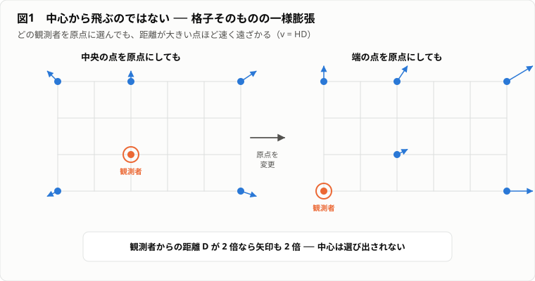
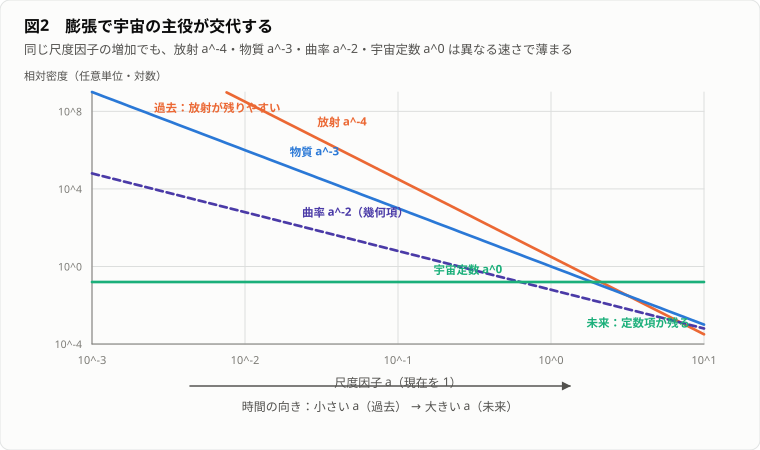
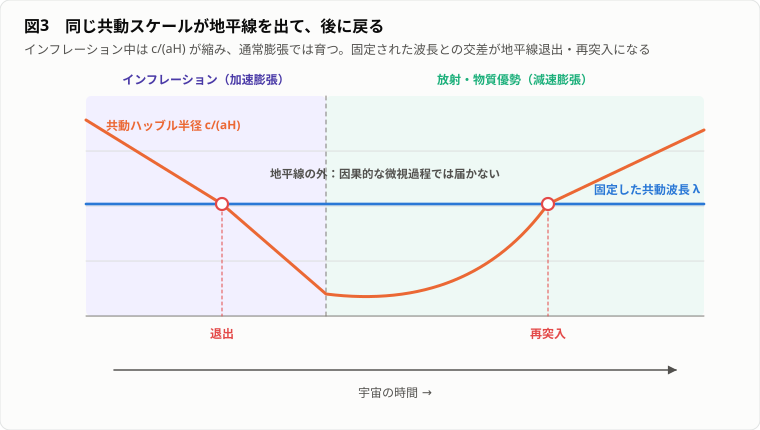

# やる夫で学ぶ現代宇宙論 ── 宇宙の履歴を再発明する

---
## 登場人物

**やる夫**：一般相対論を学び終えた学生。式の意味を直観で掴むことはあるが、すぐに最短ルートを発見したと思い込む。

**やらない夫**：物理学の教師。

**できる子**：観測と数値解析に強い研究者。データの意味と限界の切り分けに厳しい。

**できる夫**：理論物理に詳しく、新模型を思いつくと異常な速度で説明を始める。自由パラメータを増やしすぎる癖がある。

---
## 序幕　旧天文台の検収室

---
### 0-1　名前のない観測データ

**やる夫**：
一般相対論まで学んだやる夫に、もう怖いものはないお。
計量 $g_{\mu\nu}$ が時空の幾何を決め、アインシュタイン方程式

$$G_{\mu\nu}+\Lambda g_{\mu\nu}=\frac{8\pi G}{c^4}T_{\mu\nu}$$

が物質と曲率を結ぶ。
星の周りならシュバルツシルト解、回転していればカー解。
つまり宇宙も、でっかい質量を1個置いて解けば終了だお。

**やらない夫**：
宇宙の外側はどこだ。

**やる夫**：
……宇宙の、さらに外だお。

**やらない夫**：
その外側の座標をどう定義する。

**やる夫**：
……宇宙外座標系だお。

**やらない夫**：
定義になっていないだろ。
天体の周囲の問題では、十分遠方に平坦な時空を置けることが多い。
だが宇宙論では、調べたい対象が時空全体だ。
外から形を眺めることも、境界の外に観測者を置くこともできない。

**やる夫**：
じゃあ宇宙論は、最初から観測不能な哲学なのかお。

**やらない夫**：
逆だ。
外から見られないからこそ、宇宙内部の観測だけで模型を検収する。
この部屋に残されたデータを見ろ。

**やる夫**：
古い端末が5台あるお。
1号機は銀河の距離とスペクトル線のずれ。
2号機は水素、重水素、ヘリウム、リチウムの存在量。
3号機は全天に広がるほぼ一様なマイクロ波と、100000分の1程度の細かな模様。
4号機は銀河の3次元分布と、背景銀河の形のわずかな歪み。
5号機は遠方の超新星の明るさ……。
でもデータ名も理論名も消えてるお。

**やらない夫**：
旧天文台の宇宙論検収室だ。
1つの模型で、これらを同時に説明しろ。
個別のデータに合わせて別々の宇宙を作るのは禁止だ。

**やる夫**：
楽勝だお。
観測点を全部通る巨大な多項式を1本作ればいいお。
銀河の距離も、元素比も、マイクロ波も、全部入力にして――。

**できる子**：
予測ではない。
補間。

**やる夫**：
いつの間にいたんだお。

**できる子**：
未知のデータに外挿できず、物理量の関係も説明しない。
検収不合格。

**やらない夫**：
必要なのは、少数の仮定から多種類の観測を結ぶ模型だ。
検収盤を起動する。

**やる夫**：
壁に大きな格子と7つのダイヤルが出たお。

$$a(t),\quad H(t),\quad k,\quad \Omega_r,\quad\Omega_b,\quad\Omega_c,\quad\Omega_\Lambda$$

横には光円錐の形をした巻尺と、成分別の宇宙会計簿もあるお。
ずいぶん答えを教えてくれる装置だお。

**やらない夫**：
記号だけ見ても使えなければ意味はない。
お前には1つずつ必要性を再発見してもらう。
最後に検収表の全項目が同じ模型で通れば合格だ。

**やる夫**：
落ちたらどうなるんだお。

**できる子**：
この検収表は、次期観測計画の申請書に添付する。
通らなければ申請は出せない。今期で締め切り。

**やらない夫**：
申請が出なければ来年度の人員枠は削られる。
この部屋にいる4人のうち、誰か1人はここにいられなくなる。
期限は、お前の都合ではなく審査会の都合だ。

**やる夫**：
……急に重くなったお。
じゃあ全項目に合格印を押せばいいんだお。空欄を残さなければいいんだお。

**やらない夫**：
違う。**分かっていないものを分かったと書いた検収表は、その場で失格だ。**
空欄を残して通すか、埋めて落ちるか。その判断も検収のうちだ。

**やる夫**：
宇宙の始まりから未来まで、やる夫が再設計してやるお。

**やらない夫**：
設計するな。
観測から復元しろ。

---
## 第1幕　宇宙を1つの物理系にする

---
### 1-1　全銀河を入力すればよい

**やる夫**：
宇宙全体を扱うのが難しい理由は、物体が多いからだお。
なら全銀河の位置 $\mathbf x_i$、速度 $\mathbf v_i$、質量 $m_i$ を初期条件として入力し、一般相対論的な $N$ 体計算をすればいい。
原理的には完全だお。

**やらない夫**：
何個入力する。

**やる夫**：
観測可能な銀河を全部だお。
見えない暗い銀河も推定し、恒星とガスも細分化し――。

**やらない夫**：
ブラックホール1個の内部構造まで必要か。

**やる夫**：
完全を目指すなら必要だお。

**やらない夫**：
その模型で「宇宙は全体として膨張しているか」を知るために、隣の銀河にある1個の惑星の山脈まで入力するのか。

**やる夫**：
……不要な気がするお。

**やらない夫**：
宇宙論が知りたいのは、あらゆる微視的状態ではない。
大尺度で共通する少数の自由度だ。
気体力学で全分子の位置を追わず、密度、圧力、温度を使うのと同じだろ。

**やる夫**：
銀河を粗視化して、宇宙の平均密度 $\rho(t)$ を使うのかお。
でも宇宙は一様じゃないお。
地球、太陽、銀河、銀河団、空洞がある。
平均化したら、存在する構造を全部消してしまうお。

**やらない夫**：
縮尺を変えろ。
机の表面を顕微鏡で見れば凹凸だらけだが、部屋の設計図では平面として扱える。
宇宙も銀河以下では強く不均一だが、十分大きな体積で平均すれば、場所による差が小さくなる可能性がある。

**やる夫**：
可能性だけでは理論にならないお。
「大きく見ればだいたい一様」は、人間の雑な性格を宇宙に押しつけてるだけかもしれないお。

**できる子**：
全天銀河サーベイ。
マイクロ波背景放射。
大尺度では統計的に等方。
観測者を特別な位置に置く証拠はない。

**やる夫**：
統計的に、という逃げ道がついてるお。

**やらない夫**：
逃げ道ではなく階層化だ。
背景宇宙を一様・等方な零次近似として記述し、その上に銀河や空洞を摂動として載せる。
まず背景を解き、次に不均一性の成長を解く。
1度に全部解こうとしたお前の案を、問題の階層に分けたわけだ。

**やる夫**：
つまり第1段階では、どの場所も同等で、どの方向も同等と仮定する。
これが宇宙原理かお。

**やらない夫**：
そうだ。
厳密な一様性ではない。
適切に粗視化した大尺度での一様性と等方性だ。

**やる夫**：
でも「地球から見て等方」だけなら、地球が球対称宇宙の中心でも説明できるお。

**やらない夫**：
その可能性を論理だけで完全には排除できない。
そこでコペルニクス原理を加える。
われわれの位置は特別ではない、とする。
多くの場所の観測者から等方に見えるなら、空間は一様になる。

**やる夫**：
観測事実だけでなく、「われわれは特別ではない」という模型選択の原理も使うんだお。

**やらない夫**：
宇宙論では、観測可能範囲が1つしかない。
だから仮定を隠してはいけない。
宇宙原理は証明済みの定理ではなく、広範な観測に支えられた作業仮説だ。
後で必ず検収する。

**やる夫**：
よし。
宇宙を「平均的な背景」と「その上の揺らぎ」に分ける。
全銀河入力計画より、ずっと少ない自由度で済みそうだお。

**やらない夫**：
第1の再発見だ。
宇宙論は宇宙の全情報を記録する学問ではない。
観測可能な規則性を、最小限の自由度へ圧縮する学問だ。

---
### 1-2　われわれは爆発の中心にいる

**やる夫**：
1号機の銀河データを見たお。
遠い銀河ほどスペクトル線が赤い側へずれている。
赤方偏移を後退速度だと思えば、どの方向の銀河も地球から遠ざかっているお。
結論は1つ。
地球は宇宙大爆発の中心だお。

**やらない夫**：
宇宙原理を採用した直後に地球を中心へ戻すのか。

**やる夫**：
でも観測がそう言ってるお。
やる夫の周囲から銀河が逃げているお。

**やらない夫**：
宇宙模型盤の格子点を1つ選べ。
格子間隔を時刻 $t_1$ から $t_2$ まで一様に2倍にする。
中央の点から他の点を見るとどうなる。

**やる夫**：
全部遠ざかるお。
距離が1マスだった点は1マス分、3マスだった点は3マス分だけ遠ざかる。
遠いほど速い。

**やらない夫**：
端の点を観測者に変えろ。

**やる夫**：
そこから見ても他の点が全部遠ざかるお。
しかも距離に比例して速い。
中央じゃなくても同じだお。

**やらない夫**：
位置を $\chi$、格子の倍率を $a(t)$ と書けば、2点間の物理距離は

$$D(t)=a(t)\chi$$

となる。
共動座標差 $\chi$ を固定して時間微分しろ。

**やる夫**：

$$\dot D=\dot a\chi=\frac{\dot a}{a}D$$

だから

$$v=HD,\qquad H\equiv\frac{\dot a}{a}$$

だお。
距離に比例して後退速度が大きくなるハッブル則が、格子の一様な拡大だけで出たお。

図1：観測者を中央から端へ移しても $v=HD$ は同じであり、一様膨張は特別な中心を持たない（タップ／クリックで原寸表示）。

**やらない夫**：
爆発中心から物体が飛ぶ場合、中心は1つだ。
だが一様膨張では、任意の共動観測者が自分を原点に選べる。
中心は存在しない。

**やる夫**：
ゴム風船の表面に点を描いて膨らませる説明と同じかお。
どの点から見ても他の点が遠ざかる。

**やらない夫**：
ただし風船の内部や中心を実在する宇宙空間と誤解するな。
2次元球面を3次元に埋め込む図は直観補助にすぎない。
宇宙の空間は内在的な計量だけで膨張を定義できる。
外側の次元は不要だ。

**やる夫**：
もう1つ疑問だお。
格子そのものが伸びるなら、銀河も太陽系も原子も一緒に膨張するはずだお。
やる夫の身長も毎秒増えてるのかお。

**やらない夫**：
FLRW膨張は、平均宇宙の共動流に乗る、重力的あるいは電磁気的に束縛されていない距離の振る舞いだ。
銀河内部では局所重力、原子では電磁力が支配的で、背景膨張に従う必要はない。

**やる夫**：
「空間が何でも引き伸ばす力」ではないんだお。

**やらない夫**：
そうだ。
そもそも一般相対論で「空間そのものが物質を引っ張る」という追加の力を入れる必要はない。
計量の時間発展があり、自由な物体の世界線がその幾何に従う。
束縛系は別の局所解を形成する。

**やる夫**：
じゃあ遠方銀河の後退速度 $v=HD$ が光速を超えたらどうなるお。
特殊相対論違反だお。

**やらない夫**：
特殊相対論が禁止するのは、同じ局所慣性系で物体が光を追い越すことだ。
宇宙論的後退速度は、離れた2点間の固有距離をある時刻面で微分した量で、単一の局所慣性系における速度ではない。
光速を超えても直ちに矛盾しない。

**やる夫**：
同じ「速度」という語でも、離れた場所の比較には定義が要る。
一般相対論編で、離れたベクトルを直接比較できなかったのと同じ病気だお。

**やらない夫**：
よくつながったな。
宇宙膨張とは、物体が中心から空間を突っ切る運動ではなく、共動点間の計量距離を決める尺度因子 $a(t)$ の変化だ。

---
### 1-3　対称性だけで計量を絞る

**やる夫**：
一様・等方なら、宇宙の計量は平坦なミンコフスキー時空に $a(t)$ を掛ければいいお。

$$ds^2=-c^2dt^2+a^2(t)(dx^2+dy^2+dz^2)$$

完成だお。

**やらない夫**：
空間が平坦だと、いつ観測で決まった。

**やる夫**：
一様なら平坦じゃないのかお。
球面は北極と赤道が違うお。

**やらない夫**：
座標表示と内在的性質を混同している。
球面上に北極という幾何学的に特別な点はない。
どの点も、回転させれば他の点へ移せる。
球面は一様かつ等方だ。

**やる夫**：
2次元なら、平面、球面、鞍型の面が候補だお。
3次元空間にも対応する3種類があるのかお。

**やらない夫**：
最大対称な3次元空間は、一定正曲率、ゼロ曲率、一定負曲率に分類できる。
曲率符号を $k=+1,0,-1$ で表せば、空間部分は

$$d\ell^2=a^2(t)\left[\frac{dr^2}{1-kr^2}+r^2d\Omega^2\right]$$

となる。
時間を加えれば

$$ds^2=-c^2dt^2+a^2(t)\left[\frac{dr^2}{1-kr^2}+r^2d\Omega^2\right]$$

これがFLRW計量だ。

**やる夫**：
いきなり公式が出てきたお。
$r$ の意味が普通の半径と違って見えるお。

**やらない夫**：
だから座標そのものに物理的意味を押しつけるな。
半径方向の固有距離は

$$D(t)=a(t)\int_0^r\frac{dr'}{\sqrt{1-kr'^2}}$$

で求める。
$r$ は計算に便利な座標で、$a(t)r$ が常に厳密な固有距離というわけではない。

**やる夫**：
でも $a(t)$ の絶対値はどう決めるんだお。
今日を $a=1$ にしても $a=100$ にしても、$r$ を逆に変えれば同じじゃないかお。

**やらない夫**：
その通り。
尺度因子の規格化には座標自由度がある。
通常は現在 $t_0$ で $a(t_0)=1$ と置く。
物理的なのは比

$$\frac{a(t_2)}{a(t_1)}$$

や膨張率 $H=\dot a/a$ だ。

**やる夫**：
時空計量の自由度は本来10成分あったのに、一様性と等方性を要求したら、時間関数 $a(t)$ と定数 $k$ まで減ったお。

**やらない夫**：
対称性の威力だ。
宇宙原理は単なる美学ではない。
アインシュタイン方程式という偏微分方程式の塊を、時間だけの常微分方程式へ落とす。

**やる夫**：
ただし背景宇宙だけだお。
銀河の存在は摂動として後で戻す。

**やらない夫**：
そうだ。
ここで最初の検収項目を記入しろ。

**やる夫**：
背景模型：FLRW。
未知量：尺度因子 $a(t)$。
空間曲率：$k$。
仮定：大尺度で一様・等方、観測者の位置は特別でない。
残る問いは、$a(t)$ を何が動かすかだお。

**やる夫**：
空間曲率が一定ということは、局所的な曲率半径もどこでも同じなんだお。
でも $k=+1$ なら空間は必ず有限で、$k=-1$ なら必ず無限なのかお。

**やらない夫**：
局所曲率と大域的位相を混同するな。
単連結な最大対称空間なら、正曲率は3次元球面型で有限、平坦と負曲率は無限になる。
だが平坦空間を周期境界で同一視して3次元トーラスにすれば、局所的には $k=0$ のまま有限体積にもできる。

**やる夫**：
FLRW計量の $k$ が教えるのは局所的な幾何で、宇宙全体のつながり方までは一意に決めないんだお。

**やらない夫**：
そうだ。
宇宙原理は局所的な一様・等方性を強く制限するが、大域位相には余地がある。
もし宇宙が小さな周期空間なら、同じ天体やCMB模様が別方向に重複して見える可能性がある。
観測はそのような徴候を探しているが、少なくとも観測可能領域より明らかに小さい基本領域は支持されていない。

**やる夫**：
もう1つ、FLRWの時間 $t$ は誰の時計なんだお。

**やらない夫**：
宇宙の平均物質流とともに動く共動観測者の固有時間だ。
完全流体の4元速度に直交する空間面を、同じ宇宙時刻の面として使う。
局所的な銀河の固有運動はこの共動流からのずれとして扱う。

**やる夫**：
宇宙時刻は絶対時間が復活したわけじゃない。
物質分布の対称性が、便利で物理的な時間切片を選ばせているんだお。

**やらない夫**：
その理解ならよい。
FLRWは一般相対論の座標自由度を捨てたのではなく、対称性に適合した座標を選んだものだ。

---
## 第2幕　宇宙を動かす方程式

---
### 2-1　宇宙の中身をどう平均するか

**やる夫**：
計量が決まったなら、アインシュタイン方程式へ代入すればいいお。
右辺の $T_{\mu\nu}$ には銀河を点粒子として並べる。

$$T^{\mu\nu}=\sum_i m_i u_i^\mu u_i^\nu\delta^{(3)}(\mathbf x-\mathbf x_i)$$

厳密で美しいお。

**やらない夫**：
左辺は一様なのに、右辺は銀河位置でだけ無限大になる。
等式が成り立つか。

**やる夫**：
成り立たないお。
背景計量を一様にしたなら、物質側も平均化しないといけない。
密度 $\rho(t)$ だけで十分かお。

**やらない夫**：
宇宙には放射もある。
光子は静止質量を持たないが、エネルギーと運動量を持つ。
また一般相対論では圧力も重力源だ。
一様・等方な物質を最も一般的に表すには何が要る。

**やる夫**：
流体の静止系なら、エネルギー密度と等方圧力だお。
方向ごとに圧力が違うと等方性を壊すから、空間成分は同じ $p$。
4元速度 $u^\mu$ を使えば

$$T_{\mu\nu}=\left(\rho+\frac{p}{c^2}\right)u_\mu u_\nu+pg_{\mu\nu}$$

かお。

**やらない夫**：
完全流体のエネルギー運動量テンソルだ。
ここで $\rho$ を質量密度として使う流儀とエネルギー密度として使う流儀があるが、この式では $\rho c^2$ がエネルギー密度だと思え。

**やる夫**：
銀河や暗黒物質は圧力ゼロの塵 $p\simeq0$。
光子は圧力を持つ。
真空エネルギーには負圧がある。
全部同じ器に入るお。

**やらない夫**：
圧力が重力源になることを、ニュートン直観で軽視するな。
宇宙全体では、加速度方程式に $\rho+3p/c^2$ が現れる。
3方向の圧力が1つずつ寄与するからだ。

**やる夫**：
圧力は普通、物を外へ押し広げるお。
それが重力を強めるのかお。

**やらない夫**：
局所的な圧力勾配は物質を押す。
一方、圧力そのものはエネルギー運動量として時空を曲げる。
「圧力が押す効果」と「圧力が重力源になる効果」は別だ。

**やる夫**：
一般相対論では、何か1つの言葉に1つの働きしかないと思うと事故るお。

**やらない夫**：
もう1つ事故の種がある。
平均化した $\langle T_{\mu\nu}\rangle$ を使えば、計量も単純に $\langle g_{\mu\nu}\rangle$ でよいと思うな。
アインシュタイン方程式は非線形だから、一般には

$$G_{\mu\nu}[\langle g\rangle]\neq\langle G_{\mu\nu}[g]\rangle$$

だ。

**やる夫**：
平均してから曲率を計算するのと、曲率を計算してから平均するのは一致しない。
背景と摂動の分離自体に近似が入るんだお。

**やらない夫**：
そうだ。
だが標準宇宙論では、観測される大尺度の揺らぎが小さい範囲で、この分離が非常によく働く。
限界を理解したうえで使う。

---
### 2-2　フリードマン方程式を発明する

**やる夫**：
FLRW計量と完全流体をアインシュタイン方程式に代入するお。
対称性で空間方向は全部同じだから、独立な式は少数になるはずだお。

**やらない夫**：
計算結果を写す前に、係数までお前が出せ。
一般相対論は一度置く。中学生の力学に戻る。
密度 $\rho$ で一様に詰まった空間から、共動座標で半径 $\chi$ の球を切り出せ。
その縁に質量 $m$ の銀河を1個置く。この銀河の運動を書け。

**やる夫**：
球の物理半径は $R=a(t)\chi$ だお。
球の外側の物質は……一様だから、殻の内側では引力が打ち消し合って効かないお。
効くのは球の内側の質量だけだお。

$$M=\frac{4\pi}{3}R^3\rho$$

エネルギー保存を書くお。運動エネルギーと重力ポテンシャルの和が一定だお。

$$\frac12 m\dot R^2-\frac{GMm}{R}=E$$

**やらない夫**：
$R=a\chi$ を入れて、$\chi$ は定数だから $\dot R=\dot a\chi$ だ。整理しろ。

**やる夫**：
代入するお。

$$\frac12 m\dot a^2\chi^2-\frac{G m}{a\chi}\cdot\frac{4\pi}{3}a^3\chi^3\rho=E$$

第2項は $\frac{4\pi G}{3}\rho\, m\, a^2\chi^2$ だお。
全体を $\frac12 m a^2\chi^2$ で割ると

$$\left(\frac{\dot a}{a}\right)^2-\frac{8\pi G}{3}\rho=\frac{2E}{m\chi^2}\cdot\frac{1}{a^2}$$

……**出たお**。$8\pi G/3$ が、やる夫の割り算から落ちてきたお。
右辺は $1/a^2$ に比例する定数項だから、$-kc^2/a^2$ と書けるお。

$$H^2=\frac{8\pi G}{3}\rho-\frac{kc^2}{a^2}$$

しかも $k$ の正体が分かったお。
$E<0$、つまり**束縛されて逃げ切れない**ときが $k>0$ で閉じた宇宙。
$E>0$ の**振り切って逃げる**ときが $k<0$ で開いた宇宙。
$E=0$ ちょうどが平坦だお。曲率って、宇宙の脱出速度の話だったんだお。

**やらない夫**：
ニュートン力学で係数まで正しく出る。一様等方だからだ。
ただし、この導出は本当は一般相対論の結果に支えられている。
「外側の殻が効かない」は、球対称なら外部の質量分布が内部に影響しないという定理があって初めて、無限に広い宇宙でも言える。

**やる夫**：
宇宙定数も足すお。$\Lambda c^2/3$ を右辺に加えて

$$H^2\equiv\left(\frac{\dot a}{a}\right)^2
=\frac{8\pi G}{3}\rho-\frac{kc^2}{a^2}+\frac{\Lambda c^2}{3}$$

これが第1フリードマン方程式だお。自分で建てたお。

**やらない夫**：
その導出に、**入っていないもの** が1つある。何だ。

**やる夫**：
……えっと、密度 $\rho$、曲率 $k$、宇宙定数。
……あっ。**圧力 $p$ が一度も出てこなかったお**。
ニュートンのエネルギー保存には、圧力を書く場所が無かったお。

**やらない夫**：
そこが2-1で言ったことだ。ニュートンでは圧力は重力源ではない。
だから圧力を含む式は、この導出からは絶対に出てこない。
一般相対論の空間成分を使って初めて出る。書け。

**やる夫**：

$$\frac{\ddot a}{a}
=-\frac{4\pi G}{3}\left(\rho+\frac{3p}{c^2}\right)+\frac{\Lambda c^2}{3}$$

……$\rho+3p/c^2$ だお。2-1でやらない夫が言った $\rho+3p/c^2$ が、
ここで初めて式の中に現れたお。
第1式はニュートンで届いたけど、**第2式はニュートンでは届かない場所** だお。
圧力が重力源だという主張は、この2つの式の差分そのものだったんだお。

**やらない夫**：
そうだ。第1式が届く範囲と届かない範囲を区別できたなら、2-1は無駄ではなかった。

**やらない夫**：
2つの式を読め。

**やる夫**：
第1式は、その時点の膨張率 $H$ を、密度、曲率、宇宙定数に結びつける制約。
第2式は、膨張が加速するか減速するかを決める運動方程式。
普通の物質では $\rho>0,p\ge0$ だから $\ddot a<0$、膨張は減速する。

**やらない夫**：
宇宙定数を右辺の流体として移項するとどう見える。

**やる夫**：

$$\rho_\Lambda=\frac{\Lambda c^2}{8\pi G},\qquad
p_\Lambda=-\rho_\Lambda c^2$$

と置ける。
すると

$$\rho_\Lambda+\frac{3p_\Lambda}{c^2}=-2\rho_\Lambda<0$$

だから加速膨張を起こすお。

**やらない夫**：
「負圧が宇宙を引っ張る」とだけ覚えるな。
加速条件は一般に

$$\rho+\frac{3p}{c^2}<0$$

だ。
状態方程式 $p=w\rho c^2$ なら $w<-1/3$ が必要になる。

**やる夫**：
でも負圧って、ゴムを引っ張ったときの張力みたいなものかお。
空間が真空を引き裂こうとしてるのかお。

**やらない夫**：
完全な機械的比喩は危険だ。
負圧は、共動体積を変えたときのエネルギー変化として定義できる。
宇宙定数では体積が増えてもエネルギー密度が減らず、総エネルギーが体積に比例して増える。
熱力学関係 $dE=-p\,dV$ を当てれば $p=-\rho c^2$ になる。

**やる夫**：
膨張するほど真空エネルギーの総量が増える。
エネルギー保存違反じゃないかお。

**やらない夫**：
その告発は次節で扱う。
まず、アインシュタイン方程式を宇宙原理の下で縮約すると、宇宙全体の背景力学が $a(t)$ の方程式に落ちることを確認しろ。

**やる夫**：
一般相対論の10本の非線形方程式が、宇宙ではフリードマン方程式になる。
宇宙論は新しい重力理論を作るのではなく、一般相対論に最大限の対称性を入れた特殊解なんだお。

---
### 2-3　膨張宇宙の会計簿

**やる夫**：
宇宙会計監査を始めるお。
共変保存則

$$\nabla_\mu T^{\mu\nu}=0$$

の時間成分をFLRWで計算すると

$$\dot\rho+3H\left(\rho+\frac{p}{c^2}\right)=0$$

だお。
これは普通の連続の式と何が違うんだお。

**やらない夫**：
共動体積 $V\propto a^3$ と、その中のエネルギー $E=\rho c^2V$ を使って書き換えろ。

**やる夫**：

$$d(\rho c^2a^3)=-p\,d(a^3)$$

になるお。
内部エネルギーの変化が膨張仕事に等しい。
宇宙全体を流体の熱力学として読めるお。

**やらない夫**：
状態方程式 $p=w\rho c^2$ が一定なら解け。

**やる夫**：

$$\frac{\dot\rho}{\rho}=-3(1+w)\frac{\dot a}{a}$$

だから

$$\rho\propto a^{-3(1+w)}$$

だお。
物質は $w=0$ なので $\rho_m\propto a^{-3}$。
単なる体積希釈だお。

**やらない夫**：
放射は。

**やる夫**：
等方な光子気体は $p=\rho c^2/3$、つまり $w=1/3$。

$$\rho_r\propto a^{-4}$$

3乗は体積希釈。
残り1乗は、各光子の波長が $a$ に比例して伸び、エネルギーが $E=h\nu\propto a^{-1}$ で減る分だお。

**やる夫**：
待つお。
光子が失ったエネルギーはどこへ行ったんだお。
空間が受け取ったなら、空間のエネルギーを計上するべきだお。

**やらない夫**：
一般の膨張時空では、宇宙全体に対する座標非依存な総エネルギーを定義できるとは限らない。
時間並進対称性がなければ、ノーターの意味で保存する全エネルギーもない。
局所的には $\nabla_\mu T^{\mu\nu}=0$ が成り立ち、エネルギー運動量は整合的に流れる。
だが「宇宙全体の財布に一定額が入っている」というニュートン的像は一般には使えない。

**やる夫**：
保存則が破れたのではなく、保存されるべき大域量を定義できない場合があるんだお。

**やらない夫**：
そうだ。
次に宇宙定数は $w=-1$ だから

$$\rho_\Lambda\propto a^0$$

で一定だ。
空間が膨張すると共動体積内の真空エネルギーは増えるが、これも大域的エネルギー保存を前提に矛盾と呼ぶことはできない。

**やる夫**：
曲率項は流体じゃないけど、第1フリードマン方程式では $a^{-2}$ で減る。
形式上 $w=-1/3$ の成分みたいに振る舞うお。

**やらない夫**：
ただし本物の物質成分と混同するな。
曲率は幾何側の項だ。
計算上の類似にすぎない。

**やる夫**：
宇宙会計簿に記入するお。

| 成分 | $w$ | 密度の変化 |
|---|---:|---:|
| 放射 | $1/3$ | $a^{-4}$ |
| 非相対論的物質 | $0$ | $a^{-3}$ |
| 曲率項 | 形式上 $-1/3$ | $a^{-2}$ |
| 宇宙定数 | $-1$ | 一定 |

尺度因子が小さい過去ほど、最も急速に増える放射が支配しやすい。
未来ほど宇宙定数が残る。
宇宙の支配成分は時代によって交代するんだお。

**やらない夫**：
それが熱史と構造形成を理解する背骨になる。

図2：傾きの違いにより、小さい $a$ では放射、十分大きい $a$ では宇宙定数が相対的に残る（曲率は物質成分ではなく幾何項、タップ／クリックで原寸表示）。

**やる夫**：
会計簿には温度が入っていないお。
放射密度 $\rho_r\propto T^4$ と $\rho_r\propto a^{-4}$ を合わせれば、相互作用し続ける放射は $T\propto a^{-1}$ になるお。

**やらない夫**：
粒子種が平衡から脱結合した後も、運動量は膨張で $p\propto a^{-1}$ に赤方偏移する。
ただし後から別の粒子が消滅して、結合している成分だけを加熱する場合、温度比は単純に1ではない。

**やる夫**：
電子・陽電子が対消滅すると、そのエントロピーは光子へ入り、先に脱結合したニュートリノには入りにくい。
だから光子温度とニュートリノ温度がずれるんだお。

**やらない夫**：
共動体積内のエントロピー密度 $s$ について、断熱膨張なら

$$s a^3=\text{const.}$$

だ。
相対論的自由度を $g_{*s}$ と書けば

$$g_{*s}T^3a^3=\text{const.}$$

となる。
粒子種が非相対論的になって消えるたび、残る熱浴の温度変化が修正される。

**やる夫**：
単に $T\propto a^{-1}$ を全時代へ機械的に使うと、粒子の生成消滅を見落とすお。
宇宙会計簿にはエネルギーだけでなく、エントロピーと有効自由度の欄も必要だお。

**やらない夫**：
この補正は、元素合成、ニュートリノ背景、暗黒物質の熱的残存量を計算するときに効く。
背景膨張を知るには、何が相対論的で、どの熱浴と結合しているかまで追う必要がある。

---
## 第3幕　宇宙の運命を計算する

---
### 3-1　臨界密度という分水嶺

**やる夫**：
フリードマン方程式があれば宇宙の未来を予言できるお。
まず宇宙定数を無視して

$$H^2=\frac{8\pi G}{3}\rho-\frac{kc^2}{a^2}$$

だお。
膨張率 $H$ に対して、空間が平坦になる密度を逆算すれば

$$\rho_{\rm crit}=\frac{3H^2}{8\pi G}$$

これが臨界密度だお。

**やらない夫**：
名前に惑わされず意味を言え。

**やる夫**：
その時刻の $H$ が与えられたとき、$k=0$ に対応する密度。
密度パラメータ

$$\Omega\equiv\frac{\rho}{\rho_{\rm crit}}$$

を使えば、$\Omega>1$ で正曲率、$\Omega=1$ で平坦、$\Omega<1$ で負曲率だお。

**やらない夫**：
複数成分と宇宙定数を含めて整理しろ。

**やる夫**：

$$\Omega_i=\frac{8\pi G\rho_i}{3H^2},\qquad
\Omega_\Lambda=\frac{\Lambda c^2}{3H^2},\qquad
\Omega_k=-\frac{kc^2}{a^2H^2}$$

と定義すれば

$$1=\Omega_r+\Omega_m+\Omega_\Lambda+\Omega_k$$

だお。
宇宙模型盤の各ダイヤルがこの式でつながってるお。

**やらない夫**：
では宇宙の運命を答えろ。

**やる夫**：
簡単だお。
$\Omega_m>1$ なら重力が強いから膨張停止後に収縮。
$\Omega_m\le1$ なら永遠に膨張。
教科書で見たことがあるお。

**やらない夫**：
宇宙定数ダイヤルを正に回す。
正曲率で物質密度が大きくても、十分大きな正の $\Lambda$ があればどうなる。

**やる夫**：
$\Lambda$ 項は減らず、物質項は $a^{-3}$ で薄まる。
最後は宇宙定数が勝って加速膨張するお。
正曲率でも再収縮しない場合がある。

**やらない夫**：
逆に負の宇宙定数なら。

**やる夫**：
負の定数項があるから、平坦や負曲率でも $H^2$ がゼロに達して再収縮しうるお。

**やらない夫**：
したがって「曲率が宇宙の運命を決める」は、宇宙定数をゼロとした限定的な結論だ。
幾何と未来の運命は別の問いになる。

**やる夫**：
昔の単純な分類を一般法則だと思ってはいけないんだお。
現在の密度成分と状態方程式を全部入れ、$H(a)$ を積分しないと未来は分からない。

**やらない夫**：
さらに、$\Omega=1$ は1度だけ合えば保たれると思うか。

**やる夫**：
曲率密度は

$$\Omega_k=-\frac{kc^2}{a^2H^2}$$

だから、放射期では $H^2\propto a^{-4}$ で $|\Omega_k|\propto a^2$、物質期では $|\Omega_k|\propto a$。
膨張するほど平坦からのずれが成長するお。

**やらない夫**：
現在ほぼ平坦なら、初期宇宙では $\Omega$ が1に極端に近くなければならない。
これが後で平坦性問題として戻ってくる。

**やる夫**：
宇宙模型盤の $k$ ダイヤルをほんの少し動かしただけで、初期時刻まで巻き戻すと差が見えなくなったお。
逆に、初期値のごく小さなずれが現在には大きく育つ。
平坦な現在は安定な結果じゃなく、特殊な初期条件に見えるお。

---
### 3-2　3つの単純宇宙

**やる夫**：
複数成分を1度に解く前に、1成分だけの宇宙を作るお。
平坦で宇宙定数なし、状態方程式 $p=w\rho c^2$ が一定なら

$$\rho\propto a^{-3(1+w)}$$

と

$$H^2\propto\rho$$

を合わせれば解けるお。

**やらない夫**：
放射だけなら。

**やる夫**：
$w=1/3$ だから $\rho_r\propto a^{-4}$。

$$\left(\frac{\dot a}{a}\right)^2\propto a^{-4}$$

より $\dot a\propto a^{-1}$、したがって

$$a(t)\propto t^{1/2}$$

だお。

**やらない夫**：
物質だけなら。

**やる夫**：
$\rho_m\propto a^{-3}$ なので

$$a(t)\propto t^{2/3}$$

だお。
どちらも $\ddot a<0$ で減速膨張だけど、放射期の方が圧力の重力寄与もあり、時間に対する増え方が遅いお。

**やらない夫**：
宇宙定数だけなら。

**やる夫**：
$H^2=\Lambda c^2/3$ が一定だから

$$a(t)\propto e^{Ht}$$

指数関数的な加速膨張だお。

**やらない夫**：
この3つを宇宙模型盤でつなげろ。

**やる夫**：
初期は $a$ が小さいから $a^{-4}$ の放射が最大。
膨張すると放射は物質より速く減り、物質優勢へ交代。
さらに物質も薄まり、一定の宇宙定数が最後に勝つ。

**やらない夫**：
等量になる尺度因子はどう決まる。

**やる夫**：
現在を $a_0=1$ とすれば

$$\rho_r(a)=\rho_{r0}a^{-4},\qquad
\rho_m(a)=\rho_{m0}a^{-3}$$

だから放射・物質等価は

$$a_{\rm eq}=\frac{\rho_{r0}}{\rho_{m0}}=\frac{\Omega_{r0}}{\Omega_{m0}}$$

だお。
物質と宇宙定数なら

$$a_{m\Lambda}=\left(\frac{\Omega_{m0}}{\Omega_{\Lambda0}}\right)^{1/3}$$

だお。

**やらない夫**：
この交代が何を意味する。

**やる夫**：
同じ物理法則でも、支配成分が違えば膨張率 $H(t)$ が違う。
反応が平衡を保てるか、光がどこまで進めるか、密度揺らぎが成長できるかも全部変わる。
宇宙の歴史は、成分の会計比率が交代する歴史なんだお。

**やらない夫**：
その通り。
「宇宙は膨張している」という1文だけでは足りない。
いつ、何が支配し、どの法則で $a(t)$ が変わったかが宇宙史だ。

---
### 3-3　ビッグバンはどこで起きたか

**やる夫**：
放射宇宙も物質宇宙も、時間を逆にたどると有限時間で $a(t)\to0$ になるお。
全銀河間距離がゼロになる。
つまりビッグバンは宇宙空間の1点で起きた巨大爆発だお。
今度こそ中心があるお。

**やらない夫**：
$a(t)$ がゼロになるとき、どの共動点だけが特別だ。

**やる夫**：
全部の点間距離が同時にゼロへ行くから、特定の点じゃないお。
空間の中の場所ではなく、FLRW時間の過去端だお。

**やらない夫**：
だから「どこで起きたか」への答えは、「観測可能な宇宙のどの場所でも、その場所の過去として」だ。
爆薬が既存空間へ物質を飛ばしたのではない。

**やる夫**：
じゃあ $a=0$ 以前には何があるんだお。
$t<0$ へ式を延長すればいいお。

**やらない夫**：
古典解を形式的に延長できることと、物理的に意味があることは別だ。
$a\to0$ では密度、温度、曲率不変量が発散し、古典的一般相対論の適用が疑わしくなる。
特異点は「無限密度の物体が実在した」という完成した描写ではない。
理論がそこで予測能力を失う印でもある。

**やる夫**：
ビッグバン理論は宇宙の創造瞬間を説明する理論じゃないのかお。

**やらない夫**：
標準的な熱的ビッグバン模型が確実に扱うのは、非常に高温高密度だった初期状態から宇宙が膨張・冷却してきた履歴だ。
「絶対的な始まり」や「無からの創造」まで含むとは限らない。

**やる夫**：
名称が強すぎるお。
ビッグバンと聞くと、ゼロ時刻の爆発を全部説明した気になるお。

**やらない夫**：
名称ではなく予言を見ろ。
過去が高温だったなら、元素合成や熱放射の痕跡が残るはずだ。
それを後で検収する。

**やる夫**：
現時点の結論は、FLRWと普通の物質・放射を過去へ外挿すると、有限の固有時間で古典的特異点へ近づく。
でも特異点そのものの物理には量子重力が必要かもしれない。

**やらない夫**：
適切だ。
宇宙論では、式をどこまで信じているかを常に明示しろ。

**やる夫**：
$a\to0$ で密度が発散するなら、ビッグバン特異点は座標の取り方が悪いだけかもしれないお。
シュバルツシルト半径も座標特異点だったお。

**やらない夫**：
よい疑いだ。
座標成分ではなく曲率不変量や測地線完全性を調べる。
標準的な放射・物質FLRWでは、リッチスカラーなどが発散し、過去向きの時間的測地線を有限固有時間より先へ延長できない。
単なる座標の穴ではない。

**やる夫**：
でも一般相対論が正しい限り、本当に始まりが必要なのかお。

**やらない夫**：
特異点定理は、適切なエネルギー条件、因果条件、十分な収束などから測地線不完全性を導く。
だが何が不完全端を置き換えるかは教えない。
量子効果がエネルギー条件を破るかもしれず、時空概念そのものが変わるかもしれない。

**やる夫**：
「特異点がある」という予言は、無限密度点の詳細な物理像じゃなく、古典時空の記述がそこで終わるという定理的な警告なんだお。

**やらない夫**：
そうだ。
さらに観測可能な宇宙と宇宙全体も区別しろ。
われわれが見られる範囲は粒子地平線で限られるが、その外にも同じFLRW空間が続く可能性がある。
ビッグバンが「観測可能領域だけの始まり」なのか、「より大きな全体の過去端」なのかも、観測だけで即断できない。

**やる夫**：
宇宙論で断言できるのは、現在見える領域の物質が過去に高温高密度だったこと。
空間全体の大きさや絶対的始まりは、追加仮定を含むんだお。

**やらない夫**：
検収表に、観測事実、模型内の推論、理論の外挿を別欄で書け。
それを混ぜないことが、宇宙論の誇張を防ぐ。

---
## 第4幕　光で膨張宇宙を測る

---
### 4-1　赤方偏移は速度計か

**やる夫**：
1号機のスペクトル線が赤い理由はドップラー効果だお。
銀河が速度 $v$ で逃げれば、特殊相対論の式

$$1+z=\sqrt{\frac{1+v/c}{1-v/c}}$$

で速度が出る。
宇宙論的赤方偏移も全部これでいいお。

**やらない夫**：
近距離で $z\ll1$ なら、その解釈は近似的に使える。
だが膨張宇宙で光の波長がどう変わるか、FLRW計量から考えろ。

**やる夫**：
光は $ds^2=0$ を進む。
隣り合う波の山が放射された時刻差を $\delta t_{\rm em}$、受信時刻差を $\delta t_0$ とする。
同じ共動距離を通るから

$$\int_{t_{\rm em}}^{t_0}\frac{c\,dt}{a(t)}
=\int_{t_{\rm em}+\delta t_{\rm em}}^{t_0+\delta t_0}\frac{c\,dt}{a(t)}$$

1階まで展開すると

$$\frac{\delta t_0}{a(t_0)}=\frac{\delta t_{\rm em}}{a(t_{\rm em})}$$

だから周期比、波長比は

$$1+z\equiv\frac{\lambda_0}{\lambda_{\rm em}}
=\frac{a(t_0)}{a(t_{\rm em})}$$

だお。

**やらない夫**：
これが宇宙論的赤方偏移だ。
光が飛んでいる間に尺度因子が増えた分だけ波長が伸びる。

**やる夫**：
でも「空間が光を引き伸ばす」という説明でいいのかお。

**やらない夫**：
直観としては使えるが、物理的本体は異なる時点の共動観測者が測る光周波数の比だ。
短い区間ごとに近隣の共動観測者間の微小ドップラー効果を積み重ねたものとも解釈できる。
一般相対論では表現が1つとは限らない。

**やる夫**：
じゃあ赤方偏移から銀河の一意な速度は出ないのかお。

**やらない夫**：
遠方では、速度の定義に平行移動の規則が必要だ。
赤方偏移 $z$ は直接観測量だが、それをどの「速度」へ写すかは定義依存になる。
宇宙論では通常、$z$ を尺度因子と結びつけ、距離は宇宙模型を用いて求める。

**やる夫**：
つまり観測装置が直接出すのは赤方偏移。
「秒速何キロで逃げている」は模型を通した解釈なんだお。

**やらない夫**：
そうだ。
観測量と模型依存量を区別する癖をつけろ。

---
### 4-2　宇宙に距離が5種類ある

**やる夫**：
赤方偏移が分かったら距離を測るお。
光が10000000000年飛んできたなら距離は10000000000光年。
これ以外の距離を発明する必要はないお。

**やらない夫**：
宇宙は飛行中にも膨張する。
「今の距離」「光を出した時の距離」「光が飛んだ時間に $c$ を掛けた値」は一致しない。
まず共動距離を定義しろ。

**やる夫**：
半径方向の光について

$$d\chi=\frac{c\,dt}{a(t)}$$

だから、平坦宇宙なら

$$\chi(z)=c\int_0^z\frac{dz'}{H(z')}$$

だお。
現在の固有距離は $D_0=a_0\chi$、通常 $a_0=1$ なら $\chi$ と同じ数値だお。

**やらない夫**：
では標準光源を使う。
真の光度 $L$ が分かる天体の観測流束を $F$ として

$$F=\frac{L}{4\pi D_L^2}$$

を満たす $D_L$ を光度距離と呼ぶ。
膨張宇宙で共動距離との関係は。

**やる夫**：
光子1個のエネルギーが赤方偏移で $(1+z)^{-1}$、到着率も時間伸長で $(1+z)^{-1}$。
球面積の広がりも入れて、平坦なら

$$D_L=(1+z)\chi$$

だお。

**やらない夫**：
次に、物理サイズ $\ell$ が既知の標準物差しが角度 $\theta$ に見えたとき

$$\theta=\frac{\ell}{D_A}$$

を満たす角径距離 $D_A$ は。

**やる夫**：
放射時の尺度因子を使うから

$$D_A=\frac{\chi}{1+z}$$

したがって

$$D_L=(1+z)^2D_A$$

だお。

**やる夫**：
同じ天体なのに $D_L$ と $D_A$ が違う。
宇宙論は距離を水増しして論文数を増やしてるお。

**できる子**：
測定操作が違う。
同じである必要がない。

**やらない夫**：
この関係は距離双対性と呼ばれ、光子数保存や光がヌル測地線を進むことに依存する。
破れが見つかれば、新物理や系統誤差の手掛かりになる。

**やる夫**：
距離が複数あること自体が不便なんじゃなく、異なる観測を照合する検査装置になるんだお。

**やらない夫**：
さらに角径距離は赤方偏移とともに単調増加しない。
ある距離を越えると、より遠い天体の方が見かけの角サイズが大きくなる場合がある。

**やる夫**：
遠いほど小さく見える常識が壊れるのかお。

**やらない夫**：
非常に遠い天体を見ているとき、光を出した時代の宇宙は今より小さい。
一定の物理サイズが張る角度は、膨張史を反映する。
直観を守るのではなく、計量で距離を定義しろ。

---
### 4-3　3つの地平線

**やる夫**：
宇宙の見える端はハッブル半径

$$R_H=\frac{c}{H}$$

だお。
そこでは後退速度 $HD$ が光速になる。
その外から光は来られない。

**やらない夫**：
本当にそうか。
光がこちらへ向かうとき、固有距離 $D=a\chi$ の変化は

$$\dot D=HD-c$$

だ。
$D>c/H$ では一時的に距離が増えるが、$H$ が時間とともに減れば、後にハッブル半径内へ入り、こちらへ近づき始めることがある。

**やる夫**：
最初は遠ざかっていた光が、途中から戻ってくるお。
ならハッブル半径は因果的な壁じゃない。

**やらない夫**：
そうだ。
過去から現在までに光が進めた最大共動距離は粒子地平線

$$\chi_{\rm p}(t)=\int_{t_{\rm i}}^t\frac{c\,dt'}{a(t')}$$

で決まる。
これは「これまで影響を受けられた範囲」だ。

**やる夫**：
未来へ信号を送れる最大範囲は別かお。

**やらない夫**：
事象地平線

$$\chi_{\rm e}(t)=\int_t^{t_{\rm max}}\frac{c\,dt'}{a(t')}$$

だ。
積分が有限なら、今送った信号が永遠に届かない領域が存在する。

**やる夫**：
物質優勢宇宙では $a\propto t^{2/3}$ だから未来積分は発散し、事象地平線はない。
宇宙定数優勢で $a\propto e^{Ht}$ なら積分は有限だから事象地平線があるお。

**やらない夫**：
つまり地平線は物体が置かれた固定壁ではなく、膨張史全体から決まる因果構造だ。

**やる夫**：
光円錐巻尺に3つの目盛りが出たお。
ハッブル半径、粒子地平線、事象地平線。
似た言葉を1つにまとめると事故るお。

**やらない夫**：
後で音響地平線も加わる。
宇宙論の標準物差しになる。

**やる夫**：
粒子地平線の大きさは、初期時刻 $t_{\rm i}$ をどこに置くかでも変わるお。
ビッグバン特異点を下限にすれば有限でも、前史があれば広がるかもしれない。

**やらない夫**：
その通り。
地平線は計量の全履歴に依存する。
インフレーションは、熱いビッグバン以前に共形時間を追加し、現在離れた領域を過去に因果接触させる機構として働く。

**やる夫**：
共形図を描くと、光は常に45度を進み、膨張の効果が時空境界の形へ押し込まれるお。
地平線の比較が直観的になる。

**やらない夫**：
ただし共形変換は角度と因果関係を保つが、固有距離や固有時間は保たない。
図上で短く見えるから実際の時間も短い、とは限らない。

**やる夫**：
現在観測できる最遠方は粒子地平線なのに、電磁波で直接見える最古は最後の散乱面だお。
それ以前は不透明だから、光子では見通せない。

**やらない夫**：
だが別の伝令なら可能性がある。
ニュートリノは光子より早く脱結合し、重力波はさらに早い時代を伝えうる。
直接検出は難しいが、CMBや構造への間接効果も含めて初期宇宙を探れる。

**やる夫**：
「見える宇宙の端」も1種類じゃないお。
因果的な端、電磁的に透明な端、特定の観測手段が届く端を分ける必要がある。

**やらない夫**：
さらに、現在見えている銀河の一部は、今この瞬間に送った信号が将来届かない領域へすでに移っている可能性がある。
過去の光を受け取れることと、現在通信可能であることは同じではない。

**やる夫**：
宇宙を見ることは、現在の遠方を眺めることじゃなく、異なる過去時刻を同時に並べることなんだお。
空間地図と時間史が1枚の光円錐上で混ざっているお。

---
## 第5幕　宇宙が熱かった証拠

---
### 5-1　膨張を逆再生する

**やる夫**：
過去へ行くほど $a$ が小さく、放射の波長は短い。
黒体放射なら温度は

$$T\propto a^{-1}$$

だから、初期宇宙は高温だったお。
なら過去の状態は、現在の宇宙を逆再生すれば全部分かるお。

**やらない夫**：
相互作用が常に平衡を保つならな。
反応速度を考えろ。

**やる夫**：
粒子反応率は概ね

$$\Gamma\sim n\langle\sigma v\rangle$$

だお。
宇宙膨張率は $H$。
反応時間 $\Gamma^{-1}$ が膨張時間 $H^{-1}$ より短ければ、粒子は何度も反応して熱平衡を保つ。

$$\Gamma\gg H\quad\Rightarrow\quad\text{平衡}$$

逆に

$$\Gamma\ll H\quad\Rightarrow\quad\text{脱結合・凍結}$$

だお。

**やらない夫**：
宇宙史の多くはこの競争で決まる。
膨張は単なる背景ではなく、反応に締切を設ける時計だ。

**やる夫**：
温度が下がると反応が遅くなり、ある瞬間に宇宙の膨張へ追いつけなくなる。
その時点の存在量が凍結して後世へ残る。
化石みたいだお。

**やらない夫**：
ただし「凍結」は完全停止とは限らない。
平衡値を追従できなくなるという意味だ。
残存反応や崩壊が続く場合もある。

**やる夫**：
初期宇宙を調べるには、現在残る化石量を測り、どの温度で $\Gamma\sim H$ だったか逆算する。
粒子物理と宇宙膨張が同じ式に入るお。

**やらない夫**：
そうだ。
膨張率 $H$ は総エネルギー密度で決まり、反応率 $\Gamma$ は相互作用で決まる。
したがって残存量は、未知粒子や重力法則にも敏感だ。

**やる夫**：
2号機の軽元素比が、初期宇宙の時計になる理由が見えてきたお。

---
### 5-2　宇宙最初の核反応炉

**やる夫**：
高温の初期宇宙なら、陽子と中性子がどんどん融合し、鉄まで一気に作れるお。
宇宙全体が巨大な恒星核だお。

**やらない夫**：
恒星が鉄まで作るのに何年かかる。
初期宇宙の元素合成に許された時間は。

**やる夫**：
膨張で急速に冷えるから、数分程度だお。
密度も下がる。
鉄まで反応鎖を進める時間がないお。

**やらない夫**：
まず中性子と陽子の比を決めろ。
高温では弱反応

$$n+\nu_e\leftrightarrow p+e^-$$

$$n+e^+\leftrightarrow p+\bar\nu_e$$

$$n\leftrightarrow p+e^-+\bar\nu_e$$

が平衡を保つ。
中性子の方が質量が大きいから、平衡比は概ね

$$\frac{n}{p}\simeq e^{-\Delta m c^2/k_BT}$$

となる。

**やる夫**：
温度が下がるほど中性子が不利になる。
でも弱反応率が $H$ を下回ると比が凍結し、その後は自由中性子崩壊でさらに減るお。

**やらない夫**：
ではすぐ重水素を作ればよいか。

**やる夫**：
$p+n\to D+\gamma$ だお。
重水素の結合エネルギーは数MeVだから、温度がそれ以下なら安定するはずだお。

**やらない夫**：
光子数はバリオン数より桁違いに多い。
黒体分布の高エネルギー尾に、重水素を壊せる光子が十分残る。
平均温度が結合エネルギーを下回っただけでは合成は進まない。

**やる夫**：
これが重水素ボトルネックかお。
さらに冷えて破壊光子が減るまで、陽子と中性子は待たされる。
ボトルネックが開いたら、重水素からヘリウム4へ急速に進むお。

**やらない夫**：
残っている中性子の大部分がヘリウム4に入る。
中性子対陽子比をおよそ $1:7$ とすれば、ヘリウム質量分率は概算で

$$Y_p\simeq\frac{2(n/p)}{1+n/p}\simeq\frac14$$

となる。

**やる夫**：
ヘリウム原子核1個に中性子2個を使うからだお。
細かい核反応網を解かなくても、約4分の1という大きな値が出る。

**やらない夫**：
重水素はバリオン密度に非常に敏感だ。
密度が高いほど反応が進み、重水素はより多く燃えてヘリウムへ移る。
したがって原始重水素量からバリオン密度を推定できる。

**やる夫**：
そして後でCMBから独立に求めるバリオン密度と一致するか検収できる。
違う時代、違う物理過程が同じ $\Omega_b$ を指すなら強い証拠だお。

**やらない夫**：
ただしリチウム7は標準計算と観測の間に問題が残る。
恒星表面での減少、核反応率、新物理などが議論されている。
成功だけでなく不一致も記録しろ。

**やる夫**：
検収表に「軽元素：ヘリウム・重水素は概ね合格、リチウム問題あり」と書くお。
宇宙論は満点答案じゃないんだお。

---
### 5-3　宇宙が透明になった日

**やる夫**：
3号機のマイクロ波は、ビッグバン直後に放たれた光がそのまま届いたものだお。
宇宙誕生の瞬間を直接撮影してるお。

**やらない夫**：
高温の初期宇宙には自由電子が多い。
光子はどうなる。

**やる夫**：
トムソン散乱を繰り返して直進できない。
平均自由行程が短く、宇宙は不透明だお。
ビッグバン直後の光はそのまま来られない。

**やらない夫**：
膨張・冷却すると陽子と電子が結合して中性水素になる。
これを再結合と呼ぶ。
ただし「温度が13.6eVを下回れば即座に結合」と考えるな。

**やる夫**：
元素合成と同じで、光子が多いから高エネルギー尾が水素を電離し続けるお。
Saha方程式で平衡電離度を計算し、後半は反応が平衡を追えなくなるから非平衡方程式が必要だお。

**やらない夫**：
自由電子密度が下がると、光子の散乱率

$$\Gamma_\gamma=n_e\sigma_Tc$$

が膨張率より小さくなり、光子は脱結合する。
観測者まで散乱されずに届く確率を光学的深さ $\tau$ で表せば、最後の散乱時刻は1点ではなく幅を持つ。

**やる夫**：
可視度関数 $g(\eta)=\dot\tau e^{-\tau}$ が最大になる付近が最後の散乱面だお。
面と呼んでも時間幅がある。

**やらない夫**：
その時の温度数1000Kの黒体放射が、宇宙膨張で波長を約1000倍伸ばされ、現在は数Kのマイクロ波として観測される。

**やる夫**：
だからCMBは「再結合時に新しく作られた光」というより、以前から熱平衡にあった光子が自由飛行を始めた姿なんだお。

**やらない夫**：
さらに、ほぼ完全な黒体スペクトルであること自体が、過去に物質と放射が高精度で熱平衡にあった証拠だ。
単に全天から電波が来るだけではない。

**やる夫**：
温度の平均だけなら一様宇宙で説明できる。
でも100000分の1の模様は、背景に重なる摂動だお。
これを読めば、再結合時の密度揺らぎが分かる。

**やらない夫**：
次の検収は、その模様がなぜランダムな染みではなく、規則的な角度構造を持つかだ。

**やる夫**：
検収表の用語欄を埋めるお。
再結合と光子脱結合は同じ瞬間だから、**片方の言葉に統一していい**お。
どうせ電子が原子に捕まった瞬間に光子は自由になるんだお。同じことを2回書く必要はないお。

**やらない夫**：
その2つを1語にまとめた瞬間、お前は $\tau$ を測る動機を失う。
まず定義を分けろ。再結合は何が下がる過程だ。

**やる夫**：
……自由電子の数だお。電離度が下がる過程だお。

**やらない夫**：
脱結合は。

**やる夫**：
光子が散乱されなくなる過程だから……散乱率 $\Gamma$ が $H$ を下回る過程だお。
$\Gamma\propto n_e\sigma_T c$ だから、電離度が下がれば $\Gamma$ も下がる。
……確かに連動はしてるお。

**やらない夫**：
連動と同一は違う。電離度が1%残っていたら、光子は散乱されるか。

**やる夫**：
$\Gamma$ が $H$ より小さければ、電離度が残ってても光子は自由飛行するお。
……あっ。**電離度がゼロでなくても脱結合は起こる**お。
逆に言えば、脱結合した後の宇宙にも自由電子は少し残ってるお。
2つは別の量で、別のタイミングで決まるお。

**やらない夫**：
そして時間はもう一度動く。最初の星や銀河が紫外線を出したら、中性水素はどうなる。

**やる夫**：
また電離されるお。**再電離** だお。
……ってことは、脱結合した後の宇宙に、**自由電子がもう一度増える** お。
そのCMB光子は、もう散乱されないんじゃないのかお。

**やらない夫**：
一部は散乱される。その確率を光学的深さ $\tau$ が表す。
小スケール温度異方性を $e^{-2\tau}$ 程度抑え、大角度偏光を作る。

**やる夫**：
$e^{-2\tau}$ で抑えられる……。
ってことは、CMBから原始揺らぎの振幅 $A_s$ を読もうとすると、
測れるのは $A_s$ そのものじゃなくて **$A_se^{-2\tau}$ という積** だお。
$\tau$ を独立に決めないと、$A_s$ が決まらないお。**縮退** だお。

**やらない夫**：
$\tau$ はどこで測る。

**やる夫**：
再電離が作るのは大角度の偏光だから……**低 $\ell$ の偏光** だお。
……げっ。低 $\ell$ は、さっきできる子に「標本が5個しかない」と言われた場所だお。
宇宙分散が一番きつい場所で $\tau$ を測って、その $\tau$ で $A_s$ を割るんだお。
誤差がそのまま現在の構造成長振幅まで運ばれるお。
……もし用語を1語にまとめてたら、この $\tau$ が存在することにすら気づかなかったお。

**やらない夫**：
よく見た。用語を分けることは、測るべき量を1つ増やすことだ。
1つの後期天体物理過程が、初期揺らぎの推定へ戻って効く。

**やる夫**：
CMBの平均温度は極めて黒体に近いけど、完全に何の情報もないわけじゃないお。
エネルギー注入や散乱があれば、$\mu$ 型や $y$ 型のスペクトル歪みが残る可能性がある。

**やらない夫**：
そうだ。
異方性が空間的揺らぎを測るのに対し、スペクトル歪みは熱化が不完全だった時代のエネルギー履歴を測る。
将来の高感度観測では、減衰した小スケール揺らぎや未知粒子崩壊を検査できる。

**やる夫**：
最後の散乱面は宇宙の壁じゃない。
光子で見通せる時代の境界で、その向こうの物理は元素、ニュートリノ、重力波、スペクトル歪みに別の痕跡を残すんだお。

---
## 第6幕　宇宙最古の音を読む

---
### 6-1　温度むらを角度ごとに分解する

**やる夫**：
CMB地図には温度の高い点と低い点があるお。
高温部分は密度が高く、低温部分は密度が低い。
色を見れば物質分布がそのまま分かるお。

**やらない夫**：
温度異方性には複数の寄与がある。
光子密度そのもの、重力ポテンシャル、速度によるドップラー効果、光が通過した後のポテンシャル変化。
1枚の地図を単純な密度地図だと思うな。

**やる夫**：
じゃあ何から読むんだお。

**やらない夫**：
全天の温度場を球面調和関数で展開する。

$$\frac{\Delta T}{T}(\hat n)=\sum_{\ell m}a_{\ell m}Y_{\ell m}(\hat n)$$

統計的等方性があれば

$$\langle a_{\ell m}a^*_{\ell' m'}\rangle=C_\ell\delta_{\ell\ell'}\delta_{mm'}$$

となる。
$C_\ell$ が角度スケールごとの揺らぎの強さだ。

**やる夫**：
$\ell$ が小さいほど全天規模の大きな模様、$\ell$ が大きいほど小さな角度の模様だお。
2次元地図を1次元のパワースペクトルへ圧縮するんだお。

**やる夫**：
なら低 $\ell$ から潰していくお。
一番大きな模様が一番情報が濃いに決まってるお。
望遠鏡の感度を上げて、観測時間を10年に延ばせば、$C_2$ も $C_3$ も精密に測れるお。

**できる子**：
測れない。

**やる夫**：
なんでだお。感度は上げられるお。

**できる子**：
$C_\ell$ は $2\ell+1$ 個の $a_{\ell m}$ の分散。
$\ell=2$ なら標本は5個。$\ell=3$ なら7個。
標本5個から母分散を推定する誤差は

$$\frac{\Delta C_\ell}{C_\ell}=\sqrt{\frac{2}{2\ell+1}}$$

$\ell=2$ で **63%** 。$\ell=10$ で31%。$\ell=1000$ で4.5%。

**やる夫**：
$\ell=2$ で63%!? 6割も分からないのかお。
……でも観測時間を増やせば標本も増えるお。

**できる子**：
増えない。**空は1枚。**
何年見ても $a_{2m}$ は同じ5個のまま。
別の標本を取るには、別の宇宙が要る。

**やる夫**：
……別の宇宙。
装置の話じゃなかったお。**やる夫がこの宇宙の中にいるから**、
標本が5個しか無いんだお。
金をいくら積んでも、待ってもダメなやつだお。

**やらない夫**：
それが宇宙分散だ。観測可能な空が1枚しかないことによる標本誤差で、
測定ノイズをゼロにしても残る。
検収表で「低 $\ell$ の一致」を根拠に何かを主張しそうになったら、いまの63%を思い出せ。

**やる夫**：
検収の限界が、装置の性能じゃなくて **宇宙の側の在庫** で決まってるお。
これは検収表に書いておくべき数字だお。

**やる夫**：
パワースペクトルを見ると、滑らかな曲線じゃなくてピークが何本もあるお。
ランダムな初期揺らぎなのに、どうして特定の角度だけ強くなるんだお。

**やらない夫**：
最後の散乱前の光子とバリオンは、電子散乱で強く結合した流体だった。
過密度があると重力で縮もうとするが、光子圧が押し返す。
その競争が音波になる。

**やる夫**：
各フーリエモード $k$ が振動子として

$$\ddot\delta_\gamma+c_s^2k^2\delta_\gamma=\text{重力による駆動}$$

に従うお。
音速は光子だけなら $c/\sqrt3$、バリオンが加わると慣性が増えて少し下がる。

**やらない夫**：
再結合という同じ時刻に、圧縮の極大だったモード、希薄化の極大だったモード、途中だったモードがある。
極大にいたモードほど温度異方性が強く、パワースペクトルに音響ピークを作る。

**やる夫**：
ランダムな揺らぎでも、各波数モードの初期位相が揃っていれば、再結合時に規則的なピーク列ができるんだお。

**やらない夫**：
その位相の整合性は、初期摂動が非常に早い時代に共通の機構で作られたことを示唆する。
後でインフレーションへつながる。

---
### 6-2　ピークの形から宇宙を逆算する

**やる夫**：
第1ピークの角度が分かれば、音が再結合までに進んだ物理距離を測れるお。
音響地平線は

$$r_s(z_*)=\int_{z_*}^{\infty}\frac{c_s(z)}{H(z)}\,dz$$

だお。
それが角径距離 $D_A(z_*)$ を通じて

$$\theta_*\simeq\frac{r_s(z_*)}{D_A(z_*)}$$

に見える。
第1ピークだけで宇宙の曲率も物質量も全部決定だお。

**やらない夫**：
比しか測っていない。
$r_s$ と $D_A$ を同時に変えて同じ $\theta_*$ を作れる。
これが幾何学的縮退だ。

**やる夫**：
1つの特徴量で全パラメータを決めようとするのは無理かお。
じゃあ第2、第3ピークも使うお。

**やらない夫**：
バリオンは光子流体の慣性を増やし、重力井戸への圧縮を強める。
そのため圧縮に対応する奇数ピークと、希薄化に対応する偶数ピークの高さの比が変わる。

**やる夫**：
奇数ピークが高いほどバリオン量が多い傾向だお。
一方、冷たい暗黒物質は光子圧に巻き込まれず、重力ポテンシャルを支える。
物質・放射等価時刻やピーク全体の包絡線に効くお。

**やらない夫**：
高 $\ell$ 側でピークが減衰する理由は。

**やる夫**：
再結合前でも光子の平均自由行程はゼロじゃない。
ランダムウォークで過密領域から抜け、小スケールの揺らぎを平滑化する。
シルク減衰だお。
最後の散乱面の有限な厚みも小スケールをぼかす。

**やらない夫**：
偏光はどう生まれる。

**やる夫**：
トムソン散乱へ4重極的な入射放射が来ると直線偏光が生まれる。
スカラー密度摂動は主にEモードを作る。
テンソル摂動、つまり原始重力波はBモードを作りうるけど、後期宇宙の重力レンズもEをBへ変換するお。

**やらない夫**：
だからBモードを見つけたら即インフレーション重力波、とは言えない。[^2]
前景放射とレンズBモードを分離する必要がある。

**やる夫**：
CMB1枚の中に、バリオン密度、暗黒物質密度、初期スペクトル、再電離、曲率、膨張史が異なる形で刻まれている。
1つの観測なのに、複数の物理過程が別の特徴を残すから強いんだお。

**できる子**：
ただし模型依存。
6パラメータ $\Lambda$CDM 内で高精度。[^1]
模型を拡張すれば誤差と縮退は増える。

**やる夫**：
「CMBが宇宙定数を直接撮影した」わけではない。
初期宇宙の標準物差しと、そこから現在までの距離を模型で結んだ推定なんだお。

---
### 6-3　音の化石を銀河で測る

**やる夫**：
音響波は光子流体の現象だから、再結合後は消えて終わりだお。

**やらない夫**：
音波が進んだ領域では、バリオン物質がわずかに外側へ運ばれる。
暗黒物質は中心付近に残りやすい。
再結合後、バリオンは暗黒物質の重力井戸へ落ちるが、初期音響波の半径に弱い過密殻が残る。

**やる夫**：
銀河を1つ選んだとき、ある共動距離だけ他の銀河が存在する確率が少し高い。
2点相関関数の小さな山として見えるお。
これがバリオン音響振動、BAOかお。

**やらない夫**：
CMBから初期音響地平線を較正し、後期宇宙の銀河分布でその見かけの横幅と赤方偏移幅を測る。
横方向は角径距離、視線方向は $H(z)$ に敏感だ。

**やる夫**：
同じ物差しを異なる赤方偏移で測れば、宇宙の膨張史 $H(z)$ を地図にできる。
超新星が標準光源、BAOが標準物差しだお。

**やらない夫**：
ただし「標準」といっても完全に理論不要ではない。
音響地平線 $r_s$ の絶対長は、再結合前の膨張率、バリオン量、放射成分に依存する。
初期宇宙の物理を変えれば、同じ観測角度から推定する後期宇宙の距離も変わる。

**やる夫**：
ハッブル定数問題を解くために初期宇宙へ新成分を入れる案が出る理由だお。
$r_s$ を短くすれば、同じ角度に対して距離尺度の推定が変わる。

**やらない夫**：
だが1か所だけ直せばよいわけではない。
CMBピーク高、減衰尾、元素合成、構造成長も同時に変わる。
宇宙論検収表の全項目を通す必要がある。

**やる夫**：
検収表のBAOの行に「使用不可」と書くお。
だってこの殻は再結合のときの模様だお。
そこから130億年、銀河は重力で集まって非線形に暴れてるお。
**初期の殻はとっくに壊れて消えてる**お。物差しとして残ってるわけがないお。

**やらない夫**：
消えたなら、なぜ2点相関関数に山が見えている。

**やる夫**：
……見えてはいるお。でも壊れかけてるはずだお。

**やらない夫**：
壊し方を具体的に言え。銀河はどれくらい動いた。

**やる夫**：
重力で引かれて動いた距離は……大規模構造の変位で、
BAOの半径 $150$Mpc 級に比べたら、せいぜい **10Mpc 程度** だお。
……あれ。殻の半径より1桁小さいお。
**殻は消えないお。ぼやけるだけだお。**
山が低く広がって、ピーク位置がわずかにずれるお。
「消えるから使えない」じゃなくて「ぼけるから鋭さが落ちる」だったお。

**やらない夫**：
そこまで分かったなら、対処も言えるはずだ。
ぼけた原因は銀河が動いたことだ。動いた量が推定できたら何ができる。

**やる夫**：
……**戻せる**お。
銀河分布から大規模な変位場を推定して、各銀河を過去の位置へ押し戻すお。
そうすればぼけが取れて、山が鋭くなるお。再構成だお。
検収表は「使用不可」じゃなくて「要再構成」だお。

**やらない夫**：
それが標準的な手法だ。ただし、いま自分でやったことを疑え。

**やる夫**：
……観測データを、理論で推定した変位で動かしたお。
**観測データを勝手に理論通りへ直してる** ようにも見えるお。危ないお。

**やらない夫**：
だから模擬カタログで偏りを検証し、解析前に手順を固定し、再構成前後の結果を比較する。
宇宙論では信号処理も検収対象だ。

**やる夫**：
銀河は物質そのものを完全には追わないお。
明るい銀河ができる場所には偏りがある。

**やらない夫**：
銀河バイアスだ。
大尺度では銀河過密度を物質過密度の展開として扱えるが、小尺度では非線形・非局所・確率的な項が増える。
BAOの位置は比較的頑健でも、パワースペクトル全形状から情報を取るにはバイアス模型が重要になる。

**やる夫**：
視線方向には銀河の固有速度も赤方偏移へ混ざる。
実空間の球対称な分布が赤方偏移空間では歪むお。

**やらない夫**：
赤方偏移空間歪みは邪魔であると同時に、速度場と構造成長率を測る信号だ。
線形成長率

$$f(a)=\frac{d\ln D}{d\ln a}$$

と振幅の組合せ $f\sigma_8$ を観測し、一般相対論や修正重力を検査できる。

**やる夫**：
BAOだけを抜き出せば標準物差し。
全形状と異方性まで使えば、物質密度、ニュートリノ質量、成長率にも届く。
ただし得る情報が増えるほど、銀河形成模型と非線形計算への依存も増えるんだお。

**やらない夫**：
それが現代精密宇宙論の取引だ。
情報を多く取るほど、理論誤差を厳密に管理しなければならない。

---
## 第7幕　因果律が初期宇宙を告発する

---
### 7-1　離れた空が同じ温度である謎

**やる夫**：
CMBがほぼ一様なのは、初期宇宙が熱平衡だったからだお。
高温のプラズマが十分混ざって、同じ温度になった。

**やらない夫**：
その「十分」があったか、光円錐巻尺で測れ。
共形時間を

$$d\eta=\frac{dt}{a(t)}$$

と定義すると、半径方向の光は $d\chi=c\,d\eta$ を進む。
再結合までに信号が進めた共動距離と、現在見える最終散乱面の大きさを比較しろ。

**やる夫**：
通常の放射・物質優勢宇宙をビッグバンから積分すると、再結合時の因果地平線は最終散乱面全体よりずっと小さいお。
現在の空で大きく離れた2方向は、再結合までに光を交換できなかった。

**やらない夫**：
なのに温度は100000分の1程度まで一致している。
因果的に接触していない領域が、なぜ同じ初期条件を持つのか。
これが地平線問題だ。

**やる夫**：
「最初から同じ温度だった」でいいお。
初期条件として置けば方程式は解ける。

**やらない夫**：
数学的には可能だ。
だが、互いに情報交換できない多数の領域へ同じ値を別々に設定する必要がある。
説明を求めるなら、それらが過去には1つの因果領域だった機構が欲しい。

**やる夫**：
平坦性問題もあったお。
通常の減速膨張では $|\Omega-1|$ が成長するから、現在ほぼ1なら初期値は極端に1へ近い必要がある。

**やらない夫**：
さらに高エネルギー理論によっては、磁気単極子のような重い遺物が大量に作られる可能性がある。
普通に膨張しただけでは薄めきれない。

**やる夫**：
3つの問題を1つの機構で解けたら強いお。
因果領域を広げ、曲率を平坦化し、不要な遺物を希釈する機構だお。

---
### 7-2　宇宙を急膨張させる

**やる夫**：
初期宇宙の光速を一時的に無限大にすれば、全部混ざれるお。

**やらない夫**：
新しい定数変更を入れる前に、一般相対論の中でできることを探せ。
地平線問題で必要なのは、現在遠く離れた領域が過去に近かったことだ。
共動ハッブル半径

$$\frac{c}{aH}$$

の振る舞いを見ろ。

**やる夫**：
通常の放射・物質優勢では $aH$ が減るから、共動ハッブル半径は増える。
でも過去へ戻るほど小さくなり、現在大尺度のモードは昔から地平線外にいるお。

**やらない夫**：
ある時期に $aH$ が増え、共動ハッブル半径が減ればどうなる。

**やる夫**：
最初は小さな1つの因果領域に入っていたスケールが、急膨張で地平線外へ押し出される。
その後、通常膨張で共動ハッブル半径が増え、ずっと後に再び入ってくるお。

図3：固定した共動スケールは、減少する $c/(aH)$ を横切って地平線外へ出て、通常膨張で増加に転じた後に再突入する（タップ／クリックで原寸表示）。

**やらない夫**：
$aH$ が増える条件は $\ddot a>0$、加速膨張だ。
これがインフレーションの核心だ。

**やる夫**：
初期宇宙に宇宙定数を置けばいいお。
でも終了しないと熱いビッグバンへ移れない。

**やらない夫**：
そこで時間変化するスカラー場 $\phi$ を考える。
一様場のエネルギー密度と圧力は

$$\rho_\phi=\frac{1}{2c^2}\dot\phi^2+V(\phi)$$

$$p_\phi=\frac12\dot\phi^2-V(\phi)c^2$$

と書ける流儀がある。単位系によって $c$ の配置は変わるが、重要なのは運動エネルギーとポテンシャルの符号だ。

**やる夫**：
ポテンシャル優勢

$$\frac12\dot\phi^2\ll V(\phi)c^2$$

なら $p_\phi\simeq-\rho_\phi c^2$ で加速膨張する。
場がポテンシャルをゆっくり転がるスローロールだお。

**やらない夫**：
場の方程式は概ね

$$\ddot\phi+3H\dot\phi+V_{,\phi}=0$$

だ。
$3H\dot\phi$ は膨張による摩擦のように働き、場をゆっくり動かす。

**やる夫**：
十分な $e$ フォールド数

$$N=\ln\frac{a_{\rm end}}{a_{\rm start}}=\int Hdt$$

だけ膨張すれば、曲率項は相対的に薄まり、単極子も希釈される。

**やらない夫**：
インフレーション終了後、場のエネルギーを粒子へ移して宇宙を再加熱する必要がある。
これで熱的ビッグバンの初期条件を作る。

**やる夫**：
インフレーションはビッグバンの代わりじゃない。
熱い放射優勢期より前に置かれる動的な準備段階なんだお。

**やらない夫**：
そして具体的な場、ポテンシャル、開始条件、再加熱機構は一意に決まっていない。
インフレーションという枠組みと、特定の模型を区別しろ。

---
### 7-3　量子揺らぎを銀河の種にする

**やる夫**：
インフレーションで宇宙を滑らかにしたら、銀河の種まで消えるお。
完全に一様な宇宙から構造は生まれない。

**やらない夫**：
スカラー場は量子場だ。
真空でも揺らぎを持つ。
波長がハッブル半径より小さい間は量子的に振動し、膨張で外へ出ると振幅が古典的な確率分布として凍結される。

**やる夫**：
時空の各スケールが順番に引き伸ばされ、ほぼ同じ大きさの揺らぎを持って地平線外へ出る。
だから曲率摂動のパワースペクトルは

$$\mathcal P_{\mathcal R}(k)=A_s\left(\frac{k}{k_*}\right)^{n_s-1}$$

のような、ほぼスケール不変な形になるお。

**やらない夫**：
完全に一定なら $n_s=1$ だが、場がゆっくり変化するためわずかにずれる。
その傾きはポテンシャルの形を反映する。

**やる夫**：
密度揺らぎ $\delta\rho$ を計算すれば終わりだお。

**やらない夫**：
座標時刻を少し変えるだけで、同じ物理的時空でも背景密度と摂動の分け方が変わる。
$\delta\rho$ 単独はゲージ依存だ。

**やる夫**：
一般相対論で摂動を扱うと、座標変換と物理的揺らぎを分離しないといけない。
曲率摂動 $\mathcal R$ や一様密度面上の $\zeta$ のようなゲージ不変量を使うお。

**やらない夫**：
断熱的で地平線外なら、$\mathcal R$ や $\zeta$ は多くの場合ほぼ保存される。
インフレーションで作られた揺らぎを、再突入後のCMBや物質揺らぎへ運べる。

**やる夫**：
量子揺らぎが宇宙サイズへ引き伸ばされ、CMBの温度むらを経て銀河分布になる。
量子力学と宇宙論が観測でつながるお。

**やらない夫**：
ただし「観測された揺らぎはインフレーションだけが作れる」とまでは言えない。
競合理論は厳しい条件を満たす必要があるが、論理的排他性は別問題だ。

**できる夫**：
そこで僕の多重場・非標準初期状態・可変音速・修正重力・非局所再加熱を統合した42パラメータ模型なら――。

**やらない夫**：
予言を1つに絞ってから来い。

**やる夫**：
パラメータを増やせば何でも説明できるけど、何も予言しなくなるんだお。

**やる夫**：
ほぼガウスというのは何を意味するんだお。

**やらない夫**：
揺らぎの統計が2点相関、つまりパワースペクトルでほぼ決まり、高次相関の連結部分が小さいという意味だ。
単純な単一場スローロール模型では非ガウス性は小さい。
大きな3点相関が見つかれば、多重場、非標準運動項、特殊な初期状態などを識別する手掛かりになる。

**やる夫**：
初期揺らぎは全部同じ成分が一緒に増減する断熱摂動だと仮定したお。
暗黒物質だけ増えて放射が減るような揺らぎも作れるんじゃないかお。

**やらない夫**：
それが等曲率、あるいはアイソカーバチャー摂動だ。
全密度を変えずに成分比だけを変える。
CMBピークの位相や相関が断熱摂動と異なるため、観測で強く制限される。

**やる夫**：
テンソル揺らぎの強さは

$$r\equiv\frac{\mathcal P_T}{\mathcal P_{\mathcal R}}$$

で測るお。
$r$ が分かればインフレーションのエネルギースケールへ手掛かりが得られる。

**やらない夫**：
ただし観測上は銀河塵の偏光、シンクロトロン放射、レンズBモードを分離しなければならない。
上限が下がるほど、単純な急勾配ポテンシャルの一部は不利になる。

**やる夫**：
インフレーションは1つの予言をする万能語じゃない。
$n_s$、$r$、非ガウス性、アイソカーバチャー、再加熱史という複数の窓で具体模型を削るんだお。

**やらない夫**：
さらに、インフレーション自身の初期条件や永遠のインフレーション、確率解釈には未解決問題がある。
地平線問題を解いたから、理論の基礎問題まで消えたわけではない。

**やる夫**：
標準宇宙論での役割は明確だお。
観測可能領域を平坦かつ因果的に整え、ほぼ断熱・ガウス・スケール不変な種を用意する。
それを超える主張は、模型ごとに検収するんだお。

---
## 第8幕　小さな揺らぎから銀河を作る

---
### 8-1　重力と膨張の綱引き

**やる夫**：
過密領域は周囲より重力が強いから、すぐに潰れて銀河になるお。
初期揺らぎが $10^{-5}$ 程度でも、重力は指数関数的に増幅するはずだお。

**やらない夫**：
膨張宇宙で非相対論的物質の線形密度コントラスト

$$\delta\equiv\frac{\rho-\bar\rho}{\bar\rho}$$

を考える。
圧力を無視できる尺度では

$$\ddot\delta+2H\dot\delta-4\pi G\bar\rho_m\delta=0$$

となる。

**やる夫**：
$-4\pi G\rho_m\delta$ が重力による成長。
$2H\dot\delta$ は膨張摩擦で成長を抑える。
指数関数ではなく、物質優勢の平坦宇宙なら成長解は

$$\delta\propto a\propto t^{2/3}$$

だお。

**やらない夫**：
放射優勢期にはどうなる。

**やる夫**：
膨張率が大きく、放射が背景重力を支配する。
地平線内の暗黒物質揺らぎは成長が遅い。
物質優勢になってから本格的に成長するお。

**やらない夫**：
圧力がある流体では、音速項も加わる。
概略

$$\ddot\delta+2H\dot\delta+
\left(\frac{c_s^2k^2}{a^2}-4\pi G\rho\right)\delta=0$$

だ。

**やる夫**：
大きな尺度では重力項が勝って成長。
小さな尺度では圧力項が勝って音波になる。
境界がジーンズ尺度だお。

**やらない夫**：
暗黒エネルギーが優勢になると、$H$ は大きいまま物質密度が薄まり、構造成長が鈍る。
したがって背景膨張と構造成長を同時に測れば、一般相対論と暗黒エネルギー模型を検査できる。

**やる夫**：
同じ $H(z)$ を作る2つの模型でも、重力法則が違えば $\delta(z)$ の成長が違うかもしれない。
距離観測だけでなく、弱重力レンズや銀河クラスタリングが必要なんだお。

---
### 8-2　普通の物質だけでは間に合わない

**やる夫**：
銀河はバリオンでできてるんだから、バリオン揺らぎを大きくしておけばいいお。
再結合後に重力崩壊して現在の構造になるお。

**やらない夫**：
再結合前のバリオンは何と結合していた。

**やる夫**：
電子を介して光子と強く結合し、光子バリオン流体として音響振動していたお。
放射圧があるから、小スケールで自由に成長できない。

**やらない夫**：
再結合時のバリオン揺らぎを、現在の銀河を作れるほど大きくしてみろ。

**やる夫**：
CMB温度異方性も大きくなりすぎて、観測される $10^{-5}$ 程度と合わないお。
再結合後だけの成長では時間も足りない。

**やらない夫**：
そこで、電磁相互作用をほとんどせず、放射圧に巻き込まれない物質成分を入れる。

**やる夫**：
暗黒物質だお。
再結合前から重力井戸を作り、バリオンは光子から解放された後にそこへ落ちる。
CMBを滑らかに保ちながら、現在の構造を早く作れる。

**やらない夫**：
ニュートリノを全部の暗黒物質にすればよいか。

**やる夫**：
軽いニュートリノは初期に相対論的で、高速に自由飛行する。
小スケールの揺らぎを消してしまい、大きな構造から先にできるトップダウン型になる。
観測される銀河形成は小さい構造から階層的に育つ傾向だから、主成分には冷たい暗黒物質が必要だお。

**やらない夫**：
冷たいとは温度そのものより、構造形成時に非相対論的で自由飛行長が短いという意味だ。

**やる夫**：
暗黒物質の存在理由は銀河回転曲線だけじゃない。
CMBピーク、BAO、銀河団、重力レンズ、構造形成を1つの成分でつなぐんだお。

---
### 8-3　粒子を足すか、重力を直すか

**やる夫**：
見えない粒子を都合よく足すより、重力法則を変えた方が節約だお。
銀河の加速度が小さいところだけニュートン則を修正すれば、暗黒物質はいらないお。

**やらない夫**：
銀河回転曲線だけなら、加速度則の修正でよい適合を示す模型がある。
だが宇宙論検収表を全部通せ。

**やる夫**：
銀河団の質量、重力レンズ、衝突銀河団でのガスと重力質量の分離、CMB音響ピーク、大規模構造、BAO……。
1つの修正則で全部説明する必要があるお。

**やらない夫**：
相対論的な修正重力理論を作れば、新しい場や自由度が必要になる場合が多い。
その新しい自由度が宇宙論では実質的な暗黒成分のように振る舞うこともある。
「粒子か重力か」は単純な2択ではない。

**やる夫**：
暗黒物質仮説も未完成だお。
重力効果は多くの観測で支持されるけど、非重力的な直接検出はまだ決定的じゃない。
粒子の質量、相互作用、生成機構も不明だお。

**やらない夫**：
標準模型の冷たい暗黒物質は、微視的正体を指定せず、背景密度と「冷たく、ほぼ衝突しない」という巨視的性質を使う有効記述だ。

**やる夫**：
それでも小スケールでは、銀河中心密度、衛星銀河数、バリオンフィードバックとの分離などが難しいお。

**やらない夫**：
非線形領域では星形成、超新星、活動銀河核などのバリオン物理が強く効く。
暗黒物質模型の問題か、通常物質の数値模型の問題かを切り分ける必要がある。

**やる夫**：
宇宙論検収では、見えない成分を入れたこと自体を敗北と数えない。
異なる観測を少数の性質で同時説明できるか、代替模型より予測力が高いかで評価するんだお。

**やる夫**：
成長率の検収は簡単だお。
$\delta$ は密度の凸凹だから、**銀河を数えれば直接測れる** お。
天球を格子に切って、各マスの銀河数を数えて平均で割れば $\delta$ が出るお。
装置も要らないお。カタログを数えるだけだお。

**やらない夫**：
数えているのは何の密度だ。

**やる夫**：
銀河の……数密度だお。
……$\delta$ は物質の密度揺らぎだお。銀河の数じゃないお。

**やらない夫**：
その2つが比例する保証はあるか。8-2で何を入れた。

**やる夫**：
**暗黒物質** だお。全物質の大半が光らないお。
数えられるのは光る側だけだお。
しかも銀河は、物質が濃いところに **選択的に** できるお。
濃い場所ほど銀河が過剰にできるから、$\delta_g = b\,\delta$ の $b$ が1じゃないお。
……銀河数を数えると、$\delta$ ではなく **$b\delta$ という積** が出るお。
$\tau$ と $A_s$ のときと同じ形だお。また縮退だお。

**やらない夫**：
では $b$ を外から決める手を挙げろ。密度そのものではなく、密度が引き起こす **別の現象** を測ればいい。

**やる夫**：
……密度が濃いと、銀河はそこへ **落ちる** お。固有速度が生まれるお。
その速度は赤方偏移に混ざって、実空間で球対称な分布を赤方偏移空間で歪めるお。
歪みの強さは速度場の大きさで決まるから、**$f\sigma_8$** が測れるお。
バイアスの掛かった数密度と、バイアスの掛からない速度場、両方を測れば $b$ が割れるお。

**やらない夫**：
もう1つある。速度も数も使わない代理量だ。

**やる夫**：
**重力レンズ** だお。
光は物質が光るかどうかに関係なく曲がるお。バイアスが掛からないお。
銀河クラスタリング、赤方偏移空間歪み、弱重力レンズ、銀河団数 ──
どれも $\delta$ そのものではない代理量で、**縮退の掛かり方が違う** お。
だから組み合わせて初めて $\delta$ に届くんだお。
「数えれば直接測れる」は、宇宙論では一度も成り立たないお。

**やらない夫**：
そこまで来たなら、代理量の違いをもう一歩使える。
一般相対論では、非相対論的物質が感じるポテンシャル $\Psi$ と、光が感じる $\Phi+\Psi$ の関係が決まっている。
修正重力では両者がずれうる。

**やる夫**：
……銀河の運動は $\Psi$ を、レンズは $\Phi+\Psi$ を測るお。
同じ天域で両方測って比を取れば、**ずれているかどうかが検査できる** お。
そのずれを重力スリップと呼ぶんだお。
8-3で「粒子か重力か」を口で議論したけど、この比が、それを **測る形にした** ものだお。

**やる夫**：
暗黒物質粒子にも種類があるお。
温かい暗黒物質なら自由飛行で小スケールを抑え、自己相互作用があればハロー中心構造や衝突銀河団に影響する。
超軽量場なら波動性が銀河スケールに出るかもしれないお。

**やらない夫**：
だが小スケール制限にはバリオン物理が絡む。
ライマンアルファの森、衛星銀河、強重力レンズ、恒星流など、異なる観測を組み合わせる必要がある。

**やる夫**：
「暗黒物質があるか」から先へ進むには、密度だけでなく温度、相互作用、粒子質量、初期速度分布を測るんだお。

**やらない夫**：
そして修正重力側も、太陽系、連星パルサー、重力波速度、銀河、CMBを同時に通さなければならない。
1つの加速度領域だけを直して終わりではない。

**やる夫**：
粒子仮説と修正重力は、説明した現象の数ではなく、異なる尺度への一貫した予言で比較する。
未知成分を置くことも、方程式を変えることも、検証可能なら科学的仮説なんだお。

---
## 第9幕　標準宇宙論の最終検収

---
### 9-1　減速しているはずの宇宙

**やる夫**：
普通の物質と放射では $\rho+3p/c^2>0$ だから、膨張は必ず減速するお。
宇宙定数は数学上入れられるけど、必要がなければゼロにするのが最小模型だお。

**やらない夫**：
5号機のIa型超新星データを見ろ。

**やる夫**：
赤方偏移と見かけの明るさが並んでるお。
Ia型超新星は白色矮星の熱核爆発だから、光度曲線の形を補正すれば標準化可能な光源になる。
光度距離 $D_L(z)$ を測れるお。

**やらない夫**：
低赤方偏移だけなら $D_L\simeq cz/H_0$ で、現在のハッブル定数が分かる。
より遠方では曲線の形が過去の加速・減速を含む。

**やらない夫**：
「予想より暗い」では検収表に書けない。何等暗いのかを出せ。
$\Omega_m=1$、平坦、物質だけの宇宙で $z=0.5$ の光度距離を計算しろ。

**やる夫**：
物質優勢の平坦宇宙なら $a\propto t^{2/3}$、$E(z)=(1+z)^{3/2}$ だお。
共動距離は

$$D_C=\frac{c}{H_0}\int_0^z\frac{dz'}{(1+z')^{3/2}}
=\frac{2c}{H_0}\left(1-\frac{1}{\sqrt{1+z}}\right)$$

$z=0.5$ なら $\sqrt{1.5}=1.2247$、$1/1.2247=0.8165$。
$D_C=2\times0.1835\,c/H_0=0.367\,c/H_0$。
光度距離は $D_L=(1+z)D_C=1.5\times0.367=$ **$0.551\,c/H_0$** だお。

**やらない夫**：
比較対象を作れ。$\Omega_m=0.3$、$\Omega_\Lambda=0.7$ の平坦宇宙で同じ量を出せ。
$E(z)=\sqrt{0.3(1+z)^3+0.7}$ を数値積分しろ。

**やる夫**：
$1/E$ を刻んで足すお。
$z=0$ で $1.000$、$0.125$ で $0.942$、$0.25$ で $0.882$、$0.375$ で $0.822$、$0.5$ で $0.764$。
シンプソンで積分すると $0.441$。
$D_L=1.5\times0.441=$ **$0.662\,c/H_0$** だお。

**やらない夫**：
2つの差を等級に直せ。

**やる夫**：
明るさは距離の2乗で薄まるから、等級差は

$$\Delta m=5\log_{10}\frac{D_L^{\Lambda}}{D_L^{m}}
=5\log_{10}\frac{0.662}{0.551}=5\log_{10}1.202=$$

$\log_{10}1.202=0.0798$ だから **$\Delta m\simeq0.40$等** だお。
$z=0.5$ の超新星は、$\Omega_m=1$ の減速宇宙の予想より **0.4等暗い**お。
明るさの比でいうと $10^{-0.4\times0.4}\simeq0.69$、**3割暗い** お。
……やる夫の最小模型、$z=0.5$ で3割外してるお。

**やらない夫**：
その0.4等が、加速膨張以外で作れるかを検査する。
超新星の進化、塵、選択効果、較正誤差。この4つで0.4等を食えるか。

**やる夫**：
塵は……波長で効き方が違うお。赤い光ほど通りやすいお。
だから複数の波長で測って、暗くなり方に色依存があるかを見るお。
一様な灰色の塵なら色が変わらないから厄介だけど、
それだと $z$ がもっと高いところで暗くなり続けるはずだお。
実際には $z\gtrsim1$ で相対的に **明るく** 戻る向きが見えるから、単調に効く塵とは形が違うお。

**やらない夫**：
残りは。

**やる夫**：
進化と選択効果は、近傍標本と遠方標本の性質を直接比べるお。
較正誤差は装置をまたいで揃えるお。
……でも正直、0.4等って **系統誤差として大きすぎない値** だお。
装置の較正が0.1等ずれるのは普通にあるお。0.4等を4つの効果で分担したら埋まりかねないお。
超新星だけでは検収を通せないお。

**やらない夫**：
だからどうする。

**やる夫**：
**別の物差しと交差させる** お。
CMBの音響角尺度と、BAOの標準物差し。
超新星の系統誤差と、CMBの系統誤差と、BAOの系統誤差は、**互いに無関係** だお。
3つが同じ方向を指したら、共通の系統誤差では説明できないお。

**やらない夫**：
複数の独立な観測が、低赤方偏移で加速成分を必要とする方向へ交差する。
最小の候補は宇宙定数だ。

**やる夫**：
加速度パラメータ

$$q\equiv-\frac{a\ddot a}{\dot a^2}$$

を使えば、加速膨張は $q<0$。
物質と宇宙定数の平坦宇宙なら

$$q_0=\frac12\Omega_{m0}-\Omega_{\Lambda0}$$

だから、宇宙定数が十分多ければ現在は加速するお。

**やらない夫**：
ここで「超新星が宇宙定数を直接検出した」と言うな。
超新星は距離・赤方偏移関係を測り、一般相対論とFLRWを仮定した模型比較で負圧成分を支持する。
その正体が厳密に $\Lambda$ かは別の検査だ。

**やる夫**：
観測、重力理論、背景仮定、成分模型の4段階を分ける必要があるんだお。

---
### 9-2　6つの数で宇宙を記述する

**やる夫**：
これまでの部品を全部入れるお。
大尺度ではFLRW、重力は一般相対論、初期揺らぎは断熱的でほぼガウス、暗黒物質は冷たくほぼ無衝突、暗黒エネルギーは宇宙定数。
これが $\Lambda$CDM だお。

**やらない夫**：
基本的な6パラメータを挙げろ。

**やる夫**：
表し方には流儀があるけど、典型的には

- バリオン物理密度 $\Omega_bh^2$
- 冷たい暗黒物質物理密度 $\Omega_ch^2$
- 音響角尺度を決める量 $\theta_*$
- 再電離光学的深さ $\tau$
- 原始揺らぎ振幅 $A_s$
- スカラー傾き $n_s$

だお。
ここから $H_0$、$\Omega_m$、宇宙年齢、$\sigma_8$ などが導かれるお。

**やらない夫**：
ここまで記号のまま来た。検収表に記号は書けない。ダイヤルを実際に合わせる。
できる子、CMBの当てはめから出た値を読め。

**できる子**：
$\Omega_bh^2=0.0224$。
$\Omega_ch^2=0.120$。
$100\theta_*=1.0411$、ここから $h=0.674$。
$\tau=0.054$。
$n_s=0.965$。
$\ln(10^{10}A_s)=3.04$。
背景放射の温度 $T_0=2.7255$ K。最終散乱の赤方偏移 $z_*\simeq1090$。

**やらない夫**：
やる夫、その6つから $\Omega_m$ と $\Omega_b$ を出せ。$h^2$ で割るだけだ。

**やる夫**：
$h=0.674$ だから $h^2=0.454$ だお。
物質全体は $\Omega_mh^2=0.0224+0.120=0.142$。
$\Omega_m=0.142/0.454=$ **$0.313$**。
バリオンは $\Omega_b=0.0224/0.454=$ **$0.049$**。
平坦なら $\Omega_\Lambda=1-0.313=$ **$0.687$** だお。

**やらない夫**：
バリオンが物質に占める割合は。

**やる夫**：
$h^2$ が消えるから、そのまま比を取れるお。
$0.0224/0.142=$ **$0.158$**、つまり **約6分の1** だお。
……えっ。
やる夫も、この検収室も、5台の端末も、地球も、星も、全部バリオンだお。
**その全部を集めて、物質の6分の1** かお。

**やらない夫**：
全エネルギー密度に対しては。

**やる夫**：
$\Omega_b=0.049$ だから **5%** だお。
残り26%が暗黒物質、69%が暗黒エネルギーだお。
……宇宙の95%について、やる夫は名前しか書けないお。
「通常物質は少数派」って、こういう数字だったんだお。

**やらない夫**：
もう1つ計算しろ。放射の物理密度は $\Omega_rh^2\simeq4.15\times10^{-5}$ だ。
物質と放射の密度が等しくなる赤方偏移を出せ。

**やる夫**：
放射は $a^{-4}$、物質は $a^{-3}$ だから、比は $(1+z)$ に比例するお。
$1+z_{\rm eq}=\dfrac{\Omega_mh^2}{\Omega_rh^2}=\dfrac{0.142}{4.15\times10^{-5}}\simeq$ **$3400$** だお。
$z_*\simeq1090$ より **前** だお。
つまり最終散乱の時点で、宇宙はもう物質優勢に入ってたお。
第6幕の音響ピークの高さを決めた重力井戸は、放射じゃなくて物質が掘ってたんだお。
……数字を入れたら、幕をまたいだ順序が確定したお。

**やらない夫**：
それが「ダイヤルを合わせる」ということだ。
記号のままでは、$z_{\rm eq}$ と $z_*$ のどちらが先かすら決まらない。

**やらない夫**：
たった6つの数で何を説明する。

**やる夫**：
CMB温度・偏光パワースペクトル、BAO、軽元素と整合するバリオン量、銀河分布の大枠、重力レンズ、超新星距離、宇宙年齢を同じ背景史と初期条件で結ぶお。

**やらない夫**：
だから標準模型と呼ばれる。
真理として証明されたからではなく、少数パラメータで広い観測を説明する基準模型だからだ。

**やる夫**：
でも宇宙の中身を見ると、通常物質は少数派で、大半が正体不明の暗黒物質と暗黒エネルギーだお。
模型の適合が良いのに、物理的理解は浅いお。

**やらない夫**：
そこが現代宇宙論の特徴だ。
現象論的な記述は高精度でも、微視的起源は未解決になりうる。

**やる夫**：
宇宙定数には真空エネルギー問題もあるお。
量子場の零点エネルギーを素朴に見積もると、観測される値と途方もなく合わない。
さらに、物質密度は $a^{-3}$ で減るのに真空密度は一定なのに、なぜ現在ちょうど同程度なのかという一致問題もあるお。

**やらない夫**：
だから動的暗黒エネルギーを考えたくなる。
状態方程式を

$$w(a)=w_0+w_a(1-a)$$

のように拡張し、$w=-1$ からのずれを測る。

**できる夫**：
僕のクインテッセンスなら $w>-1$、ファントムなら $w<-1$、相互作用暗黒エネルギーなら連続の式に交換項 $Q$、さらに $f(R)$ 重力なら――。

**やらない夫**：
候補を増やす前に、追加パラメータが観測で必要か検定しろ。

**やる夫**：
$\chi^2$ が少し下がっただけでは、新模型の勝利じゃない。
自由度を増やした代償と、異なるデータでの予測成功を評価するんだお。

---
### 9-3　1つの数字を測る3つの方法

**やる夫**：
宇宙論検収盤に赤い警告灯がついたお。
$H_0$ と書いてある。
ハッブル定数は現在の膨張率なんだから、1つの値に決まるはずだお。

**やらない夫**：
測り方を分けろ。

**やる夫**：
第1は距離梯子。
幾何学的距離でセファイドなどの標準光源を較正し、それでIa型超新星を較正し、遠方の赤方偏移と距離から $H_0$ を求める。
後期宇宙を比較的直接に測るお。

第2はCMB。
初期宇宙の音響ピークを測り、$\Lambda$CDMを仮定して現在まで進め、$H_0$ を推定する。
こちらは精密だけど模型依存だお。

第3は、時間遅延重力レンズ、メーザー、重力波の標準サイレン、TRGBやJAGBなど別の距離指標だお。

**やらない夫**：
できる子、数字を出せ。単位は km/s/Mpc だ。

**できる子**：
CMB＋$\Lambda$CDM、$67.4\pm0.5$。
セファイド較正の距離梯子、$73.0\pm1.0$。
TRGB較正の解析、$69.8\pm1.9$。

**やる夫**：
前の2つの差は $73.0-67.4=5.6$ だお。
誤差は独立だから2乗和の平方根で $\sqrt{0.5^2+1.0^2}=1.12$。
$5.6/1.12=$ **$5\sigma$** だお。
……偶然でこの差が出る確率はほぼ無いお。
やる夫の9-2のダイヤルは $h=0.674$、つまり上の1つ目だお。
2つ目を採れば $h=0.730$、$h^2=0.533$ になって、
$\Omega_m=0.142/0.533=0.267$ に動くお。**$\Omega_m$ が0.31から0.27へずれる**お。
検収表の他の行が全部動くお。

**やらない夫**：
だが3つ目を見ろ。$69.8\pm1.9$ は、どちらとも $1.5\sigma$ 以内だ。

**やる夫**：
……2つの陣営の真ん中に、誤差の大きい3つ目が座ってるお。
これは「白黒がついてない」んじゃなくて、
**どちらでもないと言える精度がまだ無い** ってことだお。

**やらない夫**：
そして「2つの装置が同じ量を直接測って食い違った」と単純化するな。
片方は初期宇宙データを標準模型で外挿している。

**やる夫**：
……$67.4$ は測定値じゃないお。
$\Omega_bh^2$、$\Omega_ch^2$、$\theta_*$ を測って、$\Lambda$CDM で現在まで走らせた **出力** だお。
$73.0$ は距離と赤方偏移の梯子で、模型をほとんど通してないお。
$5\sigma$ の食い違いは、装置対装置じゃなくて **模型を通した外挿対直接測定** だお。
ここを混ぜたら、原因の候補を数え間違えるお。

**やる夫**：
可能性は3種類以上あるお。
局所測定の較正や選択効果。
CMB解析や前景の系統誤差。
$\Lambda$CDMを越える初期または後期宇宙の物理。

**やらない夫**：
さらに独立測定が中間値を示す場合もある。
1つの数字を「高い陣営」「低い陣営」に分けて投票で決める問題ではない。
各方法の依存関係を追え。

**できる子**：
JWSTはセファイド混雑誤差の一部を検査した。
HST距離梯子を支持する解析もある。[^4]
TRGB・JAGBを用いる解析は、より中間的な値を与えることがある。[^5]
結論は方法依存性を含む。

**やる夫**：
警告灯は「新物理発見」じゃなく、「複数の整合した測定網を作るまで未決着」なんだお。

**やらない夫**：
そうだ。
緊張は研究課題であり、宣伝用の結論ではない。

---
### 9-4　成長率と暗黒エネルギーの警告灯

**やる夫**：
もう1つ $S_8$ という警告灯があるお。

$$S_8\equiv\sigma_8\sqrt{\frac{\Omega_m}{0.3}}$$

物質揺らぎ振幅と物質密度を組み合わせた量だお。

**やらない夫**：
なぜ組合せを使う。

**やる夫**：
弱重力レンズ観測では $\sigma_8$ と $\Omega_m$ が縮退し、この方向を比較的よく測るからだお。
CMBから $\Lambda$CDMで後期へ外挿した値と、一部の弱レンズ・銀河観測が低めの値を示してきた。

**やらない夫**：
現在の評価は単純か。

**やる夫**：
解析する尺度、非線形物理、銀河固有形状、測光赤方偏移、バリオンフィードバックで結果が変わる。
新しい大規模解析ではCMBとの整合性が改善する場合もあり、全観測が同じ有意な不一致を示すわけではないお。[^6]

**やらない夫**：
よし。
次にBAOの最新大規模観測は何を示す。

**やる夫**：
多数の銀河とクエーサーの3次元分布から、複数赤方偏移のBAO尺度を高精度で測る。
CMBや超新星と組み合わせて $w_0w_a$ 模型を当てると、データ組合せによっては $w=-1$ の宇宙定数から時間変化する暗黒エネルギーを好む兆候が出るお。[^3]

**やらない夫**：
それで宇宙定数は棄却されたか。

**やる夫**：
まだ言えないお。
超新星標本の選択、較正、$w(a)$ のパラメータ化、データ間の相関で有意度が変わる。
追加自由度を持つ模型の比較でもある。
「興味深い兆候」であって確定発見ではないお。

**できる夫**：
では僕の振動型暗黒エネルギーなら、どの赤方偏移でも自由に――。

**やらない夫**：
データ点の数より多い節を持つ関数を置くな。

**やる夫**：
標準模型の警告灯は、模型を捨てるボタンじゃない。
次の観測で識別可能な予言を作る入口なんだお。

---
### 9-5　模型はどう検収されるか

**やる夫**：
観測点へ最も近い曲線を選べば、最良の宇宙模型だお。

**やらない夫**：
パラメータを100個に増やせば、ほぼ必ず近づけられる。
模型の尤度を考えろ。

**やる夫**：
パラメータを $\theta$、データを $D$ として

$$P(\theta|D)\propto P(D|\theta)P(\theta)$$

事後分布は尤度と事前分布から得る。
単一の最良値だけでなく、縮退、信頼領域、事前依存性を見るお。

**やらない夫**：
異なる観測を結合するときの利点は。

**やる夫**：
CMBは $r_s/D_A$ を強く測るけど幾何学的縮退がある。
BAOが後期距離を加え、超新星が相対的な膨張史を加え、BBNがバリオン密度を独立に測り、弱レンズが構造成長を測る。
縮退方向が違うから、交点でパラメータが絞られるお。

**やらない夫**：
同じ系統誤差を共有していないかも確認しろ。
独立に見えるデータでも、同じ較正星、同じ銀河カタログ、同じ理論近似を使うことがある。

**やる夫**：
模型比較ではベイズ因子、AIC、BICなどの考え方もあるけど、どれも万能の判定器じゃない。
事前分布や近似に依存するお。
最終的には、追加パラメータが別のデータに対する新しい予言を成功させるかが重要だお。

**やらない夫**：
標準模型が強い理由は、全ての細部を説明したからではない。
異なる時代と尺度の観測が、同じ少数パラメータ領域へ重なったからだ。

**やる夫**：
宇宙論は「1枚の決定的写真」で成立したんじゃない。
軽元素、CMB、銀河、レンズ、超新星という独立な化石を、同じ膨張史へ合わせる連立推理なんだお。

---
## 終幕　検収表に残った3つの空欄

---
### 10-1　合格印を押せない理由

**やる夫**：
検収表をまとめるお。

| 検収項目 | 数値 | $\Lambda$CDMの状態 |
|---|---|---|
| 背景膨張 | $\Omega_m=0.313$、$\Omega_\Lambda=0.687$、$h=0.674$ | 6パラメータで高精度に説明 |
| 宇宙年齢 | 約137億年 | 最古の星・球状星団の年齢と矛盾しない |
| CMB温度 | $T_0=2.7255$ K、黒体からのずれは $10^{-4}$ 未満 | 熱平衡起源として説明 |
| 最終散乱 | $z_*\simeq1090$、等密度時 $z_{\rm eq}\simeq3400$ | 順序も含めて整合 |
| 軽元素合成 | $Y_p\simeq0.245$、D/H $\simeq2.5\times10^{-5}$ | 重水素・ヘリウムはCMBの $\Omega_bh^2=0.0224$ と一致 |
| リチウム | 予測が観測の約3倍 | **不一致（未解決）** |
| CMB音響ピーク | 第1ピーク $\ell\simeq220$ | 平坦宇宙で説明 |
| BAO・銀河分布 | 音響地平線 $r_s\simeq147$ Mpc を複数の $z$ で共通に使用 | 整合（要再構成） |
| 構造成長・弱レンズ | $S_8$ が解析によって $2\sigma$ 前後低め | 概ね整合、解析依存の緊張あり |
| ハッブル定数 | $67.4\pm0.5$ 対 $73.0\pm1.0$、差 $5\sigma$ | **未決着** |
| 加速膨張 | $z=0.5$ で $\Omega_m=1$ 模型より0.4等暗い | 宇宙定数で最小に説明 |
| 低 $\ell$ の $C_\ell$ | $\ell=2$ の宇宙分散が63% | 装置では改善不能。この精度が上限 |
| 暗黒物質の微視的正体 | 全物質の $5/6$ | **不明** |
| 暗黒エネルギーの正体 | 全エネルギーの69% | **不明** |
| インフレーションの具体機構 | $n_s=0.965$ と整合、$r$ は上限のみ | **不明** |
| 古典的特異点の物理 | ── | 理論の適用範囲外 |

背景、熱史、初期揺らぎ、構造形成を1本でつないだ。
数値まで入れて、独立な観測が同じダイヤルで揃ったお。
……でも、太字が5つ残ったお。

**やらない夫**：
その5行を消せば、今日この場で合格印が押せる。
「不一致」を「概ね整合」に、「未決着」を「整合」に書き換えるだけだ。
誰も今期中には検証できない。申請は通る。人員枠も守られる。

**やる夫**：
……押さないお。
リチウムは3倍ずれてるお。$H_0$ は $5\sigma$ だお。
$5\sigma$ を「整合」と書いたら、それは模型の主張じゃなくて **やる夫の嘘** だお。
序幕でやらない夫が言ったお。分かってないものを分かったと書いた検収表は失格だと。
空欄のまま出すお。

**やらない夫**：
人員枠はどうする。

**やる夫**：
……そこは、やる夫が引き受けるお。
でも空欄を残した検収表は、**次に何を測るべきかが書いてある表** でもあるお。
$H_0$ の警告灯は、次期観測計画の申請理由そのものだお。
埋めた表より、空欄のある表のほうが、申請書としては強いはずだお。

**できる子**：
それが正しい。
空欄は失点ではない。**測定の要求仕様。**

**やらない夫**：
模型としては合格だ。
理論として完成とは書くな。

**やる夫**：
違いは何だお。

**やらない夫**：
$\Lambda$CDMは、観測を圧縮する基準模型として非常に成功している。
だが暗黒物質が何か、真空エネルギーがなぜ小さいか、インフレーションを何が起こしたか、初期特異点を何が置き換えるかは答えていない。

**やる夫**：
宇宙の履歴書はかなり復元できたのに、主要登場人物の身元が分からないお。

**やらない夫**：
その表現でいい。
現代宇宙論は、無知の範囲まで定量化している。

**やる夫**：
じゃあ標準模型を壊す次の観測は何だお。

**できる子**：
1つとは限らない。
原始Bモード。
暗黒物質の非重力検出。
暗黒エネルギーの時間変化。
ニュートリノ質量和。
距離梯子と初期宇宙推定の収束または不一致の固定。
21センチ線による暗黒時代。

**やる夫**：
候補が多すぎるお。

**やらない夫**：
だから検収表がある。
新しい観測が出たら、1項だけでなく全体を再計算する。

---
### 10-2　宇宙の始まりより前

**やる夫**：
最後に1つだけ答えてほしいお。
インフレーションより前、ビッグバン特異点より前には、何があったんだお。

**やらない夫**：
「前」という語は時間順序を仮定する。
時間そのものが古典時空とともに現れるなら、その質問は北極より北を尋ねるのと同じかもしれない。
一方、量子宇宙論やバウンス模型のように、別の時間概念や前史を持つ理論も研究されている。

**やる夫**：
分からない、が答えかお。

**やらない夫**：
現時点では、観測で一意に決まっていない、が答えだ。
無知を物語で埋めるな。
何が観測可能な違いを生むかを問え。

**やる夫**：
一般相対論では、物質が時空を曲げ、時空が物質を動かした。
宇宙論では、その方程式へ対称性と物質の状態方程式を入れ、宇宙の膨張史を作った。
光と元素と銀河が、その履歴の別々の時代を証言したお。

**やらない夫**：
そして証言が完全には一致しない場所が、次の理論の入口になる。

**やる夫**：
宇宙論は宇宙の答えを1行で言う学問じゃない。
どの仮定から何が導かれ、どの観測がどこを検収し、どの空欄が残っているかを管理する学問なんだお。

**やらない夫**：
ようやく宇宙論を始められるな。

---
**── 完 ──**

---
## 主要数式の索引

---
### 背景宇宙

$$ds^2=-c^2dt^2+a^2(t)\left[\frac{dr^2}{1-kr^2}+r^2d\Omega^2\right]$$

$$H=\frac{\dot a}{a}$$

$$H^2=\frac{8\pi G}{3}\rho-\frac{kc^2}{a^2}+\frac{\Lambda c^2}{3}$$

$$\frac{\ddot a}{a}=-\frac{4\pi G}{3}\left(\rho+\frac{3p}{c^2}\right)+\frac{\Lambda c^2}{3}$$

$$\dot\rho+3H\left(\rho+\frac{p}{c^2}\right)=0$$

$$p=w\rho c^2\quad\Rightarrow\quad\rho\propto a^{-3(1+w)}$$

---
### 光と距離

$$1+z=\frac{a_0}{a_{\rm em}}$$

$$\chi(z)=c\int_0^z\frac{dz'}{H(z')}$$

$$D_L=(1+z)^2D_A$$

$$d\eta=\frac{dt}{a(t)}$$

---
### 熱史と構造

$$\Gamma\sim n\langle\sigma v\rangle$$

$$\Gamma\gg H:\text{平衡},\qquad\Gamma\ll H:\text{脱結合}$$

$$\ddot\delta+2H\dot\delta-4\pi G\rho_m\delta=0$$

$$\mathcal P_{\mathcal R}(k)=A_s\left(\frac{k}{k_*}\right)^{n_s-1}$$

$$S_8=\sigma_8\sqrt{\frac{\Omega_m}{0.3}}$$

---
## 参考文献

[^1]: Planck Collaboration, *Planck 2018 results. VI. Cosmological parameters*, *Astronomy & Astrophysics* 641, A6 (2020), arXiv:1807.06209. 6パラメータの $\Lambda$CDM によるCMB温度・偏光データの宇宙論的パラメータ制約を示す。本文第6幕と第9幕の基準模型に対応する。
[^2]: Planck Collaboration, *Planck 2018 results. X. Constraints on inflation*, *Astronomy & Astrophysics* 641, A10 (2020), arXiv:1807.06211. CMB温度・偏光データからインフレーション模型と原始揺らぎへの制約を検討する。本文第6幕と第7幕のBモード・原始重力波の注意に対応する。
[^3]: DESI Collaboration, *DESI DR2 Results II: Measurements of Baryon Acoustic Oscillations and Cosmological Constraints*, arXiv:2503.14738. BAOの複数赤方偏移での測定と、CMB・超新星との組合せによる宇宙論的制約を報告する。本文第9幕の時間変化する暗黒エネルギーの兆候に対応する。
[^4]: A. G. Riess et al., *JWST Validates HST Distance Measurements: Selection of Supernova Subsample Explains Differences in JWST Estimates of Local H0*, arXiv:2408.11770. JWST観測を用いて距離梯子の系統誤差を検討し、HST距離測定との整合性を論じる。本文第9幕のハッブル定数の距離梯子に対応する。
[^5]: W. L. Freedman et al., *Status Report on the Chicago-Carnegie Hubble Program: Three Independent Astrophysical Determinations of the Hubble Constant Using the James Webb Space Telescope*, arXiv:2408.06153. JWSTを用いる複数の距離指標からハッブル定数を検討する。本文第9幕の独立な距離梯子の比較に対応する。
[^6]: B. Stölzner et al., *KiDS-Legacy: Consistency of cosmic shear measurements and joint cosmological constraints with DES Y3*, arXiv:2503.19442. 宇宙せん断の解析と他の観測との整合性を検討する。本文第9幕の $S_8$ の緊張を単純化しない議論に対応する。
