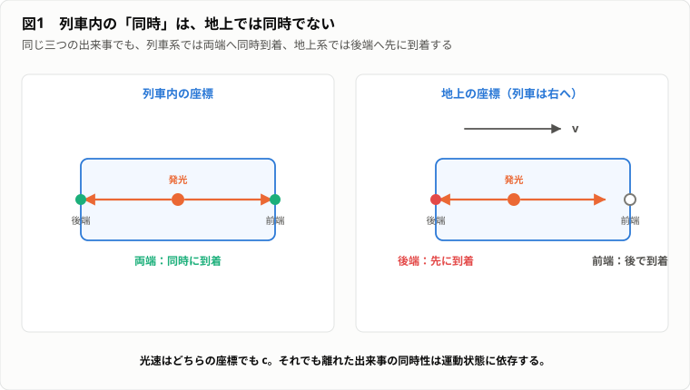
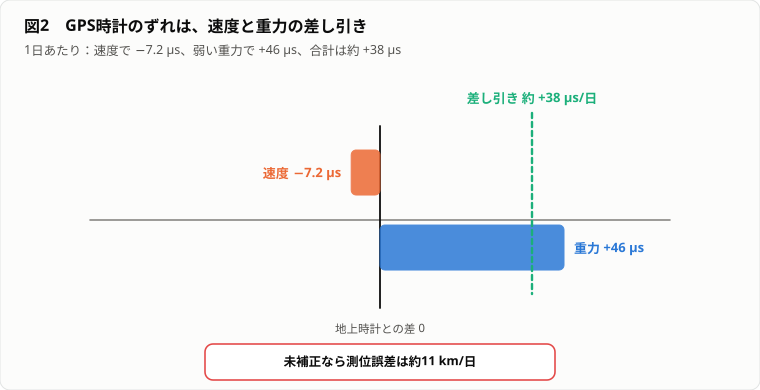
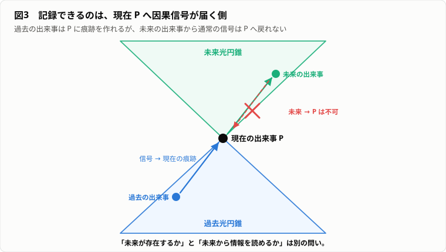
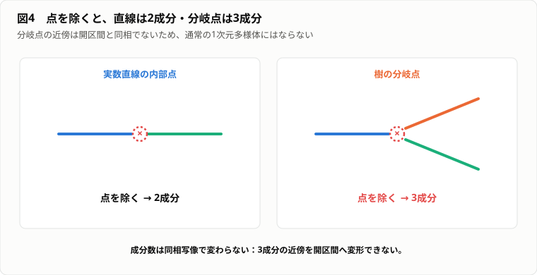

# やる夫が時間を分解するようです ―― 消えた一日と、まだ来ない未来

---
## 登場人物

**やる夫**：昔の動画を見つけてから、過去が消えたのか、未来がすでに存在するのかが気になり出した。思いついた説明にすぐ飛びつく。

**やらない夫**：物理学と数学に詳しい。

**できる子**：数学と情報理論に詳しい。

**できる夫**：新しい理論を聞くと、すぐ宇宙規模の事業へ展開したくなる。

---
## 第1幕　消えてしまった一日

---
### 1-1　動画の中では今だった

**やる夫**：
古いハードディスクを整理してたら、5年前の動画が出てきたお。

**やらない夫**：
何が映っていた。

**やる夫**：
旅行先で、やる夫がくだらないことで笑ってたお。
その後に何が起きるかも、今のやる夫が何を悩んでるかも、何も知らない顔をしてたお。

**やらない夫**：
当人には先が見えず、見ているお前には見える。その落差が引っかかったんだな。
もっとも、5年前の映像なら情報量の差自体は当然だろ。

**やる夫**：
でも変なんだお。
動画の中のやる夫にとっては、その瞬間が現在だったんだお。
その場では風が吹いて、声が聞こえて、次に何を言うかも分からなかった。

**やらない夫**：
今のお前にとっては、すべて過去だな。

**やる夫**：
そうなんだお。
動画のやる夫が悩んでいたことも、その後どうなったか知ってる。
あいつの未来は、今のやる夫から見れば全部もう決まってるんだお。

**やらない夫**：
それで何が疑問なんだ。

**やる夫**：
今のやる夫が未来だと思ってるものも、もっと後から見れば、すでに決まった過去なのかお。
未来のやる夫は、今日のやる夫が何を選んだか全部知ってるのかお。

**やらない夫**：
記録を見ている者と、記録の中の者の非対称から、未来の存在まで一気に飛んだわけか。
未来のお前が存在すると仮定すれば、そいつは知っているだろうな。

**やる夫**：
やっぱり未来はもう存在してるんだお！
宇宙は巨大な動画ファイルで、やる夫は再生位置を現在だと思ってるだけなんだお！

**やらない夫**：
なぜ動画ファイル全体が存在することを、宇宙全体にも適用できる。

**やる夫**：
似てるから……で押し切りたいけど、それだけじゃ弱いお。
動画には各フレームが全部保存されていて、宇宙にも各時刻が全部あるように見えるからだお。

**やらない夫**：
見た目でなく「全フレームの保存」が根拠か。なら、その仕組みまで移植できるか試そう。
動画の再生には、動画とは別に再生装置と再生時間がある。
宇宙が動画なら、宇宙を再生している装置はどこにある。

**やる夫**：
宇宙の外だお。

**やらない夫**：
宇宙の外の再生装置は、何の時間に従って動く。

**やる夫**：
外側の時間だお。

**やらない夫**：
その外側の時間は、何によって流される。

**やる夫**：
さらに外側の時間……。

**やらない夫**：
いくつ外側を用意する。

**やる夫**：
うぐぐ。
動画の比喩は、時間を説明するつもりで、別の時間を勝手に持ち込んでるお。

**やらない夫**：
比喩は仮説を作る助けにはなる。
だが比喩の中に最初から答えを埋め込めば、説明にはならない。

**やる夫**：
じゃあ動画の中の一日は、今も存在してるのかお。
それとも完全に消えたのかお。

**やらない夫**：
動画に入っているのは何だ。

**やる夫**：
過去……いや、待つお。
ファイルを開いているのは今だから、入っているのは画像と音声のデータだお。

**やらない夫**：
早くも言い直したな。では「出来事そのもの」か「出来事の痕跡」かを切り分ける。
動画を一時停止したら、風は吹いているか。

**やる夫**：
吹いてないお。

**やらない夫**：
画面の人物は考えているか。

**やる夫**：
考えてないお。

**やらない夫**：
なら保存されているのは、過去の出来事そのものか。

**やる夫**：
光と音を数字にした、現在のデータだお。
過去そのものじゃなくて、過去によって作られた現在の状態……。

**やらない夫**：
それが最初の区別だ。
過去の出来事と、現在に残る過去の記録は同じではない。

**やる夫**：
でも記録しか見つからないからって、過去そのものが存在しないとは限らないお。

**やらない夫**：
その通り。
存在しないという証明にも、存在するという証明にもなっていない。

**やる夫**：
なら判定する装置を作るお。

**やらない夫**：
何を判定する。

**やる夫**：
過去がまだ存在するか、未来がすでに存在するか、現在がどこにあるか、時間がどれくらいの速さで流れているか。
全部表示するお。

**やらない夫**：
装置の名前は。

**やる夫**：
時間実在判定機だお。

**やらない夫**：
ずいぶん大きく出たな。

---
### 1-2　時間の流速を測る

**やる夫**：
さっきの時間実在判定機には、測る項目が多すぎたお。
まず「時間が流れる」という実感を数値にするお。
流れがあるなら速度があるはずだから、そこから作ってみたお。

**やらない夫**：
過去や未来の存在より、測定手順を作れそうな項目から攻めるわけか。
では、その「速度」に使う分子と分母を決めろ。

**やる夫**：
普通の速度なら距離を時間で割るお。

$$v=\frac{dx}{dt}$$

時間そのものの速度なら、進んだ時間を……時間で割る？
嫌な予感がするけど、まずは書くお。

**やらない夫**：
では時間の流速は。

**やる夫**：
時間を時間で割って、

$$\frac{dt}{dt}=1$$

1秒毎秒だお。

**やらない夫**：
式にはなったが、測定器を一度も見ていないな。
その値が2秒毎秒になる状況を作れるか。

**やる夫**：
速く感じる日はあるけど、時計で測れば2秒毎秒にはならないお。
感覚を根拠にしたら、測定値と混ざるお。

**やらない夫**：
感覚を除けば候補が消えたか。では、止まって0秒毎秒になる状況は。

**やる夫**：
それもないお。
止まったことを測る時計まで止まるお。

**やらない夫**：
なら1秒毎秒という答えは、観測結果か。単位の言い換えか。

**やる夫**：
何も測ってないお。
時間を時間で割ったから1になっただけだお。

**やらない夫**：
川の流速は、岸から見て測れる。
時間の流速は、何を岸にする。

**やる夫**：
時間の外に立つお。

**やらない夫**：
その外側で測定を行うには、測定前と測定後が必要だ。
それは何だ。

**やる夫**：
外側の時間……。
また無限後退だお。

**やらない夫**：
「時間が流れる」という表現には、少なくとも2つの意味が混ざっている。

**やる夫**：
時計の数字が増えることと、現在が未来へ移動することかお。

**やらない夫**：
前者は時計の状態変化として測れる。
後者は、独立した物理量として何を測ればよいかが明らかでない。

**やる夫**：
でも流れてる感じは確実にあるお。
動画の1フレームをずっと見てる感じじゃないお。

**やらない夫**：
感じが存在することと、その感じが外界の基本構造を直接表していることは同じか。

**やる夫**：
色も、外に赤さそのものが浮いてるわけじゃないお。
光の波長を脳が色として感じてる。

**やらない夫**：
時間の流れも、外界の構造を脳が経験する形式かもしれない。

**やる夫**：
かもしれない、であって、決定じゃないお。

**やらない夫**：
そうだ。
今は候補を増やしただけだ。

**やる夫**：
時間実在判定機の最初の表示は、エラーになったお。

**やらない夫**：
何と表示する。

**やる夫**：
流速を測るには、時間の外側の時間が必要。
よって測定方法が循環している、だお。

**やらない夫**：
悪くない。
ではもっと簡単な問いから始めたらどうだ。

**やる夫**：
時間は何でできているか、かお。

**やらない夫**：
流れる速さを直接測れないなら、何が並んで変化を作るのかへ退くわけだ。
お前の最初の予想は。

**やる夫**：
動画の比喩は危険だったお……でも、フレームという発想まで全部捨てる必要はないかもしれないお。
まずは、時間とは瞬間が無限に並んだものだと考えるお。

**やらない夫**：
なら1秒を作る瞬間を、一つずつ集めてみろ。

---
## 第2幕　瞬間を集めれば時間になるのか

---
### 2-1　長さ0の瞬間

**やる夫**：
前の節で「1秒を作る瞬間を集めろ」と言われたから、時間の数珠を作ったお。
動画みたいに外の再生時間は持ち込まず、今回は材料だけを並べるお。

**やらない夫**：
比喩の弱点を一つ避けてきたのはいい。
その箱の小さな玉を、何に対応させた。

**やる夫**：
1個が1つの瞬間だお。
これを無限個並べれば、時間の区間ができるお。

**やらない夫**：
1個の瞬間は何秒ある。

**やる夫**：
一瞬にも短い長さを持たせたいけど、それだとさらに短い瞬間を考えられるお。
だから1個は0秒とするお。

**やらない夫**：
定義としては筋が通った。では足し算が、お前の欲しい区間を作るか畳みかけるぞ。2個なら。

**やる夫**：
0秒だお。

**やらない夫**：
100万個なら。

**やる夫**：
0秒だお。

**やらない夫**：
では無限個なら。

**やる夫**：
1秒だお。

**やらない夫**：
どの段階で0が1に変わった。

**やる夫**：
無限になったところだお。

**やらない夫**：
「無限になれば変わる」は計算規則か、願望か。

**やる夫**：
でも線分は点でできてるはずだお。
点には長さがないのに、線分には長さがあるお。

**やらない夫**：
それは矛盾か。

**やる夫**：
普通に足し算したら矛盾だお。

**やらない夫**：
普通の足し算を使えるのは、何個の項までだ。

**やる夫**：
何個でも……とは言えないお。
有限個なら普通の足し算が使える。
無限級数でも、1番目、2番目と番号を付けられる可算個なら、部分和の極限として定義できるお。

**やらない夫**：
「無限」を一種類だと思わなくなったな。では実数区間の点は、その可算個に収まるか。

**やる夫**：
カントールの対角線論法では、実数は非可算だお。
番号を付けきれないお。

**やらない夫**：
非可算個の0を、通常の級数として足したか。

**やる夫**：
そもそも同じ計算を定義してないお。

**やらない夫**：
長さを測る数学では、点一つの長さを0としながら、区間全体の長さを1とできる。
この長さの割り当てを測度と呼ぶ。

**やる夫**：
でも加法性に反してないかお。

**やらない夫**：
測度が要求する可算加法性は、互いに重ならない可算個の集合についてだ。
非可算個の一点集合を足し合わせる規則までは要求していない。

**やる夫**：
つまり、

$$[0,1]=\bigcup_{x\in[0,1]}\{x\}$$

ではあるけど、

$$\mu([0,1])=\sum_{x\in[0,1]}\mu(\{x\})$$

という非可算和を、普通の級数だと思ってはいけないんだお。

**やらない夫**：
そこまで言えれば、最初の「0を全部足した」という計算自体が無効だったと分かる。

**やる夫**：
じゃあ「区間は点の集合である」は正しいけど、「区間の長さは点の長さの合計である」は正しくないお。

**やらない夫**：
集合としてどう構成されているかと、どのような量を持つかは別の構造だ。

**やる夫**：
人間の集団が個人の集合でも、会社の売上が個人の身長の合計じゃないのと同じだお。

**やらない夫**：
会社員の身長で売上を測る会社には投資したくないが、構造を混同するなという点では近い。

**やる夫**：
時間も、瞬間の集合だと言っただけでは長さが出てこない。
どの瞬間とどの瞬間が近いか、どちらが前か、区間が何秒かを別に入れないといけないお。

**やらない夫**：
時間の数珠は何を表せた。

**やる夫**：
玉があることだけだお。
順番も近さも長さも、糸の結び方や目盛りを追加しないと分からないお。

**やらない夫**：
では、点をたくさん集めるだけで連続になると思うか。

**やる夫**：
点が隙間なく並べば連続になるお。

**やらない夫**：
隙間がないとは何だ。

---
### 2-2　有理数の時間軸

**やる夫**：
今度は、どの2つの時刻の間にも別の時刻がある、という条件にして数珠の糸を作るお。

**やらない夫**：
「点が多い」より一段具体的になったな。その条件だけで足りるか、有理数だけで時間軸を作って試せ。

**やる夫**：
有理数は、

$$
\mathbb{Q}=\left\{\frac{p}{q}\;\middle|\;p,q\in\mathbb{Z},\ q\neq0\right\}
$$

だお。
任意の有理数 $a<b$ の間には、

$$\frac{a+b}{2}$$

がある。
だからどこまでも細かく時刻を挿入できるお。

**やらない夫**：
確かに、有限の間隔を指定する限り次の点は挿せる。その成功をもって連続になったと言えるか。

**やる夫**：
なった、と言いたいお。
でも前の節で「集合と長さは別」とやったばかりだお。稠密さと連続も別かもしれないお。
ひとまず候補としては合格にして、反例を受けるお。

**やらない夫**：
では、時刻0から出発し、時刻列

$$1,\ 1.4,\ 1.41,\ 1.414,\ 1.4142,\ldots$$

をたどれ。

**やる夫**：
$\sqrt{2}$ に近づく列だお。

**やらない夫**：
到着時刻は有理数か。

**やる夫**：
$\sqrt{2}$ は無理数だから、時間軸の中にないお。

**やらない夫**：
時刻列はどこへ行った。

**やる夫**：
どこまでも近づくのに、到着先が時間軸から抜け落ちてるお。

**やらない夫**：
有理数の間には必ず別の有理数がある。
その性質を稠密という。

**やる夫**：
でも稠密だから連続とは限らないお。

**やらない夫**：
有理数全体を2つに分けてみろ。

**やる夫**：

$$A=\{q\in\mathbb{Q}\mid q^2<2\}$$

$$B=\{q\in\mathbb{Q}\mid q^2>2,\ q>0\}$$

に分けるお。

**やらない夫**：
$A$ に最大値はあるか。

**やる夫**：
ないお。
どんな近似値よりも、もっと $\sqrt{2}$ に近い有理数を作れる。

**やらない夫**：
$B$ に最小値は。

**やる夫**：
それもないお。

**やらない夫**：
間を埋める境界点は。

**やる夫**：
有理数の中にはないお。
目には見えない切れ目がある。

**やらない夫**：
点がたくさんあること、点が稠密であること、極限が内部に存在すること、空間が二つに切れないことは、別の性質だ。

**やる夫**：
実数は、この切れ目を埋めるように作られているお。

**やらない夫**：
実数の重要な性質の一つが完備性だ。[^3]
適切な意味で収束すべき列が、実数の外へ落ちない。

**やる夫**：
さらに実数区間は連結で、開集合を使って2つの離れた部分に分けられない。
有理数は稠密なのに、位相的には細かく分断されているお。

**やらない夫**：
時間が連続だというとき、何を意味している。

**やる夫**：
少なくとも「瞬間が無限に多い」だけじゃないお。
順序、近さ、極限、連結性みたいな構造を含んでる。

**やらない夫**：
「無限小の集まり」と「連続」は同じか。

**やる夫**：
同じ、と言うとまた「点が多ければ連続」の失敗を繰り返すお。
無限小は数の体系や解析の表現方法に関する概念で、連続性は位相や順序、完備性に関する性質だお。

**やらない夫**：
今度は自分で同じ病気を止めたな。では時間の数珠を改造するなら、何を足す。

**やる夫**：
玉の数を増やすんじゃなくて、玉の近傍関係と順序と極限を定義するお。

**やらない夫**：
玉だけでは時間にならなかったな。

**やる夫**：
時間の材料を探してたのに、材料より関係のほうが重要だったお。

---
## 第3幕　無限小は時間の粒なのか

---
### 3-1　宇宙の最小フレーム

**やる夫**：
前の幕では、点を増やすより順序や極限や近傍関係が必要だと分かったお。
でもそれは数学の時間軸の話だお。現実の時間には、本当に最小の粒があるかもしれないお。
動画の比喩を捨てたはずなのに、宇宙の最小フレームだけはまだ惜しいお。

**やらない夫**：
未練を理論に昇格させるな。
ただし物理的な候補として検討する価値はある。どれくらいの長さを想定した。

**やる夫**：
最初に浮かぶのは、微分で使う $dt$ だお。
でも教科書によっては単なる記号にも見えるお……。
まずは0ではないけど、どんな普通の時間よりも小さい量だと仮定するお。

**やらない夫**：
標準的な実数の中に、そのような正の数はあるか。

**やる夫**：
無限小 $\varepsilon$ は、

$$0<\varepsilon<\frac{1}{n}$$

がすべての自然数 $n$ について成り立つ数だお。

**やらない夫**：
実数 $\varepsilon>0$ を一つ選べ。
アルキメデスの性質によれば、ある自然数 $n$ が存在して、

$$\frac{1}{n}<\varepsilon$$

となる。

**やる夫**：
あっ、やる夫の定義と正面衝突したお。
どんな正の実数を選んでも、それより小さい $1/n$ が作れる。
標準的な実数には、正の無限小は存在しないお。

**やらない夫**：
自分で候補を潰せたな。なら微分記号の見た目と、定義を分けるぞ。
微分の

$$\frac{dx}{dt}$$

に出る $dt$ は、物理的な粒子を表しているのか。

**やる夫**：
高校では「限りなく0に近い」と覚えたお。
でも今の反例を見ると、「実数の中に特別に小さい粒がある」という意味ではなさそうだお。

**やらない夫**：
標準解析では、導関数は

$$\frac{dx}{dt}(t)=\lim_{\Delta t\to0}\frac{x(t+\Delta t)-x(t)}{\Delta t}$$

として定義される。
$\Delta t$ は計算途中では0でなく、極限で0へ近づける。

**やる夫**：
$dt$ という最小時間を直接割ってるんじゃないお。
有限の差分の比を作って、極限を取ってる。

**やらない夫**：
速度を求めるために、運動を無限小の静止画へ物理的に分割する必要はない。

**やる夫**：
でもライプニッツは無限小を使ったお。

**やらない夫**：
現代には超実数を使う非標準解析がある。[^4]
そこでは正の無限小を厳密に扱える。

**やる夫**：
じゃあやっぱり時間は無限小でできてるお。

**やらない夫**：
なぜ数学的な記述方法の存在が、自然界の構成要素を決める。

**やる夫**：
同じ微分を、極限でも無限小でも書けるから、数学的にはどちらも可能な言語だお。
地図を緯度経度で書けるからって、地球表面に緯線が物質として埋まってるわけじゃないお。

**やらない夫**：
そういうことだ。

**やる夫**：
無限小が使えることと、現実の時間が無限小粒子の集まりであることは別だお。

**やらない夫**：
では、プランク時間ならどうだ。

**やる夫**：
無限小を物理の粒にする案は自分で否定できたお。
でも、物理定数から作る尺度なら話は別かもしれない……それだお！

$$t_{\mathrm P}=\sqrt{\frac{\hbar G}{c^5}}$$

約 $5.39\times10^{-44}$ 秒。
これが宇宙の1フレームだお。

**やらない夫**：
その式は何を組み合わせている。

**やる夫**：
量子論の $\hbar$、重力の $G$、相対論の $c$ だお。
三理論の看板が揃ってるから、宇宙公認の最小値に見えるお。

**やらない夫**：
看板の数で定理にはならん。
その値より短い時間が存在しないと、どの確立した理論が証明した。

**やる夫**：
証明してないお。

**やらない夫**：
プランク尺度は、現在の理論をそのまま使うと量子重力を無視できなくなる目安だ。
時間の離散性を直接意味するとは限らない。

**やる夫**：
「既存理論が頼れなくなる尺度」と「世界の最小単位」を混同してたお。

**やらない夫**：
時間が連続か離散かは、何を調べれば分かる。

**やる夫**：
数学の記号じゃなくて、物理理論と実験だお。
離散時間が予測する効果を探して、連続時間の予測と比較しないといけない。

---
### 3-2　静止画から運動は生まれるか

**やる夫**：
最小フレームは物理理論と実験なしには決められなかったお。
なら連続時間へ戻るけど、今度は各瞬間が静止画に見えてきたお。
静止した瞬間を並べて、どうして運動になるんだお。

**やらない夫**：
粒を捨てても、画像の比喩が別の姿で戻ってきたな。
各瞬間で物体の位置が一つに決まっていることを、静止と呼んでいるのか。

**やる夫**：
その瞬間だけ見れば動いてないお。

**やらない夫**：
動いている物体が、ある瞬間に複数の位置を占めるべきだと思うか。

**やる夫**：
一瞬に複数の位置がないと動けない、と言いかけたお。
でもそれだと、物体の位置を定義できなくなる。それはおかしいお。

**やらない夫**：
自分の直観が要求した条件を、自分で拒否したわけだ。
では運動とは、一つの瞬間の内部にある追加物質か。
それとも異なる時刻における位置の関係か。

**やる夫**：
位置を時間の関数

$$x(t)$$

として与えて、異なる $t$ で位置が変わることだお。

**やらない夫**：
速度は。

**やる夫**：

$$v(t)=\frac{dx}{dt}$$

だお。
一瞬の中で物体がにじんでるから速度があるんじゃなくて、位置関数の局所的な変化率として定義される。

**やらない夫**：
速度を「瞬間内のにじみ」にせず定義できたな。
その定義と映画のフレームを同一視すると、どこが食い違う。

**やる夫**：
映画では離散フレームを脳が補間して運動に見せる。
でも連続的な物理運動は、静止画を高速表示して発生するわけじゃないお。

**やらない夫**：
時間を静止画の列として理解したことで、何を勝手に持ち込んだ。

**やる夫**：
各瞬間を、独立した画像みたいに考えたお。
でも数学では、時刻ごとの状態は関数全体の一部で、近傍の状態と関係づけられている。

**やらない夫**：
関数 $x(t)$ が連続なら何が言える。

**やる夫**：
時間を少し変えれば、位置も急に飛ばず少しだけ変わる。
微分可能なら、さらに局所的な変化率を持つ。

**やらない夫**：
そうだ。単独の画像を凝視して探す限り、関係は見えない。
なら運動はどこにある。

**やる夫**：
点の内部じゃなく、点どうしの関係と関数の構造にあるお。

**やらない夫**：
時間についても同じ可能性は。

**やる夫**：
さっきまで「瞬間の中に時間らしい何か」を探してたお。
でも運動と同じなら、時間の本質も瞬間という物体ではなく、出来事の順序や近傍、間隔、因果関係にあるかもしれないお。

**やらない夫**：
探す場所を点の内部から関係へ移せたな。では時間実在判定機は何を測るべきだ。

**やる夫**：
謎の時間物質じゃなくて、構造を一つずつ測るお。

**やらない夫**：
「構造」と言うだけでは、また巨大な一語になる。最初の表示項目を一つ選べ。

**やる夫**：
出来事の順番と、切れずにつながっているかどうかだお。

---
## 第4幕　時間軸を伸ばしても時間か

---
### 4-1　位相が保存するもの

**やる夫**：
前の幕で、時間の候補は粒ではなく、出来事どうしの順序や近傍や間隔だと分かったお。
そこで、どの構造がどこまで必要か分けるために、伸び縮みする時間軸を作ったお。
ゴム紐に、出来事 $A,B,C,D$ を順番に書いたお。

**やらない夫**：
「時間」という一語を分解する実験か。まず何を変える。

**やる夫**：
$B$ と $C$ の間を10倍に伸ばすお。
これで時間が変わった……と言いたいけど、何が変わったか先に言わないとまた一語でごまかすお。

**やらない夫**：
警戒できるようになったな。具体的には。

**やる夫**：
間隔だお。

**やらない夫**：
$A$ の次に $B$ があり、その後に $C$ があるという順序は。

**やる夫**：
変わらないお。

**やらない夫**：
$B$ の近くにあった時刻は、伸ばした後も $B$ の近くから連続的に対応づけられるか。

**やる夫**：
対応づけられるお。
切ったり貼ったりしてないから、つながり方は同じだお。

**やらない夫**：
このように連続で、逆写像も連続な対応を同相写像という。[^5]

**やる夫**：
位相幾何学では、同相なものを同じ形とみなすお。
時間軸を伸ばしても、位相的には同じ実数直線だお。

**やらない夫**：
位相だけで、$B$ と $C$ の間が1秒か100年か分かるか。

**やる夫**：
分からないお。
位相は近傍や連続性を教えるけど、距離や時間間隔までは教えない。

**やらない夫**：
では時間を表す構造を下から積み上げろ。

**やる夫**：
まず集合。
出来事の集まりがある。

次に順序。
どちらが前かを決める。

次に位相。
どの出来事がどの出来事に近く、どんな列がどこへ収束するかを決める。

次に微分構造。
滑らかな座標を使って速度や変化率を定義できるようにする。

次に計量。
時計が測る間隔を与える。

最後に因果構造。
どの出来事がどの出来事へ影響できるかを決めるお。

**やらない夫**：
一気に六段も積んだか。暗唱で済ませず、一段ずつ抜いて壊してみるぞ。
集合だけでは何が不足する。

**やる夫**：
出来事を袋に入れただけなら、順番すらないお。

**やらない夫**：
まず一段目は必要だな。順序だけを足したら。

**やる夫**：
前後は言えても、「直前に近い」とか連続に変わるとかは言えないお。
近さや滑らかさがない。

**やらない夫**：
いい。位相まで足せば近さは扱えるが、それでも欠けるものは。

**やる夫**：
ゴム紐を10倍にしても同じ扱いなんだから、何秒経過したか分からないお。

**やらない夫**：
今の実験を自分で回収したな。では計量まであれば全部か。

**やる夫**：
相対論では計量から光円錐と因果構造も多くの場合決まるけど、概念としては区別したほうがいいお。

**やらない夫**：
時間とは一つのものか。

**やる夫**：
日常語の「時間」に、いくつもの数学的構造を詰め込んでたお。

**やらない夫**：
位相と時間を結びつけると何が見える。

**やる夫**：
時計の進み方を全部消しても残る、時間の骨格が見えるお。
出来事が切れずに続くこと、時間軸が輪になっているか、端があるか、枝分かれしているか、みたいな大域的性質だお。

---
### 4-2　時間が輪になったら

**やる夫**：
伸ばすだけじゃ差が見えにくいから、今度は時間軸を輪にしたお。
位相的には直線じゃなくて円 $S^1$ だお。

**やらない夫**：
ずいぶん乱暴な改造だが、直線との違いははっきりする。
お前の予想では何が起きる。

**やる夫**：
ずっと未来へ進むと、昔の出来事へ戻るお。
毎週月曜日が戻ってくるのと同じ……いや、曜日はラベルが再利用されるだけかもしれないお。

**やらない夫**：
自分で半分まで反証したな。曜日の名前が繰り返すことと、同じ出来事へ戻ることは同じか。

**やる夫**：
違うお。
来週の月曜日は別の出来事だお。

**やらない夫**：
時間そのものが円なら、世界線が一周して同一の出来事へ戻る可能性がある。

**やる夫**：
閉じた時間的曲線だお。
一般相対論の一部の時空解には現れることがあるお。[^15]

**やらない夫**：
名前まで知っていても、そこで合格ではない。
存在する数理解が、現実の宇宙で実現することを意味するか。

**やる夫**：
意味しないお。
境界条件や物質の性質、量子効果、安定性まで検討しないといけない。

**やらない夫**：
位相が変わると、局所的な時計だけでは分かりにくい何が変わる。

**やる夫**：
時間全体の大域構造だお。
どこまでも続く直線なのか、始点や終点がある区間なのか、円環なのか、複数成分に分かれているのか。

**やらない夫**：
始まりのない時間と、有限の過去しか持たない時間は局所的に区別できるか。

**やる夫**：
すぐには無理だお。
今の周辺だけ見れば、どちらも普通の直線に見えるかもしれないお。
大域的な観測や理論が必要だお。

**やらない夫**：
局所と大域を分けられたな。では時間の位相を決めれば、前に測れなかった流れまで決まるか。

**やる夫**：
輪を描いた勢いで進行方向まで矢印を付けたくなるけど、それは位相に含まれてないお。
時間の流れまでは決まらない。
円周上のどちら向きを未来にするか、どれくらいの速さで時計が進むかは別だお。

**やらない夫**：
つながり方と向きを自分で分離できたな。では向きを与える追加構造は。

**やる夫**：
円の表と裏……ではないお。
各点で未来向きが連続につながるよう、時間の向き、時間指向を選ぶ必要があるお。

**やらない夫**：
名前まで出たな。これで最初の問いへ戻せる。
「過去と未来の区別」は、位相だけで完全に決まるか。

**やる夫**：
決まらない。
位相は連続なつながり方を与えるけど、どちら向きが未来かは追加構造だお。

**やらない夫**：
現実の物理では、未来方向はどう見分ける。

**やる夫**：
因果関係やエントロピー増大、記憶が形成される向きと結びついてる。
でもそれは後で調べるお。

**やらない夫**：
なぜ後でだ。

**やる夫**：
その前に、宇宙全体に共通の「今」があるか判定するお。
現在が見つからないと、過去と未来の境界も引けないお。

---
## 第5幕　宇宙共通の現在を探す

---
### 5-1　同時性が壊れる

**やる夫**：
向きが決まらないなら先に境界を置こうと思って、時間実在判定機に宇宙全体の現在を表示する機能を付けたお。

**やらない夫**：
向きより先に「今」を固定する作戦か。順序は分かるが、現在をどう定義した。

**やる夫**：
やる夫の時計が12時を示した瞬間に、宇宙中で起きている出来事だお。
……「やる夫の」を宇宙へ拡張していいのか、書いた途端に怪しくなったお。

**やらない夫**：
その怪しさが実験の入口だ。遠くの時計が同じ時刻だと、どう確認する。

**やる夫**：
光信号を送って同期するお。

**やらない夫**：
アインシュタイン同期を使うなら、光が往復する時間の半分で片道を進むと仮定するな。[^6]

**やる夫**：
それで遠くの時計を合わせられるお。

**やらない夫**：
では、長い列車の中央で光が発生し、前端と後端に同時に到達したとする。
列車内の観測者には何が見える。

**やる夫**：
列車の中だけ見れば、中央から両端までの距離は同じで、光速も同じだから、同時に届くお。
ただしこれは列車内の座標での判定だお。

**やらない夫**：
観測者を明示したのは大事だ。では地上の座標へ移る。
列車は前方へ動いている。
前端は光から逃げ、後端は光へ近づく。

**やる夫**：
地上でも光速は両方向とも $c$ だから、後端に先に届くお。

図1：光速はどちらの座標でも同じ $c$ だが、離れた出来事の「同時」は観測者の運動状態に依存する（タップ／クリックで原寸表示）。

**やらない夫**：
列車内で同時だった2つの出来事は、地上でも同時か。

**やる夫**：
同時じゃないお。

**やらない夫**：
どちらが正しい。

**やる夫**：
どちらかの時計が壊れている、としたいけど、両者とも同じ光速を使って同期しているお。
どちらも自分の慣性系では正しいお。
離れた出来事の同時性は、観測者の運動状態に依存する。

**やらない夫**：
ローレンツ変換を書け。

**やる夫**：
相対速度 $v$ で動く慣性系では、

$$t'=\gamma\left(t-\frac{vx}{c^2}\right)$$

$$x'=\gamma(x-vt)$$

$$\gamma=\frac{1}{\sqrt{1-v^2/c^2}}$$

だお。

**やらない夫**：
同じ $t$ を持つ離れた2つの出来事で、$x$ が違えば $t'$ は。

**やる夫**：
違う値になるお。
ある観測者の同時面は、別の観測者には傾いて見える。

**やらない夫**：
式でも列車の反例と同じ結論が出たな。
宇宙全体を一枚の「現在」で切る方法は一意か。

**やる夫**：
特殊相対論の基本構造からは一意じゃないお。

**やらない夫**：
現在が存在しないのか。

**やる夫**：
局所的な現在、つまり自分が今経験している出来事はあるお。
問題は、遠く離れた場所まで含む絶対的な現在だお。

**やらない夫**：
時間実在判定機は、どの現在を表示する。

**やる夫**：
装置の運動状態によって違う現在を表示するしかないお。

**やらない夫**：
最初に見た動画へ戻れ。
動画の中のやる夫と、今のやる夫を単純に同じ宇宙時刻の別フレームとして並べる考えは、何を仮定していた。

**やる夫**：
宇宙全体を共通のフレーム番号で切れることを仮定してたお。
でも相対論では、その切り方が観測者ごとに違う。

**やらない夫**：
ブロック宇宙の議論も、単純な動画ファイルより慎重に行う必要があるな。

---
### 5-2　時計が測る固有時間

**やる夫**：
宇宙共通の「今」が壊れても、手元の時計まで無意味になったわけじゃないお。
宇宙共通の時間がないなら、時計は何を測ってるんだお。

**やらない夫**：
いい切り返しだ。全宇宙の切断面ではなく、時計自身が通った経路へ問題を縮める。
そこで測る量を固有時間と呼ぶ。

**やる夫**：
平坦な時空なら、

$$ds^2=-c^2dt^2+dx^2+dy^2+dz^2$$

で、時間的な世界線に沿って、

$$d\tau^2=dt^2-\frac{dx^2+dy^2+dz^2}{c^2}$$

だお。

**やらない夫**：
式を持ってきただけでは表示は読めん。まず静止という簡単な経路を代入しろ。

**やる夫**：
$dx=dy=dz=0$ だから $d\tau=dt$ だお。
座標系に対して静止する時計では、座標時間と固有時間が一致するお。

**やらない夫**：
基準例は合った。次は空間方向の項を消さず、高速で動かせ。

**やる夫**：

$$d\tau=dt\sqrt{1-\frac{v^2}{c^2}}$$

だから、同じ座標時間 $dt$ に対して固有時間は少なくなるお。

**やらない夫**：
同じ出発地点と再会地点を結ぶ2本の世界線を、双子時計に通らせると。

**やる夫**：
異なる固有時間を積算することがあるお。
移動した時計と地上に残った時計の表示がずれる。

**やらない夫**：
どちらの時計が本当の時間を示す。

**やる夫**：
片方が本物で片方が偽物……と決める基準がないお。
両方とも、自分の世界線に沿った時間を正しく示すお。
宇宙全体に一つの時間があって、片方が故障したわけじゃない。

**やらない夫**：
故障説を捨てられたな。では重力まで含む一般相対論では、何が経路の長さを決める。

**やる夫**：

$$d\tau^2=-\frac{1}{c^2}g_{\mu\nu}dx^\mu dx^\nu$$

のように、計量 $g_{\mu\nu}$ が固有時間を決めるお。
重力場では場所や経路によって時計の進み方が変わる。[^8]

**やらない夫**：
重力を受けた時計が内部で遅く動く機械的原因があるのか。

**やる夫**：
特定の時計だけじゃなく、原子時計も化学反応も生物過程も、同じ固有時間に従うお。
「時計が遅れる」というより、その経路に沿う時間間隔そのものが違う。

**やらない夫**：
日常の重力は、計量のどの部分と強く関係する。

**やる夫**：
弱い重力場では、

$$g_{00}\approx-\left(1+\frac{2\Phi}{c^2}\right)$$

となって、ニュートン重力ポテンシャル $\Phi$ が時間成分に入るお。
重力は空間だけでなく、時間の進み方の違いとして現れる。

**やらない夫**：
ここまで式を4本書いて、まだ一度も数を入れていない。入れろ。
できる子、GPS衛星の諸元を。

**できる子**：
軌道半径 $2.656\times10^7$ m。地表からの高度は約2万km。
軌道速度 $3.87\times10^3$ m/s。
地球半径 $6.371\times10^6$ m。
$GM=3.986\times10^{14}$ m³/s²。

**やる夫**：
2つ別々に出すお。まず速度の効果だお。
$v/c$ が小さいから $\sqrt{1-v^2/c^2}\approx1-\dfrac{v^2}{2c^2}$ と展開できるお。

$$\frac{v^2}{2c^2}=\frac{(3.87\times10^3)^2}{2\times(3.00\times10^8)^2}
=\frac{1.50\times10^7}{1.80\times10^{17}}=8.3\times10^{-11}$$

1日は $86400$ 秒だから、$8.3\times10^{-11}\times86400=7.2\times10^{-6}$ 秒。
**衛星の時計は1日に7.2マイクロ秒 遅れる** お。

**やらない夫**：
次は重力だ。$g_{00}$ の式から、位置による進み方の比は $1+\Phi/c^2$ になる。
地表と軌道の $\Phi=-GM/r$ の差を取れ。

**やる夫**：
$\dfrac{GM}{c^2}=\dfrac{3.986\times10^{14}}{9.00\times10^{16}}=4.43\times10^{-3}$ m だお。

$$\frac{\Delta\Phi}{c^2}=\frac{GM}{c^2}\left(\frac{1}{r_{\text{地}}}-\frac{1}{r_{\text{衛}}}\right)
=4.43\times10^{-3}\left(1.570\times10^{-7}-3.77\times10^{-8}\right)$$

括弧の中は $1.193\times10^{-7}$。掛けて $5.3\times10^{-10}$。
1日で $5.3\times10^{-10}\times86400=4.6\times10^{-5}$ 秒。
**衛星の時計は1日に46マイクロ秒 進む** お。
重力が弱い場所にいるから、地上より速く進むんだお。

**やらない夫**：
足せ。

**やる夫**：
$-7.2+46=$ **1日あたり $+38$ マイクロ秒** だお。
速度で遅れる分より、重力で進む分の方が6倍以上大きいお。差し引きで進むお。

図2：速度効果 $-7.2$ μs/日と重力効果 $+46$ μs/日を合わせ、衛星時計は地上より約 $+38$ μs/日進む（タップ／クリックで原寸表示）。

**やらない夫**：
その38マイクロ秒を放置すると、測位はどうなる。

**やる夫**：
GPSは電波の到達時間から距離を出すお。時計が38マイクロ秒ずれたら、距離のずれは

$$3.0\times10^8 \times 38\times10^{-6} \approx 1.1\times10^{4}\ \text{m}$$

**1日で11km** だお。
……2日放置したら22km、1週間で80kmだお。
カーナビが隣の県を指すお。**使い物にならないお。**

**できる子**：
だから衛星の時計は、打ち上げ前に周波数をずらしてある。
地上で見て正しく進むように、あらかじめ遅く作られている。

**やる夫**：
……相対論が正しくなかったら、GPSは動かないお。
固有時間が経路ごとに違うっていうのは、哲学の話じゃなくて、
**毎日11km分の実務** だったんだお。
双子時計のずれも、思考実験じゃなくて頭の上を飛んでるお。

**やらない夫**：
時間とは独立した川か。

**やる夫**：
少なくとも相対論では、時空の幾何学の一部だお。
時計は流体の流量を測ってるんじゃなくて、世界線の長さに相当する固有時間を積算してる。

**やらない夫**：
すると「すべての時間が存在する」という考えは、どこから出てくる。

**やる夫**：
出来事を4次元時空上の点として扱い、物体の歴史全体を世界線として表すところからだお。

---
## 第6幕　すべての時刻は存在するのか

---
### 6-1　ブロック宇宙

**やる夫**：
前の幕では、宇宙共通の現在は作れず、時計ごとの固有時間なら測れると分かったお。
そこで各時計の経路をまとめて見られる時空図を作ったお。
横軸が空間、縦軸が時間。
やる夫の誕生から現在までを1本の世界線で描いたお。

**やらない夫**：
共通のフレーム番号を復活させず、出来事と世界線を並べる道具だな。
その図の上では、過去の点も未来の点も同じ紙面にある。

**やる夫**：
だから全部存在してるお……と言いたいけど、図に描いた怪獣まで実在するわけじゃないお。
それでも、過去・現在・未来を同じ4次元構造の部分として扱うブロック宇宙の候補にはなるお。

**やらない夫**：
先回りされたな。紙に描けたこと自体は物理的存在の証拠にならない。
なら、図の見た目以外の根拠を出せ。

**やる夫**：
数学上の表現と存在論は同じじゃないお。

**やらない夫**：
ではブロック宇宙を支持する理由は何だ。

**やる夫**：
相対論では絶対的な現在がない。[^7]
ある観測者が現在と呼ぶ遠方の出来事を、別の観測者は過去や未来に分類する。
「現在だけが存在する」とすると、誰の現在を存在させるか決めにくいお。

**やらない夫**：
そこまでは現在主義側の困難だ。それを避ける案を、お前の言葉で続けろ。

**やる夫**：
過去・現在・未来の出来事をすべて時空の一部として扱えば、観測者による同時性の違いを自然に受け止められる。
これが永遠主義やブロック宇宙と相対論の相性がよい理由だお。

**やらない夫**：
ブロック宇宙では、時間は流れるか。

**やる夫**：
時空全体はただ存在し、各物体は世界線として延びている。
宇宙全体を動かす外部時間はないお。

**やらない夫**：
ではお前は動いていないのか。

**やる夫**：
「図では動かないから現実でも動かない」と言ったら、また表現と対象の混同だお。
世界線上の異なる点に、異なる身体状態や脳状態があるお。
各状態は直前の状態の記憶を持ち、次の状態をまだ記憶していない。

**やらない夫**：
「私が現在を移動している」とは何を意味する。

**やる夫**：
世界線全体とは別の、移動する魂みたいな指示点を置くことになるお。
でもその指示点が動くには、また外部時間が必要になる。

**やらない夫**：
外部時間を呼ぶ代償まで見えたな。では移動する指示点は不要か。

**やる夫**：
物理モデルとしては不要かもしれないお。
ただし、現在の特別さや時間の流れの経験を、それだけで説明しきったとは限らない。

**やらない夫**：
他の立場は。

**やる夫**：
ブロック宇宙しか残らない、と言いたいけど、相対論との相性だけで存在論は決着しないお。
現在だけが存在する現在主義。
過去と現在が存在し、未来はまだ存在しない成長ブロック宇宙。
出来事が順次生成されるという考えもあるお。

**やらない夫**：
対抗案を自分で残せたな。相対論だけで、これらを完全に排除できるか。

**やる夫**：
簡単ではないお。
絶対的な現在を追加する理論も論理的には考えられる。
ただし相対論の観測結果と整合し、観測できない追加構造を置く理由を説明しないといけない。

**やらない夫**：
今の結論は。

**やる夫**：
「ブロック宇宙の勝ち」と言い切れば気持ちいいけど、実験が決めた範囲を越えるお。
ブロック宇宙は相対論と整合的で、単純な現在主義より自然に見える。
でも「未来がすでに存在することが実験で証明された」とまでは言えないお。

**できる夫**：
話は全部聞かせてもらったよ!! それ、事業になる!!
未来が時空の一部としてすでに存在しているなら、そこには**情報がある**。
情報があるなら、原理的に**読み出せる**!
社名は「未来観測研究所」、第一期は来年の株価、第二期は災害予知、
第三期で個人向け人生プレビューサービスまで一気に行こう!
初期投資は観測装置に集中投下、回収は3年で十分だ!
やる夫くん、君は共同創業者で構わないかい!?

**やる夫**：
急に来たお。しかも早口だお。
……でも理屈は、いまやる夫が話してたことそのままだお。
未来が存在するなら、そこに情報があるお。ある情報は読めるはずだお。
反論できないお。

**やらない夫**：
できないか。

**やる夫**：
できないお。悔しいけど、いまのやる夫の道具では止められないお。
「存在するのに読めない」を言うには、**存在と読み出しの間に何か壁がある** と示さないとダメだお。
その壁が何なのか、まだ持ってないお。

**できる夫**：
つまり反対意見なし! 事業計画書を書いてくる!!

**やらない夫**：
止めないでおけ。あいつが戻ってくるまでに、お前がその壁を見つけろ。

---
### 6-2　運命は決まっているのか

**やる夫**：
未来が時空の一部として存在するなら、やる夫の選択も全部決まってるお。
努力しても無意味だお。

**やらない夫**：
存在論から人生相談まで一息で飛んだな。
なぜ「存在している」と「原因から強制されている」が同じになる。

**やる夫**：
未来の出来事が時空にあるなら、その通りにしかならないお。
理屈は分かったから、実験するお。
来週の資格試験の勉強を、今日一日サボるお。
未来がすでに時空にあるなら、サボっても結果は同じはずだお。

**やらない夫**：
止めはしない。やってこい。

**やる夫**：
……やってきたお。模試の点を報告するお。
先週が62点だったお。今週は **48点** だったお。
14点下がったお。

**やらない夫**：
未来はすでに時空にあったか。

**やる夫**：
……あったかどうかは、まだ分からないお。
でも **48点の方の未来があった** お。
やる夫が「どうせ同じ」と思ってサボった一日は、時空の中でちゃんと原因になってたお。
62点の未来は、サボらなかった世界線の方にあったお。

**やらない夫**：
お前の主張は「未来が存在するなら努力は無意味」だった。何が壊れた。

**やる夫**：
……「未来が存在する」から「努力が無意味」への矢印だお。
そこが繋がってないお。
未来が1本に決まっていても、その1本が **やる夫の行動を含んで** 決まってるお。
サボりを含む未来は48点、サボらない未来は62点。どっちも「存在する未来」だお。
存在するかどうかと、何が原因かは、別の話だったお。

**やらない夫**：
14点で買った教訓としては安い方だ。
小説の最終ページが存在すると、登場人物の行動に原因がないことになるか。

**やる夫**：
最終ページを作者が持っていても、作中で石を投げれば窓は割れるお。
物語の中では、前の出来事が後の出来事を引き起こしてるお。

**やらない夫**：
そうだ。結末の存在と、途中の因果の不在は別だ。
ブロック宇宙でも、因果関係は時空内部の構造として存在する。
お前の判断、欲求、推論、行動が未来の状態を生むことは消えない。

**やる夫**：
でも別の選択はできないお。

**やらない夫**：
「できる」には複数の意味がある。
物理法則と過去を完全に固定しても別の未来が生じる、という意味か。
お前が違う理由や意図を持っていれば違う行動をする能力がある、という意味か。

**やる夫**：
どちらも「できる」と言うから同じに見えたけど、反事実の条件が違うお。
自由意志の定義が混ざってるお。

**やらない夫**：
今の区別を因果へ移せ。決定論と宿命論も違う。

**やる夫**：
決定論では、未来は現在の状態と法則から生じる。
だから現在の行動は未来の原因だお。

宿命論では、何をしても同じ結果になる。
これは決定論からは出てこないお。

**やらない夫**：
試験勉強をする世界線と、しない世界線で結果が違うなら。

**やる夫**：
勉強は意味があるお。
ブロック宇宙でも、合格の出来事には勉強という原因が含まれている。

**やらない夫**：
過去の動画で、お前がその後の結果を知っていることは、動画の中のお前の判断を無意味にするか。

**やる夫**：
しないお。
当時の判断が、その後の結果を作ったことは変わらない。

**やらない夫**：
では、未来の存在論と、現在の行為の実践的意味を切り離せ。

**やる夫**：
未来が存在するか未確定でも、今の状態が後の状態に因果的に影響することは変わらないお。

**やらない夫**：
時間実在判定機は「未来が存在する」と表示できたか。

**やる夫**：
まだだお。
相対論からはブロック宇宙が有力に見えるけど、未来の存在論を直接検出したわけじゃない。

**やらない夫**：
では、確実に観測できるものへ戻れ。

**やる夫**：
過去の記録だお。
なぜ過去の動画はあるのに、未来の動画はないのか調べるお。

---
## 第7幕　なぜ過去だけが見えるのか

---
### 7-1　記憶の台帳

**やる夫**：
前の幕では、未来が存在するかを直接表示できなくても、今の行為が未来の原因になることは残ったお。
そこで存在論からいったん離れ、確実に観測できる過去の記録を調べるために、記憶の台帳を用意したお。
過去について知っていることを全部書くお。

**やらない夫**：
哲学の大問題を昼食から攻めるのは、お前らしくていい。昨日の昼食と、その根拠を一緒に書け。

**やる夫**：
カレーだお。
ただし過去へ見に行ったわけじゃない。
記憶がある。
レシートがある。
写真もある。
皿に少し匂いが残ってるお。

**やらない夫**：
過去の答えより、現在の証拠を列挙したわけだ。では同じ形式で明日の昼食は。

**やる夫**：
まだ分からないお。
予定表にはラーメンと書けるけど、変更するかもしれない。

**やらない夫**：
過去を直接見ているか。

**やる夫**：
見ている気分はあるけど、目の前に昨日のカレーはないお。
現在の脳状態、紙、写真、物体の痕跡を見てるお。

**やらない夫**：
ここで動画の最初の区別が戻ってきたな。なら記録を「保存された過去」と言わずに定義しろ。

**やる夫**：
現在の状態の一部が、過去の状態と相関していることだお。

**やらない夫**：
写真が過去の光景と対応するのはなぜだ。

**やる夫**：
過去の光が撮像素子へ届き、その状態を変え、データとして固定したからだお。
因果過程によって相関が作られた。

**やらない夫**：
未来の写真がないのは、未来が存在しない証拠か。

**やる夫**：
未来が存在しない、と即断したいけど、記録の向きしか調べていないお。
そこまでは言えない。
少なくとも、現在の装置に未来から通常の因果信号が届いていないことを示すだけだお。

**やらない夫**：
光円錐シートを出せ。

**やる夫**：
現在の出来事 $P$ へ影響できるのは、$P$ の過去光円錐内の出来事だお。
未来光円錐内の出来事は、$P$ から影響を受ける可能性はあるけど、通常は $P$ に影響できない。

図3：過去から $P$ へ届く因果信号は現在に痕跡を作れるが、未来の存在を仮定しても、そこから $P$ へ情報を読めることにはならない（タップ／クリックで原寸表示）。

**やらない夫**：
その一行で潰せるものがあるだろう。

**やる夫**：
……**できる夫の事業だお。**
あいつは「未来が存在する→情報がある→読み出せる」と言ったお。
最後の矢印が切れるお。
読み出しっていうのは、**対象からやる夫の装置へ信号が届くこと** だお。
未来の出来事はやる夫の未来光円錐の中にあるお。
そこから $P$ へ届く信号は無いお。
存在していても、**やる夫の側に痕跡を作れない** お。

**やらない夫**：
「存在するのに読めない」の壁は何だった。

**やる夫**：
壁は **因果構造** だお。
存在論の問題じゃなかったお。時空の中で信号が進める向きの問題だったお。
未来観測研究所は、未来が存在するかどうかに関係なく成立しないお。
存在しても読めないお。

**やらない夫**：
仮に未来から信号が来る装置を作れたら、どうなる。

**やる夫**：
$P$ の未来から $P$ へ信号が届くってことは、閉じた因果の輪ができるお。
明日の株価を今日知って、それを見て今日の行動を変えたら、明日の株価が変わるお。
届いた情報が、自分の原因を書き換えるお。
……未来観測が **成立した瞬間に、観測した未来が壊れる** お。

**やらない夫**：
過去の記録が存在する理由の一つは。

**やる夫**：
写真の材質、と答えかけたけど、紙でも脳でも共通するのは情報が届く向きだお。
理由の一つは因果構造だお。
過去から現在へ信号が届くから、現在に痕跡を作れる。

**やらない夫**：
媒体を越えた答えになったな。だが因果信号が一度届くだけで、記録が安定して蓄積するか。

**やる夫**：
できる、と言うには古い記録が消えない仕組みがないお。
光が一度当たっても、装置の状態がすぐ元へ戻ったら記録にならない。

**やらない夫**：
因果だけでは「届く」までで、「残る」までは出なかったわけだ。
記録を固定するなら何が要る。

**やる夫**：
信号を箱へ閉じ込める……だけじゃ、箱ごと元へ戻りうるお。
多数の自由度を使って状態を増幅し、環境へ熱を捨てる必要があるお。

**やらない夫**：
「残る」条件に熱が出てきたな。反対に記憶を消去するときにも、熱は関わるか。

**やる夫**：
ランダウアーの原理では、論理的に不可逆な情報消去には最低でも、[^11]

$$k_{\mathrm B}T\ln2$$

の熱散逸が関係するお。

**やらない夫**：
式を書いただけだ。値を出せ。できる子、定数を。

**できる子**：
$k_{\mathrm B}=1.38\times10^{-23}$ J/K。
室温 $T=300$ K。
$\ln2=0.693$。

**やる夫**：
掛けるお。$1.38\times10^{-23}\times300=4.14\times10^{-21}$、
それに $0.693$ を掛けて **$2.9\times10^{-21}$ J** だお。
……小さすぎてピンとこないお。

**やらない夫**：
ならお前のハードディスクで数えろ。あの動画は何バイトだ。

**やる夫**：
4ギガバイトだお。ビットに直すと $4\times10^9\times8=3.2\times10^{10}$ ビットだお。
理論下限を掛けると $3.2\times10^{10}\times2.9\times10^{-21}=$ **$9.3\times10^{-11}$ J**。
……1兆分の1ジュールの桁だお。
5年前の一日を丸ごと記録するのに、理論上は **これだけ** でいいのかお。

**やらない夫**：
できる子、実際にその動画を書き込んだときの消費は。

**できる子**：
一般的なハードディスクの書き込み時消費電力、約6W。
4ギガバイトの書き込みに約60秒。
$6\times60=$ **360 J**。

**やる夫**：
360ジュール……。
理論下限との比は $360 / (9.3\times10^{-11}) \approx$ **$4\times10^{12}$ 倍** だお。
**4兆倍** 無駄に熱を出してるお。

**できる子**：
無駄ではない。

**やる夫**：
えっ。

**できる子**：
$k_{\mathrm B}T\ln2$ は、熱雑音と区別がつく最低ライン。
そのラインぴったりで書けば、記録は熱雑音に埋もれて数秒で壊れる。
5年間読めた理由が、その4兆倍。

**やる夫**：
……あっ。
**余分な熱は、記録を壊れなくするために払った代金** だったお。
安く書けば安く消えるお。5年前の一日が今日読めたのは、
あのとき360ジュールを環境に捨てたからだお。

**やらない夫**：
記録と熱力学がつながったな。
「残る」は無料ではない。宇宙のどこかに熱を捨てた分だけ、記録は残る。

---
### 7-2　エントロピーの矢

**やる夫**：
記録が過去向きにだけ溜まる理由を、熱力学の第2法則から試すお。
孤立系のエントロピーは典型的に増大するお。

$$\Delta S\geq0$$

これが時間の向きを決めるお。

**やらない夫**：
いきなり「これが答えだ」と宣言しなかったのは進歩だ。
ただし巨視的法則だけで向きを決める前に、微視的な運動方程式と衝突しないか確かめろ。

**やる夫**：
第2法則と同じ向きが方程式へ直接書かれている、と期待したけど違うお。
古典力学の多くも量子力学の基本発展も、時間反転に対してほぼ対称だお。[^9]
映像を逆再生したような運動も、微視的法則だけなら許される場合が多い。

**やらない夫**：
なのに、割れたコップが自然に戻らないのはなぜだ。

**やる夫**：
割れていないコップに対応する微視的状態は非常に限られ、割れた状態に対応する微視的状態は圧倒的に多い。
典型的な発展では、少数の特殊な状態から多数のありふれた状態へ移るお。

**やらない夫**：
状態数の偏りは出た。だが「どちらを未来と呼ぶか」まで、それだけで決まるか。

**やる夫**：
十分、と言いたいけど初期条件が抜けてるお。
宇宙が最初から熱平衡に近ければ、どちら向きにも大きなエントロピー増大は見えない。
現在の時間の矢を説明するには、宇宙の過去が非常に低エントロピーだったという境界条件が重要だお。[^10]

**やらない夫**：
過去仮説だな。だが名前を付けただけでは使ったことにならん。
7-1で出した360ジュールを、その仮説につなげろ。あの電気はどこから来た。

**やる夫**：
コンセントだお。……その先は発電所だお。
火力なら石炭や天然ガスを燃やしてるお。
石炭は、大昔の植物が太陽の光で作った有機物が埋まったものだお。
太陽の光は、水素が核融合してヘリウムになるときに出たエネルギーだお。
太陽が核融合できるのは、水素がまだ融合していない状態で存在してたからだお。
……宇宙が最初、**水素がほぼ均一に散らばった低エントロピーの状態** だったからだお。

**やらない夫**：
何段あった。

**やる夫**：
初期宇宙 → 星 → 光合成 → 化石燃料 → 発電所 → コンセント → ハードディスク。
**6段だお**。
やる夫が5年前の一日を保存するために捨てた360ジュールは、
宇宙の低エントロピーを6回受け渡して届いた分だお。

**やらない夫**：
できる子、その受け渡しはどのくらい目減りする。

**できる子**：
光合成の変換効率、地上で約1%。
火力発電、約40%。
残りはすべて熱として環境へ。

**やる夫**：
段ごとに大半を捨てながら渡ってきて、
最後にハードディスクでまた捨てて、記録が1つ残るお。
……**記録を作るというのは、宇宙の低エントロピーを消費する行為** だったんだお。
だから記録は無限には作れないし、タダでもないお。

**やらない夫**：
なぜ記憶は過去についてだけある。

**やる夫**：
記憶形成そのものが、過去から受け取った情報を現在の低エントロピーな記録媒体へ固定し、環境のエントロピーを増やす過程だからだお。
私たちはエントロピーが増える向きに記録を蓄積する。
逆向きの記録を作ろうとしたら、エントロピーを減らす向きに媒体を用意しないといけないお。
それは第2法則に逆らうから、宇宙の低エントロピー在庫を **未来側から** 引かないといけないお。
過去仮説はそれを許してないお。だから未来の記憶はできないお。

**やらない夫**：
すると「過去が積み重なって見える」とは。

**やる夫**：
過去の時間そのものが現在の後ろに物質として積層している必要はないお。
現在の状態が、多数の過去の出来事との相関を持っている。

**やらない夫**：
古い動画が大切なのは、過去の一日を閉じ込めているからか。

**やる夫**：
過去の一日が現在のデータを作り、そのデータが今のやる夫の脳を変えるからだお。
動画を見た今の出来事も、これからのやる夫に影響する。

**やらない夫**：
過去は消えたのか。

**やる夫**：
存在論としてはまだ答えが出てない。
でも因果的には消えてないお。
現在の身体や記憶や世界の状態の中に、過去の効果が残ってる。

**やらない夫**：
未来にはなぜ同じ種類の記録がない。

**やる夫**：
未来から現在へ通常の因果信号が来ず、エントロピーの矢も未来方向に記録形成を進めるからだお。

**やらない夫**：
では、未来が見えないことは、未来が分岐している証拠か。

**やる夫**：
次はそこを調べるお。

---
## 第8幕　未来は何本あるのか

---
### 8-1　予測不能と非決定性

**やる夫**：
前の幕では、未来の記録がない理由を因果構造とエントロピーの矢で説明したお。
でも「記録がない」と「未来が一本か複数か」はまだ別問題だお。
そこで未来カードの樹を作ったお。
明日の天気、株価、やる夫の昼食を枝分かれさせたお。
予測できないから、未来は分岐してるお。

**やらない夫**：
最後の一文で、せっかくした区別を自分から潰したな。
反例だ。サイコロを箱に入れ、古典力学に従って投げる。
初期位置、速度、角速度、空気、箱との衝突を完全に知れば、結果は決まるか。

**やる夫**：
実際には無理そうだけど、問いは理想化した法則の話だお。
初期条件を完全に知るなら、古典力学では結果は決まるお。

**やらない夫**：
法則上の一意性は認めたな。では現実の観測者が予測できるか。

**やる夫**：
測定精度も計算能力も足りないお。

**やらない夫**：
予測できないが、決定論的という例だな。

**やる夫**：
カオス系では初期条件の微小差が指数的に増幅するお。[^12]

$$|\delta x(t)|\approx|\delta x(0)|e^{\lambda t}$$

$\lambda>0$ がリアプノフ指数だお。

**やらない夫**：
有限精度の観測では。

**やる夫**：
長期予測が事実上不可能になる。
でも各初期状態からの時間発展が一意なら、未来そのものが分岐したわけじゃないお。

**やらない夫**：
計算不能なら。

**やる夫**：
法則が決定論的でも、結果を知るには実際に系を進行させるしかない場合がある。
認識上の不確実性と、存在論的な非決定性を区別しないといけない。

**やらない夫**：
区別を書け。

**やる夫**：
第1に、未来は一意に決まっているが、情報不足で知らない。

第2に、未来は一意に決まっているが、カオスや計算量のため予測できない。

第3に、物理法則自体が複数の結果へ確率を割り当て、一意の結果を決めない。

第4に、複数の結果がすべて異なる枝として実在する。

これらは別だお。

**やらない夫**：
未来カードの樹は何を表していた。

**やる夫**：
やる夫が考えた予測候補だお。
世界そのものの構造だとはまだ言えない。

**やらない夫**：
古典的な決定論が成立すれば、未来は完全に予測可能か。

**やる夫**：
一瞬「決定論ならラプラスの悪魔になれる」と思ったけど、有限精度と計算量が邪魔するお。
決定可能性と予測可能性は別だお。

**やらない夫**：
最初の樹を自分で一本へ戻せたな。逆向きも試すぞ。
予測を確率でしか表せないなら、世界は必ず分岐しているか。

**やる夫**：
それも違うお。
確率が知識不足を表すのか、物理的な非決定性を表すのか、すべての結果の実在を表すのかを調べないといけない。

---
### 8-2　量子力学と分岐

**やる夫**：
法則が結果へ確率を割り当てる量子力学なら、今度こそ枝が世界側にあるかもしれないお。
測定前は状態が重ね合わせになって、

$$|\psi\rangle=\alpha|0\rangle+\beta|1\rangle$$

測定すると0か1になる。
つまり未来は分岐する……と書きたいけど、確率と実在をまた混ぜてないか不安だお。

**やらない夫**：
その不安は正しい。まず解釈を足さず、標準的な量子論が直接与えるものだけ書け。

**やる夫**：
測定結果の確率だお。

$$P(0)=|\alpha|^2,\qquad P(1)=|\beta|^2$$

**やらない夫**：
確率を与えることと、両方の結果が実在することは同じか。

**やる夫**：
確率表に二つの行があるだけで、二つの世界があるとは限らないお。
同じじゃない。

**やらない夫**：
樹の絵をいったん保留できたな。では同じ式を各解釈がどう読むか比べるぞ。
コペンハーゲン的な道具主義では。

**やる夫**：
測定前に結果が確定していると考えず、測定結果の確率を予測する。
どの時点で、何を測定と呼び、収縮をどう理解するかには解釈上の問題が残るお。

**やらない夫**：
多世界解釈では。

**やる夫**：
波動関数は常にユニタリに発展し、測定装置や観測者も状態に含める。[^13]

$$\left(\alpha|0\rangle+\beta|1\rangle\right)|A_{\mathrm{ready}}\rangle
\rightarrow
\alpha|0\rangle|A_0\rangle+\beta|1\rangle|A_1\rangle$$

デコヒーレンスによって各成分が互いに干渉しにくくなり、観測者には一つの結果を経験する枝が生じるお。[^14]

**やらない夫**：
式から「両成分を残す」までは出た。だが、道路の比喩までそのまま出るか。

**やる夫**：
単純にはそうじゃないお。
量子状態の成分が、相互に干渉しにくい準古典的な歴史として分かれるという話だお。

**やらない夫**：
ボーム理論なら。

**やる夫**：
波動関数と粒子配置が決定論的に発展する。
観測者が隠れた配置を知らないため確率的に見えるお。

**やらない夫**：
客観的収縮理論なら。

**やる夫**：
波動関数の収縮を、観測者とは独立した確率的物理過程とするお。

**やらない夫**：
解釈ごとの言い換えは揃った。ここで好みではなく、実験がどこまで絞ったかを判定しろ。

**やる夫**：
通常の範囲では複数の解釈が同じ予測をする。
客観的収縮の一部は標準量子論と異なる予測を持つから検証対象になるけど、未来が実在する枝へ分かれることが確定したわけではないお。

**できる夫**：
戻ってきた!! 事業計画を書き直したよ!!
未来観測が因果構造で潰れたのは分かった。だが多世界解釈なら話は別だ!!
枝が実在するなら、**隣の枝** には未来ではなく「別の現在」がある!
未来は光円錐の外だが、隣の枝は現在と同時刻だ! 因果構造の禁止に引っかからない!
社名は「並行世界間裁定取引」、隣の枝の株価と自分の枝の株価の差で――。

**やる夫**：
待つお。それも止まるお。
やる夫が「隣の枝の情報を得た」って言えるのは、
**やる夫の脳の状態が、隣の枝の状態と相関する** ときだお。
でも多世界解釈で枝が分かれるのは、デコヒーレンスで各成分が
**互いに干渉しにくくなる** からだお。

**できる夫**：
……干渉しにくい。

**やる夫**：
干渉しないってことは、隣の枝がこっちの枝の状態に影響しないってことだお。
影響しないなら、こっちに痕跡を作れないお。痕跡がないなら読めないお。
**枝が分かれたと言えることと、隣の枝が読めないことは、同じ一つの事実** だお。
読めるほど干渉が残ってたら、そもそも枝に分かれてないお。

**できる夫**：
……つまり、僕の事業は、成立する条件と存在する条件が両立しない。

**やる夫**：
そうだお。7-1で潰したときと同じ形だお。
あのときは因果構造、今度はデコヒーレンス。
どっちも「あるかどうか」じゃなくて「**届くかどうか**」で潰れてるお。

**できる夫**：
見事だ!! 撤退する!! 次は21世紀最大の――。

**やらない夫**：
行け。……やる夫、いま自分が2回とも何を使ったか言え。

**やる夫**：
存在論に一度も踏み込んでないお。
「未来は存在するか」「他の枝は実在か」には、2回とも答えてないお。
答えたのは「信号が届くか」だけだお。
……**答えられる問いに翻訳してから答えてた** お。

**やらない夫**：
なら未来は分岐しているか。

**やる夫**：
予測の表現としては枝分かれさせられる。
多世界解釈では枝を実在的に扱う。
他の解釈では単一結果や隠れた状態を考える。
現在の確立した実験事実だけから、「未来は文字通り複数宇宙に分岐する」と一意には決められないお。

---
## 第9幕　分岐する時間の位相

---
### 9-1　時間軸を樹にする

**やる夫**：
前の幕では、量子力学の同じ予測から、単一結果・確率的収縮・多世界という違う読みが出たお。
実在する枝が確定したわけじゃないけど、まず枝を持つ時間を数学的に作れるか試すお。
未来が複数候補なら、時間軸を樹形にすればいいお。

**やらない夫**：
解釈の決着ではなく、モデルの健康診断か。それなら進められる。
過去は一本で、現在の点から未来が2本へ分かれる図だな。

**やる夫**：
時間集合を、

$$T=(-\infty,0]\cup([0,\infty)\times{L,R})$$

みたいに作って、$0$ から左未来と右未来へ分けるお。

**やらない夫**：
分岐点の近傍を見ろ。
普通の実数直線の点の近傍から、その点を除くと何成分に分かれる。

**やる夫**：
丸暗記で2と言う前に、点を抜いた開区間を描くお。
内部の点なら左側と右側の2成分だお。

**やらない夫**：
図で確かめたな。同じ操作を樹の分岐点でやれ。

**やる夫**：
過去側と未来の左枝と右枝で、3成分に分かれるお。

図4：一点を除いた近傍の成分数が $2$ と $3$ で異なるため、樹の分岐点は開区間と同相ではない（タップ／クリックで原寸表示）。

**やらない夫**：
その近傍は開区間と同相か。

**やる夫**：
同相じゃないお。
分岐点は局所的に1次元ユークリッド空間と同じ形ではない。

**やらない夫**：
通常の1次元多様体になっているか。

**やる夫**：
未来の枝を増やしただけだから1次元のまま、と言いたかったお。
でも分岐点だけ局所形が違うから、通常の1次元多様体になってないお。

**やらない夫**：
次元の名前より、道具が失われることが痛い。具体的に何が困る。

**やる夫**：
各点の近傍で座標を使い、微分方程式や計量を定義する通常の物理理論が、そのままでは使いにくくなるお。

**やらない夫**：
未来の可能性が複数あることを表すには、時空自体を分岐させる必要があるか。

**やる夫**：
最初は「候補が二つなら時間も二股」と思ったお。
でも可能な状態を置く空間と、出来事が起きる時空は別だった。
時空自体を分岐させる必要はないお。
同じ時空上で、状態空間に複数の可能な軌道を描ける。

**やらない夫**：
前の幕で混ぜた層を、今度は自分で分けたな。時空を裂かずに候補を持てる例を出せ。

**やる夫**：
位置 $x$ と運動量 $p$ を持つ系なら、状態空間の一点 $(x,p)$ から、異なる初期条件や確率的結果に対応する複数の軌道候補を考えられる。
量子論ならヒルベルト空間上の状態や、整合的歴史の集合を扱えるお。

**やらない夫**：
式の置き場所が違うわけだ。一文で言い切れ。

**やる夫**：
時空の分岐と、可能性空間の分岐は別だお。

**やらない夫**：
時間の位相を樹にするモデルが無意味ということか。

**やる夫**：
無意味じゃないお。
分岐時間論理や可能世界、意思決定、並行プロセスのモデルとして役立つ。
ただし現実の物理時空がその位相を持つと主張するなら、通常の多様体構造を捨てる影響まで説明しないといけない。

---
### 9-2　時間を因果順序として見る

**やる夫**：
枝の図を先に置くのはやめるお。壊れにくい関係だけから時間を作り直すお。
時間を1本の数直線にするから無理が出るのかもしれない。
出来事の前後だけを直接定義するお。

**やらない夫**：
失った座標をいきなり取り戻そうとせず、最小限から始めるわけだ。何を判定できれば前後と言える。

**やる夫**：
出来事 $A$ から出来事 $B$ へ、光速以下の信号を送れるなら、

$$A\prec B$$

とするお。

**やらない夫**：
この関係はすべての出来事を一列に並べるか。

**やる夫**：
全部並ぶ、と答えそうになったけど、相対論では同時性が観測者依存だったお。
空間的に離れた出来事は、どちらからも他方へ信号を送れないことがある。
その場合は絶対的な前後関係がないお。

**やらない夫**：
比較不能な組が残るなら全順序ではない。何と呼ぶ。

**やる夫**：
半順序だお。
因果的に比較可能な出来事だけが前後関係を持つ。

**やらない夫**：
相対論で不変なのは、離れた出来事の同時性か、因果関係か。

**やる夫**：
同時性、と言ったら第5幕を全部忘れたことになるお。
観測者が変わっても保たれるのは因果関係だお。
観測者が変わっても、時間的または光的に結ばれた出来事の因果順序は逆転しない。

**やらない夫**：
以前の失敗を踏み台にできたな。では第4幕で分けた位相と因果構造は、完全に無関係か。

**やる夫**：
十分条件のもとでは、時空の因果順序から位相や共形計量構造の多くを復元できるお。[^16]
光円錐の形は、計量の全体的な倍率を除いた構造を決める。

**やらない夫**：
時間を因果順序として見ると、未来とは何になる。

**やる夫**：
数直線の右側、と答えたら作り直した意味がないお。
現在の出来事から因果的に到達可能な出来事の集合だお。
1本の線の先端じゃなく、未来光円錐内に広がる領域になる。

**やらない夫**：
未来を一本の座標から領域へ広げられたな。その中で分岐はどう表す。

**やる夫**：
時空を裂く案へ戻りそうになったけど、前の節で状態空間と分けたお。
現在から到達できる多くの可能な世界線として現れる。
時空そのものを必ず裂く必要はない。

**やらない夫**：
樹の失敗も回収できたな。同じ定義を反対向きへ使えば、過去は何になる。

**やる夫**：
現在へ因果的に影響できた出来事の集合だお。
その一部が、現在の記録として相関を残している。

**やらない夫**：
時間実在判定機は、最初に探していたものを見つけたか。

**やる夫**：
時間という謎の流体も、宇宙共通の現在も見つからなかったお。
でも代わりに、順序、位相、計量、因果、記録を見つけたお。

---
## 第10幕　消えた一日をどう考えるか

---
### 10-1　時間を再構成する

**やらない夫**：
前の節で、お前の判定機は謎の流体の代わりに、順序、位相、計量、因果、記録を拾った。
部品を並べただけで終わらせず、最初の問いへ戻って何が答えられるか再構成するぞ。
まず、無限小の集まりと連続は同じか。

**やる夫**：
最初なら「どっちも無限に細かいから同じ」と即答してたお。
でも有理数の切れ目と、標準的な実数に正の無限小がないことを思い出すと、同じではないお。
標準的な実数には正の無限小は存在しない。
非標準解析では無限小を使えるけど、それは解析を記述する数学体系の選択だお。

連続性は、点の数ではなく、位相、順序、完備性、連結性などの構造に関係する。
有理数は稠密でも、実数と同じ連続体ではないお。

**やらない夫**：
数の小ささと連続性を分離できたな。その連続性の骨格を扱う位相から何が見えた。

**やる夫**：
時間間隔を伸び縮みさせても残る骨格だお。
出来事の近傍、切れなさ、大域的なつながり方を表せる。

でも時計が何秒測るかには計量が必要で、速度や物理法則には微分構造が必要で、原因と結果には因果構造が必要だお。

**やらない夫**：
「位相だけで秒数は出ない」という限界まで含めてよし。次は最初に測定エラーを出した流速だ。

**やる夫**：
「1秒毎秒」とまた答えそうになったけど、それは単位の言い換えだったお。
測定できる側へ戻ると、時計の状態は変化し、固有時間を積算する。
でも「現在そのものが外部時間の中を移動する」という物理量は見つからなかったお。

時間の流れは、世界の基本構造というより、記憶を更新しながら状態が変化する観測者の経験かもしれない。
ただし意識の時間経験を完全に説明したわけではないお。

**やらない夫**：
流れの実感を否定せず、物理量との混同だけ外せたな。

**やる夫**：
そこなんだお。最後に一つだけ聞きたいお。
やる夫の脳が状態を更新してるのは分かったお。記録が増える向きも分かったお。
でも、やる夫が **いま感じてる「流れてる感じ」そのもの** は、どこから来るんだお。
状態が更新されるだけなら、なぜ「動いている」と感じるんだお。

**やらない夫**：
…………。

**やる夫**：
やらない夫?

**やらない夫**：
**そこは俺も知らん。**

**やる夫**：
えっ。

**やらない夫**：
10幕かけてお前に教えたのは、時間という一語を測れる構造へ分解する手続きだ。
順序、位相、計量、微分構造、因果構造、熱力学的非対称性。
どれも、やり方を知っているから教えられた。
だが「状態の更新に、なぜ経験が伴うのか」は、俺の持っている道具のどれにも掛からん。
物理量に翻訳する方法を、俺は知らない。

**やる夫**：
……先生も知らないことがあるお。

**やらない夫**：
当たり前だ。俺が知らないことの方が圧倒的に多い。
知らないことを「まだ分解できていない」と言えるようになったのが、この10幕の成果だ。
お前は今日、俺と同じ場所に立った。ここから先は誰も答えを持っていない。

**やる夫**：
……ちょっと嬉しいお。ちょっと怖いお。

**やらない夫**：
では、動画から始まった存在の問いは。

**やる夫**：
相対論は絶対的現在を持たず、4次元時空として出来事を扱うから、ブロック宇宙と相性がよいお。
でも未来の存在が直接観測で確定したわけではなく、現在主義や成長ブロックとの哲学的議論は残る。

**やらない夫**：
立場を一つへ決め打ちしないのは逃げではない。実験が決めた範囲を守った結果だ。
では、少なくとも過去が積み重なって見える仕組みは何だった。

**やる夫**：
見えているのは、過去そのものより、現在に残った記録と相関だお。
記録形成は因果構造と熱力学的時間の矢に支えられている。

過去が存在論的に残っているかとは別に、過去の効果は現在の状態に残っているお。

**やらない夫**：
存在論から観測可能な記録へ戻せたな。未来の樹についても同じ慎重さで答えろ。

**やる夫**：
予測不能と分岐は別だお。
決定論的でも、情報不足、カオス、計算量によって予測できない。

量子力学では結果を確率的にしか予測できないが、未来の枝がすべて実在するかは解釈に依存する。
多世界解釈では分岐を実在的に扱うけど、それだけが確立した結論ではないお。

**やらない夫**：
「分からない」を並べたのではなく、混同を六つほど解いたわけだ。
その上で時間とは何だ。

**やる夫**：
一つの物質として答えようとすると失敗するお。[^1]

時間とは、少なくとも、

* 出来事を前後に関係づける順序
* 出来事を連続的につなぐ位相
* 時計が測る間隔を与える計量
* 変化率を定義する微分構造
* 影響可能性を制限する因果構造
* 過去の記録を未来方向へ蓄積する熱力学的非対称性

をまとめて呼んでいるものだお。

**やらない夫**：
最初より、答えが増えているな。

**やる夫**：
時間の正体を一語で捕まえるつもりだったのに、分解したら複数の構造が出てきたお。
でも曖昧な一語のままより、何を問うているか分かるようになったお。

---
### 10-2　動画の続き

**やる夫**：
分解した構造を箇条書きにしても、最初の一日について本当に知りたかったことは終わらないお。
だからもう一度、5年前の動画を見てるお。

**やらない夫**：
理論の復習ではなく、あの日へ答えを持ち帰るわけだな。
過去がまだ存在するか、分かったか。

**やる夫**：
「存在する」か「消えた」か一語で答えたくなるけど、どの立場を採るかで変わるお。
だから一語では分からない。
ブロック宇宙なら時空の一部として存在すると考えられる。
成長ブロックなら過去として存在する。
現在主義なら、存在するのは今の動画データと記憶だけだお。[^2]

**やらない夫**：
それでは不満か。

**やる夫**：
最初は不満だったお。
大切だった一日が、完全に無になったと思うと嫌だった。

**やらない夫**：
答えが一つでないことより、気持ちが置き去りになる方が不満だったんだな。今はどうだ。

**やる夫**：
その一日が、物みたいに宇宙の倉庫へ保存されているかは分からない。
でも、完全に何の影響も残さず消えたわけじゃないお。

**やらない夫**：
何が残った。

**やる夫**：
動画が残った。
記憶が残った。
その後の判断が変わった。
今のやる夫の考え方や人間関係や身体の状態にも、過去の因果的な続きがあるお。

**やらない夫**：
動画の中のお前は、今のお前を知らない。

**やる夫**：
でもあいつの行動が今のやる夫を作ったお。

**やらない夫**：
今のお前は、未来のお前を知らない。

**やる夫**：
だから今の行動が無意味になるわけじゃないお。
未来がすでに存在していても、存在していなくても、今のやる夫の判断は未来の状態を作る因果過程の一部だお。

**やらない夫**：
未来が見えないことは欠陥か。

**やる夫**：
最初は、故障だと思ってたお。
時間実在判定機が未来を表示できないから、性能不足だと思った。

**やらない夫**：
今は。

**やる夫**：
未来が見えないのは、少なくともやる夫の現在が、未来の確定した記録を持っていないということだお。
だから予測し、選び、試し、結果から学ぶしかない。

**やらない夫**：
時間実在判定機は完成したか。

**やる夫**：
完成してないお。
過去が存在するかも、未来が何本あるかも、一つのランプでは表示できなかった。

**やらない夫**：
失敗か。

**やる夫**：
装置としては失敗だお。
でも、表示項目を分解したお。

時間の連続性。
固有時間。
因果順序。
エントロピー。
記録。
予測可能性。
量子的な確率。

**やらない夫**：
一つの答えではなくなったな。

**やる夫**：
それでいいお。
「時間とは何か」という一つの問いの中に、違う問いを押し込んでいたんだお。

**やらない夫**：
動画を閉じるのか。

**やる夫**：
もう一度だけ再生するお。

**やらない夫**：
過去へ戻りたいのか。

**やる夫**：
違うお。
過去そのものに戻れるとは思ってない。

でも、過去が今のやる夫に何を残したかを、もう少し見ておきたいんだお。

**やらない夫**：
過去を見る理由は分かった。では未来は。

**やる夫**：
まだ動画になってないお。

**やらない夫**：
それは存在しないという意味か。

**やる夫**：
分からないお。

ただ、次の場面を作る原因の一部が、今ここにあることだけは分かるお。

---
**── 完 ──**

---
## 参考文献

[^1]: Aristotle, *Physics*, Book IV. 時間を運動や変化との関係から論じ、「前と後に関する運動の数」として扱った。時間を独立した物質ではなく、変化・順序・測定との関係で捉える古典的議論。

[^2]: Augustinus, *Confessiones*, Book XI. 過去・現在・未来の存在と、時間について問われなければ分かるが説明しようとすると分からなくなるという問題を論じた。

[^3]: Walter Rudin, *Principles of Mathematical Analysis*, McGraw-Hill. 実数の完備性、極限、連続性、微分の標準的定式化。

[^4]: Abraham Robinson, *Non-standard Analysis*, North-Holland, 1966. 無限小を含む超実数を用いて解析学を構成する非標準解析の基礎。

[^5]: James R. Munkres, *Topology*, Pearson. 位相空間、連結性、同相写像、多様体の基本概念。

[^6]: Albert Einstein, “Zur Elektrodynamik bewegter Körper,” *Annalen der Physik*, 17, 891–921, 1905. 同時性の相対性、ローレンツ変換、固有時間の基礎。

[^7]: Hermann Minkowski, “Raum und Zeit,” 1908. 空間と時間を4次元時空として統一的に扱う幾何学的表現。

[^8]: Albert Einstein, “Die Grundlage der allgemeinen Relativitätstheorie,” *Annalen der Physik*, 49, 769–822, 1916. 計量、固有時間、重力と時空幾何学の関係。

[^9]: Huw Price, *Time’s Arrow and Archimedes’ Point*, Oxford University Press, 1996. 時間反転対称な物理法則と、熱力学的・因果的時間非対称性の関係。

[^10]: David Z. Albert, *Time and Chance*, Harvard University Press, 2000. 低エントロピーの過去境界条件と時間の矢。

[^11]: Rolf Landauer, “Irreversibility and Heat Generation in the Computing Process,” *IBM Journal of Research and Development*, 5(3), 183–191, 1961. 情報消去と熱散逸の関係。

[^12]: Edward N. Lorenz, “Deterministic Nonperiodic Flow,” *Journal of the Atmospheric Sciences*, 20(2), 130–141, 1963. 決定論的方程式における初期値鋭敏性と予測限界。

[^13]: Hugh Everett III, “‘Relative State’ Formulation of Quantum Mechanics,” *Reviews of Modern Physics*, 29(3), 454–462, 1957. 波動関数のユニタリ発展を維持し、測定結果を相対状態として扱う多世界的解釈の基礎。

[^14]: Wojciech H. Zurek, “Decoherence, einselection, and the quantum origins of the classical,” *Reviews of Modern Physics*, 75, 715–775, 2003. 環境との相互作用によるデコヒーレンスと、準古典的な状態の成立。

[^15]: John Earman, *Bangs, Crunches, Whimpers, and Shrieks*, Oxford University Press, 1995. 一般相対論における時空の大域構造、特異点、決定論などの哲学的・物理的問題。

[^16]: Rafael D. Sorkin, “Causal Sets: Discrete Gravity,” in *Lectures on Quantum Gravity*, Springer, 2005. 時空を出来事の因果的半順序から構成する因果集合の考え方。
