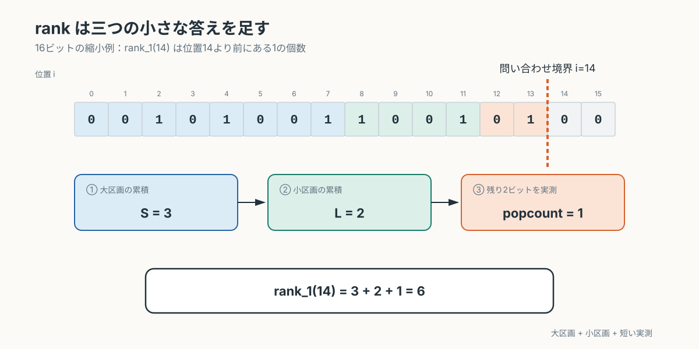
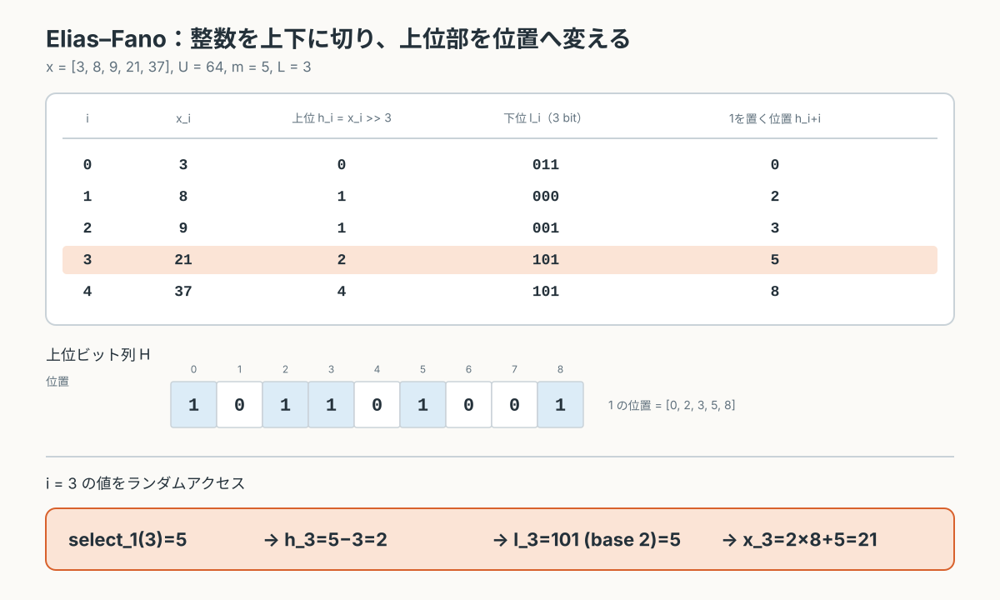
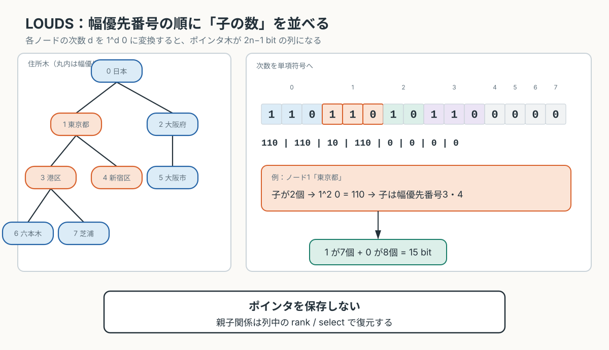
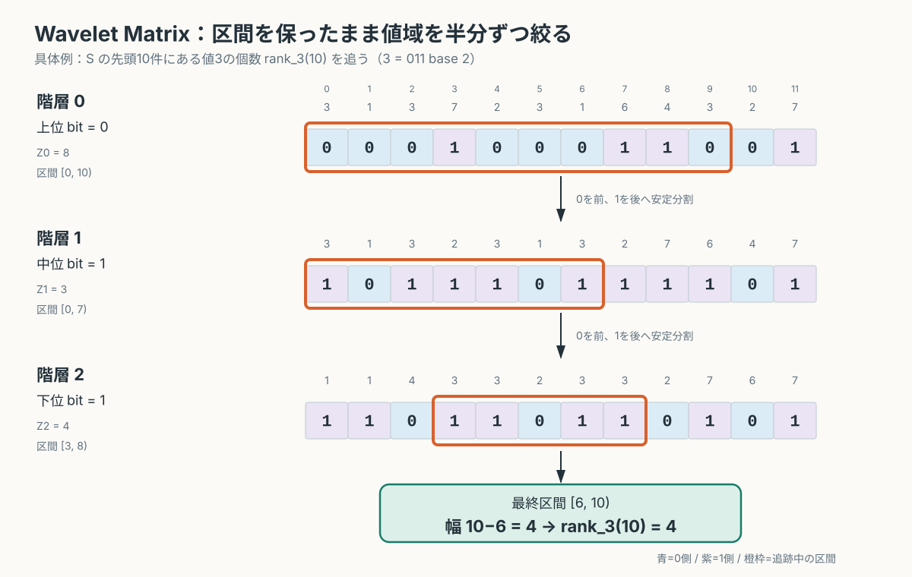
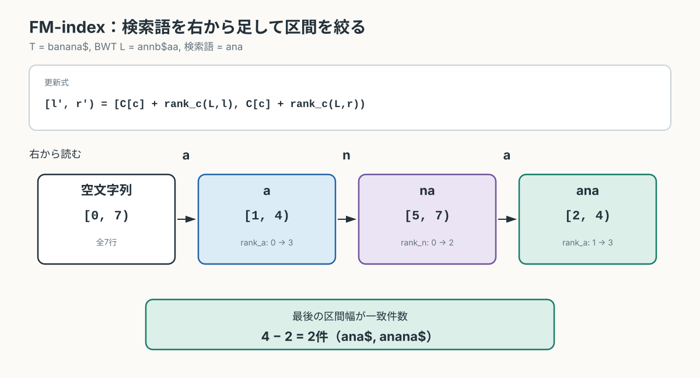
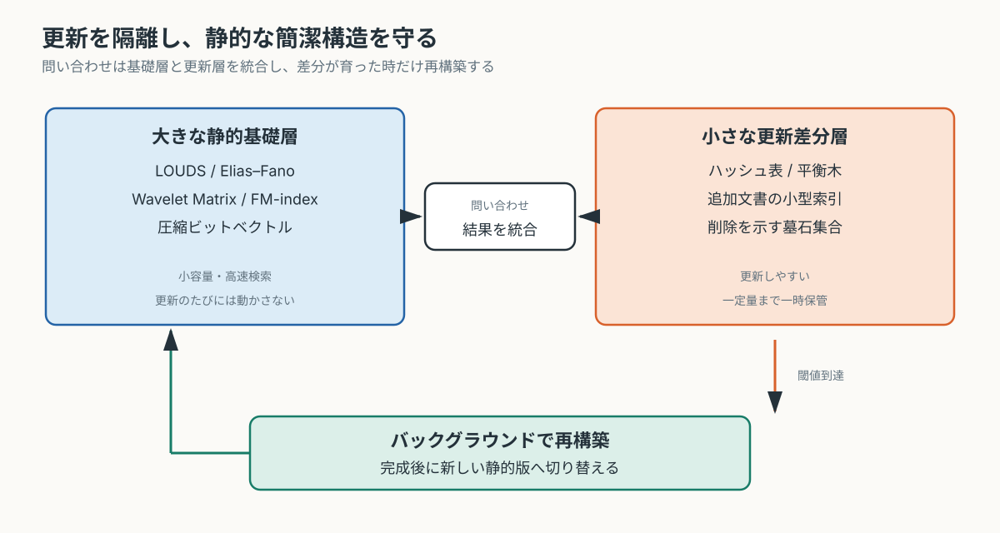

# やる夫が1ビットも無駄にできないようです ── 簡潔データ構造を再発見する

---
## 登場人物

**やる夫**：ソフトウェア開発者。普通の配列、ハッシュテーブル、ポインタ木を使えば大抵の問題は解けると思っている。

**やらない夫**：システム設計者。

**できる子**：アルゴリズム担当。必要な事実だけを短く述べる。

**できる夫**：性能評価担当。理論上の優劣と実機上の優劣が一致しないことを面白がる。

**ビットくん**：全幕を通じて使い回す計測器。現在の使用量、予算、超過率を読み上げる。

---
## 第1幕　512MBしかない

---
### 1-1 ポインタを買いすぎた男

**やる夫**：
全国防災情報検索システムの設計を任されたお！
道路、避難所、給水所、病院、住所、自治体、防災マニュアルを全部入れて、災害時にはネットワークなしでも検索できるようにするんだお！
やる夫の技術力で国民を救うお！！

**やらない夫**：
実行環境を確認したか？

**やる夫**：
もちろんだお。
消防車、市役所、避難所に置かれる小型端末で、使用可能メモリは512MB。
ネットワークは切断される可能性があるから、データは端末内に全部置くお。
検索は50ms以内だお。

**やらない夫**：
データ件数は？

**やる夫**：
地点IDが約1億件。
住所は都道府県、市区町村、町域、番地の木構造。
地点ごとに施設種別、自治体コード、収容人数などの属性があるお。
さらに地名、施設名、防災マニュアルの全文検索も必要だお。

**やらない夫**：
どう実装した？

**やる夫**：
住所はオブジェクトの木だお。
各ノードに親、最初の子、次の兄弟へのポインタを持たせたお。
施設はオブジェクト配列。
施設種別ごとにハッシュセットも作ったお。
全文検索は転置インデックス（inverted index）だお。
王道中の王道だお！

**やらない夫**：
起動してみろ。

**やる夫**：
起動するお！
……。
……。
端末が再起動したお。

**やらない夫**：
メモリ不足だな。

**やる夫**：
そんなはずないお！
施設種別は1バイト、自治体コードは4バイト、収容人数は4バイト程度だお。
1件10バイトとしても1億件で1GBくらい……。
あっ、もう512MBを超えてるお。

**やらない夫**：
しかも、その計算にはオブジェクトヘッダ、アラインメント（alignment）、参照、配列管理領域、ハッシュテーブルの空き領域が含まれていない。

**やる夫**：
じゃあオブジェクトをやめて構造体配列にするお！
ポインタも32ビットにするお！
これで半分くらいになるお！

**やらない夫**：
1件につき8バイト削れたとする。
1億件では何バイトだ？

**やる夫**：
$$
10^8\times8=8\times10^8\text{ byte}
$$
だから800MB……。
8バイトという小さな無駄だけで、端末1台分を超えるお。

**やらない夫**：
小規模なシステムでは、1件あたり数十バイトの差は誤差に見える。
1億件では設計そのものになる。

**やる夫**：
だったらメモリを4GBに増やせばいいお。
最近のスマートフォンなら普通だお。

**やらない夫**：
端末は数万台配備される。
消費電力、調達価格、耐久性、交換部品の供給期間にも制約がある。
災害現場で動くシステムを、開発者の都合だけで高性能機に置き換えることはできない。

**やる夫**：
ぐぬぬ……。
でも512MBでは無理だお。
1億件ある時点で、1件あたり約5バイトしか使えないお。

**やらない夫**：
正確には、

$$
512\text{MiB}=512\times2^{20}\text{ byte}
$$

だから、1億件だけで割れば1件あたり約5.37バイトだ。
しかし住所木と全文索引も同じ領域に置く。

**やる夫**：
実際には1件あたり2、3バイトくらいしか使えないお！？
施設種別だけならともかく、検索用の索引なんて置けないお！

**やらない夫**：
そこで最初の問いだ。
お前のデータは、本当に1件あたり何バイトの情報を持っている？

**やる夫**：
何バイトって、構造体のサイズのことじゃないのかお？

**やらない夫**：
それは実装が要求する容量だ。
俺が聞いているのは、そのデータを他の可能なデータと区別するために、本質的に何ビット必要かということだ。

**やる夫**：
同じ話に聞こえるお。

**やらない夫**：
避難所かどうかを表す値を考えろ。
可能な値はいくつある？

**やる夫**：
避難所であるか、ないかの2通りだお。

**やらない夫**：
2通りを区別するのに必要な情報量は？

**やる夫**：
1ビットだお。

**やらない夫**：
お前の実装では？

**やる夫**：
真偽値を1バイトで持ってるお。
言語によってはアラインメントでもっと使うお。

**やらない夫**：
1ビットの情報を表すために、少なくとも8ビット払っている。

**やる夫**：
でもCPUは1ビット単位では扱いにくいお。
1バイトで持つのが普通だお。

**やらない夫**：
その普通を1億回繰り返した結果が、さっきの再起動だ。

**やる夫**：
……。
ビットくんを作るお。
データ構造を登録したら、総容量、1要素あたりのビット数、理論上必要なビット数を表示させるお。

**やらない夫**：
いいだろう。
名前は？

**やる夫**：
ビットくんだお！
メモリを食う実装を入れると、針が赤い領域に飛び込むお！

**やらない夫**：
まず現在の実装を入れてみろ。

**やる夫**：
住所木、施設オブジェクト、ハッシュ表、転置インデックス……入力完了だお。

**ビットくん**：
推定使用量、18.7GB。
予算超過率、3652%。
起動可能性、なし。

**やる夫**：
機械にまで断言されたお……。

---
### 1-2 情報量の値札

**やらない夫**：
16個の地点だけが並ぶ小さな市を考えよう。
これをやる市と呼ぶ。

**やる夫**：
やる夫の市だお！
将来は人口1000万人の大都市になるお！

**やらない夫**：
今は16地点しかない。
各地点が避難所かどうかを、ビット列（bit string）で表せ。

**やる夫**：
例えばこうだお。

$$
B=0010100110010100
$$

1なら避難所、0ならそれ以外だお。

**やらない夫**：
長さ16の任意のビット列は何通りある？

**やる夫**：
各位置に0か1が入るから、

$$
2^{16}
$$

通りだお。

**やらない夫**：
それを区別するには16ビット必要だ。
したがって、どんなビット列でも許されるなら16ビットは情報理論的最小値（information-theoretic minimum）だ。

**やる夫**：
つまり1地点1ビットだお。
ここまでは分かるお。

**やらない夫**：
では、避難所が必ず5個だけだと分かっている場合は？

**やる夫**：
1の位置を5個選ぶから、

$$
\binom{16}{5}
$$

通りだお。

**やらない夫**：
何ビットあれば区別できる？

**やる夫**：
$$
\log_2\binom{16}{5}
$$
だお。
$\binom{16}{5}=4368$ だから、約12.09ビット。
端数を考えれば固定長では13ビット必要だお。

**やらない夫**：
任意の16ビット列として保存すれば16ビット。
1が5個だという制約を利用すれば、理論上は約12.09ビットで表せる。

**やる夫**：
たった4ビットくらいの差だお。

**やらない夫**：
1億地点で、避難所が100万件しかない場合を考えろ。

**やる夫**：
候補数は

$$
\binom{10^8}{10^6}
$$

だお。
必要量は

$$
\log_2\binom{10^8}{10^6}
$$

ビット……。
直接は計算できないお。

**やらない夫**：
比率を $p=m/n$ とすると、0次エントロピー（zero-order entropy）を使っておおよそ

$$
\log_2\binom{n}{m}\approx nH_0(p)
$$

と見積もれる。

$$
H_0(p)=-p\log_2p-(1-p)\log_2(1-p)
$$

だ。

**やる夫**：
$p=0.01$ だから、

$$
H_0(0.01)\approx0.0808
$$

くらいだお。
すると約808万ビット、つまり約1MBだお！

**やらない夫**：
長さ1億の普通のビット列なら約12.5MBだ。

**やる夫**：
避難所の位置集合には、本質的には約1MB分の情報しかないのに、普通のビット列だと12.5MB払うのかお。
1バイト配列なら100MBだお。
実装によって100倍近い差になるお！

**やらない夫**：
ただし小さく保存するだけでは検索システムにならない。
圧縮ファイルにして、検索のたびに全部展開するなら容量は小さくても遅い。

**やる夫**：
じゃあ必要なのは、圧縮したまま検索できる構造だお。

**やらない夫**：
用語を分けよう。
単に型やポインタを減らしたものを、小型化した実装と呼ぶ。
データの偏りや繰り返しを利用して小さくしたものを、圧縮データ構造（compressed data structure）と呼ぶ。
情報理論的下限（information-theoretic lower bound）に近い容量を使いながら、必要な演算を高速に実行するものを、簡潔データ構造（succinct data structure）と呼ぶ。

**やる夫**：
簡潔というのは、ソースコードが短いという意味じゃないのかお。

**やらない夫**：
むしろ実装は長くなることが多い。

**やる夫**：
名前に反して複雑だお！

**やらない夫**：
典型的には、長さ $n$ の対象を本体の理論下限に近い容量と、

$$
o(n)
$$

ビットの補助索引で表す。
$o(n)$ は、$n$ が大きくなるほど $n$ に対する比率が0へ近づく量だ。

**やる夫**：
本体と同じ大きさの索引を置いたら駄目なのかお。

**やらない夫**：
検索を速くするために本体以上の索引を置けば、今回の制約では意味がない。
索引が十分小さく、それでも検索が速いことが重要だ。

**やる夫**：
じゃあ目標はこうだお。

$$
\text{使用容量} = \text{情報理論的下限} + o(n)
$$

しかも検索を毎回展開せずに行うお。

**やらない夫**：
そのために、検索を少数の基本演算へ分解する。

**やる夫**：
何を用意すればいいんだお。

**やらない夫**：
3枚のカードを作れ。

**やる夫**：
学習用の演算カードだお！
1枚目は、

$$
\operatorname{access}(i)
$$

位置 $i$ の値を返すアクセス（access）だお。

2枚目は、

$$
\operatorname{rank}_c(i)
$$

位置 $i$ より前に値 $c$ が何個あるかを返すランク（rank）だお。

3枚目は、

$$
\operatorname{select}_c(k)
$$

$k$ 番目の値 $c$ がどこにあるかを返すセレクト（select）だお。

**やらない夫**：
今後、木、数値列、全文索引を作るたびに、その操作を3枚のカードへ分解する。

**やる夫**：
たった3種類で全国防災システムが作れるとは思えないお。

**やらない夫**：
その疑いは残しておけ。
次は、最も単純な質問から始めよう。
現在地より前に、避難所はいくつある？

---
## 第2幕　数えたいが、数え表は置けない

---
### 2-1 先頭から数えるか、全部記録するか

**やらない夫**：
やる市の避難所列をもう一度使う。

$$
B=0010100110010100
$$

位置は0から数える。
$\operatorname{rank}_1(10)$ はいくつだ？

**やる夫**：
位置10より前だから、対象は

$$
0010100110
$$

だお。
1は4個だから、

$$
\operatorname{rank}_1(10)=4
$$

だお。

**やらない夫**：
実装は？

**やる夫**：
先頭から位置10まで走査して数えるお。
計算量は $O(i)$、最悪 $O(n)$ だお。

**やらない夫**：
1億件の末尾近くで、1秒に数千回問い合わせが来ても使えるか？

**やる夫**：
無理だお。
では累積和（prefix sum）を作るお！

$$
R[i]=\sum_{j=0}^{i-1}B[j]
$$

としておけば、

$$
\operatorname{rank}_1(i)=R[i]
$$

だお。
完全な $O(1)$ だお！

**やらない夫**：
$R[i]$ の最大値は？

**やる夫**：
最大で $n$ だから、各値に

$$
\lceil\log_2(n+1)\rceil
$$

ビット必要だお。

**やらない夫**：
$n=10^8$ なら？

**やる夫**：
27ビット必要だお。
実装上は32ビット整数を使うから、

$$
10^8\times4\text{ byte}=400\text{MB}
$$

だお。
避難所を表す本体は12.5MBなのに、数えるための表が400MB……。

……メーターに入れる前に自分で言うお。
これは索引じゃないお。**索引のほうが本体だお**。
本体を32倍のもので包んで「高速化しました」と言うのは、
辞書を引くために辞書の32倍ある付箋を貼るのと同じだお。
1ビットの列を作った意味が消し飛んでるお。

**ビットくん**：
ビット列、12.5MB。
累積和表、400MB。
その他データの残予算、99.5MB。
警告、索引が本体の32倍です。

**やる夫**：
先に言ったから今日は刺さらないお。
じゃあ100件ごとに累積値を置くお。
索引は100分の1になって4MB。
問い合わせ時には、直前の記録位置から最大99ビットだけ数えればいいお。

**やらない夫**：
悪くない。
99ビットをどう数える？

**やる夫**：
1ビットずつ確認するお。

**やらない夫**：
CPUは通常、64ビット程度を一度に読み込める。
1ビットずつ分岐する必要があるか？

**やる夫**：
64ビット整数として読み、1の個数を数える人口カウント（population count, `popcount`）命令を使えるお。
最大2ワードくらいで済むお。

**やらない夫**：
では100件間隔で十分か？

**やる夫**：
索引4MBなら許容できそうだお。
これで完成だお！

**やらない夫**：
$n$ を大きくしたとき、索引は $n/100$ 個ある。
各索引値は $\log n$ ビット必要だ。
索引容量の次数は？

**やる夫**：
$$
O\left(\frac{n}{100}\log n\right)=O(n\log n)
$$

だお。
定数100で小さくしても、漸近的には本体の $n$ ビットより重くなるお。

**やらない夫**：
実用上は固定長の標本でも成立する場合がある。
だが、簡潔構造として $n+o(n)$ ビットを目指すなら、間隔も $n$ に応じて選ぶ必要がある。

**やる夫**：
索引の数を減らすと、数える残りが長くなるお。
速度と容量の綱引きだお。

**やらない夫**：
一段の標本だけで解こうとするからだ。
長い区間用の大きな標本と、その中の短い区間用の小さな標本を分けたらどうなる？

**やる夫**：
二階建てにするのかお。

**やらない夫**：
例えばスーパーブロック（superblock）長を

$$
L=(\log_2n)^2
$$

程度にする。
各スーパーブロック先頭には、列全体の先頭からの累積値を置く。

**やる夫**：
スーパーブロック数は

$$
\frac{n}{(\log n)^2}
$$

個。
各値は $\log n$ ビットだから、合計は

$$
O\left(\frac{n}{\log n}\right)
$$

ビット。
これは $o(n)$ だお！

**やらない夫**：
スーパーブロック内部を、長さ

$$
l=\frac{1}{2}\log_2n
$$

程度のブロックへ分ける。
ブロック先頭には、そのスーパーブロック内での累積値を置く。

**やる夫**：
ブロック内累積値は最大でも $(\log n)^2$ だから、必要ビット数は

$$
O(\log\log n)
$$

だお。
ブロック数は約

$$
\frac{2n}{\log n}
$$

だから、全体は

$$
O\left(\frac{n\log\log n}{\log n}\right)=o(n)
$$

ビットになるお。

**やらない夫**：
残るのは、ブロック内の最大 $\frac12\log n$ ビットだ。

**やる夫**：
それなら整数1語に入るお。
`popcount` で数えられるお。

**やらない夫**：
理論モデルでは、短いビット列ごとの答えをあらかじめ表にしてもよい。
長さが $\frac12\log n$ なら、可能なパターン数は

$$
2^{\frac12\log n}=\sqrt n
$$

だ。
表全体も $o(n)$ に抑えられる。

**やる夫**：
問い合わせは、

$$
\operatorname{rank}_1(i) = S[\operatorname{super}(i)] + L[\operatorname{block}(i)] + \operatorname{popcount}(\operatorname{remainder}(i))
$$

だお。

[](figs/rank-two-level.svg)

図2-1：縮小例の `rank_1(14)=3+2+1=6`。大区画の累積値、小区画の累積値、残りの `popcount` だけを足す（タップ／クリックで原寸表示）。

**やらない夫**：
各項は定数回の配列参照とワード演算で求まる。

**やる夫**：
つまり、すべての位置の答えを記録しなくても、
大きな区画の標識、小さな区画の標識、最後の短い道の実測だけで現在位置までの避難所数が分かるお。

**やらない夫**：
それが `rank` の基本構造だ。

**やる夫**：
全国を巨大なスーパーブロック、市区町村をブロック、最後の街区を `popcount` で数える感じだお。
ビットくんに入れるお。

**ビットくん**：
本体、$n$ ビット。
補助索引、$o(n)$ ビット。
`rank`、定数時間。
判定、予算内。

**やる夫**：
初めて緑色になったお！！

---
### 2-2 100万番目の避難所はどこか

**やらない夫**：
次の問い合わせだ。
100万番目の避難所はどこにある？

**やる夫**：
これは1の位置を別配列に保存すればいいお。
$P[k]$ を $k$ 番目の1の位置にするお。

**やらない夫**：
要素数を $m$、全長を $n$ とする。
容量は？

**やる夫**：
各位置に $\log n$ ビット必要だから、

$$
m\log_2n
$$

ビットだお。
避難所が100万件、$n=10^8$ なら、27Mビットで約3.4MB。
それほど大きくないお。

**やらない夫**：
1が半分あるビット列なら？

**やる夫**：
$m=5\times10^7$ だから約169MB。
本体12.5MBよりはるかに大きいお。

**やらない夫**：
データの密度によって最適な方法が変わる。
位置配列を持たず、`rank` だけで求める方法は？

**やる夫**：
位置 $i$ に対して $\operatorname{rank}_1(i)$ は単調増加するお。
だから二分探索（binary search）で、rankが $k$ になる境界を探せるお。

**やらない夫**：
計算量は？

**やる夫**：
`rank` が $O(1)$ なら、

$$
O(\log n)
$$

だお。

**やらない夫**：
それで要件を満たすなら、実用上は十分なこともある。
だが簡潔な `select` を定数時間に近づけるにはどうする？

**やる夫**：
一定個数の1ごとに、その位置を標本として保存するお。
例えば1024個の1ごとに位置を置けば、求めたい1の直前の標本まではすぐ飛べるお。

**やらない夫**：
標本間の区間に0が非常に多い場合は？

**やる夫**：
1024個の1を探すために、何百万ビットも走査する可能性があるお。

**やらない夫**：
逆に1が密集している場合は？

**やる夫**：
短い区間に1024個入るから、区間全体を小さな表やワード演算で処理できそうだお。

**やらない夫**：
そこで区間を、疎な区間と密な区間に分ける。
疎な区間は、含まれる1の位置を明示的に保存しても、区間自体が長いため全体容量への影響を抑えられる。
密な区間は短いため、さらに小さく分割して表引きできる。

**やる夫**：
1つの方法ですべて処理せず、密度で処理を変えるのかお。

**やらない夫**：
簡潔データ構造ではよく現れる考え方だ。
例外的な区間は個別に扱い、典型的な区間を小さな索引で処理する。

**やる夫**：
やる市のビット列で確認するお。

$$
B=0010100110010100
$$

1の位置は、

$$
2,4,7,8,11,13
$$

だお。

だから0始まりで

$$
\operatorname{select}_1(0)=2
$$

$$
\operatorname{select}_1(3)=8
$$

だお。

**やらない夫**：
`rank` と `select` の関係を式にしろ。

**やる夫**：
$k$ 番目の1の位置を $i$ とすると、

$$
\operatorname{rank}_1(i)=k
$$

で、

$$
B[i]=1
$$

だお。
定義を1始まりにする流儀もあるから、実装では境界条件を統一しないと危険だお。

**やらない夫**：
そこは重要だ。
`rank(i)` が $[0,i)$ を数えるのか $[0,i]$ を数えるのか、`select(k)` の $k$ が0始まりか1始まりかで、式が1ずれる。

**やる夫**：
1ビットを削る話なのに、1のずれで全部壊れるお。

**やらない夫**：
3枚の演算カードを並べろ。

**やる夫**：
`access(i)`、`rank_c(i)`、`select_c(k)`。
ビット列なら0と1だけだから、

$$
\operatorname{rank}_0(i)=i-\operatorname{rank}_1(i)
$$

だお。
0用の索引を別に持つ必要はないお。

**やらない夫**：
その3演算が揃うと、ビット列は単なる圧縮表現ではなく、集合や写像を表現する基盤になる。

**やる夫**：
まだ集合は分かるけど、木や文章まで作れるとは思えないお。

**やらない夫**：
次は、増加する整数列をビット列へ変える。
転置インデックス、時刻列、地理IDのすべてに使える。

---
## 第3幕　増加列を整数のまま持たない

---
### 3-1 差分にすれば終わりではない

**やらない夫**：
給水所の地点IDが、昇順で並んでいる。

$$
3,\ 8,\ 9,\ 21,\ 37
$$

全体の地点IDは $[0,64)$ としよう。
どう保存する？

**やる夫**：
64ビット整数配列だお。
5件だから320ビットだお。

**やらない夫**：
値は63以下だ。

**やる夫**：
では6ビット整数で十分だお。
合計30ビットだお。

**やらない夫**：
単調増加しているという情報は利用しているか？

**やる夫**：
してないお。
差分にするお！

$$
3,\ 5,\ 1,\ 12,\ 16
$$

小さい数が多くなったお。
可変長整数（variable-length integer）で保存すれば小さくなるお。

**やらない夫**：
4番目の値だけを読みたいときは？

**やる夫**：
差分を先頭から4個足すお。

**やらない夫**：
100万番目なら？

**やる夫**：
100万個復号して足すお。
遅すぎるお。

**やらない夫**：
途中の復号開始位置を索引に保存すれば？

**やる夫**：
例えば1024件ごとに、元の値と圧縮列中のバイト位置を置くお。
アクセスは最大1023件の復号だお。

**やらない夫**：
容量と速度の妥協としては実用的だ。
だが、単調増加性を使って、より直接的にアクセスする方法を考えよう。
値域を $U$、要素数を $m$ とする。
各値を上位部と下位部に分けたらどうなる？

**やる夫**：
2進数を途中で切るのかお。
下位 $L$ ビットをそのまま保存し、残りを上位部にするお。

**やらない夫**：
$L$ はどう選ぶ？

**やる夫**：
値が $U$ 通りで、要素が $m$ 個なら、平均間隔は $U/m$ だお。
だから、

$$
L=\left\lfloor\log_2\frac{U}{m}\right\rfloor
$$

にするとよさそうだお。

**やらない夫**：
今回、$U=64$、$m=5$ だ。

**やる夫**：
$$
\frac{U}{m}=12.8
$$

だから、

$$
L=\lfloor\log_2 12.8\rfloor=3
$$

だお。
各値を上位部と下位3ビットに分けるお。

$$
3=(0,3)
$$

$$
8=(1,0)
$$

$$
9=(1,1)
$$

$$
21=(2,5)
$$

$$
37=(4,5)
$$

下位部は、

$$
3,\ 0,\ 1,\ 5,\ 5
$$

で、各3ビット、合計15ビットだお。

**やらない夫**：
上位部は、

$$
0,\ 1,\ 1,\ 2,\ 4
$$

だ。
これも単調増加している。

**やる夫**：
上位部を普通に保存すると、まだ整数列だお。
どうやってビット列にするんだお。

**やらない夫**：
各上位値 $h_i$ について、位置

$$
h_i+i
$$

に1を置け。

**やる夫**：
$i=0,1,2,3,4$ だから、1の位置は、

$$
0,\ 2,\ 3,\ 5,\ 8
$$

だお。
長さは最大位置8までだから、ビット列は、

$$
101101001
$$

だお。

**やらない夫**：
そこから $i$ 番目の上位値を復元するには？

**やる夫**：
$i$ 番目の1の位置が $h_i+i$ だから、

$$
h_i=\operatorname{select}_1(i)-i
$$

だお！

**やらない夫**：
元の値は？

**やる夫**：
下位部を $\ell_i$ とすると、

$$
x_i=(h_i\ll L)\mathbin{\vert}\ell_i
$$

だお。
例えば4番目、0始まりで $i=3$ なら、

$$
\operatorname{select}_1(3)=5
$$

だから、

$$
h_3=5-3=2
$$

下位部は5なので、

$$
x_3=2\times2^3+5=21
$$

復元できたお！

[](figs/elias-fano-transform.svg)

図3-1：上位値を `hᵢ+i` 番目の1へ変換すると、`select_1(3)=5` から `x_3=21` を復元できる（タップ／クリックで原寸表示）。

**やらない夫**：
これがElias–Fano表現（Elias–Fano representation）の中心だ。

**やる夫**：
整数列のランダムアクセス（random access）が、ビット列の `select` に変わったお。

---
### 3-2 疎な集合のための設計

**やる夫**：
容量を計算するお。
下位部は $mL$ ビット。
上位ビット列の長さは、おおよそ

$$
m+\frac{U}{2^L}
$$

だお。

$2^L$ は $U/m$ 程度だから、

$$
\frac{U}{2^L}
$$

も $m$ 程度。
したがって上位部は約 $2m$ ビットだお。

合計は、

$$
m\left(\log_2\frac{U}{m}+2\right)
$$

ビット程度だお。

**やらない夫**：
64ビット整数配列と比較しろ。

**やる夫**：
要素数が100万、値域が $2^{40}$ だとするお。
普通の64ビット配列なら64Mビット、つまり8MB。

Elias–Fanoでは、

$$
\log_2\frac{2^{40}}{10^6}
$$

だお。
$10^6$ は約 $2^{19.93}$ だから約20.07ビット。
2ビットを加えて1要素約22ビット。
合計約2.75MBだお。

**やらない夫**：
差分可変長符号と違い、$i$ 番目へのアクセスに先頭からの復号は不要だ。
また、前者検索（predecessor search）や後者検索（successor search）にも利用できる。

**やる夫**：
転置インデックスの文書ID列に向いてるお。
語句ごとに文書IDは昇順になるお。

**やらない夫**：
他には？

**やる夫**：
イベントログの時刻。
地理メッシュID。
グラフの隣接先。
疎なビット集合の1の位置。
ほとんど増加列なら使えそうだお。

**やらない夫**：
ただし、すべての整数列に向くわけではない。

**やる夫**：
値が単調でないと上位部の並びが壊れるお。
値域 $U$ が要素数 $m$ に近い、つまり密な列なら、普通のビットベクトル（bit vector）の方が自然かもしれないお。

**やらない夫**：
更新については？

**やる夫**：
途中へ値を挿入すると、後続の下位配列と上位ビット列を動かす必要があるお。
基本的には静的構造だお。

**やらない夫**：
最初の差分符号化案と比較しろ。

**やる夫**：
差分可変長符号は単純で、順番に全件読むなら強いお。
Elias–Fanoは、少し余分な構造を持つ代わりに、ランダムアクセスや位置検索ができるお。
小さいことだけでなく、必要な問い合わせによって選ぶべきだお。

**できる子**：
本番データで測定した。
給水所ID、1,240,381件。
64ビット配列、9.46MiB。
差分可変長、2.11MiB。
Elias–Fano、3.28MiB。

**やる夫**：
差分可変長の方が小さいお！
Elias–Fanoの負けだお！

**できる子**：
100万番目の取得時間。
64ビット配列、3ns。
差分可変長、先頭からの復号で4.8ms。
1024件間隔の索引付き差分、2.7μs。
Elias–Fano、41ns。

**やる夫**：
容量だけなら差分、アクセスならElias–Fanoだお。
用途を見ずに最小サイズだけ選ぶと危険だお。

**やらない夫**：
ビットくんに、容量だけでなく必要演算と応答時間を追加しろ。

**やる夫**：
項目を増やすお。

* 総容量
* 1要素あたりのビット数
* 理論下限
* `access`
* `rank`
* `select`
* 構築時間
* 更新可否

これで小さいだけの構造を崇拝せずに済むお。

**やらない夫**：
次は住所階層だ。
お前のポインタ木は、構造だけで予算を食い尽くしている。

**やる夫**：
木からポインタを抜いたら、どうやって子へ移動するんだお。

**やらない夫**：
木の形そのものを、ビット列として並べる。

---
## 第4幕　木からポインタを追放する

---
### 4-1 木の形は何ビットか

**やる夫**：
住所木のノードには、次の情報が必要だお。

* 親
* 最初の子
* 次の兄弟
* 名称
* 自治体コード

ポインタ3本なら、64ビット環境で24バイトだお。

**やらない夫**：
名称やコードを除き、木の形だけで24バイトか？

**やる夫**：
そうだお。
高速に移動するためには仕方ないお。

**やらない夫**：
$n$ ノードの順序付き木（ordered tree）は何種類ある？

**やる夫**：
カタラン数（Catalan number）が出てきそうだお。

$$
C_{n-1}=\frac{1}{n}\binom{2n-2}{n-1}
$$

だお。

**やらない夫**：
その対数は漸近的に？

**やる夫**：
カタラン数はおおよそ

$$
C_m\sim\frac{4^m}{m^{3/2}\sqrt\pi}
$$

だお。いま欲しいのは $m=n-1$ のときだから、そのまま代入するお。

$$
\log_2C_{n-1}\approx2(n-1)-\frac32\log_2(n-1)+O(1)=2n-\frac32\log_2n+O(1)
$$

添字を1ずらしても、$2n$ の項は $-2$ だけ動いて $O(1)$ に吸われるお。
$\log_2(n-1)$ と $\log_2 n$ の差も $O(1/n)$ で消えるお。
だから結論は変わらないお。
木の形を区別するには、1ノードあたり約2ビットしか要らないお！

**やらない夫**：
お前の実装は1ノード24バイト、つまり192ビットだ。

**やる夫**：
理論下限の約100倍だお。
でも2ビットでは親や子へ移動できないお。

**やらない夫**：
まず木の形を2ビット程度で表し、その上に小さな索引を置く。
16マスのやる市に住所木を作れ。

**やる夫**：
こうするお。

```text
日本
├─ 東京都
│  ├─ 港区
│  │  ├─ 六本木
│  │  └─ 芝浦
│  └─ 新宿区
└─ 大阪府
   └─ 大阪市
```

ノード数は9だお。

**やらない夫**：
幅優先順（level order）に番号をつけろ。

**やる夫**：
0 日本
1 東京都
2 大阪府
3 港区
4 新宿区
5 大阪市
6 六本木
7 芝浦

……8ノードだったお。
やる夫は数も数えられないお。

**やらない夫**：
各ノードについて、子の数を $d$ とし、$1^d0$ を書け。

**やる夫**：
日本は子が2だから `110`。
東京都も2だから `110`。
大阪府は1だから `10`。
港区は2だから `110`。
新宿区は0だから `0`。
大阪市も0で `0`。
六本木も0。
芝浦も0。

連結すると、

$$
11011010110000
$$

だお。

**やらない夫**：
1の数と0の数は？

**やる夫**：
子の総数は辺の数と同じで $n-1=7$。
だから1が7個。
各ノードにつき終端の0が1個だから0が8個。
合計15ビット、つまり

$$
2n-1
$$

ビットだお。

**やらない夫**：
これがレベル順単項次数列（Level-Order Unary Degree Sequence, LOUDS）だ。
幅優先順の各ノードの次数を単項符号（unary code）で並べている。

[](figs/louds-encoding.svg)

図4-1：幅優先番号を固定し、各ノードの子の数を `1ᵈ0` で連結すると、8ノードの木が15ビットになる（タップ／クリックで原寸表示）。

**やる夫**：
木が15ビットになったお。
でも、どの0がどのノードなのか、どの1がどの子なのか分からないお。

**やらない夫**：
0をノードの終端と考える。
$v$ 番目のノードに対応する0の位置は？

**やる夫**：
0始まりなら、

$$
p=\operatorname{select}_0(v)
$$

だお。

**やらない夫**：
そのノードの子を表す1の区間は、直前の0の次から $p$ の直前までだ。

**やる夫**：
子の数は、その区間の1の数だから `rank` で求められるお。
そして、その1が全体で何番目の1か分かれば、幅優先順で対応する子ノード番号が決まるお。

**やらない夫**：
実装流儀によって先頭に仮想ビットを置くことがあり、式の定数項は変わる。
重要なのは、親子関係を `rank` と `select` に帰着できることだ。

**やる夫**：
ポインタを保存せず、ビット列中で何番目の0か、何番目の1かを数えれば移動できるお。

**やらない夫**：
ポインタは関係そのものではない。
関係先のメモリアドレスを直接記録した冗長な案内板だ。
ノード順序が固定なら、関係を列の位置から計算できる。

---
### 4-2 括弧の中に部分木を閉じ込める

**やる夫**：
LOUDSは幅優先だから、同じ階層のノードが近くに並ぶお。
住所候補を階層順に表示するトライ（trie）には向きそうだお。

**やらない夫**：
部分木全体を列挙したい場合はどうだ？

**やる夫**：
幅優先だと、港区以下の六本木と芝浦が、他の地区のノードと混ざる可能性があるお。
部分木が連続区間にならないお。

**やらない夫**：
深さ優先順（depth-first order）で木を符号化しよう。
ノードへ入るとき `(`、出るとき `)` を書け。

**やる夫**：
さっきの木なら、日本へ入って `(`。
東京都へ入って `(`。
港区へ入って `(`。
六本木で `()`。
芝浦で `()`。
港区から出る。
新宿区で `()`。
東京都から出る。
大阪府へ……。
かなり括弧だらけになるお。

**やらない夫**：
全体では、各ノードにつき開き括弧と閉じ括弧が1つずつだ。

**やる夫**：
$n$ ノードならちょうど $2n$ ビットで表せるお。
`(` を1、`)` を0にすればビット列だお。

**やらない夫**：
ある位置 $i$ までの開き括弧数から閉じ括弧数を引いた値を定義しろ。

**やる夫**：
$$
\operatorname{excess}(i) = \operatorname{rank}_1(i)-\operatorname{rank}_0(i)
$$

だお。
これは現在の深さに対応するお。

**やらない夫**：
あるノードの開き括弧に対応する閉じ括弧は、どう特徴づけられる？

**やる夫**：
その開き括弧の直前の `excess` と同じ深さへ、初めて戻る位置だお。
つまり括弧列上の探索問題になるお。

**やらない夫**：
親は？

**やる夫**：
現在の深さより1小さい位置に対応する直前の開き括弧だお。

**やらない夫**：
部分木サイズは？

**やる夫**：
開き括弧位置を $p$、対応する閉じ括弧位置を $q$ とすると、その区間には部分木の全括弧が入るお。
部分木ノード数は、

$$
\frac{q-p+1}{2}
$$

だお。

**やらない夫**：
部分木が連続区間として表現されるのが、深さ優先括弧列の利点だ。

**やる夫**：
でも対応括弧を探すために1ビットずつ進めば $O(n)$ だお。

**やらない夫**：
`excess` に対する区間最小値（range minimum）や、指定値へ到達する位置を求めるための補助索引を置く。
ブロック分割、表引き、木状の最小値情報を組み合わせれば、小さな追加容量で高速化できる。

**やる夫**：
また同じ構図だお。
すべての答えを保存する代わりに、大区画、小区画、短い残りを使うお。

**やらない夫**：
簡潔構造の基本設計は繰り返し現れる。

**やる夫**：
LOUDSと括弧列を使い分けるお。

* LOUDSは幅優先で、同階層の探索やトライに向く
* 平衡括弧表現（Balanced Parentheses）は深さ優先で、祖先や部分木操作に向く

だお。

**できる子**：
住所木、ノード数18,420,116。
旧実装、ポインタとヘッダのみで702MiB。
LOUDS本体、約4.4MiB。
`rank/select` 索引込み、約5.1MiB。
名称ID配列を含む全体、72MiB。

**やる夫**：
木構造だけなら700MBから5MBになったお！？
99%以上消えたお！

**できる子**：
消えたのは情報ではない。
メモリアドレスの重複記録。

**やる夫**：
分かってるお。
でも700MBが5MBになると、消えたと言いたくなるお。

**やらない夫**：
名称文字列そのものは別の問題として残る。
次は施設属性の整数列だ。
値ごとの件数、区間内の順位、指定値以下の個数を、同じ構造で答えたい。

---
## 第5幕　数値列を縦に切る

---
### 5-1 種別ごとのビット列が増殖する

**やらない夫**：
施設種別列を考える。

$$
S=[3,1,3,7,2,3,1,6,4,3,2,7]
$$

必要な問い合わせを挙げろ。

**やる夫**：
まず、

$$
\operatorname{access}(i)=S[i]
$$

だお。

位置 $i$ より前に種別 $c$ が何件あるか、

$$
\operatorname{rank}_c(i)
$$

も必要だお。

区間 $[l,r)$ に種別 $c$ が何件あるかは、

$$
\operatorname{rank}_c(r)-\operatorname{rank}_c(l)
$$

だお。

さらに区間内で収容人数が小さい方から $k$ 番目とか、指定人数以下の施設数も求めたいお。

**やらない夫**：
最初の案は？

**やる夫**：
値ごとにビットベクトルを作るお。
種別1の位置だけ1、種別2の位置だけ1、という形だお。
各ビットベクトルに `rank/select` を付ければ検索できるお。

値域を $\sigma$、列長を $n$ とすると、本体だけで $n\sigma$ ビット。
種別が8種類なら1要素8ビットで、元の値は3ビットで表せるから少し大きい程度……

……いや、待つお。今日はやる夫が先に潰すお。
この列に入れたいのは種別だけじゃないお。
**自治体コードも入れる** って、いま自分で言ったお。

自治体コードは数千種あるお。$\sigma=3000$ なら1要素3000ビットだお。
元の値は12ビットで足りるのに、250倍だお。
収容人数に至っては値域が数万で、
1億件×数万ビットなんて、512MBどころか地球上のメモリが足りないお。

しかも空の列が大量にできるお。
自治体コード3000種のうち、やる市の避難所に出てくるのはせいぜい数十種だお。
残り2900本以上は**全部0のビット列**を1億ビットずつ持つことになるお。

**やらない夫**：
今日は俺の出番がないな。
では、その $n\sigma$ をどう畳む。
値を2進数で見ろ。
$\sigma=8$ なら各値は3ビットで表せる。
最上位ビットだけを全要素について並べたらどうなる？

**やらない夫**：
値を2進数で見ろ。
$\sigma=8$ なら各値は3ビットで表せる。
最上位ビットだけを全要素について並べたらどうなる？

**やる夫**：
値0から3なら最上位ビット0、4から7なら1だお。
列 $S$ について最上位ビット列を作り、0側の値と1側の値に分けるお。

**やらない夫**：
その次は？

**やる夫**：
0側と1側のそれぞれで、次のビットを見るお。
値域を半分ずつ分ける二分木になるお。

**やらない夫**：
ウェーブレット木（Wavelet Tree）だ。

**やる夫**：
名前は波だけど、やっていることは値の二分探索木だお。

**やらない夫**：
各ノードに、そのノードへ来た値が左へ進むか右へ進むかを表すビットベクトルを置く。
各ビットベクトルには `rank` を持たせる。

**やる夫**：
元の区間 $[l,r)$ が、0側ではどの区間に移るかを計算するお。

$l$ より前の0の数は $\operatorname{rank}_0(l)$。
$r$ より前の0の数は $\operatorname{rank}_0(r)$。
だから、

$$
[l,r)
\longrightarrow
[\operatorname{rank}_0(l),\operatorname{rank}_0(r))
$$

だお。

1側なら、

$$
[l,r)
\longrightarrow
[\operatorname{rank}_1(l),\operatorname{rank}_1(r))
$$

だお。

**やらない夫**：
区間を保ったまま、値域を半分に絞れる。

**やる夫**：
指定値 $c$ のビットを上から追えば、区間内の $c$ の個数が求まるお。
`rank` の反復だけだお！

**やらない夫**：
区間内で $k$ 番目に小さい値は？

**やる夫**：
現在の区間で、0側へ行く要素数を数えるお。

$$
z=\operatorname{rank}_0(r)-\operatorname{rank}_0(l)
$$

$k<z$ なら0側。
そうでなければ1側へ進み、

$$
k\leftarrow k-z
$$

とするお。
これを各ビットで繰り返せば、値が決まるお。

**やらない夫**：
値の比較を、各階層の0の個数を数える問題へ変換した。

---
### 5-2 木を行列へ平らにする

**やる夫**：
Wavelet Treeをノードごとのオブジェクトで作ったお！
各ノードにビットベクトルと左右の子ポインタがあるお！

**やらない夫**：
何か忘れていないか？

**やる夫**：
……またポインタを増やしたお。

**できる子**：
測定結果。
理論上のビット列本体、286MiB。
ノードオブジェクト、ポインタ、アラインメント、41MiB。
検索時のL3キャッシュミス率、28%。

**やる夫**：
41MBなら昔の700MBよりは小さいお。
許してほしいお。

**できる子**：
50ms要件を満たさない。
範囲分位点検索、最大83ms。

**やる夫**：
容量には入ったのに遅いお！

**やらない夫**：
ポインタを追うたびに、離れたメモリ領域へ移動する。
演算回数が少なくても、キャッシュミスとメモリ待ちが増える。

**やる夫**：
では同じ階層のビット列を全部つなげるお。
最上位ビットを全要素分、次に第2ビットを並べるお。

**やらない夫**：
ウェーブレット行列（Wavelet Matrix）では、各階層で0の要素を前半、1の要素を後半へ安定的に並べ替える。
その階層の0の総数も記録する。

**やる夫**：
1側へ移るときは、0領域の開始位置を足す必要があるお。
階層 $d$ の0の総数を $Z_d$ とすると、1側の区間は、

$$
[l,r)
\longrightarrow
[
Z_d+\operatorname{rank}_1(l),
Z_d+\operatorname{rank}_1(r)
)
$$

だお。

0側はそのまま、

$$
[
\operatorname{rank}_0(l),
\operatorname{rank}_0(r)
)
$$

だお。

**やらない夫**：
各階層が1本の連続ビットベクトルになる。
ノードポインタは不要だ。

[](figs/wavelet-matrix-range.svg)

図5-1：値3のビット `011` に沿って区間を写すと、`[0,10) → [0,7) → [3,8) → [6,10)` となり、最後の幅4が答えになる（タップ／クリックで原寸表示）。

**やる夫**：
列長 $n$、値域 $\sigma$ なら階層数は、

$$
\lceil\log_2\sigma\rceil
$$

本体容量はおおよそ、

$$
n\lceil\log_2\sigma\rceil
$$

ビットだお。
元の固定長整数列と同程度だけど、範囲検索能力が付くお。

**やらない夫**：
さらに、各階層のビット列自体を圧縮することもできる。
ただし、それは後で扱う。

**やる夫**：
`access(i)` はどうするんだお。

**やらない夫**：
各階層で位置 $i$ のビットを読み、そのビットを値の一部として復元する。
0なら次の位置は $\operatorname{rank}_0(i)$。
1なら $Z_d+\operatorname{rank}_1(i)$ だ。

**やる夫**：
`select` は逆向きに階層を上がる必要があるお。
下の位置から `select_0` または `select_1` を使って元の位置へ戻すお。

**やらない夫**：
これで、3枚の演算カードが多値列にも拡張された。

**できる子**：
Wavelet Matrix版を測定した。
総容量、旧Wavelet Tree比で38MiB減少。
範囲分位点検索、最大21ms。
L3キャッシュミス率、9%。

**やる夫**：
ビット演算は増えているのに、速くなったお。

**やらない夫**：
データ構造の性能は、計算量だけでは決まらない。
現代のCPUでは、メモリアクセスの局所性（locality of reference）が支配的になることがある。

**やる夫**：
小さい構造はメモリに入るだけでなく、キャッシュにも入りやすいお。
簡潔化が高速化になる場合もあるんだお。

**やらない夫**：
ただし、常にそうなるとは限らない。
後で実測する。

**やる夫**：
1枚のビット行列から、`access`、値ごとの `rank`、
区間内の頻度・順位・分位点・最小最大まで全部出るお。
数値列を縦に切っただけで、これだけ引けるお。

**やらない夫**：
次は文字列だ。
10GBの文章から語句を探す。
お前の接尾辞配列（suffix array）は、それだけで80GB使う。

**やる夫**：
端末512MBの話をしていたはずなのに、桁が2つ違うお。

---
## 第6幕　全文を保存せず全文検索する

---
### 6-1 接尾辞を全部並べる代償

**やらない夫**：
玩具文字列として、

$$
T=\texttt{banana\$}
$$

を使う。
`$` は他のどの文字より小さく、文字列中に1回だけ現れる終端記号だ。

**やる夫**：
接尾辞を全部書くお。

```text
0 banana$
1 anana$
2 nana$
3 ana$
4 na$
5 a$
6 $
```

辞書順に並べると、

```text
6 $
5 a$
3 ana$
1 anana$
0 banana$
4 na$
2 nana$
```

接尾辞配列は、

$$
SA=[6,5,3,1,0,4,2]
$$

だお。

**やらない夫**：
検索語 `ana` は？

**やる夫**：
接尾辞配列上で二分探索すれば、`ana$` と `anana$` の2件が見つかるお。
検索は速いお。

**やらない夫**：
長さ $n$ の文字列に対して、接尾辞配列を64ビット整数で持つと？

**やる夫**：
$$
8n\text{ byte}
$$

だお。
10GBのテキストなら約80GBだお。

**やらない夫**：
元テキストより8倍大きい索引だ。

**やる夫**：
32ビットにすれば40GBだお。
まだ無理だお。
接尾辞配列を圧縮するお！

**やらない夫**：
検索件数だけを知りたい場合、接尾辞の位置をすべて保存する必要があるか？

**やる夫**：
一致する接尾辞の辞書順区間が分かれば、件数は区間長で求まるお。
でも検索語から区間を求めるために、接尾辞と比較する必要があるお。

**やらない夫**：
文字列を、検索しやすい並びへ変換する。
接尾辞を辞書順に並べた表を考えろ。
各行について、その接尾辞の直前にある文字を並べる。

**やる夫**：
`banana$` を巡回文字列として並べるとこうだお。

```text
$banana
a$banan
ana$ban
anana$b
banana$
na$bana
nana$ba
```

各行の最後の文字を読むと、

```text
annb$aa
```

だお。

**やらない夫**：
それがBurrows–Wheeler変換（Burrows–Wheeler transform, BWT）の列 $L$ だ。

**やる夫**：
文字を並べ替えただけだお。
元の順序を壊したのに、どうして検索できるんだお。

**やらない夫**：
最初の列を $F$、最後の列を $L$ とする。
$F$ は全文字を辞書順に並べた列になる。

**やる夫**：
7行あるから、$F$ も7文字だお。各行の先頭を上から読むお。
$$
F=\texttt{\$aaabnn}
$$
だお。`$` は最小の文字だから先頭だお。

**やらない夫**：
その1文字を落とすと、あとで $C[c]$ が全部1ずれる。
$C[\texttt{a}]$ はいくつだ。

**やる夫**：
$C[c]$ は「$c$ より小さい文字の総数」だお。
`a` より小さいのは `$` の1個だけだから、$C[\texttt{a}]=1$ だお。
`$` を落として $F=\texttt{aaabnn}$ と書いていたら $C[\texttt{a}]=0$ になって、
$F$ 上の行番号が全部1つ上へずれるお。
1ビットを削る教材なのに、1文字落として全部壊すところだったお。

**やらない夫**：
$L$ に現れる同じ文字同士の順序と、$F$ に現れる同じ文字同士の順序には対応がある。

**やる夫**：
例えば $L$ の1番目の `a`、2番目の `a`、3番目の `a` は、$F$ の1番目、2番目、3番目の `a` に対応するお。
$F$ 上ではこの3個が2行目から4行目にあって、
先頭の `$` の1行を飛ばした位置から始まってるお。$C[\texttt{a}]=1$ がその1行分だお。
同じ文字内の順位を保つお。

**やらない夫**：
これがLF写像（last-to-first mapping, LF-mapping）の基礎だ。
行の末尾の文字から、その文字を先頭に移した行へ移動できる。

**やる夫**：
$L[i]=c$ とするお。
$c$ より小さい文字の総数を $C[c]$ とする。
$L$ の位置 $i$ より前にある $c$ の数が $\operatorname{rank}_c(L,i)$ だから、対応する $F$ 上の位置は、

$$
LF(i)=C[c]+\operatorname{rank}_c(L,i)
$$

だお。

**やらない夫**：
文字列の1文字前へ、BWT上の位置を使って移動できる。

**やる夫**：
また `rank` が出てきたお。

---
### 6-2 後ろから検索する

**やらない夫**：
検索語 `ana` を探そう。
通常は先頭の `a` から考えたくなるが、BWTでは後ろから追加する。

**やる夫**：
最初は空文字列だから、全接尾辞の区間

$$
[l,r)=[0,n)
$$

だお。

最後の文字 `a` を追加するお。
$F$ で `a` から始まる接尾辞の区間は、

$$
[C[a],C[a+1])
$$

のように求まるお。

**やらない夫**：
一般に、現在の検索文字列 $P$ に一致する接尾辞区間が $[l,r)$ だとする。
前に文字 $c$ を付けた $cP$ の区間は？

**やる夫**：
$L[l:r]$ の中で文字 $c$ を持つ行だけを選び、それを $F$ の $c$ 領域へ移せばいいお。

開始位置は、

$$
l'=C[c]+\operatorname{rank}_c(L,l)
$$

終了位置は、

$$
r'=C[c]+\operatorname{rank}_c(L,r)
$$

だお。

**やらない夫**：
これが後方検索（backward search）だ。

[](figs/fm-backward-search.svg)

図6-1：`ana` を右から1文字ずつ足すと、区間は `[0,7) → [1,4) → [5,7) → [2,4)` と狭まり、最後の幅2が一致件数になる（タップ／クリックで原寸表示）。

**やる夫**：
検索語を1文字ずつ後ろから処理するだけだお。
`ana` なら、まず `a`、次に `na`、最後に `ana` の区間を求めるお。
各文字につき2回の `rank` だお。

**やらない夫**：
アルファベットが大きい場合、BWT列 $L$ 上の $\operatorname{rank}_c$ をどう実装する？

**やる夫**：
第5幕のWavelet Matrixを使えるお！
BWT列を多値列と考えれば、任意文字の `rank` ができるお。

**やらない夫**：
BWT、$C$ 配列、`rank` 対応の文字列構造を組み合わせると、検索語の出現件数を求められる。
これがFerragina–Manzini索引（Ferragina–Manzini index, FM-index）の中核だ。

**やる夫**：
接尾辞配列を全部持たなくても、検索区間は求まるお。
一致件数は、

$$
r-l
$$

だお。

**やらない夫**：
では出現位置は？

**やる夫**：
接尾辞配列がないから分からないお。

**やらない夫**：
一部だけ保存する。
例えば一定間隔の接尾辞配列値を標本化する。

**やる夫**：
検索区間内の行からLF-mappingを繰り返し、標本化された行へ到達したら、移動回数を足して元位置を復元するお。

**やらない夫**：
標本間隔を $s$ とすれば、接尾辞配列の標本容量は約 $1/s$ になる一方、位置復元には最大 $O(s)$ 回程度のLF-mappingが必要になる。

**やる夫**：
また容量と速度の綱引きだお。
標本を細かくすると速いが大きい。
粗くすると小さいが遅いお。

**やらない夫**：
元テキストの一部を抽出することも、LF-mappingや逆方向の仕組みを使って実現できる。
索引自体が元テキストの情報を保持するため、自己索引（self-index）と呼ばれる。

**やる夫**：
全文と索引を別に持たなくてもよい場合があるのかお。
普通の転置インデックスとは発想が違うお。

**できる子**：
防災文書データを試験した。
UTF-8原文、3.8GiB。
正規化後の整数列、2.9GiB。
通常の接尾辞配列、21.6GiB。
BWTと圧縮Wavelet Matrix、421MiB。
接尾辞配列標本を含むFM-index全体、487MiB。

**やる夫**：
487MiB！
端末の512MiBに入ったお！

**できる子**：
住所、施設属性、実行領域が入らない。

**やる夫**：
勝利宣言まで3秒だったお。

**やらない夫**：
全文をすべての端末へ入れる必要があるか、語彙や文書集合を分割できないか、文字列の偏りをさらに利用できないかを検討する必要がある。
ここでは、ビット列そのものを圧縮しながら `rank/select` を保つ方法へ進む。

---
## 第7幕　1ビットなら小さいという油断

---
### 7-1 0だらけのビット列

**やる夫**：
これまで整数配列やポインタをビット列に変えてきたお。
ビット列なら1要素1ビットだから、もう十分小さいお。

**やらない夫**：
避難所ビット列の1の割合は？

**やる夫**：
全国地点1億件に対して、避難所は約100万件と仮定したから1%だお。

**やらない夫**：
99%が0だ。
それでも全位置を1ビットずつ保存するのが最小か？

**やる夫**：
第1幕で計算したお。
理論下限は、

$$
\log_2\binom{n}{m}
\approx nH_0(m/n)
$$

だお。
$p=0.01$ なら1要素あたり約0.0808ビット。
普通のビット列は1ビットだから、12倍以上大きいお。

**やらない夫**：
ビット列の小ブロックを考える。
長さ $b$ のブロックに1が $k$ 個あるとする。
そのブロックの候補数は？

**やる夫**：
$$
\binom{b}{k}
$$

通りだお。

**やらない夫**：
まず $k$、つまりクラスを保存する。
次に、そのクラスに属するパターンの中で何番目か、オフセットを保存する。

**やる夫**：
オフセットに必要なビット数は、

$$
\left\lceil\log_2\binom{b}{k}\right\rceil
$$

だお。

例えば $b=8$、$k=1$ なら候補は8通りだから3ビット。
普通に保存すれば8ビットだから小さくなるお。

$k=4$ なら、

$$
\binom84=70
$$

だから約7ビット。
クラス情報も必要だから、それほど縮まないお。

**やらない夫**：
偏ったブロックほど小さく、半々に近いブロックではあまり小さくならない。
全体としてデータの0次エントロピーへ近づく。

**やる夫**：
これがRRRビットベクトル（Raman–Raman–Rao bit vector）だお。

**やらない夫**：
Raman、Raman、Raoによる簡潔辞書構造として知られる。
実装では、ブロックのクラス列、オフセット列、スーパーブロック単位の位置索引やrank索引を組み合わせる。

**やる夫**：
可変長のオフセットを並べると、途中のブロックの開始位置が分からなくなるお。

**やらない夫**：
一定個数のブロックごとに、オフセット列中の開始位置を保存する。
その間は各クラスから長さを足して進むか、小さな表を利用する。

**やる夫**：
`rank` はどうするんだお。

**やらない夫**：
スーパーブロック先頭までの1の数、ブロック先頭までのクラス合計、対象ブロック内のパターンに対する表引きを足す。

**やる夫**：
また、

$$
\text{大区画}
+
\text{小区画}
+
\text{短い残り}
$$

だお。

**やらない夫**：
理論的には、

$$
nH_0(B)+o(n)
$$

ビット程度で `access`、`rank`、`select` を支えられる。

**やる夫**：
普通のビットベクトルが $n$ ビット。
RRRは偏りを使って $nH_0(B)$ へ近づく。
しかも圧縮したまま検索できるお。

**やらない夫**：
FM-indexのBWT列をWavelet Matrixに入れた場合、各階層のビット列に偏りがあれば、RRRなどで圧縮できる。

**やる夫**：
全文索引が512MB近くあったのを、さらに削れるかもしれないお！

---
### 7-2 圧縮すれば速くなるとは限らない

**やる夫**：
すべてのビットベクトルをRRRに変えたお！
これで容量問題は完全解決だお！

**できる子**：
検索性能が低下した。

**やる夫**：
またかお。

**できる子**：
LOUDSの親子移動、平文ビットベクトル版18ns。
RRR版73ns。
Wavelet Matrixの範囲頻度、平文版11ms。
RRR版26ms。

**やる夫**：
2倍から4倍遅いお。
圧縮すればキャッシュに入りやすくなって、速くなるはずじゃなかったのかお。

**やらない夫**：
小さくなる利点と、復号や表引きが増える欠点の両方がある。
元からキャッシュに入っている小さなビット列では、圧縮の利益が少ない。
偏りのないビット列では、ほとんど縮まないのに処理だけ増える。

**やる夫**：
ビット列ごとに選ぶ必要があるお。

**やらない夫**：
候補を整理しろ。

**やる夫**：
Plain bitvector。
容量は常に $n$ ビット程度。
`access` と `popcount` が単純で速い。
偏りは利用しないお。

RRR。
偏りがあれば $nH_0+o(n)$ に近づく。
`rank/select` はできるが、復号コストがあるお。

Elias–Fano。
1の位置を増加列として見る。
特に疎な集合に強く、`select` や値アクセスに向くお。

Roaringビットマップ（Roaring bitmap）。
上位ビットでブロック分けし、密度に応じて配列、ビットマップ、ランコンテナなどを使い分けるお。
集合のANDやOR、更新に実用的だけど、常に情報理論的下限へ近いことを目的にした構造ではないお。

**やらない夫**：
必要な操作も比較しろ。

**やる夫**：
大量の集合演算や更新が必要ならRoaringが有力。
静的で疎な順序集合ならElias–Fano。
高速な `rank` を大量に使い、容量に余裕があるならPlain。
偏りが大きく、静的で、容量が最優先ならRRRだお。

**できる夫**：
ベンチマークを持ってきました！
避難所集合、1億ビット、1の比率1%です！

Plain、12.5MB、rank 4.2ns、select 38ns！
RRR、1.6MB、rank 18ns、select 61ns！
Elias–Fano、1.9MB、select 24ns、rank相当の前者数計算46ns！
Roaring、2.4MB、contains 9ns、集合ANDが高速です！

**やる夫**：
どれが勝者なんだお。

**できる夫**：
競技が違います！

**やる夫**：
テンション高く正論を言われたお。

**やらない夫**：
簡潔データ構造は、最小容量を競うだけの技術ではない。
必要演算とデータ分布を固定したとき、余分な情報をどこまで削れるかを考える技術だ。

**やる夫**：
ビットくんに、分布も入力するお。
1の比率、値域、単調性、繰り返し、更新頻度だお。

**やらない夫**：
そして、更新頻度が次の問題になる。
今までの構造の多くは、完成後にデータが変わらないことを前提にしている。

---
## 第8幕　簡潔でも更新できない

---
### 8-1 1ビットの挿入で全体が動く

**やる夫**：
システムが端末に入ったお！
LOUDS、Elias–Fano、Wavelet Matrix、FM-index、圧縮ビットベクトルを全部組み合わせたお！
今度こそ完成だお！

**やらない夫**：
新しい避難所が登録された。

**やる夫**：
避難所ビット列の該当位置を0から1に変えるお。

**やらない夫**：
地点自体が新設され、途中へ1地点挿入される場合は？

**やる夫**：
後ろのビットを全部1つずつずらすお。
`rank/select` の索引も再計算だお。

**やらない夫**：
住所木へ町域を追加する。

**やる夫**：
LOUDSの途中へ次数分のビットを挿入するお。
後続ノードの位置が変わるお。
名称IDとの対応も更新するお。

**やらない夫**：
転置インデックスへ文書を追加する。

**やる夫**：
Elias–Fano列の途中へ文書IDを追加……。
BWTとFM-indexはもっと大変だお。
全体再構築になりそうだお。

**やらない夫**：
簡潔構造では、位置そのものが意味を持つ。
途中への挿入は、多くの位置を変えてしまう。

**やる夫**：
動的ビットベクトル（dynamic bit vector）や動的Wavelet Treeを使えばいいお。
平衡木の葉に小ブロックを置き、各内部ノードに長さや1の数を持たせるお。

**やらない夫**：
可能だ。
ただし容量、実装複雑性、定数倍、キャッシュ局所性はどうなる？

**やる夫**：
静的構造より悪くなるお。
ポインタや再配置可能なブロックが復活するお。

**やらない夫**：
すべてを1つの動的簡潔構造へ押し込む必要があるか？

**やる夫**：
更新は災害情報と新規施設だけで、全体1億件に対して少ないお。
なら、大きな静的本体と、小さな更新差分に分けるお。

**やらない夫**：
具体化しろ。

**やる夫**：
基礎データ層には、

* 静的ビットベクトル
* LOUDS
* Elias–Fano
* Wavelet Matrix
* FM-index

を置くお。

更新層には、

* ハッシュ表
* 平衡木
* 小さな動的ビットマップ
* 追加文書用の小型索引
* 削除を示す墓石集合

を置くお。

問い合わせ時には基礎層と更新層の両方を検索し、結果を統合するお。

**やらない夫**：
更新層が大きくなったら？

**やる夫**：
一定量に達したら基礎層へ統合し、新しい静的構造を再構築するお。
古い版は検索を続け、新しい版が完成したら切り替えるお。

**やらない夫**：
ログ構造マージ木（log-structured merge-tree, LSM-tree）に似た階層化だ。
ただし下層を簡潔な静的構造にする。

[](figs/static-delta-hybrid.svg)

図8-1：問い合わせ時は静的基礎層と更新差分層の結果を統合し、差分が育ったときだけ新しい静的版を再構築する（タップ／クリックで原寸表示）。

**やる夫**：
更新のたびに最適構造を壊すのではなく、更新を一時的に普通の構造へ隔離するお。
すべてのデータへ同じ表現を強制しないお。

---
### 8-2 理論値ではなく実機を測る

**できる夫**：
最終性能試験です！
比較対象を5種類用意しました！

1. 普通のオブジェクト構造
2. フラット配列
3. Plain bitvector中心
4. 圧縮簡潔構造中心
5. 静的簡潔構造と更新差分のハイブリッド

**やる夫**：
普通のオブジェクト構造はメモリ不足で起動しないから、比較にならないお。

**できる夫**：
起動失敗も立派な測定結果です！

**やらない夫**：
評価項目を決めろ。

**やる夫**：
容量だけでは足りないお。

* bytes per element
* 情報理論的下限との差
* `rank` 1回の時間
* `select` 1回の時間
* 範囲頻度検索
* 分位点検索
* 全文count
* 全文locate
* cold cache
* warm cache
* 構築時間
* 更新時間
* シリアライズ時間
* コード量と保守性

を測るお。

**できる夫**：
結果です！
フラット配列版は総容量1.84GiB、検索中央値4ms、起動不可！
Plain中心版は621MiB、検索中央値6ms、予算超過！
圧縮中心版は403MiB、検索中央値19ms、一部のlocateで88ms！
ハイブリッド版は458MiB、検索中央値11ms、99パーセンタイル43msです！

推薦は圧縮中心版です！ 403MiBで最小です！
この教材は「1ビットも無駄にできない」でしたよね！
55MiB も余らせるハイブリッド版を選ぶ理由がありません！

**やる夫**：
……できる夫、要件は何だったお。

**できる夫**：
512MB以内で、検索は……あっ。

**やる夫**：
**50ms以内** だお。中央値じゃなくて、検索が50ms以内だお。
圧縮中心版は一部のlocateで88msだお。中央値19msでも、そこで落ちてるお。
台風の日に「10回に1回だけ2倍待たされる端末」を配れないお。
容量が最小でも、要件を1つ落としたら候補じゃないお。

そして 55MiB 余るのは無駄じゃないお。
第8幕でやったとおり、この構造は更新できないお。
再構築までの間に増える施設と、ログと、OSが使う分だお。
**余白は無駄じゃなくて、更新できない構造が生きるための余白** だお。

**できる夫**：
私は最小値を探す競技をしていました。
競技が違いましたね！

**やる夫**：
2回目だお、それ。
最小容量の圧縮中心版ではなく、少し大きいハイブリッド版が要件を満たしたお。

**やらない夫**：
どこをPlainに戻した？

**やる夫**：
検索頻度が高く、偏りが小さいWavelet Matrix上位階層だお。
そこはRRRでほとんど縮まないのに、毎回復号していたお。
Plainへ戻したら容量は増えたけど速くなったお。

**やらない夫**：
どこを圧縮した？

**やる夫**：
避難所や給水所の疎な集合。
BWT下位階層の偏ったビット列。
住所木のLOUDS。
単調な文書境界列だお。
それと、接尾辞配列の標本間隔を32から64へ粗くしたお。2MiB減ったお。

**できる子**：
cold cacheでは、圧縮構造がPlainより速い箇所もある。
読み込むメモリ量が減り、メモリ帯域待ちを削減したため。

**やる夫**：
warm cacheではPlainが速く、cold cacheでは圧縮が勝つ場合があるお。
単一のns/queryだけ見ても駄目だお。

**やらない夫**：
実運用の問い合わせ分布も必要だ。
全文検索は全体の1%なのか50%なのか。
`rank` と `select` の比率はどうか。
検索結果を件数だけ返すのか、位置を1000件列挙するのか。

**やる夫**：
構造単体のベンチマークではなく、実際のワークロードで測るお。

**やらない夫**：
簡潔性は目的ではない。
限られた記憶容量の中で、必要なサービスを成立させるための手段だ。

**やる夫**：
明日が現場試験だお。
台風が接近していて、ネットワーク切断を模擬するお。
失敗したら、これまでの構造は全部机上の遊びだお。

---
## 第9幕　1ビットを削る理由

---
### 9-1 通信の切れた市役所

**やる夫**：
現場試験を開始するお。
端末のネットワークを切断。
利用可能メモリは512MiB。
プロセス使用量は461MiB。
まだ余裕があるお。

**やらない夫**：
最初の問い合わせだ。
現在地から北側の地点ID 25,000,000 までに、給水所はいくつある？

**やる夫**：
給水所集合のビットベクトルで、

$$
\operatorname{rank}_1(25{,}000{,}000)
$$

を実行するお。
スーパーブロック累積値、ブロック内累積値、残りの `popcount` を足すお。

結果は18,421件。
応答時間0.04msだお。

**やらない夫**：
次。
現在地以降で20番目の避難所はどこだ？

**やる夫**：
現在地までの避難所数を、

$$
k_0=\operatorname{rank}_1(i)
$$

で求めるお。
その後、

$$
\operatorname{select}_1(k_0+19)
$$

で20番目の位置を得るお。
結果を地点IDから緯度経度へ変換するお。
応答時間0.11msだお。

**やらない夫**：
東京都港区以下の町域を列挙しろ。

**やる夫**：
LOUDSで日本から東京都、港区へ移るお。
子区間を `rank/select` で求め、名称ID配列を参照するお。
六本木、芝浦、白山、千駄木……。
応答時間0.3msだお。

**やらない夫**：
半径3km以内で、収容人数が大きい方から10番目の施設は？

**やる夫**：
地理範囲を地点IDの複数区間へ変換するお。
各区間についてWavelet Matrixの範囲分位点検索を行い、候補を統合するお。
各階層で0側の件数を `rank` し、必要な側へ進むお。
応答時間7.8msだお。

**やらない夫**：
防災マニュアルから「地下浸水」を検索しろ。

**やる夫**：
検索語を正規化して文字ID列にするお。
FM-indexで後ろから検索するお。

現在区間を $[l,r)$ として、各文字 $c$ について、

$$
l\leftarrow C[c]+\operatorname{rank}_c(L,l)
$$

$$
r\leftarrow C[c]+\operatorname{rank}_c(L,r)
$$

を繰り返すお。

一致件数は32件。
countは1.9msだお。

**やらない夫**：
該当箇所を表示しろ。

**やる夫**：
検索区間の各行からLF-mappingを繰り返し、接尾辞配列標本へ到達するお。
文書境界はElias–Fanoで保存してあるから、元位置がどの文書に属するか predecessor 検索で求めるお。
該当段落を抽出するお。
上位10件を表示するまで……

**できる子**：
52ms。

**やる夫**：
落ちたお。
最後の1件で落ちたお！

**やらない夫**：
騒ぐな。原因を言え。countは1.9msで通っている。
countとlocateの違いは何だ。

**やる夫**：
countは区間の幅を引き算するだけだお。$r-l$ で終わりだお。
locateは、区間の中の32行それぞれについて、
接尾辞配列の標本にぶつかるまでLF-mappingを繰り返すお。

……**標本間隔** だお。
8-2で容量を詰めたとき、接尾辞配列の標本を32から64へ粗くしたお。
2MiB減ったから得したと思ってたお。
でも標本が半分になれば、標本にぶつかるまでの平均歩数が倍になるお。
32行×平均32歩が、32行×平均64歩になったお。

**やらない夫**：
6-2で何と言った。

**やる夫**：
「標本間隔と復元コストの綱引き」だお。
自分で書いた綱引きで、自分が負けたお。
しかも中央値では見えないお。countしかしない検索は速いままだから、
**locateする1%だけが遅くなる** お。8-2の99パーセンタイル43msは、
この分布の端にlocateが乗ってなかっただけだお。

**やらない夫**：
直せ。いまの総使用量は 461MiB、上限は 512MiB だ。

**やる夫**：
標本間隔を64から32へ戻すお。総使用量は 2MiB 増えて 463MiB。
余白は 51MiB から 49MiB へ。まだ足りるお。

……測るお。**18ms** だお。

**できる子**：
再測定、全項目 50ms 以内。
最大は全文locate、18ms。

**やる夫**：
2MiB で 34ms 買えたお。
さっき「55MiB余らせるのは無駄じゃない」って偉そうに言ったばかりなのに、
その余白から2MiB出すのを、やる夫は8-2の時点で渋ってたお。

**やらない夫**：
最小容量を選ばない、と口で言うのと、
測定値を見てから2MiB差し出すのは別の技能だ。
いまお前は後者をやった。

**やる夫**：
動いたお……。
通信がなくても、住所も施設も文書も検索できるお。

**やらない夫**：
何がシステムを動かした？

**やる夫**：
高速なCPUでも、大容量メモリでもないお。
データが本当に持っている情報と、問い合わせに必要な操作を分けて考えたことだお。

**やらない夫**：
3枚の演算カードはどう使われた？

**やる夫**：
避難所数は `rank`。
20番目の避難所は `select`。
LOUDSの親子移動も `rank/select`。
Wavelet Matrixの区間写像も `rank`。
FM-indexの後方検索も文字ごとの `rank`。
位置復元はLF-mappingと標本、そこでも `rank/select` が使われたお。

別々に見えた構造が、同じ基本演算でつながっていたお。

---
### 9-2 最後の過剰最適化

**やる夫**：
やる夫は理解したお！
今後すべてのシステムを簡潔データ構造で作るお！
100件の社員名簿もLOUDSとFM-indexにするお！
設定ファイルもRRRで圧縮するお！
普通の配列とハッシュ表は過去の遺物だお！

**やらない夫**：
では社員100人の組織図をLOUDSで実装しろ。
異動は毎週ある。
管理画面ではノードの追加、削除、ドラッグ移動が必要だ。

**やる夫**：
LOUDSの途中を更新するため、動的ビットベクトルを作るお。
名称IDの対応も更新するお。
削除済みノードの管理も必要だお。
テスト項目が多いお。

**やらない夫**：
普通のオブジェクト木なら？

**やる夫**：
数KBから数十KBで済むお。
更新も簡単だお。
容量差は実務上ほぼ無意味だお。

**やらない夫**：
どの課題にどれを使い、どういうときに使わないか。1枚にまとめろ。

**やる夫**：
こうだお。

| 課題 | 有力な構造 | 使う条件 | 使わない条件 |
| --- | --- | --- | --- |
| 高速なビット列 `rank/select` | Plain bitvector＋索引 | 容量より速度、偏りが小さい | すでにキャッシュへ収まる規模 |
| 偏った静的ビット列 | RRR | 0または1に偏りがある | 復号の定数倍が応答時間を壊す |
| 疎な位置集合、単調整数列 | Elias–Fano | 値域が広く要素が疎 | 密で、単調でもない |
| 順序木、トライ | LOUDS | 幅優先操作、静的 | 頻繁に部分木を挿入削除する |
| 祖先、部分木操作 | Balanced Parentheses | 深さ優先操作、静的 | 幅優先の子列挙が主 |
| 多値列の範囲頻度、分位点 | Wavelet Matrix | 静的な整数列、値域が広い | 値域が数個で、事前に列挙できる |
| 圧縮全文検索 | FM-index | count中心、静的文書 | locate中心で、原文を持てる規模 |
| 更新や集合演算を重視 | Roaringなど | 理論下限より実用性能 | 更新がほぼ無く容量が支配的 |
| 大規模本体＋少量更新 | 静的簡潔構造＋差分層 | 更新を一時隔離できる | 差分が本体に追いつく更新頻度 |

**やらない夫**：
この表全体が無効になる条件は。

**やる夫**：
規模だお。
数千万から数十億要素あって、1要素数バイトの差が数百MBから数十GBになる。
そのメモリ上限がシステムの成立条件になっている。
この2つが揃っていなければ、表の右3列を読む前に終わりだお。

やる市の名簿100人なら、どの行を選んでも間違いだお。
数%の節約に意味があるのは、それがシステムの可否を変えるときだけだお。

**やらない夫**：
簡潔データ構造を一文で説明しろ。

**やる夫**：
データを小さくする技術……では足りないお。

必要な問い合わせを先に決め、その問い合わせに不要な表現を捨て、情報理論的下限に近い容量のまま検索できるようにする技術だお。

**やらない夫**：
ポインタを消すことが目的か？

**やる夫**：
違うお。
ポインタが必要な規模や更新頻度なら使えばいいお。
直接保存しなくても `rank/select` から計算できる関係を、何億回も重複して保存しないことが目的だお。

**やらない夫**：
圧縮率が最大の構造を選べばいいか？

**やる夫**：
違うお。
データ分布、問い合わせ分布、更新、キャッシュ、構築時間、実装複雑性を含めて選ぶお。

**やらない夫**：
では、ビットくんの最終表示を見ろ。

**ビットくん**：
総使用量、463MiB。
メモリ予算、512MiB。
検索99パーセンタイル、24ms。
要求値、50ms。
オフライン動作、可能。
更新差分、保持可能。
判定、運用可能。

**やる夫**：
最初は、1億件あるなら大きなメモリを買うしかないと思っていたお。
次に、型を小さくすれば解決すると思ったお。
それでも足りなくて、圧縮すればよいと思ったお。
でも圧縮しただけでは検索できなかったお。

最後に分かったお。
重要なのは、データをどう保存するかだけじゃない。
何を質問したいかを決め、その質問に答えるための最小限の情報だけを残すことだお。

**やらない夫**：
1ビットを削ることに意味があるのは、その1ビットが1億回繰り返されるときだ。
そして、削った結果としてシステムが現場で動くときだ。

**やる夫**：
やる夫は1ビットも無駄にしないお！

**やらない夫**：
境界条件の1ビットまで削るなよ。

**やる夫**：
`rank` の定義が1ずれて全検索が壊れたお！！

**やらない夫**：
本番切り替え前に直せ。

**やる夫**：
最後まで1ビットに苦しめられるんだお！！

---
**── 完 ──**

---
## 参考文献

[^1]: G. Jacobson, “Space-efficient static trees and graphs,” *Proceedings of the 30th Annual Symposium on Foundations of Computer Science*, pp. 549–554, 1989. 木やビット列に対する簡潔表現と、rank/selectを用いた操作の基礎となった研究。本文第2幕および第4幕の、補助索引によってビット列と木を操作する議論に対応する。

[^2]: R. Raman, V. Raman, and S. S. Rao, “Succinct indexable dictionaries with applications to encoding k-ary trees, prefix sums and multisets,” *Proceedings of the 13th Annual ACM-SIAM Symposium on Discrete Algorithms*, pp. 233–242, 2002. ビット列をエントロピーに近い容量で表しながらrank/selectを実現する構造を示した。本文第7幕のRRRビットベクトルに対応する。

[^3]: P. Elias, “Efficient storage and retrieval by content and address of static files,” *Journal of the ACM*, 21(2), pp. 246–260, 1974. 単調整数列の上位部と下位部を分離する符号化の基礎。本文第3幕のElias–Fano表現に対応する。

[^4]: R. Fano, “On the number of bits required to implement an associative memory,” Memorandum 61, Computer Structures Group, Project MAC, MIT, 1971. 単調列を上位部と下位部へ分ける表現に関する初期研究。Eliasの方式と合わせてElias–Fanoと呼ばれる。

[^5]: D. Okanohara and K. Sadakane, “Practical entropy-compressed rank/select dictionary,” *Proceedings of the 9th Workshop on Algorithm Engineering and Experiments*, pp. 60–70, 2007. rank/select対応ビットベクトルを実用上高速に実装する構成を扱う。本文第2幕および第7幕の、理論容量と実測性能を区別する議論に対応する。

[^6]: R. Grossi, A. Gupta, and J. S. Vitter, “High-order entropy-compressed text indexes,” *Proceedings of the 14th Annual ACM-SIAM Symposium on Discrete Algorithms*, pp. 841–850, 2003. Wavelet Treeを用いた圧縮索引の代表的研究。本文第5幕の多値列操作に対応する。

[^7]: F. Claude, G. Navarro, and A. Ordóñez, “The Wavelet Matrix: An Efficient Wavelet Tree for Large Alphabets,” *Information Systems*, 47, pp. 15–32, 2015. Wavelet Treeを階層ごとの連続ビット列として配置するWavelet Matrixを整理した研究。本文第5幕のキャッシュ局所性とポインタ削減に対応する。

[^8]: M. Burrows and D. J. Wheeler, “A Block-sorting Lossless Data Compression Algorithm,” Digital Equipment Corporation, Technical Report 124, 1994. Burrows–Wheeler変換を提示した技術報告。本文第6幕のBWT列とLF-mappingに対応する。

[^9]: P. Ferragina and G. Manzini, “Opportunistic data structures with applications,” *Proceedings of the 41st Annual Symposium on Foundations of Computer Science*, pp. 390–398, 2000. BWTとrankを利用し、圧縮したまま全文検索を行うFM-indexを提示した。本文第6幕の後方検索と自己索引に対応する。

[^10]: G. Navarro, *Compact Data Structures: A Practical Approach*, Cambridge University Press, 2016. ビットベクトル、木、列、全文索引を含む簡潔・圧縮データ構造を体系的に扱う。本文全体の理論および実装上の背景に対応する。
