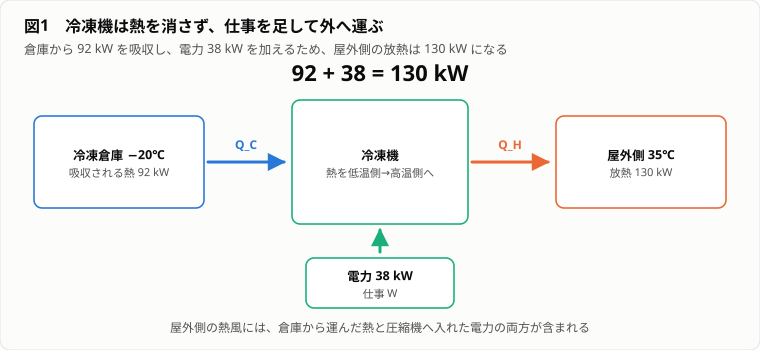
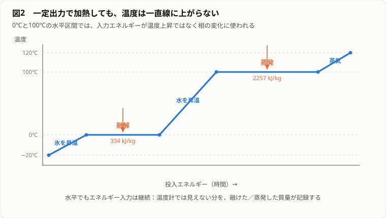
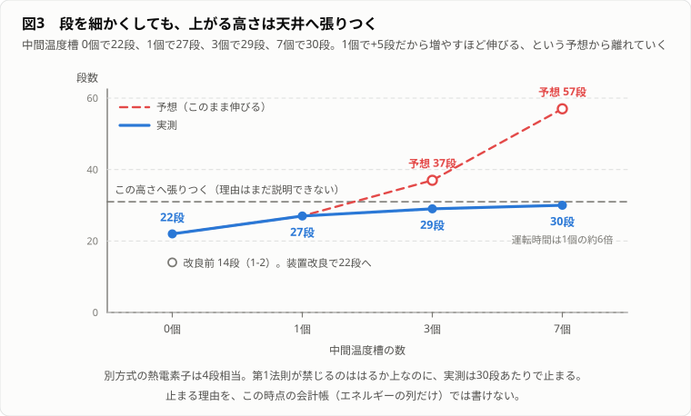
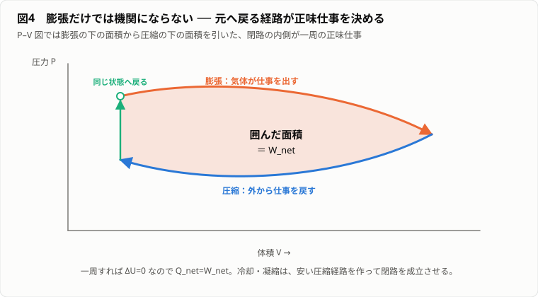
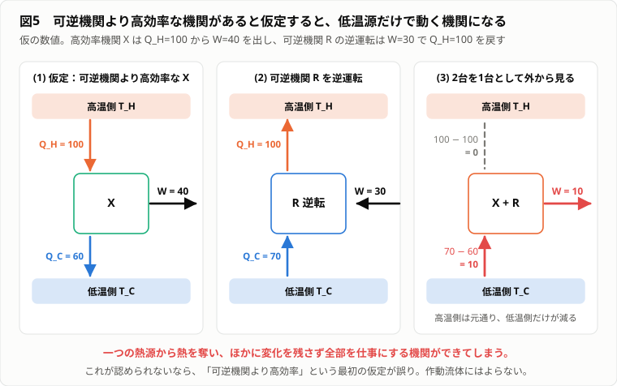
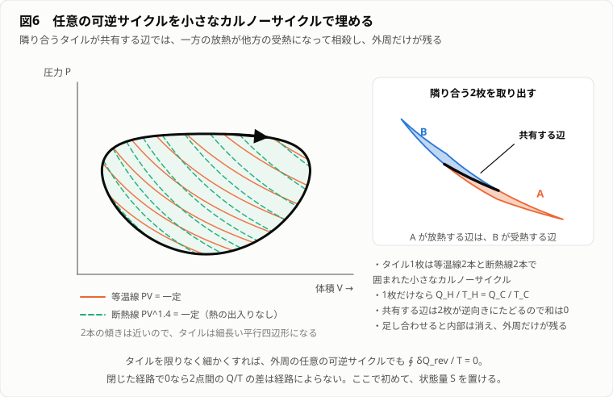
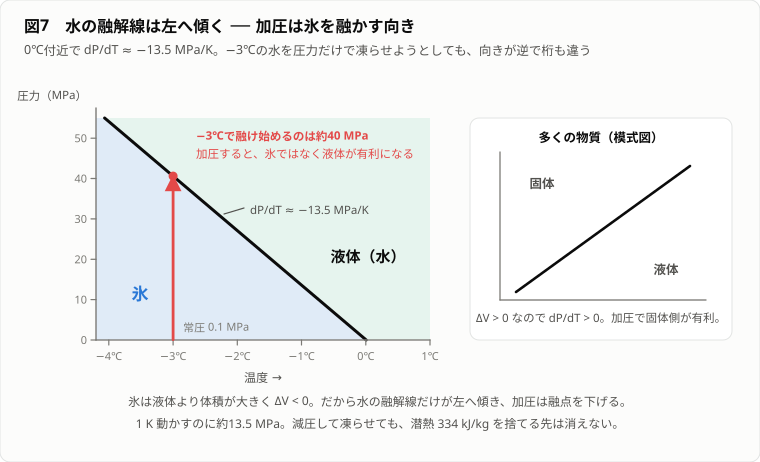
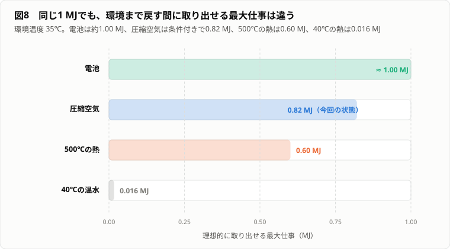
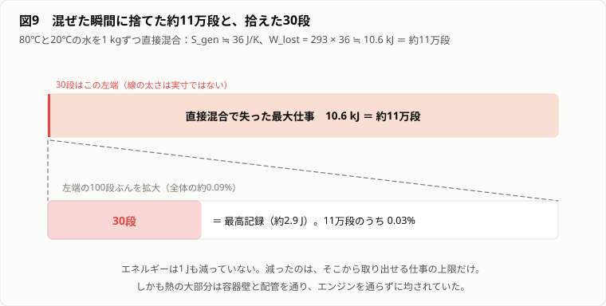

# やる夫で学ぶ熱力学 ― 永久に氷を作る工場

---
## 登場人物

**やる夫**：
町の製氷工場を夏の間だけ手伝うことになった初学者。
物理法則を少し知るたびに、それを利用した大発明を思いつく。
考えが行き詰まると装置の故障を疑うが、測定値からは逃げ切れない。

**やらない夫**：
工場設備の点検を頼まれた工業高校の物理教師。
答えを先に教えず、やる夫の案が本当に一周して元へ戻るかを問い続ける。

**できる子**：
工場の制御と計測を担当する技術者。
温度、圧力、電力量、流量を淡々と記録する。
やる夫が都合の悪い数字を無視すると、短い言葉で記録へ引き戻す。

**できる夫**：
夏祭り実行委員。
やる夫の無限製氷機を完成前から宣伝してしまい、物語に期限を作る。

---
## 第1幕　熱風は燃料か

---
### 1-1　冷やすほど暑くなる工場

**やる夫**：
暑いお……。
氷を作る工場なのに、外より暑いってどういうことだお！！
冷凍機（refrigerator）は冷たいものを作る機械じゃないのかお。

**やらない夫**：
今、お前の顔へ熱風を吹きつけている箱は何だ？

**やる夫**：
冷凍機の屋外側だお。
倉庫の中はマイナス20℃なのに、こっちは触れないくらい熱いお。
機械の半分が冷やして、残り半分が嫌がらせしてるのかお。

**やらない夫**：
倉庫から消えた熱（heat）は、どこへ行ったと思う？

**やる夫**：
消えたんじゃないのかお。
冷やすって、熱をなくすことだお。

**できる子**：
冷凍機入口電力、38kW。
倉庫側から吸収した熱、推定92kW。
屋外側放熱、推定130kW。
誤差範囲内で、92+38=130。

図1：冷凍機は熱を消さない。倉庫から運んだ熱と投入電力が屋外側で合流する（タップ／クリックで原寸表示）。

**やる夫**：
待つお。
倉庫から92kWを吸って、さらに電気を38kW食って、外へ130kWを捨ててるのかお。
つまり冷凍機は冷たさを作ってない。
熱を倉庫から外へ運んでるだけだお。

**やらない夫**：
その理解なら、屋外側が熱くなるのは嫌がらせか？

**やる夫**：
運び出した92kWと、機械を動かした38kWが合流してるだけ……。
でも、それならもっと変だお。
130kWもの熱を捨ててるなら、これで発電すればいいお！！
発電した電気で冷凍機を回す。
冷凍機が熱を出す。
その熱でまた発電する。

**できる夫**：
素晴らしいです！！
外部電力ゼロ、燃料ゼロ、二酸化炭素ゼロの永久製氷工場ですね！！
夏祭りの氷を無料で供給できます！！

**やる夫**：
できる夫、話が早いお。
工場の名前も決めるお。
無限氷業株式会社だお！！

**やらない夫**：
その発電機は、130kWの熱を何kWの電気へ変える予定だ？

**やる夫**：
まず冷凍機に必要な38kWを取り戻せばいいお。
効率は30%弱で足りるお。
火力発電所ならもっと高い効率で発電してるはずだお。
余裕だお。

**やらない夫**：
火力発電所の蒸気と、この熱風は同じものか？

**やる夫**：
どっちも熱だお。
ジュールで数えれば同じだお。
熱風を集めてボイラーへ入れて、蒸気を作ってタービンを回すお。

**できる子**：
屋外側冷媒（refrigerant）の凝縮温度（condensing temperature）、約45℃。
大気温度、35℃。
熱交換器（heat exchanger）出口空気、41℃。
水の常圧沸点、100℃。

**やる夫**：
温度が低いなら、大量に集めればいいお。
ぬるい熱を100倍集めれば、すごく熱い熱になるお。

**やらない夫**：
40℃の水を100杯混ぜたら、何℃になる？

**やる夫**：
40℃だお……。
じゃあ圧縮するお。断熱材で囲うお。熱を逃がさず貯めれば100℃になるはずだお。

**やらない夫**：
熱を逃がさず貯める間、冷凍機はどこへ熱を捨てる？

**やる夫**：
その貯熱槽へ……。
貯熱槽が温まると、冷凍機は熱を押し込むのが大変になる……。
つまり消費電力が増えるお。

**できる子**：
凝縮温度を上げると圧縮機仕事（compressor work）は増える。
発電用に排熱温度を上げるほど、冷凍側の負担が増える。

**やる夫**：
ぐぬぬ……。
でも、130kWという数字は消えてないお。
量は十分あるのに、温度が低いというだけで使えないのかお。
熱の量と、仕事にできる量は別なのかお。

**やらない夫**：
それを確かめるには、何を測ればいい？

**やる夫**：
熱を入れて、実際にどれだけ仕事が出たかだお。
ただし電力計だけだと、装置の中で何が起きたか見えないお。
もっと原始的に……重りを持ち上げれば、仕事が目で見えるお。

**やらない夫**：
では、熱に重りを持ち上げさせてみるか。

---
### 1-2　仕事の階段

**やる夫**：
できたお！！
同じ重さの金属ワッシャーを、10cmごとの棚へ上げる装置だお。
糸を巻き取る軸を小型スターリングエンジン（Stirling engine）につないだお。
ワッシャー1枚の質量は100g。
1段上げれば仕事は

$$W=mgh=0.1\times9.8\times0.1=0.098\ \mathrm{J}$$

約0.1Jだお。
10枚を10段なら約10J。
発電量よりずっと小さいけど、何が起きたか目で追えるお。

**やらない夫**：
熱源は？

**やる夫**：
左に80℃の湯、右に20℃の水を置くお。
その温度差でスターリングエンジンを回すお。
名付けて廃熱エレベーターだお。

**できる子**：
スターリングエンジンの実出力は小さい。
軸受摩擦、空気漏れ、熱交換損失が大きい。
持ち上がる枚数は理論値よりかなり少ない。

**やる夫**：
最初から夢を削るなだお。
実験開始だお！！
……回ったお。
1枚目、1段。
2段。
3段……遅くなってきたお。

**やらない夫**：
左と右の温度は？

**できる子**：
左、63℃。
右、37℃。

**やる夫**：
まだ差はあるお。
頑張れだお……。
止まったお。
左51℃、右49℃。
ワッシャーは合計14段分上がったお。

**やらない夫**：
なぜ止まった？

**やる夫**：
燃料がなくなったからだお。

**やらない夫**：
水はなくなったか？

**やる夫**：
両方とも残ってるお。
温度も約50℃だから、熱エネルギーだって大量に残ってるお。
でも温度差がなくなった。
……燃料だったのは熱そのものじゃなくて、熱の偏りだったのかお。

**やらない夫**：
では、最初から80℃の湯と20℃の水を直接混ぜたら？

**やる夫**：
同じくらいの50℃になるお。
でもワッシャーは1段も上がらないお。

**やらない夫**：
直接混ぜた場合と、エンジンを通した場合で、最初と最後は同じか？

**やる夫**：
水の量は同じ。
最終温度もほぼ同じ。
ただしエンジンを通した方には、上に上がったワッシャーの位置エネルギー（potential energy）が残るお。

**やらない夫**：
なら、直接混ぜたときは何が起きた？

**やる夫**：
上げられたはずのワッシャーを、上げずに捨てた……？
でもエネルギーは保存するはずだお。
仕事にできた分が消えたなら、どこへ行ったんだお。

**できる子**：
直接混合後の水は、エンジンを通した後よりわずかに高温になる。
エンジンを通した場合、水のエネルギーの一部がワッシャーの位置エネルギーへ移った。

**やる夫**：
なるほどだお。
エネルギーそのものは消えてない。
直接混ぜたときは、ワッシャーへ移せたエネルギーまで水の中に熱として残った。
でも、その熱を改めてワッシャーへ変えようとしても、全部が同じ温度だからエンジンは動かない。

**やらない夫**：
今、失われたと言ったものはエネルギーか？

**やる夫**：
違うお。
エネルギーは水の中にある。
失われたのは、そこから仕事を取り出せる可能性……。
いや、まだ名前をつけるのは早いお。
まず本当にエネルギーが保存してるか、原始的に数えたいお。

**やらない夫**：
電気や熱を、最後に同じ物差しへ戻す方法はあるか？

**やる夫**：
0℃の氷を融かすお。
氷が融ける間は温度がほぼ変わらない。
融けた質量で受け取った熱を数えられるお。

**できる子**：
氷の融解潜熱（latent heat of fusion）を $L_f$ とすれば、融けた質量 $m$ に対して

$$Q=mL_f$$

で熱量を推定できる。

**やる夫**：
よし。
仕事の階段と氷の秤で、熱力学の会計監査を始めるお。

---
## 第2幕　熱は物の中にあるのか

---
### 2-1　氷の秤

**やる夫**：
断熱箱に0℃の氷と0℃の水を入れたお。
試したいエネルギーは、最後に全部この箱へ流す。
融けた氷の質量を量れば、何ジュール来たか分かるお。
これが氷の秤だお。

**やらない夫**：
氷の秤は、物体が持つ全エネルギーを量れるのか？

**やる夫**：
もちろんだお。
全部ここへ捨てればいいお。

**やらない夫**：
50℃の水を0℃まで冷やした後、その水分子が持つエネルギーはゼロになるか？

**やる夫**：
ならないお。
分子は動いてるし、分子をばらばらにするにもエネルギーが要るお。
絶対零度でも量子的な話が残るはずだお。
……氷の秤が測るのは全エネルギーじゃなくて、決めた基準状態（reference state）まで移せた差だけかお。

**やらない夫**：
それで実験には困るか？

**やる夫**：
同じ初期状態を比較するなら困らないお。
基準を揃えて、出入りの差を数えればいいお。

**できる子**：
第1実験。
電池から抵抗線へ1000Jの電気エネルギーを供給し、氷の秤を加熱。
融解量から推定した受熱量は、断熱損失を補正して約990J。

**やる夫**：
電気はほぼ全部、熱になったお。
じゃあ逆に、氷の秤へ1000Jの熱を入れて発電し、電池へ戻すお。

**やらない夫**：
0℃の氷水だけで、発電機をどう動かす？

**やる夫**：
……動かせないお。
温度差がないお。
じゃあ80℃の湯から1000Jを取り出して、0℃の氷水を冷却側にするお。

**できる子**：
小型熱機関（heat engine）で電池へ戻った電気エネルギー、94J。
残りの大部分は氷の秤へ熱として移動。

**やる夫**：
行きは電気から熱へほぼ100%。
帰りは熱から電気へ10%にもならないお。
変換器が粗悪だからだお。
もっと良いエンジンなら100%近く戻るお。

**やらない夫**：
仮に摩擦も熱漏れもない理想的な機械を作れたとして、80℃の物体から熱を取り出し続けたら、その物体はどうなる？

**やる夫**：
冷えるお。
冷却側は温まるお。
最後は同じ温度になって止まるお。

**やらない夫**：
そのとき、80℃の物体から受け取った熱を全部電気へ変えたなら、冷却側には何が渡る？

**やる夫**：
何も渡らない……。
でも冷却側へ何も捨てずに、熱源だけを元の状態へ戻して一周できるなら、熱源から熱を取るたび全部仕事になるお。
それが本当に禁じられてるのかを知りたいお。

**やらない夫**：
その前に、熱、仕事、物体のエネルギーを同じ言葉で混ぜていないか？

**やる夫**：
熱は物体が持ってるものじゃないのかお。
熱い水は熱をたくさん持つお。

**やらない夫**：
高い場所に置かれたワッシャーは仕事を持っているのか？

**やる夫**：
仕事をした結果として位置エネルギーを持っているお。
仕事そのものを袋に入れて持ってるわけじゃないお。
……同じなら、水が持つのは熱じゃなくて内部エネルギー（internal energy）。
熱は温度差によって境界を越えたエネルギーの呼び名なのかお。

**できる子**：
系が持つ状態量（state function）を内部エネルギー $U$ とする。
熱として系へ入るエネルギーを $Q$、系が外へする仕事を $W$ とする符号なら、

$$\Delta U=Q-W$$

となる。

**やる夫**：
熱と仕事は通り道の名前。
内部エネルギーは状態の名前。
電池から抵抗線へ電気が行き、水の内部エネルギーが増えた。
水が膨張してピストンを押せば、内部エネルギーの一部が仕事として出る。
これが熱力学第1法則（first law of thermodynamics）……。

**やらない夫**：
この式だけで、熱から仕事へ戻る割合は決まるか？

**やる夫**：
決まらないお。
$Q=1000$Jを入れて、$W=1000$Jを出し、$\Delta U=0$でも式は合うお。
第1法則は帳簿を合わせるだけで、どの取引が可能かまでは言わないお。

---
### 2-2　温度計が止まった日

**やる夫**：
熱と内部エネルギーを区別した記念に、氷を水蒸気まで加熱するお。
ヒーターは一定出力だから、温度は時間に比例して一直線に上がるはずだお。

**やらない夫**：
予想を記録したか？

**やる夫**：
もちろんだお。
マイナス20℃から0℃、100℃まで同じ傾き。
100℃を超えたら水蒸気も同じように上がるお。
開始だお。

**できる子**：
マイナス20℃から0℃まで上昇。
0℃で温度上昇停止。
ヒーター入力は継続。

**やる夫**：
温度計が壊れたお。
予備に交換だお。
……こっちも0℃だお。
氷が融け始めてるお。
全部水になったら、また温度が上がったお。
100℃でまた止まったお！！
今度は沸騰してるお。

**やらない夫**：
温度が止まっている間、エネルギーは入っていないか？

**できる子**：
ヒーター電力は一定。
積算電力量は増加中。
氷の質量は減少し、水蒸気の質量は増加中。

**やる夫**：
温度はエネルギーの総量じゃない……。
0℃の氷と0℃の水は同じ温度なのに、氷を水にするには大量のエネルギーが要るお。
100℃の水と100℃の水蒸気も同じだお。

**やらない夫**：
そのエネルギーは何に使われた？

**やる夫**：
氷では水分子が結晶の配置を保ってる。
融解では、その配置を崩して分子が動き回れる状態にする。
蒸発では、分子同士の引力を振り切って遠くへ離す。
平均的な運動の激しさを上げるだけじゃなく、集団の構造を変えるのに使われたお。

**やらない夫**：
分子の説明は役に立つ。だが分子を1個ずつ追跡できない工場では、何を測る？

**やる夫**：
状態が変わるときに必要な熱量を、質量あたりで測るお。
融解潜熱 $L_f$、蒸発潜熱（latent heat of vaporization） $L_v$。

$$Q=mL$$

で数えるお。

**できる子**：
水の融解潜熱は約334kJ/kg。
常圧沸点での蒸発潜熱は約2257kJ/kg。
温度を上げる顕熱（sensible heat）より、相（phase）を変える潜熱が大きい場合がある。

図2：水平区間でもエネルギー入力は続き、融解・蒸発という相の変化へ使われる（タップ／クリックで原寸表示）。

**やる夫**：
1kgの氷を0℃で融かすだけで、100gのワッシャーを10cm上げる仕事なら300万段以上に相当するお。
とんでもない量だお！！
これを使えば永久製氷機が……。

**やらない夫**：
氷を融かして得た熱は、次の周回でどうやって氷へ戻す？

**やる夫**：
水から熱を抜いて凍らせるお。
そのために冷凍機が仕事を食うお……。
潜熱は無限の燃料じゃなくて、一定温度で大量のエネルギーを受け渡せる貯蔵庫だお。
使えば氷が減る。
元へ戻すには、同じだけのエネルギーを外へ運ばないといけないお。

**やらない夫**：
なら氷の秤は、なぜ便利なんだ？

**やる夫**：
0℃を保ったまま熱を受け取れるからだお。
温度計だけでは見えないエネルギーを、融けた質量に変えて残せる。
氷は答えじゃなくて、会計帳の紙なんだお。

---
## 第3幕　取り逃した重り

---
### 3-1　混ぜる前に仕事を抜け

**できる夫**：
やる夫くん、横断幕の校正刷りができました！！
「無限氷業株式会社　外部電力ゼロ」！！
夏祭りまであと3週間、印刷所の締切は今週です！！

**やる夫**：
待つお、まだ刷るなだお！！
……いや、待つのはやる夫の方だお。
80℃の湯と20℃の水を直接混ぜた場合は、約50℃になる。
熱機関を間に入れた場合は、重りを上げながら温度が近づく。
同じ材料、同じ初期温度なのに、手順で結果が違うお。
ここが分からないうちは、ゼロと書けないお。

**やらない夫**：
第1法則と矛盾するか？

**やる夫**：
しないお。
熱機関を通した方は、水の内部エネルギーが少し減った分だけ重りの位置エネルギーが増える。
直接混合は全部が水の内部エネルギーとして残る。
合計は同じだお。

**やらない夫**：
では、直接混合後の50℃の水から、同じ重りを上げられるか？

**やる夫**：
周囲も50℃なら無理だお。
でも0℃の氷水を持ってくれば動くお。

**やらない夫**：
その氷水は、最初の実験に含まれていたか？

**やる夫**：
含まれてないお。
外から新しい低温源を持ち込んだことになる。
比較するなら、世界の境界を決めないとずるができるお。

**できる子**：
比較対象を、80℃の水1kg、20℃の水1kg、仕事の階段、断熱容器の内側に限定する。
外部との熱、仕事、物質の出入りはなし。

**やる夫**：
透明な断熱箱で世界を閉じるお。
電池も冷却水も外へ隠せない。
最初と最後に、箱の中の温度、重りの高さ、氷の量を全部照合するお。

**やらない夫**：
直接混ぜた後に、何か工夫して重りを上げられないか？

**やる夫**：
思いついたお。
速い分子は勢いがあるから、遠心力で外側へ飛ぶはずだお。
遠心分離機（centrifuge）にかけて外側と内側に分ければ、熱い水と冷たい水に分かれるお。
分かれさえすれば、また廃熱エレベーターを回せるお！！
分離機を借りてくるお。

**できる子**：
50.0℃の水2kgを毎分3000回転で10分間分離。
外側から採取、50.4℃。
内側から採取、50.4℃。
ポンプと分離機の入力電力量、約12kJ。

**やる夫**：
分かれてないお！！
しかも両方とも0.4℃上がってるお！？
冷たい半分を作るつもりが、温かい水が増えただけだお……。

**やらない夫**：
なぜ上がった？

**やる夫**：
分離機を回した電気だお。
軸受と水のかき混ぜで、入れた仕事が全部熱になって水に戻ったお。
取り逃した重りを取り返すつもりが、新しく12kJ分を取り逃したお。
やればやるほど負けるお。

**やらない夫**：
巨視的に分けるのが無理なら、次はどこへ逃げる？

**やる夫**：
分子レベルだお。
分子レベルでは、速い分子と遅い分子がいるお。
速い分子だけ左へ、遅い分子だけ右へ選り分ければ温度差を復元できるかもしれないお。
小さな扉を高速で開閉して……。

**できる子**：
扉を制御するには分子の速度を測り、記録し、判断し、操作する必要がある。
装置自身を含めたエネルギーと情報の会計が必要。

**やる夫**：
今は情報熱力学（information thermodynamics）まで逃げないお。
巨視的な装置だけなら、混ぜる前には仕事が取れたのに、混ぜた後は取れない。
この差を、取り逃した重りと呼ぶお。

**やらない夫**：
取り逃した重りは、直接混合という手順だけに固有か？

**やる夫**：
摩擦でも起きるお。
高い棚のワッシャーを落として発電機を回せば電気にできる。
でも床へそのまま落として衝突させたら、音と熱になって、同じ高さへ戻せない。
気体をピストンでゆっくり膨張させれば重りを上げる。
真空へ自由膨張（free expansion）させたら、同じ体積まで広がっても重りは上がらない。

**やらない夫**：
共通点は？

**やる夫**：
最初にあった偏りが、利用せずに均されたお。
温度差、圧力差、高さの差、速度差。
均す途中で仕事を抜けば重りになる。
一気に均すと、エネルギーは残るのに仕事へ戻しにくくなる。

**できる子**：
熱伝導（heat conduction）、摩擦、自由膨張、混合、電気抵抗。
いずれも現実の工場で常時起きている。

**やる夫**：
工場はエネルギーを消費してるだけじゃない。
使える偏りを、使いにくい均一な熱へ変えてるのかお。
だから電力計だけ見ても、本当の損失の場所が分からないんだお。

---
### 3-2　最高記録は装置の外にある

**やる夫**：
廃熱エレベーターを改良したお。
軸受を軽くして、断熱材を増やして、熱交換面を広げたお。
前回14段だったのが、今回は22段上がったお！！

**できる夫**：
14段から22段！！
1.5倍以上です！！
この調子で改良を7回繰り返せば、無限に届きますね！！

**やる夫**：
……できる夫、それは違う気がするお。
上げた段数は増えたけど、増え方がどこまで続くのか、やる夫には分からないお。

**やらない夫**：
22段が、80℃と20℃の水から取り出せる最大仕事か？

**やる夫**：
もっと改良すれば増えるかもしれないお。
でも実験装置が出した値しか分からないお。
最大という針はないお。

**やらない夫**：
では、最大という量は測定量ではないのか？

**やる夫**：
直接は測れないお。
いろんな装置で試して最高記録を更新し、その上に理論上の限界があると推定する量だお。

**できる子**：
第1方式、スターリングエンジン直結、22段。
第2方式、熱電素子、4段相当。
第3方式、中間温度槽を使った多段運転、27段。

**やる夫**：
中間槽を入れると増えたお。
80℃から20℃へ一気に熱を落とさず、80から60、60から40、40から20と少しずつ仕事を取ったからだお。
中間槽1個で22段が27段。
なら中間槽を3個にすれば37段、7個なら57段だお。
できる夫の言う通りかもしれないお！！

**やらない夫**：
やってみるといい。

**できる子**：
中間槽3個、29段。
中間槽7個、30段。
運転時間は中間槽1個の約6倍。

図3：直線的に伸びるという予想と違い、実測は30段あたりへ張りつく（タップ／クリックで原寸表示）。

**やる夫**：
増えないお。
27、29、30……。
段を細かくするほど伸びが減って、どこかへ張りついていくお。
無限どころか、天井が見えてるお。

**やらない夫**：
その天井を越えられない理由を、第1法則で言えるか？

**やる夫**：
元の水が持つエネルギーより増えたら第1法則に反するお。
だから上限はあるお。
でも第1法則が禁じるのは水のエネルギー全部を超えることだけで、実測の30段はそれよりずっと低いお。
30あたりで止まる理由は、まだ説明できないお。

**やらない夫**：
高温水と低温水を最終的に何℃へそろえるのが、最も多く仕事を出すと思う？

**やる夫**：
同じ質量、同じ比熱なら、直接混合は摂氏の平均で50℃だお。
仕事を取り出すとその分だけ内部エネルギーが減るから、最終温度は50℃より低くなるはずだお。
可能な限り低くすれば仕事が増える……でも両方20℃まで下げるには、別の冷却先が要るお。
閉じた箱の中で2つが同じ温度になるなら、どこまで下げられるんだお。

**やらない夫**：
各瞬間で、高温側から受け取る熱と低温側へ渡す熱の比に制約があるとしたら？

**やる夫**：
その制約が分かれば、最高記録を計算できるお。
でも第1法則だけでは

$$Q_H=W+Q_C$$

としか言えない。
$Q_C=0$にして全部を$W$にしても帳簿は合う。
もう1本、別の法則が必要だお。

**やらない夫**：
どんな法則だ？

**やる夫**：
熱の量を保存する法則じゃない。
熱をどの温度で受け渡したかを数える法則……。
高温の100Jと低温の100Jを区別する帳簿だお。

**できる子**：
現在の会計帳には、エネルギーの列しかない。
温度差を消費した履歴は記録されていない。

**やる夫**：
新しい列が必要だお。
でも先に名前を知ると、また公式をありがたがって終わるお。
まず、なぜ熱機関が冷却先を必要とするのかを、蒸気で追うお。

---
## 第4幕　一周しない蒸気機関

---
### 4-1　膨張だけを繰り返したい

**やる夫**：
スターリングエンジンは中身が見えにくいお。
水を沸かして蒸気でピストンを押せば、熱が仕事になる瞬間が見えるお。
透明な耐圧シリンダーに少量の水を入れ、外から加熱するお。

**できる子**：
圧力上限、安全弁、遮熱板を確認。
小型模型の範囲で実施する。

**やる夫**：
蒸気がピストンを押し上げたお！！
ワッシャーが12段、一気に上がるお。
熱から仕事への変換はできる。
今までで一番いい手応えだお。

**できる夫**：
1回で12段！！
これを1秒に1回繰り返せば、毎秒12段です！！
一晩で何万段になるか計算しますね！！

**やる夫**：
できる夫がいいことを言ったお。
繰り返せばいいんだお。
ピストンが上まで行ったら蒸気を最初の位置へ戻して、また加熱するお。

**やらない夫**：
どうやって戻す？

**やる夫**：
さっき上げたワッシャーを落として、その力でピストンを押し下げるお。
上げた分をそのまま使うんだから、ちょうど足りるお。
2周目、開始だお。

**できる子**：
膨張で得た仕事、12段相当。
押し戻しに要した仕事、14段相当。
正味マイナス2段。
3周目、正味マイナス3段。

**やる夫**：
減ってるお！？
上げたワッシャーを全部落としても、ピストンが元まで下がらないお。
足りない分を手で押してるお……。
繰り返すほど階段が短くなるお。

**やらない夫**：
なぜ足りない？

**やる夫**：
押し戻すときも、シリンダーの中はまだ熱い蒸気だお。
広がった蒸気を同じ体積まで押し縮めるには、広がるときにもらった分と同じくらいの仕事が要る。
そこへ摩擦と熱漏れが乗るから、必ず赤字になるお。
熱を入れる工程だけ繰り返したいのに、戻す工程が同じ大きさで立ちはだかるお。

**やらない夫**：
戻す工程を安くする手はあるか？

**やる夫**：
……押し縮める相手が蒸気だから高くつくんだお。
蒸気を冷やして水に戻すお。
体積が1000分の1くらいになれば、軽い力でピストンを戻せるお。

**できる子**：
凝縮させた場合の押し戻し仕事、1段未満。
正味プラス。

**やる夫**：
プラスになったお！！
冷やしただけで黒字だお。

**やらない夫**：
冷やした熱はどこへ行く？

**やる夫**：
冷却水へ捨てるお。
……また捨てる熱が出たお。
でも水へ戻せばポンプでボイラーへ送り、少ない仕事で高圧側へ戻せる。
つまり冷却器は無駄じゃない。
サイクル（cycle）を閉じるために必要なんだお。

**やらない夫**：
膨張の一工程だけ見たときと、一周したときでは何が違う？

**やる夫**：
一工程なら、最初に用意した高温高圧蒸気を消費して大きな仕事が出る。
でも装置を元へ戻す工程まで含めると、蒸気を再び水にして、加圧して、加熱しなきゃいけない。
熱機関は変化の切り売りじゃなく、サイクル全体で評価するものだお。

**やらない夫**：
サイクルを図にできるか？

**やる夫**：
PV図（pressure-volume diagram）の横軸を体積$V$、縦軸を圧力$P$にするお。
膨張で右へ進むと、気体がした仕事は

$$W=\int P\,dV$$

になる。
圧縮では左へ戻り、外から仕事を受ける。
一周で囲んだ面積が正味仕事だお。

**できる子**：
経路が違えば、始点と終点が同じでも熱と仕事は異なる。
内部エネルギーは状態量だが、$Q$と$W$は経路に依存する。

図4：膨張だけでなく元へ戻る圧縮まで数え、閉路が囲む面積を一周の正味仕事として読む（タップ／クリックで原寸表示）。

**やる夫**：
だから$\delta Q$と$\delta W$は完全微分$dU$と記号を分けるのかお。
同じ状態へ戻れば$\Delta U=0$。
サイクル全体では

$$Q_{\mathrm{net}}=W_{\mathrm{net}}$$

になるお。
受け取った正味の熱だけ、正味の仕事が出る。
でも受け取った熱を全部仕事にできるとはまだ限らないお。

---
### 4-2　冷却器を外したら止まった

**やる夫**：
どうしても納得できないお。
冷却器は熱を捨てる装置だお。
せっかくボイラーで入れた熱を、外へ捨てるから効率が下がる。
外せば全部仕事になるはずだお。

**やらない夫**：
試す前に、外した後の蒸気の行き先を考えたか？

**やる夫**：
タービン出口の蒸気を、そのままボイラー入口へ戻すお。
輪っかの配管にするお。

**できる子**：
運転開始。
入口圧力0.35MPa、出口圧力0.02MPa、回転数毎分3200。
30秒経過、出口圧力0.11MPa、回転数1900。
70秒経過、出口圧力0.28MPa、回転数400。
95秒経過、入口出口ともに0.33MPa。
回転停止。

**やる夫**：
止まったお。
配管を触っても、どこも詰まってないお。
熱はちゃんと入れてるし、蒸気も全部残ってるお。
なのに動かないお……。

**やらない夫**：
最後の1行を読み直せ。
入口と出口の圧力はいくつになった？

**やる夫**：
どっちも0.33MPa……。
同じだお。
輪っかにしたから、出た蒸気が行き場をなくして出口にたまって、入口と同じ圧力まで押し返してきたお。
タービンは差があるから回るのに、その差を自分で埋めてしまったお。

**できる夫**：
それなら、ボイラーをもっと焚けばいいのでは！？
入口の圧力を上げれば、また差がつきます！！

**やる夫**：
それだお！！
火力を1.5倍にするお！！

**できる子**：
入口圧力0.49MPa、出口圧力0.49MPa。
回転数0。
安全弁作動。

**やる夫**：
上がったのは両方だお……。
輪っかの中に閉じ込めたまま熱を入れても、全体が一緒に上がるだけで差はつかないお。
熱を入れる場所じゃなくて、熱を抜く場所がないのが問題だったお。
冷却して凝縮させれば、出口の蒸気が水になって消える。
消えた分だけ出口側の圧力を低く保てるお。

**やらない夫**：
低圧だけあればよいのか？

**やる夫**：
温度差も必要だお。
ボイラーより蒸気が熱ければ、熱源から熱を受け取れない。
冷却器で作動流体（working fluid）を低温へ戻し、高温熱源からまた熱を受け取れる状態にするお。

**やらない夫**：
熱機関が一周するために必要なものを挙げると？

**やる夫**：
高温熱源、低温熱源、作動流体。
高温側から$Q_H$を受け取り、一部を仕事$W$にし、残り$Q_C$を低温側へ捨てる。

$$Q_H=W+Q_C$$

だお。

**やらない夫**：
なぜ$Q_C$をゼロにできない？

**やる夫**：
今の説明だと、作動流体を初期状態へ戻すために冷却が必要だから……。
でも別の作動流体や巧妙なサイクルなら、冷却なしで戻せるかもしれないお。
水蒸気固有の事情だけでは、原理的禁止にならないお。

**やらない夫**：
なら、作動流体の種類に依存しない理想機関を考える必要があるな。

**やる夫**：
摩擦ゼロ、熱漏れゼロ、圧力差も温度差も限りなく小さくして、どの工程も逆向きに戻せる機関だお。
現実には遅すぎて役に立たなくても、理論上の最高記録を決める基準になるお。

**できる子**：
現実の装置を直接最高にするのではなく、不可逆な要因を取り除いた極限を比較基準にする。

**やる夫**：
仕事の階段で更新してきた最高記録の、到達不能なゴールを作るわけだお。
その機関でも$Q_C$が必要なら、廃熱ゼロ発電は装置の工夫では破れないお。

---
## 第5幕　最も遅い機関が最も強い

---
### 5-1　可逆という無茶な条件

**やる夫**：
理想機関を作る条件を考えたお。
ピストンと外圧に大きな差があると、一気に動いて振動や摩擦が出る。
だから外圧との差を限りなく小さくする。
熱を受け取るときも、熱源と作動流体の温度差を限りなく小さくする。

**やらない夫**：
温度差がゼロなら熱は流れるか？

**やる夫**：
流れないお。
限りなく小さいけどゼロではない差で、限りなくゆっくり流すお。
出力はほぼゼロになるけど、少し条件を逆にすれば全工程を逆向きに戻せる。
これが可逆過程（reversible process）だお。

**やらない夫**：
現実の工場で使えるか？

**やる夫**：
無限に時間がかかるから、そのままでは使えないお。
でも損失をどこまで減らせるかの基準にはなる。
競走用の機械じゃなく、理論上の最高記録だお。

**できる子**：
摩擦、有限温度差での熱伝導、自由膨張、混合がない理想サイクルを設定。
高温等温膨張（isothermal expansion）、断熱膨張（adiabatic expansion）、低温等温圧縮（isothermal compression）、断熱圧縮（adiabatic compression）の4工程。

**やる夫**：
高温$T_H$で熱$Q_H$を受け取りながら膨張する。
断熱してさらに膨張し、温度を$T_C$まで下げる。
低温$T_C$で熱$Q_C$を捨てながら圧縮する。
最後に断熱圧縮で$T_H$へ戻る。
カルノーサイクル（Carnot cycle）だお。

**やらない夫**：
なぜこの機関が最高だと言える？

**やる夫**：
最高になるように損失を全部消したから……だお。

**やらない夫**：
それでは「最高」と仮定したものを最高と呼んだだけだ。
同じ2温度の間で、もっと高効率な機関が見つかったらどうする？

**やる夫**：
そっちを新しい最高記録にするお。
摩擦ゼロでも、別の巧妙なサイクルなら上へ行けるかもしれないお。
……困ることは何もないお。

**やらない夫**：
その高効率機関が得た仕事で、今の可逆機関を逆向きに回してみろ。
高効率機関が高温側から受け取る熱と、逆向きの可逆機関が高温側へ返す熱が同じになるよう、大きさをそろえるんだ。

**やる夫**：
高温側への出入りをゼロにする……。
同じ高温側の熱量なら、高効率機関が出す仕事は、可逆機関の逆運転に必要な仕事より大きい。
高効率機関が低温側へ捨てる熱より、逆向きの可逆機関が低温側から汲み上げる熱の方が多い。
差し引きすると、高温側は元通りなのに、低温側から熱が減って、外には仕事が残るお。

**やらない夫**：
その複合装置を一台の機関として外から見たら？

**やる夫**：
あっ……低温側だけから熱を吸って、それを正味仕事へ変えてるお。
高温側には何の変化も残らない。
一つの熱源から熱を奪い、ほかに変化を残さず全部仕事にする機関になってしまうお。

図5：高温側の100が打ち消し合い、低温側から取り出した10がそのまま正味仕事として残る（タップ／クリックで原寸表示）。

**やらない夫**：
それが許されないなら、最初の仮定は？

**やる夫**：
低温の海水を少し冷やすだけで、燃料なしに仕事を取り出し続けられるお。
海が熱を持つ限り無限に発電できる。
無限製氷工場よりひどい永久機関だお。
だから可逆機関より高効率な機関は存在できない。
同じ2温度間の可逆機関は、作動流体によらず同じ効率になるお。

**やらない夫**：
効率は何だけで決まる？

**やる夫**：
高温と低温の絶対温度（absolute temperature）だけだお。

$$\eta_{\mathrm{max}}=1-\frac{T_C}{T_H}$$

摂氏じゃなくケルビンを使うお。

**できる子**：
排熱温度45℃、環境35℃なら、理想上限でも

$$\eta_{\mathrm{max}}=1-\frac{308}{318}\approx0.031$$

約3.1%。

**できる夫**：
3.1……%ですか。
30%ではなく。

**やる夫**：
130kWの排熱だから、理想でも約4kWしか出ないお！！
しかも冷凍機は38kW食ってる。
現実の発電機ならもっと少ない。
最初から10倍足りなかったお。

**できる夫**：
やる夫くん、これは装置をもっと良くしても届かない数字なんですか。
摩擦をゼロにして、断熱を完璧にして、お金をいくらかけても。

**やる夫**：
届かないお。
この3.1%は、やる夫の装置が下手だから出た数字じゃないお。
45℃と35℃という2つの温度だけで決まる、誰が作っても越えられない天井だお。
3-2で30段のあたりに張りついた天井の正体が、これだったお。

**できる夫**：
……横断幕、刷ってしまいました。

**やる夫**：
知ってるお。
やる夫が刷らせたようなものだお。
でも、越えられない理由が分かった方が、あと10回改良を試すより早いお。

**やらない夫**：
火力発電所で高効率なのは、熱量が多いからか？

**やる夫**：
高温側が数百℃以上で、環境との温度差が大きいからだお。
同じ1MJでも、高温で受け取る熱ほど仕事へ変えやすい。
40℃の排熱を大量に集めても、40℃のままでは価値が低いお。

**やらない夫**：
では100%効率にする条件は？

**やる夫**：
$T_C=0$Kだお。
低温側を絶対零度にすればいい……。
いや、その低温側を作るために冷凍機が必要だお。
しかも絶対零度へ近づくほど冷やすのが難しくなる。
低温源を無料の穴として扱ったら、また世界の外へ費用を隠してるお。

---
### 5-2　熱を温度で割る理由

**やる夫**：
カルノー効率（Carnot efficiency）は分かったお。
でも

$$\eta=1-\frac{T_C}{T_H}$$

の温度比が、なぜ熱の流れを縛るのかがまだ腹落ちしないお。

**やらない夫**：
可逆機関で、受け取った熱と捨てた熱の関係を書けるか？

**やる夫**：
効率は

$$\eta=\frac{W}{Q_H}=1-\frac{Q_C}{Q_H}$$

だから、カルノー効率と比べると

$$\frac{Q_C}{Q_H}=\frac{T_C}{T_H}$$

になるお。
整理すると

$$\frac{Q_H}{T_H}=\frac{Q_C}{T_C}$$

だお。

**やらない夫**：
左と右で同じになる量は何を表している？

**やる夫**：
高温側が失った熱を温度で割った量と、低温側が受け取った熱を温度で割った量が等しい。
可逆機関なら、この量は高温側から低温側へ移るだけで、全体では増えないお。

**やらない夫**：
だが、それは一つのカルノーサイクルで確かめただけだ。
どんな可逆サイクルでも、熱を温度で割った量が一周してゼロへ戻ると言えるか？

**やる夫**：
言えないと、出発点へ戻っても経路ごとに会計残高が変わるお。
それでは状態量じゃないお。
……PV図の任意の可逆サイクルを、温度差の小さいカルノーサイクルで細かくタイル張りしたらどうだお。

**やらない夫**：
隣り合うタイルが共有する辺では、一方の放熱が他方の受熱になる。
足し合わせると内部の受け渡しは相殺され、外周だけが残る。

図6：等温線と断熱線が作る小さなカルノーサイクルで内部を埋めると、共有する辺は逆向きに2回たどられて消える（タップ／クリックで原寸表示）。

**やる夫**：
各タイルでは、符号込みで熱を温度で割った和がゼロだお。
タイルを限りなく細かくすれば、外周の任意の可逆サイクルでも

$$\oint\frac{\delta Q_{\mathrm{rev}}}{T}=0$$

になるお。
閉じた経路で積分がゼロなら、始点から終点までの値は経路によらない。
これで初めて、熱を温度で割った量の差を状態の差として置けるお。

**できる子**：
可逆的な微小熱移動に対して状態量$S$を

$$dS=\frac{\delta Q_{\mathrm{rev}}}{T}$$

と定義できる。

**やる夫**：
これがエントロピー（entropy）かお。
乱雑さの別名だと思ってたお。
でも今は、熱をどの温度で受け渡したかを記録するために必要になったお。
100Jを300Kで受け取るのと、600Kで受け取るのでは$Q/T$が違う。
エネルギー帳では同じ100Jでも、エントロピー帳では違うお。

**やらない夫**：
分子の並び方を数える統計力学（statistical mechanics）では、この同じ状態量が「実現できる微視的状態（microstate）の数」と結びつく。
乱雑さという言い方はその一面だが、今は巨視的な熱と仕事の会計から得た定義を使おう。
直接混合ではどうなる？

**やる夫**：
高温側から有限の温度差で熱が流れる。
途中に可逆機関を置かず、仕事を取らずに均す。
高温側が失うエントロピーより、低温側が受け取るエントロピーの方が大きくなるはずだお。

**できる子**：
一定比熱$C$の同量の水を、絶対温度$T_H$と$T_C$から直接混合し、最終温度を$T_f$とすると、

$$\Delta S=C\ln\frac{T_f}{T_H}+C\ln\frac{T_f}{T_C}$$

となる。
80℃と20℃を同量混合する場合、$T_f$は約323Kで、$\Delta S>0$。

**やる夫**：
第1法則では、直接混合も熱機関経由も許される。
第2の帳簿では、直接混合はエントロピーを増やす。
可逆機関なら全体のエントロピー増加はゼロに近づく。

**やらない夫**：
摩擦や自由膨張では？

**やる夫**：
外から熱を入れてなくても、エントロピー生成（entropy generation）が内部で起きるお。
一般には

$$\Delta S=\int\frac{\delta Q}{T}+S_{\mathrm{gen}}$$

で、

$$S_{\mathrm{gen}}\geq0$$

だお。
可逆なら$S_{\mathrm{gen}}=0$。
現実の過程では正になる。

**やらない夫**：
エントロピーは何の向きを示す？

**やる夫**：
孤立系（isolated system）では減らない方向だお。
熱いものと冷たいものが自然に同温度になる。
混ざった気体が自然に分離しない。
摩擦で止まった車輪が、周囲の熱を集めて勝手に回り出さない。
エネルギー保存では区別できなかった時間の向きを、エントロピー増大が区別するお。

---
## 第6幕　冷蔵庫を逆から読む

---
### 6-1　冷たさは作れない

**やる夫**：
熱機関は、高温から低温へ熱が落ちる途中で仕事を取り出す。
なら逆回転させれば、仕事を入れて低温から高温へ熱を持ち上げられるお。
廃熱エレベーターは、向きを逆にすれば熱のポンプになるお。

**やらない夫**：
冷蔵庫の中で起きていることと同じか？

**やる夫**：
同じだお。
冷蔵庫は冷たさを製造してるんじゃない。
庫内から熱$Q_C$を吸い、圧縮機の仕事$W$を加えて、室内へ$Q_H$を捨てる。

$$Q_H=Q_C+W$$

だお。

**やらない夫**：
では、暑い部屋で冷蔵庫の扉を開けたまま運転すると、部屋は冷えるか？

**やる夫**：
庫内と室内が同じ空間になる。
冷蔵庫は部屋の一部から$Q_C$を吸って、同じ部屋へ$Q_C+W$を返す。
差し引き$W$だけ部屋が暖まるお。
扉を開けた冷蔵庫は、電気ヒーターより複雑な暖房機だお。

**できる子**：
工場でも同じ。
冷凍倉庫の排熱を同じ建屋内へ戻すと、建屋温度が上がり、凝縮温度が上がり、圧縮機仕事が増える。

**やる夫**：
屋外機を囲って発電しようとした最初の案は、冷凍機の低温側を冷やしながら高温側をさらに熱くしようとしてたお。
発電で少し取り戻す以上に、圧縮機の負担を増やす可能性が高いお。

**やらない夫**：
冷凍機の性能は効率で表すのか？

**やる夫**：
投入仕事に対して、どれだけ熱を移動できたかを数えるお。
冷却目的なら成績係数（coefficient of performance, COP）

$$\mathrm{COP}_C=\frac{Q_C}{W}$$

加熱目的のヒートポンプ（heat pump）なら

$$\mathrm{COP}_H=\frac{Q_H}{W}=\mathrm{COP}_C+1$$

だお。

**できる夫**：
COPが4なら、電気1から冷気4を作れるんですね！！
効率400%！！
永久機関の復活です！！

**やる夫**：
やる夫も前ならそう言ったお。
でも4は作ったエネルギーじゃなく、運んだ熱$Q_C$だお。
電気1を入れて、低温側から4を運び、高温側へ5を捨てる。
エネルギーは増えてないお。

**やらない夫**：
可逆冷凍機のCOP上限は？

**やる夫**：
熱機関を逆向きに読むと、

$$\mathrm{COP}_{C,\mathrm{max}}=\frac{T_C}{T_H-T_C}$$

だお。
温度差$T_H-T_C$が小さいほどCOPは大きい。
逆に、マイナス20℃の倉庫から35℃の外気へ熱を上げるのは重労働だお。

**やらない夫**：
工場で最も単純に消費電力を下げるには？

**やる夫**：
冷やす側を必要以上に低くしない。
熱を捨てる側を必要以上に高くしない。
蒸発温度（evaporating temperature）と凝縮温度の差を小さくするお。
断熱、霜取り、熱交換器の清掃、適切な冷媒流量が、全部この温度差へ効くお。

---
### 6-2　熱機関と冷凍機を直結する

**やる夫**：
最後の勝負だお。
高温側と低温側の間に可逆熱機関を置いて仕事を得る。
その仕事で可逆冷凍機を回し、低温側から高温側へ熱を戻す。
理想機関同士なら永久に回るかもしれないお。

**やらない夫**：
それぞれの熱と仕事を記号で置いてみるか？

**やる夫**：
熱機関は高温側から$Q_H$を受け、低温側へ$Q_C$を捨て、仕事

$$W=Q_H-Q_C$$

を出す。
可逆だから

$$\frac{Q_H}{T_H}=\frac{Q_C}{T_C}$$

だお。

冷凍機は逆に、低温側から$Q_C$を吸い、同じ$W$を使って、高温側へ$Q_H$を戻す。
全部がぴったり相殺するお。

**やらない夫**：
外から見た変化は？

**やる夫**：
高温側も低温側も元通り。
仕事も全部冷凍機に使ったから、重りは上がらない。
理想的には回り続けても、何も生産しないお。
……ぴったり釣り合ってるのが気に入らないお。

**やらない夫**：
崩したいのか。

**やる夫**：
崩すお。
熱機関を大きくして、冷凍機を小さくするお。
熱機関が出した仕事のうち、冷凍機に渡すのは8割だけ。
残り2割で重りを上げるお。
釣り合いをこっちに傾ければ、余りが出るお！！

**やらない夫**：
その運転で、低温側へ捨てられる熱と、低温側から汲み上げられる熱を比べてみろ。

**やる夫**：
熱機関が捨てる$Q_C$の方が、小さい冷凍機が汲み上げる分より多いお。
差額が低温側にたまる……。
低温側が温まって、高温側が冷めるお。

**できる子**：
エントロピー帳で確認。
高温側から低温側へ正味の熱が移動している。
2つの水槽の温度差は運転とともに縮小する。

**やる夫**：
重りは上がるお。
上がるけど、上がった分だけ温度差が減っていくお。
温度差がゼロになったら止まるお。
……これ、第1幕の廃熱エレベーターと同じだお。
やる夫はここまで来て、最初の装置に戻ってきたお。

**やらない夫**：
戻ってきたが、最初と同じか？

**やる夫**：
違うお。
最初は、なぜ止まるのか分からなかったお。
今は、何を使い切って止まったのかを名前と数で言えるお。
釣り合わせれば何も出ない。
傾ければ出るけど、傾けた分だけ温度差という元手を食う。
どっちにしても、元手を作らずに回り続ける置き方は存在しないお。

**やらない夫**：
現実の機械なら？

**やる夫**：
摩擦や有限温度差でエントロピーが生成される。
熱機関が出す仕事より冷凍機が必要とする仕事が大きくなって、止まるお。

**できる子**：
可逆極限では正味成果ゼロ。
不可逆性を含めれば正味損失。
正味冷却と正味発電を同時に得る余地はない。

**やる夫**：
永久製氷工場の最善形は、完全な装置なら何もせず回るだけ。
現実の装置なら止まる。
氷を作りながら余剰電力まで出す案は、熱力学第2法則（second law of thermodynamics）に正面から負けたお。

**できる夫**：
では、夏祭りの無限かき氷計画は……。

**やる夫**：
無限は撤回だお。
でも工場を救う方法まで撤回したわけじゃないお。
永久機関を探すのをやめれば、どこで無駄に仕事を失ってるか探せるお。

**やらない夫**：
そのために、仕事の階段の最高記録を何という量へまとめる？

**やる夫**：
まだ名前だけは保留するお。
まず氷、水、水蒸気が、工場のどこで温度差を運び、どこで失ってるかを調べるお。

---
## 第7幕　氷は冷たさを蓄えるか

---
### 7-1　0℃のまま減っていくもの

**やる夫**：
0℃の氷水を低温槽にすると、熱機関が長く安定して動くお。
普通の冷水なら熱を受け取るほど温度が上がり、温度差がすぐ縮む。
氷水は氷が残る間、ほぼ0℃を保つ。

**やらない夫**：
なら氷は永久の低温源か？

**やる夫**：
前に引っかかった罠だお。
温度計は0℃のままでも、氷の質量が減ってる。
氷の秤が示すのは、温度では見えない有限の容量だお。

**できる子**：
0℃の氷1kgをすべて0℃の水にするには、約334kJの熱を受け取る。
氷がなくなった後は、同じ熱入力で水温が上昇する。

**やる夫**：
分かったお、工場の改善案第1号だお。
夜のうちに冷凍機で水から熱を抜いて氷にして、昼はその氷を融かして冷却負荷を引き受けるお。
夜は外が涼しいから凝縮温度も下がる。
同じ氷を作るのに使う電力量が減るはずだお。
一晩試すお。

**できる夫**：
夜間に氷を作って昼に使う！！
省エネで、しかも夜間電力は安い！！
これはもう半分くらい無限では！？

**できる子**：
製造ラインの冷水負荷について、24時間運転の記録。
昼間の直接冷却運転、蒸発温度0℃、凝縮温度45℃、実測COP 3.1。
夜間の製氷運転、蒸発温度マイナス8℃、凝縮温度38℃、実測COP 2.6。
同じ冷却量あたりの積算電力量は、約2割増加。
なお第2製氷管では、マイナス3℃でも凍結開始が遅れる時間帯があった。

**やる夫**：
増えてるお！！
夜の方が涼しいのに、電気を余計に食ってるお。
なんでだお……。

**やらない夫**：
2つの運転で、圧縮機が越えた温度差を比べてみろ。

**やる夫**：
昼は0℃から45℃で45℃分。
夜はマイナス8℃から38℃で46℃分。
外気が下がった分の得より、水を凍らせるために蒸発温度を氷点下へ下げた損の方が大きいお。
COPは温度差で決まるのに、やる夫は外気温だけ見てたお。

**できる子**：
補足。
氷点下運転では蒸発器の着霜が増え、除霜のための入熱も加わる。
一方で、昼のピーク電力と契約電力は低下している。

**やらない夫**：
では氷蓄熱（ice thermal energy storage）は無駄だったのか？

**やる夫**：
無駄とも言い切れないお。
熱力学的効率だけなら、必要な温度を必要な時に直接作る方が有利だった。
でもピーク電力、電力料金、設備容量、停電時の余力まで入れると、2割の損を払う価値がある場合もあるお。
どっちが得かは、何を数えるか決めてからしか言えないお。

**やる夫**：
熱力学は、氷を使えば省エネと答える占いじゃないお。
どの温度で熱を受け取り、どの温度へ捨て、そのために何の仕事が必要かを比較する道具だお。

さっきの記録も使えるお。
マイナス3℃でも液体なら、氷になるまで配管を流せる「冷たさの液体電池」だお。
第2製氷管だけ核になる汚れを除いて、凍結開始を遅らせれば、詰まらずにもっと冷やせるお。

**やらない夫**：
予測したなら、閉塞検知を有効にしたまま少量で確かめろ。

---
### 7-2　圧力で氷を作れるか

**できる子**：
製氷ライン3系統で異常。
第2製氷管の水温、マイナス3.0℃。
凍結は検出されず、流量は正常。

**やる夫**：
狙い通り、マイナス3℃でも流れてるお。
凍らないなら安全域が広がったお。
念のため、予備の温度計でも確かめるお。

**できる子**：
挿入と同時に第2製氷管が全長にわたり白濁。
流量低下、配管閉塞。
温度、マイナス3.0℃から0.0℃へ上昇。

**やる夫**：
やる夫が触った瞬間に凍ったお！！
しかも温度が上がってるお。
冷やしてないのに0℃まで戻ったお！？
安全域どころか、やる夫が不安定な状態を抱えたまま流してただけだお……。

**やらない夫**：
凍った質量はどれだけだ？

**できる子**：
閉塞部を回収して秤量。
氷はシャーベット状で、質量比で約4%。
残りは液体のまま0℃。

**やる夫**：
4%だけかお。
……計算が合うお。
マイナス3℃から0℃へ戻る分の顕熱は、水1kgあたり約3×4.2で12.6kJ。
氷の潜熱は334kJ/kgだから、12.6を334で割ると約3.8%。
凍った4%が出した潜熱で、残り全部が0℃まで温まったんだお。
自分で自分を温めて止まったお。

**やらない夫**：
ではマイナス3℃で液体だった間、氷と水はどちらが安定だった？

**やる夫**：
氷のはずだお。
マイナス3℃なら氷の方が有利なのに、水のままでいたお。
有利な相があるのに、そこへ移らないことがあるのかお。

**やらない夫**：
移るには何が要る？

**やる夫**：
最初の氷の粒だお。
小さい粒は表面ばかりで損をするから、ある大きさを越えないと育たない。
温度計を挿したのが、その最初の粒を作るきっかけになったお。
熱力学はどっちが有利かを教えてくれるけど、いつ移るかまでは教えてくれないお。

**できる子**：
記録。
過冷却（supercooling）は製氷方式として利用もされるが、解除の制御に失敗すると配管閉塞を起こす。

**やる夫**：
有利さと、実際に起きることは別なんだお。
なら逆に、有利さが入れ替わる点そのものは、どう決まるんだお。
水は100℃で水蒸気になる、と学校で習ったお。
でも工場の真空脱気装置では、もっと低い温度で泡が出る。
圧力釜では100℃を超えても液体だお。
100℃は水固有の変身温度じゃないお。

**やらない夫**：
何と何が釣り合ったときに沸騰する？

**やる夫**：
液体表面から飛び出した分子が作る蒸気圧（vapor pressure）と、外圧だお。
蒸気圧は温度が上がるほど増える。
蒸気圧が外圧に達すると、表面だけでなく液体内部でも気泡が成長できる。

**やらない夫**：
熱力学では、液体と気体の安定性をどう比べる？

**やる夫**：
ギブズ自由エネルギー（Gibbs free energy）が小さい方、と聞いたことはあるお。
でも式を暗記しただけで、なぜそれを比べるのかは説明できないお。

**やらない夫**：
一定の温度と圧力を保つ外界と接する系を考えよう。
単純な物質の可逆変化なら$dH=T\,dS+V\,dP$だ。ここで$H$はエンタルピー（enthalpy）だ。
$G=H-TS$を自分で微分してみろ。

**やる夫**：

$$dG=dH-T\,dS-S\,dT=V\,dP-S\,dT$$

**やらない夫**：
温度と圧力が一定で、体積仕事だけをする系なら、外界が受け取る熱は系のエンタルピー減少に等しい。
したがって、系と外界を合わせたエントロピー変化は

$$dS_{\mathrm{univ}}=dS-\frac{dH}{T}=-\frac{dG}{T}\geq0$$

となる。

**やる夫**：
だから自然に進む向きでは$dG\leq0$で、平衡で下げ止まるのかお。
だから、ギブズ自由エネルギー

$$G=H-TS$$

が小さい相が安定なんだお。
純物質では、1mol増やしたときの$G$の変化が化学ポテンシャル（chemical potential）$\mu$。
液体側と蒸気側で$\mu$が違えば、低い側へ物質を移すほど全体の$G$が下がるお。
どちらへ移しても得をしない共存条件は

$$\mu_{\mathrm{liquid}}(T,P)=\mu_{\mathrm{vapor}}(T,P)$$

だお。

**やらない夫**：
温度を少し上げると、なぜ蒸気が有利になる？

**やる夫**：
さっき自分で出した式を使うお。
一定圧力では

$$\left(\frac{\partial G}{\partial T}\right)_P=-S$$

だお。
蒸気は液体よりエントロピーが大きい。
温度が上がるほど蒸気の$G$が速く下がる。
交点を越えると、安定相が液体から蒸気へ切り替わるお。

**できる子**：
相転移（phase transition）点では2相の自由エネルギーが等しい。
そのため微小な条件変化で安定相が入れ替わり、巨視的性質が急に変化する。

**やる夫**：
分子が100℃で命令を受けて一斉に飛ぶんじゃない。
多数の分子が作る2つの集団状態のうち、どちらが熱力学的に有利かが入れ替わるお。
温度は連続でも、選ばれる相は不連続に変わり得る。

**やらない夫**：
圧力を変えたときの相境界の傾きは？

**やる夫**：
共存線に沿っては、2相の化学ポテンシャルが等しいままだから

$$V_1\,dP-S_1\,dT=V_2\,dP-S_2\,dT$$

だお。
移項して、相転移のエントロピー差を$\Delta S=L/T$と置けば、クラペイロンの式（Clapeyron equation）

$$\frac{dP}{dT}=\frac{L}{T\Delta V}$$

が出るお。
潜熱$L$と体積変化$\Delta V$が、相境界の傾きを決める。

**やらない夫**：
水の融解線が多くの物質と逆向きなのは？

**やる夫**：
氷は液体の水より体積が大きい。
融解では$\Delta V=V_{\mathrm{liquid}}-V_{\mathrm{solid}}<0$。
だから$dP/dT$が負になる範囲がある。
圧力を上げると、体積の小さい液体側が有利になり、融点が下がるお。

待つお。
圧力で融点を動かせるなら、冷凍機の代わりに圧力で氷を作れるかもしれないお！！
水をぎゅっと押して相境界を動かし、氷になったら圧力を戻すお。

**やらない夫**：
まず向きは合っているか？

**やる夫**：
圧力を上げると液体が有利になる……逆だお。
氷を作るどころか、氷を融かす向きだお。
それなら一度加圧して液体のまま冷やし、減圧した瞬間に凍らせる案はどうだお。
必要圧力も計算するお。

**できる子**：
0℃付近で、$L\approx334\ \mathrm{kJ/kg}$、$T\approx273\ \mathrm{K}$、
$\Delta V\approx-9.1\times10^{-5}\ \mathrm{m^3/kg}$。

**やる夫**：

$$\frac{dP}{dT}\approx-1.35\times10^7\ \mathrm{Pa/K}$$

1K動かすだけで約13.5MPa。
3Kなら約40MPaだお！！
しかも減圧して凍ると潜熱を出す。
全部を氷にしたければ、その334kJ/kgを結局どこかへ捨てなきゃいけないお。
高圧ポンプの仕事も、容器の強度も、圧力を元へ戻す工程も消えない。

図7：水だけ融解線が左へ傾くので、加圧は氷を作る向きではなく融かす向き（タップ／クリックで原寸表示）。

**やらない夫**：
では、過冷却と圧力操作から何を学んだ？

**やる夫**：
相転移を起こす時刻や場所は操作できる。
潜熱を一定温度で運ぶ道具にもできる。
でも相平衡の向き、必要な圧力、放出する潜熱、装置を一周させる仕事まで数えれば、冷凍機を消す抜け道にはならないお。
第7幕も、永久機関の会計監査へ戻ってきたお。

---
## 第8幕　エネルギーの値段

---
### 8-1　同じ1MJなのに同じ仕事をしない

**やる夫**：
工場には1MJのエネルギーがいろんな形であるお。
充電された電池、高い圧力の空気、500℃の蒸気、40℃の温水。
第1法則では全部1MJだお。

**やらない夫**：
4つを、仕事の階段を多く上げられる順に並べてみろ。

**やる夫**：
簡単だお。
1番は500℃の蒸気だお。
触ったら大やけどする一番激しいエネルギーだお。
2番が圧縮空気、3番が電池、最後が40℃の温水だお。
電池は静かだから弱いお。

**やらない夫**：
その予想を消すな。
環境は35℃、308Kだ。まず、熱として与えられる2枚を仕事の階段へ換算しろ。

**やる夫**：
一定温度の熱1MJなら、上限は$Q(1-T_0/T)$だお。
500℃は773Kだから

$$1\ \mathrm{MJ}\times\left(1-\frac{308}{773}\right)\approx0.60\ \mathrm{MJ}$$

約600万段。
40℃は313Kだから

$$1\ \mathrm{MJ}\times\left(1-\frac{308}{313}\right)\approx0.016\ \mathrm{MJ}$$

約16万段だお。
熱い方が上だけど、500℃でも全部は仕事にならないお。

**やらない夫**：
同じ式を電池へ使えるか？

**やる夫**：
電池には熱源温度$T$を一つ置けないお。
電気エネルギーは理想的にはそのままモーターで仕事へ移せるから、上限はほぼ1MJ、約1000万段。
……静かかどうかなんて関係なかったお。

**やらない夫**：
圧縮空気は？

**やる夫**：
これも熱源じゃないからカルノー係数を掛けるのは間違いだお。
でも「空気が1MJ持つ」だけでは、圧力、温度、体積、環境までどう戻すかが足りず、最大仕事は決まらないお。

**できる子**：
今回のタンクは状態測定値から、環境まで可逆に戻す最大仕事を約0.82MJと算定。
実在の空気モーターでは、圧力損失、冷却、排気により取り出せる仕事はさらに少ない。

図8：同じ1MJでも、環境35℃まで戻す間に取り出せる最大仕事は約1.00、0.82、0.60、0.016MJと大きく異なる（タップ／クリックで原寸表示）。

**やる夫**：
予想は、蒸気、圧縮空気、電池、温水。
計算後は、電池、圧縮空気、蒸気、温水だお。
一番おとなしく見えた電池が一番強い。
同じ1MJという札でも、状態と環境を指定しないと使える金額は決まらないんだお。

**やらない夫**：
なぜ電池と圧縮空気は満点に近い？

**やる夫**：
電池は最初から仕事へ変えやすい形で入ってるからだお。
圧縮空気も圧力差を使って直接ワッシャーを上げられるけど、状態と戻し方で上限が変わる。
熱は温度差を経由しないと仕事にならないから、環境へ捨てる分を必ず引かれる。
電池と圧縮空気は、熱機関の温度比という関所をそのまま通るわけじゃないお。
第1法則は札の枚数を数え、この計算は札の額面を数えてるお。

**やらない夫**：
お前が最初から探していた、仕事の階段の理論上の最高記録を定義できるか？

**やる夫**：
系を周囲の温度$T_0$、圧力$P_0$と平衡な基準状態まで戻す間に、理想的な過程で取り出せる最大の有用仕事だお。
この量をエクセルギー（exergy）と呼ぶお。

**やらない夫**：
魔法の針で直接測れるか？

**やる夫**：
測れないお。
実際の装置が出した仕事は下限でしかない。
理想過程を考え、状態量と環境条件から上限を計算するお。
エクセルギーは物質だけの性質じゃなく、環境との関係で決まる。

**できる子**：
一定温度$T$の熱源から熱$Q$を受け、環境温度$T_0$へ捨てる場合、理想的に得られる最大仕事は

$$B_Q=Q\left(1-\frac{T_0}{T}\right)$$

となる。

**やる夫**：
45℃の排熱と35℃の環境なら、$T=318$K、$T_0=308$K。
1MJあっても最大仕事は約31kJだお。
熱量の97%は環境と同じ温度へ近づくために捨てざるを得ない。

**やらない夫**：
その97%は無価値か？

**やる夫**：
発電には価値が低いだけだお。
35℃の給水を40℃へ温めたいなら、そのまま使える。
熱の価値は用途が必要とする温度で変わるお。

**できる子**：
高温の熱を低温用途へ直接使うと、高いエクセルギーを不要に破壊する場合がある。
必要温度の高い用途から低い用途へ順に使うカスケード利用（cascade use）が有効。

**やる夫**：
電気で40℃の洗浄水を作りながら、工場の45℃排熱を外へ捨ててたら、エネルギー量の帳簿は合っても価値の使い方が逆だお。
高品質な電気を低温熱へ落とし、すぐそばの低温熱を捨ててるお。

---
### 8-2　失われた仕事を数える

**やる夫**：
直接混合で取り逃した重り、摩擦で取り逃した重り、有限温度差で取り逃した重り。
全部をエントロピー生成と結びつけられるのかお。

**やらない夫**：
周囲温度$T_0$が一定なら、生成したエントロピー$S_{\mathrm{gen}}$を環境へ渡して帳簿を閉じる必要がある。
環境へ$T_0S_{\mathrm{gen}}$の熱を渡す分だけ、最大仕事には戻せない。

**やる夫**：
なら、不可逆性によって失われた最大仕事は

$$W_{\mathrm{lost}}=T_0S_{\mathrm{gen}}$$

だお。これがグイ・ストドラの関係（Gouy-Stodola theorem）かお。
エントロピーを1J/K生成すると、環境300Kなら最大仕事を300J失う。

**やらない夫**：
なら、第3幕で取り逃した重りに数を入れてみろ。

**やる夫**：
80℃の水1kgと20℃の水1kgを直接混ぜた場合だお。
5-2で出した式に入れると、生成したエントロピーは約36J/K。
環境を20℃、293Kとすれば

$$W_{\mathrm{lost}}=293\times36\approx1.06\times10^4\ \mathrm{J}$$

約10.6kJだお。
ワッシャー1段0.098Jで割ると、約11万段。
混ぜるという動作ひとつで、11万段を捨ててたお！！

**やらない夫**：
お前の最高記録は何段だった？

**やる夫**：
……30段だお。
11万段のうち30段しか拾えてないお。
0.03%だお。
永久機関どころか、天井のはるか下で這ってたお。

図9：混ぜた瞬間に捨てた10.6kJ＝約11万段に対し、最高記録の30段は左端の拡大でようやく見える幅（タップ／クリックで原寸表示）。

**できる子**：
補足。
実験装置では、両水槽の熱の大部分が容器壁と配管を通じて直接伝わっている。
エンジンを経由した熱は全体のごく一部。

**やる夫**：
エンジンの性能以前に、熱がエンジンを通らずに勝手に均されてたお。
温度差を消費した場所と、仕事を取り出した場所が別だったんだお。
電力計を見てても、この漏れは絶対に見つからないお。

**やらない夫**：
エネルギーが10.6kJ消えたのか？

**やる夫**：
消えないお。
混ぜた後の水を秤で量っても、温度を測っても、エネルギーは1Jも減ってないお。
熱として全部そこにあるお。
減ったのは、そこから取り出せる仕事の上限だけだお。
第一法則が量の保存を示し、第二法則が最大仕事の減少を示すお。

**できる子**：
工場の損失候補を、消費電力だけでなくエントロピー生成源として整理する。

**やる夫**：
温度差の大きい熱交換。
圧縮機の摩擦と非理想圧縮。
配管の圧力損失。
膨張弁での絞り（throttling）。
冷気と外気の混合。
不必要な除霜。
高圧と低圧の直接均圧。
全部、取り逃した仕事を作る場所だお。

**やらない夫**：
膨張弁をタービンへ置き換えれば、必ず得か？

**やる夫**：
理論上は一部の仕事を回収できる場合がある。

**できる夫**：
ではタービンを発注します！！
見積もりは本体だけで予算の8年分、保守できる人は町にいません！！

**やる夫**：
発注は止めるお。
回収できる仕事の上限と、設備費、停止時間、保守費を比べてないお。
でも装置が複雑になり、液滴を含む二相流（two-phase flow）、保守、コスト、制御の問題が出る。
熱力学は上限と損失場所を示す。
実際に採用するかは工学と経済の判断だお。

**やらない夫**：
なら熱力学は、理想だけを語る役に立たない学問か？

**やる夫**：
逆だお。
理想上限があるから、改善余地と原理的限界を分けられる。
実効率が低い理由が装置の欠陥なのか、温度条件そのものなのかを切り分けられる。
永久機関に時間を使わず、効く改善へ集中できるお。

---
## 第9幕　永久ではない工場

---
### 9-1　夏祭りまで3日

**できる夫**：
大変です！！
夏祭りまで3日です！！
無限氷業株式会社の横断幕も、外部電力ゼロの広告も、もう印刷済みです！！

**やる夫**：
その広告は撤回するお。
外部電力ゼロで氷を作りながら発電する装置は作れないお。
装置が未完成なんじゃない。
高温側と低温側を元へ戻しながら正味仕事を出す条件が、第二法則に反するお。

**できる夫**：
では、ここまでの実験は全部失敗だったんですか！？

**やる夫**：
永久機関としては失敗だお。
でも、工場がどこで仕事を取り逃してるかは分かったお。
これからは無限を狙わず、必要な氷を少ない仕事で作るお。

**やらない夫**：
最初にどこを見る？

**やる夫**：
冷凍倉庫へ入る熱だお。
壁、扉、配管、搬入口、照明、人、製品。
冷凍機の前に、何を冷やす必要があるかを減らすお。

**できる子**：
扉の開放時間が長い。
防熱カーテンの一部が破損。
蒸発器に着霜。
凝縮器フィンに粉じん。
冷却水ポンプが常時最大流量。

**やる夫**：
扉から暖湿気が入ると、空気を冷やすだけじゃなく水蒸気を凝縮・凍結させる潜熱まで負担するお。
霜は熱交換を妨げ、蒸発温度を下げる。
凝縮器が汚れれば凝縮温度が上がる。
両方とも温度差を広げ、COPを下げるお。
全部やるお！！

**やらない夫**：
3日で全部やれるのか？

**やる夫**：
……無理だお。
なら一番効くやつからだお。
壁の断熱を厚くするお。
倉庫に入ってくる熱そのものを減らすのが、根っこの対策だお。

**できる子**：
壁の断熱改修は、施工と養生で2週間。
祭りには間に合わない。

**やる夫**：
そこかお……。
熱力学的に正しくても、3日で終わらないなら今回は0点だお。

**やらない夫**：
残った手のうち、圧縮機の仕事に直接効くのはどれだ？

**やる夫**：
圧縮機の仕事を決めてるのは、越えなきゃいけない温度差だお。
凝縮器のフィンを掃除すれば凝縮温度が下がる。
霜を落として除霜の設定を直せば蒸発温度が上がる。
どっちも温度差そのものを縮めるお。

**できる子**：
試算。
凝縮温度45℃から41℃で、圧縮機電力は約5%低下。
蒸発温度マイナス28℃からマイナス25℃で、さらに約5%低下。
所要はそれぞれ半日と1日。

**やる夫**：
2日で1割だお。
断熱改修より効果は小さいけど、祭りに間に合う方が実際には効くお。
断熱は祭りの後に回すお。
熱力学が示すのは効く場所であって、いつやるかまでは決めてくれないお。

**やらない夫**：
排熱はどうする？

**やる夫**：
発電へ戻すのはやめるお。
45℃程度の排熱は、氷ケースの洗浄水、従業員の給湯、原料容器の洗浄前予熱へ回す。
それまで電気ヒーターで作っていた低温熱を置き換えるお。

**できる子**：
洗浄需要と冷凍機排熱の時間帯が一致しない。
断熱貯湯槽が必要。
衛生上の必要温度に足りない場合は、排熱で予熱した後に追加加熱する。

**やる夫**：
全部を排熱だけで賄えると誇張しないお。
35℃の給水を45℃近くまで予熱し、最後の昇温だけ電気やボイラーで行う。
低温排熱を、その温度で足りる工程へ使うお。

**やらない夫**：
氷蓄熱は？

**やる夫**：
夜間の外気温が低い時間に一部を製氷し、昼の最大負荷を抑える。
ただし凍結のためCOPが下がる分と、契約電力・料金・設備容量の利点を比較する。
必要以上に氷を作らないお。

**できる子**：
温度設定も見直す。
全製品を同じ低温で保管する必要はない。
品質要件ごとに区画を分けると、低温側温度を上げられる領域がある。

**やる夫**：
1℃設定を上げるだけでも、圧縮機が越える温度差を小さくできる。
冷やせば冷やすほど安全、ではなく、必要温度を守ることが目的だお。

---
### 9-2　仕事の階段を工場へ置く

**やる夫**：
工場全体を仕事の階段として描き直したお。
最上段は電気。
次に高温高圧の冷媒。
次に洗浄へ使える排熱。
次に外気に近い低温熱。
最後は環境と同じ温度だお。

**やらない夫**：
実物の階段を置くのか？

**やる夫**：
置かないお。
あのワッシャーは考えるための模型だお。
各工程で、理想的ならどれだけ仕事を残せたか、実際にはどれだけ失ったかを計算する。
針はない。
測定値と理論上限を照合するお。

**できる子**：
改修後の試運転。
冷凍能力は維持。
圧縮機電力は低下。
電気ヒーターの給湯電力も低下。
ピーク電力は契約上限内。

**できる夫**：
氷が予定数までできています！！
でも外部電力は使っています！！
横断幕をどう直せばいいんですか！？

**やる夫**：
永久に氷を作る工場、は消すお。
必要なだけ氷を作り、熱を温度順に使う工場、にするお。
少し長いけど嘘はないお。

**やらない夫**：
最初の問いへ戻るか。
冷凍機の屋外側に130kWの熱があった。
なぜ38kWの電気へ戻せなかった？

**やる夫**：
エネルギー量が不足していたからじゃないお。
排熱と環境の温度差が小さく、理想的に仕事へ変えられる部分が少なかったからだお。
その少ない部分も、現実の熱交換や摩擦でさらに失われるお。

**やらない夫**：
直接混ぜた80℃と20℃の水では、何が失われた？

**やる夫**：
エネルギーではないお。
温度差から取り出せたはずの最大仕事だお。
その損失は、環境温度を掛けたエントロピー生成で数えられるお。

**やらない夫**：
氷が融けている間、温度計が止まったのは？

**やる夫**：
熱が入っていないからじゃない。
エネルギーが相の変化へ使われ、温度だけでは状態変化を数えられなかったからだお。
氷、水、水蒸気の急な変化は、自由エネルギーの優劣が入れ替わる相転移として説明できるお。

**やらない夫**：
では、熱力学とは熱を扱う学問か？

**やる夫**：
それだけじゃないお。
エネルギーがどこから来てどこへ行ったかを数える。
どの変化が自然に進み、どこまで仕事を取り出せるかを決める。
そして、エネルギーが残っているのに何ができなくなったかを数える学問だお。

**できる夫**：
つまり、無限製氷機は完成しなかったけれど、熱力学は完成したんですね！！

**やる夫**：
熱力学はやる夫が完成させたんじゃないお。
でも、なぜ必要だったかは再発見できたお。

**やらない夫**：
では最後に、まだ閉じていない帳簿を一つ残そう。
氷の結晶や生物のような秩序が局所的に生まれても、なぜ第二法則には反しない？
さらに、平衡から遠く離れて流れ続ける工場や生命のエントロピー生成を、どこまで予測できる？

**やる夫**：
外へ捨てた熱とエントロピーまで境界に入れれば、一つ目は追えそうだお。
でも二つ目は、平衡状態の帳簿だけでは足りない気がするお。
永久機関の扉は閉じたけど、非平衡（nonequilibrium）の扉が開いたお。

**やらない夫**：
では、祭りの氷を運ぶか。

**やる夫**：
待つお。
運ぶ途中で融けた分の潜熱と、冷凍車の排熱と、扉を開ける時間も会計するお！！

**できる子**：
学習効果を確認。
ただし出発が遅れる。

**やる夫**：
それは困るお！！
理論より先に積み込むお！！

---

**── 完 ──**

---
## 参考文献

[^1]: Sadi Carnot, *Réflexions sur la puissance motrice du feu et sur les machines propres à développer cette puissance*, 1824. 高温源と低温源の間で動く熱機関を抽象化し、熱機関の能力が作動物質そのものではなく温度条件に制約されるという本書第4幕から第5幕の原型を与えた。

[^2]: Rudolf Clausius, “On the Moving Force of Heat, and the Laws regarding the Nature of Heat itself which are deducible therefrom,” *Philosophical Magazine*, 1851. 熱と仕事を等価なエネルギー移動として扱いながら、熱が自然に流れる方向には別の制約があることを整理した。本書の第1法則と第2法則の分離に対応する。

[^3]: Rudolf Clausius, “On Several Convenient Forms of the Fundamental Equations of the Mechanical Theory of Heat,” 1865. エントロピーという名称と、孤立系における増大則を明確化した。本書第5幕の第二の会計帳に対応する。

[^4]: J. Willard Gibbs, “On the Equilibrium of Heterogeneous Substances,” *Transactions of the Connecticut Academy of Arts and Sciences*, 1876–1878. 自由エネルギー、化学ポテンシャル、相平衡を体系化した。本書第7幕の氷・水・水蒸気の安定相の切り替わりに対応する。

[^5]: H. B. Callen, *Thermodynamics and an Introduction to Thermostatistics*, 2nd ed., Wiley, 1985. 状態量、基本関係、平衡条件、可逆性を公理的に整理した標準的教科書。本書全体の熱力学的記述の基礎とした。

[^6]: Michael J. Moran, Howard N. Shapiro, Daisie D. Boettner, Margaret B. Bailey, *Fundamentals of Engineering Thermodynamics*, Wiley. 熱機関、冷凍機、エクセルギー解析を工学システムへ適用する枠組みを扱う。本書第6幕、第8幕、第9幕の工場分析に対応する。

[^7]: Yunus A. Çengel and Michael A. Boles, *Thermodynamics: An Engineering Approach*, McGraw-Hill. エネルギー、エントロピー、冷凍サイクル、エクセルギーを具体的な工学例とともに扱う。本書の仕事の階段と工場改善の記述を整理する際に参照した。
